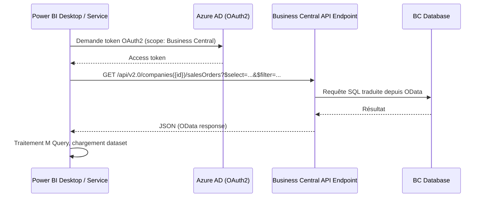
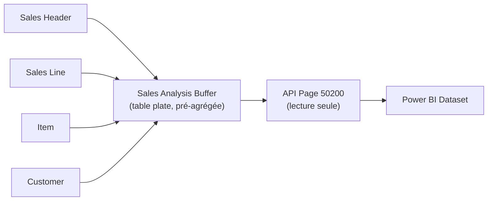

# Power BI et Business Central — côté développeur AL

## Objectifs pédagogiques

À l'issue de ce module, vous serez capable de :

1. **Exposer** des données Business Central à Power BI via des API pages et des vues OData correctement structurées
2. **Implémenter** une table buffer alimentée par job queue avec logique d'update incrémental et gestion d'erreurs
3. **Concevoir** des pages AL dédiées au reporting, distinctes des pages transactionnelles, avec une comparaison raisonnée des approches (API page directe, buffer, Query Object)
4. **Diagnostiquer** les problèmes courants d'intégration BC ↔ Power BI en lisant la telemetry Application Insights et les logs BC
5. **Appliquer** les bonnes pratiques ISV pour maintenir la fiabilité des rapports en environnement SaaS multi-tenant

---

## Mise en situation

Vous êtes développeur AL dans une équipe qui gère une extension de gestion commerciale pour une ETI. Le directeur commercial veut un tableau de bord Power BI consolidant les commandes, les marges par article et l'évolution du carnet de commandes — avec actualisation automatique toutes les heures.

Première réaction intuitive : brancher Power BI directement sur les tables `Sales Header` et `Sales Line` via le connecteur BC natif, faire glisser quelques mesures, et boucler.

En pratique, c'est rarement aussi simple. Les tables standard ne sont pas toujours exposées comme API, les jointures lourdes font exploser les temps de connexion, et les permissions d'accès aux données varient selon le tenant client. En quelques semaines, les rapports deviennent lents, instables ou incomplets — et c'est le développeur AL qu'on appelle pour expliquer pourquoi.

Ce module couvre exactement ce périmètre : comment exposer proprement les données BC à Power BI, quels leviers AL permettent de contrôler la qualité du dataset, comment implémenter le pattern buffer + job queue de bout en bout, et comment diagnostiquer les problèmes en production avec la telemetry.

---

## Contexte et problématique

Power BI et Business Central s'intègrent de manière native dans l'écosystème Microsoft 365, mais "natif" ne veut pas dire "sans effort développeur". Il y a deux niveaux à distinguer clairement.

**Ce que fait Microsoft out-of-the-box :** BC embarque un ensemble de rapports Power BI pré-construits accessibles depuis les pages BC (facturation, achats, stock...). Ces rapports s'appuient sur des API pages standard publiées par Microsoft et des datasets gérés dans Power BI Service. Pour un utilisateur, ça fonctionne de manière transparente.

**Ce que vous devez construire en tant que développeur AL :** dès que l'extension publie de la donnée métier personnalisée, les tables custom n'existent pas dans les API Microsoft. Si vous ne les exposez pas explicitement, Power BI ne les voit pas — point. Et même quand vous les exposez, la façon dont vous le faites détermine entièrement les performances et la fiabilité du reporting.

La problématique centrale est donc celle-ci : **comment concevoir des objets AL dont le rôle premier est d'être une source de données propre pour Power BI**, sans contaminer les pages transactionnelles et sans créer de requêtes OData qui mettent à genoux le serveur BC ?

---

## Comment Power BI se connecte à Business Central

Avant d'écrire une ligne d'AL, il faut comprendre ce que Power BI fait concrètement quand il "se connecte" à BC.



Ce que ce schéma illustre : Power BI parle **OData** à BC. Il envoie des requêtes HTTP avec des paramètres `$select`, `$filter`, `$top`, `$expand` — et BC les traduit en requêtes sur la base de données. Chaque rafraîchissement du dataset déclenche une (ou plusieurs) de ces requêtes.

💡 **Point clé** — Power BI ne voit que ce que BC expose comme **API page** ou **OData web service**. Une table AL sans page exposée est invisible pour Power BI, même si elle contient des milliers de lignes de données métier.

Il existe deux mécanismes d'exposition :

| Mécanisme | Propriété AL | Quand l'utiliser |
|---|---|---|
| **API Page** | `PageType = API` | Recommandé pour les nouvelles extensions — endpoint structuré, versionnable |
| **OData Web Service** | Publication via table `Web Service` | Compatibilité avec l'existant NAV/BC — moins préférable en greenfield |

La tendance lourde depuis BC 2020+ est d'utiliser les API pages. Les OData web services publiés manuellement restent disponibles mais sont plus difficiles à maintenir dans un contexte multi-tenant SaaS.

---

## Concevoir une API Page dédiée au reporting

### Pourquoi séparer les pages API des pages UI

C'est le premier réflexe à avoir : **ne jamais brancher Power BI sur une page UI existante en la transformant en API**. Les pages UI sont conçues pour l'interaction utilisateur — elles embarquent des calculs, des triggers, des champs calculés conditionnels qui ont du sens dans un contexte transactionnel mais sont coûteux à exécuter sur des milliers de lignes en lecture seule.

Une page API pour Power BI doit être pensée comme une **vue dénormalisée, optimisée lecture** — proche de ce qu'on ferait avec une vue SQL matérialisée dans un contexte analytique.

### Structure d'une API Page AL

```al
page 50200 "Sales Analysis API"
{
    PageType = API;
    APIPublisher = 'contoso';
    APIGroup = 'reporting';
    APIVersion = 'v1.0';
    EntityName = 'salesAnalysis';
    EntitySetName = 'salesAnalyses';
    SourceTable = "Sales Analysis Buffer";
    Extensible = false;
    ODataKeyFields = SystemId;

    layout
    {
        area(Content)
        {
            repeater(Group)
            {
                field(id; Rec.SystemId) { }
                field(documentNo; Rec."Document No.") { }
                field(customerNo; Rec."Customer No.") { }
                field(customerName; Rec."Customer Name") { }
                field(itemNo; Rec."Item No.") { }
                field(quantity; Rec.Quantity) { }
                field(salesAmountLCY; Rec."Sales Amount (LCY)") { }
                field(costAmountLCY; Rec."Cost Amount (LCY)") { }
                field(marginPct; Rec."Margin %") { }
                field(postingDate; Rec."Posting Date") { }
            }
        }
    }
}
```

**`APIPublisher`, `APIGroup`, `APIVersion`** forment l'URL finale de l'endpoint : `/api/contoso/reporting/v1.0/companies({id})/salesAnalyses`. Ces trois propriétés sont obligatoires et doivent être stables — les changer casse les datasets Power BI existants chez vos clients.

**`ODataKeyFields = SystemId`** — utiliser le `SystemId` comme clé OData est une bonne pratique. C'est une clé stable, unique, gérée par BC, qui évite les problèmes de clés composites mal supportées par certains connecteurs Power BI.

**`Extensible = false`** sur une page API de reporting est souvent une décision volontaire : vous contrôlez exactement ce qui est exposé, sans risque qu'une autre extension ajoute des champs qui dégradent les performances.

---

## La table buffer : l'intermédiaire intelligent

### Pourquoi un buffer plutôt que des jointures OData

Plutôt que de laisser Power BI faire des jointures OData entre `Sales Header`, `Sales Line`, `Item`, `Customer` au moment du refresh, vous pré-calculez les données dans une table buffer lors des processus métier (posting, batch nocturne). Power BI lit une structure plate et légère.



⚠️ **Comportement contre-intuitif** — On pourrait croire que `$expand` OData suffit à joindre plusieurs entités depuis Power BI. Techniquement oui, mais chaque `$expand` génère des requêtes supplémentaires et peut multiplier le temps de refresh par 3 à 10 sur des volumes réels.

Pour donner des ordres de grandeur concrets, voici comment les trois approches se comparent en conditions réelles (tenant avec ~200 000 lignes de vente) :

| Approche | Temps de refresh typique | Complexité AL | Maintenabilité | Cas d'usage idéal |
|---|---|---|---|---|
| **API page directe** (tables transact.) | 4–7 min, timeout fréquent | Faible | Fragile en volume | Prototypes, faibles volumes (<10k lignes) |
| **API page + buffer pré-calculé** | 15–30 sec | Moyenne | Excellente | Production SaaS, ISV, multi-tenant |
| **Query Object OData** | 30–90 sec | Moyenne | Bonne | Agrégats purs sans historique fin |
| **API page directe + `$expand`** | 2–4 min, instable | Faible | Très fragile | À éviter en production |

💡 Le buffer n'est pas la réponse universelle : pour un dataset analytique avec des totaux mensuels par dimension, un Query Object délègue l'agrégation à SQL et évite de maintenir une table supplémentaire. Pour des données ligne-à-ligne avec des calculs métier complexes, le buffer reste le choix solide.

### Définition de la table buffer

```al
table 50200 "Sales Analysis Buffer"
{
    Caption = 'Sales Analysis Buffer';
    DataClassification = CustomerContent;

    fields
    {
        field(1; "Entry No."; Integer) { AutoIncrement = true; }
        field(2; "Source Entry No."; Integer) { }
        field(3; "Posting Date"; Date) { }
        field(4; "Customer No."; Code[20]) { }
        field(5; "Customer Name"; Text[100]) { }
        field(6; "Item No."; Code[20]) { }
        field(7; "Document No."; Code[20]) { }
        field(8; "Quantity"; Decimal) { }
        field(9; "Sales Amount (LCY)"; Decimal) { }
        field(10; "Cost Amount (LCY)"; Decimal) { }
        field(11; "Margin %"; Decimal) { }
        field(12; "Last Updated At"; DateTime) { }
        field(13; SystemId; Guid)
        {
            DataClassification = SystemMetadata;
        }
    }

    keys
    {
        key(PK; "Entry No.") { Clustered = true; }
        key(BySourceEntry; "Source Entry No.") { }
        key(ByDate; "Posting Date") { }
        key(ByCustomer; "Customer No.", "Posting Date") { }
        key(ByItem; "Item No.", "Posting Date") { }
    }
}
```

🧠 **Concept fondamental** — En BC SaaS (Azure SQL), les index AL correspondent à des index SQL réels. Un filtre OData sur `postingDate` sans index génère un full table scan à chaque refresh Power BI. Sur une table de 500 000 lignes, c'est la différence entre 2 secondes et 45 secondes de temps de réponse.

La clé `BySourceEntry` sur le champ `"Source Entry No."` est celle qui rend possible la logique incrémentale — retrouver rapidement si une entrée source existe déjà dans le buffer avant de décider de l'insérer ou la mettre à jour.

---

## Alimenter le buffer : job queue et logique incrémentale

C'est la pièce manquante de beaucoup d'implémentations. Avoir une table buffer sans mécanisme d'alimentation fiable, c'est avoir un moteur sans carburant.

### La codeunit d'alimentation

```al
codeunit 50200 "Sales Buffer Refresh Mgt."
{
    procedure RefreshBuffer(FullRefresh: Boolean)
    var
        SalesInvoiceLine: Record "Sales Invoice Line";
        BufferEntry: Record "Sales Analysis Buffer";
        Customer: Record Customer;
        Item: Record Item;
        LastEntryNo: Integer;
    begin
        if FullRefresh then begin
            BufferEntry.DeleteAll();
            LastEntryNo := 0;
        end else
            LastEntryNo := GetLastProcessedEntryNo();

        SalesInvoiceLine.SetFilter("Entry No.", '>%1', LastEntryNo);
        SalesInvoiceLine.SetLoadFields(
            "Entry No.", "Document No.", "Bill-to Customer No.",
            "No.", Quantity, Amount, "Unit Cost (LCY)", "Posting Date"
        );

        if not SalesInvoiceLine.FindSet() then
            exit;

        repeat
            // Vérifier si l'entrée existe déjà (cas de rejeu)
            BufferEntry.SetRange("Source Entry No.", SalesInvoiceLine."Entry No.");
            if BufferEntry.FindFirst() then begin
                // Update incrémental : mettre à jour si la valeur a changé
                UpdateBufferEntry(BufferEntry, SalesInvoiceLine);
            end else begin
                // Nouvelle entrée
                InsertBufferEntry(SalesInvoiceLine);
            end;
        until SalesInvoiceLine.Next() = 0;

        SetLastProcessedEntryNo(SalesInvoiceLine."Entry No.");
    end;

    local procedure InsertBufferEntry(SalesInvLine: Record "Sales Invoice Line")
    var
        BufferEntry: Record "Sales Analysis Buffer";
        Customer: Record Customer;
        Item: Record Item;
        SalesAmount: Decimal;
        CostAmount: Decimal;
    begin
        SalesAmount := SalesInvLine.Amount;
        CostAmount := SalesInvLine.Quantity * SalesInvLine."Unit Cost (LCY)";

        BufferEntry.Init();
        BufferEntry."Source Entry No." := SalesInvLine."Entry No.";
        BufferEntry."Document No." := SalesInvLine."Document No.";
        BufferEntry."Posting Date" := SalesInvLine."Posting Date";
        BufferEntry."Customer No." := SalesInvLine."Bill-to Customer No.";
        BufferEntry."Item No." := SalesInvLine."No.";
        BufferEntry.Quantity := SalesInvLine.Quantity;
        BufferEntry."Sales Amount (LCY)" := SalesAmount;
        BufferEntry."Cost Amount (LCY)" := CostAmount;
        if SalesAmount <> 0 then
            BufferEntry."Margin %" := Round((SalesAmount - CostAmount) / SalesAmount * 100, 0.01);
        BufferEntry."Last Updated At" := CurrentDateTime();

        // Enrichissement depuis les tables liées
        if Customer.Get(SalesInvLine."Bill-to Customer No.") then
            BufferEntry."Customer Name" := Customer.Name;

        BufferEntry.Insert(true);
    end;

    local procedure UpdateBufferEntry(var BufferEntry: Record "Sales Analysis Buffer"; SalesInvLine: Record "Sales Invoice Line")
    begin
        // Mise à jour uniquement si les valeurs ont changé (évite les écritures inutiles)
        if (BufferEntry."Sales Amount (LCY)" = SalesInvLine.Amount) and
           (BufferEntry.Quantity = SalesInvLine.Quantity)
        then
            exit;

        BufferEntry."Sales Amount (LCY)" := SalesInvLine.Amount;
        BufferEntry.Quantity := SalesInvLine.Quantity;
        BufferEntry."Cost Amount (LCY)" := SalesInvLine.Quantity * SalesInvLine."Unit Cost (LCY)";
        if BufferEntry."Sales Amount (LCY)" <> 0 then
            BufferEntry."Margin %" := Round(
                (BufferEntry."Sales Amount (LCY)" - BufferEntry."Cost Amount (LCY)") /
                BufferEntry."Sales Amount (LCY)" * 100, 0.01);
        BufferEntry."Last Updated At" := CurrentDateTime();
        BufferEntry.Modify(true);
    end;

    local procedure GetLastProcessedEntryNo(): Integer
    var
        SetupRec: Record "Sales Buffer Setup";
    begin
        if SetupRec.Get() then
            exit(SetupRec."Last Processed Entry No.");
        exit(0);
    end;

    local procedure SetLastProcessedEntryNo(EntryNo: Integer)
    var
        SetupRec: Record "Sales Buffer Setup";
    begin
        if not SetupRec.Get() then begin
            SetupRec.Init();
            SetupRec.Insert();
        end;
        SetupRec."Last Processed Entry No." := EntryNo;
        SetupRec.Modify();
    end;
}
```

Quelques décisions de conception à noter ici :

**`SetLoadFields`** est systématique — on ne charge que les champs nécessaires au calcul. Sur des tables à plusieurs dizaines de champs comme `Sales Invoice Line`, c'est un gain significatif en volume de données transférées depuis SQL.

**La logique incrémentale** repose sur un pointeur `"Last Processed Entry No."` stocké dans une table de configuration. À chaque exécution, on reprend là où on s'est arrêté. Résultat : un refresh qui prend 30 secondes la première fois (full) prend 2 secondes les fois suivantes si peu d'entrées nouvelles.

**L'idempotence** : si le job est rejoué (erreur, redémarrage), la vérification `BufferEntry.FindFirst()` par `"Source Entry No."` garantit qu'on ne crée pas de doublons — on met à jour l'entrée existante.

### Enregistrer le job queue depuis AL

```al
codeunit 50201 "Sales Buffer Job Queue Setup"
{
    procedure CreateOrUpdateJobQueueEntry()
    var
        JobQueueEntry: Record "Job Queue Entry";
        JobQueueMgt: Codeunit "Job Queue Management";
    begin
        // Chercher si une entrée existe déjà pour cette codeunit
        JobQueueEntry.SetRange("Object Type to Run", JobQueueEntry."Object Type to Run"::Codeunit);
        JobQueueEntry.SetRange("Object ID to Run", Codeunit::"Sales Buffer Refresh Mgt.");
        if not JobQueueEntry.FindFirst() then begin
            JobQueueEntry.Init();
            JobQueueEntry."Object Type to Run" := JobQueueEntry."Object Type to Run"::Codeunit;
            JobQueueEntry."Object ID to Run" := Codeunit::"Sales Buffer Refresh Mgt.";
            JobQueueEntry.Insert(true);
        end;

        // Configuration : toutes les 30 minutes, de 6h à 23h
        JobQueueEntry."Run on Mondays" := true;
        JobQueueEntry."Run on Tuesdays" := true;
        JobQueueEntry."Run on Wednesdays" := true;
        JobQueueEntry."Run on Thursdays" := true;
        JobQueueEntry."Run on Fridays" := true;
        JobQueueEntry."Starting Time" := 060000T;  // 06:00
        JobQueueEntry."Ending Time" := 230000T;    // 23:00
        JobQueueEntry."No. of Minutes between Runs" := 30;
        JobQueueEntry."Maximum No. of Attempts to Run" := 3;
        JobQueueEntry.Description := 'Sales Analysis Buffer - Incremental Refresh';

        // Paramètre : false = refresh incrémental (true = full refresh)
        JobQueueEntry."Parameter String" := 'INCREMENTAL';
        JobQueueEntry.Modify(true);

        JobQueueMgt.SetJobQueueEntryStatus(JobQueueEntry, JobQueueEntry.Status::Ready);
    end;
}
```

💡 **Point clé sur `"Parameter String"`** — Documenter systématiquement les valeurs possibles dans un commentaire ou une table de référence. Un job queue avec un paramètre opaque devient incompréhensible 6 mois plus tard lors d'un incident support à 23h.

---

## Query objects : l'alternative pour les agrégats purs

Pour des cas purement analytiques avec des agrégations côté BC, les **Query objects** AL offrent une alternative intéressante aux API pages avec buffer. Un query object permet d'exprimer une jointure et une agrégation directement en AL, et BC la traduit en SQL optimisé avec GROUP BY.

```al
query 50200 "Sales by Customer Monthly"
{
    QueryType = Normal;
    Caption = 'Sales by Customer Monthly';

    elements
    {
        dataitem(SalesInvoiceLine; "Sales Invoice Line")
        {
            column(CustomerNo; "Bill-to Customer No.") { }
            column(PostingYear; "Posting Date")
            {
                Method = Year;
            }
            column(PostingMonth; "Posting Date")
            {
                Method = Month;
            }
            column(TotalAmount; Amount)
            {
                Method = Sum;
            }
            column(TotalCostLCY; "Unit Cost (LCY)")
            {
                Method = Sum;
            }
            column(LineCount; "Entry No.")
            {
                Method = Count;
            }
        }
    }
}
```

Ce query object peut être exposé comme OData Web Service — ce n'est pas une API page mais il est accessible via le même endpoint. La requête SQL générée contient un `GROUP BY` natif, ce qui est fondamentalement plus efficace que charger des millions de lignes brutes dans Power BI et agréger en DAX.

**Quand choisir le Query Object plutôt que le buffer ?** Quand les données sont déjà dans des tables standard BC, que vous n'avez pas besoin de calculs AL complexes, et que les agrégats sont suffisamment simples pour être exprimés en `Sum/Count/Average/Year/Month`. Si vous devez joindre des tables custom, enrichir avec de la logique métier AL, ou gérer des suppressions, le buffer reste plus adapté.

---

## Contrôler ce que Power BI peut lire : permissions et sécurité

### La couche permission en AL

Quand Power BI se connecte à BC, il le fait avec les credentials de l'utilisateur qui a configuré la connexion (ou d'un service account). Cet utilisateur doit avoir les permissions AL adéquates sur les objets exposés.

```al
permissionset 50200 "Reporting Read"
{
    Assignable = true;
    Caption = 'Reporting - Read Only';

    Permissions =
        tabledata "Sales Analysis Buffer" = R,
        tabledata "Sales Buffer Setup" = R,
        page "Sales Analysis API" = X;
}
```

💡 **Point clé** — Un utilisateur Power BI a besoin de la permission `X` (execute) sur la page API **et** de la permission `R` (read) sur la table source. Sans les deux, BC renvoie un 401 ou un 403 que Power BI affiche souvent comme "table vide" ou "erreur de connexion" — ce qui rend le diagnostic difficile.

### Service-to-service (S2S) pour les refreshs automatisés

En environnement SaaS, les refreshs Power BI planifiés (toutes les heures, toutes les nuits) ne peuvent pas s'appuyer sur les credentials interactifs d'un utilisateur. Microsoft impose d'utiliser une **connexion service-to-service** via une App Registration Azure AD.

Les erreurs S2S les plus fréquentes suivent deux patterns : le token OAuth expiré (par défaut les tokens S2S ont une durée de 60 minutes, les refreshs Power BI plus longs peuvent les voir expirer en cours d'exécution) et les permissions BC non assignées à l'utilisateur de service après une mise à jour d'extension qui ajoute de nouvelles tables. Dans les deux cas, Power BI affiche une erreur générique `DataSource.Error` sans indiquer la cause précise — d'où l'importance de la telemetry.

Du côté AL, le développeur est souvent celui qui documente les prérequis d'installation — et c'est un point de friction fréquent lors des déploiements chez les clients.

---

## Optimiser les performances côté AL

### `$filter` et les index

Power BI envoie des requêtes OData filtrées par date, par entité, par statut. Ces filtres se traduisent en `WHERE` SQL côté BC. La table buffer définie plus haut intègre déjà les bonnes clés. Pour rappel du raisonnement : sans clé AL sur `"Posting Date"`, chaque refresh Power BI filtrée par date scanne la table entière. Sur 500 000 lignes, c'est la différence entre 2 secondes et 45 secondes par requête.

### Voilà à quoi ressemble une requête OData mal formée

```
# ❌ Requête mal formée — $expand imbriqué, aucun $select, pas de $filter
GET /api/contoso/reporting/v1.0/companies({id})/salesOrders
    ?$expand=salesOrderLines($expand=item($expand=itemLedgerEntries))

# Conséquences :
# - BC génère 3 requêtes SQL jointes au lieu d'une
# - Chaque salesOrder charge toutes ses lines, chaque line charge tout l'item,
#   chaque item charge toutes ses écritures stock
# - Sur 1000 commandes avec 20 lignes en moyenne = 20 000+ requêtes SQL implicites
# - Timeout OData (8 min) quasi-certain sur un tenant production

# ✅ Requête bien formée — $select plat sur un buffer, filtre par date
GET /api/contoso/reporting/v1.0/companies({id})/salesAnalyses
    ?$select=documentNo,customerNo,customerName,itemNo,salesAmountLCY,marginPct,postingDate
    &$filter=postingDate ge 2024-01-01

# Conséquences :
# - Une seule requête SQL sur la table buffer
# - Index sur "Posting Date" → pas de full scan
# - Seuls les champs sélectionnés sont transférés (~60% de volume en moins)
```

L'impact réseau est direct : une requête avec `$expand` imbriqué sur des tables transactionnelles génère une réponse JSON de plusieurs dizaines de Mo avec des structures imbriquées que Power BI doit ensuite déplier. La même donnée pré-agrégée dans un buffer plat tient dans quelques centaines de Ko.

### Limiter le volume avec `$top` et la pagination

BC impose une limite de résultats par requête OData (souvent 20 000 lignes par défaut en SaaS). Si votre dataset dépasse ce seuil, Power BI doit paginer — ce qui multiplie les requêtes. Deux approches côté AL pour gérer cela :

1. **Pré-agréger** dans la table buffer — au lieu de stocker des lignes individuelles, stocker des agrégats mensuels par client/article
2. **Exposer plusieurs endpoints** spécialisés — par exemple une API pour les données 12 derniers mois, une autre pour les archives

---

## Cas réel en entreprise

### Contexte

Un ISV BC développe une extension de gestion de projets (time tracking, facturation à l'avancement). Les clients veulent un dashboard Power BI affichant : avancement des projets, heures consommées vs budgetées, rentabilité par type de prestation.

### Ce qui a été fait : avant et après

**Avant refactoring** — connexion Power BI directe sur les tables transactionnelles via OData web services :

```al
// ❌ Code initial — API page sur la table transactionnelle directe
page 50100 "Project Time Entries API (old)"
{
    PageType = API;
    SourceTable = "Project Time Entry";  // table avec 2M+ lignes

    layout
    {
        area(Content)
        {
            repeater(Group)
            {
                field(id; Rec.SystemId) { }
                field(projectNo; Rec."Project No.") { }
                field(hours; Rec."Quantity (Hours)") { }
                field(billedAmount; Rec."Billed Amount") { }
                // Champ calculé dans un trigger → exécuté pour chaque ligne OData ⚠️
                field(marginPct; Rec."Margin %")
                {
                    trigger OnAfterGetCurrRecord()
                    begin
                        // Recalcul de la marge à chaque lecture OData — catastrophique
                        Rec."Margin %" := CalculateMarginForEntry(Rec);
                    end;
                }
            }
        }
    }
}
```

Résultat : refresh Power BI de 4 à 7 minutes, échecs fréquents sur les tenants avec plus de 100 000 entrées, timeouts OData en production.

**Après refactoring** — trois API pages dédi
