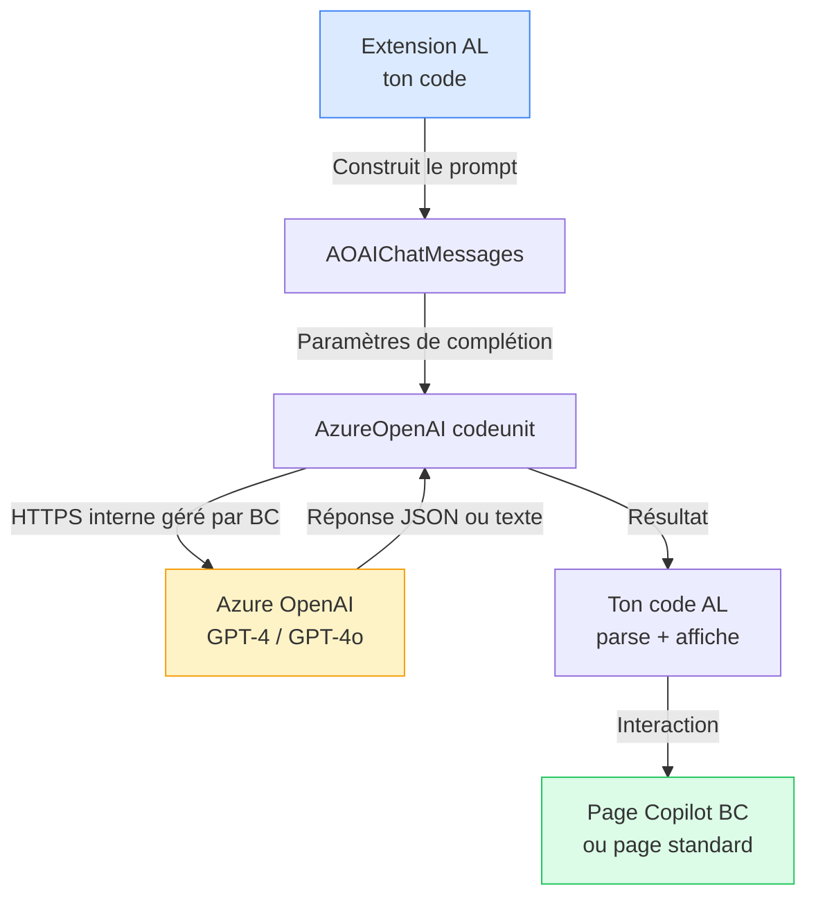

# Copilot et IA dans Business Central

## Objectifs pédagogiques

À l'issue de ce module, tu seras capable de :

1. **Comprendre** l'architecture des fonctionnalités Copilot dans Business Central et leur lien avec Azure OpenAI
2. **Implémenter** une action Copilot personnalisée dans une extension AL en utilisant les objets `CopilotCapability` et `AzureOpenAI`
3. **Construire** un prompt engineering robuste côté AL pour produire des réponses cohérentes et exploitables
4. **Gérer** les erreurs, les limites de tokens et les cas de dégradation gracieuse dans un contexte IA
5. **Intégrer** une génération IA dans un flux métier existant avec une UX native `PromptDialog`

---

## Mise en situation

Tu travailles chez un intégrateur BC qui gère une vingtaine de clients PME. L'un d'eux — distributeur de matériel industriel — te contacte : ses commerciaux passent en moyenne 20 minutes à rédiger les descriptions de produits dans la fiche article, en copiant-collant depuis des fiches PDF fournisseur. Résultat : descriptions hétérogènes, souvent trop courtes, parfois franchement mauvaises.

La demande est simple : "Vous ne pouvez pas faire un bouton qui génère la description automatiquement ?" Jusque-là, la réponse aurait été "oui, avec une intégration custom vers OpenAI". Mais depuis que Microsoft a ouvert le framework Copilot dans BC 23+, la réponse est plus propre que ça.

Le vrai enjeu ici n'est pas technique au sens pur — c'est de comprendre **où s'insère le code AL dans la chaîne IA**, ce que Microsoft gère pour toi et ce que tu dois gérer toi-même, et pourquoi un prompt mal construit en AL va produire du contenu inutilisable même avec le meilleur modèle derrière.

---

## Contexte et problématique

### Ce que Microsoft a ouvert (et ce qu'il n'a pas ouvert)

Depuis Business Central 2023 Wave 2 (version 23), Microsoft expose un framework AL officiel pour intégrer des capacités IA dans les extensions. Ce framework repose sur un ensemble d'interfaces AL, de types système et de pages dédiées qui permettent à une extension de se brancher sur la couche Azure OpenAI de l'environnement BC — sans avoir besoin de gérer soi-même la connexion, les credentials, ni la conformité RGPD.

C'est le point clé à comprendre dès le départ : **tu n'appelles pas directement Azure OpenAI**. Tu passes par des objets AL (`AzureOpenAI`, `AOAIChatMessages`, `AOAIChatCompletionParams`, etc.) que Microsoft fournit dans la plateforme. La connexion, l'authentification, la traçabilité et le consentement sont gérés par le tenant BC. En tant que développeur AL, tu construis le prompt, tu appelles la complétion, tu interprètes la réponse.

Ce que Microsoft ne gère **pas** pour toi : la qualité de ton prompt, la robustesse de ton parsing, la gestion des cas limites et l'UX de l'interaction.



### Pourquoi ne pas appeler OpenAI directement via `HttpClient` ?

On pourrait. AL supporte les appels HTTP et certaines extensions en production font exactement ça — elles appellent directement l'API OpenAI avec une clé stockée dans une setup table. C'est techniquement fonctionnel, mais c'est contourner le framework, et ça crée plusieurs problèmes concrets :

- La clé API doit être stockée quelque part (table, key vault), ce qui introduit un risque sécurité réel
- Aucune traçabilité intégrée dans BC (Copilot analytics, audit trail)
- Non éligible à l'affichage dans la page Copilot native de BC
- Risque de non-conformité AppSource si tu publies une extension

Pour un usage interne one-shot, c'est discutable. Pour une extension destinée à plusieurs clients ou à AppSource, le framework officiel est la seule bonne réponse.

---

## Architecture Copilot dans une extension AL

### Les objets à connaître

Le framework Copilot dans BC repose sur une poignée d'objets système que tu vas utiliser directement dans ton AL :

| Objet | Type | Rôle |
|---|---|---|
| `AzureOpenAI` | Codeunit système | Point d'entrée principal pour déclencher une complétion |
| `AOAIChatMessages` | Codeunit système | Accumule les messages (system, user, assistant) du thread |
| `AOAIChatCompletionParams` | Codeunit système | Paramètres de complétion : température, max tokens, etc. |
| `AOAIOperationResponse` | Codeunit système | Contient le statut et le résultat brut de la complétion |
| `CopilotCapability` | Codeunit système | Enregistrement et vérification des capabilities IA |

En plus de ces objets, tu vas déclarer ta **Copilot Capability** via une extension d'enum — une sorte d'enregistrement auprès du framework BC, qui permet à l'administrateur de l'activer ou la désactiver depuis la page **Copilot & AI Capabilities** du tenant.

### Déclarer une Copilot Capability

Avant d'écrire une seule ligne de logique IA, il faut enregistrer ta fonctionnalité. C'est une bonne pratique et c'est aussi obligatoire pour AppSource.

```al
enumextension 50100 "Copilot Capability Ext" extends "Copilot Capability"
{
    value(50100; "Generate Item Description")
    {
        Caption = 'Generate Item Description';
    }
}

codeunit 50100 "Item Desc. Copilot Install"
{
    Subtype = Install;

    trigger OnInstallAppPerCompany()
    begin
        RegisterCapability();
    end;

    local procedure RegisterCapability()
    var
        CopilotCapability: Codeunit "Copilot Capability";
        LearnMoreUrlTxt: Label 'https://example.com/copilot-help', Locked = true;
    begin
        if not CopilotCapability.IsCapabilityRegistered(Enum::"Copilot Capability"::"Generate Item Description") then
            CopilotCapability.RegisterCapability(
                Enum::"Copilot Capability"::"Generate Item Description",
                LearnMoreUrlTxt);
    end;
}
```

⚠️ **La capability doit être déclarée dans un codeunit Install ou Upgrade.** Si tu la déclares ailleurs — par exemple dans le premier appel utilisateur — elle peut ne pas apparaître dans la page d'administration BC et l'administrateur ne peut pas la contrôler.

---

## Construction progressive — De la preuve de concept à la version production

### V1 — Complétion minimale, voir si ça marche

Commençons par le plus simple : appeler le modèle avec un prompt basique et récupérer du texte. L'objectif ici est juste de valider que la plomberie fonctionne dans ton environnement.

```al
codeunit 50101 "Item Desc. Generator"
{
    procedure GenerateDescription(Item: Record Item): Text
    var
        AzureOpenAI: Codeunit "Azure OpenAI";
        AOAIChatMessages: Codeunit "AOAI Chat Messages";
        AOAIChatCompletionParams: Codeunit "AOAI Chat Completion Params";
        AOAIOperationResponse: Codeunit "AOAI Operation Response";
        SystemPrompt: Text;
        UserPrompt: Text;
    begin
        SystemPrompt := 'You are a product description writer for an industrial equipment distributor. ' +
                        'Write clear, professional descriptions in French.';

        UserPrompt := StrSubstNo(
            'Write a product description for: %1\nCategory: %2\nUnit of measure: %3',
            Item.Description,
            Item."Item Category Code",
            Item."Base Unit of Measure");

        AOAIChatMessages.AddSystemMessage(SystemPrompt);
        AOAIChatMessages.AddUserMessage(UserPrompt);

        AOAIChatCompletionParams.SetMaxTokens(500);
        AOAIChatCompletionParams.SetTemperature(0.7);

        AzureOpenAI.SetAuthorization(Enum::"AOAI Model Type"::"Chat Completions", 'gpt-4o');
        AzureOpenAI.GenerateChatCompletion(AOAIChatMessages, AOAIChatCompletionParams, AOAIOperationResponse);

        if AOAIOperationResponse.IsSuccess() then
            exit(AOAIOperationResponse.GetResult());

        Error('Copilot generation failed: %1', AOAIOperationResponse.GetError());
    end;
}
```

Ce code appelle le modèle `gpt-4o` disponible dans le tenant BC. Il n'y a pas de clé à gérer — `SetAuthorization` avec seulement le type et le nom du modèle suffit quand le tenant est correctement configuré pour Copilot.

💡 **Pour tester en sandbox**, assure-toi que Copilot est activé dans les paramètres du tenant BC (Copilot & AI Capabilities → Enable) et que l'environnement est dans une région Azure OpenAI disponible (US East, Europe West principalement).

### V2 — Prompt engineering sérieux, paramètres et parsing de la réponse

La V1 retourne du texte libre — ce qui est déjà utile, mais fragile en contexte métier. Si tu veux générer une description courte, une description longue et des mots-clés, tu dois structurer la réponse du modèle et maîtriser les paramètres de complétion.

**Paramètres de complétion** : avant de s'attaquer au parsing, `AOAIChatCompletionParams` expose deux paramètres clés à calibrer ensemble :

```al
local procedure SetCompletionParams(var Params: Codeunit "AOAI Chat Completion Params"; ForJson: Boolean)
begin
    if ForJson then begin
        Params.SetTemperature(0.2);   // Précision avant créativité pour du JSON
        Params.SetMaxTokens(400);      // court_desc + long_desc + 5 keywords = ~300-400 tokens
    end else begin
        Params.SetTemperature(0.7);   // Texte libre : équilibre cohérence/variété
        Params.SetMaxTokens(500);
    end;
end;
```

🧠 **Concept clé — température et déterminisme** : la température contrôle l'aléatoire du modèle. À 0.0, le modèle est quasi-déterministe (même input → même output). À 1.0+, il est créatif mais imprévisible. Pour du JSON structuré, descends à 0.2-0.3. Pour du texte descriptif, 0.5-0.7 est le bon équilibre. Au-delà de 0.8, le risque d'artefacts dans la structure JSON monte significativement.

**Structurer la réponse en JSON** : la technique standard est de demander explicitement un format JSON dans le prompt système, puis de parser côté AL.

```al
SystemPrompt :=
    'You are a product description assistant. Always respond with a valid JSON object ' +
    'following this exact structure, with no additional text before or after:' +
    '{' +
    '  "short_description": "max 80 chars",' +
    '  "long_description": "2-3 sentences",' +
    '  "keywords": ["kw1", "kw2", "kw3"]' +
    '}';
```

⚠️ **Le modèle ne produit pas toujours du JSON valide**, même si tu le demandes explicitement. Les cas problématiques courants : le modèle ajoute une phrase d'introduction ("Here is the JSON:"), ou il encadre le JSON dans des backticks Markdown. Il faut un nettoyage préalable :

```al
local procedure CleanJsonResponse(Raw: Text): Text
var
    Cleaned: Text;
begin
    Cleaned := Raw;
    Cleaned := Cleaned.Replace('```json', '').Replace('```', '');
    Cleaned := Cleaned.Trim();
    exit(Cleaned);
end;
```

**Parsing complet avec validation** : voici le flux entier — nettoyage, lecture JSON, extraction des champs, fallback texte brut si le parsing échoue :

```al
[TryFunction]
local procedure TryParseResult(RawJson: Text; var ShortDesc: Text; var LongDesc: Text; var Keywords: Text): Boolean
var
    JObject: JsonObject;
    JToken: JsonToken;
    JArray: JsonArray;
    KeywordList: Text;
    i: Integer;
begin
    if not JObject.ReadFrom(RawJson) then
        exit(false);

    if not JObject.Get('short_description', JToken) then
        exit(false);
    ShortDesc := JToken.AsValue().AsText();

    if not JObject.Get('long_description', JToken) then
        exit(false);
    LongDesc := JToken.AsValue().AsText();

    if JObject.Get('keywords', JToken) then begin
        JArray := JToken.AsArray();
        for i := 0 to JArray.Count() - 1 do begin
            JArray.Get(i, JToken);
            if KeywordList <> '' then
                KeywordList += ', ';
            KeywordList += JToken.AsValue().AsText();
        end;
        Keywords := KeywordList;
    end;

    exit(true);
end;

procedure ParseGenerationResult(RawJson: Text; var ShortDesc: Text; var LongDesc: Text; var Keywords: Text)
var
    Cleaned: Text;
    ParseOk: Boolean;
begin
    Cleaned := CleanJsonResponse(RawJson);
    ParseOk := TryParseResult(Cleaned, ShortDesc, LongDesc, Keywords);

    // Fallback texte brut si le JSON est définitivement invalide
    if not ParseOk then begin
        ShortDesc := CopyStr(Cleaned, 1, 80);
        LongDesc := Cleaned;
        Keywords := '';
    end;
end;
```

### V3 — Intégration dans une page Copilot native BC

Pour que l'expérience soit cohérente avec le reste de BC et éligible AppSource, ta fonctionnalité doit s'intégrer dans le pattern Copilot de BC : une page dédiée avec le panneau de prompt, la prévisualisation et les boutons Keep/Discard.

BC fournit pour ça le `PageType = PromptDialog`. BC gère automatiquement l'affichage du spinner pendant la génération, le layout en deux zones (prompt / résultat), et les boutons system Keep/Discard.

```al
page 50100 "Generate Item Description"
{
    PageType = PromptDialog;
    Caption = 'Generate Item Description with Copilot';
    IsPreview = true;

    layout
    {
        area(Prompt)
        {
            field(AdditionalContext; AdditionalContextTxt)
            {
                ApplicationArea = All;
                Caption = 'Additional context (optional)';
                MultiLine = true;
                ToolTip = 'Add any specific details you want Copilot to include.';
            }
        }

        area(Content)
        {
            field(GeneratedShortDesc; ShortDescriptionTxt)
            {
                ApplicationArea = All;
                Caption = 'Short Description';
                MultiLine = false;
            }
            field(GeneratedLongDesc; LongDescriptionTxt)
            {
                ApplicationArea = All;
                Caption = 'Long Description';
                MultiLine = true;
            }
            field(GeneratedKeywords; KeywordsTxt)
            {
                ApplicationArea = All;
                Caption = 'Keywords';
                MultiLine = false;
            }
        }
    }

    actions
    {
        area(SystemActions)
        {
            systemaction(Generate)
            {
                Caption = 'Generate';
                trigger OnAction()
                begin
                    RunGeneration();
                end;
            }
            systemaction(OK)
            {
                Caption = 'Keep it';
            }
            systemaction(Cancel)
            {
                Caption = 'Discard';
            }
        }
    }

    var
        CurrentItem: Record Item;
        AdditionalContextTxt: Text;
        ShortDescriptionTxt: Text[100];
        LongDescriptionTxt: Text[2048];
        KeywordsTxt: Text[500];

    procedure SetItem(Item: Record Item)
    begin
        CurrentItem := Item;
    end;

    local procedure RunGeneration()
    var
        Generator: Codeunit "Item Desc. Generator";
    begin
        CheckCopilotEnabled();
        Generator.GenerateWithRetry(CurrentItem, AdditionalContextTxt, ShortDescriptionTxt, LongDescriptionTxt, KeywordsTxt);
    end;

    local procedure CheckCopilotEnabled()
    var
        CopilotCapability: Codeunit "Copilot Capability";
    begin
        if not CopilotCapability.IsCapabilityActive(Enum::"Copilot Capability"::"Generate Item Description") then
            Error('This feature requires Copilot to be enabled. Please contact your administrator (Copilot & AI Capabilities settings).');
    end;
}
```

---

## Gestion des erreurs et dégradation gracieuse

Un des aspects les plus sous-estimés dans les développements IA : **que se passe-t-il quand ça ne marche pas ?**

Les points de défaillance sont multiples :

| Scénario | Comportement attendu |
|---|---|
| Azure OpenAI indisponible (5xx) | Message clair + possibilité de relancer manuellement |
| Quota de tokens dépassé (429) | Message explicatif + suggestion de réessayer dans X minutes |
| Réponse JSON invalide | Nettoyage + retry automatique (1 fois max) ou fallback texte brut |
| Timeout (>30s) | Timeout AL natif + message d'explication |
| Copilot désactivé par l'admin | Check préalable + message orientant vers les paramètres |

Le check Copilot désactivé doit se faire **avant** d'ouvrir la page de génération, pas après avoir essayé d'appeler le modèle. Sinon l'utilisateur attend une page qui ne peut pas fonctionner.

Pour le retry sur JSON invalide, le pattern le plus propre est un compteur de tentative avec un prompt légèrement modifié en deuxième passe :

```al
procedure GenerateWithRetry(Item: Record Item; AdditionalContext: Text; var ShortDesc: Text; var LongDesc: Text; var Keywords: Text)
var
    AzureOpenAI: Codeunit "Azure OpenAI";
    AOAIChatMessages: Codeunit "AOAI Chat Messages";
    AOAIChatCompletionParams: Codeunit "AOAI Chat Completion Params";
    AOAIOperationResponse: Codeunit "AOAI Operation Response";
    Attempts: Integer;
    RawResult: Text;
    ParseOk: Boolean;
    StrictMode: Boolean;
begin
    Attempts := 0;
    repeat
        Attempts += 1;
        StrictMode := Attempts > 1;

        Clear(AOAIChatMessages);
        BuildMessages(AOAIChatMessages, Item, AdditionalContext, StrictMode);
        SetCompletionParams(AOAIChatCompletionParams, true);

        AzureOpenAI.SetAuthorization(Enum::"AOAI Model Type"::"Chat Completions", 'gpt-4o');
        AzureOpenAI.GenerateChatCompletion(AOAIChatMessages, AOAIChatCompletionParams, AOAIOperationResponse);

        if not AOAIOperationResponse.IsSuccess() then
            Error('Copilot generation failed: %1', AOAIOperationResponse.GetError());

        RawResult := CleanJsonResponse(AOAIOperationResponse.GetResult());
        ParseOk := TryParseResult(RawResult, ShortDesc, LongDesc, Keywords);
    until ParseOk or (Attempts >= 2);

    if not ParseOk then
        Error('Copilot could not generate a valid response after 2 attempts. Please try again or enter the description manually.');
end;
```

💡 **StrictMode** : en deuxième tentative, le prompt système ajoute une instruction renforcée ("Respond ONLY with the JSON object, no other text, no markdown formatting"). Cela règle la majorité des cas de backticks ou de phrase d'introduction ajoutée par le modèle.

---

## Cas réel en entreprise

### Déploiement chez le distributeur industriel

**Contexte** : 3 commerciaux, ~1500 articles en catalogue, description manuelle en moyenne 18 minutes par article lors d'une mise à jour catalogue.

**Ce qui a été mis en place** :

1. Extension AL avec `PromptDialog` sur la fiche article, déclenchée par une action "Generate Description with Copilot"
2. Prompt système en français, avec contexte métier (équipement industriel, ton B2B, normes sécurité à mentionner si applicable)
3. Prompt utilisateur construit dynamiquement depuis les champs BC : Description, Item Category, Vendor Item No., les 3 dernières lignes de texte étendu si elles existent
4. Résultat parsé en JSON : short (100 chars), long (500 chars), liste de 5 mots-clés SEO
5. Bouton "Keep" écrit directement dans les champs BC + table de log des générations (traçabilité)

**Résultats mesurés après 2 semaines** :

- Temps moyen de rédaction : 18 min → 4 min (l'utilisateur relit, ajuste, valide)
- Taux d'acceptation sans modification : ~60%
- Taux d'acceptation avec modification mineure : ~30%
- Taux de rejet complet (régénération ou saisie manuelle) : ~10%

**Ce qui a posé problème en prod** :

- Les articles avec une description BC très courte ("Vis M8", "Joint plat 50mm") produisaient des résultats génériques inutilisables → résolu en ajoutant un champ "contexte additionnel" sur la page PromptDialog et en rendant le bouton inactif si la description BC fait moins de 10 caractères
- Un client avait BC dans une région Azure sans Azure OpenAI disponible → la capability restait grisée. Solution : migration de l'environnement vers une région éligible (US East 2)

---

## Bonnes pratiques

**1. Déclare toujours ta capability dans un codeunit Install/Upgrade**
Ne jamais enregistrer la capability à la volée au premier appel utilisateur. Le framework BC s'attend à ce que ce soit fait à l'installation. Si tu oublies, la fonctionnalité n'apparaît pas dans la page d'administration et l'admin ne peut pas la contrôler.

**2. Construis des prompts avec des contraintes explicites**
"Write a description" → résultat aléatoire. "Write a description in 2 sentences, professional tone, in French, no marketing superlatives" → résultat exploitable. Plus le prompt est précis sur le format, la langue, la longueur et le style, moins tu as de surprises.

**3. Ne jamais afficher directement `GetResult()` sans nettoyage ni validation**
Le résultat brut peut contenir des artefacts (backticks, balises HTML, caractères échappés, commentaires du modèle). Passe toujours par une étape de nettoyage avant d'écrire dans une table BC.

**4. Calibre `SetMaxTokens` selon le besoin réel**
`SetMaxTokens(4000)` pour une description de produit est absurde et coûteux. Pour du texte descriptif court (80-500 chars), 150-500 tokens suffisent. Compte environ 100 tokens par champ texte moyen dans un JSON structuré. La limite influence aussi directement la vitesse de réponse.

**5. Log tes générations**
Crée une table de log minimale (`ItemNo`, `GeneratedAt`, `Model`, `PromptHash`, `WasAccepted`, `ApprovedBy`). Ça te permet de suivre la qualité dans le temps, de détecter les régressions si le modèle change, et de justifier l'usage auprès du client.

**6. Prévois toujours un chemin de contournement**
L'IA peut être indisponible, désactivée par l'admin, ou produire des résultats inutiles. L'utilisateur doit toujours pouvoir continuer son travail sans elle. Ne bloque jamais un flux métier sur une génération IA.

**7. Teste avec des données métier réelles dès le début**
Les prompts qui fonctionnent bien sur des données propres s'effondrent souvent sur des données réelles BC (descriptions tronquées, codes articles cryptiques, catégories vides). Teste avec un export réel de la table Item du client dès la phase de développement.

---

## Résumé

Le framework Copilot dans BC te permet de brancher une génération IA directement dans une extension AL, sans gérer toi-même la connexion à Azure OpenAI. Tu passes par les objets système (`AzureOpenAI`, `AOAIChatMessages`, `AOAIChatCompletionParams`), tu déclares une capability enregistrée dans le tenant, et tu construis l'expérience utilisateur dans une page `PromptDialog`.

La valeur réelle de ce travail se joue à deux endroits : la qualité du prompt (qui détermine 80% de la pertinence du résultat) et la robustesse du parsing avec fallback (qui détermine si ça tient en production). Le modèle, la connexion, la conformité RGPD — tout ça, BC le gère.

La suite logique de ce module amène vers la question plus large de l'architecture d'une solution AL complexe : comment organiser ces codeunits entre eux, comment gérer les dépendances entre extensions, et comment construire un socle technique maintenable sur le long terme — c'est ce que couvre le module suivant sur l'expertise AL et le rôle de lead technique ERP.

---

<!-- snippet
id: bc_copilot_register_capability
type: concept
tech: al
level: advanced
importance: high
format: knowledge
tags: copilot,capability,install,al,business-central
title: Enregistrer une Copilot Capability dans un codeunit Install
content: Une Copilot Capability doit être déclarée dans un codeunit Install (Subtype = Install) via CopilotCapability.RegisterCapability(). Si elle est enregistrée à la volée au premier appel utilisateur, elle n'apparaît pas dans la page "Copilot & AI Capabilities" et l'administrateur ne peut pas la contrôler. L'enum "Copilot Capability" doit être étendu avec une valeur propre à l'extension. Toujours vérifier IsCapabilityRegistered() avant d'appeler RegisterCapability() pour éviter les doublons lors de réinstallations.
description: L'enregistrement dans Install est obligatoire pour que la capability soit visible dans la page d'admin BC et contrôlable par l'administrateur du tenant.
-->

<!-- snippet
id: bc_copilot_set_authorization
type: command
tech: al
level: advanced
importance: high
format: knowledge
tags: copilot,azure-openai,al,authorization,model
title: Déclencher une complétion via le framework BC sans clé API
context: Le framework BC gère l'authentification Azure OpenAI du tenant. Ne pas utiliser HttpClient pour appeler OpenAI directement — cela contourne la traçabilité, la conformité RGPD et l'éligibilité AppSource.
command: AzureOpenAI.SetAuthorization(Enum::"AOAI Model Type"::"Chat Completions", '<MODEL_NAME>');
example: AzureOpenAI.SetAuthorization(Enum::"AOAI Model Type"::"Chat Completions", 'gpt-4o');
description: Pas de clé API à gérer — BC utilise les credentials du tenant Azure OpenAI. Le modèle doit être disponible dans la région Azure de l'environnement BC.
-->

<!-- snippet
id: bc_copilot_aoai_params
type: command
tech: al
level: advanced
importance: high
format: knowledge
tags: copilot,temperature,maxtokens,al,params
title: Configurer température et MaxTokens selon le type de sortie
context: Ces deux paramètres s'appliquent sur AOAIChatCompletionParams avant l'appel GenerateChatCompletion. Ils doivent être calibrés ensemble selon que la sortie attendue est du JSON structuré ou du texte libre.
command: Params.SetTemperature(<TEMPERATURE>); Params.SetMaxTokens(<MAX_TOKENS>);
example: AOAIChatCompletionParams.SetTemperature(0.2); AOAIChatCompletionParams.SetMaxTokens(400);
description: Pour du JSON structuré : température 0.2 + MaxTokens 300
