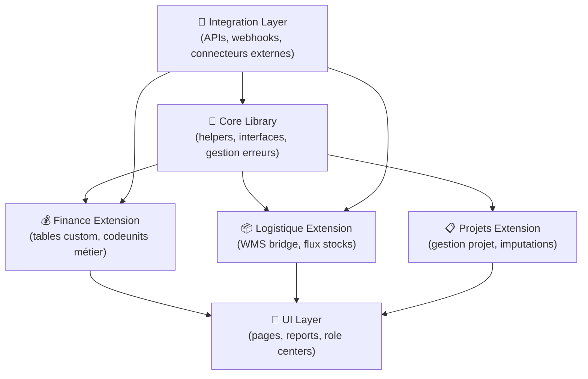
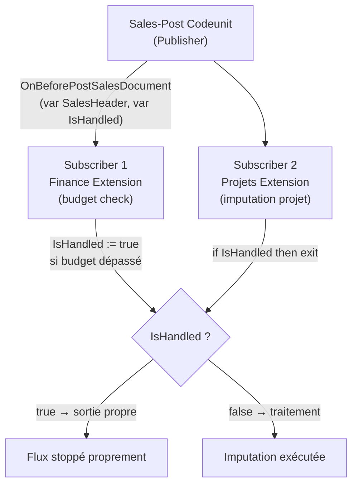

# Expertise AL / Lead technique ERP

## Objectifs pédagogiques

À l'issue de ce module, vous serez capable de :

1. **Concevoir** une architecture d'extensions AL scalable pour un projet BC multi-domaine
2. **Arbitrer** les choix de design pattern selon les contraintes métier, de maintenabilité et de performance
3. **Gouverner** la base de code d'une équipe AL en définissant des standards et des garde-fous techniques
4. **Anticiper** les points de rupture d'une architecture extension avant qu'ils n'atteignent la production
5. **Piloter** les décisions d'intégration entre BC et les systèmes tiers dans un SI d'entreprise réel

---

## Mise en situation

Vous prenez la responsabilité technique d'un projet Business Central pour un groupe industriel : 3 sociétés, 200 utilisateurs, un ERP déjà en production depuis 18 mois, et une équipe de 4 développeurs AL de niveaux hétérogènes.

Le projet hérite d'une base de 80 000 lignes AL écrites par deux prestataires différents. Il n'y a pas de revue de code formalisée. Les extensions se déploient directement en production quand "ça compile". Un bug de performance déclenché par un `FindSet` mal utilisé dans une boucle vient de bloquer la clôture mensuelle pendant 40 minutes.

Le client demande maintenant d'ajouter un module de gestion de projets couplé au module finance, une intégration avec son WMS externe via API, et de migrer une extension NAV C/AL encore active en OnPrem vers la SaaS.

C'est exactement le contexte dans lequel un lead technique AL intervient. Pas juste pour coder — mais pour décider, cadrer, prévenir, et tenir le cap sur la durée.

---

## Ce que le lead technique résout que le développeur AL ne résout pas seul

Un bon développeur AL sait écrire du code qui fonctionne. Un lead technique sait concevoir une architecture qui **continue de fonctionner** à mesure que le projet grossit, que l'équipe tourne, et que les besoins changent.

La différence n'est pas une question d'expérience — c'est une question de périmètre de pensée. Un développeur pense à la feature. Un lead pense à la feature dans le contexte de toutes les autres features, passées et futures.

Concrètement, le lead technique ERP porte trois responsabilités distinctes :

- **Décisions d'architecture** : découpage des extensions, dépendances entre apps, stratégie de données, gestion des interfaces
- **Standards d'équipe** : revues de code, conventions de nommage, gestion des objets partagés, processus de release
- **Arbitrages techniques** : quand deux solutions sont techniquement valides, décider laquelle est la bonne pour ce projet, ce client, cette équipe

---

## Architecture d'extensions : concevoir au bon niveau de granularité

### Le problème du monolithe déguisé

Le piège le plus courant sur les projets BC ambitieux : une seule extension qui grossit indéfiniment. Au bout de 18 mois, elle contient la gestion commerciale, la logistique, la finance custom, les états, les APIs, les interfaces UI — et personne n'ose plus y toucher sans avoir peur de casser quelque chose ailleurs.

Ce n'est pas une extension. C'est un monolithe déguisé en extension.

La question n'est pas "faut-il découper ?". La question est **"où couper, et selon quel critère ?"**

### Les axes de découpage

Il y a trois axes naturels pour découper une architecture d'extensions BC :

**1. Découpage par domaine métier**

Chaque domaine fonctionnel autonome devient une app distincte. Finance custom, logistique avancée, gestion de projets : chacune est responsable de son périmètre, avec ses propres tables, ses propres pages, ses propres codeunits.

```
[Core Library] ← partagé
      ↑               ↑               ↑
[Finance Ext]   [Logistique Ext]  [Projets Ext]
```

**2. Découpage par couche technique**

Séparer ce qui est infrastructure (interfaces génériques, helpers partagés, gestion des erreurs) de ce qui est métier. La couche "Core" contient les patterns réutilisables et les abstractions communes.

**3. Découpage par destinataire**

Dans un contexte ISV, distinguer ce qui est générique (vendable à tous les clients) de ce qui est spécifique (customisation d'un client particulier). Une app générique + une app de customisation client, l'une dépendant de l'autre.

Les dépendances entre extensions dans BC sont déclarées dans `app.json` via le tableau `dependencies`. Une extension A qui dépend de B doit être déployée après B, et ne peut pas exister si B est absent. Cette contrainte est réelle à l'installation et à la mise à jour : si B publie un breaking change, A casse. Concevoir les dépendances, c'est concevoir le graphe de déploiement.

### Illustration — Architecture réelle à 4 couches



Ce découpage a plusieurs avantages mesurables : chaque extension peut être testée indépendamment, déployée séparément, et maintenue sans risque de régression cross-domaine. En contrepartie, il faut gérer les interfaces entre couches avec rigueur — c'est le prix de la modularité.

---

## Patterns de conception AL à maîtriser

### Pattern Interface / Implémentation via événements

AL n'a pas d'interfaces au sens objet du terme, mais le système d'événements (publishers / subscribers) permet d'atteindre le même résultat : **découpler l'appelant de l'implémentation**.

La règle d'or : publier un événement à chaque point de variation métier. Ne jamais appeler directement la codeunit d'une autre app — publier un événement et laisser l'abonné décider.

Voici le flux complet publisher → subscribers, qui illustre aussi pourquoi `IsHandled` est critique dès qu'il y a plusieurs abonnés :



```al
// Dans l'extension Finance — publisher
[IntegrationEvent(false, false)]
procedure OnBeforePostSalesDocument(var SalesHeader: Record "Sales Header"; var IsHandled: Boolean)
begin
end;

// Subscriber 1 — Finance Extension (budget check)
[EventSubscriber(ObjectType::Codeunit, Codeunit::"Sales-Post", 'OnBeforePostSalesDocument', '', false, false)]
procedure HandleBudgetCheck(var SalesHeader: Record "Sales Header"; var IsHandled: Boolean)
begin
    if IsHandled then exit;
    // vérification budget — si dépassé, positionner IsHandled := true
    if IsBudgetExceeded(SalesHeader) then begin
        IsHandled := true;
        Error('Budget dépassé pour le projet associé.');
    end;
end;

// Subscriber 2 — Extension Projets (imputation projet)
[EventSubscriber(ObjectType::Codeunit, Codeunit::"Sales-Post", 'OnBeforePostSalesDocument', '', false, false)]
procedure HandleProjectImputation(var SalesHeader: Record "Sales Header"; var IsHandled: Boolean)
begin
    if IsHandled then exit;
    // logique d'imputation projet sans toucher au code Finance
end;
```

Ce pattern garantit que l'extension Finance n'a aucune connaissance de l'extension Projets. La dépendance est inversée : c'est Projets qui dépend de Finance, pas l'inverse.

⚠️ **Erreur fréquente** — Oublier `if IsHandled then exit;` en début de subscriber. Si deux abonnés traitent le même événement, le deuxième s'exécute même si le premier a déjà traité le cas et levé une erreur, pouvant produire des effets de bord invisibles.

### Pattern Repository / Service Layer

L'accès aux données ne doit jamais être éparpillé dans les pages et les rapports. Centraliser toute la logique de lecture / écriture dans des codeunits dédiées.

```al
codeunit 50100 "Project Repository"
{
    procedure GetActiveProjects(var ProjectHeader: Record "Project Header")
    begin
        ProjectHeader.Reset();
        ProjectHeader.SetRange(Status, ProjectHeader.Status::Active);
        // filtres centralisés ici, pas dans chaque page
    end;

    procedure CreateProjectFromSales(SalesHeader: Record "Sales Header"): Code[20]
    begin
        // logique métier centralisée, testable unitairement
    end;
}
```

Ce n'est pas du sur-engineering — c'est ce qui rend le code testable, et ce qui évite de retrouver 14 endroits différents dans le code avec des `SetRange` légèrement différents sur la même table.

### Pattern Command / Handler pour les actions complexes

Pour les actions métier à plusieurs étapes (validation → calcul → écriture → notification), structurer en handler distinct plutôt qu'en code inline dans un trigger `OnAction`.

```al
codeunit 50110 "Project Approval Handler"
{
    procedure ExecuteApproval(var ProjectHeader: Record "Project Header")
    var
        Validator: Codeunit "Project Validator";
        Calculator: Codeunit "Project Budget Calculator";
        Notifier: Codeunit "Project Notifier";
    begin
        Validator.ValidateForApproval(ProjectHeader);
        Calculator.CalculateFinalBudget(ProjectHeader);
        ProjectHeader.Status := ProjectHeader.Status::Approved;
        ProjectHeader.Modify(true);
        Notifier.SendApprovalNotification(ProjectHeader);
    end;
}
```

Le trigger `OnAction` de la page appelle `ExecuteApproval` et rien d'autre. La logique est testable, lisible, et modifiable sans toucher à la page.

---

## Performance : penser comme l'optimiseur SQL

Business Central s'appuie sur SQL Server (ou Azure SQL en SaaS). Chaque opération AL sur un record se traduit en requête SQL. Le lead technique doit être capable de lire une trace SQL et d'identifier la source d'un problème de performance AL.

### Les patterns qui tuent la performance

**Le N+1 dans les boucles**

```al
// ❌ Catastrophique sur 10 000 lignes
SalesLine.SetRange("Document No.", SalesHeader."No.");
if SalesLine.FindSet() then
    repeat
        Item.Get(SalesLine."No.");  // ← 1 requête SQL par ligne
        // traitement
    until SalesLine.Next() = 0;

// ✅ Correct : utiliser SetLoadFields pour ne charger que les champs nécessaires
SalesLine.SetLoadFields("No.", Quantity, "Unit Price");
SalesLine.SetRange("Document No.", SalesHeader."No.");
if SalesLine.FindSet() then
    repeat
        // traitement direct sur les champs chargés
    until SalesLine.Next() = 0;
```

**Le `FindSet` sans `SetRange`**

Un `FindSet()` sans filtre charge toute la table. Sur une table `Ledger Entry` avec 50 millions de lignes, c'est un timeout garanti. Chaque `FindSet` doit être précédé d'un `SetRange` ou `SetFilter` pertinent.

**Les champs non indexés en filtre critique**

Si une codeunit filtre fréquemment sur un champ qui n'est pas clé et n'a pas de clé secondaire définie, SQL fait un scan complet. Identifier ces cas et ajouter les clés secondaires nécessaires dans la table AL.

```al
key(Idx_Status_CustomerNo; Status, "Customer No.") { }
```

💡 **Astuce** — En SaaS BC, activer le **Query Performance Insight** dans Azure Portal pour voir les requêtes SQL les plus coûteuses générées par vos extensions. C'est la seule façon de diagnostiquer objectivement un problème de performance sans accès direct au serveur SQL.

### `SetLoadFields` : le levier le plus sous-utilisé

Depuis BC 2020, `SetLoadFields` permet de spécifier exactement quels champs doivent être chargés lors d'un `FindSet` ou `Get`. Sur une table avec des champs BLOB ou de nombreux champs texte, l'impact est immédiat.

```al
Customer.SetLoadFields("No.", Name, "Credit Limit (LCY)");
if Customer.FindSet() then
    repeat
        // seuls 3 champs sont chargés depuis SQL
    until Customer.Next() = 0;
```

Sur une boucle de 50 000 clients, la différence entre charger 3 champs et charger les 80 champs de la table Customer peut représenter plusieurs secondes.

---

## Gouvernance technique : structurer le travail d'équipe

### Conventions de nommage et espace d'objets

En contexte multi-développeur, l'absence de convention est une dette technique qui s'accumule silencieusement. Définir dès le début :

| Élément | Convention recommandée | Exemple |
|---|---|---|
| Préfixe d'objets | 3 lettres métier + domaine | `PRJ_` pour projets |
| Plage d'IDs | Allouée par domaine | Finance : 50100-50199, Projets : 50200-50299 |
| Codeunits | Verbe + Sujet | `"Project Approval Handler"` |
| Tables | Nom métier sans abréviation | `"Project Header"`, `"Project Line"` |
| Événements | `OnBefore` / `OnAfter` + action | `OnBeforeApproveProject` |
| Variables locales | camelCase | `projectHeader`, `isApproved` |

La plage d'IDs mérite une attention particulière : deux développeurs qui créent un objet avec le même ID provoquent un conflit à la publication. Allouer des plages par domaine et les documenter dans le README du repo.

### Revue de code : ce qu'on cherche vraiment

Une revue de code AL efficace ne cherche pas les fautes de syntaxe — le compilateur le fait. Elle cherche des patterns dangereux que le compilateur ne détecte pas. Voici la checklist opérationnelle à appliquer sur chaque PR :

```al
// CHECKLIST REVUE DE CODE AL — à valider sur chaque Pull Request
// ─────────────────────────────────────────────────────────────
// ✅ PERFORMANCE
//   [ ] FindSet précédé d'un SetRange ou SetFilter explicite
//   [ ] SetLoadFields présent sur toute boucle de table volumineuse
//   [ ] Aucun CalcFields / FlowField appelé dans une boucle sans nécessité
//   [ ] Aucun appel Get() à l'intérieur d'un FindSet (pattern N+1)
//
// ✅ TRANSACTIONS
//   [ ] Aucun Commit dans une codeunit utilitaire appelée en chaîne
//   [ ] TryFunction utilisée sur les appels externes (HTTP, API)
//   [ ] Rollback géré explicitement sur les flux critiques
//
// ✅ ARCHITECTURE
//   [ ] Logique métier dans codeunits, pas dans triggers de page
//   [ ] Aucun appel direct à une codeunit d'une autre app (passer par events)
//   [ ] IsHandled vérifié en entrée de chaque subscriber
//
// ✅ SÉCURITÉ / QUALITÉ
//   [ ] Aucune clé API ou credential hardcodé
//   [ ] DataClassification défini sur tous les champs de nouvelle table
//   [ ] Gestion d'erreur explicite sur les Job Queue handlers
//
// ✅ NOMMAGE
//   [ ] Préfixe objet respecté selon domaine
//   [ ] ID objet dans la plage allouée au domaine
//   [ ] Variables locales en camelCase, sans abréviation ambiguë
```

⚠️ **Erreur fréquente** — Placer un `Commit` dans une codeunit utilitaire appelée depuis plusieurs contextes. Si le contexte appelant est lui-même dans une transaction plus large, le `Commit` valide partiellement et peut laisser la base dans un état incohérent. Règle : un seul `Commit` par flux de traitement, au niveau le plus haut de la chaîne d'appel.

### Pipeline de déploiement : ce qui est non-négociable

Un projet BC mature n'accepte pas de déploiement manuel en production. Le pipeline minimum viable :


Les tests AL (`Codeunit` avec attribut `[Test]`) ne remplacent pas les tests fonctionnels, mais ils détectent les régressions de logique métier avant même la revue. Sur un projet avec des règles de calcul complexes (budgets, imputations, valorisation stock), le coût de maintenance des tests est largement inférieur au coût des bugs en production.

---

## Intégration système : architecturer les interfaces externes

### Le modèle Async vs Sync

Quand BC doit parler à un système externe (WMS, CRM, EDI, plateforme e-commerce), le premier arbitrage est synchrone vs asynchrone.

**Synchrone** : BC appelle l'API externe et attend la réponse avant de continuer. Simple à implémenter, mais fragile — si le système externe est lent ou indisponible, l'utilisateur BC attend ou obtient une erreur.

**Asynchrone** : BC écrit une demande dans une file (table d'interface ou Azure Service Bus), et un job traite les messages en arrière-plan. Plus robuste, mais plus complexe à déboguer et à monitorer.

La règle pratique : **toute intégration déclenchée par une action utilisateur doit être asynchrone**. Une validation de commande qui appelle un WMS externe et attend 3 secondes la réponse, c'est 3 secondes de freeze UI pour chaque commande. À 500 commandes par jour, c'est une plainte client garantie.

Voici la transformation concrète d'un appel synchrone vers le pattern async avec file d'intégration :

```al
// ❌ AVANT — appel synchrone dans le trigger OnAction (bloque l'UI)
action(SendToWMS)
{
    trigger OnAction()
    var
        WMSClient: Codeunit "WMS HTTP Client";
        Response: Text;
    begin
        // Bloque l'utilisateur pendant toute la durée de l'appel HTTP
        Response := WMSClient.PostShipment(Rec);
        // Si WMS timeout → erreur immédiate côté utilisateur
    end;
}

// ✅ APRÈS — écriture dans la file, retour immédiat à l'utilisateur
action(SendToWMS)
{
    trigger OnAction()
    var
        IntegrationQueue: Codeunit "WMS Integration Queue";
    begin
        IntegrationQueue.EnqueueShipmentRequest(Rec);
        Message('Demande d''expédition enregistrée. Traitement en cours.');
        // L'utilisateur reprend son travail immédiatement
    end;
}
```

### Pattern async complet : file d'intégration + Job Queue handler

```al
// Table file d'intégration
table 50200 "Integration Queue Entry"
{
    fields
    {
        field(1; "Entry No."; Integer) { AutoIncrement = true; }
        field(2; "Entry Type"; Enum "Integration Queue Entry Type") { }
        field(3; "Record ID"; RecordId) { }
        field(4; Status; Enum "Integration Queue Status") { }
        field(5; "Created At"; DateTime) { }
        field(6; "Retry Count"; Integer) { }
        field(7; "Last Error"; Text[2048]) { }
        field(8; "Next Retry At"; DateTime) { }
    }
}

// Codeunit d'enqueue
codeunit 50120 "WMS Integration Queue"
{
    procedure EnqueueShipmentRequest(WarehouseShipmentHeader: Record "Warehouse Shipment Header")
    var
        IntegrationQueue: Record "Integration Queue Entry";
    begin
        IntegrationQueue.Init();
        IntegrationQueue."Entry Type" := IntegrationQueue."Entry Type"::WMSShipment;
        IntegrationQueue."Record ID" := WarehouseShipmentHeader.RecordId;
        IntegrationQueue.Status := IntegrationQueue.Status::Pending;
        IntegrationQueue."Created At" := CurrentDateTime;
        IntegrationQueue."Retry Count" := 0;
        IntegrationQueue.Insert(true);
    end;
}

// Job Queue handler — planifié toutes les 5 minutes
codeunit 50121 "WMS Integration Job Handler"
{
    procedure ProcessPendingEntries()
    var
        IntegrationQueue: Record "Integration Queue Entry";
        WMSClient: Codeunit "WMS HTTP Client";
        MaxRetries: Integer;
        BackoffMinutes: array[5] of Integer;
    begin
        MaxRetries := 5;
        BackoffMinutes[1] := 1;
        BackoffMinutes[2] := 5;
        BackoffMinutes[3] := 15;
        BackoffMinutes[4] := 60;
        BackoffMinutes[5] := 240;

        IntegrationQueue.SetRange(Status, IntegrationQueue.Status::Pending);
        IntegrationQueue.SetFilter("Next Retry At", '<=%1', CurrentDateTime);
        if not IntegrationQueue.FindSet(true) then
            exit;

        repeat
            ProcessSingleEntry(IntegrationQueue, WMSClient, MaxRetries, BackoffMinutes);
        until IntegrationQueue.Next() = 0;
    end;

    local procedure ProcessSingleEntry(
        var IntegrationQueue: Record "Integration Queue Entry";
        WMSClient: Codeunit "WMS HTTP Client";
        MaxRetries: Integer;
        BackoffMinutes: array[5] of Integer)
    var
        Success: Boolean;
        ErrorMsg: Text;
    begin
        IntegrationQueue.Status := IntegrationQueue.Status::"In Process";
        IntegrationQueue.Modify(true);
        Commit();

        Success := TryProcessEntry(IntegrationQueue, WMSClient, ErrorMsg);

        if Success then begin
            IntegrationQueue.Status := IntegrationQueue.Status::Processed;
            IntegrationQueue."Last Error" := '';
        end else begin
            IntegrationQueue."Retry Count" += 1;
            IntegrationQueue."Last Error" := CopyStr(ErrorMsg, 1, 2048);
            if IntegrationQueue."Retry Count" >= MaxRetries then begin
                IntegrationQueue.Status := IntegrationQueue.Status::Failed;
                // Dead letter : alerter, ne jamais supprimer silencieusement
                SendFailureAlert(IntegrationQueue);
            end else begin
                IntegrationQueue.Status := IntegrationQueue.Status::Pending;
                IntegrationQueue."Next Retry At" :=
                    CurrentDateTime + BackoffMinutes[IntegrationQueue."Retry Count"] * 60000;
            end;
        end;
        IntegrationQueue.Modify(true);
        Commit();
    end;

    [TryFunction]
    local procedure TryProcessEntry(
        var IntegrationQueue: Record "Integration Queue Entry";
        WMSClient: Codeunit "WMS HTTP Client";
        var ErrorMsg: Text): Boolean
    begin
        WMSClient.ProcessQueueEntry(IntegrationQueue);
    end;

    local procedure SendFailureAlert(IntegrationQueue: Record "Integration Queue Entry")
    begin
        // Notification email / telemetry / erreur Job Queue visible
        Session.LogMessage(
            '0000WMS1',
            StrSubstNo('Integration queue entry %1 failed after max retries. Type: %2',
                IntegrationQueue."Entry No.", IntegrationQueue."Entry Type"),
            Verbosity::Error,
            DataClassification::SystemMetadata,
            TelemetryScope::ExtensionPublisher,
            'Category', 'WMS Integration');
    end;
}
```

### Gestion des erreurs d'intégration

Une intégration sans gestion d'erreur est une intégration qui va silencieusement perdre des données. Les patterns essentiels sont déjà intégrés dans le handler ci-dessus :

- **Retry avec backoff exponentiel** : réessayer après 1 min, 5 min, 15 min, 60 min, 240 min — pas indéfiniment au même rythme
- **Dead letter** : après N tentatives échouées, marquer `Failed` et alerter — ne jamais supprimer silencieusement
- **Idempotence** : inclure un identifiant unique BC dans chaque payload pour que le système externe ne traite pas deux fois la même entrée

```al
// Inclure l'ID BC dans le payload pour garantir l'idempotence côté destinataire
IntegrationPayload."External Reference" := StrSubstNo('BC-%1-%2', CompanyName, ShipmentNo);
```

---

## Prise de décision : les arbitrages du lead technique

Certains choix reviennent systématiquement dans les projets BC complexes. Voici comment les aborder.

### Faut-il étendre une table standard ou créer une table custom ?

**Étendre une table standard** (via `tableextension`) : approprié quand les données complètent directement l'entité existante et qu'il est naturel qu'elles vivent avec elle. Ex : ajouter un champ `Project Code` sur `Sales Header`.

**Créer une table custom** : approprié quand les données ont leur propre cycle de vie, leur propre clé primaire, et des relations multiples. Ex : une table `Project Header` avec ses propres lignes, statuts, et historique — ce n'est pas une extension de `Sales Header`, c'est une entité distincte.

Le critère décisif : est-ce que la donnée a du sens sans l'enregistrement standard auquel elle serait rattachée ? Si oui, c'est une table distincte.

### Faut-il utiliser Job Queue ou un service externe pour les traitements batch ?

**Job Queue BC** : suffisant pour des traitements qui s'exécutent toutes les X minutes, qui accèdent principalement à des données BC, et dont la durée est inférieure à 12 minutes en SaaS (limite stricte). Natif, simple à monitorer depuis BC, pas de dépendance externe.

**Azure Function / Logic App** : nécessaire si le traitement doit s'intégrer à des données externes volumineuses, si le runtime dépasse les limites BC, ou si la logique n'a pas de raison d'être dans BC.

💡 **Astuce** — En SaaS BC, le Job Queue a une limite de durée d'exécution de 12 minutes par entrée. Pour les traitements longs, découper en lots paginés et stocker le dernier enregistrement traité dans une table de configuration. À chaque déclenchement, reprendre depuis ce point de reprise.

---

## Cas réel : restructuration d'une base AL héritée

**Contexte** : PME industrielle, BC 21, une seule extension de 120 000 lignes AL couvrant gestion commerciale, production, qualité et intégration EDI. Aucun test. Temps de compilation : 8 minutes. Chaque déploiement est un risque.

**Diagnostic initial** :
- 40% du code dans les triggers de page (logique métier non testable)
- 12 appels API synchrones déclenchés depuis des actions utilisateur
- Aucun `SetLoadFields` sur des tables ledger
- Dépendances circulaires entre codeunits (A appelle B qui appelle A)
- Plage d'IDs sans organisation : objets mélangés sans logique de domaine

**Approche adoptée** :

Pas de réécriture complète — c'est rarement faisable dans un projet vivant. Restructuration progressive par extraction de modules.

Avant le refactoring, une action utilisateur typique ressemblait à ceci :

```al
// ❌ AVANT — logique métier inline dans le trigger OnAction
trigger OnAction()
var
    ProjectHeader: Record "Project Header";
    SalesHeader: Record "Sales Header";
    WMSClient: Codeunit "WMS HTTP Client";
begin
    // Validation mélangée avec lecture BD et appel externe
    SalesHeader.Get(Rec."Document No.");
    if SalesHeader.Amount = 0 then
        Error('
