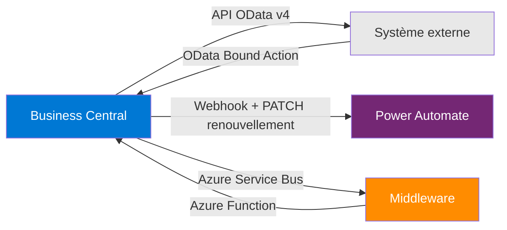

# Certification MB-820 — Préparation à l'examen développeur BC

## Objectifs pédagogiques

- Identifier les domaines de compétences évalués par MB-820, leur pondération et leurs frontières exactes
- Analyser des scénarios de questions réelles pour comprendre ce que Microsoft évalue concrètement
- Reconnaître les pièges de formulation fréquents — y compris sur du code AL — et les désamorcer
- Distinguer ce qui est réellement testé de ce qui semble important mais ne figure pas au programme
- Construire un plan de révision ciblé à partir d'une auto-évaluation honnête par domaine

---

## Mise en situation

Tu viens de passer deux ans à développer des extensions Business Central. Des tables custom, des pages, des intégrations API, quelques jobs de traitement en lot. Tu connais AL, tu travailles avec VS Code tous les jours, tu navigues dans le code d'autres développeurs sans difficulté.

Et pourtant, à la première simulation d'examen MB-820, tu te plantes sur des questions qui semblent simples. Pas parce que tu ne sais pas faire — parce que l'examen ne teste pas ton savoir-faire opérationnel. Il teste ta capacité à raisonner sur des scénarios formulés avec des contraintes précises que tu n'as peut-être jamais rencontrées exactement comme ça.

C'est le vrai sujet de ce module : comprendre ce que l'examen évalue réellement, comment il est structuré, comment lire ses questions, et comment s'y préparer intelligemment plutôt que de relire la documentation en espérant que ça suffise.

---

## Ce que MB-820 certifie — et ce qu'il ne certifie pas

L'examen MB-820 (*Microsoft Certified: Dynamics 365 Business Central Developer Associate*) valide qu'un développeur est capable de concevoir, construire et maintenir des extensions AL dans un environnement Business Central. Niveau *Associate* : une pratique réelle est attendue, mais ce n'est pas une certification d'architecte technique.

Ce qui est important à comprendre dès le départ : **MB-820 ne teste pas ton efficacité en projet**. Il ne teste pas si tu sais organiser un sprint, si tu connais les raccourcis VS Code, ou si tu as déjà géré une mise en prod critique. Il teste si tu *comprends* les mécanismes — tables, extensions, cycle de vie des objets, intégration, déploiement — et si tu peux raisonner correctement face à un scénario construit.

La distinction est essentielle. Un développeur très expérimenté peut échouer s'il ne s'adapte pas au format. Quelqu'un de moins expérimenté mais méthodique peut réussir. Ce n'est pas une injustice — c'est la nature des certifications.

Ce que MB-820 ne teste **pas** : la performance des requêtes AL (tuning SQL, SetLoadFields, FlowFields) n'est pas au programme. L'optimisation de Job Queue avancée non plus. Ces sujets sont réels en projet — ils ne font pas partie des domaines officiellement évalués. Le connaître évite de réviser dans le vide.

---

## Anatomie de l'examen

### Les domaines officiels et leur pondération

Microsoft publie un *Skills Measured* officiel, révisé régulièrement — la dernière mise à jour significative date de juin 2025. Toujours vérifier sur `learn.microsoft.com` avant de planifier ta révision.

```
┌──────────────────────────────────────────────────────────────────────┐
│  Domaine                                   │  Poids approximatif     │
├──────────────────────────────────────────────────────────────────────┤
│  Describe Business Central                 │  10–15 %                │
│  Install, develop, deploy                  │  10–15 %                │
│  Develop by using AL objects               │  35–40 %  ⭐             │
│  Develop by using AL                       │  15–20 %                │
│  Work with development tools               │  10–15 %                │
│  Integrate BC with other applications      │  10–15 %                │
└──────────────────────────────────────────────────────────────────────┘
```

"Develop by using AL objects" représente à lui seul plus d'un tiers de l'examen. C'est là que se jouent la plupart des points. Mais aucun des cinq autres domaines n'est négligeable — une lacune dans un bloc ne se compense pas par la maîtrise d'un autre, et les domaines faiblement pondérés font souvent la différence au seuil de passage.

### Format des questions

L'examen dure 150 minutes pour environ 40 à 60 questions selon le tirage. Les formats rencontrés :

- **Choix unique** — une seule réponse correcte parmi 4
- **Choix multiples** — "sélectionner DEUX réponses qui…" — le piège ici est de sur-sélectionner
- **Mise en ordre** — ordonner des étapes de déploiement, de création d'extension, de migration
- **Case studies** — un contexte long, plusieurs questions liées

Le score de passage est autour de 700 sur 1000, mais Microsoft normalise la note selon la difficulté du tirage — il n'y a pas de barème fixe publié.

---

## Ce que l'examen teste vraiment, domaine par domaine

### Développement d'extensions AL — le cœur du sujet

C'est le domaine dominant (35–40 %), et pourtant ce bloc est souvent moins bien maîtrisé qu'on ne le croit. L'examen ne demande pas d'écrire du code — il demande de *raisonner* sur du code. Tu vas voir des snippets AL et devoir identifier ce qui est correct, incorrect, ou ce qui manque.

**Extension d'objets vs création de nouveaux objets.** Savoir quand utiliser `tableextension` vs `table`, `pageextension` vs `page`, et comprendre les contraintes associées. Un `tableextension` ne peut pas ajouter de clé primaire. Une `pageextension` ne peut pas changer le `SourceTable`. Ces règles semblent évidentes en pratique — elles se formulent différemment dans une question à contrainte.

**Événements et souscriptions.** Le modèle événementiel AL est central — `OnBefore`, `OnAfter`, publishers custom, `IntegrationEvent` vs `BusinessEvent`. L'examen teste si tu comprends *quand* un événement se déclenche dans la chaîne de traitement, et ce qui se passe si tu lèves une erreur dans un subscriber.

**DataClassification.** Les valeurs ont une logique précise avec des implications RGPD. Choisir `CustomerContent` par défaut pour tout ce qui touche à des données client est une erreur fréquente — chaque valeur correspond à un type de donnée spécifique.

**AL pour SaaS.** Certaines constructions AL sont valides OnPrem mais bloquées en SaaS. L'examen teste explicitement cette frontière : `DotNet` interop, accès fichiers système locaux, connexions base de données directes.

---

### Lire une question MB-820 comme un professionnel

Avant d'aller plus loin dans les domaines, voici ce que la plupart des candidats apprennent trop tard : les questions MB-820 ne sont pas difficiles par leur contenu — elles sont difficiles par leur formulation. Comprendre les patterns récurrents change radicalement l'expérience d'examen.

**Exemple de question à analyse — scenario "mise à jour de schéma"**

> *Vous avez publié une extension BC en production. La version 2.0 supprime le champ `ShipmentCode` de la table `SalesHeaderExt` (tableextension de "Sales Header"). Que se passe-t-il lors de la mise à jour si des données existent dans ce champ ?*
>
> A) La mise à jour réussit, le champ est supprimé avec ses données  
> B) La mise à jour échoue — les suppressions de champ nécessitent une procédure de migration explicite  
> C) BC archive automatiquement les données du champ avant suppression  
> D) La mise à jour réussit uniquement si la table est vide

**Analyse :** La bonne réponse est **B**. Les distracteurs sont construits pour piéger :
- A est tentant si on confond "supprimer un champ en dev" (ForceSync possible) et "supprimer un champ en production"
- C n'existe pas — BC n'archive rien automatiquement lors d'une suppression de champ
- D est plausible si on pense à des contraintes SQL classiques, mais ce n'est pas le comportement BC

Ce que révèle cette question : elle ne teste pas si tu sais coder une migration — elle teste si tu connais les *règles de compatibilité de schéma entre versions d'extension*. La nuance est importante pour savoir où réviser.

---

**Exemple de question à analyse — scenario "subscriber et transaction"**

> *Un développeur crée un subscriber sur l'événement `OnAfterPostSalesDocument`. Dans ce subscriber, il appelle `Error('Validation échouée')` si une condition métier n'est pas remplie. Quel est l'effet réel de cet appel ?*
>
> A) Seul le subscriber est annulé — le document est quand même posté  
> B) Le posting est annulé et une exception est levée à l'utilisateur  
> C) L'erreur est loggée mais le posting continue  
> D) Le subscriber est ignoré car `OnAfterPostSalesDocument` est un IntegrationEvent non annulable

**Analyse :** La bonne réponse est **B**. Détail critique : `OnAfterPostSalesDocument` est un `BusinessEvent` — lever une `Error()` dans un subscriber BusinessEvent annule la transaction entière, y compris le posting. Les distracteurs :
- A est l'erreur la plus fréquente — on imagine intuitivement que "après" veut dire "sans impact possible"
- C correspond au comportement d'un log, pas d'une Error()
- D introduit une confusion entre IntegrationEvent (non annulable par design) et BusinessEvent — subtilité que l'examen exploite délibérément

---

**Exemple de question à analyse — scenario "upgrade + migration"**

> *Une extension passe de v1.0 à v2.0. En v2.0, le champ `LegacyStatus` (Integer) est remplacé par un Enum `OrderStatus`. La v1.0 contient des données dans `LegacyStatus`. Quelle approche garantit la migration correcte des données ?*
>
> A) Supprimer `LegacyStatus` dans v2.0 et ajouter `OrderStatus` — BC migre automatiquement  
> B) Marquer `LegacyStatus` comme `ObsoleteState = Pending` en v2.0, ajouter `OrderStatus`, écrire un codeunit `OnUpgradePerCompany` qui lit `LegacyStatus` et écrit `OrderStatus`  
> C) Utiliser `ForceSync` pour synchroniser le schéma  
> D) Renommer `LegacyStatus` en `OrderStatus` et changer son type en Enum

**Analyse :** La bonne réponse est **B**. C'est le seul pattern qui respecte la contrainte : données existantes + changement de type. Distracteurs :
- A est faux — BC ne migre rien automatiquement sur un changement de type
- C (`ForceSync`) existe et est tentant, mais ForceSync en production peut provoquer des pertes de données silencieuses — exactement le genre de nuance que l'examen teste
- D est syntaxiquement impossible (changer le type d'un champ existant entre versions est interdit)

Structure correcte pour ce scenario :

```al
// v2.0 — Extension table avec migration propre
tableextension 50100 "Sales Header Ext" extends "Sales Header"
{
    fields
    {
        field(50100; LegacyStatus; Integer)
        {
            ObsoleteState = Pending;
            ObsoleteTag = '2.0';
            ObsoleteReason = 'Replaced by OrderStatus Enum';
        }
        field(50101; OrderStatus; Enum "Order Status")
        {
            DataClassification = CustomerContent;
        }
    }
}

// Codeunit de migration — s'exécute une fois par société
codeunit 50200 "Upgrade Sales Header v2"
{
    Subtype = Upgrade;

    trigger OnUpgradePerCompany()
    var
        SalesHeader: Record "Sales Header";
        UpgradeTag: Codeunit "Upgrade Tag";
    begin
        if UpgradeTag.HasUpgradeTag(GetUpgradeTag()) then
            exit;

        SalesHeader.SetFilter(LegacyStatus, '<>0');
        if SalesHeader.FindSet(true) then
            repeat
                SalesHeader.OrderStatus := MapLegacyStatus(SalesHeader.LegacyStatus);
                SalesHeader.Modify();
            until SalesHeader.Next() = 0;

        UpgradeTag.SetUpgradeTag(GetUpgradeTag());
    end;

    local procedure GetUpgradeTag(): Code[250]
    begin
        exit('SALES-HEADER-ORDERSTATUS-v2.0');
    end;

    local procedure MapLegacyStatus(LegacyValue: Integer): Enum "Order Status"
    begin
        case LegacyValue of
            1: exit(Enum::"Order Status"::Open);
            2: exit(Enum::"Order Status"::Released);
            else
                exit(Enum::"Order Status"::Open);
        end;
    end;
}
```

Ce qu'on observe ici : `UpgradeTag.HasUpgradeTag()` rend la migration idempotente — elle ne se rejoue pas à chaque déploiement. C'est précisément ce que l'examen vérifie dans les questions sur le cycle de vie des extensions.

---

### Intégration et connectivité

Ce bloc couvre les APIs Business Central et les mécanismes de connexion avec des systèmes externes. Les points critiques :

**API pages et OData.** Différence entre `APIPublisher`, `APIGroup`, `APIVersion` — comment déclarer une API page, comment elle se consomme en OData v4. L'examen teste si tu sais ce que tu dois renseigner et dans quel ordre, souvent via des snippets avec une propriété manquante.

**Webhooks.** Abonnements, expiration, renouvellement — le cycle de vie d'un webhook BC est souvent mal connu. Un abonnement expire automatiquement après 3 jours par défaut (configurable jusqu'à 30 jours). Le système abonné doit envoyer une requête PATCH avec `expirationDateTime` avant expiration. Si l'abonnement expire, les notifications s'arrêtent sans erreur visible côté BC — c'est le scénario "notifications qui s'arrêtent mystérieusement" que l'examen pose régulièrement.

**Power Automate et Power Platform.** Connexions certifiées vs connexions custom, triggers disponibles, limitations. Pas besoin d'être expert Power Platform — comprendre comment BC s'y connecte est attendu.



L'examen distingue les intégrations *synchrones* (appel API direct, attente de réponse) des intégrations *asynchrones* (message posté, traitement découplé). La bonne architecture dépend du volume, de la tolérance à la latence, et de la criticité des données. Les questions de ce domaine testent souvent ce raisonnement d'arbitrage.

---

### Déploiement et cycle de vie

C'est le domaine où l'expérience projet aide le plus — et celui où les mauvaises habitudes coûtent le plus cher à l'examen.

**AppSource et déploiement ISV.** Le processus de validation AppSource, les règles de `AppSourceCop`, les fichiers manifestes (`app.json`), les dépendances entre extensions. AppSourceCop est un analyseur AL activé via `app.json` qui vérifie les règles de conformité avant soumission : préfixes/suffixes obligatoires, DataClassification sur tous les champs, pas de DotNet, pas de code OnPrem-only. Les violations bloquent la publication mais pas la compilation locale.

**Mise à jour d'extensions.** Gestion du schéma, `OnUpgradePerDatabase` vs `OnUpgradePerCompany`, règles de migration. `OnUpgradePerDatabase` s'exécute une fois par base de données — pour les données partagées entre sociétés (tables sans CompanyId). `OnUpgradePerCompany` s'exécute pour chaque société — pour les données spécifiques à une société. Choisir le mauvais entraîne soit des données manquantes soit des doublons.

**Tests automatisés.** `Codeunit` de test, `ASSERTERROR`, `LibraryAssert` — l'examen teste si tu comprends comment les tests unitaires AL fonctionnent et comment les organiser.

---

## Tableau récapitulatif — Domaines, concepts critiques et erreurs typiques

| Domaine | Concepts critiques | Erreurs typiques à l'examen | Ressource officielle |
|---|---|---|---|
| Develop by using AL objects | tableextension vs table, events, DataClassification, SaaS restrictions | Choisir CustomerContent par défaut; croire qu'OnAfter n'annule pas la transaction | docs.microsoft.com/AL → Extension objects |
| Install, develop, deploy | OnUpgradePerCompany/Database, UpgradeTag, ObsoleteState, AppSourceCop | ForceSync en production; migration sans UpgradeTag (rejouée à chaque déploiement) | docs.microsoft.com → Publishing and Deployment |
| Integrate BC | API pages (APIPublisher/Group/Version), webhooks lifecycle, Power Automate | Oublier le PATCH de renouvellement webhook; confondre Bound et Unbound Actions | docs.microsoft.com/BC → Integration overview |
| Work with development tools | AL-Go, Azure DevOps pipelines, analyzers, test codeunits | Croire que les tests BC s'exécutent sans environnement BC actif | learn.microsoft.com → MB-820 Learning Path |
| Describe BC | Sandboxes vs production, admin center, Feature Management | Ne pas avoir exploré le centre d'administration BC réellement | admin.businesscentral.dynamics.com |
| Develop by using AL | HttpClient, JsonObject, Permission Sets, Entitlements | Hardcoder des URLs dans le code; confondre Entitlement et Permission Set | docs.microsoft.com/AL → System namespaces |

---

## Les pièges de formulation — apprendre à lire les questions

### Patterns récurrents avec scenarios

**"Le moins d'impact possible"** — quand une question demande quelle approche minimise l'impact sur les données existantes, elle teste les contraintes de migration de schéma. La bonne réponse est presque toujours celle qui *ajoute* quelque chose plutôt que celle qui *modifie*.

*Scenario type :* "Vous devez ajouter une validation sur le champ `Amount` de la table `Purchase Line` sans modifier le code standard. Quelle approche a le moins d'impact ?" → La réponse attendue : un subscriber sur l'event `OnAfterValidatePurchaseLine`, pas une modification de la tableextension standard.

**"Vous devez vous assurer que..."** — cette formulation introduit une contrainte. Lis-la avant les réponses. Elle change souvent radicalement la bonne réponse — une solution techniquement correcte peut devenir incorrecte si elle viole la contrainte posée.

*Scenario type :* "Vous devez vous assurer que la migration se rejoue uniquement une fois même si l'extension est redéployée plusieurs fois." → Réponse attendue : pattern `UpgradeTag.HasUpgradeTag()` — sans ce test, le codeunit d'upgrade s'exécute à chaque déploiement.

**"LEAST likely" ou "NOT correct"** — questions négatives. Mentalement, entoure le "NOT" ou "LEAST" avant de lire les options. Cette erreur de lecture coûte des points sur des questions dont on connaît la réponse.

*Technique :* reformuler la question en positif. "Quelle action est NOT autorisée dans un subscriber IntegrationEvent ?" devient "Quelles actions sont autorisées dans un subscriber IntegrationEvent ?" → identifier les trois réponses correctes, la quatrième est la bonne réponse.

**Questions avec deux bonnes réponses partielles** — l'examen présente parfois deux réponses qui semblent correctes, mais l'une est plus *complète* dans le contexte donné. Cherche la réponse qui satisfait *toutes* les contraintes du scénario.

*Scenario type :* AppSourceCop détecte un objet sans préfixe. Deux réponses proposent d'ajouter un préfixe : l'une sur l'objet, l'autre via `mandatoryAffixes` dans `app.json`. La deuxième est correcte en contexte AppSource car elle est vérifiable automatiquement par le pipeline CI/CD — pas seulement ponctuellement sur un objet.

### Dans les case studies

Les questions ne sont pas indépendantes — le contexte établi au début peut invalider une réponse qui serait correcte hors contexte. Réfère-toi toujours au contexte, même si tu penses connaître la réponse d'emblée. Les case studies consomment beaucoup de temps de lecture : prévois 5 à 7 minutes par case study complet.

---

## Comment se préparer — une approche honnête

### Évaluation de départ

Avant de planifier quoi que ce soit, fais une simulation à froid. Microsoft Learn propose des tests d'entraînement officiels. Note tes résultats *par domaine*, pas juste le score global.

Ce que tu cherches à identifier :
- Quel domaine tu maîtrises vraiment (score > 80 %)
- Quel domaine tu survoles sans le savoir (score 50–70 %, impression de maîtrise)
- Quel domaine est un trou réel (score < 50 %)

Le domaine à 50–70 % est souvent le plus dangereux : tu penses le connaître, donc tu ne le révises pas assez. C'est là que les surprises arrivent.

### Ressources — ce qui vaut le temps, ce qui ne le vaut pas

**Vraiment utile :**
- La documentation officielle `learn.microsoft.com/dynamics365/business-central/dev-itpro/` — sections sur le modèle d'extension, les permissions, et les API
- Le dépôt GitHub `microsoft/ALAppExtensions` — lire du code AL réel produit par Microsoft est plus formateur que lire de la théorie
- Les Learning Paths MB-820 sur Microsoft Learn — structurés pour l'examen, donc bien ciblés
- Les examens blancs MeasureUp — questions proches du vrai examen en termes de formulation

**À éviter :**
- Les "dumps" de questions (réponses recopiées d'anciens examens) — interdit par Microsoft, inutile si l'examen a été mis à jour, et pénalisant pour ta compréhension réelle
- Réviser uniquement par domaine pratiqué au quotidien — laisse des angles morts systématiques sur tout ce qu'on ne touche pas en projet

### Plan de révision sur 6 semaines

Ce découpage suppose environ 8 à 10 heures par semaine en parallèle d'une activité professionnelle.

| Semaine | Focus | Activité principale |
|---------|-------|---------------------|
| 1 | Évaluation + AL objects | Simulation à froid → révision ciblée des objets, événements, DataClassification |
| 2 | AL objects (suite) + AL development | SaaS vs OnPrem restrictions, HttpClient, Permission Sets, Entitlements |
| 3 | Install, develop, deploy | Upgrade codeunits, ObsoleteState, AppSourceCop, tests AL |
| 4 | Intégration | API pages, webhooks lifecycle, Power Automate, Service Bus |
| 5 | Describe BC + Development tools | Centre d'administration, Feature Management, AL-Go, pipelines |
| 6 | Révision transversale | 2 examens blancs complets + revue ciblée des domaines faibles identifiés |

En semaine 6 : ne cherche pas à apprendre du nouveau contenu. Si tu découvres une notion inconnue lors d'un examen blanc à J-7, note-la mais ne reconstruis pas toute ta compréhension du domaine. Consolide ce que tu sais déjà.

---

## Le jour de l'examen

L'examen peut se passer en centre agréé Pearson VUE ou en mode surveillé à distance (OnVue). Le mode distance exige un environnement de bureau propre, sans papiers, sans second écran, avec une connexion stable.

La durée de 150 minutes paraît longue, mais les case studies consomment beaucoup de temps de lecture. Prévois environ 2 minutes par question simple et 5 à 7 minutes par case study complet. Ne laisse pas une question difficile te bloquer — marque-la pour révision et avance.

Tu peux revenir sur tes réponses avant de soumettre. Utilise ce temps pour relire les questions marquées, pas pour remettre en question des réponses dont tu es sûr. Le syndrome du "et si je change" fait perdre des points en certification.

Le renouvellement est annuel — un assessment en ligne gratuit sur Microsoft Learn suffit à renouveler la certification sans repasser l'examen complet.

---

## Résumé

MB-820 certifie qu'un développeur AL comprend l'ensemble de l'écosystème Business Central — pas juste le code qu'il écrit au quotidien. Six domaines, avec "Develop by using AL objects" représentant à lui seul 35–40 % de l'examen. Ce n'est pas la difficulté des concepts qui piège les candidats — c'est la capacité à raisonner sur des scénarios formulés avec des contraintes précises, souvent sur du code qu'on ne pratique pas tous les jours.

La préparation efficace commence par une simulation à froid par domaine pour identifier les vrais angles morts — souvent dans des domaines qu'on croit maîtriser. Le plan de révision sur 6 semaines se construit autour de ces lacunes, avec les Learning Paths officiels et des examens blancs calibrés comme colonne vertébrale. Comprendre les patterns de formulation (négatifs, contraintes, case studies) est une compétence à part entière.

Ce que l'examen ne teste pas mérite autant d'attention que ce qu'il teste : le tuning SQL, l'optimisation Job Queue, et la gestion de performance ne font pas partie des domaines évalués. Savoir ne pas réviser dans le vide fait partie de la stratégie.

---

<!-- snippet
id: mb820_domaines_poids
type: concept
tech: mb-820
level: advanced
importance: high
format: knowledge
tags: mb-820,certification,examen,domaines,ponderation
title: Six domaines MB-820 et leur pondération officielle
content: MB-820 couvre 6 domaines : Describe BC (10–15%), Install/develop/deploy (10–15%), Develop by using AL objects (35–40%) ⭐, Develop by using AL (15–20%), Work with development tools (10–15%), Integrate BC (10–15%). Aucun domaine ne peut être négligé — un trou dans un bloc ne se compense pas. Vérifier le Skills Measured officiel sur learn.microsoft.com avant révision (révisé juin 2025). Performance tuning AL et Job Queue avancée ne sont pas au programme.
description: Pondération officielle des 6 domaines MB-820 — base pour calibrer un plan de révision ciblé sans réviser le hors-programme
-->

<!-- snippet
id: mb820_schema_update_rules
type: warning
tech: mb-820
level: advanced
importance: high
format: knowledge
tags: mb-820,schema,migration,tableextension,upgrade,obsoletestate
title: Mise à jour de schéma AL — ce qui casse une extension
content: Supprimer ou changer le type d'un champ entre deux versions publiées → la mise à jour échoue. ForceSync contourne la vérification mais peut provoquer des pertes de données silencieuses en production. Seule voie correcte : marquer le champ en ObsoleteState = Pending, ajouter le nouveau champ, écrire un codeunit OnUpgradePerCompany qui transfère les données, puis supprimer le champ en ObsoleteState = Removed dans une version ultérieure. Ajouter des champs est autorisé sans migration explicite.
description: Règle fondamentale de compatibilité de schéma AL entre versions — testée via des scenarios de mise à jour dans MB-820
-->

<!-- snippet
id: mb820_upgrade_migration_complet
type: concept
tech: mb-820
level: advanced
importance: high
format: knowledge
tags: mb-820,upgrade,migration,upgradetag,obsoletestate,onupgradepercompany
title: Pattern complet upgrade + migration AL (scenario examen)
context: Scenario MB-820 fréquent — champ Integer remplacé par Enum entre deux versions d'extension avec données existantes
content: Étape 1 : marquer l'ancien champ ObsoleteState = Pending en v2.0 (pas de suppression immédiate). Étape 2 : ajouter le nouveau champ Enum. Étape 3 : codeunit OnUpgradePerCompany protégé par Upgr
