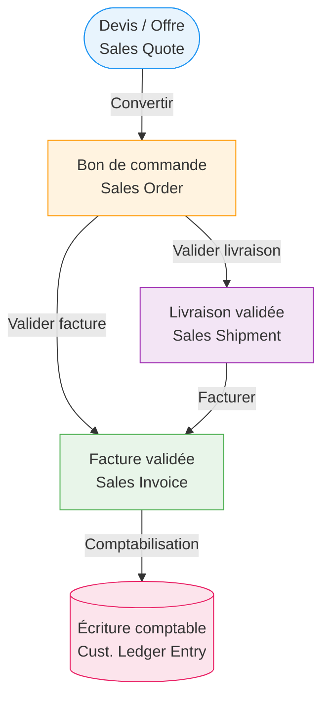
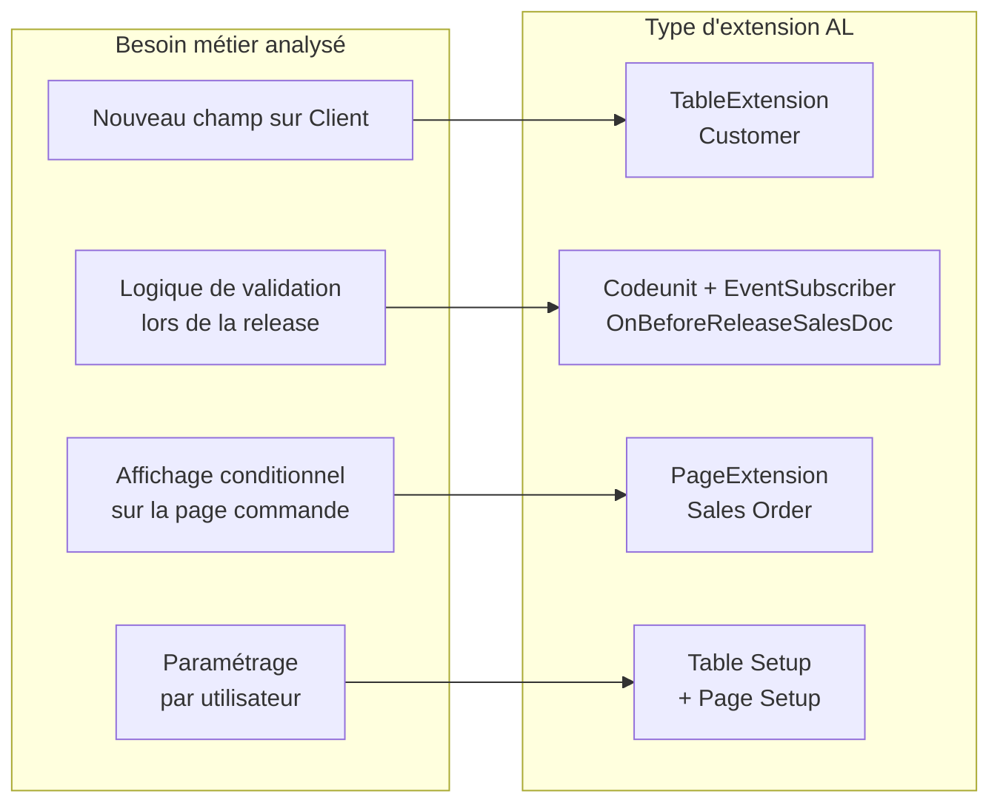

# Analyse fonctionnelle pour développeur AL

## Objectifs pédagogiques

À l'issue de ce module, tu seras capable de :

1. **Lire et déconstruire** un besoin métier exprimé par un utilisateur ou un consultant pour en extraire les contraintes de développement réelles
2. **Modéliser un flux de processus** Business Central sous forme exploitable avant d'écrire la première ligne d'AL
3. **Identifier les entités, tables et points d'extension** pertinents à partir d'une spécification fonctionnelle
4. **Produire une analyse technique minimale** suffisante pour cadrer un développement AL sans sur-spécifier
5. **Éviter les pièges classiques** : mauvaise compréhension du besoin, périmètre flottant, développement d'une solution à côté du problème

---

## Mise en situation

Tu reprends un ticket de développement dans un projet BC pour un client du secteur distribution. Le ticket dit : *"Il faut bloquer la validation des bons de commande quand le crédit client est dépassé."*

En AL pur, tu pourrais écrire un `OnBeforePost` sur la table `Sales Header` en dix minutes. Sauf que le client, lui, voulait dire : bloquer *certaines* commandes (pas les intercos groupe), avec un workflow d'approbation possible, uniquement sur les clients hors-groupe, sauf si le commercial a un flag "trusted" — et la notion de "crédit dépassé" intègre les encours comptables *et* les commandes en cours de livraison.

Bienvenue dans la réalité de l'analyse fonctionnelle pour développeur AL.

Ce module n'est pas un cours de gestion de projet. C'est une boîte à outils pour que toi, développeur, tu sois capable de comprendre ce qu'on te demande *vraiment*, de modéliser correctement avant de coder, et de poser les bonnes questions au bon moment — au lieu de les poser après avoir tout livré.

---

## Ce que l'analyse fonctionnelle représente pour un développeur AL

Il existe une idée reçue tenace : l'analyse fonctionnelle, c'est le travail du consultant. Le développeur, lui, reçoit une spec et il code.

En pratique — surtout en contexte PME/ETI avec Business Central — cette frontière est poreuse. Les équipes sont réduites, les specs arrivent incomplètes, et la personne qui connaît le mieux le modèle de données BC, c'est le développeur. Ce qui signifie qu'une partie de l'analyse fonctionnelle finit inévitablement dans les mains du dev.

La vraie question n'est pas *est-ce que tu vas faire de l'analyse fonctionnelle*, mais *est-ce que tu vas le faire de manière structurée ou improviser au fil des allers-retours*.

Un développeur AL qui sait analyser :
- code une première version plus proche du besoin réel
- détecte les ambiguïtés *avant* que le client les découvre en recette
- réduit les cycles de correction post-livraison
- comprend pourquoi certaines tables BC sont structurées comme elles sont

---

## Comprendre avant de modéliser : lire un besoin métier

### La différence entre besoin exprimé et besoin réel

Ce que dit l'utilisateur et ce qu'il veut sont deux choses différentes. Ce n'est pas qu'il ment — c'est qu'il décrit son problème avec ses mots, ses habitudes, et ses raccourcis mentaux.

**Besoin exprimé :** *"Je veux un bouton pour envoyer la facture par mail"*
**Besoin réel :** automatiser l'envoi de factures à des contacts spécifiques selon un profil d'envoi configurable par client, avec gestion des erreurs et traçabilité

La différence entre les deux, c'est souvent six semaines de développement supplémentaire si tu ne la découvres qu'en recette.

La technique de base pour creuser un besoin, c'est de poser systématiquement trois types de questions :

| Type de question | Exemple concret | Ce que ça révèle |
|---|---|---|
| **Qui ?** | Qui fait cette action ? Qui peut la modifier ? | Règles de permission, rôles BC |
| **Quand ?** | Sous quelle condition ? À quel moment du flux ? | Triggers, événements, validation |
| **Sauf si ?** | Y a-t-il des exceptions ? Des cas particuliers ? | Logique conditionnelle, paramètres |

Le "sauf si" est souvent le plus révélateur. Les exceptions métier sont quasi systématiquement absentes des premières versions d'un besoin exprimé — et elles représentent 40 % de la complexité réelle.

### Structurer l'expression du besoin

Avant de toucher à AL, il est utile de reformuler le besoin sous une forme structurée. Le format le plus simple et le plus efficace en contexte BC :

```
En tant que [rôle utilisateur BC]
Je veux [action / comportement attendu]
Afin de [objectif métier]
Avec les règles suivantes :
  - [règle 1]
  - [règle 2, souvent la plus compliquée]
  - [exception / cas limite]
Critères d'acceptation :
  - [ce qui doit être vrai pour que c'est OK]
```

Ce n'est pas une user story Scrum figée — c'est un outil pour forcer la clarification. Si tu n'arrives pas à remplir la section "règles suivantes" sans retourner voir l'utilisateur, c'est le signal que la spec est trop vague pour commencer à coder.

Voici concrètement la différence entre une reformulation insuffisante et une reformulation exploitable sur le cas du blocage crédit :

**Reformulation vague (ne pas faire) :**
> "Bloquer les commandes si crédit dépassé."

**Reformulation exploitable (à envoyer pour validation) :**
> "En tant que responsable comptabilité, je veux que la release d'un bon de commande soit bloquée si l'encours total du client (factures ouvertes + commandes released non facturées) dépasse son plafond Credit Limit, sauf si le client est marqué Intercompany. En cas de blocage, le commercial reçoit une notification BC. Le workflow d'approbation est hors périmètre."

La différence ? La première version te laisse découvrir les exceptions en recette. La seconde les documente avant de coder.

---

## Modéliser un flux métier Business Central

### Pourquoi modéliser avant de coder

BC est un ERP transactionnel. Les processus métier y sont des séquences d'états : un devis devient bon de commande, devient ordre de livraison, devient facture, devient écriture comptable. Si tu codes une extension sans avoir tracé ce flux, tu risques d'intervenir au mauvais endroit — trop tôt, trop tard, ou sur le mauvais document.

La modélisation n'a pas besoin d'être lourde. L'objectif est simple : avant d'écrire du AL, pouvoir répondre à ces questions :

- Sur quelle(s) table(s) s'appuie le processus ?
- À quel moment du flux mon code doit-il intervenir ?
- Quels sont les états possibles du document concerné ?
- Qui déclenche quoi ?

### Flux de document BC — modèle de base

Voici comment un flux typique vente se représente. C'est le squelette sur lequel tu vas placer tes points d'intervention.



Chaque flèche est un point d'extension potentiel. Chaque nœud correspond à des tables précises dans BC. Quand tu reçois un besoin, la première question est : à quelle flèche ou quel nœud appartient ce besoin ?

### Identifier les states d'un document

Business Central utilise intensivement la notion d'état de document (`Status` field). Comprendre les états possibles avant de coder un comportement conditionnel est non négociable.

Exemple sur `Sales Header` :

| Status | Signification | Ce que tu peux faire |
|---|---|---|
| `Open` | En cours de saisie | Modifier, supprimer |
| `Released` | Validé pour traitement | Déclencher picking, générer ordres |
| `Pending Approval` | En attente de workflow | Lecture seule (presque) |
| `Pending Prepayment` | Acompte requis | Bloqué jusqu'à règlement |

Un `OnValidate` sur un champ peut se déclencher alors que le document est `Released` ou même `Pending Approval`. Sans vérification explicite du statut, tu modifies quelque chose qui ne devrait plus bouger. La correction est simple — mais elle suppose de connaître les états :

```al
// ❌ Mauvais : logique exécutée quel que soit l'état du document
trigger OnValidate()
begin
    // Modification directe sans vérification Status
    Rec."Custom Field" := CalculateSomething();
end;

// ✅ Correct : vérification du statut avant toute modification
trigger OnValidate()
begin
    if Rec.Status <> Rec.Status::Open then
        Error('Ce champ ne peut être modifié que sur un document en statut Open.');
    Rec."Custom Field" := CalculateSomething();
end;
```

---

## Identifier les entités BC depuis une spec fonctionnelle

### Du concept métier à la table AL

Une fois le flux tracé, l'étape suivante est de faire le mapping entre les termes métier de la spec et les objets BC réels. Ce travail est souvent sous-estimé, alors qu'il conditionne directement où tu vas étendre le modèle de données.

Voici un exemple de mapping pour un besoin type "gestion des conditions commerciales clients" :

| Terme métier | Table BC | Remarque |
|---|---|---|
| Client | `Customer` (18) | + `Customer Price Group` pour segmentation |
| Condition de remise | `Sales Line Discount` (1304) | Ou `Price List Line` si BC 18+ |
| Plafond de crédit | `Credit Limit (LCY)` sur `Customer` | Champ natif, souvent insuffisant |
| Encours facturation | `Cust. Ledger Entry` (21) | Filtrer sur `Open = true` |
| Commandes en cours | `Sales Header` (36) | Status = Open ou Released |

Ce tableau, construit *avant* de coder, te permet de voir immédiatement que le besoin "bloquer si crédit dépassé" implique quatre tables distinctes et une logique d'agrégation — pas juste un trigger sur `Sales Header`.

Voici comment cette agrégation se traduit en AL pour calculer l'encours réel d'un client :

```al
/// Calcule l'encours total d'un client :
/// factures ouvertes (CLE) + commandes released non facturées (Sales Header)
procedure CalculateOutstandingAmount(CustomerNo: Code[20]): Decimal
var
    CustLedgerEntry: Record "Cust. Ledger Entry";
    SalesHeader: Record "Sales Header";
    OutstandingAmount: Decimal;
begin
    OutstandingAmount := 0;

    // Factures ouvertes non lettrées
    CustLedgerEntry.SetRange("Customer No.", CustomerNo);
    CustLedgerEntry.SetRange(Open, true);
    CustLedgerEntry.SetRange("Document Type", CustLedgerEntry."Document Type"::Invoice);
    if CustLedgerEntry.FindSet() then
        repeat
            CustLedgerEntry.CalcFields("Remaining Amount");
            OutstandingAmount += CustLedgerEntry."Remaining Amount";
        until CustLedgerEntry.Next() = 0;

    // Commandes released non encore facturées
    SalesHeader.SetRange("Document Type", SalesHeader."Document Type"::Order);
    SalesHeader.SetRange("Sell-to Customer No.", CustomerNo);
    SalesHeader.SetRange(Status, SalesHeader.Status::Released);
    if SalesHeader.FindSet() then
        repeat
            SalesHeader.CalcFields("Amount Including VAT");
            OutstandingAmount += SalesHeader."Amount Including VAT";
        until SalesHeader.Next() = 0;

    exit(OutstandingAmount);
end;
```

Sans le mapping préalable, cette fonction aurait pu n'interroger que `Cust. Ledger Entry` — et manquer les commandes en cours, qui représentent précisément le cas métier que le client voulait couvrir.

### Détecter les points d'extension nécessaires

À partir du mapping, tu peux identifier les types d'extensions AL dont tu auras besoin :



C'est ce mapping qui te permet de chiffrer un développement, d'évaluer sa complexité, et de détecter d'éventuels conflits avec d'autres extensions sur les mêmes events.

En AL, chaque point d'extension (event, page extension, table extension) est un choix architectural, pas juste une décision technique. Si tu places ta logique au mauvais event, tu peux la retrouver contournée, exécutée deux fois, ou jamais exécutée selon le flux d'appel BC.

---

## Construire une analyse technique minimale

L'objectif n'est pas de produire un document de 40 pages. C'est de produire *juste assez* pour que toi (et d'autres) puissiez comprendre la décision de développement six mois plus tard.

### Le template d'analyse minimale pour un développement AL

Voici la structure à utiliser *avant* de commencer à coder une fonctionnalité non triviale. Ce template est conçu pour être copié directement dans un fichier `.md` en repo Git, à côté du code.

```markdown
## Analyse technique — [Nom de la fonctionnalité]

### 1. Contexte et besoin
- Reformulation : "En tant que [rôle], je veux [action] afin de [objectif]"
- Situation actuelle sans ce développement :

### 2. Flux concerné
- Flux métier impliqué (schéma ou description) :
- Point(s) d'intervention identifiés :

### 3. Mapping entités
| Terme métier | Table BC | N° | Champ(s) concerné(s) |
|---|---|---|---|
| | | | |

### 4. Architecture de l'extension
Objets AL à créer :
- [ ] Type | Nom | Rôle
Event(s) utilisés :
- Event : [nom] — Pourquoi : [justification]

### 5. Règles de gestion
1. [Règle 1 — une condition, un effet]
2. [Règle 2]

### 6. Hors périmètre (exclusions explicites)
- [Ce qui n'est PAS dans ce développement]

### 7. Estimation
- Complexité : Simple / Moyen / Complexe
- Risque de régression : Faible / Moyen / Élevé
- Flux existants impactés : [liste]
```

La section "Hors périmètre" est souvent la plus précieuse. Y écrire explicitement *ce qui n'est PAS dans le périmètre* protège autant que d'y écrire ce qui l'est. En recette, c'est ce qui distingue un "bug" d'une "demande d'évolution".

---

## Cas réel — Analyse d'une extension de blocage crédit

Reprenons le scénario d'introduction. Voici comment une analyse complète se construit pas à pas — et comment elle se traduit en AL exécutable.

### Étape 1 — Reformulation du besoin

```
En tant que responsable comptabilité
Je veux que les bons de commande soient bloqués à la release
  si l'encours total du client dépasse son plafond de crédit autorisé
Afin d'éviter l'envoi de marchandises sans couverture de paiement

Règles :
  - Encours = factures ouvertes (CLE non lettrées) + commandes released non facturées
  - Plafond = champ "Credit Limit" sur la fiche client (personnalisable)
  - Exclusions : clients du groupe interne (champ "Intercompany" = true)
  - Si dépassement : bloquer la release ET notifier le commercial par notification BC

Hors périmètre :
  - Workflow d'approbation (traité séparément)
  - Historique des dépassements (non demandé)
```

### Étape 2 — Flux et point d'intervention

Le point d'intervention est **la release du bon de commande** — ni la saisie, ni la validation comptable.

Deux events sont disponibles sur ce moment du flux :

| Event | Codeunit | Moment | Peut bloquer ? |
|---|---|---|---|
| `OnBeforeReleaseSalesDocument` | 414 | Avant la release | ✅ Oui |
| `OnAfterReleaseSalesDocument` | 414 | Après la release | ❌ Trop tard |

Le choix est `OnBeforeReleaseSalesDocument` — c'est le seul qui permette de lever une erreur bloquante avant que la release soit effective. `OnAfterRelease` s'exécute lorsque le statut a déjà changé.

### Étape 3 — Mapping entités

| Terme | Table BC | Champ(s) |
|---|---|---|
| Plafond crédit | `Customer` (18) | `Credit Limit (LCY)` |
| Flag intercompany | `Customer` (18) | À créer : `Intercompany Customer` |
| Factures ouvertes | `Cust. Ledger Entry` (21) | Filtrer `Open=true`, `Document Type=Invoice` |
| Commandes en cours | `Sales Header` (36) | `Status=Released`, non facturées |
| Notification | `My Notifications` (1518) | Natif BC |

### Étape 4 — Architecture extension et implémentation

```
Objets à créer :
  - TableExtension "Customer Ext." sur Customer (18)
      → Ajout champ boolean "Intercompany Customer"
  - PageExtension "Customer Card Ext." sur Customer Card (21)
      → Affichage du champ Intercompany Customer
  - Codeunit "Credit Check Mgt."
      → CalculateOutstandingAmount(CustomerNo) : Decimal
      → CheckCreditLimit(CustomerNo) : Boolean
  - Codeunit "Credit Check Subscriber"
      → EventSubscriber sur OnBeforeReleaseSalesDocument
```

Voici comment le subscriber s'écrit en AL — c'est la pièce centrale qui orchestre tout ce que l'analyse a préparé :

```al
codeunit 50100 "Credit Check Subscriber"
{
    [EventSubscriber(ObjectType::Codeunit, Codeunit::"Release Sales Document",
        'OnBeforeReleaseSalesDocument', '', false, false)]
    local procedure CheckCreditOnRelease(var SalesHeader: Record "Sales Header")
    var
        Customer: Record Customer;
        CreditCheckMgt: Codeunit "Credit Check Mgt.";
        OutstandingAmount: Decimal;
    begin
        // Exclusion : clients intercompany hors périmètre
        if not Customer.Get(SalesHeader."Sell-to Customer No.") then
            exit;
        if Customer."Intercompany Customer" then
            exit;

        // Pas de plafond défini = pas de blocage
        if Customer."Credit Limit (LCY)" = 0 then
            exit;

        // Calcul encours et comparaison au plafond
        OutstandingAmount := CreditCheckMgt.CalculateOutstandingAmount(
            SalesHeader."Sell-to Customer No."
        );

        if OutstandingAmount > Customer."Credit Limit (LCY)" then
            Error(
                'Blocage crédit : encours %1 dépasse le plafond %2 pour le client %3.\' +
                'Contactez la comptabilité pour autorisation.',
                OutstandingAmount,
                Customer."Credit Limit (LCY)",
                Customer.Name
            );
    end;
}
```

### Résultat de l'analyse

En moins de 30 minutes d'analyse, on est passé d'un ticket vague à :
- 4 objets AL identifiés et leur rôle précis
- 1 event ciblé avec justification (pas juste "OnBeforeRelease")
- 3 tables impliquées identifiées avant d'écrire une ligne
- Les exclusions explicitement documentées
- Un code exécutable cohérent avec la spec validée

---

## Bonnes pratiques et pièges à éviter

### Ce qui tue un développement AL — avant même de coder

**Périmètre flottant.** C'est le piège principal. Un besoin sans règles de gestion écrites et validées se transforme en spécification orale — et la spécification orale évolue à chaque réunion. Exige systématiquement une validation écrite du mapping entités et des règles de gestion avant de démarrer.

**Confondre l'UI et la logique.** Beaucoup de demandes arrivent formulées en termes d'interface : "ajoute un champ ici", "mets un bouton là". Mais l'interface n'est que la surface. La vraie question est : qu'est-ce que ce champ ou ce bouton *fait* sur les données, et à quel moment du flux ? Reformuler en termes de données et d'état avant de penser à la page.

**Ignorer les flux existants.** BC est un ERP très intégré. Un event déclenché sur `Sales Header` peut être souscrit par d'autres extensions — les tiennes, celles de l'éditeur ISV, celles d'AppSource. Avant d'ajouter un subscriber, vérifie ce qui s'y passe déjà avec l'AL Explorer dans VS Code (`Ctrl+Shift+P` → "AL: Open AL Explorer") ou en lisant le code existant.

**Sur-analyser pour éviter de coder.** L'analyse est un outil, pas une protection. Un document de 20 pages qui n'a pas été relu par l'utilisateur ne vaut pas grand-chose. L'objectif est le minimum suffisant pour coder juste — pas l'exhaustivité.

### Mauvais vs bon choix d'event — exemple concret

C'est le type de décision qui ne se voit pas dans le code mais qui change tout en production. Voici deux implémentations du même besoin sur deux events différents :

```al
// ❌ Mauvais : OnValidate sur un champ de Sales Header
// S'exécute à chaque modification du champ, même en cours de saisie,
// même sur un document Released — comportement erratique garanti
tableextension 50101 "Sales Header Ext." extends "Sales Header"
{
    fields
    {
        field(50100; "Custom Flag"; Boolean) { }
    }

    trigger OnValidate()
    begin
        // Ce code s'exécute MÊME si Status = Released ou Pending Approval
        if CheckCreditLimit("Sell-to Customer No.") then
            Error('Crédit dépassé');  // Bloque la moindre modification du champ
    end;
}

// ✅ Bon : EventSubscriber sur OnBeforeReleaseSalesDocument
// S'exécute exactement au moment de l'engagement du document,
// une seule fois, sur le bon statut, avec le bon contexte
[EventSubscriber(ObjectType::Codeunit, Codeunit::"Release Sales Document",
    'OnBeforeReleaseSalesDocument', '', false, false)]
local procedure CheckCreditOnRelease(var SalesHeader: Record "Sales Header")
begin
    // Exécuté uniquement à la release — moment métier correct
    if CheckCreditLimit(SalesHeader."Sell-to Customer No.") then
        Error('Crédit dépassé — release bloquée.');
end;
```

La première version bloque n'importe quelle modification du champ sur n'importe quel document dans n'importe quel état. La seconde intervient au moment exact du besoin métier.

### Critères pour savoir si ton analyse est suffisante

Avant de passer à l'implémentation, réponds à ces questions :

- [ ] Peux-tu lister tous les objets AL que tu vas créer ou modifier ?
- [ ] Sais-tu exactement sur quel event chaque logique s'accroche — et pourquoi celui-là ?
- [ ] Les règles de gestion sont-elles formulées sans ambiguïté ?
- [ ] Les exclusions et cas hors périmètre sont-ils documentés ?
- [ ] Le mapping entités a-t-il été relu par un consultant ou l'utilisateur clé ?

Si tu coches les cinq, tu peux commencer à coder. Si tu en rates deux ou plus, tu vas retravailler ta spec en cours de dev — ce qui est toujours plus coûteux.

---

## Résumé

L'analyse fonctionnelle pour développeur AL, ce n'est pas faire le travail du consultant à sa place — c'est avoir les outils pour ne pas coder à côté du problème. Un besoin métier exprimé est rarement complet : les exceptions, les règles de gestion non dites, et la différence entre ce qu'on voit dans l'UI et ce qui se passe dans les tables sont autant de zones d'ombre qui explosent en recette si tu ne les explores pas avant.

La démarche se structure en trois temps : comprendre le besoin réel (reformulation + règles), modéliser le flux métier pour identifier le bon point d'intervention, puis construire le mapping entités pour savoir précisément sur quelles tables et quels events ton code va s'appuyer. L'analyse technique minimale qui en résulte n'a pas besoin d'être un roman — elle doit juste répondre à "pourquoi ici, sur quoi, et sous quelle condition".

Le cas du blocage crédit illustre cette démarche de bout en bout : du ticket vague à l'EventSubscriber exécutable, en passant par le mapping des quatre tables impliquées, le choix justifié de `OnBeforeReleaseSalesDocument`, et la fonction `CalculateOutstandingAmount` qui agrège les bonnes données. Ce chemin ne s'improvise pas — il se construit en 30 minutes d'analyse, et il évite plusieurs semaines de correctifs.

Ce module est optionnel dans le parcours, mais dans la réalité des projets BC, la capacité à analyser avant de coder est souvent ce qui distingue un développeur AL qui livre des fonctionnalités stables d'un développeur qui passe sa vie en correctifs.

---

<!-- snippet
id: al_analyse_besoin_reformulation
type: tip
tech: AL
level: advanced
importance: high
format: knowledge
tags: analyse fonctionnelle, expression besoin, specification, business central, methode
title: Reformuler un besoin avant/après pour valider avant de coder
context: À utiliser systématiquement avant tout développement AL non trivial. La reformulation est envoyée à l'utilisateur pour validation avant de commencer.
content: Avant/après sur le cas blocage crédit — AVANT : "Bloquer les commandes si crédit dépassé" (aucune règle, 4 tables cachées, 3 exceptions non dites). APRÈS : "En tant que responsable compta, release bloquée si encours (CLE ouvertes + orders released) > Credit Limit, sauf clients Intercompany. Hors périmètre : workflow approbation, historique dépassements." Envoyer la reformulation à l'utilisateur avant de coder — évite en moyenne un aller-retour complet en recette.
description: Reformuler structurellement + validation utilisateur avant de coder détecte les ambiguïtés tôt et réduit les allers-retours de recette.
-->

<!-- snippet
id: al_analyse_questions_sauf_si
type: tip
tech: AL
level: advanced
importance: high
format: knowledge
tags: analyse fonctionnelle, expression besoin, regles metier, exceptions
title: La question "sauf si" révèle 40 % de la complexité réelle
content: Poser systématiquement "sauf si quoi ?" après chaque règle. Exemple : "bloquer si crédit dépassé" → "sauf si client interco" (TableExtension Customer + champ Boolean) → "sauf si commercial trusted" (nouveau champ Salesperson) → "sauf si commande de remplacement approuvée" (lien Approval Entry). Chaque "sauf si" ajoute un objet AL, un filtre, ou
