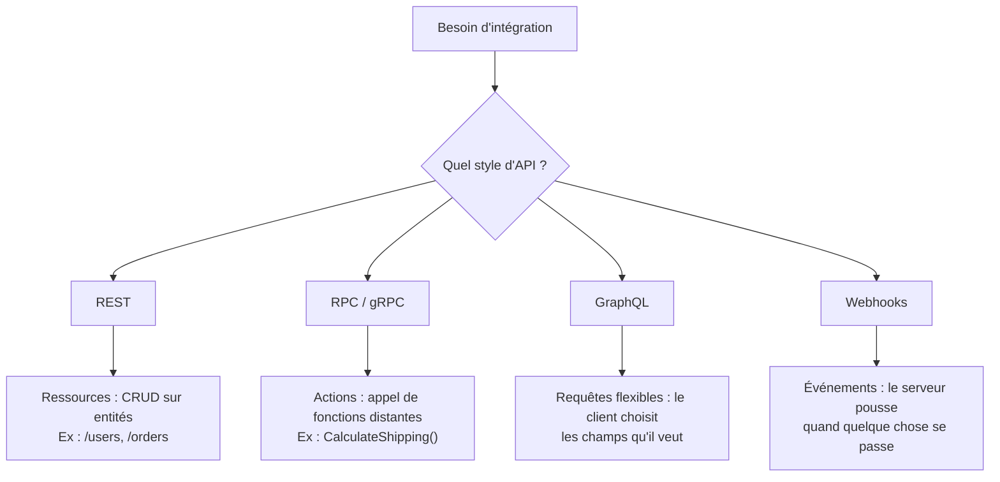

# Fondamentaux des API

## Objectifs pédagogiques

À la fin de ce module, vous serez capable de :

- Expliquer ce qu'est une API et la distinguer d'un backend ou d'une application
- Décrire ce que signifie "contrat" dans le contexte d'une API, avec ses trois dimensions
- Identifier les quatre grands styles d'API (REST, gRPC, GraphQL, Webhooks) et choisir le bon selon le contexte
- Lire une description d'API et identifier ses entrées, sorties et comportements garantis
- Éviter les erreurs de conception les plus fréquentes liées à une mauvaise compréhension du concept

---

## Mise en situation

Vous intégrez un service de paiement dans une application e-commerce. Vous n'avez pas accès au code source — vous ne savez pas s'il est écrit en Java, Go ou Python, vous ne connaissez pas sa base de données, et franchement, ça n'a aucune importance. Ce que vous avez, c'est une documentation qui dit : *"envoie-moi telle requête, je te renverrai telle réponse, et voilà ce qui se passera dans nos systèmes"*.

C'est exactement ça, une API. Pas le backend. Pas l'application. L'**interface** — le contrat entre deux systèmes qui n'ont pas besoin de se connaître en détail pour collaborer.

Ce module pose les bases conceptuelles. Tout le reste du parcours s'appuie dessus.

---

## Ce qu'est une API — et pourquoi ce concept existe

**API** signifie *Application Programming Interface*. La définition littérale est un peu sèche, alors voici une image plus parlante : pensez à une prise électrique murale. Vous branchez votre ordinateur sans savoir comment l'électricité est produite, ni par quel chemin elle arrive. La prise est le contrat — 230V, fréquence 50Hz, forme normalisée. Le reste ne vous regarde pas.

Une API fonctionne exactement pareil. Elle définit trois choses :

- **Ce que vous pouvez demander** — les endpoints disponibles, les paramètres attendus
- **Ce que vous recevrez en retour** — la structure exacte de la réponse
- **Ce qui se passera côté serveur** — création d'une ressource, déclenchement d'un paiement, envoi d'un email

Sans ce concept, chaque système qui voulait communiquer avec un autre devait connaître ses entrailles — sa base de données, ses fichiers internes, son architecture. C'est ingérable à l'échelle. Les API sont nées du besoin d'**interopérabilité sans couplage fort**.

🧠 Une API n'expose pas un système. Elle expose un *comportement*, derrière une interface stable. Vous pouvez refactoriser entièrement votre backend sans casser les clients, du moment que l'API reste compatible.

---

## API, application, service — trois choses différentes

La confusion est courante, même chez des développeurs expérimentés. Voici comment démêler ces trois notions :

| Terme | Ce que c'est | Exemple concret |
|---|---|---|
| **Application** | Logiciel avec une interface utilisateur | L'app mobile de votre banque |
| **Service** | Processus qui tourne en arrière-plan et gère une logique métier | Le backend qui calcule votre solde |
| **API** | L'interface contractuelle qui permet à un autre système d'interagir avec ce service | L'endpoint `GET /accounts/{id}/balance` |

⚠️ "On va créer une API" ne veut pas dire "on va créer un backend". Le backend *existe*. L'API est la façade qu'on décide d'exposer dessus. Et un même backend peut exposer plusieurs API différentes — publique, partenaire, interne — avec des droits et des ressources distincts selon l'audience.

Autre piège fréquent : confondre API et interface web. Un site web est une interface pour des humains. Une API est une interface pour des programmes. Les deux peuvent coexister sur le même serveur, mais ce sont des choses fondamentalement différentes.

<!-- snippet
id: api_concept_vs_backend
type: warning
tech: api
level: beginner
importance: high
format: knowledge
tags: api, backend, application, distinction, conception
title: API ≠ backend ≠ application
content: L'application a une UI (pour des humains). Le service gère la logique métier (tourne en arrière-plan). L'API est l'interface contractuelle exposée sur ce service (pour des programmes). Un même backend peut exposer plusieurs API différentes (publique, partenaire, interne) avec des ressources et droits distincts.
description: API = interface contractuelle sur un service. Pas le service lui-même. Un backend peut exposer plusieurs API différentes selon les audiences.
-->

---

## L'API comme contrat : le point qui change tout

C'est le concept central de ce module — et celui qu'on oublie le plus vite une fois qu'on commence à coder.

Quand vous publiez une API, vous signez un contrat avec tous ses consommateurs. Ce contrat dit : *"si tu m'envoies X, je te renverrai Y, et Z se produira"*. Tout changement qui rompt ce contrat — supprimer un champ, changer le type d'un paramètre, modifier un comportement implicite — est un **breaking change**. Et un breaking change non géré, ça casse des systèmes en production à 3h du matin.

Ce contrat a trois dimensions :

```
INPUT         →    API    →    OUTPUT
(requête)                  (réponse)
               ↓
           COMPORTEMENT
       (effet de bord garanti)
```

Concrètement, pour un endpoint `POST /orders` :

- **Input** — un body JSON avec `product_id`, `quantity`, `user_id`
- **Output** — un objet `order` avec son `id`, son `status`, et le `total`
- **Comportement** — une commande est créée en base, un email de confirmation est envoyé, le stock est décrémenté

Si demain vous supprimez silencieusement l'email de confirmation, vous avez rompu le contrat. Même si la requête continue de retourner un 200.

<!-- snippet
id: api_concept_definition
type: concept
tech: api
level: beginner
importance: high
format: knowledge
tags: api, contrat, interface, architecture, fondamentaux
title: Une API est un contrat en 3 dimensions
content: Une API définit 3 choses : l'INPUT (ce que le client envoie), l'OUTPUT (ce que le serveur renvoie), et le COMPORTEMENT (les effets de bord garantis). Rompre l'un de ces trois éléments sans le signaler = breaking change. Le contrat est indépendant de l'implémentation interne.
description: Les 3 dimensions d'un contrat API : input attendu, output garanti, comportement côté serveur — toute modification non documentée est un breaking change.
-->

💡 Pensez toujours votre API du point de vue du consommateur, pas du producteur. La question n'est pas "qu'est-ce que mon backend peut faire ?" mais "de quoi mon client a besoin, et comment je m'engage à le lui fournir de façon stable ?"

---

## Les quatre styles d'API

Il n'existe pas qu'un seul style d'API. Le choix dépend du problème à résoudre — et confondre les styles mène à des architectures inadaptées.



**REST** (Representational State Transfer) est le style dominant pour les API web. Il repose sur HTTP et modélise tout sous forme de *ressources* — utilisateurs, commandes, produits. Vous lisez, créez, modifiez, supprimez ces ressources via des méthodes HTTP standard. C'est ce que vous rencontrerez dans 80% des cas, et c'est sur ce style que ce parcours se concentre.

**RPC / gRPC** adopte une logique différente : au lieu d'exposer des ressources, on expose des *fonctions*. `GET /users/42` en REST devient `GetUser(id: 42)` en RPC. gRPC est la version moderne de ce style, très répandue pour la communication inter-services dans les architectures microservices — notamment grâce à ses performances (protocole binaire, HTTP/2).

**GraphQL** renverse le rapport de force : c'est le client qui décide exactement quels champs il veut récupérer, en une seule requête. Idéal quand les clients ont des besoins très différents (mobile vs web vs partenaires tiers). En contrepartie, c'est plus complexe à opérer et à sécuriser.

**Webhooks** ne fonctionnent pas sur le modèle requête/réponse classique. C'est le serveur qui *pousse* une notification HTTP vers votre URL quand un événement se produit. Stripe vous envoie un webhook quand un paiement est confirmé — vous n'avez pas à interroger le serveur toutes les 5 secondes pour vérifier. Pratique, mais ça demande une infrastructure capable de recevoir ces appels entrants.

| Critère | REST | gRPC | GraphQL | Webhooks |
|---|---|---|---|---|
| Modèle | Ressources | Fonctions | Requêtes flexibles | Événements |
| Transport | HTTP/1.1+ | HTTP/2 | HTTP | HTTP |
| Format | JSON | Protobuf (binaire) | JSON | JSON |
| Cas typique | API publique, CRUD | Microservices internes | BFF, mobile | Notifications asynchrones |
| Complexité opérationnelle | Faible | Moyenne | Élevée | Moyenne |

<!-- snippet
id: api_concept_types_comparison
type: concept
tech: api
level: beginner
importance: high
format: knowledge
tags: rest, grpc, graphql, webhooks, comparaison
title: 4 styles d'API et leurs cas d'usage
content: REST = ressources CRUD sur HTTP/JSON (API publique, usage général). gRPC = appels de fonctions sur HTTP/2 + Protobuf (microservices internes, haute perf). GraphQL = le client choisit les champs qu'il veut (BFF, clients mobiles aux besoins variés). Webhooks = le serveur pousse un événement HTTP vers votre URL (notifications asynchrones, ex : paiement Stripe confirmé).
description: REST pour le CRUD général, gRPC pour les microservices internes, GraphQL pour les clients flexibles, Webhooks pour les événements asynchrones.
-->

---

## Cas réel : l'API Stripe comme modèle de contrat

Stripe est souvent citée comme référence en matière de design d'API. Ce n'est pas un hasard — leur approche illustre parfaitement ce que "contrat" veut dire en pratique.

Quand vous intégrez Stripe pour gérer des paiements, voici ce qui se passe concrètement :

1. Vous appelez `POST /v1/payment_intents` avec le montant, la devise et l'ID client
2. Stripe renvoie un objet `PaymentIntent` avec un `id`, un `status` à `requires_payment_method` et un `client_secret`
3. Votre frontend utilise ce `client_secret` avec la librairie JS Stripe pour collecter la carte — sans que le numéro ne transite par vos serveurs
4. Stripe envoie un webhook `payment_intent.succeeded` quand le paiement est confirmé
5. Vous mettez à jour la commande en base

Chaque étape est un contrat clair et documenté. Stripe ne vous expose pas son système de traitement bancaire, sa gestion des fraudes, ni ses partenaires acquéreurs. Vous interagissez avec une interface stable, versionnée (`/v1/`), dont le comportement est garanti — et qui n'a pas changé de façon incompatible depuis des années malgré les évolutions internes massives de leur plateforme.

C'est exactement ce vers quoi on tend quand on conçoit une bonne API.

---

## Bonnes pratiques — avant même d'écrire une ligne de code

Ces réflexes s'acquièrent au départ, pas après coup. Les corriger une fois le code en place coûte dix fois plus cher.

**Documentez le contrat avant l'implémentation.** Écrire la spec d'abord — avec OpenAPI par exemple — force à réfléchir aux cas limites, aux erreurs, aux comportements attendus, avant que le code soit difficile à modifier. Les consommateurs peuvent travailler sur des mocks pendant que le backend se développe.

<!-- snippet
id: api_tip_spec_first
type: tip
tech: api
level: beginner
importance: medium
format: knowledge
tags: api, openapi, conception, documentation, contrat
title: Écrire la spec avant le code (API-first)
content: Rédiger la spec OpenAPI avant d'implémenter force à définir les inputs, outputs, erreurs et comportements attendus. Les consommateurs peuvent travailler sur des mocks pendant que le backend se développe, et les cas limites sont identifiés avant que le code soit difficile à changer.
description: Écrire la spec OpenAPI avant le code permet de valider le contrat avec les parties prenantes, générer des mocks, et éviter les refactorisations douloureuses.
-->

**Versionnez dès le premier endpoint.** Préfixer vos routes avec `/v1/` ne coûte rien et vous évite une migration douloureuse le jour où un breaking change est inévitable. Avec `/v2/` en parallèle, vous migrez les clients progressivement, sans interruption de service.

<!-- snippet
id: api_tip_versioning
type: tip
tech: api
level: beginner
importance: medium
format: knowledge
tags: api, versioning, breaking-change, conception, rest
title: Versionner dès le premier endpoint
content: Préfixer toutes les routes avec /v1/ dès le départ, même avec un seul client. Quand un breaking change est inévitable, publier /v2/ en parallèle et migrer les clients progressivement sans interruption. Sans versioning, tout changement casse tout le monde en même temps.
description: Ajouter /v1/ dès le premier endpoint. Permet de publier /v2/ lors d'un breaking change sans couper les clients encore sur l'ancienne version.
-->

**Ne confondez pas votre modèle de données et votre API.** Les colonnes de votre table `users` en base ne sont pas les champs à exposer dans `GET /users`. L'API est une vue sur votre système — pas un miroir de votre BDD.

<!-- snippet
id: api_warning_db_exposure
type: warning
tech: api
level: beginner
importance: high
format: knowledge
tags: api, conception, schema, base-de-données, abstraction
title: Ne pas exposer le schéma de BDD dans l'API
content: Piège classique : mapper directement les colonnes de la table dans les champs de l'API. Si le schéma change (renommage, migration), l'API casse les clients. Correction : créer une couche de mapping entre le modèle interne et la réponse exposée — l'API est une abstraction stable, pas un miroir de la BDD.
description: Exposer directement les colonnes de BDD dans l'API = couplage fort. Tout changement de schéma devient un breaking change pour les clients.
-->

**Documentez les erreurs autant que les succès.** Un bon contrat décrit aussi ce qui se passe quand ça échoue : quel code HTTP, quelle structure de réponse, quels champs permettent de distinguer les cas. Les consommateurs ont besoin de savoir comment gérer les échecs — pas seulement le happy path.

<!-- snippet
id: api_warning_happy_path
type: warning
tech: api
level: beginner
importance: medium
format: knowledge
tags: api, erreurs, contrat, conception, robustesse
title: Documenter les erreurs autant que les succès
content: Piège : ne documenter que le cas nominal (HTTP 200 + réponse OK). Les clients ne savent pas comment gérer les échecs et tombent en erreur non maîtrisée. Pour chaque endpoint, documenter les codes d'erreur possibles (400, 401, 404, 500), la structure de la réponse d'erreur, et les conditions qui les déclenchent.
description: Un contrat d'API incomplet ne documente que le succès. Les consommateurs ont besoin des codes d'erreur, de leur structure, et des conditions qui les déclenchent.
-->

**N'exposez pas vos IDs internes ni vos champs techniques.** Des champs comme `created_at_timestamp_ms` ou `internal_status_code` trahissent votre implémentation. Si vous changez votre schéma de base, vous cassez vos clients. L'API doit être une abstraction stable, indépendante de vos choix internes.

---

## Résumé

Une API est un contrat entre systèmes : elle définit précisément ce qu'on peut demander, ce qu'on recevra, et ce qui se produira en conséquence. Ce n'est ni un backend, ni une application — c'est la façade stable qu'on expose sur un service, indépendante de ce qui se passe en dessous.

Ce concept existe parce que les systèmes distribués ont besoin de collaborer sans se coupler. Une API bien conçue permet de faire évoluer l'implémentation interne sans affecter les consommateurs externes — c'est tout l'enjeu du design.

Il existe quatre grands styles — REST, gRPC, GraphQL, Webhooks — chacun adapté à des contextes différents. REST est le point d'entrée naturel : il repose sur HTTP, modélise des ressources, et couvre la grande majorité des besoins.

La suite du parcours descend dans HTTP et REST pour comprendre le mécanisme sur lequel tout repose.