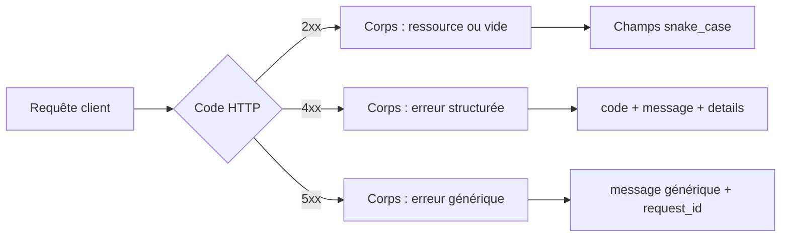

# Bonnes pratiques de base pour une API REST

## Objectifs pédagogiques

À l'issue de ce module, vous serez capable de :

1. **Identifier** les erreurs de conception les plus fréquentes dans une API REST
2. **Structurer** des URLs cohérentes qui respectent les conventions REST
3. **Choisir** le bon code HTTP en fonction du résultat d'une opération
4. **Concevoir** des réponses d'erreur exploitables par les consommateurs
5. **Appliquer** les principes de cohérence et de prévisibilité à l'ensemble d'une API

---

## Mise en situation

Imaginez que vous rejoignez une équipe qui a livré une API en production depuis 6 mois. Dès les premiers appels, vous tombez sur ça :

```
POST /getUser
GET /createOrder?action=new
POST /api/v1/delete_product_by_id
```

Le premier retourne `200 OK` même quand l'utilisateur n'existe pas — avec `{ "success": false }` dans le corps. Le second lève une exception non catchée qui renvoie une stack trace Java directement au client. Le troisième… personne ne sait vraiment ce qu'il fait.

C'est une situation réelle, pas un cas d'école. Ce type d'API existe en production dans des dizaines d'entreprises. Le résultat : les intégrateurs passent leur temps à lire le code source pour comprendre ce que l'API est censée faire, les erreurs sont silencieuses, et chaque endpoint est une surprise.

Les bonnes pratiques REST ne sont pas une checklist bureaucratique. Ce sont des **conventions qui rendent une API prévisible** — pour vos collègues, pour vos clients, pour vous-même dans six mois.

---

## Ce que c'est — et pourquoi ça existe

Une API REST bien conçue repose sur un principe simple : **le consommateur ne devrait jamais avoir à deviner**. Ni l'URL à appeler, ni le code de retour à interpréter, ni la structure de la réponse en cas d'erreur.

Ces conventions ont émergé progressivement dans l'industrie, pas par idéologie, mais parce que des milliers d'équipes ont observé les mêmes dysfonctionnements récurrents : des APIs impossibles à maintenir, des intégrations fragiles, des bugs silencieux en production. Les bonnes pratiques de base sont la réponse collective à ces problèmes.

🧠 **Concept clé** — Une API, c'est un contrat. Les conventions REST définissent le *langage* de ce contrat. Si tout le monde parle le même langage, l'intégration devient mécanique. Si chaque API invente le sien, chaque intégration redevient un projet à part entière.

---

## Nommer les ressources correctement

C'est souvent là que tout se joue. L'URL d'une API REST doit représenter une **ressource** (un nom), pas une action (un verbe). L'action est déjà portée par la méthode HTTP.

**Ce qu'on voit trop souvent :**

```
GET  /getUsers
POST /createProduct
DELETE /deleteOrder?id=42
POST /user/doLogin
```

**Ce que ça devrait être :**

```
GET    /users
POST   /products
DELETE /orders/42
POST   /sessions
```

La différence n'est pas cosmétique. Quand l'URL est `/getUsers`, vous avez déjà une redondance : `GET /getUsers` dit deux fois la même chose. Et si demain vous voulez ajouter une version paginée, une version filtrée, une version exportée — vous allez créer `/getUsersPaginated`, `/getUsersFiltered`… jusqu'à l'absurde.

Avec `/users`, vous avez une ressource. Vous pouvez y ajouter des query params, des sous-ressources, des méthodes différentes. La structure reste cohérente.

**Quelques règles concrètes :**

| Convention | Exemple correct | Exemple à éviter |
|---|---|---|
| Pluriel pour les collections | `/orders` | `/order` |
| Minuscules, tirets si besoin | `/product-categories` | `/ProductCategories` |
| Hiérarchie logique | `/users/42/orders` | `/getUserOrders?userId=42` |
| Pas de verbe dans l'URL | `/sessions` (pour login) | `/login` |
| Identifiant dans le chemin | `/orders/42` | `/orders?id=42` |

⚠️ **Erreur fréquente** — Mettre l'ID en query param (`/orders?id=42`) pour une ressource spécifique. Les query params sont faits pour le **filtrage et la pagination** sur une collection, pas pour identifier une ressource unique. `/orders/42` est la forme correcte.

---

## Utiliser les méthodes HTTP pour ce qu'elles sont

HTTP vous donne déjà un vocabulaire d'actions. L'exploiter correctement, c'est rendre votre API lisible sans documentation.

```
GET    /articles        → liste les articles
GET    /articles/7      → récupère l'article 7
POST   /articles        → crée un nouvel article
PUT    /articles/7      → remplace complètement l'article 7
PATCH  /articles/7      → modifie partiellement l'article 7
DELETE /articles/7      → supprime l'article 7
```

La distinction `PUT` vs `PATCH` mérite qu'on s'y arrête. `PUT` est censé être idempotent et remplacer l'intégralité de la ressource — si vous envoyez `PUT /articles/7` avec seulement `{ "title": "Nouveau titre" }`, les autres champs devraient être effacés ou mis à null. `PATCH` modifie seulement ce que vous envoyez, le reste est inchangé.

En pratique, beaucoup d'APIs utilisent `PUT` avec la sémantique de `PATCH`. C'est acceptable à condition d'être cohérent — mais documentez-le clairement.

🧠 **Concept clé — Idempotence** — Une opération est idempotente si l'appeler une fois ou dix fois produit le même résultat. `GET`, `PUT`, `DELETE` sont idempotents. `POST` ne l'est pas : appeler `POST /orders` deux fois crée deux commandes. C'est important pour la gestion des erreurs réseau et les mécanismes de retry.

---

## Codes HTTP : parler le même langage

Un code HTTP, c'est la première information que le consommateur reçoit. Avant même de lire le corps de la réponse, il sait si quelque chose s'est bien passé — ou pas. Utiliser `200 OK` pour tout, y compris les erreurs, oblige le client à parser le JSON pour savoir si ça a marché. C'est un piège classique.

Voici les codes à maîtriser en priorité :

| Code | Signification | Quand l'utiliser |
|---|---|---|
| `200 OK` | Succès général | GET, PUT, PATCH réussis |
| `201 Created` | Ressource créée | POST qui crée une ressource |
| `204 No Content` | Succès sans corps | DELETE réussi |
| `400 Bad Request` | Erreur côté client | Validation échouée, JSON malformé |
| `401 Unauthorized` | Non authentifié | Token absent ou expiré |
| `403 Forbidden` | Non autorisé | Authentifié mais sans permission |
| `404 Not Found` | Ressource absente | ID inexistant |
| `409 Conflict` | Conflit d'état | Email déjà utilisé, version obsolète |
| `422 Unprocessable Entity` | Données invalides | Données bien formées mais sémantiquement incorrectes |
| `500 Internal Server Error` | Erreur serveur | Bug non anticipé, exception non gérée |

La distinction `401` vs `403` est souvent mal comprise. `401` veut dire "je ne sais pas qui vous êtes" — vous n'êtes pas authentifié, ou votre token est invalide. `403` veut dire "je sais qui vous êtes, mais vous n'avez pas le droit" — vous êtes connecté, mais vous n'avez pas accès à cette ressource.

⚠️ **Erreur fréquente** — Renvoyer `200 OK` avec `{ "error": true, "message": "User not found" }`. Du point de vue HTTP, l'appel a réussi. Les outils de monitoring, les proxies, les caches et les clients HTTP vont tous traiter ça comme un succès. Utilisez `404`.

---

## Concevoir des réponses d'erreur utiles

Un code HTTP dit *ce qui s'est passé*. Le corps de la réponse d'erreur doit dire *pourquoi* — de façon suffisamment précise pour que le consommateur puisse agir.

Voici un format simple et efficace, largement adopté :

```json
{
  "error": {
    "code": "VALIDATION_ERROR",
    "message": "La requête contient des champs invalides.",
    "details": [
      {
        "field": "email",
        "issue": "Format invalide"
      },
      {
        "field": "age",
        "issue": "Doit être un entier positif"
      }
    ]
  }
}
```

Ce format donne trois niveaux d'information :
- `code` — une constante lisible par machine, utile pour brancher de la logique côté client
- `message` — un texte humain pour le débogage
- `details` — le détail champ par champ quand c'est une erreur de validation

💡 **Astuce** — Incluez un `request_id` ou `trace_id` dans vos réponses d'erreur. Quand un client vous signale un bug, vous pouvez retrouver immédiatement la trace dans vos logs. Sans ça, vous cherchez une aiguille dans une botte de foin.

Ce que vous ne devez jamais exposer dans une réponse d'erreur : une stack trace, un message d'exception interne, un chemin de fichier, un nom de table SQL. Ces informations sont une aide à l'attaque, pas une aide au débogage.

---

## Versionner son API dès le départ

Une API publique ou partagée évolue. Si vous n'avez pas prévu de versionnement, la moindre modification breaking change force tous vos consommateurs à s'adapter en même temps — ou vous oblige à ne jamais rien changer.

La convention la plus répandue est le versionnement dans l'URL :

```
/v1/users
/v2/users
```

C'est explicite, simple à router, et visible dans les logs. Les alternatives existent — header `Accept: application/vnd.api+json;version=2`, query param `?version=2` — mais l'URL reste la plus pratique pour déboguer et pour les caches.

💡 **Astuce** — Commencez en `/v1` même si vous n'avez qu'une version. Ajouter le versionnement après coup, une fois des clients connectés, est douloureux. Le coût de l'ajouter dès le départ est quasi nul.

---

## La cohérence : le principe qui chapeaute tout

Vous pouvez respecter toutes les règles précédentes et quand même avoir une API difficile à utiliser — si vous n'êtes pas cohérent. La cohérence, c'est que le consommateur peut extrapoler : "si `/users/42` renvoie l'utilisateur 42, alors `/orders/17` renvoie la commande 17".

Concrètement, ça signifie :

- Même structure de réponse pour tous les endpoints similaires
- Même nommage des champs (`created_at` partout, pas `createdAt` ici et `creation_date` là)
- Même format de dates (ISO 8601 : `2024-03-15T10:30:00Z`, toujours)
- Même pagination sur toutes les collections
- Même structure d'erreur partout



🧠 **Concept clé** — La cohérence réduit la charge cognitive des consommateurs. Chaque exception à la règle est une chose de plus à documenter, à mémoriser, à tester. Une API cohérente, même imparfaite, est plus utilisable qu'une API qui suit les meilleures pratiques à 80% mais change de convention selon l'endpoint.

---

## Cas réel — Refonte d'une API interne

Une équipe e-commerce avait une API interne consommée par trois applications front (web, mobile, backoffice). L'API avait été construite au fil des besoins, sans convention définie.

**État initial :**
- URLs mixtes : `/getProduct`, `/product/update`, `/products/delete?id=X`
- Tous les endpoints renvoyaient `200` avec `{ "status": "error" }` en cas d'échec
- Les erreurs de validation ne précisaient pas quel champ posait problème
- Pas de versionnement

**Problèmes concrets observés :**
- Le monitoring ne détectait aucune erreur fonctionnelle (tout était `200`)
- Les développeurs front consultaient le code source backend pour comprendre les réponses
- Une modification du format d'un champ a cassé les trois apps simultanément

**Ce qui a été fait :**
1. Définition d'un guide de style API (convention de nommage, structure de réponse, codes HTTP)
2. Migration vers `/v1/` avec les nouvelles conventions
3. Maintien temporaire des anciens endpoints pour ne pas casser les clients existants
4. Ajout d'alerting sur les `4xx` et `5xx` dans le monitoring

**Résultat mesurable :** Le temps moyen d'intégration d'un nouvel endpoint est passé de 2 jours à 4 heures. Les incidents liés à des erreurs silencieuses ont disparu en deux semaines.

---

## Résumé

Les bonnes pratiques REST ne sont pas arbitraires — elles sont le résultat de problèmes réels rencontrés à grande échelle. Une URL propre (noms, pluriels, hiérarchie), des méthodes HTTP utilisées pour leur sémantique, des codes de statut précis et des erreurs structurées forment ensemble un contrat lisible par tous sans avoir besoin de documentation à chaque appel.

La cohérence est le méta-principe : mieux vaut des conventions imparfaites mais appliquées uniformément, que des règles idéales respectées à moitié. Versionnez dès le départ, ne laissez jamais une stack trace atteindre le client, et traitez votre API comme un produit que quelqu'un d'autre doit comprendre sans vous appeler.

La prochaine étape naturelle est la documentation — car une API bien conçue mérite d'être correctement décrite pour que ces conventions soient explicites et accessibles à tous les consommateurs.

---

<!-- snippet
id: api_url_ressource_naming
type: concept
tech: rest
level: beginner
importance: high
format: knowledge
tags: api, rest, url, naming, architecture
title: URLs REST : noms de ressources, pas d'actions
content: L'URL identifie une ressource (nom), la méthode HTTP porte l'action (verbe). `GET /users` = lire la collection. `DELETE /users/42` = supprimer la ressource 42. Ajouter un verbe dans l'URL (`/getUsers`, `/deleteUser`) crée une redondance et rend l'API imprévisible. La ressource doit être au pluriel et en minuscules.
description: L'URL = ressource (nom pluriel). La méthode HTTP = action. Ne jamais mettre de verbe dans l'URL.
-->

<!-- snippet
id: api_http_codes_fondamentaux
type: concept
tech: rest
level: beginner
importance: high
format: knowledge
tags: api, rest, http, status-codes, erreurs
title: Codes HTTP essentiels à maîtriser en REST
content: 200 succès général, 201 ressource créée (POST), 204 succès sans corps (DELETE), 400 erreur client / validation, 401 non authentifié, 403 authentifié mais interdit, 404 ressource absente, 409 conflit d'état, 422 données valides mais incohérentes, 500 erreur serveur non anticipée.
description: Retourner le bon code HTTP avant même de lire le corps — c'est la première info que le consommateur reçoit.
-->

<!-- snippet
id: api_erreur_200_silencieux
type: warning
tech: rest
level: beginner
importance: high
format: knowledge
tags: api, rest, erreur, monitoring, http
title: Ne jamais retourner 200 pour une erreur fonctionnelle
content: Piège : répondre `200 OK` avec `{ "success": false }` en cas d'erreur. Conséquence : le monitoring ne détecte rien (tout est 200), les proxies et caches traitent ça comme un succès, le client doit parser le JSON pour savoir si ça a marché. Correction : utiliser le code HTTP approprié (404, 400, 409...) et structurer l'erreur dans le corps.
description: `200` + `{ "error": true }` = erreur silencieuse. Le monitoring, les caches et les clients HTTP lisent le code, pas le corps.
-->

<!-- snippet
id: api_erreur_structure_format
type: tip
tech: rest
level: beginner
importance: high
format: knowledge
tags: api, rest, erreur, json, debug
title: Format de réponse d'erreur structuré et exploitable
content: Format recommandé : `{ "error": { "code": "VALIDATION_ERROR", "message": "Texte humain", "details": [{ "field": "email", "issue": "Format invalide" }] } }`. Ajouter un `request_id` pour relier l'erreur aux logs. Ne jamais exposer de stack trace, de chemin de fichier ou de message d'exception interne dans la réponse.
description: Une erreur utile contient un `code` machine, un `message` humain, un `details` champ par champ et un `request_id` pour le suivi en logs.
-->

<!-- snippet
id: api_401_vs_403
type: concept
tech: rest
level: beginner
importance: medium
format: knowledge
tags: api, rest, authentification, autorisation, securite
title: 401 vs 403 — différence fondamentale
content: 401 Unauthorized = "Je ne sais pas qui vous êtes" — token absent, expiré ou invalide. Le client doit s'authentifier. 403 Forbidden = "Je sais qui vous êtes, mais vous n'avez pas le droit" — authentifié, mais sans permission sur cette ressource. Confondre les deux génère des messages d'erreur trompeurs et complique le débogage côté client.
description: 401 = identité inconnue (authentifie-toi). 403 = identité connue mais accès refusé (permission insuffisante).
-->

<!-- snippet
id: api_versioning_url_v1
type: tip
tech: rest
level: beginner
importance: medium
format: knowledge
tags: api, rest, versioning, architecture, evolution
title: Versionner l'API dès le départ en /v1/
content: Préfixer toutes les routes dès le début : `/v1/users`, `/v1/orders`. Ajouter le versionnement après coup, quand des clients sont connectés, oblige à maintenir deux comportements en parallèle ou à casser les intégrateurs. Le coût initial est nul — une route `/v1/` vs `/`. L'URL est la méthode la plus simple : visible dans les logs, facile à router, compatible avec les caches.
description: Commencer en `/v1/` même sans alternative. Ajouter le versionnement après coup avec des clients connectés est coûteux et risqué.
-->

<!-- snippet
id: api_put_vs_patch
type: concept
tech: rest
level: beginner
importance: medium
format: knowledge
tags: api, rest, http, idempotence, methodes
title: PUT vs PATCH — remplacement total ou partiel
content: PUT remplace la ressource entière : envoyer `PUT /articles/7` avec seulement `{ "title": "X" }` devrait effacer les autres champs. PATCH modifie uniquement les champs envoyés, le reste est conservé. En pratique, beaucoup d'APIs utilisent PUT avec la sémantique de PATCH — c'est acceptable si c'est cohérent et documenté.
description: PUT = remplacement complet (idempotent). PATCH = modification partielle. Si vous utilisez PUT comme PATCH, documentez-le explicitement.
-->

<!-- snippet
id: api_id_chemin_vs_queryparam
type: warning
tech: rest
level: beginner
importance: medium
format: knowledge
tags: api, rest, url, query-params, ressource
title: Identifiant de ressource dans le chemin, pas en query param
content: Piège : `/orders?id=42` pour accéder à une ressource spécifique. Conséquence : sémantique incorrecte — les query params sont faits pour filtrer une collection, pas identifier une ressource unique. Les caches HTTP, les proxies et les outils d'analyse traitent différemment les chemins et les query params. Correction : `/orders/42` pour l'identifiant, `?status=pending&page=2` pour le filtrage.
description: `/orders/42` pour identifier une ressource. `?status=pending` pour filtrer une collection. Ne pas confondre les deux.
-->

<!-- snippet
id: api_coherence_champs_dates
type: tip
tech: rest
level: beginner
importance: medium
format: knowledge
tags: api, rest, coherence, json, dates
title: Cohérence des noms de champs et format de dates dans toute l'API
content: Choisir une convention et l'appliquer partout : snake_case (`created_at`) ou camelCase (`createdAt`), jamais les deux dans la même API. Pour les dates, toujours ISO 8601 avec timezone : `2024-03-15T10:30:00Z`. Chaque exception est une chose de plus à documenter et à tester. Une API cohérente même imparfaite est plus utilisable qu'une API partiellement excellente.
description: snake_case partout, dates en ISO 8601 (`2024-03-15T10:30:00Z`), même structure de pagination sur toutes les collections — sans exception.
-->
