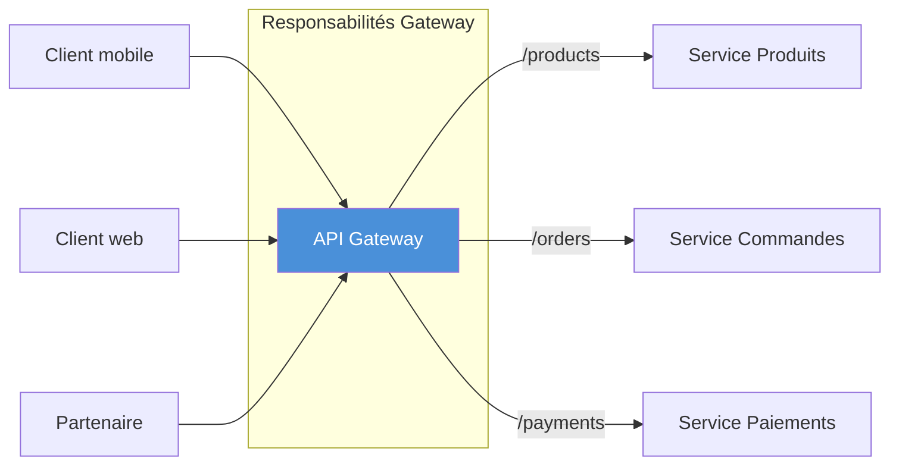
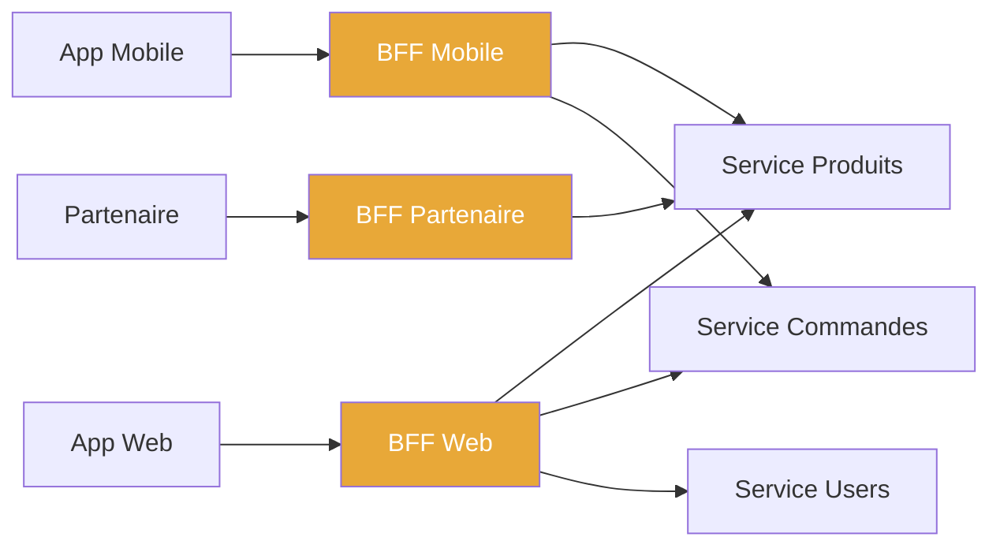

# 🏗️ Architecture API

## Objectifs pédagogiques

À la fin de ce module, vous serez capable de :

1. **Identifier** les composants structurants d'une architecture API et leur rôle respectif
2. **Distinguer** les patterns d'organisation (monolithique, gateway, BFF) selon le contexte
3. **Concevoir** le contrat d'interface d'une API en tenant compte des contraintes de versioning et de déploiement
4. **Justifier** un choix architectural face à des critères concrets (charge, équipes, couplage)
5. **Anticiper** les pièges structurels les plus fréquents avant qu'ils n'atteignent la production

---

## Mise en situation

Imaginons une équipe qui construit une plateforme e-commerce. Au départ, tout est dans un seul service : les produits, les commandes, les utilisateurs, les paiements. L'API expose tout via `/api/v1/...`. Ça marche.

Six mois plus tard, l'équipe mobile a besoin de données formatées différemment. L'équipe partenaires doit accéder à certaines ressources avec des droits restreints. L'équipe interne veut appeler les services directement, sans passer par le front. Et soudain, tout le monde modifie la même base de code pour des raisons complètement différentes.

C'est exactement le moment où **l'absence d'architecture API devient visible** — non pas comme un problème théorique, mais comme une friction quotidienne qui ralentit les livraisons, multiplie les bugs, et rend chaque déploiement risqué.

Ce module répond à une question simple : **comment organiser une API pour qu'elle reste maintenable, évolutive et opérable à mesure que le système grandit ?**

---

## Ce que c'est — et pourquoi ça existe

Une architecture API, ce n'est pas juste "comment tu découpes tes routes". C'est la façon dont tu organises **les frontières de ton système** : qui peut appeler quoi, comment les données circulent, comment les changements sont isolés.

Sans réflexion architecturale, une API devient ce qu'on appelle un **big ball of mud** : tout est accessible, tout est couplé, et modifier un endpoint peut casser dix autres choses sans qu'on le sache. L'équipe passe plus de temps à démêler les dépendances qu'à livrer des fonctionnalités.

L'architecture API répond à trois tensions permanentes dans tout système en production :

- **Le couplage** : comment faire évoluer un service sans casser les consommateurs ?
- **La lisibilité** : comment un développeur externe (ou vous dans six mois) comprend rapidement ce que l'API fait ?
- **L'opérabilité** : comment sécuriser, monitorer et scaler chaque partie indépendamment ?

Ces questions ont émergé progressivement avec l'essor des systèmes distribués et des équipes pluridisciplinaires. Les réponses ont donné naissance à plusieurs patterns — gateway, BFF, contract-first — qu'on va explorer ici.

---

## Les composants d'une architecture API

Avant les patterns, il faut nommer les pièces du puzzle. Une architecture API bien pensée s'articule autour de quelques éléments clés :

| Composant | Rôle | Exemple concret |
|-----------|------|-----------------|
| **API Gateway** | Point d'entrée unique, gère auth, routing, rate limiting | Kong, AWS API Gateway, Nginx |
| **Service backend** | Logique métier exposée via une interface HTTP | Service `orders`, service `users` |
| **Contrat d'interface** | Spécification formelle de l'API (schéma, types, comportements) | OpenAPI 3.0, Protobuf |
| **Versioning** | Mécanisme pour faire évoluer l'API sans casser les clients | `/v1/`, header `Accept-Version` |
| **Consumer** | Tout client qui appelle l'API (front, mobile, service tiers) | Application React, app iOS, partenaire B2B |
| **Middleware** | Traitement transversal entre requête et réponse | Auth, logging, transformation de payload |

Ces composants ne sont pas tous présents dans chaque architecture — une petite API interne n'a pas forcément besoin d'une gateway. Mais les connaître permet de **décider consciemment** ce qu'on inclut ou non.

---

## Les patterns d'organisation

### Pattern 1 — L'API directe (point à point)

C'est le point de départ naturel. Chaque service expose ses endpoints, les consommateurs les appellent directement.

```
[Client mobile]  ──────────────────→  [Service Produits :8001]
[Client web]     ──────→  [Service Commandes :8002]
[Partenaire API] ─────────────────────────────→  [Service Paiements :8003]
```

**Quand ça marche** : petite équipe, service unique, contexte interne. La simplicité est réelle — pas de couche supplémentaire, débogage direct.

**Quand ça grippe** : dès que plusieurs clients ont des besoins différents, dès qu'on veut centraliser l'auth, dès qu'un service change d'URL ou de port. Chaque consommateur connaît l'adresse interne de chaque service — c'est du couplage structurel.

---

### Pattern 2 — L'API Gateway

L'idée : **un seul point d'entrée public** qui route les requêtes vers les services internes, et qui prend en charge les responsabilités transversales.



La gateway centralise : authentification, rate limiting, logging, SSL termination, parfois la transformation de payload. Les services internes ne connaissent plus les clients — ils ne connaissent que la gateway.

💡 **Ce que ça change concrètement** : un service peut changer d'adresse, de port, même de technologie — les clients ne le savent pas. La gateway absorbe le changement.

⚠️ **Piège classique** : transformer la gateway en "God Gateway" — y mettre de la logique métier, des règles de transformation complexes, des branchements conditionnels. La gateway doit rester **structurelle**, pas fonctionnelle. Dès qu'elle contient `if user.type == "premium" then...`, vous avez un problème.

---

### Pattern 3 — BFF (Backend for Frontend)

Le BFF est une évolution naturelle de la gateway quand les clients ont des besoins **vraiment différents**. Plutôt qu'une gateway générique, on crée des couches d'adaptation dédiées à chaque type de consommateur.



L'app mobile a besoin de payloads légers (bande passante limitée, batterie). L'app web peut absorber plus de données et fait des agrégations complexes. Le partenaire a accès à un sous-ensemble restreint. Avec un BFF par client, **chaque équipe frontend contrôle son propre contrat d'interface** sans impacter les autres.

🧠 **Concept clé** : le BFF n'est pas un microservice métier. C'est une couche d'orchestration et d'adaptation. Il agrège, filtre, reformate — mais ne contient pas de logique de domaine.

---

## Le contrat d'interface — la pièce centrale

Quel que soit le pattern choisi, tout repose sur une chose : **le contrat**. C'est ce qui définit formellement ce que l'API accepte en entrée, ce qu'elle retourne en sortie, et comment elle se comporte.

Un contrat bien défini, c'est ce qui permet :
- à deux équipes de travailler en parallèle sans se bloquer mutuellement (contract-first development)
- à un consommateur de ne pas être cassé par une mise à jour de l'API
- aux tests automatisés de valider la conformité sans déployer

OpenAPI 3.0 est aujourd'hui le standard de facto pour décrire ce contrat en REST. Un exemple minimal :

```yaml
openapi: 3.0.0
info:
  title: Orders API
  version: "1.2"
paths:
  /orders/{id}:
    get:
      summary: Récupère une commande par ID
      parameters:
        - name: id
          in: path
          required: true
          schema:
            type: string
            format: uuid
      responses:
        "200":
          description: Commande trouvée
          content:
            application/json:
              schema:
                $ref: "#/components/schemas/Order"
        "404":
          description: Commande introuvable
components:
  schemas:
    Order:
      type: object
      required: [id, status, total]
      properties:
        id:
          type: string
          format: uuid
        status:
          type: string
          enum: [pending, confirmed, shipped, cancelled]
        total:
          type: number
          format: float
```

Ce fichier n'est pas de la documentation — c'est **la source de vérité**. À partir de lui, on peut générer des clients, des mocks, des tests de contrat. C'est l'approche "contract-first" : on spécifie avant de coder.

⚠️ **L'erreur inverse** — l'approche "code-first" où on génère le contrat à partir du code — produit souvent des contrats qui reflètent des détails d'implémentation plutôt qu'une interface claire. Le résultat : des champs nommés `internalOrderObj`, des structures héritées du modèle de base de données, des types incohérents entre endpoints.

---

## Le versioning — gérer l'évolution sans casser

Une API en production est utilisée par des clients qu'on ne contrôle pas. Une application mobile déployée sur le store continue d'appeler `/v1/orders` six mois après que l'équipe backend soit passée à `/v2/`. Le versioning, c'est ce qui rend ces deux mondes compatibles.

Trois stratégies existent, avec des compromis réels :

| Stratégie | Exemple | Avantage | Inconvénient |
|-----------|---------|----------|--------------|
| **URL path** | `/v1/orders`, `/v2/orders` | Visible, facile à router | Pollue les URLs, encourage les copier-coller |
| **Header HTTP** | `Accept-Version: 2` | URLs propres | Invisible, plus difficile à tester manuellement |
| **Query param** | `/orders?version=2` | Simple à tester | Mélange version et filtre de données |

En pratique, **le versioning par URL path domine** parce qu'il est simple à comprendre, à documenter, et à configurer dans une gateway. C'est aussi le plus explicite dans les logs.

🧠 **Ce que "non-breaking change" signifie concrètement** : ajouter un champ optionnel dans la réponse ne casse pas les clients existants (ils l'ignorent). Renommer un champ, changer son type, ou le supprimer — ça casse. La règle de base : **on ajoute, on ne modifie pas, on ne supprime pas** dans une version existante.

💡 Une stratégie efficace en production : maintenir `v1` et `v2` simultanément pendant une période de transition (6 à 12 mois), avec un header de dépréciation `Deprecation: true` et `Sunset: 2025-06-01` pour informer les clients du calendrier d'extinction.

---

## Prise de décision — quel pattern pour quel contexte ?

Voici les critères qui devraient guider votre choix, pas des dogmes sur les microservices.

**API directe** — Si vous avez un seul service, une seule équipe, un seul type de client, et une codebase qu'une personne peut tenir dans sa tête. Ne sur-architecturez pas.

**API Gateway** — Dès que vous avez plusieurs services internes, plusieurs consommateurs, ou des besoins transversaux (auth centralisée, rate limiting, monitoring unifié). C'est souvent le bon choix à partir de 3-4 services.

**BFF** — Quand vos clients ont des besoins structurellement différents et que la gateway générique force tout le monde à des compromis douloureux. Attention : chaque BFF est une surface à maintenir. Ne créez pas un BFF par endpoint.

Un signal concret que vous avez besoin d'un BFF : votre API générique retourne 40 champs, et l'app mobile en utilise 8, pendant que le client web en veut 35 mais dans un format différent. Vous ajoutez des paramètres de filtrage de plus en plus complexes pour satisfaire tout le monde — c'est le moment de séparer.

---

## Cas réel — Refactoring d'une API monolithique

**Contexte** : une plateforme SaaS B2B avec une API REST unique qui sert une application web, une app mobile, et une intégration Zapier. Après 18 mois, l'équipe rencontre des problèmes récurrents : les déploiements cassent l'app mobile, les payloads sont trop lourds sur mobile, et les partenaires Zapier voient des champs internes qu'ils ne devraient pas voir.

**Démarche adoptée** :

1. **Audit des usages** : cartographie de qui appelle quoi, avec quelle fréquence, en utilisant les logs de la gateway (Nginx + parsing des access logs). Résultat : l'app mobile utilise 12 endpoints sur 47, avec des payloads moyens de 8 KB alors que 2 KB suffiraient.

2. **Introduction d'une gateway Kong** : mise en place en coupure, sans toucher les services. Routage identique dans un premier temps. Bénéfice immédiat : centralisation de l'auth JWT, rate limiting par client, métriques par endpoint.

3. **Création d'un BFF Mobile** : service Node.js léger qui agrège et filtre les réponses des services existants. Déployé indépendamment. L'équipe mobile contrôle maintenant son contrat sans dépendre des cycles de release backend.

4. **Versioning formalisé** : introduction du préfixe `/v2/` pour les nouvelles routes, avec politique de dépréciation documentée. Les clients Zapier restent sur `/v1/` pendant 9 mois.

**Résultats mesurés** : réduction de 60% du poids des payloads mobile, zéro breaking change sur les 3 derniers trimestres, temps de débogage divisé par deux grâce aux métriques centralisées.

---

## Bonnes pratiques et pièges à éviter

**Concevoir le contrat avant le code.** C'est contre-intuitif quand on est habitué à coder d'abord, mais ça force les bonnes questions tôt : quel est le vrai besoin du consommateur ? Quels champs sont obligatoires ? Que se passe-t-il en cas d'erreur ? Une spécification OpenAPI rédigée en équipe en 2 heures évite souvent 2 semaines de refactoring.

**Ne pas exposer votre modèle de données directement.** L'erreur classique : l'entité `User` de la base de données devient directement le payload de `GET /users/{id}`, avec `password_hash`, `internal_flags`, `db_created_at`... Les consommateurs se couplent à votre structure interne. Utilisez des DTOs (Data Transfer Objects) — des objets de réponse dédiés, décorélés du schéma de base de données.

**Documenter les erreurs autant que les succès.** La plupart des spécifications décrivent le `200 OK` en détail et expédient les erreurs en deux lignes. En production, c'est l'inverse qui compte : les consommateurs ont besoin de savoir exactement ce que signifie un `422` vs un `400`, quels champs du body d'erreur sont stables, et quand retry est approprié.

**Tester le contrat, pas seulement le code.** Les tests unitaires vérifient que votre code fait ce que vous pensez. Les tests de contrat (Pact, Dredd) vérifient que votre API fait ce que les consommateurs attendent. Ce sont deux choses différentes. En environnement multi-équipes, les tests de contrat évitent la majorité des régressions de déploiement.

⚠️ **La gateway n'est pas un firewall applicatif.** Une erreur fréquente : mettre des règles métier dans la gateway ("si le user est sur le plan gratuit, limiter à 10 résultats"). Quand ces règles évoluent, modifier la gateway impacte tous les services. Les règles métier appartiennent aux services. La gateway fait de l'infrastructure.

---

## Résumé

L'architecture API, c'est la discipline qui consiste à organiser les frontières de votre système de façon à ce que les changements restent locaux, que les consommateurs soient protégés des détails internes, et que chaque partie puisse évoluer indépendamment.

Les trois patterns essentiels — API directe, Gateway, BFF — ne sont pas en compétition : ils répondent à des contextes différents, et un même système peut en combiner plusieurs. Ce qui les relie, c'est le contrat : une spécification formelle qui précède le code, documente les comportements d'erreur, et constitue la base des tests de non-régression.

Le versioning est le mécanisme qui donne du temps — il permet de faire évoluer l'API sans forcer tous les clients à migrer en même temps. La règle est simple : dans une version existante, on ajoute, jamais on ne modifie ni on ne supprime.

La suite logique de ce module : la sécurité des API (authentification, autorisation, protection contre les abus) et la conception du contrat d'erreur.

---

<!-- snippet
id: api_gateway_role
type: concept
tech: api
level: intermediate
importance: high
format: knowledge
tags: gateway, architecture, routing, middleware
title: Rôle d'une API Gateway
content: La gateway est un reverse proxy applicatif : elle reçoit toutes les requêtes publiques et les route vers les services internes selon des règles de path ou de header. Elle gère les responsabilités transversales (auth JWT, rate limiting, SSL termination, logging) une seule fois pour tous les services. Les services internes ne connaissent que la gateway, pas les clients.
description: Point d'entrée unique qui absorbe les changements internes et centralise auth, logs et rate limiting pour tous les services.
-->

<!-- snippet
id: api_bff_pattern
type: concept
tech: api
level: intermediate
importance: high
format: knowledge
tags: bff, architecture, mobile, frontend
title: Pattern BFF — Backend for Frontend
content: Un BFF est une couche d'adaptation dédiée à un type de client (mobile, web, partenaire). Il agrège et reformate les réponses de plusieurs services selon les besoins spécifiques du client. Un BFF mobile retourne des payloads légers (8 champs sur 40), un BFF web peut agréger plusieurs services en un seul appel. Il ne contient pas de logique métier — uniquement de l'orchestration et du formatage.
description: Couche d'adaptation par type de client : filtre, agrège et formate les données sans dupliquer la logique métier.
-->

<!-- snippet
id: api_contract_first
type: tip
tech: openapi
level: intermediate
importance: high
format: knowledge
tags: openapi, contract, design, specification
title: Approche contract-first avec OpenAPI
content: Rédiger la spécification OpenAPI 3.0 avant de coder force les bonnes questions tôt (quels champs ? quelles erreurs ? quels types ?). À partir du fichier YAML, on peut générer des mocks (Prism), des clients (openapi-generator), et des tests de contrat (Dredd). L'approche inverse (générer le contrat depuis le code) produit des contrats pollués par les détails d'implémentation.
description: Spécifier l'interface avant de coder évite les refactorings coûteux et permet de générer mocks, clients et tests depuis un seul fichier.
-->

<!-- snippet
id: api_versioning_url
type: concept
tech: api
level: intermediate
importance: high
format: knowledge
tags: versioning, url, breaking-change, deprecation
title: Versioning par URL path — règles et cycle de vie
content: Le versioning /v1/, /v2/ est le plus courant car visible dans les logs, facile à router en gateway, et explicite dans la documentation. Règle fondamentale : dans une version existante, on ajoute des champs optionnels (non-breaking), on ne renomme pas, on ne change pas les types, on ne supprime pas. Pour déprécier /v1/, utiliser les headers HTTP Deprecation: true et Sunset: 2025-06-01 pour informer les clients du calendrier d'extinction.
description: Ajouter est non-breaking, modifier ou supprimer est breaking. Déprécier avec les headers Deprecation + Sunset pour laisser le temps aux clients.
-->

<!-- snippet
id: api_gateway_antipattern
type: warning
tech: api
level: intermediate
importance: high
format: knowledge
tags: gateway, antipattern, logique-metier, architecture
title: Anti-pattern — logique métier dans la gateway
content: Piège : mettre des règles conditionnelles dans la gateway (if user.plan == "free" → limiter les résultats). Conséquence : la gateway devient un point de couplage fort — chaque évolution métier impose une modification de l'infrastructure partagée par tous les services. Correction : les règles métier appartiennent aux services. La gateway gère uniquement le routage, l'auth, le rate limiting et le logging.
description: La gateway ne doit contenir aucune logique conditionnelle métier — uniquement de l'infrastructure. Sinon chaque règle business impacte tous les services.
-->

<!-- snippet
id: api_dto_exposure
type: warning
tech: api
level: intermediate
importance: high
format: knowledge
tags: dto, payload, securite, couplage
title: Ne pas exposer le modèle de base de données directement
content: Piège : retourner directement l'entité ORM/BDD dans la réponse API (password_hash, internal_flags, db_created_at...). Conséquence : les consommateurs se couplent au schéma interne, chaque refactoring BDD casse l'API, et des données sensibles fuient. Correction : utiliser des DTOs (Data Transfer Objects) — des objets de réponse dédiés qui exposent uniquement les champs contractuels, indépendants du modèle de stockage.
description: Toujours mapper vers un DTO avant de sérialiser la réponse — jamais exposer directement une entité BDD ou ORM.
-->

<!-- snippet
id: api_error_documentation
type: tip
tech: openapi
level: intermediate
importance: medium
format: knowledge
tags: erreurs, openapi, documentation, 422
title: Documenter les erreurs autant que les succès dans OpenAPI
content: La majorité des specs décrivent 200 OK en détail et survolent les erreurs. En pratique, les consommateurs ont besoin de savoir : quelle différence entre 400 et 422 (validation vs syntaxe), quels champs du body d'erreur sont stables (code, message, field), et dans quels cas un retry est approprié (503 → retry, 422 → ne pas retry). Prévoir un schema d'erreur uniforme dans components/schemas/Error et le référencer dans tous les endpoints.
description: Définir un schéma d'erreur uniforme (code, message, field) et documenter 400, 422, 404, 500 avec autant de détail que le 200.
-->

<!-- snippet
id: api_contract_testing
type: tip
tech: api
level: intermediate
importance: medium
format: knowledge
tags: tests, contrat, pact, dredd, regression
title: Tests de contrat vs tests unitaires
content: Les tests unitaires vérifient que le code fait ce que le développeur pense. Les tests de contrat (Pact, Dredd) vérifient que l'API fait ce que les consommateurs attendent — c'est différent. Dredd prend un fichier OpenAPI et rejoue tous les exemples contre l'API réelle. Pact enregistre les interactions consommateur et les rejoue côté producteur. En multi-équipes, intégrer Dredd en CI évite 80% des régressions de déploiement.
description: Dredd (OpenAPI → tests automatiques) ou Pact (consumer-driven) en CI pour détecter les breaking changes avant le déploiement.
-->
