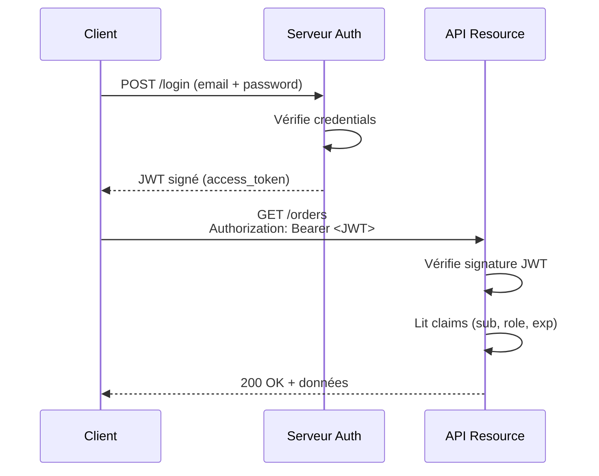

# Authentification & Autorisation dans les API REST

## Objectifs pédagogiques

À l'issue de ce module, vous serez capable de :

- **Distinguer** authentification et autorisation, et pourquoi confondre les deux crée des failles réelles
- **Choisir** le mécanisme adapté (API Key, JWT, OAuth2) selon le contexte d'usage
- **Implémenter** une authentification par Bearer token dans un appel API
- **Lire et décoder** un JWT pour comprendre ce qu'il contient réellement
- **Identifier** les erreurs de configuration les plus fréquentes et leurs conséquences en production

---

## Mise en situation

Vous intégrez une API de paiement pour une startup e-commerce. Le premier prototype fonctionnait sans authentification — c'était une API interne, sur un réseau privé, "juste pour tester". Six mois plus tard, l'API est exposée en production. Quelqu'un a pensé à ajouter une clé API en header... mais elle est la même pour tous les clients, jamais rotée, et le endpoint `/admin/refund` accepte n'importe quelle requête valide.

Un bot découvre l'API par scan de ports. En 4 heures, 1 200 remboursements frauduleux sont émis.

Ce scénario n'est pas fictif. Il arrive régulièrement, y compris dans des équipes expérimentées, parce que la sécurité des API est souvent traitée en dernier — ou confondue avec la sécurité réseau.

Ce module s'attaque précisément à ça : comprendre les mécanismes en profondeur, pas juste copier-coller un `Authorization: Bearer`.

---

## Contexte : deux questions différentes, souvent mélangées

Avant tout, une distinction qui structure tout ce module :

- **Authentification** : *Qui es-tu ?* — vérifier l'identité de l'appelant
- **Autorisation** : *Qu'as-tu le droit de faire ?* — contrôler les permissions une fois l'identité établie

Ces deux étapes sont séquentielles et indépendantes. Un utilisateur peut être parfaitement authentifié et ne pas avoir le droit d'accéder à une ressource. À l'inverse, une API sans authentification ne peut pas faire d'autorisation fiable.

Le problème classique : des équipes implémentent l'authentification mais oublient les règles d'autorisation. Résultat — tous les utilisateurs connectés peuvent tout faire.

---

## Fonctionnement interne des mécanismes d'authentification

### API Key — le mécanisme le plus simple

Une API Key, c'est fondamentalement un secret partagé. Le client l'envoie dans chaque requête, le serveur la compare à sa base de données ou à son registre interne.

```http
GET /api/v1/orders HTTP/1.1
Host: api.example.com
X-API-Key: sk_live_4f8a2b...
```

C'est simple à implémenter, simple à utiliser. Mais c'est aussi le mécanisme avec le plus de pièges :

- La clé ne porte aucune information sur l'identité ou les permissions — le serveur doit tout résoudre lui-même
- Si elle est compromise, elle donne accès jusqu'à révocation manuelle
- Elle voyage dans chaque requête — une erreur de log, et elle est exposée

⚠️ **Erreur fréquente** : passer la clé en query parameter (`?api_key=...`). Elle apparaît alors dans les logs du reverse proxy, les historiques de navigateur, et les fichiers d'accès Nginx. Toujours utiliser un header dédié (`X-API-Key`) ou `Authorization`.

Les API Keys sont adaptées pour : les intégrations machine-to-machine sans utilisateur final, les environnements contrôlés, les accès simples à une seule ressource.

---

### JWT — transporter l'identité dans le token

Un JSON Web Token (JWT) est un token **auto-porteur** : il contient directement les informations sur l'identité et les permissions de l'utilisateur, signées cryptographiquement. Le serveur n'a pas besoin d'interroger une base de données pour savoir qui fait la requête — il vérifie la signature et lit le contenu.

Structure d'un JWT :

```
xxxxx.yyyyy.zzzzz
  │      │     └── Signature (HMAC ou RSA)
  │      └───────── Payload (claims)
  └──────────────── Header (algo + type)
```

Chaque partie est encodée en Base64URL (pas chiffrée — lisible par n'importe qui). Ce qui garantit l'intégrité, c'est la **signature**, pas l'encodage.

Un payload typique :

```json
{
  "sub": "user_789",
  "email": "alice@example.com",
  "role": "admin",
  "iat": 1710000000,
  "exp": 1710003600
}
```

🧠 **Concept clé** : le serveur qui émet le JWT signe avec une clé secrète (HMAC-SHA256) ou une clé privée (RS256). Le serveur qui reçoit le JWT vérifie la signature avec la clé publique correspondante. Si un attaquant modifie le payload (par exemple `"role": "user"` → `"role": "admin"`), la signature devient invalide — la requête est rejetée.



Le JWT a une durée de vie (`exp`). C'est un avantage (révocation automatique) et une contrainte (impossible de le révoquer avant expiration sans infrastructure supplémentaire).

💡 **Astuce** : utiliser [jwt.io](https://jwt.io) pour décoder un token en clair et inspecter son contenu. Pratique pour déboguer une authentification qui échoue — souvent, c'est simplement le token expiré ou le claim `role` mal orthographié.

---

### OAuth2 — délégation d'accès

OAuth2 n'est pas un mécanisme d'authentification au sens strict — c'est un **protocole de délégation d'autorisation**. Il permet à un utilisateur d'autoriser une application tierce à accéder à ses ressources, sans lui donner son mot de passe.

L'exemple le plus courant : "Se connecter avec Google". Vous n'donnez pas votre mot de passe Google à l'application — vous donnez à Google l'autorisation de partager certaines informations avec elle.

OAuth2 définit plusieurs **flows** selon le cas d'usage :

| Flow | Cas d'usage | Niveau de confiance requis |
|------|-------------|---------------------------|
| Authorization Code | Applications web avec utilisateur | Élevé (redirect + code) |
| Client Credentials | M2M, services backend | Élevé (secret côté serveur) |
| PKCE | Applications mobiles / SPA | Moyen (pas de secret côté client) |
| ~~Implicit~~ | Dépréciée | — |

Pour une API backend qui appelle une autre API (intégration service-to-service), le flow **Client Credentials** est le plus adapté :

```http
POST /oauth/token HTTP/1.1
Host: auth.example.com
Content-Type: application/x-www-form-urlencoded

grant_type=client_credentials
&client_id=my-service
&client_secret=s3cr3t
&scope=orders:read invoices:write
```

Le serveur d'authentification renvoie un access token (souvent un JWT), que le service utilise ensuite comme Bearer token.

---

## Construction progressive : de l'API non sécurisée à une auth solide

### v1 — Aucune authentification

```python
# Flask — endpoint sans protection
@app.route("/api/orders")
def get_orders():
    return jsonify(db.get_all_orders())
```

Tout le monde peut appeler ce endpoint. Acceptable uniquement sur un réseau totalement isolé, en développement local.

---

### v2 — API Key simple

```python
import os
from functools import wraps
from flask import request, jsonify

API_KEY = os.environ.get("API_KEY")

def require_api_key(f):
    @wraps(f)
    def decorated(*args, **kwargs):
        key = request.headers.get("X-API-Key")
        if not key or key != API_KEY:
            return jsonify({"error": "Unauthorized"}), 401
        return f(*args, **kwargs)
    return decorated

@app.route("/api/orders")
@require_api_key
def get_orders():
    return jsonify(db.get_all_orders())
```

C'est un premier niveau de protection viable pour des APIs internes. Deux problèmes restent ouverts : pas de notion d'utilisateur, pas de granularité dans les permissions.

---

### v3 — JWT avec vérification de signature et claims

```python
import jwt
from flask import request, jsonify, g

SECRET_KEY = os.environ.get("JWT_SECRET")

def require_jwt(required_role=None):
    def decorator(f):
        @wraps(f)
        def decorated(*args, **kwargs):
            auth_header = request.headers.get("Authorization", "")
            if not auth_header.startswith("Bearer "):
                return jsonify({"error": "Missing token"}), 401

            token = auth_header.split(" ")[1]
            try:
                payload = jwt.decode(
                    token,
                    SECRET_KEY,
                    algorithms=["HS256"]
                )
            except jwt.ExpiredSignatureError:
                return jsonify({"error": "Token expired"}), 401
            except jwt.InvalidTokenError:
                return jsonify({"error": "Invalid token"}), 401

            # Contrôle d'autorisation
            if required_role and payload.get("role") != required_role:
                return jsonify({"error": "Forbidden"}), 403

            g.user = payload  # disponible dans le handler
            return f(*args, **kwargs)
        return decorated
    return decorator

@app.route("/api/orders")
@require_jwt()
def get_orders():
    return jsonify(db.get_orders_for_user(g.user["sub"]))

@app.route("/api/admin/refund", methods=["POST"])
@require_jwt(required_role="admin")
def admin_refund():
    return jsonify(process_refund(request.json))
```

Ici, l'authentification **et** l'autorisation sont dissociées proprement. Un utilisateur standard avec un JWT valide obtient 403 sur le endpoint `/admin/refund` — pas 401. C'est important : 401 signifie "non authentifié", 403 signifie "authentifié mais non autorisé".

---

## Cas réel en entreprise

**Contexte** : une plateforme SaaS B2B avec ~200 clients, chacun ayant des utilisateurs internes. L'API expose des données de facturation, des exports comptables, et des actions d'administration.

**Problème initial** : un seul niveau d'accès pour tous les utilisateurs connectés. Les audits montraient des accès à des données inter-clients (un client pouvait voir les factures d'un autre en modifiant l'ID dans l'URL).

**Solution mise en place** :
1. Migration vers JWT avec claims `tenant_id` + `role` (viewer / editor / admin)
2. Chaque endpoint vérifie que `tenant_id` du token correspond à la ressource demandée
3. Les rôles contrôlent les actions disponibles (GET vs POST vs DELETE)
4. Access token à 15 minutes + refresh token à 7 jours stocké en cookie HTTP-only

**Résultat** : zéro accès inter-tenant depuis la mise en production. Le refresh token en cookie HTTP-only élimine le vol de token via XSS. La durée courte du access token limite la fenêtre d'exploitation en cas de fuite.

---

## Bonnes pratiques

**1. Distinguer 401 et 403 dans chaque réponse**
Ce n'est pas qu'une convention — les clients API utilisent ces codes pour adapter leur comportement (redemander un token vs contacter le support). Les mélanger crée des bugs d'intégration inutiles.

**2. Ne jamais stocker de secret dans le code source**
Les clés API, secrets JWT et client secrets OAuth2 vont dans les variables d'environnement ou un gestionnaire de secrets (Vault, AWS Secrets Manager, Doppler). Un `grep` sur un repo public GitHub suffit pour trouver des milliers de clés exposées.

**3. Fixer une durée de vie courte sur les access tokens**
15 à 60 minutes est raisonnable. Un token volé a une fenêtre d'exploitation limitée. Compenser avec un refresh token mechanism pour l'UX.

**4. Toujours valider l'algorithme dans le JWT**
Spécifier explicitement `algorithms=["HS256"]` lors du décodage. L'algorithme `none` est une faille connue : un attaquant peut créer un token non signé qui sera accepté si le code ne vérifie pas l'algo.

**5. Appliquer le principe de moindre privilège sur les scopes**
Un service qui a besoin de lire des commandes ne doit pas avoir le scope `orders:write`. Définir des scopes granulaires dès le départ — les élargir est facile, les restreindre en prod casse les clients existants.

**6. Logger les échecs d'authentification, pas les tokens**
Loguer les `401` et `403` avec l'IP, le user-agent et le endpoint visé — pas le token lui-même. Un token dans les logs est un secret exposé.

**7. Implémenter la rotation des clés API**
Prévoir le mécanisme dès le début : une clé peut avoir une `valid_until`, et les clients peuvent avoir plusieurs clés actives simultanément pendant une période de transition.

---

## Résumé

L'authentification répond à "qui es-tu ?" et l'autorisation à "qu'as-tu le droit de faire ?" — deux questions distinctes, deux mécanismes distincts, deux codes HTTP distincts (401 / 403). Les API Keys sont simples mais limitées au cas M2M sans granularité fine. Les JWT transportent l'identité et les permissions dans un token auto-porteur signé cryptographiquement, ce qui évite les allers-retours en base à chaque requête. OAuth2 entre en jeu dès qu'il y a délégation d'accès entre services ou applications tierces. Dans tous les cas, les secrets ne vivent pas dans le code, les tokens ont une durée de vie courte, et les logs ne contiennent jamais de credentials. Le prochain module sur la gestion des erreurs et les codes de statut complétera naturellement cette base — une API qui retourne toujours 200 même en cas d'échec d'authentification est une API impossible à déboguer.

---

<!-- snippet
id: api_auth_401_vs_403
type: concept
tech: api-rest
level: intermediate
importance: high
format: knowledge
tags: authentification, autorisation, http, codes-statut, securite
title: 401 vs 403 — deux codes qui ne signifient pas la même chose
content: 401 Unauthorized = l'appelant n'est pas authentifié (pas de token, token invalide, expiré). 403 Forbidden = authentifié mais sans les droits nécessaires. Retourner 401 quand c'est 403 fait croire au client qu'il doit se reconnecter — et vice versa. Les clients API branchent leur logique de retry sur ces codes.
description: 401 = identité non vérifiée, 403 = identité connue mais accès refusé. Confondre les deux casse le comportement des clients qui gèrent automatiquement le renouvellement de token.
-->

<!-- snippet
id: api_jwt_structure
type: concept
tech: jwt
level: intermediate
importance: high
format: knowledge
tags: jwt, token, signature, payload, authentification
title: Structure d'un JWT — trois parties, une seule signée
content: Un JWT = header.payload.signature, chaque partie encodée en Base64URL (lisible, pas chiffré). La signature couvre header + payload : si le payload est modifié, la signature devient invalide. L'intégrité est garantie par la signature, pas par l'encodage. Utiliser jwt.io pour décoder n'importe quel token en clair.
description: Le JWT est lisible par tout le monde — c'est la signature cryptographique (HMAC ou RSA) qui garantit qu'il n'a pas été altéré depuis son émission.
-->

<!-- snippet
id: api_jwt_algo_none
type: warning
tech: jwt
level: intermediate
importance: high
format: knowledge
tags: jwt, securite, vulnerabilite, algorithme, faille
title: JWT — ne jamais laisser l'algorithme "none" accepté
content: Piège : si le décodeur JWT ne vérifie pas l'algorithme, un attaquant peut forger un token avec alg=none et aucune signature — le token sera accepté. Correction : toujours spécifier explicitement la liste des algos autorisés lors du décodage (ex: algorithms=["HS256"]). Ne jamais lire l'algo depuis le header du token lui-même.
description: L'algorithme "none" est une faille connue des bibliothèques JWT mal configurées — un token sans signature peut être accepté si l'algo n'est pas imposé côté serveur.
-->

<!-- snippet
id: api_apikey_header
type: warning
tech: api-rest
level: intermediate
importance: high
format: knowledge
tags: api-key, securite, header, logs, exposition
title: API Key — ne jamais la passer en query parameter
content: Piège : passer la clé dans l'URL (?api_key=...) l'expose dans les logs Nginx/Apache, les historiques de navigateur, les fichiers d'accès, et les traces de proxy. Correction : utiliser systématiquement un header HTTP dédié (X-API-Key: <valeur>) ou Authorization: Bearer <valeur>. Les headers ne sont pas loggés par défaut dans les access logs.
description: Une API Key dans l'URL apparaît dans tous les logs d'accès — reverse proxy, CDN, navigateur. Utiliser un header HTTP évite cette exposition.
-->

<!-- snippet
id: api_jwt_expiry
type: tip
tech: jwt
level: intermediate
importance: medium
format: knowledge
tags: jwt, expiration, access-token, refresh-token, securite
title: Access token court + refresh token long — le bon équilibre
content: Configurer l'access token à 15 min maximum et le refresh token à 7 jours stocké en cookie HTTP-only (flag Secure + SameSite=Strict). Un access token volé a une fenêtre d'exploitation de 15 min max. Le cookie HTTP-only bloque le vol via XSS car JavaScript ne peut pas le lire.
description: Access token 15 min + refresh token 7j en cookie HTTP-only : fenêtre d'exploitation minimale en cas de vol, UX transparente pour l'utilisateur.
-->

<!-- snippet
id: api_oauth2_client_credentials
type: concept
tech: oauth2
level: intermediate
importance: medium
format: knowledge
tags: oauth2, client-credentials, m2m, service-to-service, flow
title: OAuth2 Client Credentials — le flow pour les appels service-to-service
content: Le flow Client Credentials est conçu pour les communications M2M sans utilisateur final. Le service s'authentifie avec son client_id + client_secret auprès du serveur auth, reçoit un access token (souvent JWT), et l'utilise en Bearer token. Aucune interaction utilisateur, aucun redirect. Le secret reste côté serveur — ne jamais l'exposer dans une app mobile ou un frontend.
description: Pour les appels entre backends (M2M), OAuth2 Client Credentials émet un access token à partir d'un client_id + secret — sans redirect ni interaction utilisateur.
-->

<!-- snippet
id: api_jwt_decode_python
type: command
tech: python
level: intermediate
importance: medium
format: knowledge
tags: jwt, python, decode, verification, pyjwt
title: Décoder et vérifier un JWT en Python avec PyJWT
command: jwt.decode(<TOKEN>, <SECRET>, algorithms=["HS256"])
example: jwt.decode("eyJhbGci...", "mon_secret_jwt", algorithms=["HS256"])
description: PyJWT vérifie automatiquement la signature et l'expiration (exp). Lever jwt.ExpiredSignatureError ou jwt.InvalidTokenError pour retourner 401 au client.
-->

<!-- snippet
id: api_auth_secret_env
type: tip
tech: api-rest
level: intermediate
importance: high
format: knowledge
tags: secrets, securite, variables-environnement, configuration, bonnes-pratiques
title: Secrets API — toujours dans les variables d'environnement, jamais dans le code
content: Stocker les clés API, JWT secrets et client secrets OAuth2 dans des variables d'environnement (os.environ) ou un gestionnaire de secrets (HashiCorp Vault, AWS Secrets Manager, Doppler). Un grep sur un repo GitHub public trouve des milliers de clés exposées par commit accidentel. Ajouter .env au .gitignore et utiliser python-dotenv ou équivalent en local.
description: Aucun secret dans le code source ni dans les fichiers versionnés — variables d'environnement minimum, gestionnaire de secrets en production.
-->

<!-- snippet
id: api_authz_tenant_isolation
type: concept
tech: api-rest
level: intermediate
importance: high
format: knowledge
tags: autorisation, multi-tenant, isolation, claims, jwt
title: Isolation multi-tenant via claims JWT — vérifier l'appartenance de la ressource
content: Dans une API multi-tenant, l'authentification seule ne suffit pas. Il faut vérifier que l'ID de la ressource demandée appartient bien au tenant du token (tenant_id dans les claims). Sans cette vérification, un utilisateur légitime peut accéder aux données d'un autre client en modifiant l'ID dans l'URL — faille IDOR (Insecure Direct Object Reference).
description: Vérifier que chaque ressource appartient au tenant_id du JWT — un token valide d'un client ne doit jamais permettre d'accéder aux données d'un autre client.
-->

<!-- snippet
id: api_auth_log_failures
type: tip
tech: api-rest
level: intermediate
importance: medium
format: knowledge
tags: logs, securite, monitoring, authentification, observabilite
title: Logger les échecs auth avec contexte, jamais le token lui-même
content: Loguer chaque 401 et 403 avec : IP source, User-Agent, endpoint visé, timestamp, et user_id si disponible. Ne jamais inclure le token dans les logs — c'est un secret exposé. Ces logs permettent de détecter les tentatives de brute force (burst de 401 sur une même IP) et les bugs d'intégration (403 répétés sur un endpoint précis).
description: Logger IP + endpoint + code HTTP sur les échecs d'auth permet de détecter les attaques et les bugs d'intégration — sans jamais écrire le token dans les logs.
-->