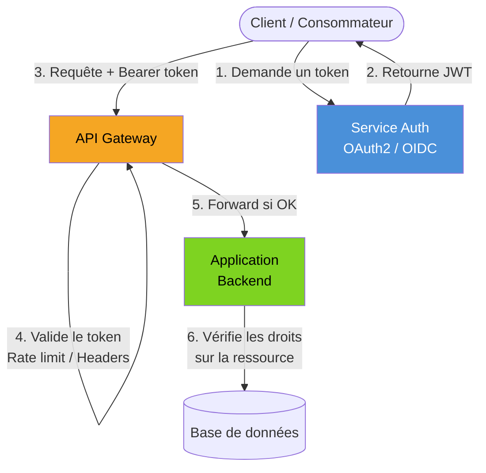

# Sécurité des API REST

## Objectifs pédagogiques

À l'issue de ce module, vous serez capable de :

- Distinguer authentification et autorisation, et savoir laquelle échoue dans un scénario donné
- Implémenter un flux OAuth2 avec JWT et comprendre ce qui se passe à chaque étape
- Identifier les vecteurs d'attaque classiques contre une API (injection, BOLA, mass assignment)
- Configurer un rate limiting et un ensemble de headers de sécurité adaptés à un contexte de production
- Évaluer les compromis entre les méthodes d'authentification selon le type de client (SPA, backend, mobile)

---

## Mise en situation

Vous travaillez sur une API de gestion de commandes pour une marketplace B2B. Pendant plusieurs mois, l'équipe a avancé vite : les endpoints fonctionnent, les tests passent, les partenaires sont contents. Puis un jour, un partenaire signale qu'il peut accéder aux commandes d'un autre client simplement en changeant un identifiant dans l'URL.

Ce n'est pas un bug de logique métier. C'est une faille de sécurité structurelle : l'API ne vérifie pas que la ressource demandée appartient bien à l'utilisateur authentifié. C'est l'une des vulnérabilités les plus communes et les plus sous-estimées — au point qu'elle figure chaque année en tête de l'OWASP API Security Top 10.

La solution naïve serait d'ajouter un check ici et là. La bonne approche, c'est de comprendre les modèles de sécurité sous-jacents et de les intégrer dès la conception.

---

## Contexte et problématique

Sécuriser une API, c'est résoudre trois questions dans l'ordre :

1. **Qui est-tu ?** → Authentification
2. **Qu'as-tu le droit de faire ?** → Autorisation
3. **Comment empêcher l'abus ?** → Rate limiting, validation, headers

La plupart des incidents viennent d'une confusion entre les deux premières, ou d'une implémentation partielle de l'une des trois. Un token JWT valide ne suffit pas : encore faut-il vérifier que ce token donne accès *à cette ressource précise*, pas simplement à l'API en général.

L'autre piège courant : traiter la sécurité comme une étape finale, à ajouter "avant la mise en prod". En pratique, elle doit être intégrée au design des endpoints, des modèles de données et de l'infrastructure.

---

## Architecture de sécurité d'une API

Avant de plonger dans les mécanismes, voyons comment les différentes couches de sécurité s'articulent dans une architecture réelle.



Ce qui est important ici : la gateway traite la sécurité *réseau* (token valide ? rate limit dépassé ?), mais la sécurité *métier* (peut-il accéder à cette commande ?) reste dans l'application. Ces deux niveaux ne sont pas interchangeables.

| Composant | Rôle | Ce qu'il ne fait pas |
|-----------|------|----------------------|
| API Gateway | Valider le token, appliquer le rate limit, injecter les headers de sécurité | Vérifier les droits sur une ressource spécifique |
| Service Auth | Émettre et invalider les tokens, gérer les scopes | Appliquer les règles métier |
| Backend applicatif | Vérifier l'ownership des ressources, valider les inputs | Gérer la rotation des clés ou l'invalidation de sessions globale |

---

## Authentification — qui peut appeler l'API

### API Key : simple mais limité

La clé API est la forme la plus basique : une chaîne opaque passée dans un header ou un paramètre. Elle convient pour des usages machine-to-machine simples, typiquement des partenaires internes ou des webhooks entrants.

```
GET /orders
Authorization: ApiKey sk_prod_a8f3c2...
```

⚠️ **Erreur fréquente** — Passer la clé dans l'URL (`?api_key=...`) : elle apparaît alors dans les logs des proxies, des serveurs et des navigateurs. Toujours utiliser un header.

Le problème structurel des API keys : elles ne portent pas d'identité granulaire. Vous savez que la requête vient de "partenaire A", mais pas quel utilisateur final agit, ni avec quels droits précis. Dès que vous avez besoin de permissions différenciées, il faut aller vers OAuth2.

### JWT — le token qui se suffit à lui-même

Un JWT (JSON Web Token) est un token signé qui embarque des informations directement dans son payload : identifiant utilisateur, rôles, expiration, scopes. Le serveur n'a pas besoin de faire un appel en base pour valider le token — il vérifie la signature cryptographique.

Structure d'un JWT décodé :

```json
// Header
{ "alg": "RS256", "typ": "JWT" }

// Payload
{
  "sub": "user_4821",
  "email": "alice@corp.com",
  "roles": ["buyer"],
  "scope": "orders:read orders:write",
  "exp": 1710000000,
  "iat": 1709996400
}

// Signature = HMAC ou RSA du header.payload
```

🧠 **Concept clé** — La signature garantit l'intégrité, pas la confidentialité. Le payload d'un JWT est simplement encodé en Base64, pas chiffré. N'y mettez jamais de données sensibles (mot de passe, numéro de carte). N'importe qui peut décoder un JWT — seul le serveur peut vérifier qu'il est légitime.

L'expiration courte est une feature, pas une contrainte. Un token valable 15 minutes compromis devient inutilisable rapidement. Combinez avec un refresh token à durée de vie longue (stocké de manière sécurisée côté client) pour ne pas forcer la reconnexion à chaque expiration.

### OAuth2 — délégation d'accès

OAuth2 n'est pas un protocole d'authentification, c'est un protocole d'**autorisation déléguée**. Il répond à : "comment un service tiers peut-il agir au nom d'un utilisateur, sans connaître son mot de passe ?"

Les flux les plus utiles en pratique :

| Flux | Cas d'usage | Exemple |
|------|------------|---------|
| Authorization Code + PKCE | SPA, application mobile | Login via Google dans une app React |
| Client Credentials | Backend to backend, jobs, cron | Micro-service qui appelle un autre micro-service |
| Device Code | Appareils sans navigateur | CLI, TV connectée |

💡 **Astuce** — Le flux "Resource Owner Password" (envoi direct du mot de passe au serveur OAuth) est officiellement déprécié dans OAuth 2.1. Ne l'utilisez pas dans les nouveaux systèmes.

```
# Flux Authorization Code — étape 1 : redirection vers le serveur d'auth
GET https://auth.example.com/oauth/authorize
  ?response_type=code
  &client_id=<CLIENT_ID>
  &redirect_uri=https://app.example.com/callback
  &scope=orders:read profile
  &state=<RANDOM_STATE>
  &code_verifier=<PKCE_VERIFIER>

# Étape 2 : échange du code contre un token
POST https://auth.example.com/oauth/token
Content-Type: application/x-www-form-urlencoded

grant_type=authorization_code
&code=<AUTH_CODE>
&client_id=<CLIENT_ID>
&redirect_uri=https://app.example.com/callback
&code_verifier=<PKCE_VERIFIER>
```

---

## Autorisation — ce que l'utilisateur peut faire

C'est ici que la majorité des failles de sécurité se produisent. L'authentification est souvent bien gérée ; l'autorisation, beaucoup moins.

### RBAC — Role-Based Access Control

Vous assignez des rôles à des utilisateurs, et des permissions à des rôles. Simple à implémenter, facile à auditer.

```
Rôle "buyer"  → orders:read, orders:write
Rôle "admin"  → orders:*, users:*, invoices:*
Rôle "viewer" → orders:read, invoices:read
```

Limite : le RBAC opère au niveau *type de ressource*, pas au niveau *instance*. Un `buyer` peut lire des commandes — mais peut-il lire *toutes* les commandes ou seulement *les siennes* ?

### BOLA — la faille la plus fréquente

BOLA : Broken Object Level Authorization. C'est exactement le scénario de la mise en situation. L'API vérifie que vous êtes authentifié et que vous avez le rôle "buyer", mais pas que la commande `order_9823` vous appartient.

```python
# ❌ Vulnérable — ne vérifie que l'authentification
@app.get("/orders/{order_id}")
def get_order(order_id: str, current_user=Depends(get_current_user)):
    return db.get_order(order_id)

# ✅ Correct — vérifie l'ownership
@app.get("/orders/{order_id}")
def get_order(order_id: str, current_user=Depends(get_current_user)):
    order = db.get_order(order_id)
    if order.owner_id != current_user.id:
        raise HTTPException(status_code=403, detail="Forbidden")
    return order
```

⚠️ **Erreur fréquente** — Retourner un 404 au lieu d'un 403 quand l'utilisateur n'a pas accès à une ressource qui existe. L'intention est bonne (ne pas révéler l'existence de la ressource), mais c'est une décision à prendre consciemment. En interne ou dans un contexte B2B, le 403 est souvent plus clair pour le débogage.

### Scopes OAuth2 — autorisation fine

Les scopes permettent à un token de porter des droits explicites, indépendamment du rôle de l'utilisateur. Un utilisateur admin qui génère un token avec le scope `orders:read` uniquement ne pourra pas modifier une commande via ce token, même s'il en a normalement la permission.

```
scope: "orders:read invoices:read"   → lecture seule
scope: "orders:read orders:write"    → lecture + écriture commandes
scope: "admin"                       → accès total (à éviter : trop large)
```

---

## Les vecteurs d'attaque à connaître

### Injection — toujours d'actualité

Les injections SQL ou NoSQL dans les paramètres d'une API sont aussi dangereuses que dans une application web classique. La différence : l'API expose souvent une surface plus large, avec des filtres dynamiques.

```python
# ❌ Dangereux — concaténation directe
query = f"SELECT * FROM orders WHERE status = '{status}'"

# ✅ Requêtes paramétrées — toujours
query = "SELECT * FROM orders WHERE status = %s"
cursor.execute(query, (status,))
```

### Mass Assignment

Un endpoint qui accepte un body JSON et l'applique directement à un objet sans whitelist expose tous les champs de l'objet, y compris ceux que l'utilisateur ne devrait pas modifier.

```python
# ❌ Dangereux — l'utilisateur peut modifier `role` ou `is_admin`
user.update(**request.json())

# ✅ Whitelist explicite des champs acceptés
allowed_fields = {"email", "display_name", "preferences"}
update_data = {k: v for k, v in request.json().items() if k in allowed_fields}
user.update(**update_data)
```

### Exposition excessive de données

Retourner l'objet complet issu de la base de données parce que c'est plus simple. Un utilisateur qui demande son profil n'a pas besoin de recevoir son hash de mot de passe, son ID interne, ses métadonnées système ou les champs d'audit.

Toujours sérialiser explicitement la réponse, jamais passer l'objet ORM directement.

---

## Rate Limiting et protection contre l'abus

Le rate limiting protège contre les attaques par force brute, le scraping agressif et les pics accidentels de trafic. Il se configure généralement à la gateway.

Stratégies courantes :

| Stratégie | Description | Usage typique |
|-----------|-------------|--------------|
| Fixed Window | X requêtes par fenêtre fixe (ex : 100/min) | Simple, suffisant pour la plupart des cas |
| Sliding Window | Fenêtre glissante, évite les pics en bord de fenêtre | APIs publiques à fort trafic |
| Token Bucket | Accumulation de crédits, permet les bursts | APIs avec usage variable |
| Concurrency Limit | Limite les requêtes simultanées, pas le débit | Jobs longs, uploads |

Les headers de réponse à renvoyer quand la limite est atteinte :

```
HTTP/1.1 429 Too Many Requests
Retry-After: 30
X-RateLimit-Limit: 100
X-RateLimit-Remaining: 0
X-RateLimit-Reset: 1710000060
```

💡 **Astuce** — Appliquez des limites différentes par endpoint. Un endpoint de login mérite une limite bien plus stricte (5-10 tentatives/min) qu'un endpoint de lecture (500/min). Ne traitez pas tous les endpoints de la même façon.

---

## Headers de sécurité HTTP

Ces headers sont souvent oubliés car ils ne causent pas d'erreur visible quand ils manquent — mais ils comptent en production.

```
# Empêche le navigateur d'interpréter le content-type incorrectement
X-Content-Type-Options: nosniff

# Protection HTTPS — ne pas servir en HTTP même si demandé
Strict-Transport-Security: max-age=31536000; includeSubDomains

# Restreindre les origines autorisées à appeler l'API
Access-Control-Allow-Origin: https://app.example.com
Access-Control-Allow-Methods: GET, POST, PUT, DELETE
Access-Control-Allow-Headers: Authorization, Content-Type

# Pas d'info sur la version du serveur
Server: (header à supprimer ou neutraliser)

# Interdit l'embedding dans des iframes — utile si l'API sert du HTML
X-Frame-Options: DENY
```

⚠️ **Erreur fréquente** — Configurer `Access-Control-Allow-Origin: *` sur une API authentifiée. Un wildcard CORS sur une API publique sans authentification est acceptable. Sur une API qui utilise des cookies ou des credentials, c'est une faille : le navigateur refusera d'envoyer les credentials vers une origin wildcard de toute façon, mais la config envoie un mauvais signal et peut causer des bugs subtils.

---

## Construction progressive — de l'API ouverte à la production sécurisée

### V1 — API interne, première sécurisation

Un endpoint protégé par API Key statique, validée dans le middleware :

```python
API_KEY = os.environ["API_KEY"]  # jamais en dur dans le code

def verify_api_key(request: Request):
    key = request.headers.get("X-API-Key")
    if key != API_KEY:
        raise HTTPException(status_code=401, detail="Invalid API Key")

@app.get("/orders", dependencies=[Depends(verify_api_key)])
def list_orders():
    ...
```

### V2 — JWT avec vérification d'ownership

```python
from jose import jwt, JWTError

def get_current_user(token: str = Depends(oauth2_scheme)):
    try:
        payload = jwt.decode(token, PUBLIC_KEY, algorithms=["RS256"])
        user_id = payload.get("sub")
        if not user_id:
            raise HTTPException(status_code=401)
        return User(id=user_id, roles=payload.get("roles", []))
    except JWTError:
        raise HTTPException(status_code=401, detail="Token invalide ou expiré")

@app.get("/orders/{order_id}")
def get_order(order_id: str, current_user: User = Depends(get_current_user)):
    order = db.get_order(order_id)
    if not order:
        raise HTTPException(status_code=404)
    if order.owner_id != current_user.id and "admin" not in current_user.roles:
        raise HTTPException(status_code=403)
    return serialize_order(order)  # jamais l'objet ORM brut
```

### V3 — Production : gateway + scopes + rate limiting

En production, la validation du JWT se fait à la gateway (nginx, Kong, AWS API Gateway...). Le backend ne fait que vérifier les droits métier. Les scopes sont vérifiés à chaque endpoint.

```python
def require_scope(required_scope: str):
    def checker(token_data: dict = Depends(get_token_data)):
        scopes = token_data.get("scope", "").split()
        if required_scope not in scopes:
            raise HTTPException(
                status_code=403,
                detail=f"Scope requis : {required_scope}"
            )
    return checker

@app.post("/orders", dependencies=[Depends(require_scope("orders:write"))])
def create_order(order: OrderCreate, current_user=Depends(get_current_user)):
    ...
```

---

## Cas réel en entreprise

**Contexte** : API SaaS B2B, ~40 partenaires, 200k requêtes/jour. Audit sécurité commandé après une tentative de scraping détectée dans les logs.

**Problèmes identifiés** :
- Pas de rate limiting → un partenaire avait itéré sur 80k IDs de commandes en 2h
- Tokens JWT valables 24h → une clé compromise restait exploitable toute une journée
- Réponses API retournant des champs internes (`created_by_internal_user_id`, `billing_margin`)
- CORS configuré avec wildcard sur l'environnement de staging accessible depuis internet

**Actions menées en 3 semaines** :

1. Rate limiting configuré à la gateway : 60 req/min par token, 10 req/min sur les endpoints de recherche — incidents de scraping disparus en 48h
2. Durée des access tokens réduite à 15 min, refresh tokens à 7 jours avec rotation automatique
3. Schémas de réponse explicites pour chaque endpoint (Pydantic en Python) — 12 champs internes supprimés des réponses
4. CORS restreint aux domaines partenaires déclarés, wildcard supprimé même en staging

**Résultat** : zéro incident de sécurité sur les 6 mois suivants, et les partenaires ont constaté une amélioration de la documentation (les schémas de réponse ont alimenté l'OpenAPI spec automatiquement).

---

## Bonnes pratiques

**Toujours utiliser HTTPS**, sans exception. En développement local, les outils comme `mkcert` permettent de simuler un contexte TLS réaliste. Les erreurs liées au mixed content ou aux cookies `Secure` en dev vous éviteront des surprises en prod.

**Ne jamais stocker de secrets dans le code source**. Variables d'environnement, vault (HashiCorp, AWS Secrets Manager, Doppler). Cela inclut les clés JWT, les identifiants OAuth2, les API keys tierces.

**Valider tous les inputs côté serveur**, même si le client valide déjà. La validation côté client est une UX, pas une sécurité. Utilisez des schémas stricts (Pydantic, Joi, Zod) avec rejet de tout champ non déclaré.

**Journaliser les événements de sécurité** : tentatives d'authentification échouées, accès refusé (403), anomalies de débit. Sans ces logs, vous ne saurez jamais qu'une attaque a eu lieu.

**Rotation régulière des secrets** : les API keys et tokens de longue durée doivent avoir un cycle de vie. Prévoir le mécanisme de rotation avant le premier incident, pas après.

**Tester les contrôles d'accès explicitement** dans votre suite de tests : créer deux utilisateurs distincts, vérifier que l'un ne peut pas accéder aux ressources de l'autre. Ce type de test est rarement automatisé — et c'est pour ça que BOLA reste la faille numéro 1.

**Adopter le principe de moindre privilège** : un token ne devrait avoir que les scopes nécessaires à son usage. Un service de reporting n'a besoin que de `read` sur les données qu'il consulte.

---

## Résumé

La sécurité d'une API se construit en couches complémentaires : authentification (qui appelle ?), autorisation (sur quoi ?), et protection contre l'abus (à quelle fréquence ?). JWT et OAuth2 répondent aux deux premières couches, mais ils ne suffisent pas si les vérifications d'ownership sont absentes au niveau des ressources — c'est la faille BOLA, systématiquement en tête de l'OWASP API Security Top 10.

En production, la gateway prend en charge la validation de token et le rate limiting ; la logique métier d'autorisation reste dans l'application. Ces deux niveaux ne se substituent pas l'un à l'autre. Les headers HTTP de sécurité, la validation stricte des inputs et la sérialisation explicite des réponses complètent l'architecture.

La suite logique de ce module : la documentation et le versionnage des contrats API — parce qu'une API bien sécurisée doit aussi être bien documentée pour que ses consommateurs comprennent exactement ce qu'ils peuvent faire, et avec quels droits.

---

<!-- snippet
id: api_jwt_structure
type: concept
tech: jwt
level: intermediate
importance: high
format: knowledge
tags: jwt, authentification, securite, api, token
title: JWT — le payload est lisible, pas chiffré
content: Un JWT est composé de 3 parties encodées en Base64 (header.payload.signature). La signature garantit l'intégrité (personne n'a modifié le token), mais le payload est lisible par n'importe qui sans clé. Ne jamais y stocker de données sensibles (mot de passe, numéro de carte). La vérification côté serveur consiste à recalculer la signature et comparer — si elle correspond, le token est authentique.
description: Base64 ≠ chiffrement. Le payload d'un JWT est visible en clair — seule la signature prouve qu'il n'a pas été altéré.
-->

<!-- snippet
id: api_bola_check
type: warning
tech: api
level: intermediate
importance: high
format: knowledge
tags: bola, autorisation, securite, owasp, api
title: BOLA — vérifier l'ownership de chaque ressource
content: Piège : l'API vérifie que l'utilisateur est authentifié et a le bon rôle, mais pas que la ressource demandée lui appartient. Un attaquant itère sur les IDs dans l'URL pour accéder aux données d'autres utilisateurs. Correction : après avoir récupéré la ressource, comparer `resource.owner_id` avec `current_user.id` avant de retourner quoi que ce soit. Ce check doit être explicite à chaque endpoint — il ne peut pas être délégué à la gateway.
description: BOLA (Broken Object Level Authorization) est la faille API #1 OWASP : un token valide ne suffit pas, il faut vérifier l'ownership de la ressource.
-->

<!-- snippet
id: api_jwt_expiry
type: tip
tech: jwt
level: intermediate
importance: high
format: knowledge
tags: jwt, expiration, refresh-token, securite, session
title: Access token court (15 min) + refresh token long (7 jours)
content: Configurer l'access token JWT avec une durée de vie de 15 minutes maximum. En cas de compromission, la fenêtre d'exploitation est limitée. Compenser avec un refresh token à durée plus longue (7 jours), stocké de manière sécurisée (httpOnly cookie côté SPA, keystore côté mobile), et invalider le refresh token côté serveur en cas de déconnexion ou de suspicion.
description: Un access token JWT expirant en 15 min limite la fenêtre d'exploitation en cas de fuite — combiner avec un refresh token rotatif à 7 jours.
-->

<!-- snippet
id: api_rate_limit_headers
type: concept
tech: http
level: intermediate
importance: medium
format: knowledge
tags: rate-limiting, headers, http, 429, api
title: Headers standards pour le rate limiting (429)
content: Quand la limite est atteinte, retourner HTTP 429 avec les headers : `Retry-After: <secondes>` (quand réessayer), `X-RateLimit-Limit: <max>` (quota total), `X-RateLimit-Remaining: <restant>` (quota restant), `X-RateLimit-Reset: <timestamp_unix>` (reset du compteur). Ces headers permettent aux clients de s'adapter automatiquement sans polling aveugle.
description: Un 429 bien formé avec Retry-After et X-RateLimit-* permet aux clients de gérer le backoff automatiquement sans polling aveugle.
-->

<!-- snippet
id: api_cors_wildcard
type: warning
tech: http
level: intermediate
importance: high
format: knowledge
tags: cors, securite, headers, api, authentification
title: CORS wildcard interdit sur une API authentifiée
content: Piège : configurer `Access-Control-Allow-Origin: *` sur une API qui utilise des cookies ou des credentials. Les navigateurs refusent d'envoyer les credentials vers une origin wildcard — le résultat est une API cassée ET une fausse impression de sécurité. Correction : lister explicitement les domaines autorisés (`Access-Control-Allow-Origin: https://app.example.com`) et ajouter `Access-Control-Allow-Credentials: true` si nécessaire.
description: Wildcard CORS + credentials = API cassée dans le navigateur. Toujours spécifier les origines autorisées explicitement sur une API authentifiée.
-->

<!-- snippet
id: api_mass_assignment
type: warning
tech: api
level: intermediate
importance: high
format: knowledge
tags: mass-assignment, securite, validation, api, injection
title: Mass assignment — toujours whitelister les champs acceptés
content: Piège : appliquer directement le body JSON d'une requête à un objet modèle sans filtrer les champs. L'utilisateur peut injecter des champs comme `role`, `is_admin` ou `billing_tier` s'ils existent dans le modèle. Correction : définir une liste explicite des champs acceptés et filtrer le body avant toute mise à jour. Avec Pydantic (Python), utiliser un schéma d'input distinct du modèle de base de données.
description: Ne jamais appliquer request.body directement à un objet ORM — un attaquant peut modifier des champs comme `role` ou `is_admin` s'ils ne sont pas exclus explicitement.
-->

<!-- snippet
id: api_oauth2_flows
type: concept
tech: oauth2
level: intermediate
importance: medium
format: knowledge
tags: oauth2, authentification, flows, api, securite
title: Choisir le bon flux OAuth2 selon le client
content: OAuth2 propose plusieurs flux selon le contexte : Authorization Code + PKCE pour les SPA et applications mobiles (le code est échangé contre un token sans exposer le secret client), Client Credentials pour les échanges backend-to-backend sans utilisateur impliqué (service account), Device Code pour les appareils sans navigateur (CLI, TV). Le flux Resource Owner Password est déprécié dans OAuth 2.1 — ne pas l'utiliser dans les nouveaux systèmes.
description: Authorization Code+PKCE pour les apps avec utilisateur, Client Credentials pour le machine-to-machine. Le flux password est déprécié dans OAuth 2.1.
-->

<!-- snippet
id: api_secrets_env
type: tip
tech: api
level: beginner
importance: high
format: knowledge
tags: secrets, securite, configuration, api, devops
title: Secrets API — variables d'environnement ou vault, jamais dans le code
content: Stocker les clés JWT, identifiants OAuth2 et API keys dans des variables d'environnement ou un gestionnaire de secrets (HashiCorp Vault, AWS Secrets Manager, Doppler). Vérifier que le dépôt git contient un `.gitignore` couvrant les fichiers `.env`. En CI/CD, injecter les secrets via les variables d'environnement protégées du pipeline — jamais via un fichier commité.
description: Un secret dans le code source = secret compromis. Utiliser os.environ ou un vault, vérifier le .gitignore, et injecter via CI/CD sécurisé.
-->

<!-- snippet
id: api_response_serialization
type: tip
tech: api
level: intermediate
importance: medium
format: knowledge
tags: serialisation, securite, api, donnees, exposition
title: Sérialiser explicitement les réponses API — jamais l'objet ORM brut
content: Définir
