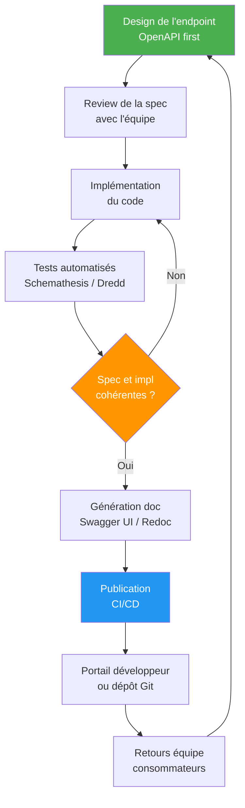

# Documentation API

## Objectifs pédagogiques

À l'issue de ce module, vous serez capable de :

- Identifier les éléments indispensables d'une bonne documentation API
- Rédiger une spécification OpenAPI 3.x complète pour un endpoint réel
- Générer et publier une interface Swagger UI ou Redoc automatiquement
- Structurer vos collections Postman pour les partager en équipe
- Évaluer la qualité d'une documentation existante et l'améliorer

---

## Mise en situation

Imaginez que vous venez de finir votre API de gestion de commandes. Elle fonctionne. Les tests passent. Et là, un développeur frontend vous contacte : *"Comment je fais un appel pour créer une commande ? C'est quoi le format du body ? Et si le produit est en rupture, vous renvoyez quoi ?"*

Vous répondez par Slack. Deux semaines plus tard, un autre développeur pose les mêmes questions. Puis un partenaire externe demande la même chose par e-mail. Puis un stagiaire.

C'est exactement pour ça que la documentation existe — pas pour faire joli, mais pour ne plus répondre aux mêmes questions en boucle, et pour que n'importe qui puisse intégrer votre API sans vous appeler.

Le piège classique : rédiger la doc *après* le développement, dans un README qui se désynchronise de l'API au premier refactor. En production, ça donne des docs mentant sur les codes d'erreur, des exemples avec des champs qui n'existent plus, et des équipes qui finissent par ignorer la doc et la remplacer par "appelle-moi je t'explique".

Ce module vous apprend à documenter de manière structurée, versionnable, et idéalement générée depuis le code lui-même.

---

## Pourquoi la documentation est un livrable, pas une option

Une API sans documentation, c'est un composant inutilisable par quiconque n'a pas accès à votre tête. Et même pour vous, dans six mois.

Plus concrètement, une bonne documentation remplit trois fonctions :

**Contrat clair.** Les consommateurs savent exactement ce qu'ils peuvent envoyer, ce qu'ils vont recevoir, et dans quelles conditions ça peut échouer. Pas de supposition, pas de reverse-engineering.

**Réduction du support.** Chaque heure passée à documenter remplace des dizaines d'heures de questions/réponses dispersées dans Slack, Teams ou les e-mails.

**Base pour les tests.** Une spécification OpenAPI peut directement alimenter des outils de test automatisé (Schemathesis, Dredd) — la doc devient exécutable.

---

## Ce qu'une documentation API doit contenir

Avant de parler d'outils, fixons ce que doit couvrir toute bonne documentation. Voici le minimum syndical :

| Élément | Description |
|---|---|
| **Authentification** | Comment s'authentifier (Bearer, API Key, OAuth), où placer le token |
| **Base URL** | URL de base + environnements (dev, staging, prod) |
| **Endpoints** | Liste complète : méthode HTTP + chemin + description |
| **Paramètres** | Path params, query params, body — typés et contraints |
| **Exemples de requête/réponse** | Exemples concrets pour chaque cas (succès + erreurs) |
| **Codes de statut** | Tous les codes possibles par endpoint, avec leur signification |
| **Schémas de données** | Modèles JSON avec types, champs obligatoires, valeurs possibles |
| **Versioning** | Quelle version de l'API est documentée, politique de dépréciation |

Ce tableau n'est pas exhaustif — une API publique ajoutera des guides de démarrage rapide, des tutoriels, un changelog. Mais si l'un de ces éléments est manquant, votre doc est incomplète.

---

## OpenAPI : le standard qui s'est imposé

OpenAPI (anciennement Swagger) est aujourd'hui le format de référence pour documenter les API REST. L'idée est simple : décrire toute votre API dans un fichier YAML ou JSON structuré, à partir duquel des outils génèrent automatiquement une interface interactive, des SDK clients, des tests.

### Structure d'un fichier OpenAPI 3.x

Un fichier OpenAPI minimal ressemble à ça :

```yaml
openapi: 3.0.3
info:
  title: API Commandes
  description: Gestion des commandes clients
  version: 1.0.0
  contact:
    name: Équipe Backend
    email: api-support@monentreprise.com

servers:
  - url: https://api.monentreprise.com/v1
    description: Production
  - url: https://api-staging.monentreprise.com/v1
    description: Staging

paths:
  /orders:
    get:
      summary: Lister les commandes
      tags:
        - Commandes
      security:
        - bearerAuth: []
      parameters:
        - name: status
          in: query
          required: false
          schema:
            type: string
            enum: [pending, confirmed, shipped, cancelled]
          description: Filtrer par statut
        - name: limit
          in: query
          required: false
          schema:
            type: integer
            minimum: 1
            maximum: 100
            default: 20
      responses:
        '200':
          description: Liste des commandes
          content:
            application/json:
              schema:
                type: object
                properties:
                  data:
                    type: array
                    items:
                      $ref: '#/components/schemas/Order'
                  pagination:
                    $ref: '#/components/schemas/Pagination'
              example:
                data:
                  - id: "ord_123"
                    status: "confirmed"
                    total: 89.90
                    created_at: "2024-03-15T10:30:00Z"
                pagination:
                  total: 142
                  page: 1
                  per_page: 20
        '401':
          $ref: '#/components/responses/Unauthorized'

    post:
      summary: Créer une commande
      tags:
        - Commandes
      security:
        - bearerAuth: []
      requestBody:
        required: true
        content:
          application/json:
            schema:
              $ref: '#/components/schemas/CreateOrderRequest'
            example:
              customer_id: "cust_456"
              items:
                - product_id: "prod_789"
                  quantity: 2
              shipping_address:
                street: "12 rue de la Paix"
                city: "Paris"
                zip: "75001"
                country: "FR"
      responses:
        '201':
          description: Commande créée
          content:
            application/json:
              schema:
                $ref: '#/components/schemas/Order'
        '400':
          $ref: '#/components/responses/BadRequest'
        '422':
          description: Données invalides (produit en rupture, client inconnu...)
          content:
            application/json:
              schema:
                $ref: '#/components/schemas/ValidationError'
              example:
                error: "PRODUCT_OUT_OF_STOCK"
                message: "Le produit prod_789 n'est plus disponible"
                field: "items[0].product_id"

components:
  securitySchemes:
    bearerAuth:
      type: http
      scheme: bearer
      bearerFormat: JWT

  schemas:
    Order:
      type: object
      required:
        - id
        - status
        - total
        - created_at
      properties:
        id:
          type: string
          example: "ord_123"
        status:
          type: string
          enum: [pending, confirmed, shipped, cancelled]
        total:
          type: number
          format: float
          example: 89.90
        created_at:
          type: string
          format: date-time

    CreateOrderRequest:
      type: object
      required:
        - customer_id
        - items
      properties:
        customer_id:
          type: string
        items:
          type: array
          minItems: 1
          items:
            type: object
            required:
              - product_id
              - quantity
            properties:
              product_id:
                type: string
              quantity:
                type: integer
                minimum: 1
        shipping_address:
          $ref: '#/components/schemas/Address'

    Address:
      type: object
      required:
        - street
        - city
        - zip
        - country
      properties:
        street:
          type: string
        city:
          type: string
        zip:
          type: string
        country:
          type: string
          pattern: '^[A-Z]{2}$'
          example: "FR"

    Pagination:
      type: object
      properties:
        total:
          type: integer
        page:
          type: integer
        per_page:
          type: integer

    ValidationError:
      type: object
      properties:
        error:
          type: string
        message:
          type: string
        field:
          type: string

  responses:
    Unauthorized:
      description: Token manquant ou invalide
      content:
        application/json:
          schema:
            type: object
            properties:
              error:
                type: string
                example: "UNAUTHORIZED"
              message:
                type: string
                example: "Token JWT invalide ou expiré"
    BadRequest:
      description: Requête malformée
      content:
        application/json:
          schema:
            type: object
            properties:
              error:
                type: string
              message:
                type: string
```

💡 **Astuce** — Le bloc `components` est la partie la plus importante à bien travailler. Définir vos schémas une fois et les référencer avec `$ref` vous évite de dupliquer des définitions qui divergent au fil du temps.

⚠️ **Erreur fréquente** — Documenter uniquement le cas nominal (200/201) et oublier les erreurs. En pratique, les consommateurs ont surtout besoin de comprendre ce qui peut mal tourner — code 400 vs 422, structure de l'erreur, champ `error` machine-readable vs `message` human-readable.

---

## Du fichier OpenAPI à une interface lisible

Un fichier YAML seul n'est pas très agréable à lire. L'intérêt d'OpenAPI, c'est l'écosystème d'outils qui le consomme.

### Swagger UI

L'interface historique — interactive, intégrée dans beaucoup de frameworks. Vous pouvez tester des appels directement depuis le navigateur.

```bash
# Avec Docker, en 30 secondes
docker run -p 8080:8080 \
  -e SWAGGER_JSON=/doc/openapi.yaml \
  -v $(pwd)/doc:/doc \
  swaggerapi/swagger-ui
```

Accédez ensuite à `http://localhost:8080`.

### Redoc

Interface plus propre, mieux adaptée aux équipes qui veulent publier une doc "publique" ou dans un portail développeur. Pas d'interface de test intégrée, mais bien plus lisible sur grand écran.

```bash
# Installation locale
npm install -g @redocly/cli

# Génération d'un fichier HTML statique
redocly build-docs openapi.yaml --output doc/index.html

# Serveur local pendant le développement
redocly preview-docs openapi.yaml
```

```html
<!-- Intégration minimaliste dans une page HTML -->
<!DOCTYPE html>
<html>
  <head>
    <title>API Commandes — Documentation</title>
  </head>
  <body>
    <redoc spec-url='./openapi.yaml'></redoc>
    <script src="https://cdn.jsdelivr.net/npm/redoc/bundles/redoc.standalone.js"></script>
  </body>
</html>
```

### Quel outil choisir ?

| Critère | Swagger UI | Redoc |
|---|---|---|
| Tests interactifs | ✅ Intégré | ❌ Absent |
| Lisibilité / Design | Moyen | Excellent |
| Doc publique / portail | Peut faire | Idéal |
| Intégration framework | Native (FastAPI, SpringDoc…) | Via build statique |
| Personnalisation | Limitée | Complète via thème |

🧠 **Concept clé** — Swagger UI et Redoc lisent le même fichier OpenAPI. Vous pouvez proposer les deux : Swagger pour les développeurs qui veulent tester, Redoc pour les partenaires qui lisent la référence. C'est le même fichier source, deux présentations.

---

## Intégration avec les frameworks backend

L'idéal n'est pas d'écrire le fichier OpenAPI à la main — c'est de le générer depuis vos annotations de code. Presque tous les frameworks modernes le permettent.

### FastAPI (Python) — génération automatique

FastAPI génère OpenAPI nativement depuis vos types Pydantic et vos annotations :

```python
from fastapi import FastAPI, HTTPException, Depends
from fastapi.security import HTTPBearer
from pydantic import BaseModel, Field
from typing import Optional, List
from enum import Enum

app = FastAPI(
    title="API Commandes",
    description="Gestion des commandes clients",
    version="1.0.0",
    contact={"name": "Équipe Backend", "email": "api@monentreprise.com"}
)

security = HTTPBearer()

class OrderStatus(str, Enum):
    pending = "pending"
    confirmed = "confirmed"
    shipped = "shipped"
    cancelled = "cancelled"

class OrderItem(BaseModel):
    product_id: str = Field(..., example="prod_789")
    quantity: int = Field(..., ge=1, example=2)

class CreateOrderRequest(BaseModel):
    customer_id: str = Field(..., example="cust_456")
    items: List[OrderItem] = Field(..., min_items=1)

class OrderResponse(BaseModel):
    id: str
    status: OrderStatus
    total: float
    created_at: str

@app.post(
    "/orders",
    response_model=OrderResponse,
    status_code=201,
    summary="Créer une commande",
    tags=["Commandes"],
    responses={
        422: {"description": "Produit indisponible ou client inconnu"},
        401: {"description": "Token invalide"}
    }
)
async def create_order(
    body: CreateOrderRequest,
    token: str = Depends(security)
):
    """
    Crée une nouvelle commande.

    - Vérifie la disponibilité des produits
    - Valide l'existence du client
    - Retourne la commande créée avec son ID
    """
    # logique métier...
    pass
```

La doc est disponible sur `/docs` (Swagger UI) et `/redoc` (Redoc) sans rien configurer.

Pour exporter le fichier OpenAPI :

```bash
# Exporter le schéma généré
curl http://localhost:8000/openapi.json -o openapi.json

# Ou via la CLI FastAPI (si installée)
python -c "from main import app; import json; print(json.dumps(app.openapi(), indent=2))" > openapi.json
```

### Spring Boot (Java) — SpringDoc

```xml
<!-- pom.xml -->
<dependency>
    <groupId>org.springdoc</groupId>
    <artifactId>springdoc-openapi-starter-webmvc-ui</artifactId>
    <version>2.3.0</version>
</dependency>
```

```java
@RestController
@RequestMapping("/orders")
@Tag(name = "Commandes", description = "Gestion des commandes clients")
public class OrderController {

    @Operation(
        summary = "Créer une commande",
        responses = {
            @ApiResponse(responseCode = "201", description = "Commande créée"),
            @ApiResponse(responseCode = "422", description = "Produit indisponible")
        }
    )
    @PostMapping
    @ResponseStatus(HttpStatus.CREATED)
    public OrderResponse createOrder(@RequestBody @Valid CreateOrderRequest request) {
        // ...
    }
}
```

### Express / Node.js — swagger-jsdoc

```javascript
// Installation
// npm install swagger-jsdoc swagger-ui-express

const swaggerJsdoc = require('swagger-jsdoc');
const swaggerUi = require('swagger-ui-express');

const options = {
  definition: {
    openapi: '3.0.3',
    info: { title: 'API Commandes', version: '1.0.0' },
  },
  apis: ['./routes/*.js'], // fichiers contenant les annotations
};

const spec = swaggerJsdoc(options);
app.use('/docs', swaggerUi.serve, swaggerUi.setup(spec));

// Dans routes/orders.js :
/**
 * @openapi
 * /orders:
 *   post:
 *     summary: Créer une commande
 *     tags: [Commandes]
 *     requestBody:
 *       required: true
 *       content:
 *         application/json:
 *           schema:
 *             $ref: '#/components/schemas/CreateOrderRequest'
 *     responses:
 *       201:
 *         description: Commande créée
 */
router.post('/', createOrder);
```

---

## Collections Postman : la doc qui se teste

OpenAPI couvre la référence — Postman couvre le workflow. Une collection Postman bien structurée permet à n'importe qui dans l'équipe d'exécuter des scénarios complets en quelques clics.

### Importer depuis OpenAPI

```
Postman → Import → sélectionner openapi.yaml
```

Postman génère automatiquement les requêtes. Mais l'import brut n'est qu'un point de départ — il faut ensuite organiser, ajouter des exemples réalistes, configurer les variables d'environnement.

### Structure recommandée d'une collection

```
📁 API Commandes v1
  📁 Auth
    POST Obtenir un token
    POST Rafraîchir le token
  📁 Commandes
    GET  Lister les commandes (filtre par statut)
    POST Créer une commande (cas nominal)
    POST Créer une commande (produit en rupture → 422)
    GET  Détail d'une commande
    PATCH Mettre à jour le statut
    DELETE Annuler une commande
  📁 Scénarios end-to-end
    🔄 Cycle complet : création → confirmation → expédition
```

### Variables d'environnement et scripts de test

```javascript
// Script "Pre-request" sur la collection entière
// Récupère automatiquement un token si absent
if (!pm.environment.get("access_token")) {
    pm.sendRequest({
        url: pm.environment.get("base_url") + "/auth/token",
        method: "POST",
        header: { "Content-Type": "application/json" },
        body: {
            mode: "raw",
            raw: JSON.stringify({
                client_id: pm.environment.get("client_id"),
                client_secret: pm.environment.get("client_secret")
            })
        }
    }, function(err, res) {
        pm.environment.set("access_token", res.json().access_token);
    });
}
```

```javascript
// Script de test sur POST /orders (201)
pm.test("Statut 201", () => pm.response.to.have.status(201));

pm.test("Réponse contient un ID", () => {
    const body = pm.response.json();
    pm.expect(body.id).to.match(/^ord_/);
});

pm.test("Statut initial = pending", () => {
    pm.expect(pm.response.json().status).to.eql("pending");
});

// Stocker l'ID pour les requêtes suivantes
pm.environment.set("last_order_id", pm.response.json().id);
```

```json
// Fichier d'environnement (à versionner sans les secrets)
{
  "name": "Production",
  "values": [
    { "key": "base_url", "value": "https://api.monentreprise.com/v1" },
    { "key": "client_id", "value": "{{CLIENT_ID}}", "type": "secret" },
    { "key": "client_secret", "value": "{{CLIENT_SECRET}}", "type": "secret" },
    { "key": "access_token", "value": "" }
  ]
}
```

💡 **Astuce** — Exportez votre collection au format JSON et versionnez-la dans le dépôt Git de l'API, dans un dossier `/postman`. Quand quelqu'un clone le repo, il a immédiatement de quoi tester. Newman (CLI Postman) permet ensuite d'exécuter ces collections en CI.

---

## Valider et linter votre spécification OpenAPI

Écrire un fichier OpenAPI à la main, c'est risquer des erreurs silencieuses — un `$ref` qui pointe nulle part, un type incompatible, des champs obligatoires manquants dans un exemple.

```bash
# Redocly CLI — validation + linting
npm install -g @redocly/cli

# Valider la syntaxe et les références
redocly lint openapi.yaml

# Exemple de sortie
# ✖ 2 problems (2 errors, 0 warnings)
# openapi.yaml:45:7 at #/paths/~1orders/post/responses/422
#   Response object must contain "content" or "description"
```

```bash
# Spectral — linter plus configurable
npm install -g @stoplight/spectral-cli

# Avec le ruleset OpenAPI par défaut
spectral lint openapi.yaml

# Avec un ruleset personnalisé
spectral lint openapi.yaml --ruleset .spectral.yaml
```

```yaml
# .spectral.yaml — exemple de règles personnalisées
extends: ["spectral:oas"]
rules:
  # Tous les endpoints doivent avoir un tag
  operation-tags: error
  # Tous les endpoints doivent avoir un summary
  operation-summary: error
  # Interdire les exemples vides
  no-empty-example:
    given: "$.paths..example"
    severity: warn
    then:
      function: truthy
```

---

## Flux de documentation dans un cycle de développement

Voici comment intégrer la documentation dans votre workflow réel — pas comme une étape finale, mais comme partie intégrante du développement.



L'approche **"OpenAPI First"** inverse l'ordre habituel : vous écrivez la spec *avant* le code, la faites valider par les consommateurs, puis implémentez. Ça évite de relivrer une API parce que l'équipe frontend n'est pas d'accord avec le format des erreurs une fois le code en place.

🧠 **Concept clé** — La spec OpenAPI peut devenir un **mock serveur** pendant le développement front-end. Des outils comme Prism (Stoplight) lisent votre OpenAPI et répondent avec des données factices conformes aux schémas. Le front peut avancer sans attendre le back.

```bash
# Prism — mock server depuis OpenAPI
npm install -g @stoplight/prism-cli

prism mock openapi.yaml
# Listening on http://localhost:4010

# Le front peut appeler http://localhost:4010/orders
# Prism répond avec les exemples définis dans la spec
```

---

## Publication et intégration CI/CD

Une documentation qui ne se met pas à jour automatiquement devient rapidement un mensonge documenté. L'objectif : chaque merge sur `main` déclenche la mise à jour de la doc.

```yaml
# .github/workflows/doc.yml
name: Publish API Documentation

on:
  push:
    branches: [main]
    paths:
      - 'openapi.yaml'
      - 'openapi/**'

jobs:
  lint:
    runs-on: ubuntu-latest
    steps:
      - uses: actions/checkout@v4

      - name: Lint OpenAPI spec
        run: |
          npm install -g @redocly/cli
          redocly lint openapi.yaml

  publish:
    needs: lint
    runs-on: ubuntu-latest
    steps:
      - uses: actions/checkout@v4

      - name: Build Redoc HTML
        run: |
          npm install -g @redocly/cli
          redocly build-docs openapi.yaml --output public/index.html

      - name: Deploy to GitHub Pages
        uses: peaceiris/actions-gh-pages@v3
        with:
          github_token: ${{ secrets.GITHUB_TOKEN }}
          publish_dir: ./public
```

```bash
# Ou via Newman en CI (tests Postman)
npm install -g newman

newman run postman/collection.json \
  --environment postman/env-staging.json \
  --reporters cli,junit \
  --reporter-junit-export results/newman.xml
```

---

## Bonnes pratiques

**1. Versionnez votre spec avec votre code.** Le fichier `openapi.yaml` vit dans le même dépôt que l'API, pas dans un Confluence ou un Google Doc. C'est la seule façon de garantir que doc et code évoluent ensemble.

**2. Documentez les erreurs autant que les succès.** La plupart des développeurs savent ce qu'ils vont recevoir en cas de succès — c'est la gestion des erreurs qui leur prend du temps. Chaque endpoint devrait couvrir a minima les codes 400, 401, 403, 404, 422 et 500 quand ils sont applicables.

**3. Utilisez des exemples réalistes, pas des placeholders.** `"id": "string"` n'aide personne. `"id": "ord_a1b2c3"` montre immédiatement le format attendu. Les exemples servent aussi de référence pour les tests.

**4. Adoptez le "Design First" pour les nouvelles APIs.** Écrire la spec avant le code force à réfléchir au contrat depuis la perspective du consommateur — et non depuis les contraintes d'implémentation.

**5. Lintez en CI.** Un fichier OpenAPI invalide est pire qu'une doc absente — il casse les générateurs de code, les mocks, les tests automatisés. Redocly ou Spectral en CI, c'est 5 minutes de configuration qui évitent des heures de debug.

**6. Maintenez un changelog.** Pour les APIs exposées à des tiers, documentez les changements : nouveaux champs, champs dépréciés, changements de comportement. Un fichier `CHANGELOG.md` versionné suffit.

**7. Distinguez les erreurs machine-readable des messages human-readable.** Le champ `error` doit être une constante utilisable par du code (`PRODUCT_OUT_OF_STOCK`). Le champ `message` est pour les humains ("Le produit est indisponible"). Ce sont deux besoins différents — ne les confondez pas en un seul champ.

⚠️ **Erreur fréquente** — Documenter uniquement les endpoints en utilisant des schémas `object` sans définir les propriétés. Le consommateur sait que vous renvoyez du JSON, mais pas quels champs il peut utiliser. Un schéma sans `properties` est une doc vide.

---

## Cas réel en entreprise

**Contexte.** Une équipe de 8 développeurs maintient une API interne consommée par 3 équipes front-end et 2 partenaires externes. La documentation était un README de 200 lignes, mis à jour "quand on y pense". Résultat : les équipes front ne savaient jamais quel format d'erreur attendu en cas d'échec, et chaque mise en production déclenchait une vague de questions Slack.

**Ce qui a été mis en place.**

1. Migration du README vers un fichier `openapi.yaml` versionné dans le dépôt Git (3 jours de travail)
2. Ajout d'un job de lint OpenAPI dans la CI — bloque le merge si la spec est invalide
3. Publication automatique via Redoc sur une URL interne à chaque merge sur `main`
4. Export de la collection Postman dans `/postman` du dépôt, avec des environments pour staging et production
5. Ajout d'un mock Prism pour que les équipes front puissent développer sans dépendre du serveur de staging

**Résultats mesurables.**

- Questions "doc API" dans Slack : de ~15/semaine à ~2/semaine le premier mois
- Temps d'onboarding d'un nouveau développeur consommateur : de 3-4 jours à 4 heures
- 3 bugs détectés en CI par le linter dans les deux premières semaines (des `$ref` cassés qui auraient silencieusement rendu la doc incohérente)

---

## Résumé

La documentation API n'est pas une formalité — c'est un composant de votre système, au même titre que le code. Un fichier OpenAPI bien rédigé permet de générer automatiquement des interfaces interactives, des mocks, des tests et des SDK. Les outils (Swagger UI, Redoc, Postman, Prism, Spectral) forment un écosystème cohérent qui automatise la plupart des t