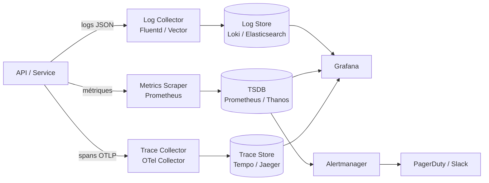

# Observabilité API

## Objectifs pédagogiques

- Distinguer les trois piliers de l'observabilité (logs, métriques, traces) et savoir quand utiliser chacun
- Identifier les métriques critiques à surveiller sur une API REST en production
- Concevoir un pipeline d'observabilité cohérent pour une API
- Interpréter un signal d'alerte et remonter à la cause racine
- Instrumenter une API avec OpenTelemetry pour générer des traces distribuées

---

## Mise en situation

Votre équipe vient de déployer une API de paiement. Tout semble fonctionner. Les tests passent, le déploiement est propre. Puis, trois jours plus tard, le support reçoit des tickets : "certaines transactions échouent". Vous regardez les logs... et vous tombez sur 400 000 lignes sans aucune structure cohérente. Pas de corrélation entre les requêtes, pas de timing, pas de trace de ce qui s'est passé entre l'entrée et la réponse.

C'est le problème classique : on a une API *qui tourne*, mais on est aveugle dès que quelque chose cloche.

L'observabilité, c'est exactement la réponse à ça. Ce n'est pas juste "ajouter des logs" — c'est construire la capacité à **répondre à des questions sur le comportement de votre système**, même après coup, même sur des incidents que vous n'aviez pas anticipés.

---

## Pourquoi l'observabilité n'est pas du monitoring classique

Le monitoring traditionnel, c'est surveiller ce que vous **saviez déjà surveiller** : CPU, RAM, uptime. Vous posez des questions que vous avez prédéfinies.

L'observabilité, c'est différent. Un système est dit *observable* quand vous pouvez explorer son comportement interne **à partir de ses sorties**, y compris pour des questions que vous n'aviez pas formulées au moment du déploiement.

En pratique, pour une API, ça se traduit par trois capacités :

1. **Savoir ce qui s'est passé** → logs structurés
2. **Savoir dans quel état est le système** → métriques
3. **Savoir comment une requête a traversé votre infrastructure** → traces distribuées

Ces trois éléments forment les fameux *trois piliers*. Ils sont complémentaires, pas redondants.

---

## Les trois piliers — rôles et complémentarité

### Logs — l'histoire des événements

Un log, c'est un enregistrement d'un événement discret. "La requête X a échoué avec un 500." "L'utilisateur Y s'est authentifié." Ce qui fait la différence en production, c'est leur **structure**.

Un log texte brut :
```
ERROR: Payment failed for user 42
```

Un log structuré (JSON) :
```json
{
  "level": "error",
  "timestamp": "2024-03-15T14:23:01Z",
  "message": "Payment failed",
  "user_id": "42",
  "trace_id": "abc123",
  "error_code": "CARD_DECLINED",
  "duration_ms": 234
}
```

La différence ? Le second est **interrogeable**. Vous pouvez filtrer par `error_code`, corréler avec un `trace_id`, calculer des statistiques sur `duration_ms`. Le premier, vous ne pouvez que le lire ligne par ligne.

⚠️ **Erreur fréquente** — Logger des messages en langage naturel non structuré. En prod avec 10k req/min, vous ne lirez jamais ces logs manuellement. Si votre outil de log ne peut pas faire `WHERE error_code = 'CARD_DECLINED'`, vous avez perdu à l'avance.

### Métriques — la santé en temps réel

Les métriques sont des valeurs numériques mesurées dans le temps. Contrairement aux logs, elles sont **agrégées** — vous ne gardez pas chaque événement individuel, mais leur synthèse.

Pour une API REST, les métriques indispensables s'organisent autour d'un framework bien connu : les **RED metrics** (Rate, Errors, Duration).

| Métrique | Ce qu'elle mesure | Exemple concret |
|----------|-------------------|-----------------|
| **Rate** | Nombre de requêtes / seconde | 342 req/s sur `/api/payments` |
| **Errors** | Taux d'erreurs (4xx, 5xx) | 2.3% de 500 sur les 5 dernières minutes |
| **Duration** | Latence (p50, p95, p99) | p99 = 1.2s → 1% des requêtes attendent plus d'1.2s |

💡 **Astuce** — Toujours surveiller les percentiles, jamais uniquement la moyenne. Une API avec une latence moyenne de 50ms peut avoir un p99 à 4 secondes. Les 1% d'utilisateurs impactés ne s'en satisferont pas.

### Traces — le chemin d'une requête

Une trace, c'est la représentation du **chemin complet** d'une requête à travers votre système. Dans une architecture avec plusieurs services, une requête peut toucher l'API gateway, un service d'authentification, un service métier, une base de données, un cache. La trace vous montre tout ça, avec le timing de chaque étape.

Chaque étape s'appelle un **span**. L'ensemble forme une **trace** identifiée par un `trace_id` unique, propagé de service en service via les headers HTTP.

```mermaid
gantt
    title Trace d'une requête POST /payments
    dateFormat  x
    axisFormat %Lms

    section API Gateway
    Auth check         :0, 12
    Rate limit check   :12, 18

    section Payment Service
    Validate payload   :18, 25
    DB query (users)   :25, 67
    Fraud check (sync) :67, 189

    section Notification Service
    Send email (async) :189, 210
```



Ce diagramme révèle immédiatement que le **fraud check** prend 122ms sur 210ms au total — c'est là qu'il faut chercher si vous avez une régression de latence.

---

## Architecture d'un pipeline d'observabilité

Voici comment ces trois piliers s'assemblent en pratique :



| Composant | Rôle | Exemples |
|-----------|------|----------|
| **Instrumentation** | Générer les signaux dans votre code | OpenTelemetry SDK, Prometheus client |
| **Collecteur** | Agréger, filtrer, router les signaux | OTel Collector, Fluentd, Vector |
| **Stockage** | Persister chaque type de signal efficacement | Loki (logs), Prometheus (métriques), Tempo (traces) |
| **Visualisation** | Explorer, corréler, dashboarder | Grafana |
| **Alerting** | Déclencher des actions sur seuils | Alertmanager, Grafana Alerts |

La stack **Grafana + Loki + Prometheus + Tempo** (souvent appelée LGTM) est aujourd'hui la référence open source pour ce pipeline. Elle permet de corréler les trois piliers depuis une interface unique — vous cliquez sur un spike de latence dans Prometheus, vous basculez directement vers la trace correspondante dans Tempo.

---

## Instrumenter une API — construction progressive

### V1 — Le minimum viable

Le strict minimum pour ne plus être aveugle. Logs structurés + métriques RED exposées via un endpoint `/metrics`.

Exemple en Python avec FastAPI :

```python
import logging
import time
import uuid
from fastapi import FastAPI, Request, Response
from prometheus_client import Counter, Histogram, generate_latest

app = FastAPI()

# Métriques Prometheus
REQUEST_COUNT = Counter(
    "api_requests_total",
    "Total des requêtes",
    ["method", "endpoint", "status_code"]
)
REQUEST_DURATION = Histogram(
    "api_request_duration_seconds",
    "Durée des requêtes",
    ["method", "endpoint"],
    buckets=[0.01, 0.05, 0.1, 0.25, 0.5, 1.0, 2.5, 5.0]
)

# Logger structuré
logger = logging.getLogger("api")

@app.middleware("http")
async def observability_middleware(request: Request, call_next):
    trace_id = str(uuid.uuid4())
    start = time.time()

    response = await call_next(request)

    duration = time.time() - start
    endpoint = request.url.path

    # Log structuré
    logger.info("request", extra={
        "trace_id": trace_id,
        "method": request.method,
        "path": endpoint,
        "status_code": response.status_code,
        "duration_ms": round(duration * 1000, 2),
    })

    # Métriques
    REQUEST_COUNT.labels(request.method, endpoint, response.status_code).inc()
    REQUEST_DURATION.labels(request.method, endpoint).observe(duration)

    response.headers["X-Trace-Id"] = trace_id
    return response

@app.get("/metrics")
def metrics():
    return Response(generate_latest(), media_type="text/plain")
```

Ce middleware fait trois choses à la fois : il génère un `trace_id` unique par requête, il log chaque appel en JSON, et il alimente les compteurs Prometheus. Le `trace_id` est renvoyé dans le header de réponse — ça permet au client (et au support) de référencer un appel précis dans vos logs.

### V2 — Traces distribuées avec OpenTelemetry

OpenTelemetry (OTel) est devenu le standard de facto pour l'instrumentation. L'avantage : vous écrivez le code d'instrumentation une seule fois, vous choisissez ensuite où envoyer les données (Jaeger, Tempo, Datadog, Honeycomb...) sans modifier votre code.

```python
from opentelemetry import trace
from opentelemetry.sdk.trace import TracerProvider
from opentelemetry.sdk.trace.export import BatchSpanProcessor
from opentelemetry.exporter.otlp.proto.grpc.trace_exporter import OTLPSpanExporter
from opentelemetry.instrumentation.fastapi import FastAPIInstrumentor
from opentelemetry.instrumentation.httpx import HTTPXClientInstrumentor

# Configuration du provider
provider = TracerProvider()
exporter = OTLPSpanExporter(endpoint="http://otel-collector:4317")
provider.add_span_processor(BatchSpanProcessor(exporter))
trace.set_tracer_provider(provider)

# Auto-instrumentation FastAPI (spans créés automatiquement)
FastAPIInstrumentor.instrument_app(app)
# Propagation automatique vers les services appelés
HTTPXClientInstrumentor().instrument()

tracer = trace.get_tracer(__name__)

# Span manuel pour une opération métier importante
@app.post("/payments")
async def create_payment(payment: PaymentRequest):
    with tracer.start_as_current_span("validate-payment") as span:
        span.set_attribute("payment.amount", payment.amount)
        span.set_attribute("payment.currency", payment.currency)
        result = await validate(payment)

    with tracer.start_as_current_span("process-payment") as span:
        span.set_attribute("payment.provider", "stripe")
        return await process(result)
```

🧠 **Concept clé** — OpenTelemetry propage automatiquement le `trace_id` via le header `traceparent` (standard W3C) lors des appels HTTP entre services. Chaque service downstream qui utilise OTel crée ses spans et les rattache à la même trace. Sans ça, vous avez des traces fragmentées, une par service, impossibles à corréler.

### V3 — Alerting sur les SLOs

Une fois les métriques en place, il faut définir des **SLOs** (Service Level Objectives) et alerter dessus. C'est plus robuste qu'alerter sur des seuils arbitraires.

```yaml
# prometheus/rules/api-slos.yml
groups:
  - name: api-slos
    rules:
      # SLO : 99.5% des requêtes répondent en moins de 500ms
      - alert: APILatencySLOBreach
        expr: |
          (
            sum(rate(api_request_duration_seconds_bucket{le="0.5"}[5m]))
            /
            sum(rate(api_request_duration_seconds_count[5m]))
          ) < 0.995
        for: 2m
        labels:
          severity: warning
        annotations:
          summary: "SLO latence API en breach"
          description: "{{ $value | humanizePercentage }} des requêtes répondent sous 500ms (SLO: 99.5%)"

      # SLO : taux d'erreur 5xx < 1%
      - alert: APIErrorRateSLOBreach
        expr: |
          sum(rate(api_requests_total{status_code=~"5.."}[5m]))
          /
          sum(rate(api_requests_total[5m])) > 0.01
        for: 1m
        labels:
          severity: critical
        annotations:
          summary: "Taux d'erreur 5xx dépasse 1%"
          description: "Taux actuel : {{ $value | humanizePercentage }}"
```

---

## Diagnostic — remonter à la cause racine

Quand une alerte se déclenche, le processus de diagnostic suit une logique précise. Partir du signal large, affiner vers le signal précis.

```
Alerte (métrique) → Identifier la surface impactée → Chercher la trace → Lire les logs
```

**Exemple concret** — L'alerte `APIErrorRateSLOBreach` se déclenche à 14h23.

1. **Métriques** : le taux de 500 a bondi à 8% sur `/api/payments`. Les autres endpoints sont sains.
2. **Logs** : filtre `level=error AND path=/api/payments AND timestamp >= 14:22`. On voit `"error_code": "DB_TIMEOUT"` dans 95% des cas.
3. **Traces** : on prend un `trace_id` d'une requête en erreur. Le span `db-query` affiche 5200ms — timeout. Le span `connection-pool` montre `pool_size=10, active=10` → pool épuisé.

Sans logs structurés : vous voyez juste "500 error". Sans traces : vous savez que c'est la DB, mais pas pourquoi. Avec les trois piliers : vous savez que c'est le pool de connexions saturé, et vous pouvez corriger en 10 minutes.

### Erreurs fréquentes de diagnostic

| Symptôme | Cause probable | Où chercher |
|----------|----------------|-------------|
| Latence p99 en hausse, p50 stable | Requêtes lentes isolées (pas de dégradation globale) | Traces — filtrer sur les spans lents |
| Taux 503 en hausse soudaine | Upstream saturé ou circuit breaker ouvert | Métriques amont + logs avec `error_code` |
| 401 en masse sur un endpoint | Token expiré ou rotation de clé | Logs auth service + timestamp de rotation |
| Latence croissante sur la durée | Memory leak ou accumulation de connexions | Métriques process (heap, open connections) |

⚠️ **Erreur fréquente** — Alerter sur la moyenne de latence. Une moyenne à 80ms peut cacher un p99 à 8 secondes si votre distribution est bimodale. Alerter sur les percentiles, toujours.

---

## Cas réel en entreprise

Une équipe opère une API de e-commerce : ~500 req/s en journée, pics à 2000 req/s lors des promotions. Avant de mettre en place l'observabilité, chaque incident prenait en moyenne 45 minutes à diagnostiquer — principalement du temps passé à grep-er des logs non structurés.

**Ce qu'ils ont mis en place :**
- Logs JSON structurés avec `trace_id`, `user_id`, `endpoint`, `duration_ms`, `status_code`
- Métriques RED dans Prometheus, dashboard Grafana par endpoint
- Traces OTel vers Tempo, corrélées depuis Grafana
- 3 alertes SLO : latence p99 > 800ms, erreur 5xx > 0.5%, disponibilité < 99.9%

**Résultats mesurés après 2 mois :**
- MTTR (Mean Time To Resolve) : 45 min → 8 min
- Incidents détectés avant signalement utilisateur : 0% → 70%
- Un incident de pool de connexions détecté et résolu avant d'impacter les utilisateurs, grâce à une alerte sur `db_pool_active / db_pool_size > 0.85`

---

## Bonnes pratiques

**1. Standardisez le format de logs dès le début.** Changer le format de logs en production, c'est reconfigurer tous vos pipelines d'analyse. Décidez une fois (JSON avec `timestamp`, `level`, `trace_id`, `service`) et tenez-vous y.

**2. Propagez toujours le `trace_id` dans les réponses d'erreur.** Quand un client reçoit une erreur, incluez le `trace_id` dans le body ou un header. Le support peut alors aller directement à la trace sans chercher dans les logs.

**3. Instrumentez les dépendances externes, pas seulement votre code.** Les timeouts sur une base de données ou un appel API tiers sont souvent la cause racine. OTel instrumente automatiquement les clients HTTP, les drivers de BDD — activez ces instrumentations.

**4. Définissez vos SLOs avant de configurer les alertes.** Une alerte sans SLO est arbitraire. "Latence > 1s" n'a de sens que si votre SLO est "95% des requêtes < 500ms". Partez du SLO, déduisez le seuil d'alerte.

**5. Ne loggez pas les données sensibles.** Les logs sont souvent stockés avec des rétentions longues et des accès larges. Masquez les numéros de carte, tokens, mots de passe. Une fuite de logs en prod peut être un incident de sécurité majeur.

**6. Gardez les métriques à cardinalité contrôlée.** Si vous créez un label Prometheus avec `user_id` comme valeur, vous créez autant de séries temporelles que d'utilisateurs. Prometheus explose. Les labels doivent avoir un nombre fini et raisonnable de valeurs (`endpoint`, `method`, `status_code` — pas `user_id`, pas `request_body`).

**7. Testez votre observabilité comme vous testez votre code.** En staging, vérifiez que les logs apparaissent bien, que les métriques s'incrémentent, que les traces sont complètes. Un pipeline d'observabilité silencieux pendant un incident, c'est pire que pas de pipeline.

---

## Résumé

Sans observabilité, une API en production est une boîte noire. Vous savez qu'elle répond, vous ne savez pas *comment* ni *pourquoi* quand ça déraille. Les trois piliers — logs structurés, métriques RED, traces distribuées — répondent chacun à des questions différentes et se complètent. Les logs racontent l'histoire, les métriques donnent le pouls, les traces montrent le chemin. OpenTelemetry est devenu le standard pour instrumenter sans s'enfermer dans un outil. Une stack concrète comme LGTM (Loki + Grafana + Tempo + Prometheus) vous donne tout ça en open source. Le vrai objectif final, c'est de passer d'une posture réactive ("les utilisateurs signalent un problème") à une posture proactive ("l'alerte s'est déclenchée avant le premier ticket support"). La prochaine étape logique : les SLOs et l'error budget, qui formalisent ce niveau de service acceptable et guident vos décisions de priorisation.

---

<!-- snippet
id: api_observabilite_trois_piliers
type: concept
tech: opentelemetry
level: intermediate
importance: high
format: knowledge
tags: observabilité, logs, métriques, traces, api
title: Les trois piliers de l'observabilité API
content: Logs = événements discrets (quoi s'est passé), Métriques = valeurs numériques agrégées dans le temps (dans quel état), Traces = chemin complet d'une requête à travers les services (comment). Ils sont complémentaires : les métriques alertent, les traces localisent, les logs expliquent.
description: Chaque pilier répond à une question différente — combiner les trois réduit le MTTR de 45min à ~8min sur des incidents réels mesurés
-->

<!-- snippet
id: api_metrics_red_framework
type: concept
tech: prometheus
level: intermediate
importance: high
format: knowledge
tags: métriques, prometheus, red, api, latence
title: Framework RED pour les métriques API
content: Rate (requêtes/seconde par endpoint), Errors (taux 4xx/5xx), Duration (latence en percentiles p50/p95/p99). Toujours surveiller les percentiles, jamais la moyenne seule : une moyenne 50ms peut cacher un p99 à 4 secondes si la distribution est bimodale.
description: Les trois métriques RED couvrent l'essentiel de la santé d'une API — les percentiles révèlent les cas limites invisibles à la moyenne
-->

<!-- snippet
id: api_logs_structure_json
type: tip
tech: python
level: intermediate
importance: high
format: knowledge
tags: logs, json, structured-logging, api, trace-id
title: Logger en JSON structuré avec trace_id dans chaque entrée
content: Inclure au minimum dans chaque log : timestamp, level, path, method, status_code, duration_ms, trace_id. Configurer le logger Python avec python-json-logger ou structlog. Sans ça, filtrer 400k lignes par error_code ou corréler avec une trace est impossible en production.
description: Un log JSON structuré est interrogeable (WHERE error_code = X) — un log texte brut ne peut être que lu ligne par ligne
-->

<!-- snippet
id: api_otel_traceparent_propagation
type: concept
tech: opentelemetry
level: intermediate
importance: high
format: knowledge
tags: opentelemetry, tracing, trace-id, propagation, distributed
title: Propagation automatique du trace_id entre services via OTel
content: OpenTelemetry propage le trace_id via le header HTTP W3C `traceparent` (format : 00-<traceId>-<spanId>-<flags>). Chaque service downstream qui utilise OTel lit ce header, crée ses spans et les rattache à la même trace racine. Sans propagation : traces fragmentées, une par service, impossible à corréler.
description: Sans OTel instrumentation sur le client HTTP sortant, chaque appel de service crée une trace orpheline — activer HTTPXClientInstrumentor ou équivalent
-->

<!-- snippet
id: api_prometheus_cardinalite_labels
type: warning
tech: prometheus
level: intermediate
importance: high
format: knowledge
tags: prometheus, métriques, cardinalité, performance, labels
title: Ne jamais utiliser user_id ou données variables comme label Prometheus
content: Piège : créer un label avec user_id, request_id ou IP → Prometheus crée une série temporelle par valeur unique → avec 100k utilisateurs, 100k séries → OOM ou crash du serveur Prometheus. Correction : labels à cardinalité fixe uniquement (endpoint, method, status_code — max quelques dizaines de valeurs distinctes).
description: Chaque valeur unique d'un label crée une nouvelle série temporelle — un label à haute cardinalité peut détruire un cluster Prometheus
-->

<!-- snippet
id: api_slo_alert_latence_prometheus
type: tip
tech: prometheus
level: intermediate
importance: medium
format: knowledge
tags: prometheus, alerting, slo, latence, percentile
title: Alerter sur le respect d'un SLO de latence avec Prometheus
content: Plutôt qu'un seuil fixe, calculer la proportion de requêtes sous le budget : sum(rate(duration_bucket{le="0.5"}[5m])) / sum(rate(duration_count[5m])) < 0.995 → alerte si moins de 99.5% des requêtes répondent sous 500ms. Définir le SLO d'abord, déduire le seuil ensuite.
description: Alerter sur un SLO (% de requêtes sous Xms) est plus stable qu'un seuil absolu — détecte les dégradations progressives sans faux positifs
-->

<!-- snippet
id: api_trace_id_response_header
type: tip
tech: api
level: intermediate
importance: medium
format: knowledge
tags: tracing, debug, support, headers, api
title: Retourner le trace_id dans le header de réponse HTTP
content: Ajouter X-Trace-Id dans chaque réponse (y compris les erreurs) via un middleware. Quand le support reçoit un ticket avec ce header, il va directement à la trace dans Grafana/Tempo sans chercher dans les logs. Implémentation : response.headers["X-Trace-Id"] = trace_id dans le middleware.
description: Le trace_id dans la réponse transforme "il y a eu une erreur" en "voici exactement ce qui s'est passé" — essentiel pour le support client
-->

<!-- snippet
id: api_otel_auto_instrumentation
type: tip
tech: opentelemetry
level: intermediate
importance: medium
format: knowledge
tags: opentelemetry, fastapi, auto-instrumentation, python, setup
title: Auto-instrumenter FastAPI et les clients HTTP avec OTel en 3 lignes
content: FastAPIInstrumentor.instrument_app(app) crée automatiquement un span par requête entrante. HTTPXClientInstrumentor().instrument() propage le traceparent sur tous les appels HTTP sortants. SQLAlchemyInstrumentor().instrument() trace les requêtes SQL. Ces trois lignes couvrent 80% des besoins sans spans manuels.
description: L'auto-instrumentation OTel évite d'instrumenter manuellement chaque route — activer les instrumentations des dépendances (DB, HTTP) est aussi important que le framework
-->

<!-- snippet
id: api_diagnostic_methode_signal
type: concept
tech: observabilité
level: intermediate
importance: medium
format: knowledge
tags: diagnostic, incident, traces, logs, métriques
title: Méthode de diagnostic en entonnoir : métrique → trace → log
content: 1) Métrique alerte sur la surface impactée (quel endpoint, quelle erreur) 2) Trace d'une requête en erreur montre quel span est lent ou en échec 3) Log de ce span révèle la cause exacte (timeout, exception, valeur inattendue). Partir large → affiner. Inverser l'ordre fait perdre du temps.
description: Les trois piliers ne sont pas interchangeables — chacun est l'outil de la bonne étape du diagnostic, dans cet ordre précis
-->
