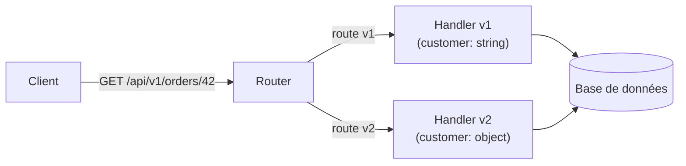
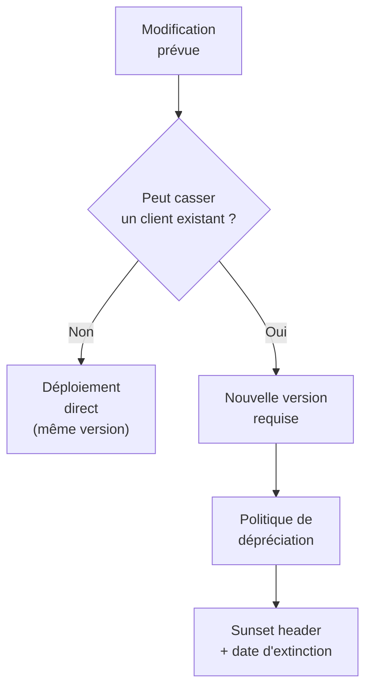

# Gestion des versions d'API

## Objectifs pédagogiques

À la fin de ce module, vous serez capable de :

- Expliquer pourquoi le versioning d'API est inévitable dès qu'une API est consommée par des tiers
- Distinguer les trois grandes stratégies de versioning et leurs implications techniques concrètes
- Choisir une stratégie en fonction du contexte (audience, contraintes infra, cycle de release)
- Identifier les changements "breaking" vs "non-breaking" avant de les publier
- Mettre en place une politique de dépréciation qui ne casse pas les clients existants

---

## Mise en situation

Votre équipe a livré une API de gestion de commandes il y a six mois. Trois partenaires s'y sont intégrés : une appli mobile, un ERP client, et un service interne. Tout tourne bien.

Puis arrive une nouvelle exigence métier : le champ `customer` doit devenir un objet structuré `{ id, name, email }` au lieu d'une simple chaîne. Le problème ? L'appli mobile parse `customer` comme un string. Si vous changez la réponse sans prévenir, elle plante. L'ERP, lui, a un cycle de mise à jour trimestriel. Le service interne peut s'adapter en une heure.

Vous ne pouvez pas satisfaire tout le monde avec un seul endpoint figé. C'est exactement pour ça que le versioning existe.

---

## Ce que c'est, et pourquoi ça existe

Le versioning d'API, c'est la capacité à faire évoluer un contrat sans rompre les clients qui s'y sont déjà connectés. En d'autres termes : publier `v2` d'un endpoint tout en maintenant `v1` fonctionnel le temps que les consommateurs migrent.

Sans cette mécanique, vous avez deux options, toutes les deux mauvaises : soit vous ne changez jamais votre API (et vous accumulez une dette technique massive), soit vous changez et vous cassez des intégrations en production (et vous perdez la confiance de vos partenaires).

L'analogie utile ici : pensez à une prise électrique. Les normes évoluent, mais on garde les anciennes prises fonctionnelles pendant des années pour ne pas forcer tout le monde à racheter ses appareils le même jour. Le versioning d'API, c'est ce mécanisme d'adaptateur.

🧠 **Concept clé** — Le versioning n'est pas une solution à une mauvaise conception. C'est une réponse inévitable à l'évolution d'un système utilisé par des tiers sur lesquels vous n'avez pas le contrôle.

---

## Les trois stratégies de versioning

Il existe trois approches dominantes, chacune avec un modèle mental différent. Aucune n'est universellement supérieure — elles ont des compromis réels.

### 1. Versioning par URL

La version est embarquée dans le chemin de l'URL :

```
GET /api/v1/orders/42
GET /api/v2/orders/42
```

C'est la stratégie la plus répandue. Elle est lisible, débogable, compatible avec tous les caches HTTP, et ne demande aucune configuration spéciale côté client.



### 2. Versioning par header

La version est passée dans un header HTTP personnalisé ou via `Accept` :

```http
GET /api/orders/42
API-Version: 2
```

ou avec la négociation de contenu standard :

```http
GET /api/orders/42
Accept: application/vnd.myapi.v2+json
```

L'URL reste propre, ce qui plaît aux puristes REST. En revanche, le debugging est plus difficile (vous ne pouvez pas coller l'URL dans un navigateur et voir la v2), et les caches HTTP intermédiaires peuvent ignorer les headers customs.

### 3. Versioning par paramètre de requête

```
GET /api/orders/42?version=2
```

C'est simple à implémenter, mais difficile à enforcer et souvent mal géré par les caches. On le retrouve surtout dans des API legacy ou des contextes où l'infrastructure ne supporte pas facilement plusieurs routes.

---

## Comparaison des stratégies

| Critère | URL (`/v2/`) | Header (`API-Version: 2`) | Query param (`?version=2`) |
|---|---|---|---|
| Lisibilité immédiate | ✅ Excellent | ❌ Invisible dans l'URL | ✅ Visible |
| Compatibilité cache HTTP | ✅ Natif | ⚠️ Dépend du proxy | ⚠️ Variable |
| Conformité REST stricte | ❌ Discutable | ✅ Oui | ❌ Non |
| Facilité de debug | ✅ Copier-coller l'URL | ❌ Nécessite un outil | ✅ Copier-coller |
| Adoption client | ✅ Zéro config | ⚠️ Header à ajouter | ✅ Facile |
| Routage côté serveur | ✅ Simple | ⚠️ Middleware dédié | ⚠️ Parsing manuel |
| Utilisé par des majors | Stripe, GitHub, Twilio | Azure REST API, GitHub v2 | Google Maps (legacy) |

⚠️ **Erreur fréquente** — Utiliser le versioning par header parce que "c'est plus propre REST" sans réaliser que vos caches Nginx ou Varnish ne le gèrent pas correctement. Résultat : tous les clients reçoivent la même version indépendamment du header. Ajoutez toujours `Vary: API-Version` dans vos réponses si vous prenez cette route.

---

## Prise de décision : quelle stratégie choisir ?

Voici trois situations concrètes et comment les arbitrer.

**Vous exposez une API publique à des partenaires externes** — Prenez le versioning par URL. C'est le plus universel, le plus simple à documenter, et le moins sujet aux surprises d'infrastructure. Stripe, GitHub, Twilio l'utilisent tous pour cette raison.

**Vous gérez une API interne entre services que vous contrôlez** — Le versioning par header devient viable, parce que vous maîtrisez les clients. Vous pouvez vous assurer que le header est toujours envoyé et géré correctement.

**Vous avez une infra de routing complexe (API Gateway, CDN)** — L'URL est presque toujours la seule option réaliste. Les API Gateways comme Kong, AWS API Gateway ou Nginx savent router sur des chemins. Ils gèrent mal (ou pas) le routing sur les headers applicatifs.

🧠 **Concept clé** — Le "bon" versioning n'est pas celui qui respecte le mieux le standard REST. C'est celui que vos clients peuvent utiliser et que votre infrastructure peut router sans contorsion.

---

## Breaking vs non-breaking : savoir ce qu'on peut se permettre

Toutes les modifications d'API ne nécessitent pas une nouvelle version. La distinction fondamentale :

**Changements non-breaking** (backward compatible) — vous pouvez les déployer sans nouvelle version :
- Ajouter un nouveau champ dans la réponse
- Ajouter un endpoint optionnel
- Ajouter un paramètre optionnel avec une valeur par défaut raisonnable
- Assouplir une contrainte de validation

**Changements breaking** — ils nécessitent une nouvelle version :
- Supprimer ou renommer un champ existant
- Changer le type d'un champ (`string` → `object`)
- Rendre un champ optionnel obligatoire
- Modifier la sémantique d'un code de statut
- Changer la structure des erreurs



💡 **Astuce** — En cas de doute sur le caractère breaking d'un changement, posez-vous la question : "Si un client parsait strictement ma réponse actuelle et ne gérait pas les champs inconnus, est-ce que ce changement le ferait planter ?" Si oui, c'est breaking.

---

## Politique de dépréciation : éteindre une version proprement

Publier `v2` sans plan pour éteindre `v1`, c'est s'engager à maintenir deux versions indéfiniment. Ce n'est pas viable.

Une bonne politique de dépréciation repose sur trois éléments :

**1. Le header `Deprecation` et `Sunset`**

Ces headers standardisés (RFC 8594) permettent d'informer les clients mécaniquement :

```http
HTTP/1.1 200 OK
Deprecation: true
Sunset: Sat, 31 Dec 2025 23:59:59 GMT
Link: <https://api.example.com/v2/orders>; rel="successor-version"
```

Un client bien conçu peut détecter ce header et alerter ses développeurs. C'est objectivement mieux qu'un email.

**2. Une durée de support explicite**

Annoncez-la au lancement de chaque version. Exemples réels :
- Stripe : 12 mois de support après dépréciation
- GitHub : 6 mois de préavis minimum
- Twilio : date d'extinction fixée à l'annonce de la v+1

**3. Du monitoring par version**

Vous ne pouvez pas éteindre `v1` si vous ne savez pas si quelqu'un l'utilise encore. Loguez la version appelée sur chaque requête, et construisez un dashboard. Quand le trafic `v1` tombe à zéro (ou à un seuil acceptable), vous pouvez agir.

⚠️ **Erreur fréquente** — Retirer une version à la date annoncée sans avoir vérifié que le trafic est effectivement tombé. Un partenaire qui n'a pas vu votre email vous appellera en urgence à 2h du matin.

---

## Cas réel : migration de v1 à v2 chez un éditeur SaaS

**Contexte** — Une startup SaaS expose une API de facturation à 40 clients intégrateurs. Le modèle de données `invoice` doit évoluer : le champ `total` (centimes, integer) devient `amount: { value, currency }` pour supporter le multi-devises.

**Ce qu'ils ont fait :**

1. Déploiement de `/v2/invoices` avec la nouvelle structure, en parallèle de `/v1/invoices`
2. Ajout des headers `Deprecation` et `Sunset` (6 mois) sur toutes les réponses v1
3. Email aux 40 clients avec guide de migration et environnement de test v2
4. Dashboard Datadog segmenté par version — ils pouvaient voir en temps réel le ratio v1/v2
5. À J-30 de la date d'extinction : relance automatique via webhook aux clients encore sur v1
6. À la date d'extinction : retour HTTP 410 Gone sur v1 (pas un 404 — la distinction est importante)

**Résultats :** 38 clients migrés avant la date. Les 2 restants ont eu un délai exceptionnel de 3 semaines. Aucun incident en production.

💡 **Astuce** — Retourner un `410 Gone` plutôt qu'un `404 Not Found` sur une version dépréciée permet aux clients de savoir que la ressource a existé mais a été retirée intentionnellement — et non qu'ils ont fait une faute de frappe.

---

## Bonnes pratiques

**Versionnez dès le premier jour.** Même si vous n'avez qu'une version, exposez `/v1/` d'emblée. Migrer de `/api/` à `/api/v1/` après coup est un changement breaking.

**Ne versionnez pas le monde entier.** Si seul un endpoint change de manière incompatible, vous pouvez créer `/v2/orders` sans créer une v2 globale de toute l'API. Certaines équipes versionnent par ressource pour cette raison.

**Documentez les différences entre versions.** Un changelog lisible — pas juste un numéro de version — est la première chose que fera votre intégrateur avant de migrer. Sans lui, il ne bougera pas.

**Testez la compatibilité automatiquement.** Des outils comme [OpenAPI Diff](https://github.com/OpenAPITools/openapi-diff) ou [oasdiff](https://github.com/Tufin/oasdiff) permettent de détecter les breaking changes en CI, avant même le merge. C'est un filet de sécurité précieux.

**N'abusez pas des versions.** Si vous incrémentez une version par trimestre, vous avez soit un problème de conception, soit un problème de gouvernance. Une API bien conçue devrait pouvoir absorber de nombreux changements non-breaking sans changer de version.

---

## Résumé

Le versioning d'API est la réponse structurée au problème inévitable de l'évolution d'un contrat partagé. Sans lui, vous choisissez entre immobilisme et chaos. Les trois stratégies dominantes — URL, header, query param — ont des compromis réels sur la lisibilité, le routing et la compatibilité cache. Le versioning par URL reste le choix le plus robuste pour les API publiques.

Distinguer les changements breaking des changements non-breaking est la compétence centrale : elle détermine si vous avez besoin d'une nouvelle version ou pas. Et quelle que soit la stratégie choisie, une politique de dépréciation explicite — avec des headers standards, du monitoring par version et une date d'extinction annoncée — est ce qui transforme un versioning fonctionnel en versioning opérable sur le long terme.

---

<!-- snippet
id: api_versioning_url_strategy
type: concept
tech: api-rest
level: intermediate
importance: high
format: knowledge
tags: api, versioning, url, routing, rest
title: Versioning par URL — mécanisme et trade-offs
content: La version est embarquée dans le chemin `/api/v2/orders`. Le serveur route sur le préfixe vers un handler différent. Avantage : compatible avec tous les caches HTTP, debuggable directement dans un navigateur, zéro config côté client. Inconvénient : "pollue" l'URL selon les puristes REST. Utilisé par Stripe, GitHub, Twilio.
description: Stratégie la plus répandue — routage sur préfixe de chemin, compatible cache, aucune config client requise.
-->

<!-- snippet
id: api_versioning_breaking_change
type: concept
tech: api-rest
level: intermediate
importance: high
format: knowledge
tags: api, versioning, breaking-change, compatibilité, contrat
title: Breaking vs non-breaking — comment trancher
content: Un changement est breaking si un client qui parse strictement la réponse actuelle peut planter. Exemples breaking : supprimer/renommer un champ, changer un type (`string` → `object`), rendre un champ optionnel obligatoire. Non-breaking : ajouter un champ optionnel, ajouter un endpoint, assouplir une validation. Seuls les breaking changes nécessitent une nouvelle version.
description: Test décisif : "un client existant planterait-il ?" Oui → nouvelle version. Non → déploiement direct.
-->

<!-- snippet
id: api_versioning_sunset_header
type: tip
tech: api-rest
level: intermediate
importance: high
format: knowledge
tags: api, versioning, deprecation, sunset, rfc8594
title: Header Sunset pour signaler la dépréciation d'une version
content: Ajouter ces headers sur toutes les réponses de la version dépréciée : `Deprecation: true`, `Sunset: Sat, 31 Dec 2025 23:59:59 GMT`, `Link: <https://api.example.com/v2/orders>; rel="successor-version"`. Standardisé par RFC 8594. Les clients bien conçus peuvent détecter automatiquement la dépréciation et alerter leurs équipes.
description: RFC 8594 — permet aux clients de détecter mécaniquement la dépréciation sans dépendre d'un email.
-->

<!-- snippet
id: api_versioning_410_gone
type: tip
tech: api-rest
level: intermediate
importance: medium
format: knowledge
tags: api, versioning, http, 410, deprecation
title: Retourner 410 Gone plutôt que 404 sur une version retirée
content: Quand une version d'API est éteinte, retourner `410 Gone` signale explicitement que la ressource a existé mais a été retirée intentionnellement. Un `404 Not Found` laisse croire à une faute de frappe dans l'URL. Le `410` aide les développeurs à comprendre immédiatement qu'ils doivent migrer, pas corriger une URL.
description: 410 Gone = retiré intentionnellement. 404 = introuvable. La distinction accélère le diagnostic côté client.
-->

<!-- snippet
id: api_versioning_vary_header
type: warning
tech: api-rest
level: intermediate
importance: high
format: knowledge
tags: api, versioning, header, cache, vary
title: Header Vary obligatoire avec le versioning par header
content: Piège : si vous versionnez via `API-Version: 2` sans ajouter `Vary: API-Version` dans vos réponses, les proxies et caches HTTP peuvent servir une version mise en cache à tous les clients, quel que soit leur header. Conséquence : un client v2 reçoit une réponse v1 mise en cache. Correction : ajouter systématiquement `Vary: API-Version` (ou `Vary: Accept` pour la négociation de contenu).
description: Sans `Vary: API-Version`, les caches ignorent le header de version — tous les clients reçoivent la même réponse cachée.
-->

<!-- snippet
id: api_versioning_from_day_one
type: tip
tech: api-rest
level: intermediate
importance: high
format: knowledge
tags: api, versioning, conception, bonne-pratique
title: Versionner dès le premier endpoint — même sans v2 prévue
content: Exposer `/api/orders` sans version dès le départ, c'est s'interdire de versionner proprement plus tard — passer à `/api/v1/orders` sera lui-même un breaking change. La bonne pratique : exposer `/api/v1/orders` dès le premier déploiement, même si une v2 n'est pas planifiée. Coût nul au départ, économie certaine à la première évolution.
description: Migrer de `/api/` vers `/api/v1/` après coup est un breaking change. Versionner dès le départ coûte zéro.
-->

<!-- snippet
id: api_versioning_oasdiff_ci
type: tip
tech: api-rest
level: intermediate
importance: medium
format: knowledge
tags: api, versioning, ci, openapi, breaking-change, oasdiff
title: Détecter les breaking changes en CI avec oasdiff
content: L'outil `oasdiff` compare deux specs OpenAPI et liste les breaking changes : `oasdiff breaking old-spec.yaml new-spec.yaml`. S'intègre en CI (GitHub Actions, GitLab CI) pour bloquer un merge qui introduirait un breaking change non intentionnel sur une version stable. Alternative : `openapi-diff` (Java). Utile dès qu'une API est consommée par des tiers.
command: oasdiff breaking <OLD_SPEC> <NEW_SPEC>
example: oasdiff breaking api-v1.yaml api-v1-proposed.yaml
description: Détecte automatiquement les breaking changes entre deux specs OpenAPI — à intégrer en CI avant merge.
-->

<!-- snippet
id: api_versioning_monitor_by_version
type: tip
tech: api-rest
level: intermediate
importance: medium
format: knowledge
tags: api, versioning, monitoring, deprecation, observabilité
title: Monitorer le trafic par version avant d'éteindre une version
content: Avant de retirer une version dépréciée, vérifier que son trafic est effectivement tombé à zéro. Technique : logger la version dans chaque requête (header, middleware, ou parsing d'URL), puis créer un dashboard segmenté par version (Datadog, Grafana). Si le trafic v1 n'est pas à zéro à la date d'extinction, vous risquez un incident client — même si vous avez annoncé la date.
description: Ne jamais éteindre une version sans vérifier le trafic réel — un partenaire silencieux peut encore l'utiliser en prod.
-->
