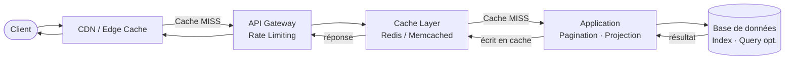

# Performance API : concevoir et opérer des API rapides en production

## Objectifs pédagogiques

À l'issue de ce module, vous serez capable de :

- Identifier les goulots d'étranglement courants dans une API REST et les mesurer objectivement
- Mettre en place une stratégie de cache adaptée au type de donnée exposée
- Implémenter la pagination et la sélection de champs pour limiter le volume de données transféré
- Configurer un rate-limiting cohérent avec les SLA attendus
- Lire des métriques de performance et prendre une décision d'optimisation basée sur des données réelles

---

## Mise en situation

Votre équipe vient de mettre en production une API de catalogue produits pour un e-commerce. Pendant les premières semaines, tout va bien : quelques centaines de requêtes par jour, les temps de réponse sont corrects, personne ne se plaint.

Puis arrive la période de soldes. Le trafic est multiplié par 20 en deux heures. La base de données commence à saturer. Les temps de réponse passent de 80 ms à 4 secondes. Les clients front-end timeout, les logs explosent, et l'équipe passe sa soirée à firefighter.

Le lendemain, le post-mortem révèle trois problèmes : aucun cache, des requêtes SQL sans limite qui retournent 50 000 lignes, et des clients tiers qui appellent l'API en boucle toutes les secondes. Rien de catastrophique individuellement — mais combinés, c'est la panne.

Ce module vous donne les outils pour ne pas vivre ce scénario, ou pour le résoudre quand il arrive.

---

## Contexte et problématique

La performance d'une API ne se résume pas à "ça répond vite". C'est un compromis entre plusieurs dimensions : latence (temps de réponse), débit (requêtes traitées par seconde), cohérence des données (fraîcheur acceptable) et coût infrastructure.

Ce qui rend le sujet complexe, c'est que les optimisations ne sont pas universelles. Un cache agressif est parfait pour des données de référence, désastreux pour des données financières en temps réel. Une pagination stricte est indispensable pour un endpoint `/search`, superflue pour un endpoint `/me` qui renvoie toujours un seul objet.

La bonne approche : **mesurer d'abord, optimiser ensuite, avec une hypothèse claire**. Sinon, vous risquez d'optimiser un endpoint qui représente 2% du trafic pendant que le vrai problème reste invisible.

---

## Architecture d'une API performante

Avant d'entrer dans les détails, voilà la vue d'ensemble des couches qui interviennent dans la chaîne de performance :



Chaque couche a un rôle précis. L'objectif est de répondre le plus tôt possible dans cette chaîne — idéalement depuis le CDN, sinon depuis Redis, et en dernier recours depuis la base de données.

| Couche | Rôle | Levier principal |
|---|---|---|
| CDN / Edge | Répondre sans toucher l'infra | Cache HTTP (Cache-Control) |
| API Gateway | Protéger l'application | Rate limiting, circuit breaker |
| Cache applicatif | Éviter les requêtes DB répétées | Redis / Memcached |
| Application | Limiter le volume de données | Pagination, projection de champs |
| Base de données | Exécuter les requêtes efficacement | Index, requêtes optimisées |

---

## Mesurer avant d'optimiser

Aucune optimisation sérieuse ne commence sans données. Voici les métriques à surveiller et ce qu'elles révèlent.

### Les métriques qui comptent

**Latence au percentile** — La moyenne est trompeuse. Un endpoint avec une moyenne de 100 ms peut avoir un P99 à 4 secondes. Ce sont ces 1% qui font planter les clients les plus sensibles aux délais.

```
P50 (médiane)  → expérience typique
P95            → expérience des utilisateurs "malchanceux"
P99            → pire cas réel (hors outliers)
```

**Throughput** — Combien de requêtes votre API traite par seconde avant de dégrader. À mesurer sous charge progressive, pas en trafic nominal.

**Error rate** — Le taux d'erreurs 5xx sous charge révèle où la saturation apparaît (connexions DB épuisées, timeouts, OOM...).

### Outils concrets

Pour mesurer en développement ou en staging :

```bash
# Test de charge simple avec wrk
wrk -t4 -c100 -d30s https://api.exemple.com/v1/produits

# Mesure de latence détaillée avec hey
hey -n 1000 -c 50 https://api.exemple.com/v1/produits

# Curl avec timing détaillé — utile pour comprendre où le temps est passé
curl -w "@curl-format.txt" -o /dev/null -s https://api.exemple.com/v1/produits
```

Le fichier `curl-format.txt` pour avoir le détail des phases :

```
     time_namelookup:  %{time_namelookup}s\n
        time_connect:  %{time_connect}s\n
     time_appconnect:  %{time_appconnect}s\n
    time_pretransfer:  %{time_pretransfer}s\n
       time_redirect:  %{time_redirect}s\n
  time_starttransfer:  %{time_starttransfer}s\n
                     ----------\n
          time_total:  %{time_total}s\n
```

💡 **Astuce** — `time_starttransfer` minus `time_pretransfer` vous donne le temps de traitement serveur pur, sans le réseau. Si ce delta est élevé, le problème est applicatif ou base de données, pas réseau.

---

## Cache : répondre sans recalculer

Le cache est l'outil le plus efficace pour améliorer la performance d'une API — et le plus risqué si mal configuré. La question centrale n'est pas "faut-il cacher ?" mais "**quelle est la durée de vie acceptable de cette donnée ?**"

### Cache HTTP : déléguer au réseau

Le mécanisme le plus simple et souvent le plus négligé. En ajoutant les bons headers HTTP, vous permettez aux CDN, proxies et navigateurs de cacher vos réponses sans aucun code supplémentaire.

```http
# Réponse mise en cache 5 minutes, partagée par tous les intermédiaires
Cache-Control: public, max-age=300

# Réponse privée (données utilisateur) — pas de cache partagé
Cache-Control: private, max-age=60

# Jamais en cache (données temps réel)
Cache-Control: no-store
```

**La validation conditionnelle** permet de vérifier si une ressource a changé sans la re-transférer entièrement :

```http
# Première réponse — le serveur envoie un ETag
HTTP/1.1 200 OK
ETag: "abc123"
Cache-Control: public, max-age=300

# Requête suivante du client avec l'ETag stocké
GET /produits/42
If-None-Match: "abc123"

# Si la ressource n'a pas changé — 204 octets au lieu de 2 Ko
HTTP/1.1 304 Not Modified
```

🧠 **Concept clé** — Un `304 Not Modified` économise la bande passante mais **pas** le traitement serveur. Le serveur doit quand même vérifier si la ressource a changé. Pour éviter le traitement serveur, c'est le `Cache-Control: max-age` côté client qui s'en charge — le client ne contacte même pas le serveur pendant la durée de validité.

### Cache applicatif avec Redis

Quand le cache HTTP ne suffit pas — données personnalisées, requêtes complexes, agrégations — Redis est la solution standard.

Le pattern le plus courant est le **cache-aside** (ou lazy loading) :

```python
import redis
import json

r = redis.Redis(host='localhost', port=6379, db=0)

def get_produit(produit_id: int) -> dict:
    cache_key = f"produit:{produit_id}"
    
    # 1. Chercher en cache
    cached = r.get(cache_key)
    if cached:
        return json.loads(cached)
    
    # 2. Cache MISS → aller en base
    produit = db.query("SELECT * FROM produits WHERE id = %s", produit_id)
    
    # 3. Écrire en cache avec TTL de 5 minutes
    r.setex(cache_key, 300, json.dumps(produit))
    
    return produit
```

⚠️ **Erreur fréquente** — Oublier le TTL. Un `r.set(key, value)` sans expiration crée un cache permanent. Si la donnée change en base, Redis renvoie indéfiniment la valeur obsolète jusqu'au prochain redémarrage ou flush manuel.

### Invalidation de cache : le problème difficile

L'invalidation est la partie complexe. Deux stratégies principales :

**TTL-based** — Laisser expirer naturellement. Simple, mais la donnée peut être obsolète pendant toute la durée du TTL. Acceptable pour des données de référence (catalogue, config).

**Event-based** — Invalider explicitement quand la donnée change. Plus précis, mais requiert de synchroniser l'invalidation avec les écritures.

```python
def update_produit(produit_id: int, data: dict):
    # 1. Mettre à jour en base
    db.execute("UPDATE produits SET ... WHERE id = %s", produit_id)
    
    # 2. Invalider le cache immédiatement
    r.delete(f"produit:{produit_id}")
    
    # 3. (Optionnel) Invalider les listes qui contiennent ce produit
    r.delete("produits:liste:*")  # Attention : KEYS est lent en prod, préférer des structures explicites
```

💡 **Astuce** — Plutôt que d'invalider toutes les clés par pattern (coûteux avec `KEYS *`), maintenez une **liste explicite des clés associées** à une entité. Quand un produit est modifié, vous savez exactement quelles clés purger.

---

## Pagination : ne jamais renvoyer l'intégralité d'une collection

Un endpoint qui renvoie toutes les lignes d'une table sans limite est une bombe à retardement. La table a 1 000 lignes aujourd'hui, 500 000 dans six mois — et l'API continue de tout charger en mémoire.

### Pagination par offset (simple mais limitée)

```
GET /produits?page=3&limit=20
```

Côté SQL :
```sql
SELECT * FROM produits
ORDER BY id
LIMIT 20 OFFSET 60;  -- page 3 → offset = (page-1) * limit
```

La réponse doit toujours inclure les métadonnées de navigation :

```json
{
  "data": [...],
  "pagination": {
    "page": 3,
    "limit": 20,
    "total": 1250,
    "total_pages": 63,
    "has_next": true,
    "has_prev": true
  }
}
```

⚠️ **Limite de l'offset** — Sur des grandes collections, `OFFSET 10000 LIMIT 20` oblige la base à parcourir et ignorer 10 000 lignes. Plus on avance dans les pages, plus la requête est lente. Acceptable jusqu'à quelques milliers, problématique au-delà.

### Pagination par curseur (scalable)

La pagination par curseur utilise un identifiant opaque pour reprendre là où on s'est arrêté, sans recalculer l'offset.

```
GET /produits?limit=20
→ { data: [...], next_cursor: "eyJpZCI6IDIwfQ==" }

GET /produits?cursor=eyJpZCI6IDIwfQ==&limit=20
→ { data: [...], next_cursor: "eyJpZCI6IDQwfQ==" }
```

Le curseur encode le dernier élément vu (ici, l'ID 20 encodé en base64) :

```sql
-- Au lieu de OFFSET, on filtre sur l'ID
SELECT * FROM produits
WHERE id > 20          -- "après le dernier élément vu"
ORDER BY id
LIMIT 20;
```

Cette requête utilise l'index sur `id` et reste aussi rapide à la page 1 qu'à la page 10 000. La contrepartie : impossible de sauter directement à la page 47, et le `total` n'est plus disponible sans compter toute la table.

🧠 **Concept clé** — La pagination par curseur est la seule scalable pour les très grands datasets. Twitter, Instagram, GitHub l'utilisent tous pour leurs API de flux. L'offset convient pour des interfaces avec navigation par numéro de page ; le curseur convient pour les flux infinis et les exports.

---

## Projection de champs : ne pas transférer ce qui n'est pas demandé

Si votre endpoint `/utilisateurs` renvoie 40 champs et que 90% des clients n'en utilisent que 5, vous gaspillez bande passante, sérialisation et lecture DB pour rien.

### Sélection de champs via query parameter

```
GET /utilisateurs/42?fields=id,nom,email
```

```python
FIELDS_AUTORISÉS = {'id', 'nom', 'email', 'telephone', 'created_at'}

@app.get("/utilisateurs/{user_id}")
def get_utilisateur(user_id: int, fields: str = None):
    if fields:
        champs = set(fields.split(',')) & FIELDS_AUTORISÉS  # Intersection = sécurité
    else:
        champs = FIELDS_AUTORISÉS
    
    # Construction dynamique de la requête SQL
    colonnes = ', '.join(champs)
    user = db.query(f"SELECT {colonnes} FROM utilisateurs WHERE id = %s", user_id)
    
    return user
```

⚠️ **Erreur fréquente** — Construire la requête SQL avec les champs sans valider qu'ils appartiennent à une liste autorisée. Un client malveillant pourrait injecter `fields=id,(SELECT password FROM admins)` si vous n'intersectez pas avec une whitelist.

### Embed et expand : charger les relations à la demande

Plutôt que de toujours inclure les sous-ressources (ce qui alourdit les réponses) ou de forcer N+1 requêtes côté client, exposez un paramètre `expand` :

```
GET /commandes/99                          → commande sans détails client
GET /commandes/99?expand=client,produits   → commande avec client et produits embarqués
```

---

## Rate Limiting : protéger l'API et garantir l'équité

Le rate limiting répond à deux besoins distincts : **protéger l'infrastructure** contre les abus et les bugs clients (boucle infinie, retry sans backoff) et **garantir l'équité** entre les consommateurs pour que l'un ne monopolise pas les ressources au détriment des autres.

### Algorithmes courants

**Token bucket** — Chaque client dispose d'un seau de jetons. Chaque requête consomme un jeton. Les jetons se régénèrent à un rythme constant. Permet les bursts jusqu'à la capacité du seau.

**Fixed window** — Compteur remis à zéro toutes les N secondes. Simple, mais crée un "double burst" à la frontière entre deux fenêtres (une salve en fin de fenêtre + une en début de la suivante).

**Sliding window** — Compte les requêtes sur les N dernières secondes glissantes. Plus juste, légèrement plus coûteux en mémoire.

Pour la majorité des API, le **token bucket** est le bon défaut : il absorbe les pics légitimes tout en limitant le débit moyen.

### En-têtes de réponse standardisés

Votre API doit toujours communiquer l'état du rate limit au client :

```http
HTTP/1.1 200 OK
X-RateLimit-Limit: 1000
X-RateLimit-Remaining: 743
X-RateLimit-Reset: 1735689600
Retry-After: 30
```

Quand la limite est atteinte :

```http
HTTP/1.1 429 Too Many Requests
X-RateLimit-Limit: 1000
X-RateLimit-Remaining: 0
X-RateLimit-Reset: 1735689600
Retry-After: 30

{
  "error": "rate_limit_exceeded",
  "message": "Limite de 1000 requêtes/heure atteinte. Réessayez dans 30 secondes.",
  "retry_after": 30
}
```

🧠 **Concept clé** — Le `429` avec `Retry-After` est la réponse correcte au rate limiting. Ne pas utiliser `503` (qui signifie que le service est indisponible) ni `403` (qui signifie que le client n'a pas les droits). Un client bien implémenté qui reçoit un `429` attend la durée indiquée — c'est pourquoi ces headers sont critiques.

### Niveaux de granularité

Le rate limiting ne s'applique pas nécessairement à toute l'API de la même façon :

| Niveau | Exemple | Cas d'usage |
|---|---|---|
| Global | 10 000 req/min sur l'API entière | Protection infra |
| Par client (API key) | 1 000 req/heure par token | Équité entre clients |
| Par endpoint | `/search` : 100 req/min | Endpoints coûteux |
| Par IP | 20 req/min sans auth | Protection endpoints publics |

### Implémentation avec Redis (Sliding Window)

```python
import redis
import time

r = redis.Redis(host='localhost', port=6379)

def check_rate_limit(client_id: str, limit: int = 1000, window: int = 3600) -> tuple[bool, int]:
    """
    Retourne (autorisé, requêtes_restantes)
    Fenêtre glissante sur `window` secondes avec max `limit` requêtes
    """
    now = time.time()
    key = f"ratelimit:{client_id}"
    
    pipe = r.pipeline()
    # Supprimer les entrées hors fenêtre
    pipe.zremrangebyscore(key, 0, now - window)
    # Compter les requêtes dans la fenêtre
    pipe.zcard(key)
    # Ajouter la requête actuelle
    pipe.zadd(key, {str(now): now})
    # Expiration de la clé
    pipe.expire(key, window)
    
    _, count, _, _ = pipe.execute()
    
    remaining = max(0, limit - count - 1)
    return count < limit, remaining
```

---

## Construction progressive : de l'API naïve à l'API production

### V1 — API sans optimisation (point de départ)

```python
@app.get("/produits")
def list_produits():
    # Retourne TOUT, sans limite
    produits = db.query("SELECT * FROM produits")
    return produits
```

Problèmes : aucune limite, aucun cache, sérialise toujours tous les champs. Tient 100 req/s en dev, s'effondre en prod.

### V2 — Pagination et projection

```python
@app.get("/produits")
def list_produits(
    page: int = 1,
    limit: int = Query(default=20, le=100),  # Max 100, pas négociable
    fields: str = None
):
    champs = parse_fields(fields, FIELDS_AUTORISÉS)
    offset = (page - 1) * limit
    
    produits = db.query(
        f"SELECT {', '.join(champs)} FROM produits LIMIT %s OFFSET %s",
        limit, offset
    )
    total = db.query_scalar("SELECT COUNT(*) FROM produits")
    
    return {
        "data": produits,
        "pagination": {"page": page, "limit": limit, "total": total}
    }
```

Déjà beaucoup mieux. Mais chaque requête frappe la base.

### V3 — Cache + Rate limiting (production)

```python
@app.get("/produits")
@rate_limit(limit=1000, window=3600)  # Décorateur ou middleware
def list_produits(
    page: int = 1,
    limit: int = Query(default=20, le=100),
    fields: str = None
):
    champs = parse_fields(fields, FIELDS_AUTORISÉS)
    cache_key = f"produits:p{page}:l{limit}:f{','.join(sorted(champs))}"
    
    # Tenter le cache
    cached = r.get(cache_key)
    if cached:
        response = JSONResponse(json.loads(cached))
        response.headers["X-Cache"] = "HIT"
        return response
    
    # Cache MISS
    offset = (page - 1) * limit
    produits = db.query(...)
    total = db.query_scalar(...)
    
    result = {"data": produits, "pagination": {...}}
    r.setex(cache_key, 300, json.dumps(result))
    
    response = JSONResponse(result)
    response.headers["X-Cache"] = "MISS"
    return response
```

💡 **Astuce** — Le header `X-Cache: HIT/MISS` est inestimable pour déboguer. Sans lui, impossible de savoir à l'œil nu si Redis répond ou si la DB est sollicitée à chaque requête.

---

## Diagnostic : lire les symptômes de performance

### Symptôme → Cause → Correction

| Symptôme | Cause probable | Correction |
|---|---|---|
| Latence élevée, CPU DB à 100% | Requêtes sans index, N+1 queries | Index sur colonnes filtrées, eager loading |
| Latence élevée sur toutes les pages tardives | Pagination par offset sur grande table | Migrer vers pagination par curseur |
| Réponses lentes mais DB OK | Sérialisation JSON de gros objets | Projection de champs, compression gzip |
| Erreurs 503 sous charge | Connexions DB épuisées | Pool de connexions, circuit breaker |
| Cache hit rate < 30% | Clés de cache trop granulaires ou TTL trop court | Revoir la stratégie de clé, augmenter TTL |
| Requêtes répétées à haute fréquence | Clients sans backoff exponentiel | Rate limiting + documentation du `Retry-After` |

### Le problème N+1

Le N+1 est le piège classique : récupérer une liste de commandes, puis faire une requête par commande pour récupérer le client associé.

```python
# ❌ N+1 — 1 requête pour les commandes + N requêtes pour les clients
commandes = db.query("SELECT * FROM commandes LIMIT 20")
for commande in commandes:
    commande['client'] = db.query("SELECT * FROM clients WHERE id = %s", commande['client_id'])

# ✅ Une seule requête avec JOIN
commandes = db.query("""
    SELECT c.*, cl.nom, cl.email
    FROM commandes c
    JOIN clients cl ON c.client_id = cl.id
    LIMIT 20
""")
```

Sur 20 commandes, le N+1 génère 21 requêtes. Sur 100, c'est 101. Les ORM le masquent souvent — apprenez à lire les requêtes générées avec un query logger.

---

## Cas réel : optimisation d'une API de recherche

**Contexte** — API de recherche pour un SaaS B2B, environ 50 000 requêtes/jour. Temps de réponse moyen : 1,2 secondes. Le P99 atteint 8 secondes. Les équipes commerciales se plaignent que la recherche est "inutilisable".

**Diagnostic** — Analyse des slow queries PostgreSQL + traces applicatives :
- L'endpoint `/recherche` exécutait un `SELECT * FROM contrats WHERE ... ORDER BY relevance` sans index fulltext
- Retournait systématiquement 500 résultats sans pagination
- Aucun cache (les mêmes recherches populaires frappaient la DB en boucle)

**Actions menées** :

1. Index GIN PostgreSQL sur les colonnes de recherche → requête passée de 900 ms à 40 ms
2. Pagination par curseur limitée à 20 résultats → volume de données divisé par 25
3. Cache Redis de 2 minutes sur les 100 recherches les plus fréquentes (représentant 60% du trafic)
4. Rate limiting à 30 req/min par client

**Résultats mesurés** :
- Latence P50 : 1 200 ms → 45 ms
- Latence P99 : 8 000 ms → 320 ms
- Charge CPU sur la DB : de 85% à 20% en heure de pointe
- Aucune régression fonctionnelle signalée

Le point clé : **l'index seul aurait suffi** à résoudre 80% du problème. Les autres optimisations ont apporté la robustesse pour absorber les pics futurs.

---

## Bonnes pratiques

**Mesurez avant d'optimiser.** Définissez des SLO explicites (ex : P99 < 500 ms pour les endpoints critiques) et mesurez-les avec des outils dédiés. Une optimisation sans baseline avant/après ne prouve rien.

**Exposez toujours un maximum de pagination côté serveur.** `limit=100` maximum côté serveur, pas `limit=10000`. Le client peut toujours paginer — vous ne pouvez pas revenir en arrière une fois qu'un client dépend d'une réponse de 50 000 lignes.

**Documentez la stratégie de cache dans vos headers.** Chaque réponse doit avoir un `Cache-Control` explicite. "Pas de header" ne signifie pas "ne pas cacher" — le comportement varie selon les CDN.

**Évitez les clés de cache trop génériques ou trop spécifiques.** Une clé `produits:tous` se périme en bloc à chaque modification. Une clé `produits:p1:l20:f=id,nom,prix:q=chaussures:cat=mode` ne sera jamais réutilisée. Trouvez le bon niveau de granularité.

**Testez sous charge en staging avant de toucher à la prod.** La plupart des problèmes de performance sont invisibles avec 10 utilisateurs simultanés. Un test avec `wrk` ou `k6` à 200 connexions pendant 60 secondes révèle les vrais goulots.

**Le rate limiting doit être accompagné d'une documentation claire.** Un client qui reçoit un `429` sans comprendre les limites va réessayer immédiatement et aggraver la situation. Documentez les quotas, exposez-les dans les headers, et fournissez le `Retry-After`.

**Activez la compression gzip/brotli sur les réponses JSON.** Pour des payloads de plus de quelques Ko, la compression réduit la taille de 60 à 80% avec un coût CPU négligeable. Sur Nginx, c'est deux lignes de config ; dans FastAPI/Express, c'est un middleware.

---

## Résumé

Une API performante en production repose sur quelques principes simples appliqués dans le bon ordre. D'abord, **mesurer** avec des métriques orientées percentile (P95, P99) pour localiser les vrais problèmes. Ensuite, agir couche par couche : le **cache HTTP** est gratuit à mettre en place et déleste l'infrastructure sans code complexe ; la **pagination** évite que les collections grandissantes ne deviennent des bombes mémoire ; la **projection de champs** réduit le volume transféré et le travail de sérialisation ; le **rate limiting** protège l'ensemble quand un client se comporte mal.

L'erreur classique est d'optimiser prématurément et globalement. Dans la plupart des cas, 20% des endpoints génèrent 80% de la charge — concentrez-vous là. Les outils Redis, les headers `Cache-Control` et `X-RateLimit-*`, et la pagination par curseur couvrent la quasi-totalité des situations de production.

La suite logique de ce module : les patterns de résilience (circuit breaker, retry avec backoff exponentiel) qui complètent la performance en gérant les pannes des dépendances externes.

---

<!-- snippet
id: api_cache_control_headers
type: concept
tech: api-rest
level: intermediate
importance: high
format: knowledge
tags: cache, http, headers, cdn, performance
title: Cache-Control : public vs private vs no-store
content: Cache-Control public permet aux CDN et proxies de cacher la réponse (données partagées). private restreint le cache au navigateur seul (données utilisateur). no-store interdit tout cache. Le max-age (secondes) détermine la durée