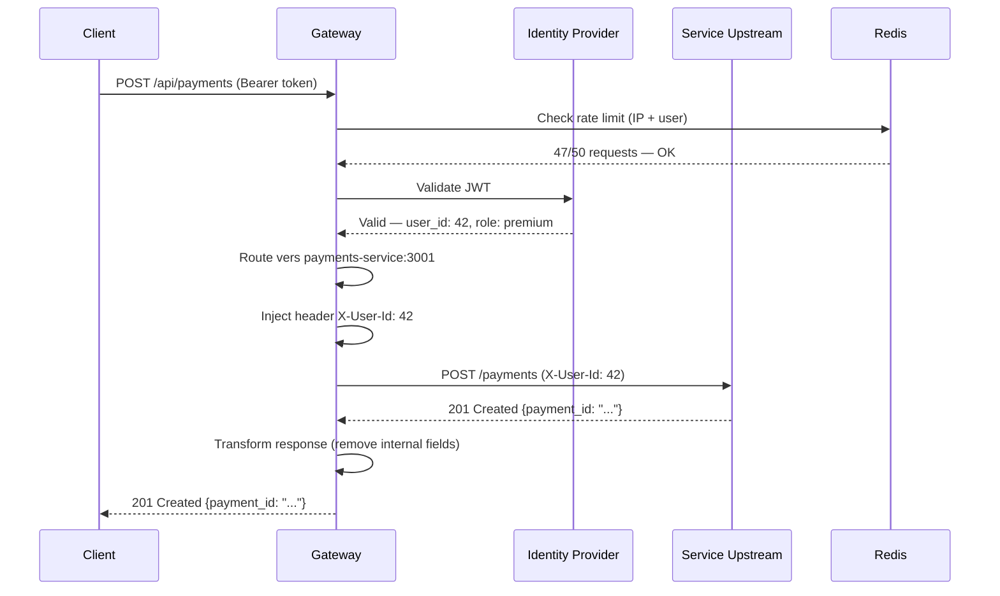
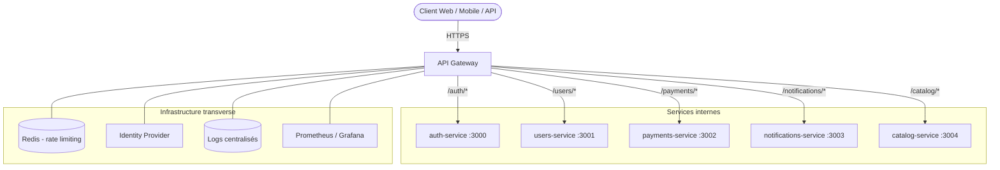
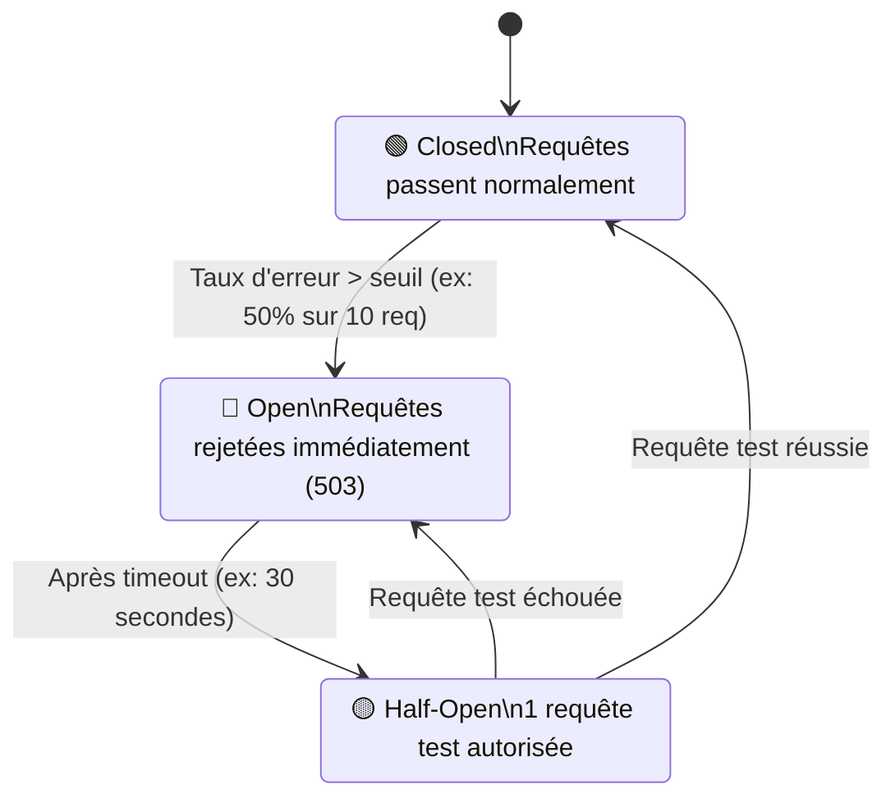

# API Gateway & Architecture distribuée

## Objectifs pédagogiques

À la fin de ce module, vous serez capable de :

- Expliquer le rôle d'une API Gateway dans une architecture distribuée et ce qu'elle remplace concrètement
- Identifier les responsabilités à déléguer à la gateway vs celles qui restent dans les services
- Concevoir une architecture gateway multi-services avec routage, authentification centralisée et rate limiting
- Anticiper les points de défaillance d'une gateway et mettre en place des mécanismes de résilience
- Choisir entre les solutions du marché (Kong, AWS API Gateway, Nginx, Traefik) selon un contexte donné

---

## Mise en situation

Imaginons une startup qui a démarré avec une API monolithique. Six mois plus tard, l'équipe a découpé l'application en cinq services : `auth`, `users`, `payments`, `notifications` et `catalog`. Chaque service expose ses propres endpoints. Résultat immédiat : cinq fois plus de problèmes.

L'authentification est gérée dans chaque service séparément — avec des bugs différents dans chacun. Les logs sont éparpillés sur cinq machines. Quand le service `payments` se fait martelder par un bot, il tombe, et l'effet de cascade fait tomber `users` avec lui. Le frontend ne sait plus quelle URL appeler pour quoi. Un client change son mot de passe côté `auth`, mais son token est toujours valide côté `payments` pendant encore 24h.

C'est exactement le problème que l'API Gateway résout — pas en ajoutant une nouvelle couche de complexité, mais en consolidant les responsabilités transversales en un point unique, clairement défini.

---

## Contexte et problématique

### Pourquoi l'architecture distribuée crée un problème de surface

Dans un monolithe, certaines choses sont "gratuites" : un seul point d'entrée, une seule config de sécurité, une seule couche de logs, un seul endroit où appliquer le rate limiting. Quand on découpe en microservices, ces responsabilités doivent aller quelque part. Si elles restent dans chaque service, on obtient de la duplication — avec les incohérences que ça implique inévitablement en production.

🧠 **Concept clé** — La règle des "cross-cutting concerns" : l'authentification, la journalisation, le throttling, le CORS et le SSL termination sont des préoccupations transversales. Elles ne appartiennent pas à la logique métier d'un service individuel. Les centraliser dans une gateway n'est pas une optimisation, c'est une décision d'architecture.

Le problème devient encore plus visible quand plusieurs équipes gèrent des services différents. Sans point d'entrée unique, chaque équipe implémente les contrôles de sécurité à sa façon — ou les oublie.

### Ce qu'une gateway n'est pas

Une API Gateway n'est pas un simple reverse proxy. Nginx peut router du trafic, mais il ne gère pas nativement la rotation de tokens JWT, la transformation de payload ou le circuit breaking. Une gateway est un reverse proxy avec une couche d'intelligence métier orientée API.

Ce n'est pas non plus un ESB (Enterprise Service Bus) dans le style SOA des années 2000. L'erreur architecturale à éviter absolument : mettre de la logique métier dans la gateway. Si votre gateway commence à fusionner des réponses de deux services ou à transformer des données métier, vous êtes en train de créer un point de couplage fragile.

---

## Architecture : comment une gateway s'organise

### Les composants en jeu

| Composant | Rôle | Exemple concret |
|-----------|------|-----------------|
| **API Gateway** | Point d'entrée unique, routage, auth, rate limiting | Kong, AWS API Gateway, Traefik |
| **Service upstream** | Service métier réel, appelé par la gateway | `/api/payments` → service interne port 3001 |
| **Identity Provider** | Valide les tokens JWT ou OAuth2 | Keycloak, Auth0, AWS Cognito |
| **Rate Limiter store** | Stocke les compteurs de requêtes | Redis (partagé entre instances de gateway) |
| **Load Balancer** | Distribue les requêtes entre instances d'un service | Round-robin, least-connections |
| **Service Registry** | Référentiel des services disponibles | Consul, etcd, Kubernetes DNS |
| **Circuit Breaker** | Coupe temporairement les appels vers un service défaillant | Hystrix, Resilience4j, configuration Kong |

### Flux d'une requête à travers la gateway



Ce qui est important ici : le service `payments` n'a jamais vu le token JWT brut. Il reçoit un header `X-User-Id` que la gateway a injecté après validation. Le service fait confiance à la gateway, pas au client directement — c'est un choix architectural délibéré, avec ses implications.

### Architecture multi-services



---

## Fonctionnement interne : ce que la gateway fait réellement

### Le pipeline de traitement

Une requête ne "traverse" pas une gateway — elle est traitée par un pipeline de plugins ou middlewares, exécutés dans un ordre précis. Comprendre cet ordre est crucial pour déboguer.

Ordre typique d'un pipeline Kong :

```
1. Résolution DNS / routing
2. Authentication (JWT, API Key, OAuth2)
3. Authorization (ACL, scopes)
4. Rate Limiting (compteur Redis)
5. Request Transformation (ajout/suppression headers)
6. Proxy (appel vers l'upstream)
7. Response Transformation
8. Logging
```

⚠️ **Erreur fréquente** — Configurer le rate limiting *avant* l'authentification signifie que vous comptez des requêtes anonymes et authentifiées dans le même bucket. Un attaquant peut épuiser votre quota global avec des requêtes sans token. L'ordre correct : authentifier d'abord, puis appliquer le rate limiting par utilisateur identifié.

### Routage : path-based vs host-based

Deux stratégies principales :

**Path-based routing** — Un seul domaine, le chemin détermine le service :
```
https://api.example.com/users/42    → users-service
https://api.example.com/payments/   → payments-service
https://api.example.com/catalog/    → catalog-service
```

**Host-based routing** — Des sous-domaines distincts :
```
https://users.api.example.com/42    → users-service
https://payments.api.example.com/   → payments-service
```

Le path-based est plus simple à gérer côté certificats TLS (un seul wildcard). Le host-based permet une isolation plus nette et des configurations de sécurité par sous-domaine. En pratique, la majorité des architectures modernes utilisent le path-based avec versioning (`/v1/users`, `/v2/users`).

### SSL Termination

La gateway termine le TLS : elle reçoit du HTTPS chiffré côté client, et communique en HTTP en clair avec les services internes (dans un réseau de confiance). Ça simplifie massivement la gestion des certificats — un seul endroit où renouveler, un seul endroit où configurer.

💡 **Astuce** — En environnement Kubernetes, coupler la gateway avec cert-manager et Let's Encrypt permet le renouvellement automatique des certificats sans intervention manuelle.

### Rate Limiting : les strategies

| Stratégie | Comportement | Usage |
|-----------|-------------|-------|
| **Fixed Window** | 100 req/minute, compteur reset à t+60s | Simple, mais vulnérable aux bursts en fin de fenêtre |
| **Sliding Window** | 100 req sur les 60 dernières secondes glissantes | Plus équitable, plus coûteux en mémoire Redis |
| **Token Bucket** | Bucket rechargé à débit constant, rafale autorisée jusqu'à la capacité | Adapté aux usages avec pics légitimes |
| **Leaky Bucket** | File d'attente à débit constant, rejette si plein | Lissage du trafic, utile pour protéger un service fragile |

Le token bucket est le plus utilisé en production car il permet des petites rafales (un utilisateur qui fait 10 requêtes d'un coup ponctuellement) tout en limitant le débit moyen.

---

## Construction progressive : de nginx à une gateway complète

### V1 — Reverse proxy simple (Nginx)

Point de départ. Nginx route le trafic, termine SSL, fait du load balancing basique. Zéro gestion d'auth ou de rate limiting.

```nginx
# nginx.conf — Configuration minimaliste
upstream payments_backend {
    server payments-service:3002;
    server payments-service-2:3002;  # Second instance
}

server {
    listen 443 ssl;
    server_name api.example.com;

    ssl_certificate     /etc/ssl/certs/api.crt;
    ssl_certificate_key /etc/ssl/private/api.key;

    location /payments/ {
        proxy_pass http://payments_backend;
        proxy_set_header X-Real-IP $remote_addr;
        proxy_set_header X-Forwarded-For $proxy_add_x_forwarded_for;
    }
}
```

**Ce qui manque** : auth, rate limiting, observabilité, circuit breaking. Dès qu'on a plus de 3 services et une exigence de sécurité, ça ne suffit plus.

### V2 — Kong Gateway avec authentification JWT

Kong s'installe devant les services et expose une Admin API (port 8001) pour configurer routes et plugins.

```bash
# Créer un service (la cible upstream)
curl -X POST http://localhost:8001/services \
  --data name=payments-service \
  --data url=http://payments-service:3002

# Créer une route associée
curl -X POST http://localhost:8001/services/payments-service/routes \
  --data "paths[]=/payments" \
  --data "methods[]=GET" \
  --data "methods[]=POST"

# Activer le plugin JWT sur ce service
curl -X POST http://localhost:8001/services/payments-service/plugins \
  --data name=jwt

# Activer le rate limiting (100 req/minute par consumer)
curl -X POST http://localhost:8001/services/payments-service/plugins \
  --data name=rate-limiting \
  --data config.minute=100 \
  --data config.policy=redis \
  --data config.redis_host=redis \
  --data config.redis_port=6379
```

### V3 — Configuration déclarative avec Kong Deck (production)

En production, gérer la configuration via l'Admin API en curl n'est pas viable. On utilise `deck` (Kong's declarative config) ou un fichier YAML versionné dans Git.

```yaml
# kong.yaml — Configuration déclarative
_format_version: "3.0"

services:
  - name: payments-service
    url: http://payments-service:3002
    connect_timeout: 5000
    read_timeout: 30000
    write_timeout: 30000
    routes:
      - name: payments-route
        paths:
          - /payments
        methods:
          - GET
          - POST
          - PATCH
        strip_path: false
    plugins:
      - name: jwt
        config:
          claims_to_verify:
            - exp
          key_claim_name: iss
      - name: rate-limiting
        config:
          minute: 100
          policy: redis
          redis_host: redis
          redis_port: 6379
          hide_client_headers: false
      - name: request-transformer
        config:
          add:
            headers:
              - "X-Gateway-Version:2.0"
      - name: prometheus
        config:
          per_consumer: true
```

```bash
# Déployer la configuration
deck sync --state kong.yaml

# Vérifier les diffs avant d'appliquer
deck diff --state kong.yaml
```

💡 **Astuce** — Stocker `kong.yaml` dans Git et lancer `deck diff` en CI avant chaque merge. Si la diff est vide, la config est cohérente entre l'environnement de staging et la config voulue. C'est votre "configuration as code" pour la gateway.

---

## Résilience : ce qui se passe quand ça tombe

### Circuit Breaker

Le circuit breaker est l'un des patterns les plus importants en architecture distribuée, et l'un des plus souvent négligés jusqu'à la première panne en prod.

Le principe : si un service upstream répond avec des erreurs (ou ne répond plus), couper temporairement les appels vers lui plutôt que de laisser les requêtes s'empiler et consommer des ressources.



Sans circuit breaker, un service lent (timeout 30s) peut monopoliser tous les workers de la gateway en attendant des réponses — et faire tomber l'ensemble du système par manque de ressources disponibles. Avec le circuit breaker, après 10 erreurs, les requêtes suivantes reçoivent immédiatement un 503 — ce qui est infiniment mieux pour le client que d'attendre 30 secondes pour rien.

### Retry avec backoff exponentiel

Retenter une requête immédiatement après un échec aggrave souvent le problème. La bonne pratique :

```yaml
# Configuration de retry dans Kong
plugins:
  - name: retry
    config:
      attempts: 3          # Nombre de tentatives
      status_codes:
        - 502
        - 503
        - 504
      # Backoff : 1s, 2s, 4s entre les tentatives
```

⚠️ **Erreur fréquente** — Configurer des retries sur des requêtes POST sans vérifier que l'opération est idempotente. Si `POST /payments` crée un paiement et que vous retentez 3 fois après un timeout réseau, vous risquez de créer trois paiements identiques. Les retries automatiques ne sont sûrs que sur des opérations idempotentes (GET, PUT, DELETE) ou si les services implémentent une clé d'idempotence.

### Timeouts : les trois à configurer

```yaml
services:
  - name: payments-service
    connect_timeout: 3000   # Temps pour établir la connexion TCP (ms)
    read_timeout: 30000     # Temps pour recevoir la réponse complète (ms)
    write_timeout: 10000    # Temps pour envoyer la requête (ms)
```

Un service de paiement peut légitimement prendre 15 secondes. Un service de catalogue ne devrait jamais dépasser 500ms. Configurer le même timeout pour tous les services est une erreur — trop court pour les uns, trop permissif pour les autres.

---

## Prise de décision : quelle gateway choisir

### Comparaison des solutions principales

| Critère | **Kong** | **AWS API Gateway** | **Traefik** | **Nginx (+ LUA)** |
|---------|---------|--------------------|-----------|--------------------|
| **Déploiement** | Self-hosted ou cloud | Fully managed AWS | Self-hosted (k8s natif) | Self-hosted |
| **Configuration** | Admin API + YAML | Console AWS / Terraform | Labels Docker/K8s | Fichiers nginx.conf |
| **Plugins** | Écosystème riche (100+) | Intégration AWS native | Middlewares Go | Manuel (LUA/modules) |
| **Rate limiting** | Natif (Redis) | Natif | Natif | Manuel |
| **Circuit breaker** | Plugin Enterprise | Natif | Plugin | Pas natif |
| **Observabilité** | Prometheus natif | CloudWatch | Prometheus natif | Via modules |
| **Courbe d'apprentissage** | Moyenne | Faible (si déjà AWS) | Faible (k8s) | Élevée |
| **Coût** | Gratuit (open source) | À l'usage (peut grimper) | Gratuit | Gratuit |
| **Idéal pour** | Architecture microservices complexe | Stack 100% AWS | Kubernetes | Contrôle total, équipe ops expérimentée |

### Quand cette architecture atteint ses limites

Une API Gateway centralise tout — ce qui est sa force et sa faiblesse. Points de vigilance :

**Single point of failure** : si la gateway tombe, tout tombe. Réponse : déployer en cluster avec au minimum 3 instances, et un health check agressif côté load balancer.

**Latence ajoutée** : chaque requête passe par la gateway avant d'atteindre le service. En pratique, ça représente 2 à 10ms pour les opérations courantes (validation JWT depuis cache, rate limit check Redis). Sur des services avec SLA < 10ms, c'est significatif.

**Bottleneck de configuration** : si chaque nouveau service nécessite une configuration manuelle de la gateway, ça devient un frein au déploiement. Solution : automatiser via Terraform ou GitOps (deck sync au déploiement CI/CD).

**Service Mesh comme alternative** : pour les communications *service-to-service* (est-ouest), une API Gateway n'est pas la bonne réponse — c'est le domaine du service mesh (Istio, Linkerd). La gateway gère le trafic nord-sud (client → services). Le service mesh gère le trafic est-ouest (service → service). Les deux coexistent.

---

## Cas réel en entreprise

### Contexte

Plateforme e-commerce, ~80 000 utilisateurs actifs, architecture décomposée en 12 microservices. Incident récurrent : le service de recommandations (ML, parfois lent) impactait les temps de réponse de toute la plateforme lors des pics de trafic.

### Problème initial

Chaque service gérait son propre rate limiting en mémoire locale. En cas de déploiement rolling update, les compteurs étaient perdus. Résultat : les bots de scraping récupéraient une fenêtre de 0 requête à chaque restart et pouvaient hammerer les endpoints sans limite effective pendant quelques minutes.

L'authentification JWT était vérifiée dans chaque service — avec des clés publiques différentes non synchronisées, provoquant des 401 intermittents après rotation de clés.

### Solution mise en place

Migration vers Kong en cluster (3 nodes) avec Redis partagé pour le rate limiting. Configuration déclarative versionnée dans Git, déployée automatiquement par le pipeline CI/CD via `deck sync`.

Résultats après 3 mois :
- **Incidents d'auth** : 0 (contre ~4/mois avant)
- **Latence P99** : +6ms ajoutée par la gateway (acceptable)
- **Temps de configuration d'un nouveau service** : 15 minutes (config YAML + PR) contre 2-3 jours pour dupliquer la couche auth dans un nouveau service
- **Visibilité** : dashboard Grafana unifié sur toutes les routes, alertes sur taux d'erreur par service

Le circuit breaker sur le service de recommandations a empêché deux cascades de pannes lors de pics de trafic inhabituels.

---

## Bonnes pratiques

**1. Versionnez votre configuration de gateway comme du code applicatif.** Un `kong.yaml` ou des ressources Kubernetes Ingress doivent vivre dans Git, avec PR, review et déploiement automatisé. Toute modification manuelle via l'Admin API doit être immédiatement reportée dans le fichier de config.

**2. N'authentifiez jamais deux fois le même token.** Si la gateway valide le JWT, les services en aval n'ont pas à le revalider. Ils font confiance aux headers injectés par la gateway (`X-User-Id`, `X-User-Roles`). Doublon coûteux et source d'incohérence.

**3. Configurez des timeouts différents par service.** Un endpoint de génération de rapport n'a pas le même SLA qu'un endpoint de login. Des timeouts uniformes créent des faux positifs (coupures sur opérations légitimement longues) ou des fenêtres trop larges (connexions zombies qui consomment des workers).

**4. Mesurez la latence P50/P95/P99, pas la moyenne.** Une moyenne de 50ms peut cacher un P99 à 8 secondes. Kong expose des métriques Prometheus par route et par consumer — exploitez-les. Une alerte sur `kong_latency_bucket{quantile="0.99"} > 1000` est plus utile qu'une alerte sur la moyenne.

**5. Séparez les secrets de la configuration.** Les clés JWT, credentials Redis et API keys ne doivent pas être en clair dans `kong.yaml`. Utilisez les références à des secrets Kubernetes ou un vault (HashiCorp Vault, AWS Secrets Manager).

**6. Testez le comportement de la gateway sous panne.** Coupez un service upstream, vérifiez que la gateway retourne un 503 propre (pas un timeout de 30s). Désactivez Redis, vérifiez que le fallback du rate limiting ne bloque pas tout le trafic. Ces tests ne se font pas en production.

**7. Limitez les transformations de payload dans la gateway.** Ajouter un header : OK. Modifier la structure JSON d'une réponse métier : non. Dès que la gateway connaît le format métier des données, elle devient couplée à la logique des services — vous perdez tout l'intérêt de l'architecture distribuée.

---

## Résumé

Une API Gateway résout un problème fondamental des architectures distribuées : que faire des responsabilités transversales quand on n'a plus un seul service mais vingt ? Authentification centralisée, rate limiting partagé, routage unifié, observabilité consolidée — ces fonctions appartiennent à la gateway, pas à chaque service individuellement.

La gateway fonctionne comme un pipeline de plugins ordonnés. L'ordre a de l'importance : authentifier avant de rate-limiter, transformer avant de proxifier. Les patterns de résilience — circuit breaker, retry avec backoff, timeouts différenciés — ne sont pas optionnels en production, ils sont la condition pour que l'architecture distribuée soit plus robuste qu'un monolithe.

Le choix de la solution (Kong, AWS API Gateway, Traefik) dépend moins des features que du contexte : stack existante, compétences de l'équipe, exigence de contrôle. Kong pour une architecture microservices complexe, Traefik pour Kubernetes avec un besoin de configuration simple par labels, AWS API Gateway si tout est déjà dans l'écosystème AWS.

La limite à garder en tête : la gateway est le bon endroit pour le trafic nord-sud (clients vers services). Pour les communications entre services, le service mesh (Istio, Linkerd) prend le relais — les deux patterns coexistent dans les architectures matures.

---

<!-- snippet
id: apigateway_pipeline_order
type: concept
tech: api-gateway
level: advanced
importance: high
format: knowledge
tags: api-gateway, pipeline, authentication, rate-limiting, kong
title: Ordre du pipeline dans une API Gateway
content: Une gateway traite les requêtes via un pipeline ordonné de plugins : 1) Routing, 2) Authentication, 3) Authorization, 4) Rate Limiting, 5) Request Transformation, 6) Proxy upstream, 7) Response Transformation, 8) Logging. L'ordre est critique : rate limiter AVANT auth = bots épuisent le quota global. Auth AVANT rate limiting = compteur par utilisateur identifié.
description: Si le rate limiting est placé avant l'auth, des requêtes anonymes malveillantes peuvent épuiser le quota global de tous les utilisateurs légitimes.
-->

<!-- snippet
id: apigateway_circuit_breaker_states
type: concept
tech: api-gateway
level: advanced
importance: high
format: knowledge
tags: circuit-breaker, resilience, microservices, kong
title: États du Circuit Breaker (Closed / Open / Half-Open)
content: 3 états : Closed (trafic normal), Open (requêtes rejetées en 503 immédiat après N% d'erreurs), Half-Open (1 requête test autorisée après timeout). Sans circuit breaker, un service à timeout 30s peut monopoliser tous les workers de la gateway et provoquer une panne en cascade. Avec : fail-fast en 503 dès l'ouverture.
description: Le circuit breaker protège la gateway d'une saturation par un service lent — sans lui, 100 requêtes en attente × 30s = tous les workers bloqués.
-->

<!-- snippet
id: apigateway_kong_service_create
type: command
tech: kong
level: intermediate
importance: high
format: knowledge
tags: kong, admin-api, service, route, configuration
title: Créer un service et une route dans Kong via Admin API
command: curl -X POST http://localhost:8001/services --data name=<SERVICE_NAME> --data url=http://<UPSTREAM_HOST>:<PORT> && curl -X POST http://localhost:8001/services/<SERVICE_NAME>/routes --data "paths[]=/<PATH>"
example: curl -X POST http://localhost:8001/services --data name=payments-service --data url=http://payments-service:3002 && curl -X POST http://localhost:8001/services/payments-service/routes --data "paths[]=/payments"
description: Enregistre un upstream dans Kong et lui associe une route. Le service définit la cible, la route définit le chemin exposé aux clients.
-->

<!-- snippet
id: apigateway_kong_jwt_plugin
type: command
tech: kong
level: intermediate
importance: high
format: knowledge
tags: kong, jwt, authentication, plugin
title: Activer le plugin JWT sur un service Kong
command: curl -X POST http://localhost:8001/services/<SERVICE_NAME>/plugins --data name=jwt --data config.claims_to_verify=exp
example: curl -X POST http://localhost:8001/services/payments-service/plugins --data name=jwt --data config.claims_to_verify=exp
description: Active la validation JWT sur le service. Kong vérifie la signature et l'expiration du token avant de proxifier la requête vers l'upstream.
-->

<!-- snippet
id: apigateway_retry_idempotency_warning
type: warning
tech: api-gateway
level: advanced
importance: high
format: knowledge
tags: retry, idempotence, post, payments, circuit-breaker
title: Retries automatiques dangereux sur POST non idempotents
content: Piège : configurer des retries automatiques sur des endpoints POST sans idempotence → un timeout réseau sur POST /payments peut créer 3 paiements identiques si la gateway retente 3 fois. Conséquence : doublons en base, litige client. Correction : n'activer les retries automatiques que sur GET/PUT/DELETE, ou implémenter une clé d'idempotence côté service (header Idempotency-Key).
description: Les retries automatiques sur POST sans clé d'idempotence peuvent créer des doublons — le service a peut-être traité la requête avant le timeout réseau.
-->

<!-- snippet
id: apigateway_deck_sync
type: command
tech: kong
level: advanced
importance: medium
format: knowledge
tags: kong, deck, gitops, configuration-as-code, ci-cd
title: Déployer la configuration Kong avec deck sync
command: deck diff --state <CONFIG_FILE>.yaml && deck sync --state <CONFIG_FILE>.yaml
example: deck diff --state kong.yaml && deck sync --state kong.yaml
description: deck diff affiche les changements avant application. deck sync applique la configuration déclarative. À intégrer en CI/CD pour un GitOps de la gateway.
-->

<!-- snippet
id: apigateway_ssl_termination
type: concept
tech: api-gateway
level: intermediate
importance: medium
format: knowledge
tags: ssl, tls, termination, sécurité, certificate
title: SSL Termination à la gateway
content: La gateway reçoit HTTPS du client et communique en HTTP avec les services internes (réseau de confiance).