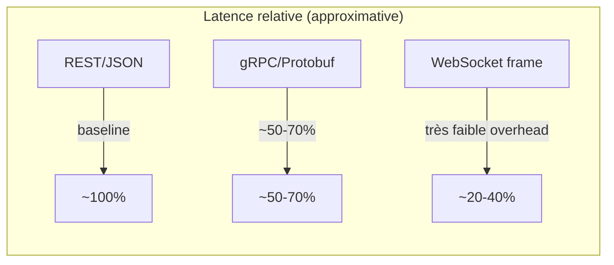
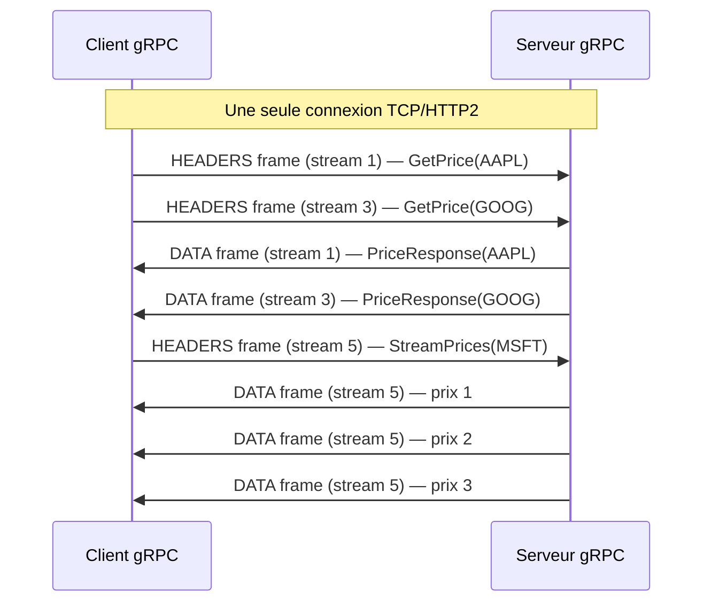
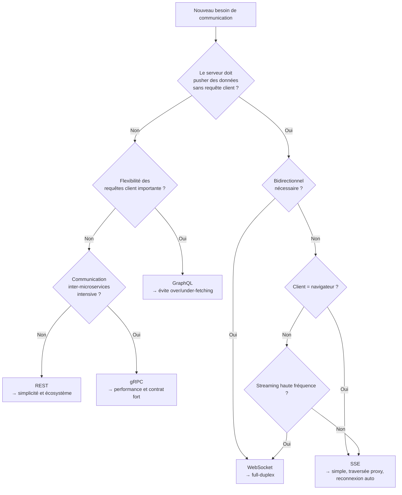

# Protocoles avancés : gRPC, WebSocket, GraphQL et Server-Sent Events

## Objectifs pédagogiques

À l'issue de ce module, vous serez capable de :

1. **Distinguer** les cas d'usage de gRPC, WebSocket, GraphQL et SSE face à REST classique
2. **Identifier** le protocole adapté selon les contraintes de latence, volume et topologie système
3. **Expliquer** les mécanismes internes de gRPC (HTTP/2 + Protobuf) et de WebSocket (handshake + full-duplex)
4. **Anticiper** les pièges d'intégration et de compatibilité en production (proxies, navigateurs, firewall)
5. **Prendre une décision** technique argumentée pour un nouveau projet ou une migration

---

## Mise en situation

Vous rejoignez une équipe qui maintient une plateforme de trading en temps réel. L'architecture actuelle repose sur du REST classique :

- Les clients web **pollingent** le prix des actifs toutes les secondes via `GET /prices`
- Les microservices internes s'appellent en REST avec des payloads JSON répétitifs
- Un service de notifications envoie des alertes via des requêtes POST depuis le serveur… vers lui-même via un webhook

Le résultat en production : 40 000 requêtes/minute pour récupérer des données qui changent à peine, une latence inter-services qui grimpe sous charge, et des alertes qui arrivent avec 3 secondes de retard.

La question n'est pas "faut-il migrer ?" — c'est **"vers quoi, pour quelle partie du système, et pourquoi ?"**. C'est exactement ce que ce module vous donne les outils pour répondre.

---

## Contexte et problématique

REST a gagné. C'est un fait : il équipe l'écrasante majorité des API publiques et internes. Mais REST est fondamentalement **request-response sur HTTP/1.1**, et ce modèle montre ses limites dans plusieurs situations précises :

- **Communication temps réel** : si le client doit savoir *immédiatement* qu'un événement s'est produit côté serveur, le polling est du gaspillage pur.
- **Microservices haute fréquence** : sérialiser et désérialiser du JSON à chaque appel entre 50 services internes, c'est de la CPU dépensée sans valeur métier.
- **Clients qui sur-fetchen** : une app mobile récupère un objet User de 40 champs pour en afficher 3. C'est du bandwidth perdu et une API qui dicte sa loi au client.
- **Streaming bidirectionnel** : un flux de données continu (audio, logs, métriques live) ne rentre pas dans le modèle "une requête, une réponse".

Ces quatre problèmes ont chacun leur réponse technique. Aucun protocole ne résout tout — et c'est précisément ce qu'il faut comprendre avant de faire un choix.

---

## Les quatre challengers de REST

### gRPC — quand la performance inter-services est non négociable

gRPC est né chez Google pour remplacer leur système interne de RPC. L'idée de base : définir les interfaces dans un fichier `.proto`, générer le code client et serveur automatiquement, et transporter les données en binaire sur HTTP/2.

Ce qui change vraiment par rapport à REST :

**Le transport.** HTTP/2 permet de multiplexer plusieurs échanges sur une seule connexion TCP. Pas de head-of-line blocking, pas de reconnexion à chaque requête. En pratique, ça se traduit par une latence réduite de 20 à 50% entre microservices sous charge.

**La sérialisation.** Protocol Buffers encode les données en binaire avec des schémas typés. Un message JSON `{"user_id": 12345, "active": true}` prend ~30 bytes. Le même message en Protobuf : ~5 bytes. Sur des millions d'appels, c'est mesurable.

**Le contrat fort.** Le fichier `.proto` est la source de vérité. Si vous changez un type de champ, le compilateur vous le dit. Pas de surprise en prod parce qu'un champ est devenu une string au lieu d'un int.

```protobuf
// Exemple de définition de service gRPC
syntax = "proto3";

service PricingService {
  rpc GetPrice (PriceRequest) returns (PriceResponse);
  rpc StreamPrices (PriceRequest) returns (stream PriceResponse);
}

message PriceRequest {
  string ticker = 1;
}

message PriceResponse {
  string ticker = 1;
  double price = 2;
  int64 timestamp_ms = 3;
}
```

💡 **Point clé** — gRPC supporte quatre modes de communication : unaire (comme REST), streaming serveur, streaming client, et streaming bidirectionnel. C'est la même technologie pour les quatre, seule la définition `.proto` change.

⚠️ **Piège classique** — gRPC ne passe pas facilement les proxies HTTP/1.1 et les load balancers classiques. Nginx supporte gRPC depuis la version 1.13.10, mais un F5 ou un proxy legacy peut simplement bloquer les frames HTTP/2. À valider en amont de toute migration.

---

### WebSocket — full-duplex, point final

WebSocket résout un problème très précis : permettre au **serveur de pousser des données** vers le client à n'importe quel moment, sans que le client ait à demander. Et réciproquement.

Le mécanisme est élégant : ça démarre comme une requête HTTP normale avec un header `Upgrade: websocket`. Si le serveur accepte, la connexion bascule en mode full-duplex — les deux parties peuvent écrire quand elles veulent, sans tour de rôle.

```
Client                         Serveur
  |                               |
  |-- GET /ws HTTP/1.1            |
  |   Upgrade: websocket          |
  |   Connection: Upgrade         |
  |   Sec-WebSocket-Key: ...  --> |
  |                               |
  |<-- HTTP/1.1 101 Switching ----|
  |    Upgrade: websocket         |
  |    Sec-WebSocket-Accept: ...  |
  |                               |
  |<======= FULL DUPLEX =========>|
  |  frames texte ou binaire      |
  |  dans les deux sens           |
```

Une fois la connexion établie, les messages circulent dans des **frames WebSocket** — beaucoup plus légères qu'une requête HTTP complète (2 à 14 bytes de header au lieu de plusieurs centaines).

C'est la technologie derrière les chats, les tableaux blancs collaboratifs, les jeux en ligne, les dashboards de trading. Chaque fois qu'un "push serveur" bidirectionnel est nécessaire, WebSocket est la réponse naturelle.

⚠️ **Comportement contre-intuitif** — WebSocket maintient une connexion **persistante**. Sur 10 000 utilisateurs connectés simultanément, vous avez 10 000 connexions TCP ouvertes sur votre serveur. Les modèles de dimensionnement classiques (requêtes/seconde) ne s'appliquent plus — c'est le nombre de connexions simultanées qui devient la contrainte.

---

### Server-Sent Events — le push simple, sans complexité

SSE est souvent oublié dans ces comparatifs, à tort. C'est une technologie HTTP standard qui permet au serveur d'envoyer un **flux de messages** vers le client sur une connexion HTTP longue. Sens unique : serveur → client uniquement.

```http
GET /events HTTP/1.1
Accept: text/event-stream

HTTP/1.1 200 OK
Content-Type: text/event-stream
Cache-Control: no-cache

data: {"price": 42.50, "ticker": "AAPL"}

data: {"price": 42.75, "ticker": "AAPL"}

event: alert
data: {"message": "Seuil dépassé"}
```

L'API côté navigateur tient en trois lignes :

```javascript
const source = new EventSource('/events');
source.onmessage = (e) => console.log(JSON.parse(e.data));
source.addEventListener('alert', (e) => showAlert(e.data));
```

Ce qui rend SSE intéressant : ça marche sur HTTP/1.1, ça traverse les proxies sans configuration particulière, et le navigateur **gère automatiquement la reconnexion** en cas de coupure. Pour les notifications, les mises à jour de statut, les logs en live — c'est souvent le bon choix, bien avant WebSocket.

🧠 **Concept fondamental** — SSE utilise le protocole HTTP standard. Il n'y a pas de handshake de surcharge, pas de nouveau protocole à négocier. Le navigateur garde la connexion ouverte et lit le flux ligne par ligne. C'est une réponse HTTP qui ne se termine jamais (jusqu'à déconnexion).

---

### GraphQL — le client reprend le contrôle

GraphQL n'est pas un protocole de transport — c'est un **langage de requête pour API**. Il fonctionne typiquement sur HTTP (souvent POST sur un seul endpoint `/graphql`), mais ce qui change fondamentalement, c'est qui décide de la forme de la réponse.

Avec REST, le serveur définit les ressources et leurs champs. Avec GraphQL, le **client spécifie exactement ce qu'il veut** :

```graphql
query {
  user(id: "42") {
    name
    email
    orders(last: 3) {
      id
      total
      status
    }
  }
}
```

Cette requête unique remplace potentiellement trois appels REST (`GET /users/42`, `GET /users/42/orders`, plus de la logique côté client pour assembler). C'est l'argument principal de GraphQL : **zéro over-fetching, zéro under-fetching**.

Le schéma GraphQL joue le rôle de contrat, comme `.proto` pour gRPC. Il documente les types disponibles et est introspectable — un client peut interroger l'API pour découvrir ce qu'elle expose.

```graphql
# Schéma côté serveur
type User {
  id: ID!
  name: String!
  email: String!
  orders: [Order!]!
}

type Order {
  id: ID!
  total: Float!
  status: OrderStatus!
}

enum OrderStatus {
  PENDING
  SHIPPED
  DELIVERED
}

type Query {
  user(id: ID!): User
  orders(status: OrderStatus): [Order!]!
}
```

💡 **Point clé** — GraphQL supporte aussi les **Subscriptions** : des requêtes qui ouvrent une connexion persistante (souvent via WebSocket) et reçoivent des mises à jour en temps réel quand les données changent. C'est GraphQL + WebSocket combinés.

⚠️ **Piège classique** — Le problème N+1. Si vous exposez une liste d'utilisateurs avec leurs commandes, GraphQL peut déclencher 1 requête pour les 100 utilisateurs + 100 requêtes individuelles pour leurs commandes. Sans DataLoader ou batching, la base de données souffre. C'est le piège le plus fréquent en production GraphQL.

---

## Comparaison de protocoles

### Vue d'ensemble

| Critère | REST | gRPC | WebSocket | SSE | GraphQL |
|---|---|---|---|---|---|
| **Transport** | HTTP/1.1 ou 2 | HTTP/2 obligatoire | TCP (via HTTP upgrade) | HTTP/1.1 ou 2 | HTTP/1.1 ou 2 |
| **Format** | JSON / XML | Protobuf (binaire) | Texte ou binaire | Texte (JSON courant) | JSON |
| **Direction** | Requête → Réponse | Unaire + streaming | Full-duplex | Serveur → Client | Requête → Réponse |
| **Contrat** | OpenAPI (optionnel) | `.proto` (obligatoire) | Non défini | Non défini | Schéma GraphQL |
| **Latence** | Moyenne | Très faible | Très faible | Faible | Moyenne |
| **Support navigateur** | Natif | Limité (grpc-web) | Natif | Natif | Natif |
| **Support proxies** | Excellent | Problématique | Moyen | Excellent | Excellent |
| **Courbe d'apprentissage** | Faible | Élevée | Moyenne | Faible | Moyenne |
| **Debugging** | Très facile | Difficile (binaire) | Moyen | Facile | Moyen |
| **Maturité** | Très haute | Haute | Haute | Haute | Haute |

### Zoom sur les performances



Les chiffres varient énormément selon le payload et l'infrastructure. Ce qui compte : gRPC brille sur des **appels fréquents avec des petits messages typés**. WebSocket brille quand la **connexion est maintenue** et que les messages sont fréquents. REST reste imbattable en **simplicité opérationnelle**.

---

## Fonctionnement détaillé — gRPC et HTTP/2

Pour comprendre pourquoi gRPC est rapide, il faut comprendre ce qu'HTTP/2 change structurellement.

HTTP/1.1 envoie une requête, attend la réponse, puis envoie la suivante — ou ouvre plusieurs connexions TCP en parallèle (avec toute la surcharge que ça implique). HTTP/2 introduit le **multiplexing** : plusieurs échanges logiques (des "streams") partagent une seule connexion TCP, indépendamment les uns des autres.



Les streams impairs sont initiés par le client, les pairs par le serveur. gRPC mappe chaque appel RPC sur un stream HTTP/2. Le résultat : pas de connexion à ouvrir pour chaque appel, pas de head-of-line blocking entre appels différents.

Le format Protobuf ajoute une couche : chaque champ est encodé avec un numéro de tag (1, 2, 3...) et une longueur, sans les noms de champs. C'est compact, c'est rapide à sérialiser, mais c'est **illisible sans le schéma `.proto`**.

---

## Prise de décision

La vraie question n'est pas "quel protocole est le meilleur ?" — c'est **"quel problème est-ce que je résous ?"**

### Arbre de décision



### Critères de décision détaillés

**Choisir gRPC si :**
- Communication interne entre microservices avec des appels fréquents (> quelques centaines/sec par service)
- Équipes polyglotes — le code client est généré automatiquement depuis le `.proto`
- Streaming de données entre services (logs, métriques, audio/vidéo)
- Vous contrôlez les deux bouts (pas d'API publique)

**Choisir WebSocket si :**
- Chat, jeux, collaboration temps réel — tout ce qui nécessite que le client *et* le serveur initient des messages
- Latence sub-seconde bidirectionnelle exigée
- Vous êtes prêt à gérer l'état des connexions persistantes côté serveur

**Choisir SSE si :**
- Notifications, flux d'événements, logs en live — push serveur uniquement
- Clients navigateurs, traversée de proxies sans configuration
- Vous voulez la simplicité de HTTP sans la complexité de WebSocket

**Choisir GraphQL si :**
- API consommée par plusieurs clients (web, mobile, partenaires) avec des besoins en données différents
- Over-fetching documenté et mesuré sur votre API actuelle
- Équipe backend prête à implémenter les résolveurs et gérer le N+1

**Rester sur REST si :**
- API publique exposée à des tiers — lisibilité et outillage comptent plus que performance
- Équipe pas familière avec les alternatives
- Contraintes d'infrastructure (proxies legacy, WAF) qui bloqueraient HTTP/2 ou WebSocket

🧠 **Concept fondamental** — Ces protocoles ne sont pas mutuellement exclusifs. La majorité des systèmes matures utilisent REST pour les CRUD publics, gRPC pour les communications inter-services internes, et WebSocket ou SSE pour le temps réel côté client. L'erreur est de choisir *un* protocole pour tout.

---

## Sécurité réseau liée

Chaque protocole ouvre ses propres vecteurs d'attaque.

**gRPC** — Le binaire Protobuf donne une fausse impression de sécurité : c'est non lisible, pas chiffré. TLS est indispensable (et activé par défaut dans la plupart des implémentations). L'authentification se fait via metadata HTTP/2 — l'équivalent des headers HTTP. Les tokens Bearer et mTLS (mutual TLS) sont les patterns standards.

**WebSocket** — La connexion persistante est une surface d'attaque pour les DoS : un attaquant peut ouvrir des milliers de connexions sans envoyer de messages. Rate limiting sur le handshake et limite de connexions simultanées par IP sont non négociables. Attention aussi au **CSRF** : le handshake WebSocket initial est une requête HTTP, soumise aux mêmes règles — vérifier l'origine (`Origin` header) est obligatoire.

**GraphQL** — La flexibilité des requêtes est aussi un vecteur. Une requête GraphQL imbriquée en profondeur peut générer des milliers de requêtes SQL (amplification). Mettre en place une **query depth limit** et une **query complexity analysis** est non négociable en prod. Désactiver l'introspection en production si l'API n'est pas publique.

**SSE** — Moins de surface d'attaque, mais attention aux connexions non authentifiées qui consomment des descripteurs de fichiers côté serveur. Limiter les connexions simultanées et exiger un token d'authentification dès le `GET /events`.

---

## Cas réel en entreprise

Revenons sur notre plateforme de trading. Voici comment une migration raisonnée pourrait se construire.

**Phase 1 — Éliminer le polling navigateur avec SSE**

Le frontend pollait `/prices` toutes les secondes pour 200 symboles. Migration vers un endpoint SSE `/stream/prices?tickers=AAPL,GOOG,MSFT` :

```python
# FastAPI — endpoint SSE
from fastapi import FastAPI
from sse_starlette.sse import EventSourceResponse
import asyncio, json

app = FastAPI()

async def price_generator(tickers: list[str]):
    while True:
        for ticker in tickers:
            price = await get_current_price(ticker)  # cache Redis
            yield {
                "event": "price",
                "data": json.dumps({"ticker": ticker, "price": price})
            }
        await asyncio.sleep(0.1)  # 10 updates/sec max

@app.get("/stream/prices")
async def stream_prices(tickers: str):
    ticker_list = tickers.split(",")
    return EventSourceResponse(price_generator(ticker_list))
```

Résultat mesuré : passage de 40 000 requêtes/minute à 200 connexions SSE persistantes. La charge serveur divisée par 8.

**Phase 2 — Migrer les appels inter-services vers gRPC**

Le service de pricing appelait le service de risk management 500 fois par seconde via REST/JSON. Migration vers gRPC avec streaming côté serveur pour les symboles les plus actifs.

Le fichier `.proto` devient le contrat entre les équipes — plus de désaccords sur le format des réponses, les champs optionnels ou les types. La latence moyenne des appels est passée de 12ms à 4ms sous charge.

**Phase 3 — WebSocket pour les alertes bidirectionnelles**

Les traders peuvent paramétrer leurs alertes en temps réel (modifier un seuil sans recharger la page). SSE ne suffit plus — le client doit aussi envoyer des données. WebSocket remplace SSE pour les connexions des traders authentifiés.

SSE reste en place pour les flux publics (cours indicatifs, indices) — pas besoin de full-duplex pour un affichage.

---

## Bonnes pratiques

Quelques règles issues de l'expérience en production, pas depuis un manuel :

**Ne migrez pas pour le prestige technique.** gRPC est impressionnant, mais si votre API fait 50 requêtes par minute, le gain de performance est imperceptible et la complexité opérationnelle est réelle. REST avec une bonne mise en cache résout 90% des problèmes.

**Versionnez les contrats, quelle que soit la technologie.** Les fichiers `.proto` gRPC, les schémas GraphQL, les formats de messages WebSocket — tous évoluent. Mettre en place une stratégie de versionnement dès le début est 10 fois moins cher que de le retrofitter.

**Loggez les messages WebSocket et SSE.** Avec REST, chaque requête laisse une trace dans les logs HTTP. Avec WebSocket, une connexion peut transporter des milliers de messages sans aucune trace par défaut. Implémenter un mécanisme de sampling (loguer 1% des messages en prod) est indispensable pour le debugging.

**Testez la reconnexion SSE en conditions réelles.** SSE se reconnecte automatiquement, mais l'état du client n'est pas restauré. Si votre frontend ne gère pas correctement le `Last-Event-ID`, des événements sont perdus silencieusement lors d'une reconnexion.

**Sur gRPC, pensez au circuit breaker.** Les streams gRPC qui restent ouverts sur un service défaillant bloquent les connexions. Deadline et timeout explicites sur chaque appel RPC sont non négociables.

**GraphQL en prod ≠ GraphQL en dev.** L'introspection est pratique pour le développement, mais exposer le schéma complet en production aide un attaquant à cartographier votre API. La désactiver (ou la protéger) en prod est une règle de base.

---

## Résumé

| Protocole | Rôle principal | Transport / Format | Points clés |
|---|---|---|---|
| **gRPC** | RPC haute performance inter-services | HTTP/2 + Protobuf | Contrat fort, streaming, binaire, non trivial à opérer |
| **WebSocket** | Communication full-duplex temps réel | TCP via HTTP upgrade | Bidirectionnel, connexions persistantes, gestion d'état nécessaire |
| **SSE** | Push serveur → client | HTTP standard | Simple, traversée proxy, reconnexion automatique, unidirectionnel |
| **GraphQL** | Flexibilité de requête côté client | HTTP + JSON | Évite over/under-fetching, schéma fort, risque N+1 |
| **REST** | CRUD, API publique, intégrations tierces | HTTP + JSON | Universalité, outillage, debugging facile |

Ces technologies coexistent. Un système mature combine REST pour les ressources publiques, gRPC entre services internes, et SSE ou WebSocket pour le temps réel côté client. La clé est de choisir selon le problème à résoudre, pas selon la tendance du moment.

La prochaine étape naturelle est d'explorer la **sécurisation avancée des API** (OAuth2, mTLS, JWT) — les protocoles de transport que vous venez de voir ont tous besoin d'une couche d'authentification solide pour fonctionner en production.

---

<!-- snippet
id: grpc_proto_service_define
type: concept
tech: gRPC
level: advanced
importance: high
format: knowledge
tags: grpc, protobuf, contrat, microservices, http2
title: gRPC — contrat Protobuf et modes de streaming
content: Un fichier .proto définit les services et messages : chaque champ a un numéro de tag entier (= sa position dans le binaire, pas son nom). gRPC supporte 4 modes : unaire (1 req → 1 resp), streaming serveur (1 req → N resp), streaming client (N req → 1 resp), bidirectionnel (N req → N resp). Le mode se déclare avec le mot-clé `stream` dans le .proto.
description: Le numéro de champ Protobuf remplace le nom de champ JSON en binaire — changer un numéro casse la compatibilité. Ne jamais réutiliser un numéro supprimé.
-->

<!-- snippet
id: grpc_http2_multiplexing
type: concept
tech: gRPC
level: advanced
importance: high
format: knowledge
tags: grpc, http2, multiplexing, performance, latence
title: HTTP/2 — multiplexing de streams sur une connexion TCP
content: HTTP/2 ouvre une seule connexion TCP et y fait circuler plusieurs "streams" simultanément, identifiés par un numéro impair (client) ou pair (serveur). gRPC mappe chaque appel RPC sur un stream. Résultat : pas de reconnexion par appel, pas de head-of-line blocking entre appels différents. Gain de latence typique : 30 à 50% sous charge par rapport à REST/HTTP1.1.
description: HTTP/2 élimine le coût de connexion TCP par appel gRPC — fondamental pour comprendre pourquoi gRPC est plus rapide que REST entre microservices.
-->

<!-- snippet
id: grpc_proxy_compat_warning
type: warning
tech: gRPC
level: advanced
importance: high
format: knowledge
tags: grpc, proxy, http2, compatibilite, production
title: gRPC ne passe pas les proxies HTTP/1.1 transparents
content: Piège : un proxy ou load balancer HTTP/1.1 legacy (F5 ancien, certains nginx non configurés) rejette silencieusement les connexions gRPC car elles requièrent HTTP/2. Nginx supporte gRPC depuis 1.13.10 avec le bloc `grpc_pass`. Conséquence en prod : erreurs intermittentes, connexions refusées, timeout sans message d'erreur explicite. Correction : vérifier la compatibilité HTTP/2 de toute l'infra réseau avant de migrer.
description: Valider le support HTTP/2 de chaque composant réseau (proxy, WAF, LB) avant de déployer gRPC — c'est le premier bloquant en production.
-->

<!-- snippet
id: websocket_handshake_upgrade
type: concept
tech: WebSocket
level: intermediate
importance: high
format: knowledge
tags: websocket, http, handshake, upgrade, full-duplex
title: WebSocket — handshake HTTP puis bascule full-duplex
content: WebSocket démarre par une requête HTTP GET avec les headers `Upgrade: websocket` et `Sec-WebSocket-Key` (valeur base64 aléatoire). Le serveur répond 101 Switching Protocols avec `Sec-WebSocket-Accept` (hash SHA-1 de la clé + GUID fixe RFC6455). Après ce handshake, la connexion TCP reste ouverte et les deux parties envoient des frames de 2 à 14 bytes de header — contre plusieurs centaines pour HTTP.
description: Après le 101, plus d'HTTP — la connexion devient un canal TCP brut avec le protocole WebSocket. Le handshake sert uniquement à valider l'intention des deux parties.
-->

<!-- snippet
id: websocket_connections_scale
type: warning
tech: WebSocket
level: advanced
importance: high
format: knowledge
tags: websocket, scalabilite, connexions, memoire, production
title: WebSocket — 10 000 users = 10 000 connexions TCP ouvertes
content: Piège de dimensionnement : avec WebSocket, le nombre de connexions simultanées remplace les requêtes/seconde comme métrique de charge. 10 000 utilisateurs = 10 000 file descriptors ouverts côté serveur en
