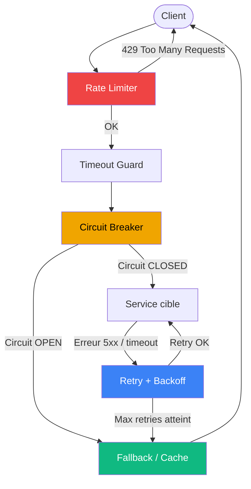
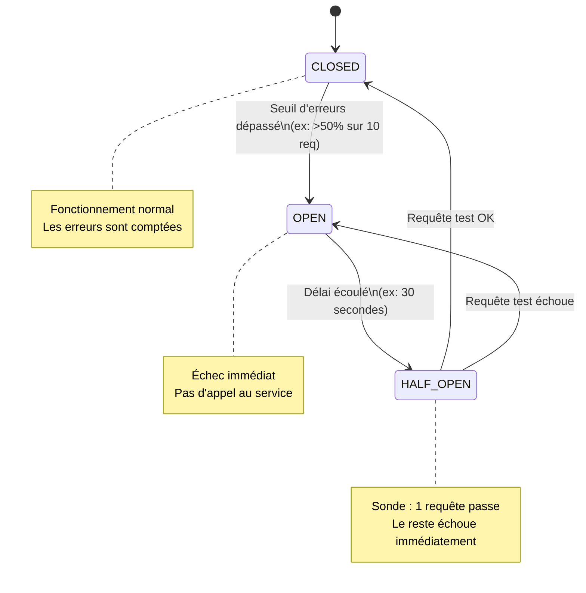

# Résilience & fiabilité des API en production

## Objectifs pédagogiques

À l'issue de ce module, vous serez capable de :

1. **Identifier** les points de défaillance structurels d'une architecture API distribuée
2. **Implémenter** les patterns de résilience fondamentaux : timeout, retry, circuit breaker, bulkhead
3. **Concevoir** une stratégie de retry idempotente qui ne crée pas de données fantômes
4. **Calibrer** les seuils de rate limiting et de backoff selon les contraintes de votre système
5. **Lire et interpréter** les signaux d'alerte (latence, taux d'erreur, saturation) avant qu'une panne se déclare

---

## Mise en situation

Vous gérez l'API d'une plateforme e-commerce. Tout fonctionne bien en dev, en staging, même en prod les premiers mois. Puis, un vendredi soir, la base de données d'un partenaire de paiement commence à répondre en 8 secondes au lieu de 200 ms. Votre API REST attend patiemment, les threads s'accumulent, le pool de connexions sature — et au bout de deux minutes, votre propre API est en 503, même pour des endpoints qui n'ont rien à voir avec le paiement.

C'est ce qu'on appelle une **défaillance en cascade** : un service lent en aval a tué un service sain en amont. Et pourtant, chaque composant pris individuellement était "correct".

La résilience ne consiste pas à rendre un service parfait. Ça n't arrive pas. Il s'agit de faire en sorte que **quand quelque chose casse — et ça cassera — les dommages restent localisés, prévisibles et récupérables**.

---

## Contexte et problématique

Dans un système monolithique, la fiabilité est simple à raisonner : si le processus tourne, l'app fonctionne. Dans une architecture à base d'API, chaque appel HTTP est un risque : timeout réseau, lenteur du service distant, rate limit dépassé, réponse malformée, redémarrage en cours.

Ce qui change avec la scale :

- Un service appelé 1 000 fois/sec avec 0,1 % d'erreur = 1 erreur par seconde. Anecdotique.
- Le même service avec 5 % d'erreur en cascade sur 4 dépendances = effet multiplicateur catastrophique.
- Un timeout de 30 secondes × 50 connexions simultanées = 1 500 secondes de threads bloqués.

La résilience se construit **en amont**, pas pendant l'incident. Ce module couvre les patterns qui font la différence entre un système qui tombe et un système qui dégrade gracieusement.

---

## Les patterns fondamentaux — comment ils s'assemblent

Avant de plonger dans chaque mécanisme, voici comment ils interagissent dans une chaîne d'appels typique :



Chaque couche a une responsabilité distincte. On ne les empile pas au hasard — l'ordre et le calibrage comptent.

---

## Timeout — la première ligne de défense

Le timeout est le mécanisme le plus simple et le plus souvent mal configuré. L'idée est triviale : si le service ne répond pas dans un délai raisonnable, on abandonne. Ce qui est moins trivial, c'est de choisir ce délai et de distinguer les types de timeout.

**Connection timeout vs Read timeout** — ce n'est pas la même chose :

| Type | Ce qu'il mesure | Valeur typique |
|------|----------------|----------------|
| Connection timeout | Temps pour établir la connexion TCP | 1–3 secondes |
| Read timeout | Temps pour recevoir la première réponse | 5–30 secondes selon l'opération |
| Total timeout | Durée maximale globale de la requête | à définir selon le SLA client |

🧠 **Concept clé** — Si vous ne configurez qu'un seul timeout, configurez le read timeout. Une connexion TCP qui ne s'établit pas échoue vite (quelques secondes). Un service qui accepte la connexion mais ne répond jamais peut bloquer un thread indéfiniment.

En Python avec `requests` :

```python
import requests

response = requests.get(
    "https://api.partenaire.com/paiement/status",
    timeout=(2, 10)  # (connection_timeout, read_timeout) en secondes
)
```

En Java avec `HttpClient` (Java 11+) :

```java
HttpClient client = HttpClient.newBuilder()
    .connectTimeout(Duration.ofSeconds(2))
    .build();

HttpRequest request = HttpRequest.newBuilder()
    .uri(URI.create("https://api.partenaire.com/paiement/status"))
    .timeout(Duration.ofSeconds(10))
    .GET()
    .build();
```

⚠️ **Erreur fréquente** — Configurer un timeout côté client ne signifie pas que le traitement s'arrête côté serveur. Si vous abandonnez après 5 secondes mais que le serveur continue à traiter pendant 25 secondes, vous avez potentiellement déclenché une mutation (écriture en base, envoi d'email) sans recevoir la réponse. C'est précisément là qu'intervient l'idempotence — on y revient.

---

## Retry et backoff — réessayer intelligemment

Réessayer une requête en échec est naturel. Le faire bêtement est dangereux. Si 500 clients reçoivent un 503 et réessaient immédiatement tous en même temps, vous venez d'amplifier la charge au pire moment — c'est le **thundering herd problem**.

La solution : le **backoff exponentiel avec jitter**.

### Le principe

Au lieu de réessayer immédiatement, on attend de plus en plus longtemps entre chaque tentative, avec une dose d'aléatoire pour étaler la charge :

```
attente = min(cap, base * 2^tentative) + random(0, jitter)
```

Concrètement :

```
Tentative 1 → attente ~1s
Tentative 2 → attente ~2s + bruit
Tentative 3 → attente ~4s + bruit
Tentative 4 → attente ~8s + bruit
→ abandon
```

En Python, avec la librairie `tenacity` :

```python
from tenacity import retry, stop_after_attempt, wait_exponential, retry_if_exception_type
import requests

@retry(
    stop=stop_after_attempt(4),
    wait=wait_exponential(multiplier=1, min=1, max=30),
    retry=retry_if_exception_type(requests.exceptions.ConnectionError)
)
def appeler_service_paiement(order_id: str):
    response = requests.post(
        "https://api.paiement.com/charge",
        json={"order_id": order_id, "amount": 4999},
        timeout=(2, 10)
    )
    response.raise_for_status()
    return response.json()
```

### Sur quoi réessayer — et sur quoi ne pas le faire

C'est la décision critique. **Ne pas réessayer sur n'importe quelle erreur** :

| Code HTTP | Retry ? | Pourquoi |
|-----------|---------|----------|
| 429 Too Many Requests | ✅ Oui (avec délai Retry-After) | Temporaire, côté quota |
| 500 Internal Server Error | ✅ Oui (prudemment) | Peut être transitoire |
| 502 / 503 / 504 | ✅ Oui | Service temporairement indisponible |
| 400 Bad Request | ❌ Non | Requête invalide → réessayer ne changera rien |
| 401 / 403 | ❌ Non | Problème d'authentification / autorisation |
| 404 | ❌ Non | La ressource n'existe pas |

💡 **Astuce** — Si l'API cible renvoie un header `Retry-After` dans sa réponse 429 ou 503, utilisez-le plutôt que votre propre délai. C'est l'API qui vous dit quand elle sera prête.

---

## Idempotence — la condition pour que le retry soit sûr

On ne peut réessayer sans risque qu'à une condition : l'opération doit être **idempotente**. C'est-à-dire que l'exécuter une ou dix fois produit le même résultat observable.

`GET /orders/42` est idempotent par nature. `POST /orders` qui crée une commande ne l'est pas — chaque appel crée une nouvelle ressource.

### La solution : la clé d'idempotence

Le client génère un identifiant unique pour chaque opération et l'envoie dans un header. Côté serveur, si la même clé est reçue deux fois, la deuxième requête renvoie le résultat de la première sans réexécuter le traitement.

```http
POST /payments HTTP/1.1
Host: api.paiement.com
Authorization: Bearer eyJhbGci...
Idempotency-Key: 7f3d2a91-4c8e-4b1a-9f2e-3a5b6c7d8e9f
Content-Type: application/json

{
  "order_id": "ord_abc123",
  "amount": 4999,
  "currency": "EUR"
}
```

Côté serveur, le pattern de stockage de la clé :

```python
import uuid
import redis
import json

redis_client = redis.Redis()

def traiter_paiement(idempotency_key: str, payload: dict) -> dict:
    cache_key = f"idempotency:{idempotency_key}"

    # Vérifie si on a déjà traité cette requête
    cached = redis_client.get(cache_key)
    if cached:
        return json.loads(cached)

    # Traitement réel
    result = effectuer_paiement(payload)

    # Stocke le résultat pendant 24h
    redis_client.setex(cache_key, 86400, json.dumps(result))
    return result
```

🧠 **Concept clé** — La clé d'idempotence doit être générée par le **client**, pas le serveur. C'est le client qui sait si une requête est un retry ou une nouvelle opération. UUID v4 est le format standard. Stripe, Adyen, Braintree utilisent tous ce mécanisme — et ce n'est pas un hasard, c'est le secteur où un double débit est catastrophique.

---

## Circuit Breaker — savoir quand arrêter d'essayer

Le retry avec backoff fonctionne bien pour les pannes courtes et aléatoires. Mais si un service est **vraiment en panne pour plusieurs minutes**, continuer à réessayer est contre-productif : ça consomme des ressources, ça augmente la latence perçue par le client, et ça n'apporte rien.

Le circuit breaker s'inspire des fusibles électriques : quand trop d'erreurs se produisent, on coupe le circuit. Les appels échouent immédiatement sans même tenter de contacter le service distant. Après un délai, on laisse passer quelques requêtes test — si elles réussissent, le circuit se referme.



### Implémentation avec `pybreaker`

```python
import pybreaker
import requests

# Circuit s'ouvre après 5 échecs consécutifs
# Retente après 30 secondes
breaker = pybreaker.CircuitBreaker(fail_max=5, reset_timeout=30)

@breaker
def appeler_service_stock(product_id: str) -> dict:
    response = requests.get(
        f"https://api.stock.interne/products/{product_id}",
        timeout=(2, 5)
    )
    response.raise_for_status()
    return response.json()

def get_product_with_fallback(product_id: str) -> dict:
    try:
        return appeler_service_stock(product_id)
    except pybreaker.CircuitBreakerError:
        # Circuit ouvert → fallback immédiat
        return {"product_id": product_id, "stock": None, "source": "cache_dégradé"}
    except Exception:
        return {"product_id": product_id, "stock": None, "source": "erreur"}
```

💡 **Astuce** — Le circuit breaker doit être **par service cible**, pas global. Si le service de stock tombe, le circuit breaker du service de paiement ne doit pas être affecté. Un circuit par dépendance externe est la règle.

---

## Rate Limiting — protéger son API et respecter celles des autres

Le rate limiting a deux faces : celle que vous subissez (les API tierces qui vous limitent) et celle que vous imposez (protéger votre propre API).

### Côté consommateur — interpréter les réponses 429

Une bonne API envoie des headers informatifs dans sa réponse 429 :

```http
HTTP/1.1 429 Too Many Requests
Retry-After: 47
X-RateLimit-Limit: 1000
X-RateLimit-Remaining: 0
X-RateLimit-Reset: 1704067200
Content-Type: application/json

{
  "error": "rate_limit_exceeded",
  "message": "Quota horaire atteint. Réessayez dans 47 secondes."
}
```

Votre client doit lire `Retry-After` et attendre exactement ce délai :

```python
def requete_avec_rate_limit(url: str, **kwargs) -> requests.Response:
    response = requests.get(url, **kwargs)

    if response.status_code == 429:
        retry_after = int(response.headers.get("Retry-After", 60))
        print(f"Rate limit atteint. Attente de {retry_after}s...")
        time.sleep(retry_after)
        return requete_avec_rate_limit(url, **kwargs)  # un seul retry ici

    return response
```

### Côté producteur — les algorithmes de rate limiting

Quatre algorithmes existent, avec des comportements très différents :

| Algorithme | Comportement | Cas d'usage |
|-----------|-------------|-------------|
| **Fixed window** | Compteur réinitialisé à heure fixe | Simple, mais permet des bursts aux jonctions de fenêtres |
| **Sliding window** | Fenêtre mobile, lissage réel | Plus précis, un peu plus coûteux |
| **Token bucket** | Jetons reconstitués en continu | Autorise les bursts courts, idéal pour APIs publiques |
| **Leaky bucket** | Débit de sortie constant | Lissage strict, bon pour protéger un backend fragile |

Pour une API REST en production, **token bucket** est le choix le plus courant — il tolère les pics courts légitimes (une campagne marketing qui génère un burst de 5 secondes) sans pénaliser l'utilisateur.

Avec Redis comme backend (implémentation token bucket simplifiée) :

```python
import redis
import time

r = redis.Redis()

def check_rate_limit(client_id: str, max_tokens: int = 100, refill_rate: float = 10.0) -> bool:
    """
    Retourne True si la requête est autorisée, False sinon.
    max_tokens : capacité maximale du bucket
    refill_rate : jetons ajoutés par seconde
    """
    key = f"ratelimit:{client_id}"
    now = time.time()

    pipe = r.pipeline()
    pipe.hgetall(key)
    result = pipe.execute()[0]

    tokens = float(result.get(b"tokens", max_tokens))
    last_refill = float(result.get(b"last_refill", now))

    # Reconstitution des jetons depuis la dernière requête
    elapsed = now - last_refill
    tokens = min(max_tokens, tokens + elapsed * refill_rate)

    if tokens < 1:
        return False  # Bucket vide

    # Consomme un jeton
    r.hset(key, mapping={"tokens": tokens - 1, "last_refill": now})
    r.expire(key, 3600)
    return True
```

---

## Bulkhead — isoler pour éviter la contamination

L'image vient des cloisons étanches d'un navire : si une section est inondée, les autres restent sèches. En architecture API, le bulkhead consiste à isoler les ressources (threads, connexions, pools) par service ou par type d'opération.

Sans bulkhead, un service lent peut monopoliser tout le pool de threads et bloquer des opérations critiques :

```
Pool de 50 threads
→ 48 threads bloqués en attente du service de recommandations (lent)
→ 2 threads restants pour toute l'API, y compris le paiement
→ Timeout côté client sur le paiement → perte de revenus
```

Avec bulkhead, chaque service cible a son propre pool :

```python
from concurrent.futures import ThreadPoolExecutor

# Pools séparés par service
pool_paiement = ThreadPoolExecutor(max_workers=20, thread_name_prefix="paiement")
pool_recommandations = ThreadPoolExecutor(max_workers=10, thread_name_prefix="reco")
pool_stock = ThreadPoolExecutor(max_workers=15, thread_name_prefix="stock")

def get_recommandations(user_id: str):
    # Même si ce pool sature, les autres ne sont pas affectés
    future = pool_recommandations.submit(appeler_service_reco, user_id)
    try:
        return future.result(timeout=3)
    except TimeoutError:
        return []  # Fallback gracieux
```

---

## Fallback et dégradation gracieuse

Un bon système résilient ne renvoie pas seulement des erreurs — il répond quelque chose d'utile, même en mode dégradé. La dégradation gracieuse, c'est l'art de définir **quelle fonctionnalité peut être sacrifiée sans casser l'expérience core**.

Exemple concret — une API de page produit e-commerce :

```python
async def construire_page_produit(product_id: str) -> dict:
    # Données critiques — si ça échoue, on renvoie une erreur
    produit = await get_produit(product_id)  # Pas de fallback ici

    # Données enrichissantes — fallback acceptable
    try:
        stock = await get_stock(product_id)
    except Exception:
        stock = {"disponible": None, "message": "Information stock temporairement indisponible"}

    try:
        avis = await get_avis(product_id)
    except Exception:
        avis = []  # Page sans avis vaut mieux qu'une page en erreur

    try:
        recommandations = await get_recommandations(product_id)
    except Exception:
        recommandations = []

    return {
        "produit": produit,
        "stock": stock,
        "avis": avis,
        "recommandations": recommandations
    }
```

⚠️ **Erreur fréquente** — Renvoyer du cache périmé sans l'indiquer. Si vous servez un prix ou un stock depuis un cache de 2 heures parce que le service est down, **dites-le** dans la réponse. Sinon l'utilisateur commande sur la base d'une information fausse — c'est pire qu'une erreur franche.

---

## Construction progressive — de l'API fragile à l'API résiliente

### V1 — L'API naïve (ce que tout le monde commence par faire)

```python
@app.route("/products/<product_id>")
def get_product(product_id):
    # Pas de timeout, pas de retry, pas de circuit breaker
    response = requests.get(f"https://api.stock.com/products/{product_id}")
    stock = response.json()
    return jsonify(stock)
```

Un seul service lent → 503 en cascade. Aucune visibilité sur ce qui se passe.

### V2 — Timeout et gestion d'erreur basique

```python
@app.route("/products/<product_id>")
def get_product(product_id):
    try:
        response = requests.get(
            f"https://api.stock.com/products/{product_id}",
            timeout=(2, 8)
        )
        response.raise_for_status()
        return jsonify(response.json())
    except requests.exceptions.Timeout:
        return jsonify({"error": "service_timeout", "message": "Réessayez dans quelques instants"}), 503
    except requests.exceptions.HTTPError as e:
        return jsonify({"error": "upstream_error", "code": e.response.status_code}), 502
```

Mieux. Mais toujours pas de circuit breaker ni de fallback — on tape le service même quand on sait qu'il est mort.

### V3 — Production-ready

```python
from pybreaker import CircuitBreaker, CircuitBreakerError
from tenacity import retry, stop_after_attempt, wait_exponential

stock_breaker = CircuitBreaker(fail_max=5, reset_timeout=30)

@retry(stop=stop_after_attempt(3), wait=wait_exponential(min=1, max=8))
@stock_breaker
def _fetch_stock(product_id: str) -> dict:
    response = requests.get(
        f"https://api.stock.com/products/{product_id}",
        timeout=(2, 8)
    )
    response.raise_for_status()
    return response.json()

@app.route("/products/<product_id>")
def get_product(product_id):
    try:
        stock_data = _fetch_stock(product_id)
        return jsonify(stock_data)
    except CircuitBreakerError:
        # Circuit ouvert → fallback immédiat, pas d'attente
        return jsonify({
            "product_id": product_id,
            "stock": None,
            "degraded": True,
            "message": "Données de stock temporairement indisponibles"
        }), 200  # 200 délibéré — la page reste utilisable
    except Exception as e:
        app.logger.error(f"Échec définitif pour {product_id}: {e}")
        return jsonify({"error": "service_unavailable"}), 503
```

Le saut entre V2 et V3 : on a arrêté de traiter chaque appel comme isolé. Maintenant, l'état du service cible influence le comportement de l'appelant.

---

## Observabilité — voir venir la panne avant qu'elle arrive

La résilience sans observabilité, c'est conduire sans tableau de bord. Vous implémentez des circuit breakers, des retries — mais comment savez-vous s'ils s'activent ? Si vos timeouts sont bien calibrés ?

Les trois signaux à instrumenter systématiquement :

**1. Latence par percentile** (pas juste la moyenne)

```python
from prometheus_client import Histogram
import time

api_latency = Histogram(
    "api_call_duration_seconds",
    "Durée des appels API externes",
    ["service", "endpoint", "status"],
    buckets=[0.1, 0.25, 0.5, 1.0, 2.5, 5.0, 10.0]
)

def appeler_avec_metriques(service: str, url: str) -> requests.Response:
    start = time.time()
    status = "success"
    try:
        response = requests.get(url, timeout=(2, 10))
        if response.status_code >= 400:
            status = f"http_{response.status_code}"
        return response
    except requests.exceptions.Timeout:
        status = "timeout"
        raise
    except Exception:
        status = "error"
        raise
    finally:
        duration = time.time() - start
        api_latency.labels(service=service, endpoint=url, status=status).observe(duration)
```

**2. Taux d'activation du circuit breaker**

Si votre circuit breaker s'ouvre 10 fois par heure, vous avez un problème structurel — pas un incident ponctuel.

**3. Taux de retry**

Un retry rate élevé peut indiquer deux choses très différentes : le service est instable, ou vos timeouts sont trop agressifs. Sans la métrique, impossible de distinguer.

💡 **Astuce** — Pour le monitoring des API tierces, tracez séparément les tentatives initiales et les retries dans vos métriques. Un dashboard qui ne voit que les appels réussis masque tout ce que votre système a dû faire pour y arriver.

---

## Cas réel en entreprise

**Contexte** : équipe backend d'une startup SaaS B2B, API d'intégration avec 12 fournisseurs de données externes. 3 ingénieurs backend, 80k appels/jour vers des API tierces.

**Problème initial** : chaque mois ou deux, un fournisseur devient lent ou instable. L'équipe reçoit des alertes client avant même de savoir qu'il y a un problème. Résolution manuelle, intervention de nuit, temps de réponse dégradé perçu en prod pendant 20 à 45 minutes.

**Ce qui a été mis en place** :

1. **Timeout standardisés** — toutes les intégrations ont été auditées. 4 d'entre elles n'avaient aucun timeout configuré. Timeout (2s, 15s) appliqué partout.
2. **Circuit breaker par fournisseur** — seuil à 40 % d'erreurs sur 20 requêtes, reset à 60 secondes.
3. **Cache Redis avec TTL court** — les données les moins volatiles (référentiels, catalogues) sont cachées 5 minutes. En cas de circuit ouvert, on sert le cache périmé avec un flag `degraded: true`.
4. **Alertes sur le taux d'ouverture de circuit** — PagerDuty si un circuit s'ouvre plus de 3 fois en 10 minutes.

**Résultats après 3 mois** :

- Incidents visibles client : de 6 à 1 sur la période (un seul fournisseur vraiment down, non rattrapable par le cache)
- MTTR (temps de résolution) : de 35 minutes à 8 minutes en moyenne (l'alerte arrive avant les clients)
- Zéro intervention de nuit sur la période

---

## Bonnes pratiques

**1. Calibrez vos timeouts sur des mesures réelles, pas des intuitions.** Logguez les percentiles p95 et p99 de vos appels sortants pendant deux semaines. Votre timeout doit être au-dessus du p99 habituel, mais en dessous de ce qui impacte l'expérience client.

**2. Ne réessayez pas les erreurs non-retriables.** Un 400 ou un 401 réessayé en boucle est une perte de ressources et peut bloquer votre quota de rate limiting pour des vraies requêtes.

**3. Générez les clés d'idempotence côté client avant l'envoi.** Pas après la réponse, pas côté serveur — avant. Si la connexion coupe pendant la requête, vous devez pouvoir réutiliser la même clé pour le retry.

**4. Un circuit breaker par dépendance, pas un seul global.** Un circuit global signifie que la panne d'un service de recommandations non-critique peut couper vos paiements.

**5. Définissez votre stratégie de dégradation par feature, pas par service.** La question n'est pas "que faire si le service X tombe ?" mais "quelle fonctionnalité peut être dégradée sans impacter le parcours critique ?"

**6. Instrumentez l'état de vos circuit breakers en production.** Un circuit qui s'ouvre sans que personne le sache n'est pas de la résilience — c'est une défaillance silencieuse.

**7. Testez vos fallbacks régulièrement.** Un fallback non testé est un fallback qui ne fonctionnera pas le jour où vous en avez besoin. Chaos engineering léger : coupez un service en staging et vérifiez que le comportement dégradé est celui que
