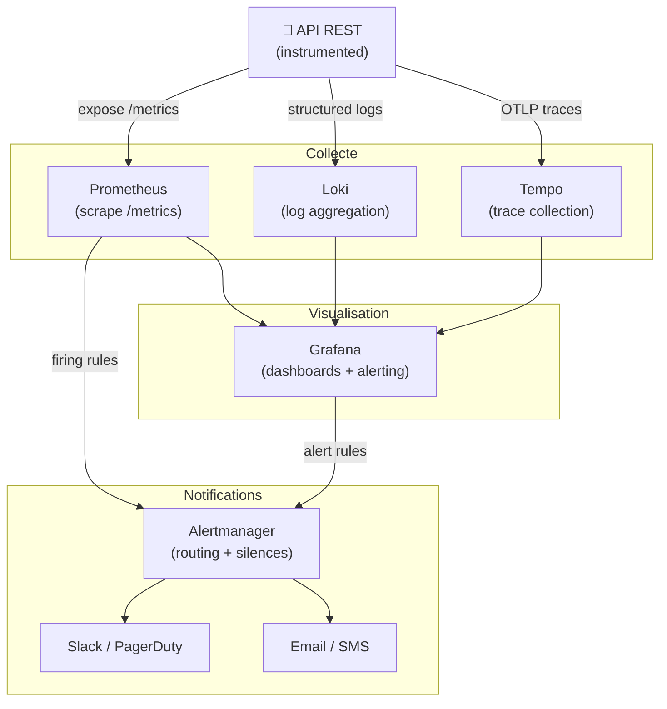

# Monitoring & Alerting pour les API REST

## Objectifs pédagogiques

À la fin de ce module, vous serez capable de :

- Concevoir un système d'observabilité complet pour une API REST en production (métriques, logs, traces)
- Définir des SLIs et SLOs pertinents et les instrumenter dans votre code
- Configurer des alertes actionnables qui réveillent les bonnes personnes pour les bonnes raisons
- Identifier les antipatterns d'alerte (alert fatigue, alertes trop larges, absence de runbook)
- Lire un dashboard Grafana et diagnostiquer une dégradation de service en moins de 5 minutes

---

## Mise en situation

Votre équipe vient de déployer la v2 de votre API de paiement. Trois semaines plus tard, un client signale que ses transactions échouent depuis "un moment". Vous ouvrez les logs — 500 Mo de fichiers bruts non indexés. Vous regardez votre dashboard — il n'y en a pas. Vous estimez l'impact à 4 heures de panne partielle. La direction veut un rapport.

C'est le scénario classique qui transforme une équipe de 5 développeurs en équipe qui investit 2 sprints dans l'observabilité. Le problème n'est pas l'absence d'outils — Prometheus, Grafana, Datadog, OpenTelemetry, tout ça existe et s'installe en 20 minutes. Le problème est de savoir **quoi mesurer**, **comment seuiller**, et **à qui envoyer quoi** quand quelque chose cloche.

Ce module suppose que vous avez une API en production (ou en pré-prod) et que vous voulez la rendre observable de manière sérieuse — pas juste cocher une case.

---

## Contexte et problématique

### Pourquoi les logs seuls ne suffisent pas

Un log dit ce qui s'est passé. Il ne dit pas à quelle fréquence, à quelle vitesse, ni si c'est pire qu'hier. Pour ça, il faut des **métriques**. Et pour comprendre *pourquoi* quelque chose s'est passé dans une architecture distribuée, il faut du **tracing**.

C'est ce que le secteur appelle les **trois piliers de l'observabilité** :

| Pilier | Ce qu'il capture | Outil typique |
|--------|-----------------|---------------|
| **Métriques** | Tendances numériques dans le temps (taux d'erreur, latence, saturation) | Prometheus, Datadog, CloudWatch |
| **Logs** | Événements discrets avec contexte (stacktrace, user ID, request ID) | Loki, ELK, CloudWatch Logs |
| **Traces** | Chemin complet d'une requête à travers les services | Jaeger, Tempo, Datadog APM |

Ces trois piliers sont complémentaires, pas interchangeables. Une alerte se déclenche sur une métrique. Pour comprendre pourquoi, on lit les logs. Pour comprendre quel service a introduit la latence, on ouvre une trace.

### Le problème des alertes en pratique

La plupart des équipes font deux erreurs opposées :

- **Trop d'alertes** : chaque exception levée envoie un email. Au bout de 3 jours, tout le monde a configuré un filtre Gmail et l'alerte qui compte est noyée dans 200 autres.
- **Pas assez d'alertes** : on alerte uniquement sur "le serveur est down". Résultat, une dégradation à 40% d'erreurs 5xx dure 2 heures avant qu'un utilisateur appelle.

La bonne approche tient en une phrase : **une alerte doit réveiller quelqu'un parce qu'une action humaine est nécessaire, pas parce qu'un seuil a été dépassé**.

---

## Architecture d'un système d'observabilité pour une API

Avant d'écrire du code ou de la config, voyons comment les composants s'articulent.



**Ce qui est important dans ce schéma** : Grafana n'est pas juste un outil de visualisation. Dans les stacks modernes (Grafana 9+), il devient aussi le point central de définition des alertes, avec Alertmanager qui gère le routage et la déduplication. Prometheus reste la source de vérité des métriques — il scrape votre API sur l'endpoint `/metrics` et stocke les séries temporelles.

### Les composants en détail

| Composant | Rôle | Ce qu'il ne fait PAS |
|-----------|------|----------------------|
| **Prometheus** | Collecte et stocke les métriques par scraping | Alerter directement (délègue à Alertmanager) |
| **Alertmanager** | Route, regroupe, silence et notifie les alertes | Évaluer les règles d'alerte (c'est Prometheus) |
| **Grafana** | Visualise toutes les sources, définit les alertes | Stocker les données |
| **Loki** | Agrège les logs sans les indexer entièrement | Remplacer un vrai ELK pour de la recherche complexe |
| **OpenTelemetry Collector** | Collecte traces/métriques/logs et les route | Il est lui-même une source de données |

---

## Instrumenter une API — Les métriques qui comptent vraiment

### Les quatre signaux dorés (Google SRE)

Google a popularisé le concept des **Four Golden Signals** dans son livre SRE. Pour une API REST, ce sont les quatre métriques à mesurer en priorité absolue :

1. **Latency** — Temps de réponse des requêtes (distinguer succès et erreurs)
2. **Traffic** — Volume de requêtes par seconde
3. **Errors** — Taux de requêtes qui échouent (4xx clients, 5xx serveur)
4. **Saturation** — À quel point votre service est proche de sa limite (CPU, mémoire, connexions DB)

> 🧠 **Concept clé** — La latence des erreurs doit être mesurée séparément de la latence des succès. Une requête qui échoue en 2ms (fail-fast sur auth) tire la moyenne vers le bas et masque une dégradation réelle sur les requêtes qui aboutissent.

### Instrumenter avec Prometheus en Python (FastAPI)

```python
from prometheus_client import Counter, Histogram, Gauge, start_http_server
from functools import wraps
import time

# Compteur de requêtes par méthode, endpoint et status code
REQUEST_COUNT = Counter(
    'api_requests_total',
    'Total HTTP requests',
    ['method', 'endpoint', 'http_status']
)

# Histogramme de latence — les buckets sont cruciaux
REQUEST_LATENCY = Histogram(
    'api_request_duration_seconds',
    'HTTP request latency',
    ['method', 'endpoint'],
    buckets=[0.01, 0.025, 0.05, 0.1, 0.25, 0.5, 1.0, 2.5, 5.0]
)

# Gauge pour les ressources
DB_CONNECTIONS = Gauge(
    'api_db_connections_active',
    'Active database connections'
)
```

> 💡 **Astuce** — Les buckets de l'histogramme doivent couvrir votre SLO. Si votre SLO est "95% des requêtes sous 500ms", assurez-vous d'avoir un bucket à 0.5. Sinon vous ne pouvez pas calculer le percentile précisément.

Avec FastAPI, le plus propre est un middleware :

```python
from starlette.middleware.base import BaseHTTPMiddleware
from starlette.requests import Request
import time

class MetricsMiddleware(BaseHTTPMiddleware):
    async def dispatch(self, request: Request, call_next):
        start = time.time()
        
        response = await call_next(request)
        
        duration = time.time() - start
        endpoint = request.url.path
        
        REQUEST_COUNT.labels(
            method=request.method,
            endpoint=endpoint,
            http_status=response.status_code
        ).inc()
        
        REQUEST_LATENCY.labels(
            method=request.method,
            endpoint=endpoint
        ).observe(duration)
        
        return response

# Dans main.py
app.add_middleware(MetricsMiddleware)

# Exposer l'endpoint /metrics
from prometheus_client import make_asgi_app
metrics_app = make_asgi_app()
app.mount("/metrics", metrics_app)
```

⚠️ **Erreur fréquente** — Ne pas mettre les paramètres dynamiques dans les labels Prometheus. Si vous faites `endpoint="/users/42"` et `endpoint="/users/99"`, vous créez une nouvelle série temporelle par user ID. Prometheus peut exploser en mémoire. Normalisez : `/users/{id}`.

### Instrumenter en Node.js (Express)

```javascript
const promClient = require('prom-client');
const register = new promClient.Registry();

// Collecte automatique des métriques Node.js (event loop lag, heap, etc.)
promClient.collectDefaultMetrics({ register });

const httpRequestDuration = new promClient.Histogram({
  name: 'api_request_duration_seconds',
  help: 'Duration of HTTP requests in seconds',
  labelNames: ['method', 'route', 'status_code'],
  buckets: [0.01, 0.025, 0.05, 0.1, 0.25, 0.5, 1, 2.5],
  registers: [register]
});

// Middleware Express
app.use((req, res, next) => {
  const end = httpRequestDuration.startTimer();
  
  res.on('finish', () => {
    end({
      method: req.method,
      route: req.route?.path || req.path,  // normalisé
      status_code: res.statusCode
    });
  });
  
  next();
});

// Endpoint /metrics
app.get('/metrics', async (req, res) => {
  res.set('Content-Type', register.contentType);
  res.end(await register.metrics());
});
```

---

## Définir des SLIs, SLOs et Error Budgets

C'est la partie que la plupart des équipes skippent — et c'est exactement là que les alertes bien calibrées prennent leur sens.

### La hiérarchie SLA → SLO → SLI

- **SLA** (Service Level Agreement) : engagement contractuel avec le client. "99.9% de disponibilité par mois, sinon crédit."
- **SLO** (Service Level Objective) : objectif interne, plus strict. "Nous visons 99.95% pour avoir de la marge sur le SLA."
- **SLI** (Service Level Indicator) : la métrique concrète qu'on mesure pour évaluer le SLO.

Pour une API de paiement typique :

| SLI | Expression | SLO cible |
|-----|-----------|-----------|
| Disponibilité | `requêtes 2xx / total requêtes` | ≥ 99.9% sur 30 jours |
| Latence | `% requêtes < 500ms` | ≥ 95% sur 1 heure |
| Taux d'erreur | `requêtes 5xx / total` | ≤ 0.1% sur 5 minutes |

### L'Error Budget — ou pourquoi les SLOs changent tout

Si votre SLO est 99.9% de disponibilité sur 30 jours, cela représente **43.2 minutes** d'indisponibilité tolérée par mois. C'est votre **error budget**.

Quand ce budget est consommé à 80%, votre équipe devrait arrêter les déploiements risqués et se concentrer sur la fiabilité. Quand il est intact, vous avez de la latitude pour déployer vite. C'est un mécanisme de décision, pas juste une métrique.

```promql
# Calcul du taux de disponibilité sur les dernières 24h
# (dans Prometheus Query Language)

# SLI : ratio de requêtes "bonnes" (non-5xx)
(
  sum(rate(api_requests_total{http_status!~"5.."}[24h]))
  /
  sum(rate(api_requests_total[24h]))
) * 100

# Error budget restant (pour un SLO à 99.9%, fenêtre 30j)
(
  1 - (
    sum(increase(api_requests_total{http_status=~"5.."}[30d]))
    /
    sum(increase(api_requests_total[30d]))
  )
) / (1 - 0.999) * 100
```

---

## Construction progressive d'un système d'alerting

### V1 — Alertes de base (symptômes, pas causes)

La règle d'or de l'alerting SRE : **alerter sur les symptômes côté utilisateur, pas sur les causes internes**. Alerter sur le taux d'erreur vu par le client, pas sur "le CPU est à 80%".

```yaml
# prometheus/rules/api_alerts.yml
groups:
  - name: api_slo
    interval: 30s
    rules:
    
      # Taux d'erreur 5xx > 1% sur 5 minutes → utilisateurs impactés
      - alert: APIHighErrorRate
        expr: |
          (
            sum(rate(api_requests_total{http_status=~"5.."}[5m]))
            /
            sum(rate(api_requests_total[5m]))
          ) > 0.01
        for: 2m
        labels:
          severity: warning
          team: backend
        annotations:
          summary: "Taux d'erreur API élevé"
          description: "{{ $value | humanizePercentage }} des requêtes retournent 5xx (seuil : 1%)"
          runbook_url: "https://wiki.internal/runbooks/api-high-error-rate"

      # Latence P95 > 1s sur 5 minutes
      - alert: APIHighLatency
        expr: |
          histogram_quantile(0.95,
            sum(rate(api_request_duration_seconds_bucket[5m])) by (le, endpoint)
          ) > 1.0
        for: 5m
        labels:
          severity: warning
        annotations:
          summary: "Latence P95 dégradée sur {{ $labels.endpoint }}"
          description: "P95 = {{ $value }}s sur {{ $labels.endpoint }}"
```

> 💡 **Astuce** — Le champ `for: 2m` est crucial. Il évite les faux positifs sur des pics de 30 secondes. Une alerte qui se déclenche sur 30 secondes de spike va former une équipe qui ignore les alertes. Mettez toujours un `for`.

### V2 — Multi-window alerting (burn rate)

L'approche V1 a un défaut : elle ne distingue pas une petite dégradation qui dure longtemps d'une grosse dégradation qui dure peu. Les deux peuvent consommer votre error budget différemment.

L'approche **burn rate** (popularisée par le livre SRE de Google) répond à ça. Le principe : si vous brûlez votre error budget 14x plus vite que la normale sur une fenêtre courte ET une fenêtre longue, c'est une alerte critique.

```yaml
      # Burn rate élevé — consomme l'error budget trop vite
      # 5% d'erreurs = 50x le budget normal (SLO 99.9%) → page immédiat
      - alert: APIErrorBudgetBurnRateCritical
        expr: |
          (
            sum(rate(api_requests_total{http_status=~"5.."}[1h]))
            /
            sum(rate(api_requests_total[1h]))
          ) > 0.05
          AND
          (
            sum(rate(api_requests_total{http_status=~"5.."}[5m]))
            /
            sum(rate(api_requests_total[5m]))
          ) > 0.05
        for: 2m
        labels:
          severity: critical
          pagerduty: "true"
        annotations:
          summary: "Burn rate critique — error budget en danger"
          description: "Taux d'erreur de {{ $value | humanizePercentage }} sur 1h ET 5m"
```

> 🧠 **Concept clé** — Le double critère (fenêtre longue ET courte) est une protection contre les faux positifs. Une spike de 5 secondes passe le seuil sur la fenêtre courte mais pas sur la longue. Les deux doivent être vrais pour déclencher l'alerte.

### V3 — Configuration Alertmanager avec routage intelligent

```yaml
# alertmanager/alertmanager.yml
global:
  resolve_timeout: 5m
  slack_api_url: 'https://hooks.slack.com/services/XXX/YYY/ZZZ'

route:
  # Route par défaut
  receiver: 'slack-warning'
  group_by: ['alertname', 'team']
  group_wait: 30s       # attendre 30s pour grouper les alertes similaires
  group_interval: 5m    # re-notifier toutes les 5 min si toujours actif
  repeat_interval: 4h   # re-notifier toutes les 4h si non résolu
  
  routes:
    # Alertes critiques → PagerDuty (réveille quelqu'un la nuit)
    - match:
        severity: critical
      receiver: 'pagerduty-critical'
      continue: true    # continue aussi vers slack
    
    # Alertes critical → aussi dans Slack #incidents
    - match:
        severity: critical
      receiver: 'slack-critical'
    
    # Alertes équipe DB → canal séparé
    - match:
        team: database
      receiver: 'slack-database'

receivers:
  - name: 'slack-warning'
    slack_configs:
      - channel: '#api-alerts'
        title: '⚠️ {{ .GroupLabels.alertname }}'
        text: |
          {{ range .Alerts }}
          *Description:* {{ .Annotations.description }}
          *Runbook:* {{ .Annotations.runbook_url }}
          {{ end }}
        send_resolved: true

  - name: 'pagerduty-critical'
    pagerduty_configs:
      - service_key: '<PAGERDUTY_SERVICE_KEY>'
        description: '{{ .CommonAnnotations.summary }}'

  - name: 'slack-critical'
    slack_configs:
      - channel: '#incidents'
        title: '🔴 CRITIQUE — {{ .GroupLabels.alertname }}'

inhibit_rules:
  # Si l'API est totalement down, ne pas envoyer aussi les alertes de latence
  - source_match:
      alertname: 'APIDown'
    target_match_re:
      alertname: 'APIHigh.*'
    equal: ['service']
```

> ⚠️ **Erreur fréquente** — Oublier les `inhibit_rules`. Quand votre service est down, Alertmanager va déclencher toutes les alertes en cascade (latence haute, taux d'erreur haut, saturation haute...). Sans inhibition, une seule panne génère 10 notifications. L'astreinte reçoit 10 pages pour un seul problème et commence à les ignorer.

---

## Dashboards Grafana — ce qui doit y figurer

Un dashboard utile en incident répond à la question "qu'est-ce qui est cassé et depuis quand ?" en moins de 30 secondes. Pour ça, il doit avoir une structure fixe.

### Structure recommandée

**Ligne 1 — Santé globale (3 stat panels)**
- Taux de disponibilité (30 derniers jours) — vert/rouge selon SLO
- Error budget restant (%) — rouge si < 20%
- Latence P95 actuelle

**Ligne 2 — Trafic et erreurs (2 graphes time series)**
- Requests/sec par status code (area graph empilé)
- Taux d'erreur 5xx (%) avec annotation des déploiements

**Ligne 3 — Latence (2 graphes)**
- P50 / P95 / P99 en overlay
- Heatmap de distribution des durées

**Ligne 4 — Saturation**
- CPU / Mémoire
- Connexions DB actives vs maximum
- Taille des queues si applicable

```
# Requête Grafana pour le graphe de taux d'erreur (PromQL)

# Taux d'erreur 5xx en pourcentage, par endpoint
(
  sum by (endpoint) (
    rate(api_requests_total{http_status=~"5.."}[$__rate_interval])
  )
  /
  sum by (endpoint) (
    rate(api_requests_total[$__rate_interval])
  )
) * 100
```

> 💡 **Astuce** — Utilisez `$__rate_interval` dans Grafana plutôt que d'écrire `[5m]` en dur. Cette variable s'ajuste automatiquement à la granularité du panneau selon le zoom temporel. Un dashboard zoomé sur 2 jours avec `[5m]` retourne des données très lentes à charger.

---

## Logs structurés — relier métriques et logs

Les métriques disent *quoi* et *combien*. Les logs disent *pourquoi*. Pour que la liaison entre les deux soit utile, vos logs doivent être structurés (JSON) et porter des champs cohérents avec vos métriques.

```python
import structlog
import uuid

logger = structlog.get_logger()

@app.middleware("http")
async def logging_middleware(request: Request, call_next):
    request_id = str(uuid.uuid4())
    
    # Injecter le request_id dans le contexte du logger
    log = logger.bind(
        request_id=request_id,
        method=request.method,
        path=request.url.path,
        user_agent=request.headers.get("user-agent", "unknown")
    )
    
    start = time.time()
    
    try:
        response = await call_next(request)
        duration_ms = (time.time() - start) * 1000
        
        log.info(
            "request_completed",
            status_code=response.status_code,
            duration_ms=round(duration_ms, 2)
        )
        
        # Propager le request_id dans la réponse
        response.headers["X-Request-ID"] = request_id
        return response
        
    except Exception as exc:
        log.error("request_failed", error=str(exc), exc_info=True)
        raise
```

Ce log produit du JSON comme :
```json
{
  "event": "request_completed",
  "request_id": "f47ac10b-58cc-4372-a567-0e02b2c3d479",
  "method": "POST",
  "path": "/api/v1/payments",
  "status_code": 500,
  "duration_ms": 234.7,
  "timestamp": "2024-01-15T14:32:11.234Z"
}
```

Ce `request_id` doit être le même dans vos traces OpenTelemetry. Avec ça, quand une alerte se déclenche, vous pouvez passer de "le taux d'erreur est à 3%" → "voici les 10 dernières requêtes qui ont échoué" → "voici la trace complète de l'une d'elles" en 3 clics dans Grafana.

---

## Cas réel en entreprise

**Contexte** : plateforme e-commerce, ~500 requêtes/sec en heure de pointe, 3 développeurs backend, pas d'ops dédié. L'équipe reçoit des alertes CPU à 80% depuis 6 mois et les ignore toutes.

**Problème déclenché** : black friday, la page de checkout devient lente (8 secondes). Les logs montrent des timeouts sur la base de données mais personne n'est alerté car il n'y a pas d'alerte sur la latence.

**Ce qui a été mis en place en 2 semaines** :

1. **Semaine 1 — Instrumentation** : ajout du middleware Prometheus + endpoint `/metrics`. Déploiement d'un stack Prometheus/Grafana via Docker Compose. Définition de 3 SLIs (disponibilité, latence P95, taux d'erreur).

2. **Semaine 2 — Alerting** : 4 règles d'alerte (taux d'erreur > 1%, latence P95 > 2s, DB connections > 80% du pool, error budget < 20%). Configuration Alertmanager avec routage Slack (warning) / PagerDuty (critical). Désactivation de toutes les alertes CPU.

**Résultats mesurés** :
- Prochain incident similaire détecté en **4 minutes** (vs 2 heures avant)
- Réduction du bruit d'alerte de **87%** (de ~40 notifications/jour à 5)
- MTTR (Mean Time To Repair) passé de 4h à 45 minutes
- L'équipe dort mieux la nuit (littéralement — 0 faux positif nocturne sur le premier mois)

Le changement le plus impactant ? **Avoir un runbook dans chaque annotation d'alerte**. Quand quelqu'un est réveillé à 3h du matin, avoir l'URL du runbook dans la notification Slack fait la différence entre 15 minutes de diagnostic et 2 heures de panique.

---

## Bonnes pratiques

**1. Alerter sur des symptômes, pas des causes**
Le CPU à 90% n'est pas un symptôme utilisateur. Un taux d'erreur à 5% l'est. Commencez par les symptômes — les causes viendront dans le diagnostic.

**2. Chaque alerte doit avoir un runbook**
Si vous ne pouvez pas écrire un runbook pour une alerte, c'est soit qu'elle n't actionnable, soit que vous ne savez pas quoi faire quand elle se déclenche. Dans les deux cas, ne l'activez pas encore.

**3. Tester vos alertes avant de les mettre en production**
Prometheus a un endpoint `/api/v1/query` que vous pouvez interroger en CI. Utilisez `promtool` pour valider la syntaxe de vos règles. Et testez manuellement un faux spike pour vérifier que l'alerte se déclenche bien.

```bash
# Valider la syntaxe des règles d'alerte
promtool check rules /etc/prometheus/rules/*.yml

# Tester une expression PromQL sans Grafana
curl -s "http://localhost:9090/api/v1/query?query=rate(api_requests_total[5m])" | jq .
```

**4. Ne pas alerter sur les 4xx**
Les erreurs 4xx (Bad Request, Not Found, Unauthorized) sont en général des erreurs du client, pas du service. Un pic de 401 peut signifier une attaque par force brute (alerte sécurité) mais pas une dégradation du service. Séparer les 4xx client-side des 5xx server-side dans vos SLIs.

**5. Normaliser les labels dès le départ**
Si vos métriques utilisent `endpoint="/users/{id}"` et votre logger utilise `path="/users/42"`, vous ne pourrez jamais croiser les deux. Décidez d'une convention de nommage au début et tenez-vous-y.

**6. Versionner vos dashboards et règles d'alerte**
Les fichiers YAML de Prometheus et les JSON Grafana vont dans Git. Un dashboard modifié à la main pendant un incident et non sauvegardé est perdu au prochain redémarrage. Utilisez Grafana provisioning ou des outils comme `grafonnet`.

**7. Réviser régulièrement vos seuils**
Vos seuils d'alerte valides à 100 req/s ne le sont plus à 1000 req/s. Planifiez une revue mensuelle de vos règles d'alerte. Si une alerte ne s'est jamais déclenchée en 3 mois, soit votre service est excellent, soit le seuil est trop haut.

---

## Résumé

Opérer une API sans observabilité, c'est conduire de nuit sans phares — on avance jusqu'à ce que quelqu'un appelle. Les trois piliers (métriques, logs, traces) ne sont pas redondants : ils répondent à des questions différentes lors d'un incident.

L'instrumentation commence par les quatre signaux dorés (latence, trafic, erreurs, saturation) et se formalise en SLIs/SLOs qui transforment des mesures brutes en engagements de service quantifiés. L'error budget qui en découle devient un mécanisme