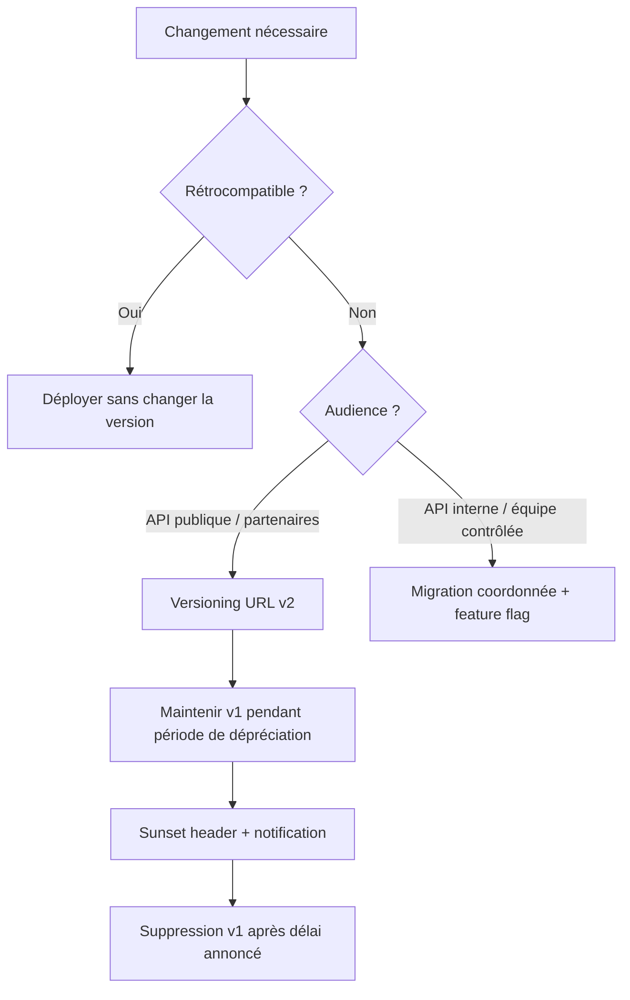
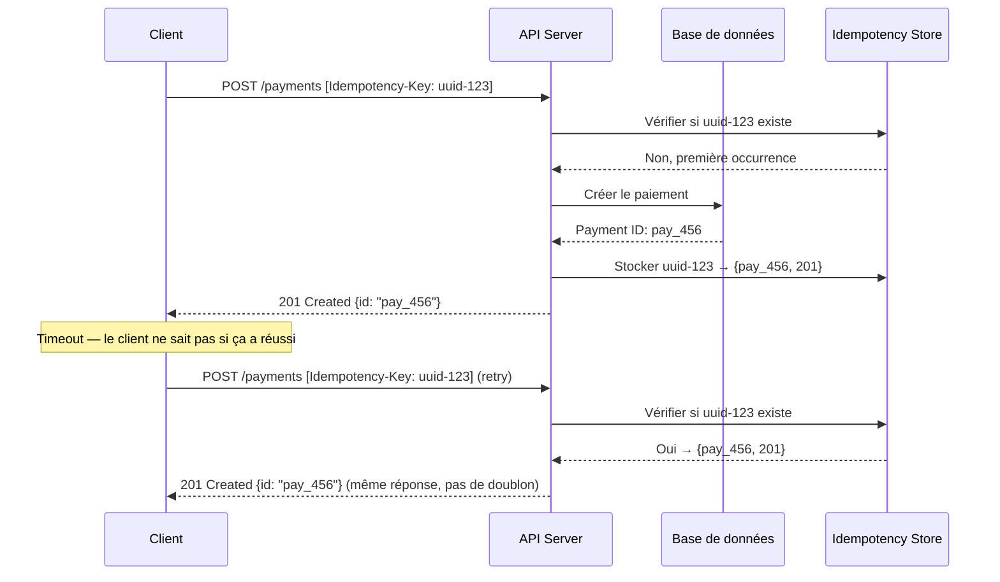

# Design avancé d'API REST

## Objectifs pédagogiques

À l'issue de ce module, vous serez capable de :

- Concevoir une API dont le contrat est stable face aux évolutions du système sous-jacent
- Choisir une stratégie de versioning adaptée à votre contexte et à votre audience
- Modéliser des ressources complexes avec une hiérarchie cohérente et des relations explicites
- Implémenter pagination, filtrage et tri de façon standardisée et prévisible
- Identifier et corriger les anti-patterns de design les plus courants avant qu'ils n'atteignent la production

---

## Mise en situation

Vous avez une API qui tourne en production depuis un an. Une vingtaine de clients l'utilisent — applications mobiles, partenaires B2B, front-end interne. Le besoin métier évolue : il faut ajouter des champs, renommer des concepts, restructurer un endpoint qui renvoie des données dans le mauvais format.

Premier réflexe : modifier directement le endpoint existant. Résultat prévisible : deux applications partenaires tombent en production le lendemain matin.

Ce scénario se répète constamment dans les équipes qui n'ont pas formalisé leur contrat d'API dès le départ. Le design avancé d'API, c'est précisément ce qui évite ce genre de situation — pas en ajoutant de la complexité, mais en prenant les bonnes décisions structurelles au bon moment.

---

## Ce que "design avancé" signifie vraiment

Le design de base d'une API, c'est savoir utiliser les bons verbes HTTP, retourner les bons codes de statut, et produire du JSON lisible. C'est nécessaire, mais insuffisant pour une API qui vit en production plusieurs années.

Le design avancé adresse une question fondamentale : **comment concevoir une API qui peut évoluer sans rompre le contrat avec ses consommateurs ?**

Cela implique plusieurs dimensions indépendantes mais liées :

| Dimension | Question centrale | Ce que ça résout |
|-----------|-------------------|-----------------|
| **Stabilité du contrat** | Comment évoluer sans casser ? | Versioning, rétrocompatibilité |
| **Modélisation des ressources** | Comment représenter le domaine ? | Hiérarchie, relations, granularité |
| **Comportement des collections** | Comment exposer de grands volumes ? | Pagination, filtrage, tri |
| **Cohérence des erreurs** | Comment communiquer les problèmes ? | Formats d'erreur standardisés |
| **Découvrabilité** | Comment guider le consommateur ? | Hypermedia, liens, documentation |

Ces dimensions ne sont pas des options — ce sont les axes sur lesquels vos choix de design auront des conséquences durables.

---

## Versioning : le vrai problème n'est pas la technique

### Pourquoi c'est difficile

Le versioning est l'un des sujets les plus débattus en design d'API, et pour une bonne raison : il n'existe pas de solution universellement correcte. Ce qui existe, c'est un ensemble de compromis à comprendre avant de choisir.

L'erreur classique est de traiter le versioning comme un problème technique alors que c'est d'abord un problème de gouvernance. Quelle est votre politique de dépréciation ? À quel rythme vos consommateurs peuvent-ils migrer ? Avez-vous un SLA sur la durée de support d'une version ?

Sans réponse à ces questions, n'importe quelle stratégie technique sera mal appliquée.

### Les stratégies en pratique

**Versioning par URL** — le plus répandu, pour de bonnes raisons pratiques :

```
GET /api/v1/orders/42
GET /api/v2/orders/42
```

C'est explicite, facile à router, facile à déboguer dans les logs. Le problème : ça couple la version à la ressource, et ça encourage le "big bang versioning" — attendre d'avoir suffisamment de changements pour justifier un v2 entier.

**Versioning par header** — plus propre conceptuellement :

```http
GET /api/orders/42
Accept: application/vnd.myapp.v2+json
```

L'URL reste stable, la version est une négociation de contenu. Avantage : évite la prolifération d'URLs. Inconvénient : invisible dans les logs, difficile à tester directement dans un navigateur, souvent mal supporté par les proxies et les caches.

**Versioning par query parameter** — déconseillé en production :

```
GET /api/orders/42?version=2
```

Ça paraît simple, mais les query parameters ont une sémantique de filtre, pas de contrat. Un cache intermédiaire peut ignorer ce paramètre et renvoyer la mauvaise version.



### Ce qui est rétrocompatible — et ce qui ne l'est pas

🧠 **Concept clé** — La rétrocompatibilité n'est pas binaire. Voici ce qui peut être fait sans bump de version :

| Changement | Rétrocompatible ? | Raison |
|-----------|-------------------|--------|
| Ajouter un champ optionnel en réponse | ✅ Oui | Les consommateurs ignorent les champs inconnus |
| Ajouter un endpoint | ✅ Oui | Pas d'impact sur l'existant |
| Rendre un champ obligatoire en entrée | ❌ Non | Casse les appels existants sans ce champ |
| Supprimer un champ en réponse | ❌ Non | Les consommateurs qui le lisent plantent |
| Changer le type d'un champ | ❌ Non | Désérialisation cassée |
| Renommer un champ | ❌ Non | Équivalent à supprimer + ajouter |
| Changer la sémantique sans changer le format | ⚠️ Risqué | Le plus traître — syntaxiquement compatible, fonctionnellement cassé |

⚠️ **Erreur fréquente** — Changer la sémantique d'un champ existant sans changer son nom est le pire type de breaking change. `status: "pending"` qui passe de "en attente de paiement" à "en attente d'expédition" ne se voit pas dans les tests de contrat techniques, mais casse la logique métier côté consommateur.

### La politique de dépréciation

Un versioning sérieux inclut un processus de dépréciation explicite. Le header `Sunset` est la convention HTTP pour ça :

```http
HTTP/1.1 200 OK
Deprecation: true
Sunset: Sat, 31 Dec 2025 23:59:59 GMT
Link: <https://api.example.com/v2/orders>; rel="successor-version"
```

Ce header permet aux consommateurs de détecter automatiquement qu'ils utilisent une version en fin de vie et de planifier leur migration.

---

## Modélisation des ressources

### La question de la granularité

Une ressource bien conçue représente un concept métier cohérent, pas une table de base de données et pas non plus un objet monolithique qui contient tout.

Le problème classique : l'API expose exactement le schéma de la base de données. L'équipe pense que c'est efficace — pas de transformation, pas de mapping. En réalité, ça crée un couplage fort entre le modèle de persistance et le contrat public. Le jour où vous normalisez une table, vous cassez l'API.

**Règle pratique** : une ressource devrait être compréhensible par quelqu'un qui ne connaît pas votre base de données.

### Hiérarchie et relations

Les ressources ont des relations — il faut les modéliser explicitement plutôt que de les cacher dans des IDs sans contexte.

**Ressources imbriquées** — pour les relations de possession forte :

```
GET /users/123/orders          # les commandes appartiennent à l'utilisateur
GET /users/123/orders/456      # une commande spécifique de cet utilisateur
POST /users/123/orders         # créer une commande pour cet utilisateur
```

**Ressources indépendantes avec référence** — pour les relations faibles ou many-to-many :

```
GET /orders/456               # ordre accessible indépendamment
GET /products/789             # produit accessible indépendamment
GET /orders/456/products      # association, mais les deux existent de façon autonome
```

💡 **Astuce** — Une bonne heuristique : si la ressource enfant n'a de sens que dans le contexte du parent (un `line-item` sans commande n'a aucun sens), imbriquez. Si elle a une existence propre (`product` existe indépendamment de toute commande), gardez-la indépendante et référencez-la.

⚠️ **Erreur fréquente** — Imbriquer sur plus de 2 niveaux. `/users/123/orders/456/items/789/reviews/012` devient illisible et impossible à mémoriser. Si vous arrivez au troisième niveau, interrogez-vous : est-ce que la ressource de bas niveau peut avoir une URL propre ?

### Le problème de l'agrégat

Un cas fréquent en production : vous avez besoin d'afficher une page qui nécessite des données de 5 ressources différentes. Les deux extrêmes sont mauvais :

- **Trop fin** : 5 appels séparés → latence, couplage temporel, inconsistance possible
- **Trop large** : 1 endpoint "god object" qui renvoie tout → sur-fetch, couplage fort, évolution difficile

La réponse n'est pas toujours GraphQL. Souvent, un **endpoint de vue** résout le problème sans architecture complexe :

```
GET /dashboard/summary          # agrégat spécifique à un cas d'usage
GET /orders/456?include=items,customer   # expansion sélective via query param
```

Le second pattern — `include` ou `expand` — est élégant quand il est bien encadré. Il faut définir précisément quelles relations sont expansibles et ne pas laisser l'appelant traverser tout le graphe objet.

---

## Pagination, filtrage et tri

### Pagination : choisir le bon mécanisme

C'est un choix architectural qui a des implications sur la performance et sur l'expérience consommateur. Les trois approches ont des contextes d'usage distincts.

**Offset / Limit** — le plus courant, le plus simple :

```
GET /orders?limit=20&offset=40
```

Problème connu : si un enregistrement est inséré ou supprimé pendant que l'utilisateur pagine, il verra des duplicats ou manquera des entrées. Acceptable pour du contenu statique ou des interfaces admin, problématique pour des données temps réel.

**Cursor-based** — pour les données en mouvement :

```
GET /orders?limit=20&after=cursor_xyz
```

Le curseur encode une position stable dans le jeu de données (souvent un ID ou un timestamp). L'insertion de nouveaux enregistrements n'affecte pas la navigation. C'est ce que Twitter, Facebook et Stripe utilisent pour leurs API.

```json
{
  "data": [...],
  "pagination": {
    "cursor": "eyJpZCI6NDJ9",
    "has_next": true,
    "has_prev": false
  }
}
```

**Keyset pagination** — variante du cursor, utilise directement les valeurs de clé :

```
GET /orders?after_id=42&limit=20
```

Plus lisible que le curseur opaque, mais expose la structure interne des IDs.

🧠 **Concept clé** — Le choix entre offset et cursor n'est pas une question de goût : si vos données changent fréquemment (insertions, suppressions en temps réel), l'offset pagination donnera des résultats incohérents. Le cursor pagination maintient une vue stable de la position dans le dataset.

### Filtrage : convention et sécurité

Le filtrage doit suivre une convention stable. Voici un pattern qui couvre la majorité des besoins :

```
GET /orders?status=pending              # égalité
GET /orders?created_after=2024-01-01    # comparaison temporelle
GET /orders?amount_gte=100              # supérieur ou égal
GET /orders?customer_id=123             # jointure implicite
GET /orders?q=john                      # recherche textuelle
```

⚠️ **Erreur fréquente** — Exposer un filtrage trop puissant sans contrôle. Si vous laissez l'appelant filtrer sur n'importe quel champ et combiner autant de conditions qu'il veut, vous allez générer des requêtes SQL non indexées qui mettront votre base à genoux. Documentez explicitement quels champs sont filtrables et indexez-les en conséquence.

### Tri

```
GET /orders?sort=created_at             # tri ascendant
GET /orders?sort=-created_at            # tri descendant (préfixe -)
GET /orders?sort=-created_at,amount     # multi-critères
```

Le préfixe `-` pour descending est une convention issue de JSON:API — propre, compacte, lisible.

---

## Conception des erreurs

Les erreurs sont une partie du contrat, pas un détail d'implémentation. Un consommateur qui reçoit une erreur doit pouvoir comprendre ce qui s'est passé et décider quoi faire — sans lire le code source de votre API.

### La structure minimale

```json
{
  "error": {
    "code": "VALIDATION_ERROR",
    "message": "The request body contains invalid fields",
    "details": [
      {
        "field": "email",
        "code": "INVALID_FORMAT",
        "message": "Must be a valid email address"
      },
      {
        "field": "amount",
        "code": "OUT_OF_RANGE",
        "message": "Must be between 1 and 10000"
      }
    ],
    "request_id": "req_abc123",
    "documentation_url": "https://docs.example.com/errors/validation-error"
  }
}
```

Chaque élément a sa raison d'être :

- `code` : code machine stable, ne change pas entre les versions → les consommateurs peuvent `switch` dessus
- `message` : lisible par un humain, peut évoluer sans impact
- `details` : erreurs de validation champ par champ — un `400` sans ça est inutilisable
- `request_id` : corrélation avec les logs côté serveur → indispensable pour le support
- `documentation_url` : pour les erreurs complexes, un lien vers l'explication complète

💡 **Astuce** — Le `request_id` doit être généré côté serveur et retourné dans les logs ET dans la réponse. Quand un client vous contacte avec "j'ai eu une erreur 500", la première chose que vous demanderez est ce `request_id`. Si vous ne l'avez pas pensé dès le design, vous passerez des heures à corréler des timestamps.

### Mapper les cas d'erreur aux codes HTTP

| Situation | Code HTTP | Code applicatif |
|-----------|-----------|-----------------|
| Champ manquant ou format invalide | `400` | `VALIDATION_ERROR` |
| Token absent | `401` | `MISSING_CREDENTIALS` |
| Token valide, permission insuffisante | `403` | `INSUFFICIENT_PERMISSIONS` |
| Ressource inexistante | `404` | `RESOURCE_NOT_FOUND` |
| Conflit d'état (ex: déjà annulé) | `409` | `INVALID_STATE_TRANSITION` |
| Rate limit dépassé | `429` | `RATE_LIMIT_EXCEEDED` |
| Erreur serveur non gérée | `500` | `INTERNAL_ERROR` |
| Service dépendant indisponible | `503` | `SERVICE_UNAVAILABLE` |

⚠️ **Erreur fréquente** — Retourner `500` pour toutes les erreurs "inattendues" sans distinguer celles qui sont en fait des erreurs client (validation métier, conflit d'état). Le consommateur ne peut pas savoir s'il doit réessayer, corriger sa requête, ou appeler le support.

---

## Idempotence : rendre les appels sûrs à répéter

En production, les réseaux sont instables. Un client envoie une requête, le timeout expire avant que la réponse arrive — impossible de savoir si le serveur l'a traitée ou non. Sans mécanisme d'idempotence, réessayer crée un doublon.

### Le pattern Idempotency-Key

Stripe a popularisé ce pattern, maintenant largement adopté :

```http
POST /payments
Idempotency-Key: client-generated-uuid-v4

{
  "amount": 5000,
  "currency": "eur",
  "customer_id": "cust_123"
}
```

Le serveur stocke la clé avec le résultat de la première exécution. Si la même requête arrive une deuxième fois avec la même clé, le serveur retourne le résultat mis en cache sans re-exécuter l'opération.



**Points d'implémentation** :
- La clé est générée côté client (UUID v4) — le client décide du scope d'idempotence
- La clé doit être liée au payload : si le payload change pour la même clé, retourner `422` (Stripe retourne `422 Unprocessable Entity`)
- Durée de rétention : 24h à 7 jours selon le contexte
- Stocker dans Redis ou une table dédiée, pas en mémoire

🧠 **Concept clé** — L'idempotence et la sécurité HTTP (GET, HEAD sont "safe") sont deux propriétés distinctes. Un DELETE est idempotent (appeler deux fois donne le même état final) mais pas "safe" (il modifie l'état). Un POST avec Idempotency-Key devient idempotent sans être safe par nature.

---

## HATEOAS et hypermedia : quand ça vaut le coup

HATEOAS (Hypermedia as the Engine of Application State) est souvent présenté comme "le vrai REST" — et tout aussi souvent ignoré en pratique. Il vaut la peine de comprendre pourquoi.

L'idée : chaque réponse contient des liens vers les actions possibles sur la ressource. Le consommateur n'a pas besoin de connaître la structure des URLs à l'avance — il suit les liens.

```json
{
  "id": "order_456",
  "status": "pending_payment",
  "amount": 5000,
  "_links": {
    "self": { "href": "/orders/456" },
    "pay": { "href": "/orders/456/payments", "method": "POST" },
    "cancel": { "href": "/orders/456/cancel", "method": "POST" },
    "customer": { "href": "/customers/123" }
  }
}
```

L'avantage réel : le serveur contrôle quelles actions sont disponibles selon l'état. Si la commande est déjà payée, le lien `pay` disparaît — le client n'a pas besoin de connaître les règles métier pour savoir ce qui est autorisé.

**Quand ça vaut le coup** :
- API publique avec beaucoup de consommateurs hétérogènes
- Workflow complexe avec des transitions d'état nombreuses
- Quand vous voulez découpler les URLs du client (changement d'URL sans casser les clients)

**Quand ça ne vaut pas le coût** :
- API interne avec consommateurs contrôlés
- Équipe qui maintient à la fois l'API et les clients
- Besoin de performance maximale (overhead de parsing des liens)

💡 **Astuce** — Vous n'avez pas besoin d'implémenter HATEOAS complet pour bénéficier de l'approche. Ajouter des liens `self` et les liens vers les ressources associées (sans les actions dynamiques) améliore déjà la découvrabilité sans la complexité de gestion des états.

---

## Cas réel : refactoring d'une API de gestion de commandes

**Contexte** : API e-commerce B2B, 15 partenaires intégrés, 500k requêtes/jour. L'équipe doit ajouter le support multi-devise et restructurer le modèle de taxes.

**Problèmes identifiés dans l'API v1** :

1. `GET /orders` retourne tous les champs même quand on veut juste la liste
2. Pas de pagination standardisée — chaque endpoint avait son propre format
3. Les erreurs de validation retournaient du texte libre en `message` → impossible à parser
4. `amount` était un float — problèmes d'arrondi en production
5. Pas de versioning — impossible d'évoluer sans casser

**Décisions de design pour v2** :

```
# Versioning URL pour la compatibilité partenaires
GET /v2/orders

# Pagination cursor standardisée sur tous les endpoints
GET /v2/orders?limit=50&after=cursor_xyz

# Filtrage documenté et indexé
GET /v2/orders?status=confirmed&created_after=2024-01-01&sort=-created_at

# Montants en centimes (integer), devise explicite
{
  "amount": 5000,
  "currency": "EUR",
  "amount_formatted": "50,00 €"
}

# Erreurs structurées avec code machine
{
  "error": {
    "code": "INSUFFICIENT_FUNDS",
    "message": "...",
    "request_id": "req_abc"
  }
}
```

**Résultats après 3 mois** :
- Zéro breaking change signalé par les partenaires (v1 maintenue 6 mois en parallèle)
- Temps d'intégration nouveaux partenaires divisé par 2 (erreurs auto-documentées)
- 3 bugs de doublon de commande éliminés grâce à l'Idempotency-Key
- Requêtes `/orders` 40% plus rapides (pagination cursor vs offset sur 2M d'enregistrements)

---

## Bonnes pratiques et pièges à éviter

### Ce qui distingue une API de production

**Contrat explicite avant le code** — Écrire la spec OpenAPI (ou au moins les exemples de requête/réponse) avant d'implémenter. Ça force à penser au consommateur, pas à l'implémentation. Contract-first development.

**Nommage cohérent sur toute l'API** — Choisissez `snake_case` ou `camelCase` pour les champs JSON et tenez-vous y. Mélanger les deux (parfois par héritage de différentes équipes) est l'une des choses les plus frustrantes pour un intégrateur.

**Timestamps avec timezone explicite** — Toujours en ISO 8601 avec UTC : `2024-03-15T14:30:00Z`. Jamais un timestamp Unix sans documentation, jamais une date locale sans timezone.

**IDs opaques** — Les IDs exposés dans l'API ne doivent pas révéler la structure interne. Un auto-increment integer permet à n'importe qui de deviner le volume de votre base. Utilisez des UUIDs ou des IDs préfixés (`ord_abc123`) à la Stripe.

⚠️ **Erreur fréquente** — Retourner des nulls sans distinction entre "champ inexistant", "champ non renseigné" et "champ non autorisé pour ce consommateur". Ces trois cas ont des sémantiques différentes. Documentez explicitement ce que `null` signifie pour chaque champ — et envisagez d'omettre les champs non renseignés plutôt que de retourner `null`.

⚠️ **Erreur fréquente** — Utiliser des booleans pour des états qui vont évoluer. `is_active: true/false` semble simple jusqu'au jour où vous avez besoin de `is_suspended` ou `is_pending_review`. Un champ `status` avec des valeurs énumérées est presque toujours meilleur.

**Documenter les limites, pas juste les fonctionnalités** — Rate limits, taille maximale des payloads, nombre maximal d'items dans un batch, durée de rétention des données : tout ça doit être dans la documentation et retourné dans les headers appropriés (`X-RateLimit-Limit`, `X-RateLimit-Remaining`, `Retry-After`).

---

## Résumé

Le design avancé d'une API REST n'est pas une liste de règles à appliquer mécaniquement — c'est une discipline de prise de décision structurée autour d'un principe central : le contrat avec vos consommateurs.

Le versioning est la dimension la plus visible, mais ce n'est que la couche de surface. En dessous, la stabilité du contrat repose sur une modélisation des ressources qui reflète le domaine métier plutôt que l'implémentation, une gestion des erreurs qui communique des informations actionnables, et des mécanismes d'idempotence qui rendent l'API robuste aux conditions réseau réelles.

Les décisions techniques les plus impactantes — cursor vs offset pagination, URL vs header versioning, HATEOAS ou non — ne se tranchent pas à l'avance : elles dépendent de votre audience, de votre rythme d'évolution, et des contraintes opérationnelles de votre système. Ce module vous donne les outils pour poser ces questions et évaluer les compromis, ce qui est précisément ce que le design avancé requiert.

La suite logique est l'étude des contrats de type OpenAPI/AsyncAPI pour formaliser ce design, et la mise en place de contract testing pour en valider la tenue dans le temps.

---

<!-- snippet
id: api_versioning_retrocompat
type: concept
tech: api-rest
level: advanced
importance: high
format: knowledge
tags: versioning, retrocompatibilite, contrat, breaking-change
title: Ce qui constitue un breaking change en API REST
content: Sont rétrocompatibles (sans bump de version) : ajouter un champ optionnel en réponse, ajouter un endpoint. Cassent le contrat : supprimer ou renommer un champ, rendre un champ obligatoire en entrée, changer le type d'un champ, changer la sémantique d'un champ existant sans le renommer (le plus traître — syntaxiquement valide, fonctionnellement cassé).
description: Changer la sémantique sans changer le nom est un breaking change invisible aux tests de contrat techniques mais fatal côté consommateur.
-->

<!-- snippet
id: api_versioning_sunset_header
type: tip
tech: api-rest
level: advanced
importance: high
format: knowledge
tags: versioning, deprecation, sunset, header
title: Déprécier une version d'API avec le header Sunset
content: Ajouter dans les réponses de la version dépréciée : `Deprecation: true`, `Sunset: Sat, 31 Dec 2025 23:59:59 GMT`, `Link: <https://api.example.com/v2/resource>; rel="successor-version"`. Les clients peuvent détecter automatiquement la dépréciation et planifier la migration. Sans ce header, les partenaires découvrent la fin de support au moment de la coupure.
description: Le header Sunset (RFC 8594) est la convention HTTP standard pour annoncer la date de fin de vie d'un endpoint ou d'une version.
-->

<!-- snippet
id: api_pagination_cursor_vs_offset
type: concept
tech: api-rest
level: advanced
importance: high
format: knowledge
tags: pagination, cursor, offset, performance
title: Cursor vs offset pagination — quand choisir
content: Offset pagination (`?limit=20&offset=40`) est simple mais instable : une insertion pendant la navigation crée des doublons ou des sauts. Cursor pagination (`?limit=20&after=cursor_xyz`) encode une position stable dans le dataset — les insertions n'affectent pas la navigation. Règle : si les données changent fréquemment (insertions temps réel), cursor est obligatoire. Offset est acceptable pour des données quasi-statiques ou des interfaces admin.
description: Sur un dataset de 2M d'enregistrements actifs, le cursor pagination est aussi 30-50% plus rapide que l'offset (pas de COUNT(*) ni de OFFSET coûteux).
-->

<!-- snippet