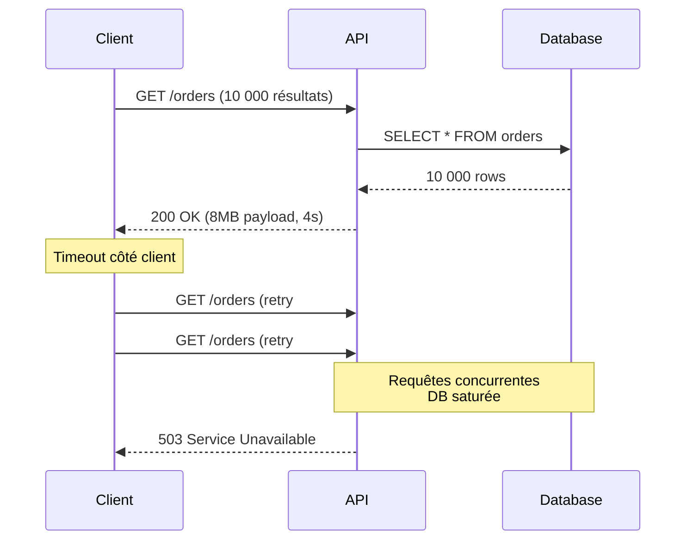
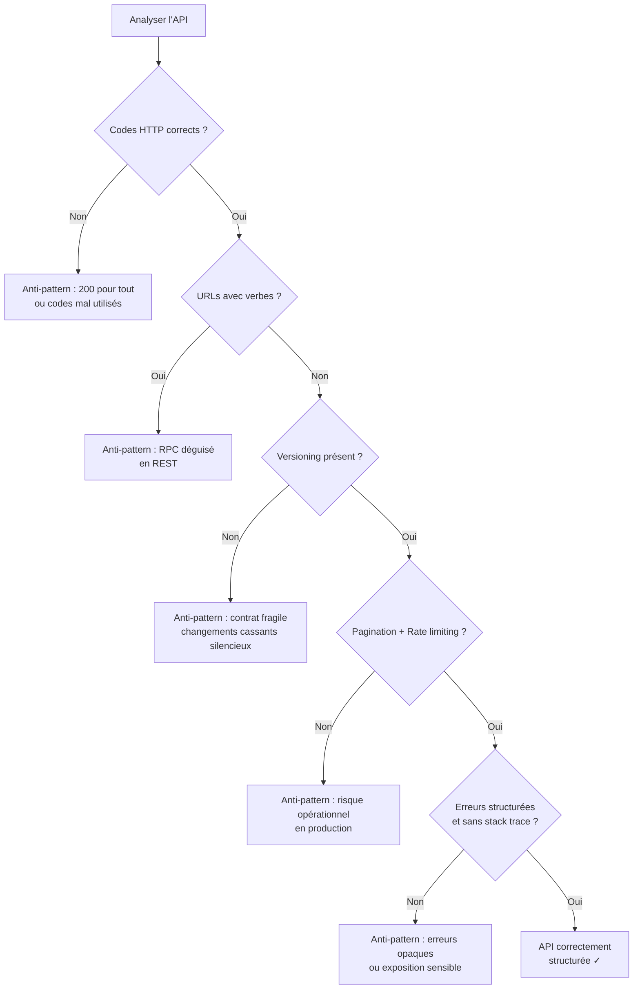

# Anti-patterns API

## Objectifs pédagogiques

- Identifier les anti-patterns REST les plus courants et leurs symptômes en production
- Comprendre *pourquoi* ces erreurs se produisent, pas seulement *ce qu'il faut éviter*
- Diagnostiquer une API existante à partir de comportements problématiques observables
- Proposer une correction concrète pour chaque anti-pattern identifié
- Développer un réflexe de revue d'API avant mise en production

---

## Mise en situation

Ton équipe reprend une API REST développée par une équipe externe. Elle est "en production depuis 6 mois" et les consommateurs se plaignent : des erreurs 200 qui contiennent en réalité des échecs, des endpoints impossibles à mettre en cache, une documentation qui ne correspond plus au comportement réel, et un client mobile qui plante à chaque mise à jour parce que les champs changent sans préavis.

Personne n'a fait de "grosse erreur" volontairement. Ces problèmes ont émergé progressivement, parce que les mauvaises pratiques se camouflent bien au début. C'est exactement ce qu'on va disséquer ici.

---

## Ce que sont les anti-patterns API — et pourquoi ils sont insidieux

Un anti-pattern n'est pas un bug. C'est une solution *qui semble raisonnable sur le moment* mais qui crée des problèmes en cascade à mesure que l'API grossit ou que son usage se diversifie.

La différence avec une simple erreur : l'anti-pattern **fonctionne** — au sens où les requêtes reçoivent une réponse. Mais il génère de la friction pour les consommateurs, des coûts d'intégration cachés, des comportements imprévisibles sous charge, et des dettes techniques qui s'aggravent.

Ce module couvre les anti-patterns regroupés en quatre familles :

1. **Mauvaise utilisation HTTP** — codes de statut, méthodes, headers
2. **Conception des ressources** — modélisation, URLs, nommage
3. **Contrats et évolutivité** — versioning, rétrocompatibilité, couplage
4. **Comportements opérationnels** — gestion d'erreurs, sécurité, observabilité

---

## Famille 1 — Mauvaise utilisation HTTP

### 1.1 Le 200 OK qui ment

C'est le plus répandu et le plus dangereux. L'API retourne systématiquement HTTP 200, puis glisse le vrai statut dans le body :

```json
HTTP/1.1 200 OK

{
  "success": false,
  "error": "User not found",
  "code": 404
}
```

**Pourquoi ça arrive :** copier un pattern RPC (type JSON-RPC), ou vouloir "simplifier" le client en n'ayant qu'un seul statut à gérer.

**Pourquoi c'est problématique :**
- Les proxies, CDN et load balancers interprètent le 200 et peuvent mettre en cache une réponse d'erreur
- Les outils de monitoring comptent ces appels comme des succès — ton taux d'erreur disparaît des métriques
- Tous les clients doivent implémenter leur propre logique de parsing d'erreur au lieu d'utiliser le protocole HTTP

La correction est simple : utiliser les codes HTTP pour ce qu'ils sont. 404 pour "non trouvé", 400 pour "requête invalide", 500 pour "erreur serveur". Le body peut enrichir l'erreur, pas la remplacer.

```json
HTTP/1.1 404 Not Found

{
  "error": "user_not_found",
  "message": "No user with id 42 exists",
  "doc_url": "https://api.example.com/docs/errors#user_not_found"
}
```

---

### 1.2 POST pour tout faire

```
POST /api/getUserData
POST /api/deleteUser
POST /api/updateUserName
```

Ici, HTTP est réduit à un tunnel. On perd tout ce que le protocole offre gratuitement.

🧠 **Concept clé** — L'idempotence n'est pas un détail académique. `GET /users/42` peut être rejouée sans risque par un proxy, un client qui retry, un CDN. `DELETE /users/42` peut être rejouée N fois avec le même effet. `POST /users` crée une nouvelle ressource à chaque appel. Cette distinction permet aux couches intermédiaires d'optimiser le réseau — et à toi de construire des clients résilients avec retry automatique.

Quand tout passe par POST, tu dois réinventer ces garanties toi-même, dans le code applicatif. Et tu ne le feras probablement pas correctement.

---

### 1.3 Ignorer les headers HTTP

L'API ne respecte pas `Content-Type`, n'exploite pas `ETag` / `Last-Modified`, ignore `Accept-Language`, et ne renvoie pas de `Cache-Control`.

Ce n'est pas qu'un manque d'élégance. Concrètement :
- Sans `Cache-Control`, les clients ne savent pas si la réponse est cacheable ni combien de temps — ils font donc une requête à chaque fois, ou cachent indéfiniment
- Sans `ETag`, impossible d'implémenter une revalidation légère : le client re-télécharge toute la ressource même si elle n'a pas changé
- Retourner du JSON avec `Content-Type: text/html` casse des bibliothèques clientes qui se basent sur le header pour désérialiser

⚠️ **Erreur fréquente** : traiter `Cache-Control: no-cache` comme "ne pas mettre en cache". En réalité, `no-cache` signifie "revalider avant de servir depuis le cache". Pour interdire tout cache, c'est `no-store`. La confusion génère des comportements de cache imprévisibles en production.

---

## Famille 2 — Conception des ressources

### 2.1 Les URLs qui encodent des verbes

```
GET /api/getUser?id=42
POST /api/createOrder
GET /api/deleteProduct?id=5
POST /api/fetchInvoices
```

C'est le symptôme le plus visible d'une API qui pense en termes de procédures plutôt que de ressources. Le problème n'est pas esthétique — c'est que ces APIs deviennent incontrôlables à l'échelle. Comment nommer le prochain endpoint ? `/api/retrieveUserById` ? `/api/getUserInfo` ? `/api/getUserDetails` ? Les noms prolifèrent, la documentation explose, et les clients ne savent jamais quel endpoint appeler.

La règle REST : **les URLs identifient des ressources, les méthodes HTTP décrivent l'action**.

```
GET    /users/42          → lire un utilisateur
DELETE /users/42          → supprimer un utilisateur
POST   /orders            → créer une commande
GET    /invoices          → lister les factures
```

---

### 2.2 La ressource fourre-tout

```json
GET /users/42

{
  "id": 42,
  "name": "Alice",
  "email": "alice@example.com",
  "address": { ... },
  "orders": [ ... 847 orders ... ],
  "payments": [ ... ],
  "preferences": { ... },
  "activityLog": [ ... 10000 entries ... ]
}
```

L'intention est bonne : "donner tout ce dont le client pourrait avoir besoin". En pratique, c'est un contrat impossible à tenir. La réponse grossit avec le temps, les performances se dégradent, et le moindre ajout de champ devient un risque de régression pour tous les clients.

💡 **Astuce** : appliquer le principe de la ressource minimale viable. Commence avec les champs nécessaires au cas d'usage principal. Expose les sous-ressources via des relations hypermedia ou des endpoints dédiés (`/users/42/orders`). Si des clients ont des besoins très différents (mobile vs dashboard), envisage des projections via query params (`?fields=id,name,email`) ou des BFF (Backend For Frontend).

---

### 2.3 Incohérence dans le nommage et la structure

Une API qui mélange les conventions sur une même surface est un piège permanent pour les intégrateurs :

```
GET /users              → retourne { "data": [ ... ] }
GET /orders             → retourne [ ... ]  (pas d'enveloppe)
GET /invoices           → retourne { "items": [ ... ], "count": 42 }
GET /products           → retourne { "results": [ ... ], "total": 42 }
```

Mêmes conventions à unifier, exemples concrets :
- Pagination : toujours le même format (`page`/`per_page` ou `offset`/`limit`, pas les deux)
- Enveloppe de réponse : toujours présente ou jamais
- Nommage des champs : `snake_case` ou `camelCase`, pas les deux dans la même API
- Dates : ISO 8601 partout (`2024-03-15T10:30:00Z`), pas un mix de timestamps Unix et de strings localisées

L'incohérence force les clients à implémenter des cas particuliers pour chaque endpoint. C'est exactement ce que l'on cherche à éviter avec un contrat d'interface.

---

## Famille 3 — Contrats et évolutivité

### 3.1 Pas de versioning — ou un versioning mal conçu

Une API sans stratégie de versioning finit invariablement dans l'une de ces situations :
- On ne peut plus rien changer sans casser des clients existants (freeze)
- On fait des changements "en douce" et des clients plantent en production

Les trois approches courantes :

| Approche | Exemple | Avantages | Inconvénients |
|----------|---------|-----------|---------------|
| Version dans l'URL | `/v1/users` | Simple, explicite, cacheable | Prolifération d'URLs, copier-coller de routes |
| Version dans le header | `Accept: application/vnd.api+json;version=2` | Propre REST, URL stable | Moins visible, plus dur à tester dans un browser |
| Version dans un param | `/users?version=2` | Facile à implémenter | Mélange contenu et métadonnées, problèmes de cache |

Il n'y a pas de réponse universelle, mais il y a des anti-patterns clairs :
- **Ne pas versionner du tout** en espérant que personne ne casse rien
- **Versionner au niveau du champ** (`user_v2_name`) — signe que la version aurait dû être au niveau de l'API
- **Abandonner v1 sans dépréciation progressive** — sans période de chevauchement avec des warnings dans les réponses

🧠 **Concept clé** — La dépréciation est un processus, pas un événement. Annoncer la dépréciation via un header `Deprecation: true` et `Sunset: Sat, 01 Jan 2026 00:00:00 GMT`, loguer les appels à l'ancienne version, contacter les consommateurs actifs — c'est ça, une migration respectueuse du contrat.

---

### 3.2 Changements cassants non signalés

Tous les changements ne sont pas égaux. Voici ce qui casse les clients, et ce qui ne casse pas :

**Changements rétrocompatibles** (safe) :
- Ajouter un champ optionnel dans la réponse
- Ajouter un nouvel endpoint
- Ajouter un query param optionnel
- Étendre les valeurs acceptées d'un enum (avec prudence)

**Changements cassants** (breaking) :
- Renommer ou supprimer un champ
- Changer le type d'un champ (`string` → `int`)
- Changer la sémantique d'un champ sans changer son nom
- Modifier la structure d'URL
- Rendre obligatoire un paramètre qui était optionnel
- Réduire les valeurs acceptées d'un enum

⚠️ **Erreur fréquente** : penser qu'ajouter un champ est toujours safe. Ce l'est en général — sauf si le client fait une désérialisation stricte qui rejette les champs inconnus. C'est un comportement courant en Java avec Jackson en mode `FAIL_ON_UNKNOWN_PROPERTIES`. La robustesse du contrat doit être pensée des deux côtés.

---

### 3.3 Couplage fort et over-fetching

Une API qui expose directement le schéma de sa base de données crée un couplage structurel dangereux. Les noms de tables deviennent des URLs, les colonnes deviennent des champs JSON. Toute migration de schéma devient une migration d'API.

```
GET /db_users/42              ← nom de table exposé
{ "usr_id": 42, "usr_nm": "Alice", "cr_dt": "2024-01-15" }  ← noms de colonnes
```

L'API doit exposer un modèle conceptuel stable, indépendant de l'implémentation sous-jacente. Le mapping entre le modèle de données interne et le contrat API est une responsabilité explicite, pas une transparence par défaut.

---

## Famille 4 — Comportements opérationnels

### 4.1 Gestion d'erreurs opaque

```json
HTTP/1.1 500 Internal Server Error

{
  "error": "Something went wrong"
}
```

Cette réponse est inutile pour le consommateur. Il ne sait pas si l'erreur est transitoire (retry possible) ou permanente, si c'est de sa faute ou de la tienne, et comment la corriger.

Une bonne réponse d'erreur a une structure stable et informative :

```json
HTTP/1.1 422 Unprocessable Entity

{
  "error": "validation_failed",
  "message": "Request contains invalid fields",
  "details": [
    {
      "field": "email",
      "code": "invalid_format",
      "message": "Expected format: user@domain.tld"
    },
    {
      "field": "birth_date",
      "code": "future_date",
      "message": "Birth date cannot be in the future"
    }
  ],
  "request_id": "req_7f3a2b1c",
  "doc_url": "https://api.example.com/docs/errors#validation_failed"
}
```

Le `request_id` est particulièrement important en production : il permet de relier la réponse cliente aux logs serveur sans que le consommateur ait accès aux internals.

---

### 4.2 Exposition d'informations sensibles dans les erreurs

À l'opposé du problème précédent, certaines APIs en font trop :

```json
HTTP/1.1 500 Internal Server Error

{
  "error": "NullPointerException at UserService.java:142",
  "query": "SELECT * FROM users WHERE id = '42'; DROP TABLE users;--",
  "stack": "org.springframework.dao.DataAccessException..."
}
```

Stack traces, requêtes SQL, noms de fichiers internes, versions de frameworks — autant d'informations précieuses pour un attaquant.

La règle : **les messages d'erreur sont pour les humains et les systèmes qui consomment l'API, pas pour le débogage en production**. Les détails techniques vont dans les logs, côté serveur, corrélés par un `request_id`. Le client reçoit un code d'erreur stable et un message orienté résolution.

---

### 4.3 Absence de rate limiting et de pagination

Une API sans limite de débit peut être mise à genoux par un seul client mal configuré — que ce soit malveillant ou accidentel. Un endpoint qui retourne potentiellement des milliers d'enregistrements sans pagination force les clients à gérer des réponses arbitrairement grandes.

Le diagramme suivant illustre ce qui se passe quand un client retry agressif rencontre une API sans rate limiting :



La pagination doit être systématique sur tout endpoint de liste, avec des limites par défaut raisonnables (`per_page: 20`) et une limite maximale explicite (`per_page` plafonné à 100, par exemple). Le rate limiting doit être visible pour les clients via les headers `X-RateLimit-Limit`, `X-RateLimit-Remaining` et `X-RateLimit-Reset`.

---

### 4.4 Sécurité par obscurité

Quelques anti-patterns de sécurité qu'on rencontre régulièrement :

**Clés API dans les URLs** : `GET /users?api_key=abc123secret` — la clé se retrouve dans les logs d'accès, l'historique du navigateur, les headers `Referer`. Les credentials vont dans les headers (`Authorization: Bearer <token>`), jamais dans l'URL.

**Pas de distinction 401 vs 403** : 401 signifie "tu n'es pas authentifié" (envoie des credentials). 403 signifie "tu es authentifié mais tu n'as pas le droit". Retourner systématiquement 403 prive le client d'une information utile pour diagnostiquer le problème.

**CORS trop permissif** : `Access-Control-Allow-Origin: *` sur une API qui utilise des cookies de session ou des tokens sensibles — c'est une invitation à du CSRF ou vol de credentials depuis n'importe quel domaine.

**IDs séquentiels prévisibles** : `/users/1`, `/users/2`, `/users/3` — un attaquant peut énumérer toutes les ressources par simple incrémentation. Utiliser des UUIDs ou des IDs opaques pour les ressources sensibles.

---

## Diagnostiquer une API existante

Quand tu arrives sur une API que tu n'as pas conçue, voici une grille de lecture rapide :



Ce n'est pas un audit exhaustif, mais ces six questions couvrent 80% des problèmes qu'on rencontre en pratique.

---

## Bonnes pratiques — ce qu'un professionnel fait systématiquement

Quelques principes qui émergent de tout ce qui précède :

**Traiter le contrat comme une interface publique dès le premier jour**, même si l'API est interne. Les APIs "internes" deviennent externes plus souvent qu'on ne le pense — et même en interne, casser un contrat crée de la dette.

**Linter l'API avant de la déployer**. Des outils comme [Spectral](https://stoplight.io/open-source/spectral) permettent de valider une spec OpenAPI contre des règles personnalisées. Intégrer ça dans la CI coûte peu et prévient beaucoup d'anti-patterns.

**Écrire des tests orientés consommateur**. Les consumer-driven contract tests (Pact, par exemple) inversent la perspective : c'est le consommateur qui définit ce qu'il attend, et le producteur vérifie que son API satisfait ces attentes. C'est le filet de sécurité le plus efficace contre les changements cassants involontaires.

**Logger les deprecation warnings activement**. Quand tu supprimes un champ ou une version, loguer chaque appel qui utilise encore l'ancienne interface — avec l'identité du client si possible. C'est le seul moyen de savoir qui contacter avant la coupure.

**Ne pas normaliser l'incohérence**. La tentation est forte de "faire comme le reste du code" quand on ajoute un endpoint à une API déjà inconsistante. Résiste. Chaque nouveau endpoint est une occasion de ne pas reproduire les erreurs existantes — et documente les incohérences héritées pour les corriger progressivement.

---

## Résumé

Les anti-patterns API ne sont pas des bugs — ce sont des décisions qui semblent raisonnables à court terme mais qui dégradent la qualité du contrat sur la durée. Ils se regroupent en quatre familles : mauvaise utilisation HTTP (codes de statut, méthodes, headers), conception des ressources (URLs verbeux, réponses fourre-tout, incohérences), gestion du contrat (versioning absent, changements cassants), et comportements opérationnels (erreurs opaques, absence de rate limiting, failles de sécurité).

Le point commun de tous ces anti-patterns : ils déplacent la complexité du producteur vers le consommateur, ou la cachent jusqu'à ce qu'elle explose en production. Diagnostiquer une API consiste à chercher où cette complexité a été déportée. La corriger consiste à la reprendre là où elle appartient — dans le contrat, explicite et stable.

---

<!-- snippet
id: api_status_200_lie
type: warning
tech: api-rest
level: intermediate
importance: high
format: knowledge
tags: api, http, codes-statut, erreurs, monitoring
title: HTTP 200 avec erreur dans le body — le mensonge silencieux
content: Piège : retourner 200 OK avec { "success": false } dans le body. Conséquence : les proxies cachent la réponse d'erreur, les outils de monitoring comptent l'appel comme un succès, le taux d'erreur disparaît des métriques. Correction : utiliser les codes HTTP sémantiques (400, 404, 422, 500). Le body enrichit l'erreur, il ne la remplace pas.
description: Un 200 avec erreur dans le body trompe les CDN, les monitors et les clients — le taux d'erreur réel devient invisible.
-->

<!-- snippet
id: api_http_idempotence_methods
type: concept
tech: api-rest
level: intermediate
importance: high
format: knowledge
tags: api, idempotence, http, retry, methodes
title: Idempotence HTTP — ce que GET et DELETE permettent que POST n'offre pas
content: GET et DELETE sont idempotents : les rejouer N fois donne le même résultat. Cela permet aux proxies et clients de retenter automatiquement sans risque. POST n'est pas idempotent : chaque appel crée une nouvelle ressource. Quand tout passe par POST, les couches intermédiaires ne peuvent pas optimiser le réseau, et les clients doivent gérer les retries manuellement dans le code applicatif.
description: L'idempotence HTTP permet aux clients et proxies de retenter sans risque — perdu quand tout passe par POST.
-->

<!-- snippet
id: api_cache_control_nocache_vs_nostore
type: warning
tech: api-rest
level: intermediate
importance: high
format: knowledge
tags: api, cache, http, headers, production
title: Cache-Control no-cache ≠ interdire le cache
content: Piège classique : utiliser Cache-Control: no-cache en pensant désactiver le cache. En réalité, no-cache = "revalider avant de servir depuis le cache" (le cache est utilisé après validation). Pour interdire tout cache : Cache-Control: no-store. La confusion génère des comportements imprévisibles en production, notamment des réponses obsolètes servies par des CDN.
description: no-cache revalide avant de servir — pour interdire toute mise en cache, utiliser no-store.
-->

<!-- snippet
id: api_urls_verbs_antipattern
type: warning
tech: api-rest
level: beginner
importance: high
format: knowledge
tags: api, rest, urls, conception, ressources
title: URLs avec verbes — symptôme d'une API RPC déguisée en REST
content: Piège : /api/getUser, /api/deleteProduct, /api/fetchInvoices. Conséquence : prolifération incontrôlable des noms d'endpoints, documentation impossible à maintenir, clients incapables de deviner l'URL correcte. Correction : les URLs identifient des ressources (noms), les méthodes HTTP décrivent l'action. GET /users/42, DELETE /products/5, GET /invoices.
description: Les verbes dans les URLs trahissent une API procédurale — les URLs nomment des ressources, les méthodes HTTP font l'action.
-->

<!-- snippet
id: api_breaking_changes_list
type: concept
tech: api-rest
level: advanced
importance: high
format: knowledge
tags: api, versioning, contrat, breaking-changes, compatibilite
title: Changements cassants vs rétrocompatibles — la distinction clé
content: Safe (rétrocompatibles) : ajouter un champ optionnel, ajouter un endpoint, ajouter un query param optionnel. Breaking (cassants) : renommer ou supprimer un champ, changer le type d'un champ (string → int), changer la sémantique sans changer le nom, rendre un param obligatoire, modifier la structure d'URL. Attention : ajouter un champ peut casser un client Java avec Jackson en mode FAIL_ON_UNKNOWN_PROPERTIES.
description: Renommer un champ ou changer son type casse les clients existants — les ajouts sont généralement safe sauf désérialisation stricte.
-->

<!-- snippet
id: api_deprecation_headers
type: tip
tech: api-rest
level: advanced
importance: medium
format: knowledge
tags: api, versioning, deprecation, headers, migration
title: Signaler une dépréciation via les headers HTTP standards
content: Ajouter sur les endpoints dépréciés : Deprecation: true et Sunset: Sat, 01 Jan 2026 00:00:00 GMT (date de coupure). Loguer chaque appel à l'ancienne version avec l'identité du client. Cela permet de contacter les consommateurs actifs avant la coupure et de mesurer le taux de migration réel.
description: Les headers Deprecation et Sunset signalent la fin de vie d'un endpoint aux clients et outils de monitoring.
-->

<!-- snippet
id: api_error_body_structure
type: tip
tech: api-rest
level: intermediate
importance: high
format: knowledge
tags: api, erreurs, contrat, observabilite, production
title: Structure minimale d'une réponse d'erreur utile en production
content: Une bonne erreur API contient : un code machine stable (error: "validation_failed"), un message humain, les détails par champ si applicable, un request_id pour corréler avec les logs serveur, et un doc_url vers la documentation de l'erreur. Le request_id est critique : il permet au client de transmettre une référence au support sans exposer les internals.
description: Un request_id dans chaque erreur permet de corréler la réponse cliente avec les logs serveur sans exposer les stack traces.
-->

<!-- snippet
id: api_credentials_in_url
type: warning
tech: api-rest
level: beginner
importance: high
format: knowledge
tags: api, securite, authentification, credentials, logs
title: Clés API dans l'URL — elles finissent dans les logs
content: Piège : GET /users?api_key=abc123secret. Conséquence : la clé apparaît dans les logs d'accès nginx/Apache, l'historique du navigateur, les headers Referer des requêtes suivantes, et les outils de monitoring. Correction : les credentials vont dans le header Authorization uniquement — Authorization: Bearer abc123secret.
description: Une clé API dans l'URL se retrouve en clair dans les logs d'accès, l'historique et les headers Referer.
-->

<!-- snippet
id: api_401_vs_403
type: concept
tech: api-rest
level: beginner
importance: medium
format: knowledge
tags: api, securite, http, codes-statut, authentification
title: 401 vs 403 — deux erreurs d'accès très différentes
content: 401 Unauthorized = "tu n'es pas authentifié" → le client doit envoyer ou renouveler ses credentials. 403 Forbidden = "tu es authentifié mais tu n'as pas la permission" → envoyer de nouveaux credentials ne changera rien. Retourner 403 pour tout prive le client d'une information de diagnostic essentielle et crée de la confusion lors des intégrations.
description: 401 demande des credentials, 403 signifie que les credentials sont valides mais insuffisants — la confusion bloque le diagnostic client.
-->

<!-- snippet
id: api_pagination_mandatory
type: tip
tech: api-rest
level: intermediate
importance: high
format: knowledge
tags: api, pagination, performance, production, rate-limiting
title: Pagination obligatoire sur tout endpoint de liste
content: Tout endpoint retournant une collection doit avoir une pagination avec une valeur par défaut basse (20 items) et un plafond explicite (max 100). Sans pagination, un seul appel peut retourner des milliers d'enregistrements, saturer la DB et déclencher des timeouts clients qui génèrent des retries — effet boule de neige. Exposer X-RateLimit-Limit, X-RateLimit-Remaining, X-RateLimit
