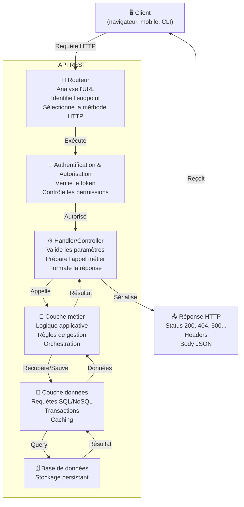

```yaml
layout: page
title: "Structure d'une API REST"

course: "API REST"
chapter_title: "Fondations"

chapter: 1
section: 2

tags: rest,architecture,http,api,endpoint,ressource
difficulty: beginner
duration: 45
mermaid: true

icon: "🏗️"
domain: "Backend & Intégration"
domain_icon: "⚙️"
status: "published"
---

# Structure d'une API REST

## Objectifs pédagogiques

À la fin de ce module, vous serez capable de :
- **Identifier** les composants structurels d'une API REST et comprendre leur rôle respectif
- **Construire** des URLs d'endpoint cohérentes en suivant les conventions REST
- **Concevoir** une hiérarchie de ressources logique et prévisible
- **Comprendre** comment une requête HTTP traverse les couches d'une API jusqu'à la base de données

## Mise en situation

Vous démarrez sur un projet backend. L'équipe doit exposer un service de gestion d'articles de blog. Sans structure claire, chacun improvise : un développeur crée `/getArticles`, un autre `/articles/fetch`, un troisième utilise POST pour récupérer des données. Six mois plus tard, vous héritez d'une API chaotique, impossible à documenter ou à intégrer.

À l'inverse, une API bien structurée suit des conventions prévisibles. Le client (frontend, mobile, partenaire) sait **où** trouver les données et **comment** les demander, sans lire de documentation.

La structure d'une API REST n'est pas du décor : c'est l'architecture qui détermine si votre API est maintenable, exploitable en production, et scalable.

---

## Résumé

Une API REST est structurée autour de **ressources** (entités métier) accessibles via des **endpoints** (URLs + méthodes HTTP). Chaque requête suit un chemin prévisible : depuis le client, elle traverse une **couche de routage** (qui analyse l'URL), puis une **couche métier** (qui traite la logique), jusqu'à une **couche de persistance** (données). Les **codes HTTP et réponses** standardisés permettent au client de savoir exactement ce qui s'est passé. Cette structure transforme une collection de fonctions disparates en une interface cohérente, facile à consommer et à maintenir.

---

## Ce que c'est : la notion de ressource

En REST, une **ressource** n'est pas un fichier, ni une fonction, ni une base de données. C'est une **entité métier** que votre système gère : un article, un utilisateur, un commentaire, une commande.

Chaque ressource a :
- Une **identité unique** : `/articles/42` désigne l'article numéro 42
- Une **représentation** : JSON, XML (généralement JSON en 2024)
- Des **opérations standards** : créer, lire, modifier, supprimer (CRUD)

L'idée clé : **l'URL décrit ce qu'on veut, pas comment l'obtenir**. 

Comparez :

```
❌ Non-REST :  /getArticleById?id=42
❌ Non-REST :  /article_fetch?article_id=42
❌ Non-REST :  /fetch_article_42

✅ REST :      /articles/42
```

Toutes les formes obtiennent le même résultat. Mais seule la dernière obéit à la convention REST : URL *prévisible*, *hiérarchique*, *centrée sur la ressource*.

---

## Architecture en couches d'une API REST

Une API REST, c'est rarement juste une fonction qui renvoie du JSON. En production, vous traversez plusieurs couches :



**Ce qui se passe concrètement :**

Vous faites une requête GET sur `/articles/42` :

1. **Routeur** : "Je reçois GET sur /articles/42 → c'est l'endpoint ArticlesController.getById"
2. **Auth** : "Ce token JWT est valide ? Cet utilisateur a le droit de lire les articles ? Oui/Non"
3. **Handler** : "Je reçois l'ID 42. Est-il au bon format ? Je le passe au métier"
4. **Métier** : "Récupère l'article 42, applique les règles métier (ex: cacher certains champs si c'est un brouillon)"
5. **Données** : "Query SELECT * FROM articles WHERE id = 42 → résultat du DB"
6. **Métier** : "Applique les filtres → article enrichi"
7. **Handler** : "Sérialise en JSON, ajoute les headers, prépare le code 200"
8. **Réponse** : Client reçoit le JSON

Si l'article n'existe pas ? Le flux s'arrête à l'étape 5, le handler voit NULL, envoie un 404.

💡 **Astuce** : C'est précisément cette structure en couches qui permet à une API de rester maintenable. Chaque niveau fait une chose et l'API peut évoluer en cascade (changer la logique métier sans toucher au routeur, par exemple).

---

## Anatomie d'un endpoint REST

Un **endpoint** c'est la combinaison d'une **URL** et d'une **méthode HTTP**. Pas juste l'URL seule.

```
GET /articles           ← endpoint 1 : récupérer la liste
POST /articles          ← endpoint 2 : créer un nouvel article
GET /articles/42        ← endpoint 3 : récupérer l'article 42
PUT /articles/42        ← endpoint 4 : remplacer l'article 42
PATCH /articles/42      ← endpoint 5 : modifier partiellement l'article 42
DELETE /articles/42     ← endpoint 6 : supprimer l'article 42
```

Ce sont **6 endpoints différents**, pas un. Chacun a un rôle distinct.

### Structure hiérarchique et sens implicite

L'URL encode la **hiérarchie** et le **contexte** :

```
/articles                    → collection entière
/articles/42                 → ressource unique
/articles/42/comments        → commentaires de cet article
/articles/42/comments/7      → un commentaire spécifique
/articles/42/author          → ressource associée (l'auteur)
```

Notez : **aucune verbe d'action** dans l'URL. Le verbe vient de la **méthode HTTP**, pas de l'URL.

```
❌ POST /articles/create              ← verbe implicite dans l'URL (mauvais)
✅ POST /articles                      ← créer est implicite (bon)

❌ GET /articles/delete?id=42         ← verbe explicite (mauvais)
✅ DELETE /articles/42                ← verbe dans la méthode (bon)
```

La raison : quand votre API grandit, vos collègues doivent **prédire** les URLs. Si chacun invente ses propres conventions, c'est impossible. REST c'est justement l'ensemble des conventions qui rendent ça prévisible.

### Ressources imbriquées : quand c'est utile, quand ça devient chaos

Les URLs imbriquées sont puissantes mais dangereuses. Trop de profondeur et ça devient une jungle.

| URL | Quand l'utiliser ? | ⚠️ Piège |
|-----|-------------------|---------|
| `/articles/42/comments` | L'article DOIT exister pour que les commentaires aient du sens. C'est une vrai dépendance métier. | Bon : RESTful, logique. |
| `/articles/42/comments/7/reactions` | 3 niveaux : article → comment → réaction. Valide si la dépendance est réelle. | Si c'est juste pour "chercher la réaction 7", c'est over-engineering. `/reactions/7?article_id=42&comment_id=7` est plus flexible. |
| `/users/10/articles/42/comments/7/reactions/3` | 5 niveaux. Ça ressemble à un chemin de fichier Unix. | Stop ici. Vos clients ne peuvent pas prédire ça. |

**Règle pratique** : au-delà de 3 niveaux, demandez-vous si cette imbrication ajoute vraiment de la clarté ou si elle limite votre flexibilité future.

Une alternative saine quand l'imbrication s'emballe :

```
GET /reactions/3?article_id=42&comment_id=7&user_id=10
```

C'est plus "queryable" et plus facile à documenter.

---

## Le cycle complet : de la requête à la réponse

Voyons concrètement ce qui se passe quand un client demande les articles d'un utilisateur.

**Requête du client :**
```http
GET /users/10/articles?limit=10&offset=0 HTTP/1.1
Host: api.example.com
Authorization: Bearer eyJhbG...
Accept: application/json
```

**Étape 1 : Routeur**
```
Méthode : GET
Chemin : /users/10/articles
Paramètres query : limit=10, offset=0
Header spécial : Authorization
→ Mappe à UserArticlesController.listByUser(userId=10, limit=10, offset=0)
```

**Étape 2 : Authentification**
```
Token analysé : utilisateur ID 5
Vérification : l'utilisateur 5 a-t-il le droit de voir les articles de l'utilisateur 10 ?
   • Si c'est ses propres articles : OUI
   • Si c'est articles publics : OUI
   • Si c'est privé d'un autre : NON
→ Autorisé ou 403 Forbidden
```

**Étape 3 : Validation**
```
limit=10 : est un entier ? est entre 1 et 100 ? OUI
offset=0 : est un entier ? ≥ 0 ? OUI
userId=10 : existe ? OUI
→ Tout valide, continue
```

**Étape 4 : Logique métier**
```javascript
const user = await db.users.findById(10);
const articles = await db.articles.findByUserId(10, {
  limit: 10,
  offset: 0,
  onlyPublished: true  // règle métier : ne montrer que les publiés
});
const count = await db.articles.countByUserId(10, { onlyPublished: true });
```

**Étape 5 : Sérialisation de la réponse**
```json
{
  "data": [
    {"id": 1, "title": "Mon premier article", "published_at": "2024-01-10"},
    {"id": 2, "title": "REST c'est simple", "published_at": "2024-01-12"}
  ],
  "meta": {
    "total": 42,
    "limit": 10,
    "offset": 0,
    "has_next": true
  }
}
```

**Étape 6 : Réponse HTTP**
```http
HTTP/1.1 200 OK
Content-Type: application/json
X-Total-Count: 42

{
  "data": [...],
  "meta": {...}
}
```

🧠 **Concept clé** : à chaque étape, le flux peut s'arrêter et renvoyer une erreur (401, 403, 400, 500). Une API bien structurée fait échouer **tôt et clairement**, pas silencieusement dans les profondeurs.

---

## Conventions d'URL REST : ce qu'on attend vraiment

REST n'a pas de "loi de la gravité". C'est des **conventions**. Mais quand tu les respectes, ton API devient familière pour tout développeur qui en a vu d'autres.

### Les 7 opérations CRUD standardisées

| Méthode | URL | Intention | Idempotent ? |
|---------|-----|-----------|--------------|
| **GET** | `/articles` | Lister tous les articles | Oui |
| **POST** | `/articles` | Créer un nouvel article | **Non** |
| **GET** | `/articles/42` | Récupérer l'article 42 | Oui |
| **PUT** | `/articles/42` | Remplacer complètement l'article 42 | Oui |
| **PATCH** | `/articles/42` | Modifier partiellement l'article 42 | Oui |
| **DELETE** | `/articles/42` | Supprimer l'article 42 | Oui |
| **GET** | `/articles?search=rust` | Lister avec filtres | Oui |

⚠️ **Erreur fréquente** : confondre PUT et PATCH.

- **PUT** : "Remplace tout l'objet". Si tu envoies `{"title": "Nouveau"}` en PUT, les autres champs deviennent NULL (ou vides).
- **PATCH** : "Modifie juste ce champ". Si tu envoies `{"title": "Nouveau"}` en PATCH, les autres champs restent inchangés.

```javascript
// État initial
{ id: 42, title: "Original", author: "Alice", published: true }

// PUT /articles/42 avec { "title": "Modifié" }
→ { id: 42, title: "Modifié", author: null, published: null }

// PATCH /articles/42 avec { "title": "Modifié" }
→ { id: 42, title: "Modifié", author: "Alice", published: true }
```

💡 **Astuce** : en pratique, PATCH est plus sûr car il ne risque pas d'écraser des champs par erreur. Beaucoup d'APIs ignorent PUT et utilisent juste POST/PATCH. C'est acceptable.

### Filtrage, pagination, tri

Ces opérations se font via **query parameters**, pas via l'URL structurée :

```
GET /articles?limit=20&offset=40&sort=published_at&order=desc&status=published
```

Jamais via le chemin :

```
❌ GET /articles/published/sort-by-date/limit-20
```

Pourquoi ? Parce que les **query parameters sont facultatifs et composables**. Ton client peut combiner filtres et pagination sans créer mille variantes d'URL.

---

## Bonnes pratiques structurelles

### 1️⃣ Noms au pluriel pour les collections

```
✅ /articles        (collection)
❌ /article         (on attend une collection ici)

✅ /articles/42     (ressource singulière, mais dans une collection plurielle)
```

C'est une convention faible mais puissante : on reconnaît tout de suite si on parle d'une liste ou d'une entité unique.

### 2️⃣ Utiliser des identifiants explicites

```
✅ /articles/42
✅ /articles/abc123def (UUID)

❌ /articles/the-best-post-ever (slug lisible mais ambigu)
```

Pour des URLs "lisibles", utilisez les slugs dans les métadonnées ou un champ dédié, pas comme identifiant primaire :

```
✅ /articles/42 → includes { id: 42, slug: "the-best-post-ever" }
✅ /articles?slug=the-best-post-ever (recherche par slug)
```

### 3️⃣ Versions explicites (si nécessaire)

Deux approches :

```
✅ /v1/articles
✅ /articles avec Accept: application/vnd.example.v1+json (media-type)
```

La première est plus simple et lisible. La deuxième est "plus pure" mais plus complexe à tester.

Si votre API change rarement, vous n'en avez pas besoin. Si elle change souvent, versionnez.

### 4️⃣ Cohérence dans les noms

Choisissez un style et tenez-y :

```
✅ /articles, /comments, /users (kebab-case)
❌ /Articles, /comments, /Users (mixte)
❌ /articles, /user_comments, /users_list (inconsistant)
```

Cela semble bête mais, en production, vos frontends **copient-collent** les URLs. Une inégalité crée des 404 confus.

### 5️⃣ Codes HTTP pertinents

Ils racontent une histoire au client :

| Code | Sens | Exemple |
|------|------|---------|
| **200 OK** | Succès | GET /articles/42 |
| **201 Created** | Créé avec succès | POST /articles |
| **204 No Content** | Succès, pas de réponse | DELETE /articles/42 |
| **400 Bad Request** | Entrée invalide | POST /articles avec JSON malformé |
| **401 Unauthorized** | Pas authentifié | Pas de token, token expiré |
| **403 Forbidden** | Authentifié mais pas autorisé | GET /articles/private (pas ton article) |
| **404 Not Found** | Ressource inexistante | GET /articles/999999 |
| **409 Conflict** | Conflit métier | POST /articles avec un titre qui existe déjà |
| **429 Too Many Requests** | Rate limit atteint | 1000 requêtes en 1 min |
| **500 Internal Server Error** | Erreur serveur | Bug interne |

⚠️ **Erreur fréquente** : renvoyer 200 avec `{"error": "Article not found"}`. Non. C'est 404. Le client attend un code HTTP qui raconte clairement ce qui s'est passé.

```javascript
// ❌ Mauvais
response.json({ error: "Article not found" });
response.status(200);

// ✅ Bon
response.status(404).json({ error: "Article not found" });
```

---

## Exemple réel : structurer une API de gestion de projets

Supposons qu'on construit une API pour un outil de gestion de projets. Voici comment structurer ça de façon REST :

**Ressources principales :**
- Projets
- Tâches (liées à des projets)
- Utilisateurs
- Commentaires (sur les tâches)

**Endpoints :**

```http
# Projets
GET    /projects              Lister les projets de l'utilisateur
POST   /projects              Créer un projet
GET    /projects/123          Détail du projet
PUT    /projects/123          Remplacer le projet
PATCH  /projects/123          Modifier partiellement
DELETE /projects/123          Supprimer

# Tâches d'un projet
GET    /projects/123/tasks              Lister les tâches du projet 123
POST   /projects/123/tasks              Créer une tâche
GET    /projects/123/tasks/7            Détail de la tâche
PATCH  /projects/123/tasks/7            Modifier la tâche
DELETE /projects/123/tasks/7            Supprimer

# Commentaires sur une tâche
GET    /projects/123/tasks/7/comments   Lister les commentaires
POST   /projects/123/tasks/7/comments   Ajouter un commentaire
DELETE /projects/123/tasks/7/comments/42 Supprimer un commentaire

# Filtres et pagination (query parameters)
GET /projects?status=active&limit=20&offset=0
GET /projects/123/tasks?assigned_to=user_5&priority=high

# Recherche
GET /projects?search=typescript
```

**Couches d'implémentation :**

```
Routes (Express/FastAPI) → Qui reçoit quoi
  ↓
Middleware d'auth → Vérifie le token et les permissions
  ↓
Controllers/Handlers → Valide les paramètres
  ↓
Services métier → Logique applicative
  ↓
Repositories → Requêtes base de données
  ↓
Database → Stockage
```

Un développeur qui voit cette structure pour la première fois **sait** où aller pour ajouter une fonctionnalité.

---

## Quand cette structure montre ses limites

REST n'est pas universel. Voici les cas où une API REST "pure" devient inconfortable :

**1. Opérations complexes, pas de ressource naturelle**
```
POST /publish-project  ← pas vraiment une ressource, c'est une action
POST /sync-with-slack
POST /generate-report
```

Certains appellent ça "pseudo-resources" ou "RPC endpoints". C'est acceptable si ça reste marginal (5-10% de tes endpoints).

**2. Requêtes très complexes avec filtres imbriqués**
```
GET /projects?has_tasks[assigned_to][name]=John&status=active
```

C'est vite illisible. Avec GraphQL, ça serait plus net. Mais pour la plupart des APIs backend, REST suffit.

**3. Notifications en temps réel**
REST est stateless et basé sur requête/réponse. Pour les notifications temps réel, utilisez **WebSockets** ou **Server-Sent Events** en parallèle.

---

## Résumé des bonnes pratiques structurelles

| Principe | ✅ À faire | ❌ À éviter |
|----------|-----------|-----------|
| **Ressources vs verbes** | POST /articles | POST /create_article |
| **Hiérarchie** | /articles/42/comments | /comments?article=42 (sauf cas complexe) |
| **Noms** | Pluriel, kebab-case | MAJUSCULES, underscores |
| **Imbrication** | Max 3 niveaux | 5+ niveaux = spaghetti |
| **Codes HTTP** | 200, 201, 400, 404, 500 | 200 pour tout |
| **Query params** | Filtres, pagination | Logique métier |
| **Versioning** | /v1/articles (si nécessaire) | Pas de versioning (idéal) |
| **Query strings** | snake_case cohérent | Mixte avec les URL |

---

<!-- snippet
id: rest_url_structure_components
type: concept
tech: REST
level: beginner
importance: high
format: knowledge
tags: rest,endpoint,url,http
title: Les 4 composants d'une URL REST
description: Une URL REST se compose du domaine, du chemin (ressource), des paramètres query (filtres), et de la méthode HTTP (verbe). Chacun a un rôle distinct et ne doit pas empiéter sur les autres.
content: "Une URL REST complète = domaine + chemin + query + méthode. GET /articles/42?limit=10&sort=date est composé de : méthode GET (verbe d'action), chemin /articles/42 (ressource), query limit=10&sort=date (modifieurs). Le chemin décrit *quoi*, la query décrit les conditions, la méthode décrit l'action. Ne pas mettre de verbes dans le chemin (❌ /articles/create), ni la logique dans la méthode (❌ POST /articles/42 pour supprimer)."
-->

<!-- snippet
id: rest_put_vs_patch_difference
type: warning
tech: REST
level: beginner
importance: high
format: knowledge
tags: rest,http,put,patch,update
title: PUT remplace complètement, PATCH modifie partiellement
description: PUT écrase tous les champs (absents = null), PATCH modifie uniquement les champs fournis. Choisir PATCH par défaut pour éviter les suppressions accidentelles de données.
content: "PUT /articles/42 avec {title: 'Nouveau'} → article ne contient plus que le titre, author/published/dates = null. PATCH /articles/42 avec le même body → seul le titre change, le reste inchangé. En pratique : PATCH est plus sûr et plus intuitif. PUT est utile quand vous êtes certain de vouloir remplacer complètement la ressource (rare)."
-->

<!-- snippet
id: rest_http_status_codes_meaning
type: concept
tech: REST
level: beginner
importance: high
format: knowledge
tags: http,status,codes,rest,error-handling
title: Les codes HTTP racontent l'histoire de votre réponse
description: 2xx = succès, 3xx = redirection, 4xx = erreur client, 5xx = erreur serveur. Chaque code transmet une information au client sans qu'il lise le body. Utiliser le bon code économise du debugging et crée une API prévisible.
content: "200 OK (succès GET), 201 Created (succès POST), 204 No Content (succès DELETE sans body). 400 Bad Request (paramètres invalides), 401 Unauthorized (pas authentifié), 403 Forbidden (authentifié mais pas d'accès), 404 Not Found (ressource inexistante), 409 Conflict (conflit métier ex: doublon). 500 Internal Server Error (bug serveur). Ne jamais renvoyer 200 avec {error: 'msg'} : utilisez le code approprié."
-->

<!-- snippet
id: rest_resource_hierarchy_depth
type: tip
tech: REST
level: beginner
importance: medium
format: knowledge
tags: rest,url,resource,hierarchy,nesting
title: Limiter l'imbrication des ressources à 3 niveaux
description: Au-delà de 3 niveaux (/a/1/b/2/c/3), les URLs deviennent imprévisibles et difficiles à tester. Préférer les query parameters pour les filtres complexes.
content: "✅ /articles/42/comments/7 (3 niveaux, lisible). ❌ /users/10/articles/42/comments/7/reactions/3 (5 niveaux, chaos). Alternative : GET /reactions/3?article_id=42&comment_id=7 (plus queryable, plus flexible). Règle : si tu dois tracer plusieurs chemins d'ID imbriqués, utilise plutôt les query params. Réserve l'imbrication aux vraies dépendances métier (articles → comments)."
-->

<!-- snippet
id: rest_endpoint_planning_7_operations
type: concept
tech: REST
level: beginner
importance: high
format: knowledge
tags: rest,crud,endpoint,operations
title: Les 7 opérations standard sur une ressource
description: GET list, POST create, GET detail, PUT full update, PATCH partial, DELETE, GET filtered. Ces patterns couvrent 95% des cas d'usage. Les connaître par cœur accélère la conception.
content: "GET /articles (lister, idempotent). POST /articles (créer, non-idempotent). GET /articles/42 (détail). PUT /articles/42 (remplacer tout, idempotent). PATCH /articles/42 (modifier partiellement, idempotent). DELETE /articles/42 (supprimer, idempotent). GET /articles?filter=value (lister avec filtres). Ces 7 patterns suffisent pour 95% des besoins. Si tu inventes d'autres endpoints, demande-toi d'abord s'il faut vraiment."
-->

<!-- snippet
id: rest_query_params_not_path
type: warning
tech: REST
level: beginner
importance: high
format: knowledge
tags: rest,query,parameters,url,filtering
title: Filtrage et pagination en query params, jamais dans le chemin
description: Les query params (?key=value) sont pour les modifieurs optionnels (limite, offset, tri, filtres). Le chemin est pour l'identité de la ressource. Mélanger les deux crée une explosion combinatoire d'URLs.
content: "✅ GET /articles?limit=20&offset=40&status=published (modifier les résultats, composable). ❌ GET /articles/published/limit-20 (ça se lit comme un chemin de fichier). Avec query params, tu as /articles?a=1&b=2&c=3 = 1 URL flexible. Avec le chemin, tu crées /articles/a-1/b-2/c-3 = explosion combinatoire. Query params = optionnels et composables. Chemin = obligatoire et identifie la ressource."
-->

<!-- snippet
id: rest_api_layers_flow
type: concept
tech: REST
level: beginner
importance: medium
format: knowledge
tags: architecture,rest,layers,routing,controller
title: Une requête traverse 5 couches avant de répondre
description: Requête → Routeur → Auth → Handler → Métier → Données → DB. Comprendre ce flux aide à diagnostiquer où un problème surgit et où placer la logique.
content: "Router : décide quel code exécuter. Auth : vérifie token/permissions. Handler : valide paramètres. Métier : applique logique (règles, calculs). Données : requête DB. Si un endpoint est lent, cherche à la couche données. Si un endpoint refuse l'accès, c'est la couche auth. Si les paramètres sont rejetés, c'est le handler. Cette séparation rend une
