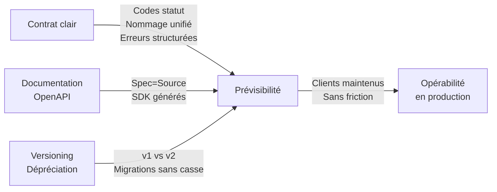

```yaml
---
layout: page
title: "Bonnes pratiques de base pour les API REST"

course: "API REST"
chapter_title: "Fondations"

chapter: 1
section: 5

tags: rest,http,design,architecture,production
difficulty: beginner
duration: 45
mermaid: true

icon: "📐"
domain: "architecture"
domain_icon: "🏗️"
status: "published"
---
```

## Objectifs pédagogiques

À la fin de cette section, vous pourrez :

1. **Identifier** les principes structurels qui distinguent une API bien conçue d'une API fragile
2. **Appliquer** les bonnes pratiques essentielles de nommage, versioning et gestion des erreurs
3. **Anticiper** les pièges courants qui dégradent la robustesse en production
4. **Justifier** vos choix architecturaux face à des contraintes réelles (évolution, consommateurs multiples, maintenance)

---

## Mise en situation

Vous développez une API pour un service de gestion de commandes. Elle existe depuis 6 mois, consommée par 3 équipes externes et 2 applications mobiles. Un jour, vous devez ajouter un nouveau statut de commande. Vous vous posez les vraies questions :

- Comment changer l'API sans casser les clients existants ?
- Qu'en est-il des erreurs malformées qui reviennent du serveur ?
- Vos routes sont nommées `/get_commande` et `/create_commande` — pourquoi ça devient problématique à l'échelle ?
- Un client timeout après 30s — qui teste et détecte ces cas limites ?

**Ces questions n'ont pas de réponse techniquement brillante — elles ont des réponses pragmatiques, issues de l'expérience**. C'est ce module qui les couvre.

---

## Résumé

Une API REST bien conçue n'est pas seulement fonctionnelle — elle est évolutive, prévisible et opérable. Cela repose sur trois piliers : **un contrat clair** (formats, codes de statut cohérents), **la versioning** (évolution sans casser les clients), et **la documentation vivante** (que les consommateurs peuvent consulter en temps réel).

Sans ces pratiques, chaque changement devient une négociation, chaque erreur une surprise, et chaque nouveau client une source de friction. Ce module explique pourquoi ces pratiques existent, comment les mettre en place progressivement, et quand les adapter à votre contexte.

---

## 1. Ce qu'une bonne API doit garantir

Avant d'entrer dans les pratiques, comprendre ce qu'on cherche à obtenir.

Une API REST en production doit **se comporter de manière prévisible**. Cela signifie :

- **Cohérence sémantique** : une ressource nommée `/users` se manipule toujours avec les mêmes verbes HTTP (GET pour lire, POST pour créer), jamais `/get_users` et `/create_user`
- **Contrat stable** : le client n'a pas besoin de vérifier la documentation tous les mois pour savoir comment appeler l'API — la structure reste la même
- **Signalisation claire des erreurs** : quand quelque chose échoue, le client sait pourquoi (format, authentification, logique métier) sans avoir à deviner en lisant une réponse floue
- **Évolution compatible** : on peut ajouter des champs, des endpoints, sans forcer les clients à se mettre à jour immédiatement

Cette prévisibilité ne rend pas l'API brillante techniquement — elle la rend **maintenable et scalable socialement**. C'est la différence entre une API qu'une personne peut utiliser et une qu'une équipe peut supporter.

💡 **Astuce** : une bonne API n'est pas celle qui a le plus de features, c'est celle qu'un nouveau développeur peut apprendre en 20 minutes de lecture de la doc, sans appel à l'équipe qui l'a construite.

---

## 2. Nommage et structure des endpoints : établir un vocabulaire unifié

### Le problème réel

Vous avez vu passer des APIs où les routes ressemblent à :

```
GET  /get_user
POST /create_user
PUT  /update_user/<id>
GET  /fetch_all_users
DELETE /remove_user/<id>
```

Chaque verbe a son propre "action word" dans l'URL. C'est intuitif au premier abord — le nom dit ce qu'il fait. Mais à l'échelle :

- Vous documentez 50 endpoints avec 50 conventions légèrement différentes
- Un nouveau développeur invente `/insert_user` parce qu'il préfère ce terme
- Vous générez du code client où chaque endpoint demande un traitement spécial
- L'évolution devient coûteuse : ajouter un paramètre oblige à nommer une nouvelle route

**La solution** : les verbes HTTP **sont déjà les actions**. On les réutilise systématiquement. L'URL décrit la **ressource**, pas l'opération.

### Principes d'un nommage unifié

**1. L'URL identifie une ressource, pas une opération**

```
# ✅ Bon : ressource = users, opération = GET/POST/PUT/DELETE
GET    /users           # lister
POST   /users           # créer
GET    /users/42        # détail d'un utilisateur
PUT    /users/42        # mettre à jour complètement
PATCH  /users/42        # mise à jour partielle
DELETE /users/42        # supprimer

# ❌ Mauvais : les opérations sont dans l'URL
GET /get_users
POST /create_user
PUT /update_user/42
```

**2. Noms de ressources au pluriel, en minuscules, avec traits d'union (pas underscores)**

```
# ✅ Bon
/api/v1/users
/api/v1/orders
/api/v1/payment-methods
/api/v1/inventory-items

# ❌ Mauvais : singulier, camelCase, underscores
/api/v1/user
/api/v1/Order
/api/v1/payment_methods
/api/v1/inventoryItems
```

Pourquoi ? Cohérence. Les URLs sont des identifiants qui vont apparaître partout (logs, tests, documentation). Une convention uniforme économise de la friction.

**3. Ressources imbriquées pour exprimer la hiérarchie, avec limite à 2 niveaux**

```
# ✅ Clair : les adresses appartiennent à des utilisateurs
GET    /users/42/addresses        # adresses de l'user 42
POST   /users/42/addresses        # créer une adresse pour l'user 42
DELETE /users/42/addresses/7      # supprimer l'adresse 7 de l'user 42

# ⚠️ Trop profond : à éviter
GET /users/42/orders/99/items/3/details   # trop imbriqué, difficile à tester

# ✅ Alternative : utiliser un identifiant plat
GET /order-items/3                # l'item 3 existe, chercher son contexte en base
```

⚠️ **Erreur fréquente** : imbriquer arbitrairement parce que c'est logique. Une imbrication profonde rend l'API difficile à tester et à documenter. Préférez des identifiants plats quand la ressource enfant peut exister seule.

---

## 3. Codes de statut HTTP : un langage partagé avec le client

### Pourquoi les codes de statut importent

Un client reçoit une réponse d'API. Il voit un code de statut : 200, 400, 401, 500. **Avec une bonne API**, ce code dit déjà ce qui s'est passé :

- **2xx** : c'est bon, traiter la réponse normalement
- **4xx** : le client a fait une erreur (mauvais format, pas authentifié, ressource inexistante) — il peut corriger et réessayer, ou pas (selon le code exact)
- **5xx** : l'API s'est trompée — le client devrait peut-être réessayer, peut-être pas immédiatement

Avec une mauvaise API, on voit :

```
POST /orders
Response: 200 OK
Body: { "error": "Payment declined" }
```

Le code dit "succès", la réponse dit "erreur". Un client qui vérifie seulement le code de statut passera à côté de l'erreur.

### Codes de statut essentiels et leur sémantique exacte

| Code | Situation | Exemple |
|------|-----------|---------|
| **200 OK** | Requête réussie, résultat renvoyé | GET user, DELETE user (confirmation) |
| **201 Created** | Ressource créée, renvoyée dans le body | POST /users → crée un user, renvoie le user créé avec ID |
| **204 No Content** | Succès, mais rien à renvoyer | DELETE user sans confirmation, ou PATCH qui change juste des flags |
| **400 Bad Request** | La requête elle-même est mal formée | JSON invalide, champ obligatoire manquant, format de date incorrect |
| **401 Unauthorized** | Pas authentifié ou authentification invalide | Token expiré, Bearer token manquant |
| **403 Forbidden** | Authentifié, mais pas de permission | User A demande les données de User B |
| **404 Not Found** | La ressource n'existe pas | GET /users/9999 alors que seuls les IDs 1-100 existent |
| **409 Conflict** | La requête entre en conflit avec l'état actuel | Mettre à jour un order déjà livré, ou créer un user avec un email qui existe |
| **422 Unprocessable Entity** | Format OK, mais la logique métier la rejette | Date de naissance dans le futur, quantité négative |
| **429 Too Many Requests** | Rate limiting | Client a fait trop de requêtes d'affilée |
| **500 Internal Server Error** | Erreur interne, client pas responsable | Database crash, division par zéro dans le code |
| **503 Service Unavailable** | Serveur temporairement indisponible | Maintenance, surge de traffic → retry possible |

💡 **Astuce** : 400 vs 422 crée souvent de la confusion. **400 = la requête elle-même est syntaxiquement pourrie** (JSON invalide). **422 = la requête est bien formée, mais la logique métier la refuse** (validation échouée). Utilisez 422 si vous le pouvez — c'est plus informatif.

⚠️ **Erreur fréquente** : renvoyer 200 avec un body contenant une erreur. Les clients devront parser le body pour savoir s'il y a vraiment une erreur. Mauvais pour la robustesse et les tests. **Le code de statut est le signal**.

### Structure de réponse d'erreur : être consistant

Quand une erreur survient, le client doit savoir :
1. Qu'est-ce qui s'est mal passé ? (message lisible)
2. Quel code erreur métier ? (pour décider comment réagir)
3. Y a-t-il des détails ? (quel champ, où exactement)

```json
{
  "error": {
    "code": "INVALID_EMAIL_FORMAT",
    "message": "The email address format is invalid",
    "details": {
      "field": "email",
      "provided": "john@",
      "expected": "valid email like user@example.com"
    }
  }
}
```

ou, si plusieurs validations échouent :

```json
{
  "error": {
    "code": "VALIDATION_FAILED",
    "message": "One or more fields are invalid",
    "errors": [
      {
        "field": "email",
        "code": "INVALID_EMAIL_FORMAT",
        "message": "Email format is invalid"
      },
      {
        "field": "age",
        "code": "OUT_OF_RANGE",
        "message": "Age must be between 18 and 120"
      }
    ]
  }
}
```

**Cohérence** : toujours la même structure pour les erreurs, peu importe l'endpoint. Un client développé une fois peut consommer toutes vos erreurs sans surprise.

---

## 4. Versioning : permettre l'évolution sans chaos

### Le dilemme réel

Vous avez une API `GET /users/42` qui renvoie :

```json
{
  "id": 42,
  "name": "Alice",
  "email": "alice@example.com"
}
```

Maintenant, vous devez ajouter un champ `created_at`. Trois optiques :

**Option A : Ajouter le champ partout, sans versioning**
```json
{
  "id": 42,
  "name": "Alice",
  "email": "alice@example.com",
  "created_at": "2024-01-15T10:30:00Z"
}
```

Ça paraît anodin. Mais un client a peut-être codé : `data.keys()` ou `if 'email' in data else ...`. L'ajout de `created_at` peut casser du code client inattendu, surtout en JavaScript/Python faiblement typés.

**Option B : Forcer un upgrade immédiat**
Vous changez l'endpoint en `/users/2/profile`, lancez une version 2 incompatible, et demandez à tous les clients de migrer. Coûteux, imprévisible, frustrant.

**Option C : Versioning progressif**
Vous versionnez l'API (`/api/v1/` vs `/api/v2/`), déployez les deux en parallèle pendant un délai, puis dépréciation graduelle.

**Option C est la norme en production.**

### Stratégies de versioning

**1. Versioning dans l'URL (recommandé, explicite)**

```
/api/v1/users        # version 1
/api/v2/users        # version 2
```

Avantages :
- Clair pour le client quelle version il utilise
- Facile à documenter
- Pas d'ambiguïté sur le routing

Inconvénients :
- Duplication de code backend (mais gérable avec héritage/mixins)
- URL un peu moins élégante

**2. Versioning dans le header (moins courant)**

```
GET /users
Accept: application/vnd.myapi.v2+json
```

Avantages :
- URL "pure", sans bruit
- Négociation fine

Inconvénients :
- Facile à oublier le header, les outils (curl, navigateur) ne l'envoient pas par défaut
- Moins visible dans les logs

**Conseil pratique** : utilisez l'URL sauf si vous avez une raison forte. C'est plus explicite.

### Stratégie de déphasage

```
t=0 : Déployez /api/v2/users avec la nouvelle structure
      Gardez /api/v1/users inchangé
      Documentez le changement et le timing de la migration

t=1 à 6 mois : Les deux versions vivent en parallèle
               Vous encouragez les clients à migrer via la doc et des emails
               Les anciens clients continuent de fonctionner

t=6 mois : Dépréciation — vous continuez de servir v1, mais avec des warnings
           dans les headers : Deprecation: true, Sunset: <date>

t=12 mois : Vous arrêtez v1 — les clients qui ne se sont pas migrés cassent
            (mais ils ont eu 12 mois pour le faire)
```

⚠️ **Erreur fréquente** : ne pas donner de délai. Vous arrêtez v1 demain → production cassée chez le client → appels de panique. Donnez toujours **un préavis visible d'au moins 6 mois**.

---

## 5. Documentation : le contrat exécutable

### Pourquoi la documentation n'est pas un bonus

Une API sans documentation correcte, c'est comme un contrat sans clauses précises : chacun interprète à sa manière.

La doc doit répondre à ces questions **sans ambiguïté** :

1. Comment je m'authentifie ?
2. Pour chaque endpoint, quel est le format exact du body, des params, de la réponse ?
3. Quels codes de statut peuvent survenir et que signifient-ils ?
4. Quels sont les rate limits, les timeouts ?
5. Comment je gère les erreurs ?

### Format recommandé : OpenAPI / Swagger

Au lieu d'écrire de la doc en prose, utilisez une spécification machine : **OpenAPI** (Swagger).

Exemple d'une spec OpenAPI pour GET /users/{id} :

```yaml
openapi: 3.0.0
info:
  title: User API
  version: 1.0.0
  
paths:
  /api/v1/users/{userId}:
    get:
      summary: Get a user by ID
      parameters:
        - name: userId
          in: path
          required: true
          schema:
            type: integer
          example: 42
      responses:
        '200':
          description: User found
          content:
            application/json:
              schema:
                type: object
                properties:
                  id:
                    type: integer
                  name:
                    type: string
                  email:
                    type: string
                    format: email
                  created_at:
                    type: string
                    format: date-time
        '404':
          description: User not found
          content:
            application/json:
              schema:
                $ref: '#/components/schemas/Error'
```

Avantages :
- **Machine-readable** : outils (Postman, swagger-ui, SDK generators) peuvent la lire et générer du code client/server
- **Unique source de vérité** : pas de désync entre doc et implémentation
- **Testable** : vous pouvez valider automatiquement que votre API respecte la spec

💡 **Astuce** : avec une bonne spec OpenAPI, un client peut générer un SDK client (Python, JS, Go...) en une commande. Ça économise des jours de travail manuel.

---

## 6. Idempotence : rendre les retries sûrs

### Le problème

Un client appelle `POST /orders` pour créer une commande. La requête réussit, la commande est créée en base, mais la réponse réseau timeout avant d'arriver au client.

Le client, ne voyant pas de réponse, réessaye. Il crée **deux** commandes au lieu d'une.

**Comment éviter ça ?**

### Idempotence en pratique

**Idempotence** : appeler une opération N fois a le même résultat qu'l'appeler 1 fois.

- **GET, PUT, DELETE sont idempotents par nature** : GET /users/42 renvoie toujours le même user. DELETE /users/42 le supprime une fois, les appels suivants renvoient 404.
- **POST n'est pas idempotent** : POST /orders crée une nouvelle commande à chaque appel.

Pour rendre POST idempotent (ou tout endpoint qui crée une ressource), vous utiliser une **clé d'idempotence** (Idempotency Key).

Le client envoie :

```
POST /orders
Idempotency-Key: "ordre-2024-01-15-alice-42"
Content-Type: application/json

{
  "user_id": 42,
  "items": [...]
}
```

Le serveur stocke une cache : `Idempotency-Key → Réponse`. Si la même clé arrive deux fois, il renvoie la réponse en cache sans créer une deuxième commande.

```
# Première requête → crée, stocke la réponse
POST /orders
Idempotency-Key: "ordre-2024-01-15-alice-42"
→ 201 Created, ID = 999

# Deuxième requête (retry) → trouve la réponse en cache
POST /orders
Idempotency-Key: "ordre-2024-01-15-alice-42"
→ 201 Created, ID = 999 (même réponse)
```

**Format de la clé** : UUID ou string unique par requête, généré par le client. Format recommandé : UUID v4.

⚠️ **Erreur fréquente** : oublier l'idempotence pour les opérations sensibles (paiements, transferts). Un timeout suivi d'un retry peut coûter cher.

---

## 7. Pagination : scaler sans surcharger

### Pourquoi c'est nécessaire

```
GET /orders
```

L'endpoint renvoie toutes les commandes — 500 000 entrées en JSON. Ça :
- Consomme énormément de mémoire serveur
- Prend des minutes à transférer
- Timeouts client
- Est inutile 99% du temps

**La solution** : renvoyer par pages.

### Deux stratégies courantes

**1. Offset-limit (classique, facile)**

```
GET /orders?limit=50&offset=0     # résultats 0-49
GET /orders?limit=50&offset=50    # résultats 50-99
GET /orders?limit=50&offset=100   # résultats 100-149
```

Réponse :
```json
{
  "data": [ /* 50 items */ ],
  "pagination": {
    "total": 500000,
    "limit": 50,
    "offset": 0,
    "has_next": true
  }
}
```

Avantages : simple, intuitif
Inconvénients : lent sur les gros offsets (SELECT ... OFFSET 999999 est coûteux en SQL)

**2. Cursor-based (moderne, scalable)**

```
GET /orders?limit=50&cursor=null         # première page
GET /orders?limit=50&cursor=abc123def    # page suivante (cursor = ID du dernier item)
```

Réponse :
```json
{
  "data": [ /* 50 items */ ],
  "pagination": {
    "cursor": "xyz789abc",
    "has_next": true
  }
}
```

Le `cursor` est un token opaque (base64 du dernier ID vu, ou un timestamp). Le serveur l'utilise pour sauter directement au résultat suivant, sans compter.

Avantages : scalable, même avec des millions de résultats
Inconvénients : un peu plus complexe à implémenter

**Conseil pratique** : commencez avec offset-limit, switch to cursor-based si vous commencez à avoir des perf issues avec des gros offsets.

💡 **Astuce** : limiter le `limit` maximum. Ne pas autoriser `?limit=1000000`. Plafonnez à 100 ou 1000 selon votre contexte.

---

## 8. Bonnes pratiques : synthèse et pièges évités

Voici un tableau des pratiques couvertes et ce qu'elles préviennent :

| Pratique | Piège évité | Signal d'une mauvaise mise en place |
|----------|-------------|-----------------------------------|
| **Nommage unifié** | Endpoints en désordre, code client complexe | `GET /get_users` ET `/fetch_all_users` existent tous les deux |
| **Codes de statut corrects** | Client qui ne sait pas si c'est une erreur, retries inutiles | Réponse 200 OK avec `error: "..."` dans le body |
| **Versioning** | Forcer des upgrades, casser la prod chez les clients | Ajouter un champ nouveau sans v2, les clients cassent |
| **Idempotence** | Créations dupliquées en cas de retry | Un timeout réseau crée deux commandes |
| **Pagination** | Timeouts, mémoire débordée | `GET /orders` renvoie 500 000 items sans pagination |
| **Documentation OpenAPI** | Désync entre doc et code, friction client | Spec décrit v1, le serveur sert v2 incompatible |

---

## 9. Cas réel : refactorisation d'une API fragile

### Situation initiale

Une startup a une API de e-commerce, 2 ans de prod, 15 endpoints, 5 clients mobiles/web internes.

**État des lieux :**
- Routes : `/get_product`, `/add_to_cart`, `/checkout`, `/fetch_order_history`
- Erreurs : tout est 200 OK, erreur dans le body
- Docs : un Google Doc de 30 pages, jamais à jour
- Clients : chacun gère les erreurs différemment (certains parsent le JSON, d'autres font du regex sur les strings)

### Étapes de refactorisation

**Phase 1 (semaine 1-2) : Audit et spéc**
- Lister tous les endpoints actuels
- Écrire une spec OpenAPI v1 décrivant l'état actuel
- Identifier les incohérences

**Phase 2 (semaine 3-4) : Nommer v2**
- Créer `/api/v2/` avec les routes renommées
- `/get_product` → `GET /api/v2/products/{id}`
- `/add_to_cart` → `POST /api/v2/carts/{cartId}/items`
- `/checkout` → `POST /api/v2/orders` (crée une commande directement, plus simple)
- V1 reste inchangée

**Phase 3 (semaine 5-6) : Implémenter les bonnes pratiques dans v2**
- Codes de statut corrects (201 pour création, 400/422 pour validation)
- Structure d'erreur uniforme
- Headers de réponse cohérents (Content-Type, Rate-Limit, etc.)

**Phase 4 (semaine 7+) : Migration graduelle**
- Déployer v2 en parallèle de v1
- Clients internes migrent petit à petit (pendant 3 mois)
- Après 3 mois : v1 en dépréciation, warning dans les headers
- Après 6 mois : v1 arrêté

### Résultat mesurable

Avant refacto :
- Temps moyen pour intégrer un nouveau client : 5 jours (lecture du doc mal à jour + call avec l'équipe)
- Bugs liés aux erreurs mal gérées : 2-3 par sprint
- Maintenance : 15-20% du temps d'équipe

Après 6 mois :
- Temps pour intégrer un nouveau client : 1 jour (spec OpenAPI claire + SDK généré)
- Bugs d'intégration : quasi zéro
- Maintenance : 5% du temps d'équipe (moins de support sur "comment utiliser l'API")

---

## 10. Checklist de déploiement

Avant de mettre une API en production ou de la modifier, vérifiez :

- [ ] **Nommage** : routes au pluriel, verbes dans la méthode HTTP, pas d'underscores
- [ ] **Codes de statut** : 2xx pour succès, 4xx pour erreur client, 5xx pour erreur serveur — jamais de 200 pour une erreur
- [ ] **Erreurs structurées** : tous les erreurs suivent le même schéma JSON (code, message, details optionnels)
- [ ] **Documentation** : spec OpenAPI à jour, testable avec swagger-ui ou Postman
- [ ] **Versioning** : v1 ou plus, avec chemin clair de déphasage si vous changez l'API
- [ ] **Idempotence** : endpoints de création acceptent un Idempotency-Key optionnel
- [ ] **Pagination** : endpoint qui renvoie des listes → pagine avec limit/offset ou cursor
- [ ] **Rate limiting** : headers de limit inclus dans les réponses (X-RateLimit-*)
- [ ] **CORS** : si called from browser, headers CORS correctement configurés
- [ ] **Timeouts** : client et serveur ont des timeouts sensibles (pas 5 min par défaut)
- [ ] **Logs** : chaque requête loggée avec ID unique (request ID) pour tracer en prod

---

## Résumé visuel : Les 3 piliers



---

<!-- snippet
id: rest_endpoint_naming_structure
type: concept
tech: rest
level: beginner
importance: high
format: knowledge
tags: rest,naming,structure,endpoints
title: Structure des endpoints REST : ressources et verbes HTTP
context: Lors de la conception d'un nouvel endpoint
description: URL = identifie la ressource (pluriel, minuscules), méthode HTTP = l'opération (GET/POST/PUT/DELETE). GET /users/42 récupère, DELETE /users/42 supprime — sans action words dans l'URL. Économise la duplication de conventions.
content: Une URL REST décrit une ressource, pas une opération. Exemple — POST /users (crée un user), GET /users/42 (récupère user 42), DELETE /users/42 (supprime). Les verbes HTTP GET, POST, DELETE, etc. portent l'action. Ne jamais faire /get_users ou /delete_user/42. Résultat — tout endpoint suit le même pattern, un nouveau dev apprend une fois et applique partout.
-->

<!-- snippet
id: rest_http_status_codes_semantics
type: concept
tech: rest
level: beginner
importance: high
format: knowledge
tags: rest,http,status-codes,error-handling
title: Codes HTTP : 2xx succès, 4xx client error, 5xx server error
context: Quand votre API reçoit une requête et génère une réponse
description: Code 200 = requête réussie avec réponse. 201 = ressource créée et renvoyée. 400 = requête syntaxiquement mauvaise. 401 = pas authentifié. 404 = ressource absente. 500 = serveur s'est trompé. Le code dit au client quoi faire — réessayer, corr
