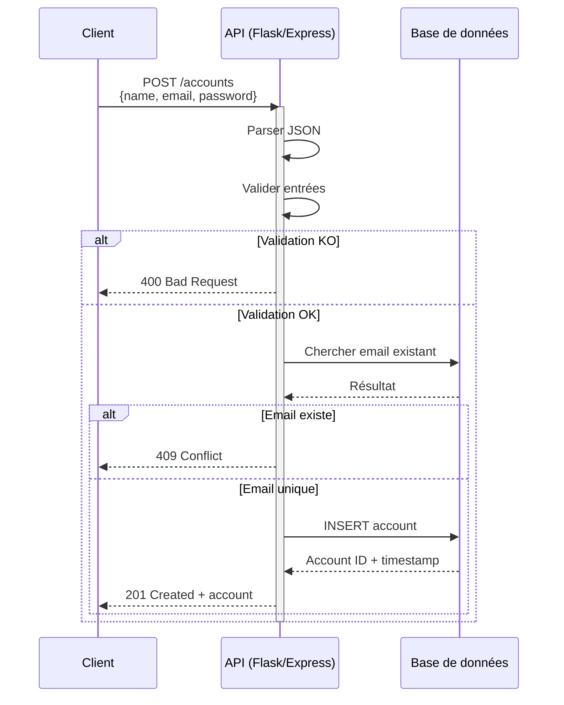

## Objectifs pédagogiques

À la fin de ce module, vous serez capable de :

- **Concevoir** une API REST en définissant ses routes, méthodes HTTP et contrats de données (request/response)
- **Implémenter** une API fonctionnelle avec une librairie standard (Flask, Express, FastAPI) en gérant les erreurs et les codes de statut appropriés
- **Documenter** une API de manière à ce qu'un client externe puisse l'intégrer sans poser de questions
- **Tester** une API en production selon des critères de fiabilité et de contrat
- **Sécuriser** une API avec authentification et validation basique des entrées

---

## Mise en situation

Vous travaillez dans une startup fintech. Votre équipe a besoin d'une API interne pour gérer les **comptes utilisateur** : création, consultation, mise à jour, suppression. Cette API sera appelée par :
- Un frontend web (React)
- Une application mobile (React Native)
- Des tâches batch (script Python)
- D'autres microservices internes

Pas de graphe complexe, pas d'authentification OAuth : juste un **contrat HTTP solide, documenté et testable** que vos collègues peuvent utiliser sans ambiguïté.

C'est ce module qui vous permettra de livrer ça.

---

## Contexte : Pourquoi une API et pas un monolithe ?

Une API REST est un **contrat explicite entre deux systèmes**. Au lieu de laisser votre client React fouiller directement dans votre base de données, vous créez un point d'entrée contrôlé :

- **Contrat clair** : "pour créer un compte, tu envoies POST /accounts avec {name, email}, tu reçois {id, created_at} ou une erreur 400"
- **Validation centralisée** : un seul endroit où checker les emails, les doublons, les permissions
- **Versioning possible** : tu peux changer la base de données sans casser les clients — tu maintiens juste le contrat HTTP
- **Décuplage** : ton frontend n'a pas besoin de connaître ta stack backend — il suffit qu'il parle HTTP

Sans API, chaque client reimplémenterait la logique métier. Avec l'API, c'est une seule source de vérité.

🧠 **Fondamental** : une API n'est pas un backend complet. C'est la couche de communication. Le backend gère la base de données, l'authentification, les jobs — l'API expose ce qu'on en veut.

---

## Conception d'une API : le contrat avant le code

Avant d'ouvrir ton IDE, **définir le contrat**. C'est le travail le plus critique.

### Étape 1 : lister les besoins

Pour notre système de comptes, on a besoin de :

| Opération | Exemple d'appel | Réponse attendue |
|-----------|-----------------|------------------|
| Créer un compte | POST /accounts avec {name, email, password} | 201 + {id, name, email, created_at} |
| Lister les comptes | GET /accounts | 200 + [{id, name, email, ...}, ...] |
| Récupérer 1 compte | GET /accounts/{id} | 200 + {id, name, email, ...} ou 404 |
| Modifier un compte | PATCH /accounts/{id} avec {name} | 200 + {id, name, ...} ou 400/404 |
| Supprimer un compte | DELETE /accounts/{id} | 204 (no content) ou 404 |

### Étape 2 : fixer les contraintes

🧠 Questions avant de coder :

- **Authentification ?** Pour ce module : aucune (exemple de base). En prod : tu ajouterais un Bearer token.
- **Pagination ?** Champs optionnels sur GET /accounts : `?limit=10&offset=0`.
- **Filtrage ?** `GET /accounts?email=alice@example.com` pour chercher un compte par email.
- **Validation** : email doit être valide, name ne peut pas être vide, password au moins 8 caractères.
- **Unicité** : deux comptes ne peuvent pas partager le même email.

### Étape 3 : documenter le contrat (OpenAPI / Swagger)

Exemple simplifié pour POST /accounts :

```yaml
POST /accounts:
  description: "Crée un nouveau compte utilisateur"
  request_body:
    name: string, min 1 char
    email: string, valid email format
    password: string, min 8 chars
  responses:
    201:
      id: integer
      name: string
      email: string
      created_at: ISO 8601 timestamp
    400:
      error: string
      details: object
    409:
      error: "Email already exists"
```

Tu peux écrire ça en YAML/JSON (OpenAPI 3.0) ou en Markdown. L'important : c'est explicite et lisible.

💡 **Astuce de pro** : avant de coder la première ligne, envoie ce contrat à une personne de ton équipe. Demande-lui "tu comprends comment utiliser cette API ?" Si elle hésite, le contrat n'est pas clair.

---

## Implémentation : du zéro à l'API fonctionnelle

Je vais montrer trois approches : Python (Flask), Node.js (Express), et une brève comparaison. Choisis celle qui matches ton stack.

### Version 1 : Minimal (en mémoire)

On commence simple : pas de base de données, juste une liste Python. Objectif : voir la structure HTTP.

**Python / Flask :**

```python
from flask import Flask, request, jsonify
from datetime import datetime
from uuid import uuid4

app = Flask(__name__)

# Stockage temporaire (en prod : base de données)
accounts = {}

# Créer un compte
@app.route('/accounts', methods=['POST'])
def create_account():
    # Extraire les données du body JSON
    data = request.get_json()
    
    # Valider les entrées
    if not data or not data.get('name'):
        return jsonify({"error": "name is required"}), 400
    
    if not data.get('email'):
        return jsonify({"error": "email is required"}), 400
    
    # Vérifier l'unicité de l'email
    if any(acc['email'] == data['email'] for acc in accounts.values()):
        return jsonify({"error": "Email already exists"}), 409
    
    # Créer le compte
    account_id = str(uuid4())
    account = {
        'id': account_id,
        'name': data['name'],
        'email': data['email'],
        'created_at': datetime.utcnow().isoformat()
    }
    accounts[account_id] = account
    
    # Retourner 201 + le compte créé
    return jsonify(account), 201


# Récupérer tous les comptes
@app.route('/accounts', methods=['GET'])
def list_accounts():
    return jsonify(list(accounts.values())), 200


# Récupérer 1 compte
@app.route('/accounts/<account_id>', methods=['GET'])
def get_account(account_id):
    if account_id not in accounts:
        return jsonify({"error": "Account not found"}), 404
    
    return jsonify(accounts[account_id]), 200


# Modifier un compte
@app.route('/accounts/<account_id>', methods=['PATCH'])
def update_account(account_id):
    if account_id not in accounts:
        return jsonify({"error": "Account not found"}), 404
    
    data = request.get_json()
    
    # Ne mettre à jour que les champs autorisés
    if 'name' in data:
        accounts[account_id]['name'] = data['name']
    
    return jsonify(accounts[account_id]), 200


# Supprimer un compte
@app.route('/accounts/<account_id>', methods=['DELETE'])
def delete_account(account_id):
    if account_id not in accounts:
        return jsonify({"error": "Account not found"}), 404
    
    del accounts[account_id]
    
    # 204 No Content : suppression réussie, rien à retourner
    return '', 204


if __name__ == '__main__':
    app.run(debug=True, port=5000)
```

**Node.js / Express :**

```javascript
const express = require('express');
const { v4: uuidv4 } = require('uuid');

const app = express();
app.use(express.json()); // Middleware pour parser JSON

// Stockage temporaire
const accounts = {};

// Créer un compte
app.post('/accounts', (req, res) => {
  const { name, email } = req.body;
  
  // Valider
  if (!name) {
    return res.status(400).json({ error: 'name is required' });
  }
  if (!email) {
    return res.status(400).json({ error: 'email is required' });
  }
  
  // Vérifier l'unicité
  if (Object.values(accounts).some(acc => acc.email === email)) {
    return res.status(409).json({ error: 'Email already exists' });
  }
  
  // Créer
  const id = uuidv4();
  const account = {
    id,
    name,
    email,
    created_at: new Date().toISOString()
  };
  accounts[id] = account;
  
  return res.status(201).json(account);
});

// Lister
app.get('/accounts', (req, res) => {
  return res.status(200).json(Object.values(accounts));
});

// Récupérer 1
app.get('/accounts/:accountId', (req, res) => {
  const { accountId } = req.params;
  if (!accounts[accountId]) {
    return res.status(404).json({ error: 'Account not found' });
  }
  return res.status(200).json(accounts[accountId]);
});

// Modifier
app.patch('/accounts/:accountId', (req, res) => {
  const { accountId } = req.params;
  if (!accounts[accountId]) {
    return res.status(404).json({ error: 'Account not found' });
  }
  
  const { name } = req.body;
  if (name) {
    accounts[accountId].name = name;
  }
  
  return res.status(200).json(accounts[accountId]);
});

// Supprimer
app.delete('/accounts/:accountId', (req, res) => {
  const { accountId } = req.params;
  if (!accounts[accountId]) {
    return res.status(404).json({ error: 'Account not found' });
  }
  
  delete accounts[accountId];
  return res.status(204).send();
});

app.listen(5000, () => console.log('API running on :5000'));
```

**Points clés observés :**

- **Route + méthode** : `POST /accounts` crée, `GET /accounts/<id>` récupère
- **Codes de statut** : 201 création réussie, 200 lecture, 204 suppression, 400 validation, 404 non trouvé, 409 conflit (email existe)
- **request.get_json()** / `req.body` : extraction des données envoyées par le client
- **Validation** : avant la logique, vérifier les entrées
- **Réponses cohérentes** : chaque endpoint retourne JSON + un code HTTP

⚠️ **Erreur fréquente** : retourner 200 partout (même pour les erreurs). Résultat : le client ne sait pas si ça a marché. Les codes HTTP existent pour ça.

---

### Version 2 : Avec une vraie base de données

Pour garder ça court, j'utilise SQLite + SQLAlchemy (Python).

```python
from flask import Flask, request, jsonify
from flask_sqlalchemy import SQLAlchemy
from datetime import datetime
import os

app = Flask(__name__)
app.config['SQLALCHEMY_DATABASE_URI'] = 'sqlite:///accounts.db'
db = SQLAlchemy(app)

# Modèle de données
class Account(db.Model):
    id = db.Column(db.String(36), primary_key=True)
    name = db.Column(db.String(255), nullable=False)
    email = db.Column(db.String(255), unique=True, nullable=False)
    password_hash = db.Column(db.String(255), nullable=False)  # En prod : bcrypt
    created_at = db.Column(db.DateTime, default=datetime.utcnow)

# Créer les tables au démarrage
with app.app_context():
    db.create_all()

@app.route('/accounts', methods=['POST'])
def create_account():
    data = request.get_json()
    
    # Validation
    if not data.get('name'):
        return jsonify({"error": "name is required"}), 400
    
    if not data.get('email'):
        return jsonify({"error": "email is required"}), 400
    
    if not data.get('password') or len(data['password']) < 8:
        return jsonify({"error": "password must be at least 8 chars"}), 400
    
    # Vérifier doublon
    if Account.query.filter_by(email=data['email']).first():
        return jsonify({"error": "Email already exists"}), 409
    
    # Créer et persister
    from uuid import uuid4
    import hashlib
    
    account = Account(
        id=str(uuid4()),
        name=data['name'],
        email=data['email'],
        password_hash=hashlib.sha256(data['password'].encode()).hexdigest()
    )
    db.session.add(account)
    db.session.commit()
    
    return jsonify({
        'id': account.id,
        'name': account.name,
        'email': account.email,
        'created_at': account.created_at.isoformat()
    }), 201

@app.route('/accounts/<account_id>', methods=['GET'])
def get_account(account_id):
    account = Account.query.get(account_id)
    if not account:
        return jsonify({"error": "Account not found"}), 404
    
    return jsonify({
        'id': account.id,
        'name': account.name,
        'email': account.email,
        'created_at': account.created_at.isoformat()
    }), 200

@app.route('/accounts/<account_id>', methods=['PATCH'])
def update_account(account_id):
    account = Account.query.get(account_id)
    if not account:
        return jsonify({"error": "Account not found"}), 404
    
    data = request.get_json()
    if 'name' in data:
        account.name = data['name']
    
    db.session.commit()
    
    return jsonify({
        'id': account.id,
        'name': account.name,
        'email': account.email,
        'created_at': account.created_at.isoformat()
    }), 200

@app.route('/accounts/<account_id>', methods=['DELETE'])
def delete_account(account_id):
    account = Account.query.get(account_id)
    if not account:
        return jsonify({"error": "Account not found"}), 404
    
    db.session.delete(account)
    db.session.commit()
    
    return '', 204

if __name__ == '__main__':
    app.run(debug=True, port=5000)
```

**Changements clés :**

- **Modèle ORM** : `Account` définit la structure (champs, contraintes)
- **Unicité** : `unique=True` sur email — la base de données refuse les doublons
- **Persistance** : `db.session.add()` + `db.session.commit()` sauvegardent les données
- **Hachage de password** : jamais stocker le password en clair (voir section "Bonnes pratiques")

💡 **Progression naturelle** : v1 te laisse tester la logique HTTP, v2 ajoute la réalité (base de données). Tu peux même tester la v1 en mémoire d'abord, puis migrer vers v2 sans changer les routes.

---

### Version 3 : Production-ready

En production, tu ajouterais :

```python
# Authentification
from flask_jwt_extended import JWTManager, create_access_token, jwt_required

# Rate limiting
from flask_limiter import Limiter

# Validation stricte
from marshmallow import Schema, fields, validate, ValidationError

# Logging
import logging
logger = logging.getLogger(__name__)

# Schéma de validation (input/output)
class AccountSchema(Schema):
    name = fields.String(required=True, validate=validate.Length(min=1, max=255))
    email = fields.Email(required=True)
    password = fields.String(required=True, validate=validate.Length(min=8))

schema = AccountSchema()

# JWT pour authentifier les clients
jwt = JWTManager(app)

# Rate limiting : max 100 requêtes par minute par IP
limiter = Limiter(
    app=app,
    key_func=lambda: request.remote_addr,
    default_limits=["100 per minute"]
)

@app.route('/accounts', methods=['POST'])
@limiter.limit("5 per minute")  # Création : plus restrictif
def create_account():
    try:
        # Valider contre le schéma
        data = schema.load(request.get_json())
    except ValidationError as e:
        logger.warning(f"Validation error: {e.messages}")
        return jsonify({"error": "Validation failed", "details": e.messages}), 400
    
    # ... reste du code ...
    
    logger.info(f"Account created: {account.id}")
    return jsonify(...), 201

@app.route('/accounts/<account_id>', methods=['GET'])
@jwt_required()  # Require Bearer token
def get_account(account_id):
    # ... reste du code ...
```

En production réel :
- **Authentification JWT** : chaque request doit avoir un header `Authorization: Bearer <token>`
- **Rate limiting** : évite que des bots écrasent l'API
- **Validation stricte** : refuser les inputs invalides AVANT de toucher la base
- **Logging** : tracer qui fait quoi (audit trail)
- **CORS** : si le frontend est sur un autre domaine, l'API doit autoriser les requests cross-origin
- **HTTPS** : jamais envoyer du contenu sensible en HTTP clair

⚠️ **Erreur courante** : oublier la validation. Un attaquant envoie `name=<script>alert()</script>`, tu la sauvegardes, puis tu la renvois au frontend → XSS. Toujours nettoyer et valider les entrées.

---

## Diagramme : flux d'une requête API



---

## Comparaison : Flask vs Express vs FastAPI

| Critère | Flask | Express | FastAPI |
|---------|-------|---------|---------|
| **Langage** | Python | JavaScript (Node) | Python |
| **Courbe d'apprentissage** | Facile | Facile | Moyenne (type hints) |
| **Performance** | Moyenne (WSGI) | Bonne (V8 engine) | Excellente (async/await) |
| **Écosystème** | Riche (data science) | Énorme (npm) | Croissant rapide |
| **Type checking** | Non natif | Optional (TypeScript) | Natif (Pydantic) |
| **Documentation auto** | Manuelle (Swagger) | Manuelle | Auto (Swagger inclus) |
| **Async natif** | Non (via extensions) | Non (callbacks) | Oui (async/await) |
| **Cas d'usage** | API simple, prototypes | API légère, temps réel | API haute perf, validation stricte |

💡 **Intuition** : Flask pour commencer, Express si tu es déjà en JavaScript, FastAPI si tu veux de la perfo + validation automatique.

---

## Prise de décision : quel framework choisir ?

**Choisis Flask si :**
- Tu prototypes vite, tu reprendrais le code plus tard
- Ton équipe code déjà en Python (Django, scripts)
- Tu veux une simple CRUD sans usines à gaz

**Choisis Express si :**
- Tu as un frontend React/Vue et tu veux réutiliser la compétence JS
- Tu as besoin de websockets (temps réel)
- L'écosystème npm couvre déjà tes besoins (auth, cache, etc.)

**Choisis FastAPI si :**
- Tu veux une API haute performance dès le départ
- Tu écrirais de la validation Pydantic de toute façon (data science, ML)
- Tu veux de la documentation Swagger sans effort

**Compromis recommandé en startup** : Express (une seule compétence JS) ou Flask (si l'équipe est Python).

---

## Cas d'utilisation réels

### 1. Créer un compte — validation stricte

```python
@app.route('/accounts', methods=['POST'])
def create_account():
    data = request.get_json()
    
    # Valider email format
    import re
    if not re.match(r'^[^@]+@[^@]+\.[^@]+$', data.get('email', '')):
        return jsonify({"error": "Invalid email format"}), 400
    
    # Valider nom (pas vide, pas trop long)
    name = data.get('name', '').strip()
    if not name or len(name) > 255:
        return jsonify({"error": "Name must be 1-255 chars"}), 400
    
    # Valider password
    password = data.get('password', '')
    if len(password) < 8:
        return jsonify({"error": "Password must be at least 8 chars"}), 400
    if not re.search(r'[A-Z]', password):
        return jsonify({"error": "Password must contain uppercase"}), 400
    
    # Vérifier email unique
    if Account.query.filter_by(email=data['email']).first():
        return jsonify({"error": "Email already in use"}), 409
    
    # Créer et sauvegarder
    from uuid import uuid4
    import bcrypt
    
    account = Account(
        id=str(uuid4()),
        name=name,
        email=data['email'],
        password_hash=bcrypt.hashpw(
            password.encode(),
            bcrypt.gensalt()
        ).decode()
    )
    db.session.add(account)
    db.session.commit()
    
    return jsonify({
        'id': account.id,
        'name': account.name,
        'email': account.email,
        'created_at': account.created_at.isoformat()
    }), 201
```

**Résultat attendu** :

```bash
curl -X POST http://localhost:5000/accounts \
  -H "Content-Type: application/json" \
  -d '{
    "name": "Alice",
    "email": "alice@example.com",
    "password": "SecurePass123"
  }'

# Réponse (201)
{
  "id": "550e8400-e29b-41d4-a716-446655440000",
  "name": "Alice",
  "email": "alice@example.com",
  "created_at": "2024-01-15T10:30:00.000000"
}
```

### 2. Récupérer un compte inexistant

```python
@app.route('/accounts/<account_id>', methods=['GET'])
def get_account(account_id):
    account = Account.query.get(account_id)
    
    if not account:
        return jsonify({
            "error": "Account not found",
            "requested_id": account_id
        }), 404
    
    return jsonify({
        'id': account.id,
        'name': account.name,
        'email': account.email,
        'created_at': account.created_at.isoformat()
    }), 200
```

**Résultat attendu** :

```bash
curl http://localhost:5000/accounts/invalid-id

# Réponse (404)
{
  "error": "Account not found",
  "requested_id": "invalid-id"
}
```

### 3. Lister avec pagination

```python
@app.route('/accounts', methods=['GET'])
def list_accounts():
    # Paramètres de pagination (optionnels)
    limit = request.args.get('limit', 10, type=int)
    offset = request.args.get('offset', 0, type=int)
    
    # Valider limites raisonnables
    if limit > 100:
        limit = 100
    if offset < 0:
        offset = 0
    
    # Requête paginée
    query = Account.query.offset(offset).limit(limit)
    accounts = query.all()
    total = Account.query.count()
    
    return jsonify({
        'accounts': [
            {
                'id': acc.id,
                'name': acc.name,
                'email': acc.email,
                'created_at': acc.created_at.isoformat()
            }
            for acc in accounts
        ],
        'pagination': {
            'offset': offset,
            'limit': limit,
            'total': total
        }
    }), 200
```

**Résultat attendu** :

```bash
curl "http://localhost:5000/accounts?limit=5&offset=0"

# Réponse (200)
{
  "accounts": [...],
  "pagination": {
    "offset": 0,
    "limit": 5,
    "total": 47
  }
}
```

---

## Erreurs fréquentes et corrections

### ❌ Erreur 1 : Retourner toujours 200, même en cas d'erreur

```python
# ❌ Mauvais
@app.route('/accounts', methods=['POST'])
def create_account():
    data = request.get_json()
    if not data.get('email'):
        return jsonify({"message": "No email"}), 200  # 200 ??? 

# ✅ Correct
@app.route('/accounts', methods=['POST'])
def create_account():
    data = request.get_json()
    if not data.get('email'):
        return jsonify({"error": "email is required"}), 400
```

**Pourquoi** : le client (ton frontend) teste `if status == 200` pour savoir si ça a marché. Avec 200 partout, impossible de distinguer succès et erreur.

**Correction** : utiliser les bons codes HTTP :
- **2xx** : succès
- **4xx** : erreur du client (validation, authentification, non trouvé)
- **5xx** : erreur serveur (bug, base de données down)

---

### ❌ Erreur 2 : Négliger la validation, stocker n'importe quoi

```python
# ❌ Mauvais
@app.route('/accounts', methods=['POST'])
def create_account():
    data = request.get_json()
    account = Account(
        name=data.get('name'),  # Et si c'est null ? Un entier ?
        email=data.get('email')  # Et si ça casse la base ?
    )
    db.session.add(account)
    db.session.commit()  # Crash à 23h un dimanche...

# ✅ Correct
@app.route('/accounts', methods=['POST'])
def create_account():
    data = request.get_json() or {}
    
    # Vérifier les champs obligatoires
    required = ['name', 'email']
    missing = [f for f in required if f not in data]
    if missing:
        return jsonify({"error": f"Missing fields: {missing}"}), 400
    
    # Valider les types
    if not isinstance(data['name'], str):
        return jsonify({"error": "name must be a string"}), 400
    
    # Valider les valeurs
    if not data['name'].strip():
        return jsonify({"error": "name cannot be empty"}), 400
    
    # Continuer seulement si tout est bon
    account = Account(name=data['name'], email=data['email'])
    db.session.add(account)
    db.session.commit()
```

**Pourquoi** : un client peut envoyer n'importe quoi. À toi de refuser.

---

### ❌ Erreur 3 : Exposer des informations sensibles

```python
# ❌ Mauvais
@app.route('/accounts/<account_id>', methods=['GET'])
def get_account(account_id):
    account = Account.query.get(account_id)
    return jsonify({
        'id': account.id,
        'name': account.name,
        'email': account.email,
        'password_hash': account.password_hash,  # JAMAIS !
        'internal_id': account.database_id  # JAMAIS !
    }), 200

# ✅ Correct
@app.route('/accounts/<account_id>', methods=['GET'])
def get_account(account_id):
    account = Account.query.get(account_id)
    return json