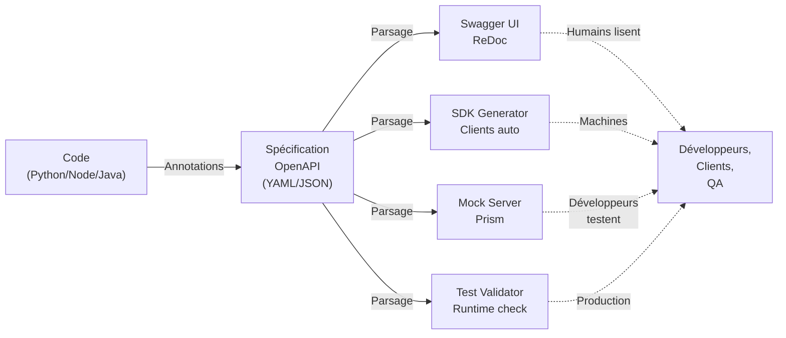

## Objectifs pédagogiques

À la fin de ce module, vous serez capable de :

- **Écrire une spécification OpenAPI** qui décrit précisément les contrats de votre API (endpoints, paramètres, réponses, codes d'erreur)
- **Distinguer la documentation vivante de la doc statique** et mettre en place un processus où la spécification reste synchronisée avec le code
- **Utiliser la génération automatique** pour transformer une spécification en client SDK ou serveur, réduisant les décalages entre doc et réalité
- **Décider quand documenter** : endpoints publics, formats de réponse, cas d'erreur — et quand une doc sommaire suffit

---

## Mise en situation

Vous êtes backend chez un éditeur SaaS. Votre API accepte actuellement 40 endpoints répartis sur trois domaines métier (users, invoices, integrations).

Le problème : la documentation vit dans un Google Doc, mise à jour une fois tous les deux mois. Les clients tentent d'appeler des paramètres qui n'existent plus, les frontends attendent des champs qui arrivent six mois après, les QA testent des codes HTTP erronés.

Quand vous changez le format d'une réponse — par exemple, `user.email` passe de string à objet `{ value, verified_at }` — seuls deux frontends sur cinq s'en aperçoivent rapidement. Les autres découvrent la casse en prod, trois jours après le déploiement.

Vous avez une équipe de 15 développeurs, dont 8 qui consomment l'API depuis des services extérieurs (mobile, admin, partner integrations). Rédiger la doc à la main, c'est :
- Répétitif (énumérer les 15 paramètres de `/users/{id}/bulk-update`)
- Hors sync (un commit change la réponse, personne ne met à jour la doc)
- Peu testable (vous ne savez pas si les exemples donnés marchent encore)

**Votre besoin réel :** une source unique de vérité, directement lisible par humains et machines, qui génère des clients, valide les requêtes en runtime et s'actualise quand le code change.

---

## Pourquoi la documentation ne suffit pas (et pourquoi c'est un piège)

Avant de voir *comment* documenter, comprenons *pourquoi* la doc classique crée des problèmes en prod.

### Le cycle "documentation en retard"

```
Jeudi 10h → Dev déploie /api/v2/users/{id}
Jeudi 15h → Slack du frontend : "j'appelle ça comment ?"
Vendredi 9h → Doc mise à jour dans le Wiki
Mercredi suivant → Client externe découvre l'endpoint via Postman, car la doc n'était pas là
```

Le problème n'est pas la doc : c'est qu'elle n'est pas *générée* du code. C'est un document séparé qui doit être synchronisé manuellement.

### Le piège : "Une bonne doc suffit"

Une doc texte bien écrite aide le lecteur, mais elle ne change rien au vrai problème : vous avez *deux sources de vérité* (le code et la doc), et elles divergent.

Exemple concret :
- Code dit : `POST /invoices` retourne 201 avec `{ id, status, created_at }`
- Doc (écrite il y a 3 mois) dit : retourne 200 avec `{ id, status }`
- Client attend 200, reçoit 201, pense que c'est une erreur
- QA teste avec le code en retard
- Pas de bug à signaler, juste une friction quotidienne

💡 **Astuce** — La vraie doc, c'est le code. La documentation écrite, c'est seulement le contexte autour.

---

## OpenAPI : la source unique de vérité

**OpenAPI** (anciennement Swagger) est une spécification qui décrit une API REST en YAML ou JSON, de manière structurée et lisible par les machines.

Contrairement à un Google Doc, une spécification OpenAPI :
- ✅ Est parsée par les outils (validation, génération de client, tests)
- ✅ Peut vivre dans le repo Git, versionnée avec le code
- ✅ Peut être générée automatiquement du code (annotations, introspection)
- ✅ Peut être servie en HTTP et lue par des UI (Swagger UI, ReDoc)

### Anatomie minimaliste d'une spécification OpenAPI

```yaml
openapi: 3.0.0
info:
  title: API Invoicing
  version: 2.1.0
  description: Gestion des factures et paiements
servers:
  - url: https://api.example.com
    description: Production
  - url: https://staging-api.example.com
    description: Staging

paths:
  /invoices:
    get:
      summary: Lister les factures
      operationId: listInvoices
      tags:
        - invoices
      parameters:
        - name: status
          in: query
          schema:
            type: string
            enum: [draft, sent, paid, overdue]
          description: Filtrer par statut
      responses:
        '200':
          description: Liste des factures
          content:
            application/json:
              schema:
                type: array
                items:
                  $ref: '#/components/schemas/Invoice'
        '401':
          description: Non authentifié

    post:
      summary: Créer une facture
      operationId: createInvoice
      tags:
        - invoices
      requestBody:
        required: true
        content:
          application/json:
            schema:
              $ref: '#/components/schemas/InvoiceCreate'
      responses:
        '201':
          description: Facture créée
          content:
            application/json:
              schema:
                $ref: '#/components/schemas/Invoice'
        '400':
          description: Données invalides
        '401':
          description: Non authentifié

components:
  schemas:
    Invoice:
      type: object
      required:
        - id
        - number
        - amount
        - status
        - created_at
      properties:
        id:
          type: string
          format: uuid
        number:
          type: string
          example: INV-2024-001
        amount:
          type: number
          format: float
          example: 1250.50
        status:
          type: string
          enum: [draft, sent, paid, overdue]
        created_at:
          type: string
          format: date-time
        items:
          type: array
          items:
            $ref: '#/components/schemas/InvoiceItem'

    InvoiceCreate:
      type: object
      required:
        - number
        - amount
      properties:
        number:
          type: string
        amount:
          type: number
          format: float
        currency:
          type: string
          default: EUR

    InvoiceItem:
      type: object
      required:
        - description
        - quantity
        - unit_price
      properties:
        description:
          type: string
        quantity:
          type: integer
        unit_price:
          type: number
          format: float
```

🧠 **Concept clé** — Cette spécification décrit le *contrat* : quels endpoints existent, quels paramètres acceptent, quels codes de statut retournent, quels objets JSON ils contiennent. Aucun détail d'implémentation (base de données, langage, framework). C'est précisément ce qu'un consommateur doit savoir.

### Ce que vous gagnez immédiatement

| Outil | Ce qu'il fait |
|-------|---------------|
| **Swagger UI** | Affiche une UI interactive : lister les endpoints, essayer les requêtes en direct, voir les réponses d'exemple |
| **Redoc** | Génère une doc HTML/CSS professionnelle, lisible sur mobile |
| **openapi-generator** | Produit un client Python/JS/Java/Go à partir de la spec |
| **Prism** | Mock serveur : simule l'API en local pour les frontends (avant que le backend ne soit prêt) |
| **Validators** | Valide les requêtes/réponses vs la spec en runtime |

---

## Architecture : De la spécification à la doc vivante



Le flux classique pour rester en sync :

1. **Vous écrivez la spécification OpenAPI** (YAML)
2. **Vous la versionnez** dans Git, au même endroit que le code
3. **Votre serveur la sert** sur `GET /openapi.json` ou `GET /api-docs`
4. **Un outil l'affiche** (Swagger UI hébergé sur `/docs`, par exemple)
5. **Quand vous changez le code**, vous mettez à jour la spec → tout le monde la voit dans l'heure

---

## Générer la spécification depuis le code

Écrire une spec OpenAPI manuellement pour 40 endpoints, c'est fastidieux et source d'erreurs.

La plupart des frameworks modernes permettent de **générer la spec depuis le code** : annotations, décorateurs ou introspection.

### Exemple : FastAPI (Python)

```python
from fastapi import FastAPI, HTTPException
from pydantic import BaseModel
from typing import Optional
from datetime import datetime

app = FastAPI(
    title="API Invoicing",
    version="2.1.0",
    description="Gestion des factures et paiements"
)

class InvoiceCreate(BaseModel):
    number: str
    amount: float
    currency: str = "EUR"

class Invoice(BaseModel):
    id: str
    number: str
    amount: float
    status: str  # draft, sent, paid, overdue
    created_at: datetime

@app.get("/invoices", response_model=list[Invoice], tags=["invoices"])
async def list_invoices(status: Optional[str] = None):
    """Lister les factures, optionnellement filtrées par statut."""
    return []

@app.post("/invoices", response_model=Invoice, status_code=201, tags=["invoices"])
async def create_invoice(invoice: InvoiceCreate):
    """Créer une nouvelle facture."""
    return {
        "id": "inv-123",
        "number": invoice.number,
        "amount": invoice.amount,
        "status": "draft",
        "created_at": datetime.now()
    }

@app.get("/invoices/{invoice_id}", response_model=Invoice, tags=["invoices"])
async def get_invoice(invoice_id: str):
    """Récupérer une facture par son ID."""
    return {"id": invoice_id, ...}

@app.patch("/invoices/{invoice_id}", response_model=Invoice, tags=["invoices"])
async def update_invoice(invoice_id: str, status: str):
    """Changer le statut d'une facture."""
    return {"id": invoice_id, ...}
```

**FastAPI génère automatiquement** une spécification OpenAPI valide à partir de ces annotations. Accédez-la :

```bash
curl https://api.example.com/openapi.json
```

La spec est 100% synchronisée avec le code : si vous changez le type d'un paramètre, la spec l'expose immédiatement.

### Exemple : Express + Swagger JSDoc (Node.js)

```javascript
/**
 * @swagger
 * /invoices:
 *   get:
 *     summary: Lister les factures
 *     parameters:
 *       - name: status
 *         in: query
 *         schema:
 *           type: string
 *           enum: [draft, sent, paid, overdue]
 *     responses:
 *       200:
 *         description: Liste des factures
 *         content:
 *           application/json:
 *             schema:
 *               type: array
 *               items:
 *                 $ref: '#/components/schemas/Invoice'
 */
router.get('/invoices', (req, res) => {
  // implémentation
});
```

À chaque déploiement, vous régénérez la spec à partir des commentaires JSDoc.

⚠️ **Erreur fréquente** — Vous écrivez la spec OpenAPI à la main, le code change, et vous oubliez de synchroniser. Six mois plus tard, la doc dit `/users` mais le code dit `/users/v2`. Solution : générer la spec du code, pas l'inverse.

---

## Commandes essentielles : Générer et servir la doc

### 1. Servir la spécification en HTTP

```bash
# Servir OpenAPI sur /openapi.json et Swagger UI sur /docs
# Automatique si vous utilisez FastAPI
python -m uvicorn main:app --reload
# → Allez sur http://localhost:8000/docs
```

### 2. Valider la spécification

```bash
# Installer le validateur
npm install -g swagger-cli

# Vérifier que le YAML est valide
swagger-cli validate openapi.yaml
```

```bash
# Ou avec spectacle (Python)
pip install spectacle
spectacle openapi.yaml -o ./docs
```

### 3. Générer un client SDK

```bash
# Installer openapi-generator
npm install -g @openapitools/openapi-generator-cli

# Générer un client Python
openapi-generator-cli generate \
  -i openapi.yaml \
  -g python \
  -o ./generated-client
```

```bash
# Exemple : générer un client TypeScript
openapi-generator-cli generate \
  -i https://api.example.com/openapi.json \
  -g typescript-fetch \
  -o ./client
```

Après génération, vous avez un client prêt à l'emploi :

```python
from generated_client import ApiClient, InvoicesApi

api_client = ApiClient()
invoices_api = InvoicesApi(api_client)

# Créer une facture
invoice = invoices_api.create_invoice(
    InvoiceCreate(number="INV-001", amount=100.0)
)
print(invoice.id)
```

### 4. Démarrer un mock serveur

```bash
# Installer Prism
npm install -g @stoplight/prism-cli

# Démarrer le mock
prism mock openapi.yaml -p 4010

# Le serveur écoute sur http://localhost:4010
curl http://localhost:4010/invoices
```

Cela simule votre API en local, utile quand le vrai serveur n'existe pas encore.

### 5. Servir une doc statique (ReDoc)

```bash
# Installer ReDoc CLI
npm install -g redoc-cli

# Générer une page HTML
redoc-cli bundle openapi.yaml -o docs.html

# Ouvrir dans un navigateur
open docs.html
```

---

## Construire progressivement une spécification vivante

### V1 : Spécification minimale (semaine 1)

Vous avez une API existante. Écrivez une spécification de base qui couvre les endpoints actuels, sans passer deux semaines à la perfectionner.

```yaml
openapi: 3.0.0
info:
  title: API Invoicing
  version: 1.0.0
servers:
  - url: https://api.example.com

paths:
  /invoices:
    get:
      responses:
        '200':
          description: OK
    post:
      responses:
        '201':
          description: Created

  /invoices/{id}:
    get:
      parameters:
        - name: id
          in: path
          required: true
          schema:
            type: string
      responses:
        '200':
          description: OK
        '404':
          description: Not found
```

⚠️ **Erreur fréquente** — Viser la perfection dès le départ. Vous passerez deux semaines à écrire une spec impeccable, personne ne l'utilisera. Commencez par ce qui existe, itérez.

**Ce que vous gagnez :** Une source unique de vérité. Même basique, elle aide déjà les consommateurs.

### V2 : Schémas et exemples (semaine 2-3)

Ajoutez les modèles de données et les exemples concrets.

```yaml
components:
  schemas:
    Invoice:
      type: object
      required: [id, number, amount, status, created_at]
      properties:
        id:
          type: string
          format: uuid
          example: "550e8400-e29b-41d4-a716-446655440000"
        number:
          type: string
          example: "INV-2024-001"
        amount:
          type: number
          example: 1250.50
        status:
          type: string
          enum: [draft, sent, paid, overdue]
          example: "draft"
        created_at:
          type: string
          format: date-time
          example: "2024-01-15T10:30:00Z"

paths:
  /invoices:
    get:
      responses:
        '200':
          content:
            application/json:
              schema:
                type: array
                items:
                  $ref: '#/components/schemas/Invoice'
              examples:
                success:
                  value:
                    - id: "550e8400-e29b-41d4-a716-446655440000"
                      number: "INV-2024-001"
                      amount: 1250.50
                      status: "sent"
                      created_at: "2024-01-15T10:30:00Z"
```

💡 **Astuce** — Les exemples (`examples`) sont essentiels. Quand un développeur lit votre API, il veut voir une vraie réponse, pas juste le type. Générez-les directement depuis une base de test ou un export de production (anonymisé).

**Ce que vous gagnez :** Swagger UI affiche les exemples, les clients générés ont des valeurs concrètes pour tester, les QA voient exactement ce qu'attendre.

### V3 : Génération automatique + validation (semaine 4+)

Intégrez la génération dans votre pipeline :

1. **À chaque commit**, la spec est régénérée du code
2. **Les tests valident** que les réponses réelles matchent la spec
3. **Les clients générés** sont publiés automatiquement sur npm/PyPI

```python
# tests/test_openapi_spec.py
import httpx
from openapi_spec_validator import validate_spec
import yaml

def test_spec_is_valid():
    """Valider que la spec OpenAPI est bien formée."""
    with open('openapi.yaml') as f:
        spec = yaml.safe_load(f)
    validate_spec(spec)

def test_responses_match_spec():
    """Vérifier que les vraies réponses matchent la spec."""
    response = httpx.get('http://localhost:8000/invoices')
    assert response.status_code == 200
    
    # Si la spec dit que /invoices retourne une liste d'Invoice,
    # on vérifie que c'est bien le cas
    data = response.json()
    assert isinstance(data, list)
    assert all('id' in item and 'number' in item for item in data)
```

À ce stade, votre documentation n'est plus jamais en retard : elle est vivante, générée en continu et validée par les tests.

---

## Bonnes pratiques pour une documentation API utilisable

### 1. Décrire l'erreur, pas seulement le code

```yaml
# ❌ Peu utile
responses:
  '400':
    description: Bad Request

# ✅ Exploitable
responses:
  '400':
    description: Données invalides
    content:
      application/json:
        schema:
          type: object
          properties:
            error:
              type: string
              example: "amount must be a positive number"
            field:
              type: string
              example: "amount"
            code:
              type: string
              example: "VALIDATION_ERROR"
```

Quand un client reçoit 400, il sait *pourquoi* et peut afficher un message utile à l'utilisateur.

### 2. Versionner l'API dans la spécification

```yaml
servers:
  - url: https://api.example.com/v2
    description: Version 2 (actuellement supportée)
  - url: https://api.example.com/v1
    description: Version 1 (dépréciée, fin de support 2025-06-01)
```

Si vous maintenez deux versions simultanément, documentez clairement laquelle est actuelle et les dates de support.

### 3. Documenter les limites de taux (rate limits)

```yaml
paths:
  /invoices:
    get:
      responses:
        '200':
          headers:
            X-RateLimit-Limit:
              schema:
                type: integer
                example: 1000
              description: Nombre de requêtes autorisées par heure
            X-RateLimit-Remaining:
              schema:
                type: integer
                example: 987
              description: Requêtes restantes pour cette heure
            X-RateLimit-Reset:
              schema:
                type: integer
                example: 1642500000
              description: Timestamp UNIX de réinitialisation du quota
```

Les clients peuvent ainsi implémenter une logique de retry intelligent au lieu de crasher silencieusement.

### 4. Inclure les authentifications supportées

```yaml
components:
  securitySchemes:
    BearerAuth:
      type: http
      scheme: bearer
      bearerFormat: JWT
      description: "JWT obtenu via POST /auth/token"
    ApiKey:
      type: apiKey
      in: header
      name: X-API-Key
      description: "Clé API pour les intégrations server-to-server"

security:
  - BearerAuth: []
  - ApiKey: []
```

Swagger UI affichera automatiquement les champs d'authentification, le client généré les inclura dans chaque requête.

### 5. Donner des exemples de flux complets

```yaml
# Documenter un scénario réel : créer une facture, la valider, la payer
info:
  title: API Invoicing
  x-logo:
    url: https://example.com/logo.png
  description: |
    ## Scénario complet : Créer et payer une facture
    
    1. POST /invoices → crée une facture en statut `draft`
    2. PATCH /invoices/{id} status=sent → envoie la facture au client
    3. POST /payments → client paie la facture
    4. PATCH /invoices/{id} status=paid → facture marquée payée
```

ReDoc affichera ce texte à la place du titre générique. Les développeurs comprennent le flux avant même de regarder les endpoints individuels.

### 6. Documenter les cas limites

```yaml
/invoices:
  post:
    description: |
      Créer une facture.
      
      **Cas limites :**
      - Si `amount` ≤ 0 → erreur 400
      - Si une facture avec le même `number` existe déjà → erreur 409
      - Si le client n'a pas de `billing_address` → erreur 422
```

Plutôt que de laisser les développeurs découvrir ces règles via essai-erreur, écrivez-les explicitement.

### 7. Mettre à jour la doc lors du déploiement

```bash
# Dans votre script de déploiement
1. Run tests (dont test_openapi_spec.py)
2. Regenerate openapi.json from code
3. Commit openapi.json in Git (pour audit)
4. Deploy app
5. POST to /api/notify-change avec la nouvelle version
   → Envoie un Slack aux consommateurs clés
```

Si la spec a changé, dites-le aux gens. Ne les laissez pas le découvrir en 404 en prod.

---

## Cas réel en entreprise : Documenter une API existante "legacy"

### Situation

Une entreprise a une API stable depuis 5 ans, utilisée par 20+ clients. Elle n'a jamais eu de spec OpenAPI. La documentation vit dans un Confluence, rarement mise à jour.

Objectif : introduire OpenAPI sans cassure, et progressivement rendre la doc exploitable.

### Phase 1 : Audit (3 jours)

Parcourir les logs et le code pour lister les vrais endpoints appelés (pas les 150 endpoints du Confluence, dont 80 non utilisés).

```bash
# Analyser les logs de prod pour extraire les endpoints réels
grep '"GET\|POST\|PATCH\|DELETE' access.log | \
  sed 's/.*"\(GET\|POST\|PATCH\|DELETE\) \([^ ]*\).*/\2/' | \
  sort | uniq -c | sort -rn > endpoints.txt
```

Résultat : 40 endpoints vraiment utilisés vs 150 documentés. Décision : documenter d'abord les 40, ignorer les autres pour le moment.

### Phase 2 : Spécification minimale (1 semaine)

Écrire une spec YAML couvrant les 40 endpoints avec les schémas de base. Pas besoin de perfection, juste de la couverture.

```bash
# Vérifier la spec est valide
spectacle validate openapi.yaml
```

### Phase 3 : Intégration dans l'app (3 jours)

Servir la spec sur `GET /openapi.json` et exposer Swagger UI sur `/docs`.

```python
# Si l'app est FastAPI
app = FastAPI(
    openapi_url="/openapi.json",
    docs_url="/docs",
    redoc_url="/redoc"
)
```

Test : chaque développeur teste `/docs` localement, valide que sa partie de l'API est correctement documentée.

### Phase 4 : Publication et feedback (1 semaine)

- Partager le lien `/docs` avec les clients internes (frontends, partenaires)
- Lancer un appel à feedback : "Cette doc a-t-elle des erreurs ou des manques ?"
- Corriger les problèmes en temps réel

### Phase 5 : Génération de clients (2 semaines)

```bash
# Générer les clients Python, TypeScript, Java
for lang in python typescript-fetch java; do
  openapi-generator-cli generate \
    -i openapi.yaml \
    -g $lang \
    -o ./clients/$lang
done

# Publier sur PyPI, npm, Maven
```

Les équipes migrent progressivement vers les clients générés. Plus de `requests.post(...)` avec les bons paramètres écrits à la main → le client généré s'occupe de la validation.

### Résultats mesurés

**Avant OpenAPI :**
- Moyenne de 3 tickets/mois : "l'API a changé, j'ai pas reçu la notification"
- Onboarding client : 2-3 jours pour comprendre comment construire une requête correcte
- 40% de requêtes test invalides (typo dans le nom du paramètre, mauvais format)

**Après OpenAPI :**
- Zéro ticket de ce type (clients voient l'API en Swagger UI)
- Onboarding client : 30 minutes (ils téléchargent le client généré et ça marche)
- Zéro requête invalide (le client valide avant d'envoyer)
- Toute nouvelle personne à bord n'attend plus 2 jours pour demander comment faire, elle va sur `/docs`

---

## Diagnostic : Quand votre documentation n'est pas exploitable

| Symptôme | Cause probable | Solution |
|----------|----------------|----------|
| Les clients envoient des requêtes invalides | Spec manquante ou incorrecte, ou paramètres optionnels mal documentés | Ajouter des exemples complets, marquer `required: true` pour les champs obligatoires |
| Vous déployez, clients découvrent les changements par erreur | Spec n'est pas mise à jour automatiquement | Générer la spec depuis le code, pas l'inverse |
| Vous avez 5 docs différentes : Wiki, Confluence, Swagger, code, Google Doc | Aucune n'est la source de vérité | Choisir une (ex : OpenAPI), faire en sorte que les autres la referencent ou la générient |
| Les exemples dans la doc ne fonctionnent jamais | Les exemples ne sont pas testés | Générer les exemples depuis une base de test réelle, ajouter des tests qui vérifient que les exemples restent valides |
| "Je sais pas si c'est un changement breaking ou non" | Pas de versioning clair dans la spec | Documenter clairement v1 vs v2, les dates de dépréciation |

---

## Résumé

La documentation API, c'est bien plus qu'un texte lisible. C'est un contrat exécutable :

- **OpenAPI** formalise ce contrat en YAML/JSON, lisible par humains et machines
- **Génération automatique** (depuis le code) élimine la dérive : une seule source de vérité
- **Swagger UI / ReDoc** affichent cette spécification de façon explorable, réduisant l'onboarding
- **Génération de clients** (SDK) économisent des semaines de dev et éliminex les bugs de serialization
- **Validation en runtime** s'assure que le code respecte la spec

Le cycle devient : code change → spec régénérée → doc visible immédiatement → clients imp