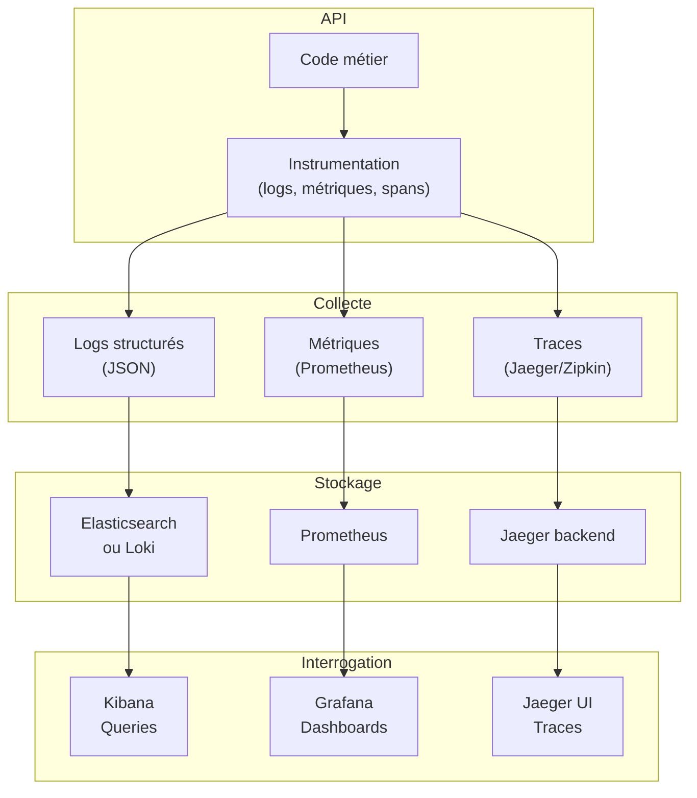

# Observabilité API

## Objectifs pédagogiques

À la fin de ce module, vous serez capable de :

1. **Identifier** ce qui doit être observé dans une API en production (requêtes, erreurs, latence, dépendances externes)
2. **Implémenter** un système de logs structurés et des métriques Prometheus dans une API REST
3. **Construire** des dashboards et alertes pertinents pour détecter rapidement les dégradations
4. **Diagnostiquer** un problème en prod en 5 minutes grâce aux traces distribuées et aux logs corrélés
5. **Évaluer** les compromis entre détail observé et surcharge (sampling, cardinalité)

---

## Mise en situation

Vous opérez une API de paiement en production. Hier, des clients signalent que les virements prennent 30 secondes au lieu de 2. Vous savez que c'est grave, mais où regarder ?

**Situation naïve :**
- Vous allez jeter un œil aux logs génériques du serveur. Il y a 50 000 lignes en une heure. Chercher une aiguille dans une botte de foin.
- Vous testez l'API localement. Ça fonctionne bien. Donc c'est un problème prod ? infrastructure ? DB ? API tierce ?
- Vous demandez un export de la DB. 2 heures d'attente. Pas vraiment réactif.
- À la fin vous trouvez : la base de données était en deadlock à 14h30. Mais vous avez perdu 45 minutes sans piste.

**Avec une bonne observabilité :**
- Vous ouvrez votre dashboard Grafana. Un graphique rouge vous montre immédiatement : latence p99 = 35s à 14h30.
- Vous cliquez sur "traces distribuées" pour une requête lente, vous voyez : étape 1 (API) = 1ms → étape 2 (cache) = 2ms → étape 3 (DB) = 33s.
- La DB était le goulot. Vous savez aussi que c'est arrivé 2 fois ce mois-ci, à la même heure (et c'est une sauvegarde automatique qui la verrouille).
- Vous posez une alerte : "Si p99 dépasse 5s pendant 2 min → page d'astreinte".
- Résultat : **5 minutes pour diagnostiquer, décision en 10 minutes**.

L'observabilité c'est l'**instrument de bord de l'API**. Sans elle, vous pilotez les yeux fermés. Avec elle, chaque anomalie devient traçable.

---

## Contexte et problématique

Une API en production est un **système vivant mais invisible**. Elle traite des milliers de requêtes, appelle d'autres services, accède à des bases de données. Quand elle ralentit, plante ou part en boucle infinie, vous n'avez aucun signal d'alarme instinctif — contrairement à une application locale où vous verriez immédiatement un crash.

**Ce qu'on appelle "l'observabilité" c'est la capacité à poser des questions arbitraires sur le système sans modifier son code.**

Les trois piliers :
- **Logs** : événements discrets ("requête reçue", "appel DB", "erreur lancée")
- **Métriques** : mesures agrégées dans le temps (latence moyenne, nombre d'erreurs/min, taille mémoire)
- **Traces distribuées** : chemin complet d'une requête à travers plusieurs services

Sans logs structurés, vous avez des blocs de texte brut imbuvables.
Sans métriques, vous ne savez pas si c'est "très dégradé" ou "imperceptible".
Sans traces distribuées, quand l'API appelle 5 services externes, vous ne savez pas qui traîne.

La vraie question n'est pas "comment implémenter ça ?" mais **"que dois-je observer pour être confiant que mon API fonctionne correctement ?"**

---

## Architecture observabilité — les trois piliers

Voici comment les trois piliers fonctionnent ensemble dans une vraie infrastructure :



Quelques explications avant d'aller plus loin :

| Composant | Rôle | Exemple |
|-----------|------|---------|
| **Instrumentation** | Code qui émet les signaux (logs, compteurs, spans) | `logger.info({"user_id": 123, "action": "payment_start"})` |
| **Collector** | Agrège et envoie les données vers les backends | Logstash, Fluentd, ou SDK natif |
| **Backend stockage** | Enregistre et indexe les données | Elasticsearch pour logs, Prometheus pour métriques |
| **UI de query** | Affiche dashboards, graphes, traces | Grafana, Kibana, Jaeger UI |

La clé : **la même requête utilisateur génère un log, une métrique, et une trace**. C'est la corrélation entre ces trois qui permet de diagnostiquer fast.

---

## Logs structurés : bien plus que du texte brut

Avant une bonne instrumentation :
```
2024-01-15 14:23:45 ERROR payment failed
2024-01-15 14:23:46 DEBUG retry attempt 1
2024-01-15 14:23:47 INFO request completed
```

Aucune structure. Impossible de filtrer, d'agréger, de corréler avec une métrique.

Après :
```json
{
  "timestamp": "2024-01-15T14:23:45Z",
  "level": "ERROR",
  "message": "payment_failed",
  "user_id": "usr_12345",
  "order_id": "ord_67890",
  "amount_cents": 15000,
  "currency": "EUR",
  "error_code": "PAYMENT_GATEWAY_TIMEOUT",
  "error_details": "Stripe API timeout after 5s",
  "http_method": "POST",
  "http_path": "/api/v1/orders/{order_id}/payment",
  "http_status": 504,
  "duration_ms": 5012,
  "service": "payment-api",
  "version": "1.2.3",
  "trace_id": "abc123def456"
}
```

Maintenant vous pouvez :
- Chercher tous les paiements de cet utilisateur : `user_id: usr_12345`
- Compter les erreurs de timeout aujourd'hui : `error_code: PAYMENT_GATEWAY_TIMEOUT | stats count()`
- Voir tous les logs liés à une requête spécifique : `trace_id: abc123def456`
- Corréler avec une métrique : "Affiche-moi le p99 de latence quand error_rate > 5%"

💡 **Astuce** — Utilisez un `trace_id` (UUID généré en entrée d'API) puis propagez-le dans tous les appels downstream (appels à d'autres services, requêtes DB, etc.). C'est le fil rouge qui unit tous les logs d'une requête.

### Quels champs instrumenter ?

Il y a ceux qu'on **doit** toujours avoir :

| Champ | Raison | Exemple |
|-------|--------|---------|
| `timestamp` | Chronologie absolue | `2024-01-15T14:23:45.123Z` |
| `level` | Sévérité (DEBUG, INFO, WARN, ERROR) | `ERROR` |
| `message` / `event` | Quoi s'est passé | `"payment_processed"` |
| `trace_id` | Corréler requête travers services | `"abc123"` |
| `service`, `version` | Savoir qui a émis le log | `"payment-api:1.2.3"` |
| `error_code` | Cat. d'erreur structurée | `"TIMEOUT"` ou `"INSUFFICIENT_FUNDS"` |

Et ceux qui dépendent du **contexte métier** :

- `user_id`, `customer_id` → tracer une action utilisateur
- `order_id`, `transaction_id` → tracer une transaction métier
- `duration_ms`, `db_query_time_ms` → métriques de perf embarquées dans le log
- `http_method`, `http_path`, `http_status` → contexte HTTP
- `external_service` → qui a été appelé (Stripe, SendGrid, etc.)

⚠️ **Erreur fréquente** — Logger TOUT en DEBUG : `logger.debug({toutes_les_variables})`. C'est 10× trop verbeux, ça ralentit le système et sature le stockage. À la place :
- DEBUG = démarrage/arrêt services, chemins de code edge
- INFO = requêtes importantes, actions métier (paiement, création compte)
- WARN = comportements dégradés mais normaux (retry, fallback activé)
- ERROR = vrais problèmes (exception lancée, appel externe échoué)

---

## Métriques : le pouls de votre API

Une métrique est une **mesure numérique dans le temps**. Contrairement aux logs (événement unique), une métrique s'agrège : "combien d'erreurs par minute ?", "quelle est la p99 de latence ?"

### Les 4 types de métriques essentiels

**1. Compteurs (Counter)**
- Toujours croissants : requêtes traitées, erreurs
- Cas d'usage : nombre de paiements/jour, nombre d'appels échoués à Stripe

```python
from prometheus_client import Counter

payment_counter = Counter(
    'payments_total',  # nom
    'Total payments processed',
    ['status', 'currency']  # labels
)

# Dans votre code
payment_counter.labels(status='success', currency='EUR').inc()
```

**2. Jauges (Gauge)**
- Peuvent monter et descendre : utilisateurs connectés, mémoire libre, connexions DB ouvertes
- Cas d'usage : nombre de workers actifs, taille de queue

```python
from prometheus_client import Gauge

active_workers = Gauge('workers_active', 'Active worker threads')
active_workers.set(5)  # ou .inc() / .dec()
```

**3. Histogrammes (Histogram)**
- Distribution de valeurs : combien de temps durent les requêtes ?
- Cas d'usage : latence HTTP, temps de requête DB

```python
from prometheus_client import Histogram

request_duration = Histogram(
    'http_request_duration_seconds',
    'Time spent processing HTTP request',
    ['method', 'endpoint']
)

# Automatiquement calcule min/max/avg/p50/p95/p99
with request_duration.labels(method='POST', endpoint='/payment').time():
    # votre code métier
    process_payment()
```

**4. Résumés (Summary)**
- Comme les histogrammes mais plus légers (pas de buckets)
- Moins courant en prod moderne (les histogrammes suffisent généralement)

### Instrumentation minimaliste d'une API

```python
from flask import Flask, request
from prometheus_client import Counter, Histogram, generate_latest
import time

app = Flask(__name__)

# Métriques
request_count = Counter(
    'http_requests_total',
    'Total HTTP requests',
    ['method', 'endpoint', 'status']
)

request_duration = Histogram(
    'http_request_duration_seconds',
    'HTTP request duration',
    ['method', 'endpoint']
)

payment_errors = Counter(
    'payments_failed_total',
    'Total payment failures',
    ['error_code']
)

@app.before_request
def before_request():
    request.start_time = time.time()

@app.after_request
def after_request(response):
    duration = time.time() - request.start_time
    request_duration.labels(
        method=request.method,
        endpoint=request.path
    ).observe(duration)
    
    request_count.labels(
        method=request.method,
        endpoint=request.path,
        status=response.status_code
    ).inc()
    
    return response

@app.route('/api/v1/payment', methods=['POST'])
def create_payment():
    try:
        # logique métier
        return {'status': 'success'}, 200
    except PaymentError as e:
        payment_errors.labels(error_code=e.code).inc()
        return {'error': str(e)}, 400

@app.route('/metrics')
def metrics():
    return generate_latest()

if __name__ == '__main__':
    app.run()
```

Maintenant Prometheus scrape `/metrics` toutes les 15 secondes et accumule les données. Vous pouvez demander à Prometheus :
- Combien de requêtes POST `/api/v1/payment` par minute ? → `rate(http_requests_total{method="POST", endpoint="/api/v1/payment"}[1m])`
- Quelle est la latence p99 ? → `histogram_quantile(0.99, http_request_duration_seconds_bucket)`
- Quel pourcentage d'erreurs aujourd'hui ? → `sum(rate(http_requests_total{status=~"5.."}[1d])) / sum(rate(http_requests_total[1d]))`

💡 **Astuce** — N'instrumentez PAS chaque ligne de code. Instrumentez les **points critiques** : entrée API, appels externes, requêtes DB, exceptions. Trop de métriques = bruit + coût de stockage.

⚠️ **Erreur fréquente** — Oublier les labels ou en créer trop. Un label = une nouvelle série temporelle. Si vous faites `labels(user_id=...)` avec 100 000 utilisateurs, vous créez 100 000 séries → Prometheus explose. À la place, mettez `user_id` dans les logs (structurés) et créez une métrique à haut niveau : `labels(endpoint, status)`.

---

## Traces distribuées : suivre une requête à travers les services

Imaginons : l'utilisateur appelle votre API `/payment`. Votre API appelle Stripe, puis une base de données, puis un service de notification par email. Si c'est lent, où est le goulot ?

Sans traces : mystère complet.
Avec traces : un graphique montre chaque étape et sa durée.

Voici un exemple avec OpenTelemetry (standard ouvert) :

```python
from opentelemetry import trace, metrics
from opentelemetry.exporter.jaeger.thrift import JaegerExporter
from opentelemetry.sdk.trace import TracerProvider
from opentelemetry.sdk.trace.export import BatchSpanProcessor
from opentelemetry.instrumentation.flask import FlaskInstrumentor
from opentelemetry.instrumentation.requests import RequestsInstrumentor

# Configuration Jaeger
jaeger_exporter = JaegerExporter(
    agent_host_name='localhost',
    agent_port=6831,
)

trace.set_tracer_provider(TracerProvider())
trace.get_tracer_provider().add_span_processor(
    BatchSpanProcessor(jaeger_exporter)
)

# Auto-instrumentation des libs
FlaskInstrumentor().instrument_app(app)
RequestsInstrumentor().instrument()

# Trace custom
tracer = trace.get_tracer(__name__)

@app.route('/api/v1/payment', methods=['POST'])
def create_payment():
    with tracer.start_as_current_span("payment_creation") as span:
        span.set_attribute("user_id", request.json['user_id'])
        span.set_attribute("amount", request.json['amount'])
        
        # Cette partie est auto-instrumentée
        response = requests.post(
            'https://api.stripe.com/v1/charges',
            data={'amount': request.json['amount']}
        )
        
        # Mais vous pouvez ajouter des sous-spans
        with tracer.start_as_current_span("database_update") as db_span:
            db.execute("UPDATE orders SET status='paid' WHERE id=?", (order_id,))
            db_span.set_attribute("query_time_ms", 45)
        
        return {'status': 'success'}, 200
```

Quand vous ouvrez Jaeger, vous voyez :

```
Payment Creation (15ms total)
├─ Flask HTTP handler (1ms)
├─ Stripe API call (9ms)
│  └─ HTTP POST (9ms)
└─ Database update (5ms)
   └─ SQL query (5ms)
```

Maintenant c'est clair : Stripe traîne. Vous contactez Stripe pour comprendre pourquoi, ou vous mettez un timeout plus agressif.

---

## Dashboards et alertes : de la donnée à l'action

Avoir des logs et métriques c'est bien. Mais si vous ne regardez jamais les dashboards, ça sert à rien.

### Construire un dashboard utile

Un mauvais dashboard : 50 graphes, 0 actions possibles. Vous regardez, vous voyez une ligne rouge, vous ne savez pas quoi faire.

Un bon dashboard : 5 à 8 graphes, chacun déclenche une action possible.

Pour une API de paiement, les graphiques pertinents :

1. **Taux d'erreur par minute** (graphe rouge/vert)
   - Quoi faire : Si rouge → ouvrir Kibana, filtrer les erreurs par code, identifier la cause
   
2. **Latence p99 vs p50** (histogramme ou ligne)
   - Quoi faire : Si p99 >> p50 → problème de queue ou spike d'une dépendance externe
   
3. **Taux d'appels à Stripe par minute + taux d'erreur Stripe**
   - Quoi faire : Si erreurs Stripe ↑ → c'est leur problème, pas le vôtre (mais impacte votre SLA)
   
4. **Nombre de paiements réussis / échoués / en attente**
   - Quoi faire : Si "en attente" ↑ → queue de traitement congestionée ou workers bloqués
   
5. **Utilisation ressources : CPU, mémoire, connexions DB**
   - Quoi faire : Si CPU ↑↑↑ → code inefficace ou DOS, si mémoire pleine → fuite, si connexions DB pleine → N workers trop haut ou requête qui traîne

Pour créer ça dans Grafana :

```
1. Source = Prometheus
2. Requête = rate(http_requests_total{status=~"5.."}[1m]) / rate(http_requests_total[1m])
3. Titre = "Error rate (%)"
4. Seuil d'alerte = 5% (rouge)
5. Annotation = "Si > 5% : vérifier logs, chercher motif d'erreur"
```

### Alertes qui ne crient pas au loup

Une alerte qui déclenche 100× par jour = plus personne ne la regarde.

Bonnes pratiques :

**1. Nommez l'alerte par l'action**
```
❌ HighErrorRate
✅ PaymentAPIHighErrorRate_CheckStripeIntegration
```

**2. Incluez le contexte dans le message**
```
❌ Alert fired
✅ Payment API error rate 12% (thresh: 5%). Last hour: 1,234 errors. 
   Top codes: GATEWAY_TIMEOUT (60%), INSUFFICIENT_FUNDS (30%).
   Logs: https://logs.company.com/payment-api?error_code=GATEWAY_TIMEOUT
```

**3. Décalez les seuils par heure/jour**
- 2h du matin = trafic bas → alerte seulement si vraiment anormal
- 14h = heures de pointe → moins sensible

**4. Utilisez des seuils composés**
```
(error_rate > 5% ET durée > 5 min) OU error_rate > 15%
```

---

## Construction progressive : de zéro à une observabilité robuste

Vous n'avez pas besoin de tout implémenter le jour 1. Voici une feuille de route réaliste.

### Phase 1 : Logs structurés (jour 1)

Objectif : voir quoi se passe quand ça casse.

```python
import json
from datetime import datetime

def structured_log(level, message, **context):
    log_entry = {
        "timestamp": datetime.utcnow().isoformat() + "Z",
        "level": level,
        "message": message,
        "service": "payment-api",
        "version": "1.0.0",
        **context
    }
    print(json.dumps(log_entry))

# Utilisation
try:
    process_payment(user_id=123, amount=100)
except Exception as e:
    structured_log("ERROR", "payment_failed", 
                   user_id=123, error=str(e))
```

Coût : zéro (c'est du JSON dans stdout). Bénéfice : traçabilité basique.

### Phase 2 : Métriques clés (semaine 1)

Objectif : savoir si c'est dégradé vs normal.

```python
from prometheus_client import Counter, Histogram

errors = Counter('errors_total', '', ['service', 'code'])
latency = Histogram('request_duration_seconds', '', ['endpoint'])

# Ça s'ajoute à vos logs
errors.labels(service='payment', code='TIMEOUT').inc()
with latency.labels(endpoint='/payment').time():
    do_work()
```

Coût : 50 lignes de code, stockage Prometheus = ~100KB/jour pour 1 API. Bénéfice : tendances visibles, alertes de base possibles.

### Phase 3 : Traces distribuées (mois 1)

Objectif : diagnostiquer d'où vient la latence quand ça ralentit.

Ajouter OpenTelemetry aux appels critiques. Auto-instrumentation des libs HTTP/DB.

Coût : dépendance + config Jaeger, ~1GB/jour de données traces (compressé). Bénéfice : diagnostic 10× plus rapide.

### Phase 4 : Dashboards + alertes prod (mois 1)

Objectif : être informé automatiquement d'un problème, pas réactif.

Créer 5-8 graphes pertinents dans Grafana, mettre alertes sur les seuils critiques (error rate, latence p99, timeouts).

Coût : 1 jour de config. Bénéfice : détection rapide des problèmes avant qu'ils ne dégradent le SLA.

---

## Diagnostic rapide : utiliser l'observabilité pour déboguer

Un utilisateur dit "j'ai une erreur qui dure depuis 20 minutes".

**Étape 1 : Ouvrir le dashboard**
- Graphe error rate → rouge ? Oui, depuis 20 min. Confirmé.
- p99 latency → 8s au lieu de 200ms. C'est grave.

**Étape 2 : Filtrer les logs par error_code**
```
level: ERROR
timestamp: [last 20 min]
```
Résultat : 80% des erreurs = `PAYMENT_GATEWAY_TIMEOUT`.

**Étape 3 : Ouvrir Jaeger, chercher une trace lente**
- Cliquer sur une trace d'erreur
- Voir : API → Stripe call (8s) → timeout
- Autre trace de succès : Stripe call (200ms)

**Conclusion** : Stripe est lent depuis 20 min (vérifier leur status page). Rien à faire côté API.

**Temps total : 3 minutes**. Sans observabilité, 45 minutes de debug.

---

## Pièges et compromis

### Cardinalité : ennemi invisible

Un label avec trop de valeurs uniques = catastrophe Prometheus.

```python
# ❌ PAS BON : label=user_id (100 000 utilisateurs uniques)
# = 100 000 séries temporelles pour ce seul label
metric.labels(endpoint='/payment', user_id=user_id).inc()

# ✅ BON : user_id dans les logs, pas dans les métriques
metric.labels(endpoint='/payment', status='success').inc()
structured_log("INFO", "payment_success", user_id=user_id)
```

Règle : **Cardinal < 1000**. Si un label peut avoir >1000 valeurs uniques, le mettre en log, pas en métrique.

### Sampling : réduire la charge des traces

Enregistrer TOUTES les traces = trop cher. Solution : ne sampler que N% des requêtes.

```python
# Sampler 10% des requêtes
if random.random() < 0.1:
    tracer.start_span("request")
```

Danger : si vous samplez 1%, une erreur rare risque de ne jamais être tracée.

Mieux : **importance sampling** : 100% pour les erreurs, 10% pour les succès.

### Rétention : coût vs perte d'historique

Prometheus : 15 jours par défaut.
Elasticsearch/Loki : configurable.

Décision : combien d'historique vous en avez besoin ?
- SLA à 30j → garder 30j de métriques + logs
- Compliance → potentiellement 1-2 ans de logs (mais stockage = cher, solution = archive)

---

## Bonnes pratiques

**1. Trace ID propagé partout**
Générez-le en entrée API (UUID), propagez-le en header `X-Trace-ID` à chaque appel descendant. Logs + métriques + traces = même trace_id = corellation garantie.

**2. Logs structurés en JSON, pas de texte libre**
Texte libre = pas indexable, pas queryable. JSON = structure, filtrage rapide, dashboards possibles.

**3. Noms de métriques explicites et cohérents**
`http_request_duration_seconds` ≠ `api_latency_ms`. Utiliser les conventions Prometheus : `<namespace>_<subsystem>_<name>_<unit>`.

**4. Alertes basées sur anomalies, pas de seuils fixes**
Seuil fixe "error_rate > 5%" = pas bon (5% peut être normal en heure de pointe, anormal la nuit).
Mieux : seuil adaptatif ou alerte sur deviation = 3× la tendance historique.

**5. Retention logs proportionnelle à la criticité**
- Logs erreurs : 90 jours
- Logs info : 7 jours
- Logs debug : 1 jour (ou non, juste en cas de debug actif)

**6. Testez vos alertes**
Une alerte qui ne s'est jamais déclenchée = peut-être cassée. Simulez l'incident : éteignez une dépendance, vérifiez que l'alerte se déclenche.

**7. Documentez votre observabilité**
"Dashboard X existe pour diagnostiquer Y. Alerte Z déclenche si problème Z, regarder d'abord logs avec filtre FOO."

---

## Cas réel en entreprise

**Contexte** : Startup fintech, API de transfert d'argent. Équipe de 8 dev, 2000 requêtes/jour en production.

**Avant observabilité (mois 1-3)** :
- Utilisateurs signalent des transferts qui prennent "longtemps"
- Équipe dit "c'est votre connexion", mais c'est pas vrai
- Impossible de diagnostiquer. Escalade vers le CTO. 1 jour perdu.

**Décision** : implémenter observabilité.

**Week 1** : Logs structurés JSON
```python
# Avant
logger.info("Transfer started")
# Après
structured_log("INFO", "transfer_initiated",
               user_id=u_id, amount=amt, dest_bank=bank)
```

**Week 2** : Métriques Prometheus de base
- `transfers_total` par statut
- `transfer_duration_seconds` p50/p99
- `external_api_calls_total` par API (bank, KYC, etc.)

**Week 3** : Jaeger traces
- Auto-instrumentation requêtes HTTP
- Spans manuels pour les étapes métier

**Week 4** : Grafana dashboard
- 6 graphes : taux d'erreur, latence p99, appels par API, mémoire, CPU, paiements en attente
- 2 alertes : error_rate > 3%, latency_p99 > 2s

**Résultat dans la 2e semaine post-déploiement** :
- Utilisateur signale lenteur. Équipe scrute dashboard (2 min) → Logs montrent timeout KYC externe (1 min) → Jaeger trace montre KYC = 15s au lieu de 1s (2 min). Diagnostic = **5 minutes vs 1 jour avant**.
- Contactent le fournisseur KYC, ça s'améliore en 30 min.
- Mettent un timeout de 3s et fallback, le problème disparaît.

**Gain mes