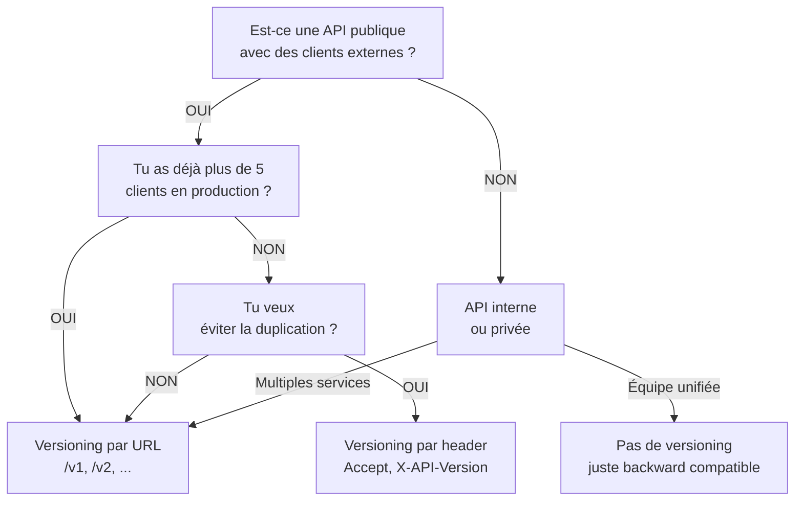

```yaml
---
layout: page
title: "Gestion des versions d'API"

course: API REST
chapter_title: "Gestion des versions"

chapter: 3
section: 1

tags: versioning,api-design,backward-compatibility,rest,architecture
difficulty: intermediate
duration: 45
mermaid: true

icon: "🔄"
domain: "API Design"
domain_icon: "🏗️"
status: "published"
---

# Gestion des versions d'API

## Objectifs pédagogiques

À la fin de ce module, vous serez capable de :

- **Comprendre** pourquoi les API ont besoin de versions et quels problèmes cela résout
- **Comparer** les quatre grandes stratégies de versioning et savoir quand utiliser chacune
- **Décider** la stratégie de versioning adaptée à votre contexte (clients, évolution métier, contraintes opérationnelles)
- **Implémenter** une stratégie de versioning sans casser les clients existants
- **Identifier** les pièges classiques et comment les éviter

## Mise en situation

Vous travaillez sur une API que 50 clients externes consomment en production. Votre métier évolue : vous devez ajouter un champ `currency` à l'endpoint `/products`, mais certains clients parsing strict ne l'acceptent que s'il est à la fin de la réponse. D'autres veulent transformer complètement la structure de `/orders`.

**Sans versioning :** vous casser les clients incompatibles. **Avec versioning :** vous avez une stratégie pour évoluer sans bloquer personne.

La question devient : **comment structurer cette évolution pour que chaque client migre à son rythme ?**

---

## Résumé

Une API versionnée permet d'évoluer le contrat (structure de données, logique métier) sans forcer tous les clients à mettre à jour instantanément. Il existe quatre approches principales — URL (`/v1/`, `/v2/`), header (`Accept: application/vnd.api+json;version=2`), query parameter (`?api-version=2`), et content negotiation (media types) — chacune avec ses avantages et contraintes opérationnelles. Le choix dépend du nombre de clients, de votre capacité à supporter plusieurs versions en parallèle, et de votre volonté de favoriser la découverte (URL lisible) ou l'élégance (headers). Les bonnes pratiques universelles : définir clairement une policy de fin de support, maintenir une version au minimum pendant 12 mois, et documenter l'évolution de chaque endpoint.

---

## Pourquoi les API ont besoin de versions

Imaginez une bibliothèque qui change sa structure de classification. Les anciens clients cherchant un livre via l'ancienne interface vont échouer. Les API fonctionnent exactement pareil : c'est un **contrat** entre le serveur et le client. Une API sans versioning, c'est un contrat qu'on peut réécrire du jour au lendemain.

### Le vrai problème : les clients ne contrôlent pas le serveur

Contrairement à une application monolithique où vous controllez tout le code, une API publique a des **clients décentralisés** :
- Vous ne savez pas combien il y en a
- Vous ne pouvez pas les mettre à jour tous en même temps
- Certains clients sont en pause : ils tournent sur une version figée pendant 2-3 ans
- D'autres migrent lentement : ils testent d'abord en staging, puis déploient par étapes

**Exemple concret :** Stripe propose 15+ versions d'API actives en même temps. Chaque client choisit sa version et l'utilise le temps qu'il faut. Stripe peut alors ajouter une field, changer un comportement, sans jamais casser les anciens clients.

### Conséquences sans versioning

| Tentative | Résultat |
|-----------|----------|
| Ignorer le problème | Clients cassés, tickets support explosent, perte de confiance |
| Déployer en backward compatible | Possible un temps, mais le code devient un fouillis de conditions (v1, v2, v3...) |
| Forcer les clients à mettre à jour | Hors de question : tu perds des clients, ils se fâchent, ta reputation s'en va |

D'où la nécessité d'une **stratégie de versioning** : un mécanisme qui permet au serveur de proposer plusieurs contrats simultanément.

---

## Les quatre stratégies de versioning

Le versioning d'une API n'est pas "faire une version" — c'est **choisir où et comment encoder le numéro de version** pour que client et serveur se mettent d'accord.

### 1. Versioning par URL (path versioning)

```
GET /v1/products
GET /v2/products
GET /v3/products
```

**Fonctionnement :** le numéro de version fait partie du chemin. Chaque version est une route distincte.

**Avantages :**
- 👁️ **Visible et évident** : même un navigateur web voit la version
- 🧭 **Facile à router** : un simple `if (path.startsWith("/v1"))` en middleware suffit
- 🔗 **Debuggable** : les URLs apparaissent dans les logs, les bookmarks, les outils de monitoring

**Inconvénients :**
- 📚 **Duplication de code** : chaque version devient une route séparée — copier-coller facile, maintenance compliquée
- 🔀 **Pollution d'URI** : l'API visible aux clients devient `/v1/`, `/v2/`, `/v3/`... esthétiquement lourd
- 🧠 **Pas de sémantique** : une route `/v2/products` ne te dit pas ce qui a changé par rapport à `/v1/products`

**Cas d'usage :**
- API publique avec beaucoup de clients
- Clients non-techniques (mobile, web browsers)
- Evolution fréquente et incompatible

**Exemple réel :** GitHub, Stripe, Twitter utilisent tous le path versioning (`/v3/repos`, `/v1/charges`).

---

### 2. Versioning par header (header versioning)

```http
GET /products HTTP/1.1
Host: api.example.com
Accept: application/vnd.example.v2+json
```

Ou avec un header custom :

```http
GET /products HTTP/1.1
Host: api.example.com
X-API-Version: 2
```

**Fonctionnement :** le client spécifie la version dans les headers HTTP, la route reste `/products` pour toutes les versions.

**Avantages :**
- 🎯 **URL unique** : la même route `/products` fonctionne pour v1, v2, v3 — pas de pollution
- 🧭 **Content negotiation naturelle** : suit la logique HTTP standard (comme `Accept-Language`)
- 🔍 **Versioning invisible** : les logs web ne montrent que `/products`, le versioning est un détail du négociation HTTP

**Inconvénients :**
- 👁️ **Pas visible au premier coup d'œil** : une simple visite à `/products` dans le navigateur révèle v1 par défaut — tu dois chercher dans les headers pour voir la version
- 🔧 **Requiert du tooling** : curl, Postman, tests doivent toujours inclure le bon header — facile d'oublier
- 🧠 **Lourd pour le débutant** : beaucoup de clients ne comprennent pas comment spécifier un header custom

**Cas d'usage :**
- API interne ou pour développeurs avertis
- Clients multiples (web, mobile, backend) partageant le même endpoint logique
- Quand tu veux vraiment "une" API avec plusieurs interprétations

**Exemple réel :** GitHub v3 API accepte `Accept: application/vnd.github.v3+json`. Stripe s'en éloigne à cause de la friction pour les débutants.

---

### 3. Versioning par query parameter

```
GET /products?api-version=2
GET /products?version=2
```

**Fonctionnement :** le numéro de version est un paramètre de la requête.

**Avantages :**
- 📝 **Simple à tester** : copier une URL dans le navigateur marche directement
- 🔗 **Visible en URL** : les logs, les bookmarks, les outils de monitoring voient la version

**Inconvénients :**
- 🙃 **Sémantiquement bizarre** : un query param est censé être un **filtre ou un paramètre métier** (`?limit=10`, `?search=foo`), pas un aspect du protocole lui-même
- 🔀 **Confusif** : `/products?version=2&limit=10` mélange versioning et métier — difficile de différencier les deux concepts
- 💾 **Caching complexe** : les caches HTTP risquent d'oublier que `?version=1` et `?version=2` sont deux réponses différentes

**Cas d'usage :**
- Rarement pertinent. À utiliser seulement si tu as une excellente raison.
- Quelques APIs Microsoft l'utilisaient (`?api-version=2019-06`), mais c'est un cas d'exception.

---

### 4. Versioning par content negotiation (media types)

```http
GET /products HTTP/1.1
Accept: application/vnd.example.v2+json
```

C'est une forme de **header versioning**, mais plus formelle. Tu dis au serveur : *"Je veux la réponse en version 2 du format application/vnd.example"*.

**Avantages :**
- 🏛️ **Respecte les standards HTTP** : c'est littéralement le rôle de l'header `Accept`
- 🎯 **Élégant pour architecte** : un seul endpoint, plusieurs représentations — conforme aux principes REST purs

**Inconvénients :**
- 🤷 **Peu adopté en pratique** : les clients REST actuels ne l'aiment pas (trop de paperasse)
- 🧠 **Friction éducatrice** : même les développeurs chevronnés hésitent à écrire `application/vnd.example.v2+json`

**Cas d'usage :**
- APIs très RESTful mises en place par des architectes puristes
- Rarement en production réelle pour des APIs commerciales

---

## Comparaison des quatre stratégies

| Critère | URL | Header | Query param | Content negotiation |
|---------|-----|--------|-------------|--------------------|
| **Visibilité** | ✅ Très claire | ❌ Cachée | ✅ Visible en URL | ❌ Dans les headers |
| **Simplicité client** | ✅ Trivial | ⚠️ Besoin de tooling | ✅ Facile | ⚠️ Complexe syntaxe |
| **Clarté sémantique** | ✅ Explicite | ✅ Explicite | ❌ Confusion | ✅ Très explicite |
| **Extensibilité API** | ⚠️ Routes dupliquées | ✅ Une route, plusieurs versions | ⚠️ Logique de routage floue | ✅ Vraiment propre |
| **Caching HTTP** | ✅ Trivial | ⚠️ Besoin de clés spécifiques | ⚠️ Risques d'erreur | ✅ Prévu pour |
| **Adoption réelle** | ✅✅✅ Omniprésent | ✅ Parmi les puristes | ❌ Rare | ⚠️ Très rare |

💡 **Astuce :** Si tu dois choisir aujourd'hui et que tu es indécis, **choisis le versioning par URL**. C'est moins élégant en architecture, mais c'est ce que tous les clients savent utiliser, c'est ce que tous les outils supportent, et c'est ce qu'on retrouve chez les leaders du secteur (Stripe, GitHub, AWS).

---

## Comment décider : arbre de décision



### Critères concrets d'arbitrage

**Choisis URL si :**
- Tu as des clients mobiles ou web qui ne contrôlent pas leurs headers HTTP
- Tu veux que les versions soient visibles dans les logs et les outils de monitoring standard
- Tu acceptes de maintenir des routes dupliquées (c'est OK si c'est du routage, pas du code métier)
- Tu as des clients "impatients" : ils ne vont pas lire la documentation, juste copier des exemples

**Choisis header si :**
- Tous tes clients sont des développeurs avertis (APIs backend-to-backend)
- Tu veux vraiment "une seule API" logiquement, avec plusieurs incarnations
- Tu peux imposer des standards de documentation clairs
- Tu as une équipe ou une organisation qui comprend les media types

**Choisis query param si :**
- Tu as une excellente raison (franchement, c'est rare)
- Microsoft t'a formé à leurs conventions, par exemple

---

## Pièges classiques et comment les éviter

### Piège 1 : "On va juste rendre le nouveau champ optionnel"

⚠️ **Le problème :** Tu ajoutes `currency` à `/products`, tu le rends optionnel, et tu penses que c'est backward compatible.

Mais un client avec un parsing strict (`StrictVersion(ProductSchema)`) va crasher parce qu'il reçoit une field inattendue. Un autre client attend que le champ soit à une position spécifique dans le JSON et bug si l'ordre change.

**La solution :** Admettre que même les changements "mineurs" cassent des clients. Quand tu ajoutes un champ au cœur de ta logique métier, **c'est un changement de version**. Point final. L'optionnalité ne suffit pas.

### Piège 2 : Maintenir trop de versions simultanément

⚠️ **Le problème :** Tu as 7 versions actives (`/v1` à `/v7`). Chacune a son code, sa logique, ses bugs. Tu dois corriger un bug de sécurité ? Ça va être 7 fois ou zéro.

**La solution :** Définis une **policy de support** claire :
- Minimum : supporter la version actuelle + 1 version précédente (12-18 mois d'overlap typiquement)
- Communiquer : "v1 will be retired on 2025-12-31" au moins 6 mois avant
- Bonus : quand tu deprecates, envoie un header `Deprecation: true` et `Sunset: date` (RFC 8594) — les clients avertis migreront avant l'extinction

Stripe supporte 10+ versions, mais Stripe a les ressources et l'intérêt économique. Vous, vous pouvez vous permettre 2, peut-être 3.

### Piège 3 : Oublier que "vers l'arrière" ≠ "vers l'avant"

⚠️ **Le problème :** Tu penses à la **backward compatibility** (v2 serveur peut servir les clients v1). Mais tu oublies la **forward compatibility** partielle.

**Exemple :** v1 client demande `/v2/products`. Le serveur dit "désolé, tu dois utiliser `/v1/products`". Le client crash. Pas de fallback intelligent.

**La solution :** Documente explicitement le contrat :
- "v1 clients peuvent utiliser l'API v2 ? Non, tu dois utiliser exactement la version que tu requêtes"
- Ou inversement : "v2 clients reçoivent une réponse v1 si leur Accept header est absent ? Oui, on sert du v1 par défaut, tu dois demander v2 explicitement"

Sois **clair et testé** sur ce sujet.

### Piège 4 : Deux endpoints pour le même métier

⚠️ **Le problème :** Tu crées `/v1/orders` et `/v2/orders`, mais les deux pointent vers la même logique métier. À chaque changement métier, tu dois toucher aux deux routes.

**La solution :** Le routage (choix entre `/v1` et `/v2`) doit être **séparé** de la logique métier. Exemple pseudo-code :

```python
@app.route('/v1/orders', methods=['GET'])
def get_orders_v1():
    orders = fetch_orders()  # logique métier unifiée
    return format_as_v1(orders)  # formatage version-spécifique

@app.route('/v2/orders', methods=['GET'])
def get_orders_v2():
    orders = fetch_orders()  # même logique métier
    return format_as_v2(orders)  # formatage différent
```

Ainsi, une correction de bug dans `fetch_orders()` bénéficie aux deux versions. Seul le formatage diffère.

### Piège 5 : Documenter la v1, puis oublier de documenter les diffs en v2

⚠️ **Le problème :** Ta documentation dit "consultez la v1 pour les détails". Mais v2 a changé le format de date, l'ordre des champs, la sémantique de `status`. Le client cherche dans la v1 docs et se trompe.

**La solution :** Pour chaque version, documente :
- Ce qui change par rapport à la version précédente (changelog)
- Un exemple complet de requête/réponse (pas "cf. v1")
- Les endpoints dépréciés ou modifiés (tableau clair)

Stripe et AWS le font bien : chaque version a sa page de docs complète et un migration guide vers la suivante.

---

## Cas réel : évolution d'une API e-commerce

### Situation initiale

Vous lancez l'API pour une plateforme e-commerce. Endpoint v1 :

```json
GET /v1/products/123
{
  "id": 123,
  "name": "Laptop",
  "price": 999,
  "stock": 5
}
```

Vous supportez 20 clients (partenaires, apps mobiles) en v1.

### Itération 1 : "On a besoin de prix par devise"

Au bout de 6 mois, vous internationalisez. Les clients demandent des prix en EUR, GBP, not just USD.

**Tentation :** ajouter un champ `prices` optionnel en v1.

```json
{
  "id": 123,
  "name": "Laptop",
  "price": 999,  // ← obsolète
  "prices": {     // ← nouveau, optionnel
    "usd": 999,
    "eur": 950,
    "gbp": 850
  },
  "stock": 5
}
```

**Problème :** 3 clients chutent quand même — ils ont un parser strict qui casse sur `prices` inattendu.

**Décision :** Vous créez `/v2/products` où le format change et devient clair :

```json
GET /v2/products/123
{
  "id": 123,
  "name": "Laptop",
  "prices": {
    "usd": 999,
    "eur": 950,
    "gbp": 850
  },
  "stock": 5
}
```

Les 17 clients restants migrent dans les 3 mois. Les 3 clients "bloqués" demandent du support, vous les aidez.

### Itération 2 : Dépublication de v1

Après 18 mois, vous communiquez : "v1 sera retiré le 2025-12-31". Les 3 clients tenaces migrent enfin, coûte que coûte (car c'est la deadline). Vous dépubliez `/v1/products`.

**Bénéfice mesuré :**
- Vous retirez 40% du code de routage API
- Zéro bugs remontant de clients v1 obsolètes
- Votre code métier devient plus clair (pas de logique d'optionnalité pour 3 clients)

### Itération 3 : Vers v3

Deux ans après v1, votre logique métier a changé. Les stocks ne sont plus simples — c'est maintenant un inventaire par entrepôt, avec des réserves, des pré-commandes.

V2 clients reçoivent un seul champ `stock` générique (sum de tous les entrepôts). C'est lent à calculer, ça tue votre base de données.

Vous créez `/v3/products` où le model change radicalement :

```json
GET /v3/products/123
{
  "id": 123,
  "name": "Laptop",
  "prices": { ... },
  "inventory": [
    {
      "warehouse": "US-EAST",
      "available": 3,
      "reserved": 1,
      "pre_ordered": 2
    },
    {
      "warehouse": "EU-WEST",
      "available": 10,
      "reserved": 0,
      "pre_ordered": 5
    }
  ]
}
```

V2 clients voient toujours un seul `stock` synthétique (pour la compat). V3 clients voient le détail complet.

**Le pipeline réel :**
```python
def get_product(product_id: int, version: str = "v1"):
    raw_product = db.fetch_product(product_id)
    
    if version == "v1":
        return {
            "id": raw_product.id,
            "name": raw_product.name,
            "price": raw_product.default_price,
            "stock": calculate_total_stock(raw_product)
        }
    elif version == "v2":
        return {
            "id": raw_product.id,
            "name": raw_product.name,
            "prices": raw_product.price_by_currency,
            "stock": calculate_total_stock(raw_product)
        }
    elif version == "v3":
        return {
            "id": raw_product.id,
            "name": raw_product.name,
            "prices": raw_product.price_by_currency,
            "inventory": raw_product.inventory_by_warehouse
        }
```

À chaque version, vous conservez une fonction de **formatage métier** unifiée, mais juste le rendu change.

---

## Bonnes pratiques fondamentales

### 1. Définis une policy de support publique

Publie une page type "API Versioning Policy" :
- *"Chaque version majeure est supportée pour 18 mois après sa dépublication."*
- *"Les versions seront annoncées 6 mois avant extinction sur le changelog."*
- *"Les clients peuvent toujours passer à une version antérieure jusqu'à sa retraite."*

Cela établit la confiance. Les clients savent qu'ils ont du temps, qu'il n'y a pas de piège.

### 2. Versionne seulement quand tu dois vraiment changer

Chaque version crée du travail :
- Code de routage supplémentaire
- Documentation à maintenir
- Tests pour les deux versions
- Support pour les clients qui hésitent

Ne crée une v2 que si :
- Tu dois faire un changement **incompatible** (changer le type d'un champ, enlever un endpoint, changer un comportement métier)
- Ou tu fais un refactoring majeur (re-concevoir l'architecture d'une ressource)

Les petits ajouts (nouveaux endpoints, nouveaux champs optionnels) ne justifient **pas** une nouvelle version.

### 3. Communique le changelog clairement

Pour chaque version, publie un doc "Migration Guide" :
```markdown
# Migration from v1 to v2

## Changed
- `/products` response: `price` field removed, replaced by `prices` object
- `/products` now requires `?include=prices` to include pricing (default: prices are included)

## Added
- `/products/{id}/inventory` new endpoint for detailed stock info

## Deprecated
- `/products?stock=1` filter removed (use `/inventory` instead)

## Examples
Before (v1):
GET /v1/products/123
→ {..., "price": 999}

After (v2):
GET /v2/products/123
→ {..., "prices": {"usd": 999, "eur": 950}}
```

Cela réduced the friction massivement.

### 4. Teste la compatibilité croisée

Assure-toi que :
- v1 clients peuvent communiquer avec v1 serveur ✅
- v2 clients peuvent communiquer avec v2 serveur ✅
- v1 clients essayant v2 échouent **clairement** (erreur 406 ou 400, pas un silent fail)

```python
@app.route('/v1/products/<id>')
def get_product_v1(id):
    # ...
    return jsonify(format_v1(product)), 200

@app.route('/v2/products/<id>')
def get_product_v2(id):
    # ...
    return jsonify(format_v2(product)), 200

@app.route('/products/<id>')  # no version → 400
def get_product_ambiguous(id):
    return jsonify({"error": "Version requise. Utilise /v1/products ou /v2/products"}), 400
```

### 5. Maîtrise le moment du breaking change

Tu dois changer le type d'un champ (string → number), ou enlever un endpoint. **Quand le faire ?**

Avis : [Deprecation] (header `Deprecation: true`, changelog)
↓
6 mois d'overlap
↓
Annonce : "v1 sera retiré le X"
↓
3 mois avant la date, envoi une alerte
↓
À la date limite, tu retires v1

Les clients ont du temps, pas de surprise.

---

## Checklist de déploiement

Avant de lancer une nouvelle version d'API :

- ✅ Policy de support publié (combien de temps cette version vivra)
- ✅ Changelog rédigé : quoi de neuf, quoi change, quoi disparaît
- ✅ Migration guide : comment passer de l'ancienne version
- ✅ Exemples complets (requête/réponse) pour chaque endpoint majeur
- ✅ Tests couvrant backward compatibility (v1 clients ne cassent pas)
- ✅ Tests couvrant forward incompatibility (v1 clients utilisant `/v2` reçoivent une erreur claire)
- ✅ Monitoring : track combien de clients utilisent encore l'ancienne version
- ✅ Support notifié : escalade de tickets préparée

Si tu oublies un item, tu vas au-devant de problèmes en prod.

---

## Résumé rapide

| Concept | Explication |
|---------|-------------|
| **Pourquoi versionner** | Les clients ne contrôlent pas le serveur. Versioning permet l'évolution sans tout casser. |
| **URL versioning** | `/v1/`, `/v2/` — plus facile, plus visible, plus adopté. |
| **Header versioning** | `Accept: ...v2+json` — plus élégant, moins frictionnel pour les puristes. |
| **Quand créer v2** | Changements incompatibles seulement. Les petits ajouts ne justifient pas une version. |
| **Support policy** | Annonce 6 mois avant, supporte 18 mois minimum — établis la confiance. |
| **Piège commun** | Garder trop de versions actives. Laisse-les obsolètes. |

---

<!-- snippet
id: api_versioning_strategy_choice
type: tip
tech: api-rest
level: intermediate
importance: high
format: knowledge
tags: versioning,design,decision,api-architecture
title: Choisir la stratégie de versioning dès le départ évite du refactoring
context: avant de concevoir les routes
content: "Choisir entre URL (/v1/), header (Accept: ...v2+json), ou query param (?version=2) **dès la conception initiale**. Changer après coup — transformer /products en /v1/products une fois des clients en production — casse tout. Défaut recommandé : versioning par URL si tu hésites (c'est ce qu'utilisent Stripe, GitHub, AWS). Il est moins élégant mais plus universel."
description: "Changer de stratégie de versioning après le lancement casse les clients existants. Décide avant le premier déploiement."
-->

<!-- snippet
id: api_versioning_minimal_support
type: concept
tech: api-rest
level: intermediate
importance: high
format: knowledge
tags: versioning,operations,planning,api-lifecycle
title: Supporter au minimum deux versions simultanément pendant 18 mois
context: gestion du cycle de vie
content: "Maintenir uniquement la version actuelle crée de la friction pour les clients. Défaut : supporter version N (actuelle) + version N-1 (dépréciée) pendant 12-18 mois. Cela donne aux clients lents 6 mois de préavis avant extinction. Au-delà de 3 versions : coût opérationnel explosif (multiplication de code, tests, bugs). Stripe gère 10+ versions mais c'est une exception — leur cas d'usage l'exige économiquement."
description: "Supporter N et N-1 pendant 18 mois = équilibre entre fiabilité client et coûts opérationnels."
-->

<!-- snippet
id: api_versioning_changelog_format
type: tip
tech: api-rest
level: intermediate
importance: medium
format: knowledge
tags: documentation,versioning,communication,api-design
title: Documente le changelog en trois sections : Changed, Added, Deprecated
context: lors de la publication d'une nouvelle version
content: "Pour chaque nouvelle version majeure, produis une page changelog structurée : [Changed] ce qui a changé (incompatible
