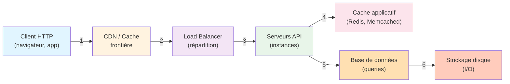

## Objectifs pédagogiques

À la fin de ce module, vous serez capable de :

1. **Identifier les goulots d'étranglement** dans une API en production et mesurer leur impact réel
2. **Implémenter une stratégie de caching** multi-niveaux adaptée à votre contexte (client, serveur, CDN)
3. **Concevoir une API scalable** : pagination, compression, optimisation de requêtes et réduction de la charge
4. **Arbitrer entre les compromis** : temps de réponse vs. fraîcheur des données vs. complexité opérationnelle
5. **Opérer une API performante** : monitoring des latences, détection d'anomalies, optimisations rapides en production

---

## Mise en situation

Vous avez lancé une API REST pour un service de consultation de produits. Au départ, tout va bien : 100 requêtes par seconde, temps de réponse de 50 ms. Puis la charge augmente.

**Semaine 2** : 500 req/s, les temps de réponse remontent à 200 ms. Les clients se plaignent de lenteur. Vous regardez les métriques : la base de données sature, chaque requête exécute 3 requêtes SQL imbriquées, et les clients re-téléchargent les mêmes listes de catégories toutes les 5 secondes.

**Semaine 3** : 2000 req/s. Vous devez décider rapidement : ajouter des serveurs (coûteux), mettre en cache (complexe), réduire la taille des réponses, ou tout à la fois ? Chaque choix a des conséquences : cache = données potentiellement stales, compression = CPU côté serveur, pagination = plus d'appels clients.

**Réalité** : vous ne pouvez pas tout faire d'un coup. Il faut un ordre stratégique : mesurer d'abord, puis optimiser ce qui a vraiment de l'impact.

Ce module vous apprend à construire cette stratégie, de la détection du problème à la solution en production.

---

## Architecture d'une API performante

Pour comprendre où optimiser, il faut d'abord voir la chaîne complète :



Chaque étage a un coût en latence et en ressources. L'optimisation consiste à réduire les requêtes qui descendent jusqu'à l'étage suivant.

| Composant | Latence typique | Goulot fréquent | Optimisation |
|-----------|-----------------|-----------------|--------------|
| **Client → CDN** | 10–50 ms | Bande passante réseau, DNS | Compression gzip, HTTP/2, caching CDN |
| **CDN → LB** | < 1 ms | Rarement un problème | — |
| **LB → Serveur API** | 1–5 ms | Distribution inégale (sticky sessions) | Healthchecks, round-robin sans état |
| **Serveur → Cache applicatif** | 0,5–5 ms | Hit ratio faible | Clés bien conçues, TTL pertinent |
| **Cache → DB** | 50–500 ms | **Le plus critique** | Index, requêtes efficaces, pagination |
| **DB → Disque** | 1–10 ms | I/O intensive | SSD, pooling connexions, denormalisation légère |

**Le message clé** : optimiser le client ou le réseau est utile, mais si votre requête déclenche 10 appels à la base de données, vous n'irez jamais vite. Allez du bas vers le haut.

---

## Contexte et problématique

Avant de penser optimisation, posez-vous ces questions :

**1. Quel est votre coût réel ?**

- **Latence perçue par l'utilisateur** (p99) : 500 ms ? 2 s ? Les utilisateurs abandonnent après 3 secondes.
- **Coût infrastructure** : serveurs, base de données, CDN, bande passante. Réduire les requêtes à la DB coûte moins cher qu'ajouter des CPU.
- **Débit attendu** : 100 req/s vs. 10 000 req/s ne demandent pas la même approche.

**2. D'où vient la latence ?**

Sans mesure, vous optimisez à l'aveugle. Les 70 ms perdus sont dans l'API (10 ms), la DB (50 ms) ou le réseau (10 ms) ? La réponse change tout.

**3. Quel est le coût acceptable de chaque optimisation ?**

- Cache → données stales temporairement
- Compression → CPU utilisé
- Pagination → plus d'appels clients
- Denormalisation DB → redondance, cohérence plus complexe

L'objectif n'est pas un API "infiniment rapide" (impossible) mais un **compromis exploitable** : assez rapide pour les utilisateurs, assez simple à maintenir, assez coûteux pour le budget.

---

## Mesurer avant d'optimiser

La plus grande erreur est d'optimiser au feeling. Vous codez 3 jours pour un gain de 20 ms sur une requête lancée une fois par jour, pendant que 90 % du temps est mangé ailleurs.

### 1. Identifier les hotspots

**Côté serveur**, instrumentez votre API :

```python
import time
from functools import wraps

def measure_endpoint(func):
    """Décorateur pour instrumenter chaque endpoint"""
    @wraps(func)
    def wrapper(*args, **kwargs):
        start = time.perf_counter()
        result = func(*args, **kwargs)
        elapsed = time.perf_counter() - start
        print(f"[{func.__name__}] {elapsed*1000:.2f}ms")
        return result
    return wrapper

@app.route('/products/<int:product_id>')
@measure_endpoint
def get_product(product_id):
    # Logique ici
    return jsonify(product)
```

Mieux : utilisez un vrai APM (Application Performance Monitoring) comme **Datadog, New Relic, Prometheus + Grafana**. Vous verrez :
- **Latence p50, p95, p99** (la p99 = "99 % des requêtes sont plus rapides que ceci")
- **Distribution des temps** : si certains appels font 5 secondes pendant que d'autres font 100 ms, c'est un problème spécifique à traquer
- **Dépendances lentes** : quelle requête SQL coûte le plus cher ?

💡 **Astuce** : les percentiles (p99) sont bien plus importants que la moyenne. Une moyenne de 100 ms cache peut-être 90 % des requêtes à 50 ms et 10 % à 500 ms. Les utilisateurs du "10 %" quittent votre service.

### 2. Tracer une requête de bout en bout

Activez le **tracing distribué** (OpenTelemetry, Jaeger, Zipkin). Suivez une requête HTTP à travers tous les étages : API → Cache → DB → Disque. Vous verrez où exactement elle s'arrête.

```
GET /products/42  (total 234 ms)
├─ [API] parse + validation  5 ms
├─ [Redis] cache lookup      1 ms (miss)
├─ [DB] SELECT ... WHERE id=42      180 ms  ⚠️ LE PROBLÈME
├─ [Redis] cache store       2 ms
└─ [API] format response      46 ms
```

Actionable : vous savez maintenant que la requête SQL est le problème. Ajouter du cache côté API ne servira à rien si la requête DB elle-même prend 180 ms.

---

## Stratégies d'optimisation : du bas vers le haut

### Niveau 1 : Optimiser la base de données

C'est souvent le goulot. Avant de cacher, accélérez la source.

**1.1 — Ajouter les index pertinents**

```sql
-- Lent : scan full table (millions de lignes)
SELECT * FROM products WHERE category_id = 5;

-- Rapide : index sur category_id (cherche directement)
CREATE INDEX idx_products_category ON products(category_id);
```

Latence : 500 ms → 5 ms. Pas d'astuce, juste un index. Mais trop d'index ralentit les INSERT/UPDATE.

**1.2 — Éviter les N+1 queries**

Piège classique : vous cherchez une liste de 100 produits, puis pour chaque produit, vous cherchez ses 3 variantes. Résultat : 1 + 100 = 101 requêtes au lieu de 2.

```python
# ❌ MAUVAIS : N+1 queries
products = db.query(Product).all()  # 1 query
for product in products:
    variants = db.query(Variant).filter(Variant.product_id == product.id).all()  # 100 queries
    print(f"{product.name}: {variants}")

# ✅ BON : 2 queries (eager loading)
products = db.query(Product).options(joinedload(Product.variants)).all()
for product in products:
    print(f"{product.name}: {product.variants}")  # déjà en mémoire
```

Mesure d'impact : **N+1 queries = la plus grande cause de lenteur** en production. Régulièrement, le coupable sur un p99 de 5 secondes.

**1.3 — Requêtes SQL plus légères**

```sql
-- Lourd : récupère TOUS les champs, 1000 lignes
SELECT * FROM orders ORDER BY created_at DESC;

-- Léger : seulement ce qu'on affiche
SELECT id, user_id, total, created_at FROM orders 
ORDER BY created_at DESC LIMIT 50;
```

Ça paraît bête, mais transférer 1 MB au lieu de 100 KB, c'est réel sur 1000 requêtes par seconde.

**1.4 — Connection pooling**

Chaque requête DB ouvre une connexion TCP ? C'est une latence cachée de 5–20 ms chaque fois. Le pooling (réutiliser les connexions) réduit ça à quasi zéro après les premières requêtes.

```python
# SQLAlchemy
engine = create_engine(
    'postgresql://...',
    pool_size=10,           # gardez 10 connexions "chaudes"
    max_overflow=5,         # créez temporairement 5 de plus si needed
    pool_pre_ping=True,     # vérifiez qu'elles sont vivantes
)
```

⚠️ **Erreur fréquente** : une pool trop petite avec 100 serveurs d'API → contentions. Trop grosse → mémoire perdue. Réglez sur la base de : **(connexions_concurrent / serveurs_api) + marge**.

---

### Niveau 2 : Caching applicatif

Quand la DB est optimisée mais reste quand même lente, cachez les résultats.

**2.1 — Cache simple : Redis**

Avant de faire une requête coûteuse, vérifiez si le résultat est déjà en cache.

```python
import redis
import json

cache = redis.Redis(host='localhost', port=6379)

@app.route('/products/<int:product_id>')
def get_product(product_id):
    cache_key = f"product:{product_id}"
    
    # Étape 1 : cache hit ?
    cached = cache.get(cache_key)
    if cached:
        return jsonify(json.loads(cached))
    
    # Étape 2 : non, requête DB
    product = db.query(Product).get(product_id)
    
    # Étape 3 : stocke en cache pour 1 heure
    cache.setex(cache_key, 3600, json.dumps(product.to_dict()))
    
    return jsonify(product.to_dict())
```

**Impact** : si 80 % des requêtes trouvent un hit (probabilité haute), vous réduisez la charge DB de 80 %. Latence : 180 ms → 2 ms.

**2.2 — TTL (Time To Live)**

Combien de temps garder le cache sans le rafraîchir ?

- **TTL court (30 s)** : données toujours fraîches, mais cache moins efficace (plus de misses)
- **TTL long (1 h)** : données potentiellement stales, mais très efficace

```python
# Commerce : produits ne changent pas en temps réel
cache.setex("product:42", 3600, ...)  # 1 heure

# Stock : critique que ce soit à jour
cache.setex("stock:42", 60, ...)      # 1 minute

# Chat en direct : inutile de cacher
# (pas de setex du tout)
```

💡 **Astuce** : si une valeur change (ex. quelqu'un met à jour le prix), invalidez le cache immédiatement au lieu d'attendre le TTL.

```python
@app.route('/products/<int:product_id>', methods=['PUT'])
def update_product(product_id):
    product = db.query(Product).get(product_id)
    product.price = request.json['price']
    db.commit()
    
    # Invalide le cache pour que la prochaine requête fetch la valeur fraîche
    cache.delete(f"product:{product_id}")
    
    return jsonify(product.to_dict())
```

**2.3 — Cache hit ratio**

C'est votre métrique clé. Si vous cachez mais que seul 20 % des requêtes trouvent un hit, c'est inutile.

```python
# Exposez une métrique
@app.route('/_metrics')
def metrics():
    hits = cache.get("cache:hits") or 0
    misses = cache.get("cache:misses") or 0
    ratio = hits / (hits + misses) if (hits + misses) > 0 else 0
    return jsonify({"cache_hit_ratio": f"{ratio*100:.1f}%"})
```

Visez **70 % minimum** pour que le cache vaille le coup.

---

### Niveau 3 : Compression et réduction de la réponse

Moins on transfère, plus vite c'est reçu.

**3.1 — Compression gzip**

```python
from flask import Flask
from flask_compress import Compress

app = Flask(__name__)
Compress(app)  # C'est automatique maintenant
```

Ou manuellement avec nginx :

```nginx
server {
    gzip on;
    gzip_types application/json text/plain;
    gzip_min_length 500;  # ne compresse que si > 500 bytes
}
```

**Impact** : JSON (très répétitif) compresse à 10–20 % de la taille originale. Une réponse de 100 KB devient 10 KB. Sur une connexion 4G (10 Mbps), c'est 80 ms économisés.

Coût : CPU serveur pour compresser. Négligeable pour une API mais visible si vous servez 10 000 req/s.

**3.2 — Pagination**

Ne renvoyez pas 10 000 résultats à la fois. Paginéz.

```python
@app.route('/products')
def list_products():
    page = request.args.get('page', 1, type=int)
    per_page = min(request.args.get('per_page', 20, type=int), 100)  # max 100
    
    products = db.query(Product).limit(per_page).offset((page - 1) * per_page).all()
    total = db.query(Product).count()
    
    return jsonify({
        "data": [p.to_dict() for p in products],
        "pagination": {
            "page": page,
            "per_page": per_page,
            "total": total,
            "pages": (total + per_page - 1) // per_page
        }
    })
```

Requête pour page 1 : 20 résultats = 5 KB. Une seule requête avec tous les résultats : 500 KB.

⚠️ **Erreur fréquente** : laisser le client demander `per_page=10000`. Capez-le (ex. max 100).

**3.3 — Field filtering (sélection partielle)**

```python
# Client peut demander seulement certains champs
GET /products/42?fields=id,name,price

@app.route('/products/<int:product_id>')
def get_product(product_id):
    fields = request.args.get('fields', '').split(',') if request.args.get('fields') else []
    product = db.query(Product).get(product_id)
    
    if fields:
        return jsonify({f: getattr(product, f) for f in fields if hasattr(product, f)})
    return jsonify(product.to_dict())
```

Utilité : si l'API renvoie normalement 50 champs mais le client n'en veut que 3, c'est 30× moins de données.

---

### Niveau 4 : HTTP caching (côté client et CDN)

Une requête qu'on ne fait pas est la plus rapide. Mettez le client en cache avec les en-têtes HTTP appropriés.

**4.1 — Cache-Control headers**

```python
@app.route('/products/<int:product_id>')
def get_product(product_id):
    response = jsonify(product.to_dict())
    
    # Le client peut garder ça 1 heure
    response.headers['Cache-Control'] = 'public, max-age=3600'
    
    # Ou pour les données sensibles : le client ne cache pas
    # response.headers['Cache-Control'] = 'no-cache, no-store, must-revalidate'
    
    return response
```

**Que ça signifie :**
- `public` : tout le monde peut le cacher (proxy, CDN, navigateur)
- `private` : seulement le client peut le cacher
- `max-age=3600` : valide 1 heure, puis demande un refresh
- `no-cache` : à chaque fois, vérifie auprès du serveur
- `no-store` : ne sauvegarde jamais

**4.2 — ETag et Last-Modified**

Quand le client refresh, au lieu de télécharger toute la réponse, vérifiez si elle a changé.

```python
from werkzeug.http import generate_etag

@app.route('/products/<int:product_id>')
def get_product(product_id):
    product = db.query(Product).get(product_id)
    response = jsonify(product.to_dict())
    
    # Génère un hash unique du contenu
    etag = generate_etag(response.get_data())
    response.set_etag(etag)
    
    # Client envoie : If-None-Match: "<etag>"
    # Si ça match, répond 304 Not Modified (0 KB, pas de téléchargement)
    
    return response
```

**Impact** : au lieu de télécharger 50 KB, le client reçoit une réponse 304 de 100 bytes. Gain de 99 %.

---

### Niveau 5 : CDN et edge caching

Pour les APIs réparties géographiquement, un CDN rapproche le cache du client.

**5.1 — Utiliser un CDN**

```
Client à Tokyo → Tokyo CDN → votre serveur à Paris

Latence sans CDN : 200 ms
Latence avec CDN : 20 ms (Tokyo → Tokyo CDN) + requête backend (Paris)
```

Outils : Cloudflare, AWS CloudFront, Fastly.

**5.2 — Contrôler le cache CDN**

```python
response.headers['Cache-Control'] = 'public, max-age=3600, s-maxage=86400'
#                                                          ^^^^^^^^
# s-maxage = cache du CDN, plus long que le cache client
```

Le client voit 1 heure de fraîcheur, mais le CDN garde ça 24 h. À chaque renouvellement client, le CDN répond sans vous interroger.

---

## Compromis et prise de décision

Vous avez 5 leviers : DB, cache applicatif, compression, pagination, HTTP cache. Lequel utiliser quand ?

**Matrice de décision** :

| Problème | Symptôme | Solution rapide | Solution durable |
|----------|----------|-----------------|-----------------|
| **DB trop lente** | p99 > 1s, CPU DB 90% | Ajouter un index | Indexation + denormalisation légère + query review |
| **Trop de data transmise** | Bande passante 80%+ | Gzip | Pagination + field filtering |
| **Même requête répétée** | 80% cache hit possible | Redis + TTL | Redis + invalidation intelligente |
| **Données sensibles** | Doivent être fraîches | Cache-Control short TTL | No-cache + ETag |
| **Pics de charge** | p99 x10 à certaines heures | CDN pour GET | CDN + circuit breaker |

**Exemple réel — Une API de listing produits** :

```
Situation initiale :
- 100 req/s
- Temps moyen : 300 ms
- Problème : 80 % des requêtes listent les mêmes 20 produits
- Débit acceptable, latence pas

Diagnostic :
- Chaque requête SELECT * FROM products LIMIT 50 (pas d'index) : 150 ms
- JSON response 200 KB : compression pasactivée : 100 ms transfert
- N+1 : pour chaque produit, cherche les reviews : 50 ms

Plan d'attaque prioritaire :
1. Index sur (category, price) : 150 ms → 30 ms
2. Eager load reviews : N+1 disparu, 50 ms gagné
3. Gzip : 100 ms → 20 ms transfert
4. Redis sur la liste des 20 best-sellers : 1 hit/s au lieu de 100

Résultat : 300 ms → 60 ms. Prêt pour 500 req/s.
```

💡 **Astuce clé** : 80 % de votre latence vient souvent de 20 % de votre code. Trouvez le 20 % d'abord.

---

## Construction progressive : de v1 à v3 production

### v1 — MVP : API sans optimisation

```python
from flask import Flask, jsonify, request
from sqlalchemy import create_engine
from sqlalchemy.orm import sessionmaker

app = Flask(__name__)
engine = create_engine('postgresql://...')
Session = sessionmaker(bind=engine)

@app.route('/products/<int:product_id>')
def get_product(product_id):
    session = Session()
    product = session.query(Product).get(product_id)
    
    if not product:
        return {"error": "not found"}, 404
    
    return jsonify(product.to_dict())
```

**Caractéristiques** :
- Pas de cache
- Pas de compression
- N+1 queries possible
- Pas de pagination si liste

**Quand utiliser** : prototype, équipe 2 personnes, < 10 req/s. À partir de 100 req/s c'est un problème.

---

### v2 — Scalable : optimisations critiques

```python
from flask import Flask, jsonify, request
from flask_compress import Compress
from sqlalchemy.orm import joinedload
import redis
import json

app = Flask(__name__)
Compress(app)

# Cache
cache = redis.Redis(host='localhost')

# DB
engine = create_engine('postgresql://...', pool_size=20, max_overflow=5)
Session = sessionmaker(bind=engine)

@app.route('/products/<int:product_id>')
def get_product(product_id):
    # 1. Cache hit ?
    cache_key = f"product:{product_id}"
    cached = cache.get(cache_key)
    if cached:
        return json.loads(cached)
    
    # 2. DB avec eager loading (pas de N+1)
    session = Session()
    product = session.query(Product)\
        .options(joinedload(Product.reviews))\
        .get(product_id)
    
    if not product:
        return {"error": "not found"}, 404
    
    # 3. Cache pour 1 heure
    response_data = product.to_dict()
    cache.setex(cache_key, 3600, json.dumps(response_data))
    
    # 4. HTTP cache headers
    response = jsonify(response_data)
    response.headers['Cache-Control'] = 'public, max-age=3600'
    
    return response

@app.route('/products')
def list_products():
    # Pagination obligatoire
    page = request.args.get('page', 1, type=int)
    per_page = min(request.args.get('per_page', 20, type=int), 100)
    
    session = Session()
    total = session.query(Product).count()
    products = session.query(Product)\
        .limit(per_page).offset((page - 1) * per_page)\
        .all()
    
    response = jsonify({
        "data": [p.to_dict() for p in products],
        "pagination": {"page": page, "per_page": per_page, "total": total}
    })
    response.headers['Cache-Control'] = 'public, max-age=300'  # plus court pour les listes
    
    return response
```

**Changements clés** :
- ✅ Redis (cache hits 70 %+)
- ✅ Eager loading (pas de N+1)
- ✅ Gzip
- ✅ Pagination
- ✅ HTTP cache headers
- ⚠️ Complexité : gestion cache + invalidation

**Quand utiliser** : 100–1000 req/s, équipe 3+ personnes, budget opération acceptable.

---

### v3 — Production-grade : CDN + monitoring + intelligence

```python
from flask import Flask, jsonify, request
from flask_compress import Compress
from sqlalchemy.orm import joinedload
import redis
import json
from opentelemetry import trace, metrics

app = Flask(__name__)
Compress(app)

# Tracing
tracer = trace.get_tracer(__name__)

# Cache multi-niveaux
cache_l1 = redis.Redis(host='redis-primary', port=6379)
cache_l2 = redis.Redis(host='redis-replica', port=6380)

# Métriques
meter = metrics.get_meter(__name__)
cache_hits = meter.create_counter("cache.hits")
cache_misses = meter.create_counter("cache.misses")
db_latency = meter.create_histogram("db.latency.ms")

engine = create_engine(
    'postgresql://...',
    pool_size=30,
    max_overflow=10,
    pool_pre_ping=True,
    echo_pool=True
)
Session = sessionmaker(bind=engine)

@app.route('/products/<int:product_id>')
def get_product(product_id):
    with tracer.start_as_current_span("get_product"):
        cache_key = f"product:{product_id}"
        
        # 1. Cache L1 (local, ultra rapide)
        with tracer.start_as_current_span("cache_l1_lookup"):
            cached = cache_l1.get(cache_key)
            if cached:
                cache_hits.add(1)
                return json.loads(cached)
        
        # 2. Cache L2 (Redis replica, moins cher)
        with tracer.start_as_current_span("cache_l2_lookup"):
            cached = cache_l2.get(cache_key)
            if cached:
                cache_hits.add(1)
                return json.loads(cached)
        
        cache_misses.add(1)
        
        # 3. DB (instrumentée)
        with tracer.start_as_current_span("db_query"):
            session = Session()
            start = time.perf_counter()
            
            product = session.query(Product)\
                .options(joinedload(Product.reviews))\
                .get(product_id)
            
            elapsed_ms = (time.perf_counter() - start) * 1000
            db_latency.record(elapsed_ms)
        
        if not product:
            return {"error": "not found"}, 404
        
        response_data = product.to_dict()
        
        # 4. Store in both cache layers (write-through)
        cache_l1.setex(cache_key, 300, json.dumps(response_data))  # L1 : 5 min
        cache_l2.setex(cache_key, 3600, json.dumps(response_data))  # L2 : 1 h
        
        # 5. Response avec headers CDN
        response = jsonify(response_data)
        response.headers['Cache-Control'] = 'public, max-age=