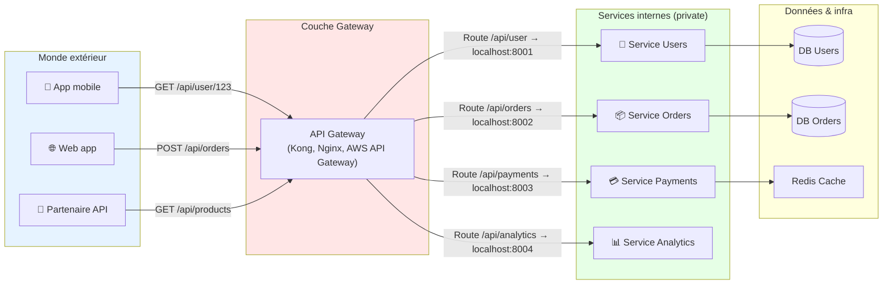
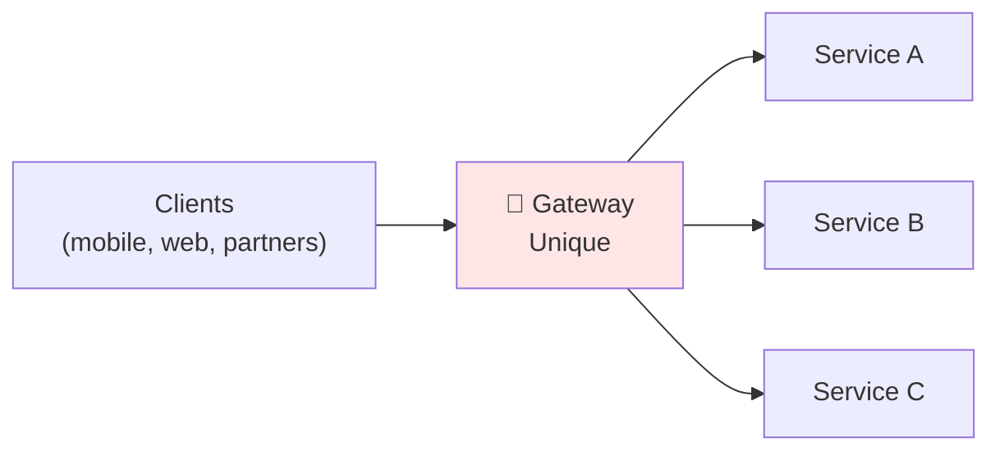
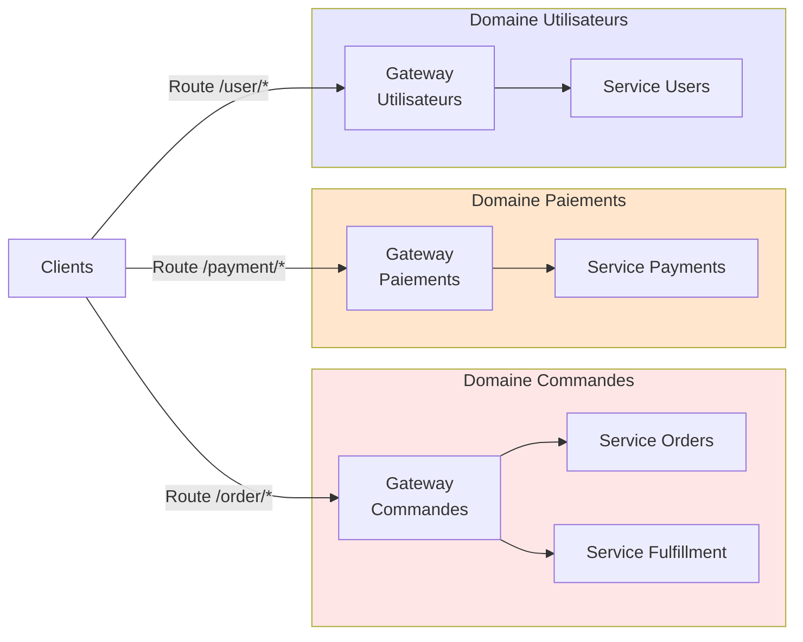
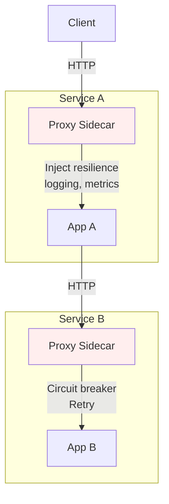

```yaml
---
layout: page
title: "API Gateway & Architecture distribuée"

course: "Maîtriser les API — de l'intégration à la conception en production"
chapter_title: "Architecture"

chapter: 5
section: 1

tags: api-gateway,architecture-distribuée,load-balancing,microservices,routing
difficulty: advanced
duration: 120
mermaid: true

icon: "🔀"
domain: "API & Intégration"
domain_icon: "🔗"
status: "published"
---

# API Gateway & Architecture distribuée

## Objectifs pédagogiques

À la fin de ce module, vous serez capable de :

1. **Concevoir** une architecture distribuée qui isole les services internes et expose un point d'entrée unifié
2. **Identifier** quand une API Gateway devient nécessaire et quels problèmes elle résout concrètement
3. **Mettre en place** un gateway (Kong, AWS API Gateway, nginx) en tant que couche de routage, sécurité et transformation
4. **Arbitrer** entre différentes topologies (gateway centralisé, gateway par domaine, sidecar) selon la taille de l'équipe et la complexité
5. **Opérer** un gateway en production : monitoring, rate-limiting, circuit-breaking, cache

---

## Mise en situation

Imaginez une startup qui a démarré avec une seule application monolithe. Elle expose une API REST, tout fonctionne. Puis l'équipe grandit, on démarre des équipes produit différentes. Naturellement, on décompose en microservices : un service pour les utilisateurs, un pour les commandes, un pour les paiements.

Maintenant, le client mobile appelle trois services différents en parallèle, chaque service expose ses propres authentifications, ses propres erreurs 500 qui ne remontent pas de la même façon. Une équipe change son API sans coordination — les clients cassent. On ajuste les réponses au cas par cas dans les clients plutôt que dans l'infra.

À 15 microservices, c'est devenu intenable. Les clients (web, mobile, partenaires externes) ne devraient pas connaître la topologie interne. Il faut une **couche de façade** : une API Gateway.

C'est exactement le problème qu'on résout maintenant.

---

## Pourquoi une API Gateway ?

Sans gateway, vous avez deux choix mauvais :

**Option 1 : Les clients savent tout**  
Chaque client (mobile, web, partenaire) connaît où trouver chaque service. Quand vous réorganisez vos microservices (fusion, split, changement de port), tous les clients cassent. L'API devient un contrat interne, fragile.

**Option 2 : On centralise la logique dans les clients**  
Un client fait 5 appels HTTP en parallèle, agrège les résultats, gère les timeouts, réessaie en cas d'erreur. C'est de la logique système répétée dans React, Swift, Python. Dès que vous trouvez un bug de retry, vous le corrigez partout.

**Option 3 (la bonne) : Une API Gateway**  
Un point d'entrée unique. Elle sait où sont les vrais services. Elle agrège, transforme, rate-limite, authentifie. Les clients parlent à la gateway, qui parle aux services. Quand vous changez d'infra interne, c'est transparent pour les clients. La logique résilience vit une fois, au même endroit.

C'est un simple décalage d'abstraction : les services internes ne sont plus une **API publique**, ce sont des **services privés**. La gateway en est l'**API publique**.

---

## Architecture générale : du client au service



**Le modèle en couches :**

1. **Clients externes** (mobile, web, partenaires) — ne connaissent QUE le hostname de la gateway
2. **API Gateway** — point d'entrée unique, tourne souvent sur un port standard (80/443)
3. **Services internes** — écoutent sur des ports localhost ou sur un réseau privé, jamais directement accessibles
4. **Données** — DB, cache, files d'attente — accessibles UNIQUEMENT depuis les services

La gateway fait le **routage** (URL → service), mais aussi bien d'autres choses : authentification, transformation, rate-limiting, caching, observation.

---

## Composants et responsabilités d'une API Gateway

| Responsabilité | Détail | Exemple |
|---|---|---|
| **Routage (routing)** | Diriger une requête vers le service approprié selon le chemin / méthode | `GET /api/users/*` → Service Users ; `POST /api/orders/*` → Service Orders |
| **Authentification** | Valider le token / clé API AVANT de parler au service | Valider JWT, vérifier OAuth, bloquer les requests sans bearer token |
| **Transformation** | Modifier la requête / réponse selon les règles | Ajouter un header `X-User-ID`, extraire le user ID du JWT, formater les erreurs uniformément |
| **Rate-limiting** | Limiter le nombre de requêtes par client/IP | 100 req/min par utilisateur, 10000 req/min par API key |
| **Caching** | Réduire les appels aux services en gardant les réponses | Cache `GET /api/products` 5 minutes, évite de requêter le service à chaque fois |
| **Load balancing** | Distribuer les requêtes entre plusieurs instances du même service | 2 instances de Service Users → la gateway alterne entre les deux |
| **Circuit breaking** | Isoler un service qui dysfonctionne pour éviter une cascade de timeouts | Si Service Payments répond en >2s pendant 10 sec, arrêter de lui envoyer des requêtes, renvoyer une erreur contrôlée |
| **Agrégation** | Combiner plusieurs services en une seule réponse | `GET /api/dashboard` → appelle Users + Orders + Analytics, combine les réponses en une seule |
| **Logging / Monitoring** | Tracer et observer chaque requête pour diagnostiquer les problèmes | Log les erreurs 5xx, la latence par endpoint, les clients qui font des erreurs d'auth |

La gateway n'est pas un simple proxy HTTP — c'est un **orateur intelligent** entre le monde et votre infra.

---

## Trois topologies : quand les utiliser

### 1. Gateway centralisé (la plus courante pour commencer)

**Topologie :**  
Un seul gateway, tous les services passent par lui. Comme un aéroport avec un seul terminal.



**Quand ?**
- Équipe < 20 personnes
- Architecture < 10 services
- Un point d'authentification suffit (tout le monde utilise le même schéma de sécurité)

**Avantages :**
- Simple à mettre en place
- Une source de vérité pour l'authentification et le rate-limiting
- Facile à monitorer (un seul composant central)

**Inconvénients :**
- Point unique de défaillance (si la gateway est down, tout est down)
- Peut devenir un goulot d'étranglement sous forte charge
- Toutes les équipes partagent les mêmes règles (difficile si une équipe a besoin d'une stratégie de cache différente)

💡 **Astuce** — Même avec un gateway unique, déployez-le en 2-3 instances derrière un load balancer. Ça coûte rien, ça élimine le point unique de défaillance.

---

### 2. Gateway par domaine (équipes autonomes)

**Topologie :**  
Chaque domaine métier (Commande, Paiement, Utilisateur) a son propre gateway. Les clients parlent à plusieurs gateways en parallèle, ou un gateway public les coordonne.



**Quand ?**
- Équipes > 20, organisées par domaine métier
- Chaque domaine a ses propres règles (cache, rate-limiting, authentification)
- Services qui appartiennent au même domaine communiquent entre eux directement (pas via la gateway)

**Avantages :**
- Chaque équipe contrôle son gateway
- Pas de contention (chaque domaine a ses ressources propres)
- Scalabilité : une équipe peut optimiser son cache sans affecter les autres

**Inconvénients :**
- Coordination requise pour les opérations transverses (exemple : authentification globale)
- Client doit connaître plusieurs endpoints (ou il y a un gateway "public" qui les agrège)
- Plus d'infrastructure à opérer (3 gateways = 3× plus de monitoring, logs, déploiements)

---

### 3. Sidecar pattern (Service Mesh)

**Topologie :**  
Chaque service a un proxy minuscule qui s'exécute à côté (le "sidecar"). C'est la topologie d'une **service mesh** (Istio, Linkerd).



**Quand ?**
- Vous avez une vraie service mesh en place (Istio, Linkerd)
- Vous avez besoin de résilience fine au niveau réseau (pas seulement au niveau de la gateway)
- Architecture > 30 services

**Avantages :**
- Gestion décentralisée de la résilience (chaque service gère son entrée/sortie)
- Observabilité fine au niveau réseau (la mesh trace chaque appel)
- Pas de gateway centralisé à scaler

**Inconvénients :**
- Complexité opérationnelle très élevée
- Overhead CPU/mémoire (un proxy par pod = surcharge)
- Courbe d'apprentissage abrupte pour l'équipe

⚠️ **Erreur fréquente** — Adopter une service mesh pour résoudre un problème qu'un gateway centralisé peut résoudre simplement. 90% des équipes n'en ont pas besoin. Commencez par un gateway, évaluez si vous avez vraiment besoin de plus.

---

## Fonctionnement détaillé d'une API Gateway

### Cycle de vie d'une requête

Voici ce qui se passe **réellement** quand un client appelle la gateway :

```mermaid
sequenceDiagram
    participant client as Client
    participant gw as Gateway
    participant auth as Auth Service
    participant service as Microservice
    participant cache as Cache

    client->>gw: 1. GET /api/products?id=123<br/>(avec header Authorization: Bearer <token>)
    
    gw->>gw: 2. Lookup route<br/>(chemin /api/products → Service Products)
    
    gw->>gw: 3. Check cache<br/>(clé: GET /api/products?id=123)
    gw-->>gw: Cache miss
    
    gw->>auth: 4. Validate token<br/>(extraction + JWT signature)
    auth-->>gw: ✅ Valid, User ID = 456
    
    gw->>gw: 5. Rate limit check<br/>(User 456 : 45/100 requêtes ce min)
    gw-->>gw: ✅ OK, continue
    
    gw->>gw: 6. Transform request<br/>(ajouter header X-User-ID: 456)
    
    gw->>service: 7. Forward request<br/>GET /internal/products?id=123<br/>Header: X-User-ID: 456
    
    service-->>gw: 8. Response<br/>200 OK + body JSON
    
    gw->>cache: 9. Store in cache<br/>(TTL: 5 min)
    
    gw->>gw: 10. Transform response<br/>(si nécessaire)
    
    gw-->>client: 11. Return response<br/>200 OK + same body

    style gw fill:#ffe6e6
```

**Chaque étape en détail :**

| Étape | Détail |
|-------|--------|
| 1. Parsing | La gateway reçoit la requête HTTP, parse le chemin, headers, body |
| 2. **Routing** | Recherche dans les règles : quel service ? Exemple : `/api/products` → `http://localhost:8003` |
| 3. **Cache lookup** | Avant d'appeler le service, on cherche dans Redis/Memcached. Si trouvé, on peut ignorer les étapes suivantes |
| 4. **Auth** | Valider le token JWT, OAuth, clé API. Si invalide → répondre 401 immédiatement, ne pas appeler le service |
| 5. **Rate limiting** | Compter : combien de requêtes ce client a-t-il déjà fait ? Si dépassé → répondre 429 Too Many Requests |
| 6. **Request transformation** | Modifier la requête avant de l'envoyer au service (ajouter headers, modifier le body, filtrer les champs) |
| 7. **Forward** | Appeler le service réel, avec timeout (ex : 5 sec) |
| 8. **Response** | Le service répond. La gateway reçoit le status code et le body |
| 9. **Cache store** | Si c'était un GET, stocker la réponse en cache pour les prochains appels identiques |
| 10. **Response transformation** | Modifier la réponse avant de la renvoyer au client (filtrer les champs sensibles, reformater) |
| 11. **Send to client** | Renvoyer la réponse au client |

Si **n'importe quelle** étape échoue (auth échouée, rate limit atteint, service timeout), on s'arrête là et on répond au client avec une erreur appropriée. Le service ne reçoit jamais la requête.

💡 **Astuce** — C'est pour ça qu'une gateway peut significativement réduire la charge sur les services : le caching + le rate-limiting + l'auth stoppent 70% des requêtes inutiles avant qu'elles n'arrivent au service.

---

### Authentification dans une gateway

L'authentification dans la gateway n'est **pas** du contrôle d'accès — c'est juste vérifier "qui es-tu ?".

**Flux JWT classique :**

1. Client appelle `/auth/login` (route non protégée) avec username + password
2. Service Auth retourne un JWT : `eyJhbGciOiJIUzI1NiIs...` (contient user_id, scopes, exp)
3. Client ajoute le JWT dans le header : `Authorization: Bearer eyJhbGc...`
4. Gateway valide la signature du JWT (clé secrète partagée) → extrait le user_id
5. Gateway ajoute l'user_id dans un header `X-User-ID` ou `X-User-Context`
6. Le microservice utilise cet header (il peut faire confiance à la gateway pour l'authentification)

```
Client                           Gateway                      Service
   |                               |                           |
   |--- GET /products              |                           |
   |    Header: Bearer <JWT> ----> | Valider JWT signature     |
   |                               | Extraire user_id         |
   |                               |                           |
   |                               |--- GET /internal/products |
   |                               |    Header: X-User-ID: 123 |
   |                               |<--- 200 OK + data ------- |
   |<---- 200 OK + data ---------- |
```

**Avantage :** Les services **ne connaissent pas** le schéma d'authentification (JWT vs OAuth vs API Key). La gateway s'en charge. Si vous changez votre auth, vous modifiez juste la gateway, pas 20 services.

⚠️ **Erreur fréquente** — Faire l'authentification dans chaque service individuellement. La gateway c'est précisément pour éviter ça. L'auth doit être **une seule fois**, au point d'entrée.

---

### Rate limiting : plusieurs stratégies

| Stratégie | Détail | Cas d'usage |
|-----------|--------|-----------|
| **Per user** | Max N requêtes par user, par minute | Utilisateurs gratos limités à 100 req/min, payants à 10000 req/min |
| **Per IP** | Max N requêtes par adresse IP | Limiter les bots qui font du scraping |
| **Per API key** | Max N requêtes par clé API | Partenaires : clé A = 1000 req/min, clé B = 5000 req/min |
| **Global** | Max N requêtes totales, par minute | Ne pas dépasser la capacité du service (ex : 100k req/min max) |
| **By endpoint** | Rate limit différent selon le chemin | `POST /upload` très coûteux → limité à 10 req/min ; `GET /status` → 1000 req/min |

**Implémentation typique avec Redis :**

```
Key: "ratelimit:<user_id>"
Value: nombre de requêtes ce minute
TTL: 60 sec

À chaque requête :
  1. user_id = extrait du JWT
  2. count = redis.get("ratelimit:<user_id>")
  3. if count > LIMIT → répondre 429
  4. redis.incr("ratelimit:<user_id>")
  5. redis.expire("ratelimit:<user_id>", 60)  ← reset après 60 sec
```

💡 **Astuce** — Avec Redis, le rate limiting peut être très rapide (<1ms). Utilisez des pipelines Redis pour batcher les opérations si vous avez beaucoup de trafic.

---

### Caching intelligent

Cacher **naïvement** toutes les réponses est dangereux (risque de données obsolètes). La bonne approche :

| Règle | Détail | Exemple |
|-------|--------|---------|
| **Cache seulement GET** | POST/PUT/DELETE modifient l'état → ne pas cacher | GET /products → cache 5 min ; POST /orders → pas de cache |
| **TTL court pour données volatiles** | Données qui changent souvent → TTL court | Stock produit → 10 sec ; Configuration utilisateur → 1 sec |
| **TTL long pour données stables** | Prix, descriptions → TTL long | Produit → 1 heure ; Catégorie → 24 heures |
| **Invalidation active** | Quand une donnée change, la gateway doit invalider son cache | Service Orders crée une commande → envoie event "orders:updated" → gateway invalide le cache |
| **Conditional requests** | Utiliser `ETag` et `Last-Modified` pour réduire la bande passante | Client envoie `If-None-Match: <etag>` → service répond 304 Not Modified au lieu de renvoyer le body |

**Implémentation en pseudo-code :**

```python
def handle_request(method, path, body):
    if method == "GET":
        cache_key = f"cache:{path}"
        cached = redis.get(cache_key)
        if cached:
            return cached  # 1ms au lieu de 100ms d'appel service
        
        response = call_service(path, body)
        
        if response.status == 200:
            ttl = get_cache_ttl(path)  # Règle basée sur le chemin
            redis.setex(cache_key, ttl, response.body)
        
        return response
    
    else:  # POST, PUT, DELETE
        # Invalider les caches associés
        invalidate_related_caches(path)
        return call_service(path, body)
```

⚠️ **Erreur fréquente** — Ne pas invalider le cache. Exemple classique : client crée une commande (POST /orders), puis fetch la liste (GET /orders). S'il y a un cache sur la liste, il voit l'ancienne version. Il faut que le POST invalide le cache du GET.

---

## Construction progressive : de v1 à v3 production

### v1 : Gateway minimal

**Objectif :** Sortir un point d'entrée unique.

**Composants :**
- Nginx ou Kong (mode simple)
- Routage vers 3 services
- Pas de cache, pas de auth, juste un proxy

**Configuration nginx basique :**

```nginx
upstream users_backend {
    server localhost:8001;
}

upstream orders_backend {
    server localhost:8002;
}

upstream payments_backend {
    server localhost:8003;
}

server {
    listen 80;
    server_name api.example.com;

    location /api/users/ {
        proxy_pass http://users_backend;
        proxy_set_header Host $host;
        proxy_set_header X-Real-IP $remote_addr;
    }

    location /api/orders/ {
        proxy_pass http://orders_backend;
        proxy_set_header Host $host;
        proxy_set_header X-Real-IP $remote_addr;
    }

    location /api/payments/ {
        proxy_pass http://payments_backend;
        proxy_set_header Host $host;
        proxy_set_header X-Real-IP $remote_addr;
    }
}
```

**Test :**

```bash
curl http://api.example.com/api/users/123
# Doit renvoyer la réponse de localhost:8001/api/users/123
```

**Avantages :** Simple, 50 lignes de config, déploie en 5 min.  
**Limitations :** Aucune sécurité, services peuvent tomber, pas d'observabilité.

---

### v2 : Ajouter authentification + rate limiting

**Amélioration 1 : Authentification**

Utiliser Kong (beaucoup plus facile qu'une config nginx de 500 lignes).

```bash
# Installer Kong (docker)
docker run -d --name kong-db \
  -e POSTGRES_USER=kong \
  -e POSTGRES_DB=kong \
  postgres:latest

docker run -d --name kong \
  -e KONG_DATABASE=postgres \
  -e KONG_PG_HOST=kong-db \
  -p 8000:8000 \
  -p 8001:8001 \
  kong:latest

# Configurer via API Kong
curl -X POST http://localhost:8001/services \
  -d "name=users_service" \
  -d "url=http://localhost:8001"

curl -X POST http://localhost:8001/services/users_service/routes \
  -d "paths[]=/api/users"

# Ajouter plugin JWT
curl -X POST http://localhost:8001/services/users_service/plugins \
  -d "name=jwt"

# Créer une clé JWT pour un client
curl -X POST http://localhost:8001/consumers \
  -d "username=mobile_client"

curl -X POST http://localhost:8001/consumers/mobile_client/jwt \
  -d "secret=<GENERATED_SECRET>"
```

Maintenant, chaque requête doit avoir un JWT valide.

**Amélioration 2 : Rate limiting**

```bash
curl -X POST http://localhost:8001/services/users_service/plugins \
  -d "name=rate-limiting" \
  -d "config.minute=100"  # Max 100 requêtes par minute par client
```

**Résultat :** Quand un client appelle `/api/users` sans JWT, il reçoit 401. Quand il dépasse 100 requêtes/min, il reçoit 429.

**Avantages :**
- Sécurité basique en place
- Services sont protégés contre les abus
- Configuration déclarative (facile à changer)

**Limitations :**
- Pas de caching → les services sont toujours sollicités
- Pas de circuit breaking → si un service est lent, tout le monde attend
- Pas d'observabilité → on ne sait pas ce qui se passe

---

### v3 : Production-ready avec cache + circuit breaking + monitoring

**Amélioration 1 : Caching avec Redis**

```bash
# Ajouter plugin Redis cache à Kong
curl -X POST http://localhost:8001/services/users_service/plugins \
  -d "name=response-transformer" \
  -d "config.add.headers[]=Cache-Control: public, max-age=300"

# Plus avancé : Kong + plugin response-cache
curl -X POST http://localhost:8001/services/users_service/plugins \
  -d "name=response-cache" \
  -d "config.memory.backend=redis" \
  -d "config.redis.host=redis:6379" \
  -d "config.cache_ttl=300"
```

Résultat : `GET /api/users/123` est mis en cache 5 min. Si 100 clients demandent le même user, seul le 1er appelle le service.

**Amélioration 2 : Circuit breaking + retry**

```bash
curl -X POST http://localhost:8001/services/users_service/plugins \
  -d "name=request-termination" \
  -d "config.trigger_on=service_unavailable"

# Ou utiliser Resilience4j dans le service lui-même
# (circuit breaker au niveau service, pas gateway)
```

**Amélioration 3 : Logging / Monitoring**

```bash
# Logs HTTP dans Elasticsearch
curl -X POST http://localhost:8001/services/users_service/plugins \
  -d "name=http-log" \
  -d "config.http_endpoint=http://logstash:8000"

# Métriques Prometheus
curl -X POST http://localhost:8001/plugins \
  -d "name=prometheus"

# Maintenant, Prometheus scrape http://gateway:8001/metrics
# et voit : kong_http_requests_total{method="GET", status="200", service="users_service"}
```

**Architecture v3 :**

```mermaid
graph LR
    client["Clients"]
    
    subgraph gateway_cluster["Gateway Cluster (3 instances)"]
        gw1["Kong 1"]
        gw2["Kong 2"]
        gw3["Kong 3"]
    end
    
    subgraph cache_layer["Cache Layer"]
        redis["Redis Cluster<br/>(cache responses)"]
    end
    
    subgraph observability["Observability"]
        prom["Prometheus<br/>(metrics)"]
        elk["Elasticsearch<br/>(logs)"]
    end
    
    subgraph services["Microservices"]
        svc1["Service A"]
        svc2["Service B"]
        svc3["Service C"]
    end
    
    lb["Load Balancer<br/>(nginx)"]
    
    client --> lb
    lb --> gw1
    lb --> gw2
    lb --> gw3
    
    gw1 --> redis
    gw2 --> redis
    gw3 --> redis
    
    gw1 --> svc1
    gw2 --> svc2
    gw3 --> svc3
    
    gw1 --> prom
    gw2 --> prom
    gw3 --> prom