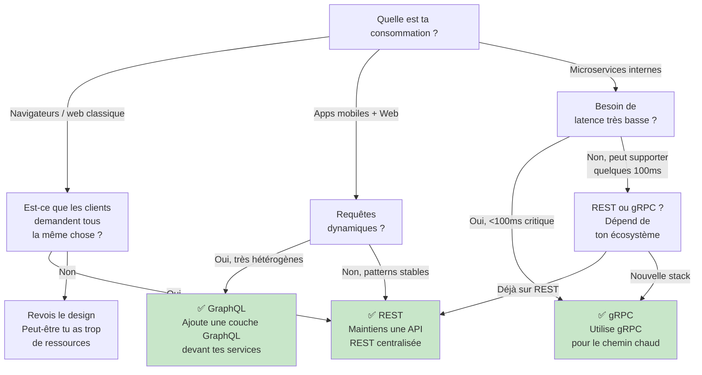

```yaml
---
layout: page
title: "Protocoles avancés : REST vs GraphQL vs gRPC"

course: "API REST"
chapter_title: "Protocoles avancés"

chapter: 3
section: 1

tags: rest,graphql,grpc,protocoles,api,comparatif,production
difficulty: advanced
duration: 120
mermaid: true

icon: "⚡"
domain: "Backend & Intégration"
domain_icon: "🔌"
status: "published"
---

# Protocoles avancés : REST vs GraphQL vs gRPC

## Objectifs pédagogiques

À la fin de ce module, vous serez capable de :

- **Comparer** REST, GraphQL et gRPC sur les critères d'une API production (latence, bande passante, complexité, écosystème)
- **Évaluer** lequel utiliser selon votre contexte (mobile vs backend-to-backend, forte vs faible bande passante, équipe)
- **Implémenter** les trois protocoles dans une même application et mesurer les différences réelles
- **Identifier** les pièges courants (over-fetching en REST, N+1 en GraphQL, maintenance de gRPC) et les éviter

---

## Mise en situation

Vous avez une application e-commerce qui grandit. Vous commencez avec une API REST classique pour servir le web. Mais maintenant :

- L'équipe mobile déploie un app sur 4G lente
- Un partenaire B2B vous demande une API pour son reporting analytique
- L'équipe data science veut accéder à vos données sans créer de dépendance client-serveur lourde
- Vous avez besoin de communication très rapide et structurée entre microservices internes

À ce stade, une seule API REST commence à montrer ses limites. Ce module vous montre comment choisir et utiliser les bons outils pour chaque contexte.

---

## Contexte et problématique

Aujourd'hui, trois paradigmes dominent la conception d'API :

**REST** a longtemps été l'unique réponse, mais il impose un modèle strict (ressources, verbes HTTP, statut codes). Quand tes cas d'usage deviennent variés, tu finis par créer des endpoints ad hoc ou tu traverses le réseau pour des données qu'un seul client demande vraiment.

**GraphQL** a émergé pour résoudre les problèmes de flexibilité : le client demande exactement les champs qu'il veut, une seule requête, pas d'over-fetching. Mais ça introduit une complexité nouvelle : queries complexes, résolvers N+1, cache HTTP perdu.

**gRPC** vient du monde des microservices. Communication ultra-rapide, typée à la compilation, streaming natif. Mais c'est binaire, pas du JSON, pas facile à déboguer, et les clients doivent générer du code.

Le piège classique : croire qu'il y a **une** bonne réponse. Il n'y en a pas. Ton choix dépend de :

- Qui consomme ton API (navigateurs, apps mobiles, services backend) ?
- Quel est le pattern d'accès (simple CRUD vs requêtes complexes et dynamiques) ?
- Quelle est ta contrainte réseau (large bande vs 4G) ?
- Quel est ton coût d'infrastructure (bande passante payante) ?
- Qui maintient le code (équipe DevOps qui veut simplifier vs équipe qui peut gérer la complexité) ?

---

## Fonctionnement détaillé et comparaison

### REST : le modèle de ressources

REST repose sur une idée simple : **ton API expose des ressources, pas des actions**.

```
GET /users/42              ← récupère l'user 42
GET /users/42/orders       ← récupère ses commandes
GET /users/42/orders/7     ← récupère la commande 7
POST /orders               ← crée une commande
```

Chaque endpoint retourne **tous les champs** de la ressource (par défaut) ou ce que le serveur décide.

**Avantages concrets :**
- Simple à comprendre et à utiliser
- Cache HTTP gratuit (GET = cacheable, POST = non-cacheable)
- Verbes HTTP clairs = réversibilité interne
- Facile à déboguer (curl, navigateur, Postman)

**Limites réelles :**
- **Over-fetching** : tu demandes `/users/42`, tu reçois `{id, name, email, phone, avatar_url, address, ...}` mais ton app mobile n'affiche que `{name, avatar_url}`. Tu as reçu inutilement 5 KB de données sur une connection 4G.
- **Under-fetching** : tu veux afficher l'user + ses 5 dernières commandes + le statut de livraison de chaque commande. Tu dois faire 7 requêtes (1 user + 1 orders + 5 order details).
- **Versioning** : tu veux ajouter un champ `subscription_tier` à User. Tu crées `/v2/users` et maintiens deux versions. Ça explose la maintenance.

💡 **Point clé** : REST est optimal quand les clients demandent à peu près la même chose. C'est contre-intuitif, mais REST fonctionne très bien en intra-réseau (microservices) où les patterns d'accès sont prévisibles et **stables**.

---

### GraphQL : la requête sous contrôle du client

GraphQL change le paradigme : **le client écrit une requête qui décrit exactement ce qu'il veut**.

```graphql
query {
  user(id: 42) {
    name
    avatar_url
    orders(limit: 5) {
      id
      total
      status
      shipping {
        carrier
        trackingNumber
      }
    }
  }
}
```

Une seule requête HTTP → une seule réponse JSON structurée exactement comme demandé.

**Avantages concrets :**
- Pas d'over-fetching : tu reçois exactement les champs que tu demandes
- Pas d'under-fetching : une requête = les données complètes
- Pas de versioning : ajoute un champ, les clients qui le demandent le reçoivent, les autres non
- Développement frontend plus rapide : pas besoin d'attendre un nouvel endpoint, tu écris la query

**Limites réelles :**
- **Complexité du serveur** : chaque champ doit être un "resolver". Si tu demandes `user → orders → shipping`, le serveur appelle le resolver User, puis pour chaque order appelle le resolver Shipping. C'est le problème **N+1** : tu dis "1 requête" mais le serveur lance 1 + N queries en base.
- **Cache HTTP cassé** : GraphQL envoie du POST (pas de GET). Les proxies HTTP ne le cachent pas. Tu dois implémenter un cache client ou serveur custom.
- **Observabilité** : avec REST, tu vois `GET /users/42` dans les logs. Avec GraphQL, tous les logs disent `POST /graphql`. Quel champs a demandé le client ? Faut parser le body.
- **Courbe d'apprentissage** : GraphQL est une spec complète. Les développeurs doivent apprendre schema, resolvers, directives, fragments.

⚠️ **Comportement contre-intuitif** : beaucoup pensent "GraphQL = plus rapide". Non. Une **requête mal écrite** en GraphQL peut faire 50 requêtes en base (N+1) et être plus lente qu'une 10 requêtes REST. Il faut mettre en place du "query cost analysis" ou des timeouts stricts.

💡 **Point clé** : GraphQL brille quand tes clients sont **hétérogènes** (web demande 20 champs, mobile en demande 5, admin demande 50, API partenaire demande 15 autres). Une seule API, zéro adapter.

---

### gRPC : communication structurée et rapide

gRPC utilise **Protocol Buffers** (binaire) sur HTTP/2. Le serveur expose des services et des méthodes, pas des ressources.

```protobuf
service UserService {
  rpc GetUser(GetUserRequest) returns (User);
  rpc ListOrders(ListOrdersRequest) returns (stream Order);
}
```

Le client génère une classe/stub typée : `client.GetUser(request)` retourne un objet User avec toutes les propriétés. Pas de JSON à parser, pas d'erreur de type à runtime.

**Avantages concrets :**
- **Performance brute** : binaire compact + HTTP/2 multiplexing = latence très basse et bande passante minimale
- **Typed at compile-time** : le client sait exactement quels champs existent, pas de "undefined" à runtime
- **Streaming natif** : tu peux envoyer et recevoir un flux infini de messages
- **Load balancing** : HTTP/2 réutilise les connexions, les proxies gèrent bien gRPC

**Limites réelles :**
- **Debugging difficile** : tu ne peux pas curl un endpoint gRPC. Les logs sont binaires. Tu dois grpcurl ou Postman Enterprise.
- **Code generation obligatoire** : change ton .proto, regenerates les stubs clients. Ça ajoute une étape de build.
- **Pas compatible HTTP/1.1 ancien** : si ton client est du Netscape 4, gRPC ne marche pas (exagéré, mais le point est : mobile de 2010 n'a pas HTTP/2).
- **Écosystème moins riche** : pas de middleware HTTP universel, tu dois utiliser les outils gRPC.

💡 **Point clé** : gRPC n'est **pas** pour les APIs publiques. C'est pour backend-to-backend, microservices, communication internes rapides.

---

## Tableau comparatif

| Critère | REST | GraphQL | gRPC |
|---------|------|---------|------|
| **Format** | JSON (texte) | JSON (texte) | Protocol Buffers (binaire) |
| **Protocole** | HTTP/1.1 ou 2 | HTTP/1.1 ou 2 (POST) | HTTP/2 obligatoire |
| **Cache HTTP** | ✅ GET cacheable natif | ❌ POST, pas de cache HTTP | ❌ Pas de cache HTTP standard |
| **Over-fetching** | ❌ Réceves tout | ✅ Exactement ce que tu demandes | ✅ Exactement ce que tu demandes |
| **Under-fetching** | ❌ Plusieurs requêtes | ✅ Une seule requête | ✅ Une seule requête |
| **Debugging** | ✅ curl, navigateur, Postman | ✅ Postman, browser playground | ❌ grpcurl, Postman Enterprise |
| **Latence** | Moyenne (JSON parsing) | Moyenne (JSON parsing) | Très basse (binaire) |
| **Bande passante** | Normale | Normale | Minimale (60-90% moins) |
| **Complexité serveur** | Faible | Haute (N+1 risk) | Moyenne |
| **Versioning** | ❌ Crée /v2 | ✅ Flexibilité native | ✅ Évolution du .proto |
| **Cas d'usage idéal** | Web, APIs simples, intra-réseau stables | Web/mobile hétérogènes, requêtes dynamiques | Microservices, backend-to-backend, temps réel |
| **Qui l'utilise** | 95% des APIs publiques | Airbnb, GitHub, Shopify | Google, Netflix, Uber |

---

## Diagramme décisionnel



---

## Prise de décision : matrice contexte → protocole

### Cas 1 : API publique pour développeurs externes

**Contexte :** Tu fournis une API SaaS. Des centaines de développeurs l'utilisent pour intégrer ton service dans leurs apps.

| Critère | Importance |
|---------|-----------|
| Simplicité d'apprentissage | 🔴 Très haute |
| Debugging facile | 🔴 Très haute |
| Documentation légère | 🟡 Moyenne |
| Performance peak | 🟢 Basse |
| Maintenance côté serveur | 🟡 Moyenne |

**Recommandation : REST** (ou REST + GraphQL optionnel)

**Pourquoi :** Les développeurs externes n'ont pas envie d'apprendre une nouvelle spec. `curl` doit fonctionner. Les erreurs doivent être claires. REST reste le standard.

**Implémentation :** Offre une API REST solide. Si beaucoup de clients mobiles se plaignent de la bande passante, ajoute un endpoint GraphQL optionnel pour les clients qui le supportent.

---

### Cas 2 : Application mobile + web + partenaires API

**Contexte :** Une app mobile sur iOS et Android, un site web React, un partenaire B2B qui fait du reporting. Chaque client a des besoins légèrement différents.

| Critère | Importance |
|---------|-----------|
| Flexibilité requêtes | 🔴 Très haute |
| Bande passante 4G | 🟡 Moyenne-Haute |
| Perf serveur | 🟡 Moyenne |
| Debugging mobile | 🟡 Moyenne |
| Écosystème outils | 🔴 Très haute |

**Recommandation : GraphQL** (avec fallback REST simple)

**Pourquoi :** GraphQL permet à chaque client de demander ses champs sans créer un nouvel endpoint. La bande passante est minimisée. Les outils (Apollo Client, Relay) facilitent le frontend.

**Implémentation :** 
1. Crée un schéma GraphQL public
2. Ajoute un système de "query cost analysis" : refuse les requêtes > 10 000 points de complexité
3. Mets en cache les requêtes client-side (Apollo cache)
4. Pour les partenaires API simples, offre des queries pré-écrites (saved queries)

---

### Cas 3 : Microservices internes, haute fréquence

**Contexte :** Ton système est découpé en 20 microservices. Service A appelle Service B 10 000 fois/sec. Chaque 100ms de latence = 1 million de requêtes bloquées.

| Critère | Importance |
|---------|-----------|
| Latence P99 | 🔴 Très haute |
| Bande passante inter-services | 🟡 Moyenne |
| Sérialisation typée | 🟡 Moyenne |
| Debugging opérations | 🟡 Moyenne |
| Écosystème DevOps | 🔴 Très haute |

**Recommandation : gRPC** (avec cache Redis si stateless possible)

**Pourquoi :** gRPC sur HTTP/2 réutilise les connexions. Le binaire compact minimise la sérialisation. La typing à la compilation prévient les bugs.

**Implémentation :**
1. Définis tes .proto services
2. Génère les stubs clients/serveurs
3. Ajoute un circuit breaker (grpc/grpc-go libraries)
4. Utilise gRPC interceptors pour les logs et metriques
5. Monitore la latence avec Prometheus + Grafana

---

## Construction progressive : de REST pur à architecture hybride

Beaucoup d'équipes pensent à tort "REST ou GraphQL", comme si c'était un choix unique. En réalité, une API mature combine les deux.

### Étape 1 : REST de base (mois 0-3)

```
GET /users/:id              → {id, name, email, ...}
GET /users/:id/orders       → [{id, date, total, ...}]
```

Simple. Fonctionne pour le web initial. Les développeurs comprennent immédiatement.

**Problème rencontré :** L'app mobile commence à dropper les connexions (over-fetching sur 4G).

### Étape 2 : Sparse fieldset REST (mois 3-6)

Tu ajoutes un paramètre `?fields=id,name,avatar_url` :

```
GET /users/:id?fields=id,name,avatar_url
```

Réduit le payload. Évite le code GraphQL (plus simple).

**Limite rencontrée :** Toujours 2-3 requêtes pour une vue complète (user + orders + shipping). Pas optimal.

### Étape 3 : GraphQL couche optionnelle (mois 6-12)

Tu ajoutes un endpoint `/graphql` en parallèle. Les clients qui supportent GraphQL l'utilisent, les autres restent sur REST.

```graphql
query {
  user(id: 42) {
    id
    name
    avatar_url
    orders(limit: 5) {
      id
      total
      shipping { carrier }
    }
  }
}
```

Une requête, une réponse structurée, pas d'over-fetching.

**Mais attention :** Le resolver pour `user → orders → shipping` est naïf.

```javascript
// ❌ N+1 : pour chaque order, appel DB
const resolvers = {
  Query: {
    user: (_, { id }) => db.users.findById(id)
  },
  User: {
    orders: (user) => db.orders.find({ userId: user.id })
  },
  Order: {
    shipping: (order) => db.shipping.findById(order.shippingId) // ← N requêtes !
  }
};
```

Solution : **DataLoader** (batch les requêtes similaires).

```javascript
// ✅ Batch : gather toutes les shippingIds, appel DB une seule fois
const resolvers = {
  Order: {
    shipping: (order) => shippingLoader.load(order.shippingId)
  }
};

const shippingLoader = new DataLoader(async (shippingIds) => {
  const shippings = await db.shipping.findByIds(shippingIds);
  return shippingIds.map(id => shippings.find(s => s.id === id));
});
```

Résultat : 1 requête GraphQL = 1 requête User + 1 requête Orders + 1 requête Shippings (batch) = 3 requêtes totales, pas 7.

### Étape 4 : gRPC service-to-service (mois 12+)

Les microservices n'utilisent pas GraphQL entre eux. Trop lent, trop de parsing. Tu utilises gRPC :

```protobuf
service UserService {
  rpc GetUser(GetUserRequest) returns (User);
  rpc GetOrders(GetOrdersRequest) returns (stream Order);
}
```

Les clients externes consomment REST/GraphQL. Les services internes consomment gRPC.

---

## Sécurité et contrôle d'accès avancé

### REST : authorization simple

```http
GET /users/42
Authorization: Bearer <JWT>
```

L'API vérifie le token, vérifie que tu as accès à user 42, retourne les données.

**Faiblesse :** Aucun contrôle sur ce que tu récupères. Si l'endpoint retourne `password_hash`, tu le reçois.

**Solution :** Whitelist les champs retournés dans le code, ou utilise Sparse Fieldset avec validation serveur.

### GraphQL : authorization par champ

```graphql
query {
  user(id: 42) {
    name               # ✅ public
    email              # ✅ Si tu es connecté
    stripeCustomerId   # ❌ Admin uniquement
  }
}
```

Tu peux mettre de l'authorization au niveau du **resolver** pour chaque champ :

```javascript
const resolvers = {
  User: {
    email: (user, _, context) => {
      if (!context.isAuthenticated) return null;
      return user.email;
    },
    stripeCustomerId: (user, _, context) => {
      if (!context.isAdmin) throw new Error("Unauthorized");
      return user.stripeCustomerId;
    }
  }
};
```

**Avantage :** Contrôle granulaire sans créer des endpoints différents.

**Piège :** Si tu peux vérifier "suis-je un admin" avant de faire la requête, certains clients vont l'utiliser pour deviner si tu es admin ("silently return null" vs "throw error"). À minimiser.

### gRPC : authorization avant la méthode

```protobuf
rpc GetUser(GetUserRequest) returns (User) {}
```

L'authorization se fait via **interceptors** (middleware gRPC) :

```go
func authInterceptor(ctx context.Context, req interface{}, info *grpc.UnaryServerInfo, handler grpc.UnaryHandler) (interface{}, error) {
  token := extractTokenFromContext(ctx)
  if !isValid(token) {
    return nil, status.Error(codes.Unauthenticated, "invalid token")
  }
  return handler(ctx, req)
}
```

Tout simple, global. Pas de résolvers per-field.

---

## Bonnes pratiques pour chaque protocole

### REST

**1. Respecte les codes HTTP.**

- 200 OK : requête succès
- 201 Created : ressource créée
- 400 Bad Request : données invalides (tu as envoyé du JSON mal formé)
- 401 Unauthorized : pas d'authentification
- 403 Forbidden : authentifié, mais pas d'accès
- 404 Not Found : ressource n'existe pas
- 429 Too Many Requests : rate limit dépassé

❌ Ne pas faire : `200 OK { error: "user not found" }`. C'est un 404.

**2. Utilise les headers standard.**

- `Authorization: Bearer <token>` pour l'auth
- `Content-Type: application/json` sur les requêtes POST/PUT/PATCH
- `Cache-Control: max-age=3600` pour les réponses cachables
- `ETag` + `If-None-Match` pour le cache validation (si t'as un CDN)

**3. Documente avec OpenAPI/Swagger.**

Chaque endpoint doit avoir un contrat précis : paramètres, codes de réponse, exemples.

```yaml
/users/{id}:
  get:
    summary: Get user by ID
    parameters:
      - name: id
        in: path
        required: true
        schema:
          type: integer
    responses:
      200:
        content:
          application/json:
            schema:
              $ref: '#/components/schemas/User'
      404:
        description: User not found
```

---

### GraphQL

**1. Query cost analysis.**

Refuse les requêtes qui demandent trop de données :

```javascript
const cost = calculateQueryCost(query);
if (cost > 10000) throw new Error("Query too expensive");
```

Exemple de coûts :
- Récupérer un user = 1 point
- Récupérer 100 orders = 100 points
- Deep nesting (user → orders → shipping → invoices → items) = explosion exponentielle

**2. Utilise DataLoader.**

Toute requête N+1 est un piège caché :

```javascript
// Sans DataLoader : user(id: 1) → 1 requête users + N requêtes orders
// Avec DataLoader : batch les orders → 1 requête orders pour tous les users
```

Intègre DataLoader dès le départ. C'est une dépendance, pas une optimisation.

**3. Mets en place un timeout global.**

```javascript
const result = await graphql(schema, query, rootValue, { timeout: 5000 });
```

Protège contre les requêtes qui boucleraient ou scannent la base.

**4. Documente ton schéma.**

GraphQL permet des descriptions introspectables :

```graphql
"""
Représente un utilisateur de la plateforme.
"""
type User {
  """ID unique de l'utilisateur."""
  id: ID!
  """Email unique."""
  email: String! @auth(requires: "user")
}
```

Les clients lisent le schéma dans l'IDE. Zéro ambiguïté.

---

### gRPC

**1. Versionne tes .proto.**

```protobuf
message User {
  int32 id = 1;
  string name = 2;
  string email = 3;
  // Nouveau champ ? ajoute-le avec un numero de champ inutilisé
  string avatar_url = 4; // ← Ancien client ignore, nouveau client utilise
}
```

Backward compatible naturellement. Pas besoin de `/v2`.

**2. Utilise les interceptors pour les observabilité.**

```go
conn.WithUnaryInterceptor(
  grpc_middleware.ChainUnaryClient(
    grpc_logging.UnaryClientInterceptor(logger),
    grpc_retry.UnaryClientInterceptor(),
    grpc_prometheus.UnaryClientInterceptor(),
  ),
)
```

Logs, retry automatique, metriques Prometheus. Tout en une ligne.

**3. Streaming pour les données volumineuses.**

Ne seriales pas un million de records en une réponse. Stream les :

```protobuf
rpc ListOrders(ListOrdersRequest) returns (stream Order);
```

Le client reçoit les ordres au fur et à mesure, pas d'explosion mémoire.

**4. Teste avec grpcurl.**

```bash
grpcurl -plaintext -d '{"id": 42}' localhost:50051 users.UserService/GetUser
```

Moins intuitif que `curl`, mais c'est le standard pour gRPC.

---

## Cas réel en entreprise : ecommerce polycanal

Une startup de vente en ligne a commencé avec une API REST simple pour son site web. 18 mois après, voici leur stack :

### Architecture avant

```
┌─────────────────────────────────┐
│      Web (Next.js)              │
│  Fait 100+ requêtes REST        │
└────────────┬────────────────────┘
             │
             ▼
      ┌──────────────┐
      │ API REST v1  │
      │ (Express.js) │
      └──────────────┘
             │
             ├─→ Users DB
             ├─→ Orders DB
             └─→ Inventory DB
```

**Problèmes rencontrés :**
- App mobile télécharge 50 KB par requête (over-fetching)
- Afficher une commande + ses produits + le statut livraison = 5 requêtes
- Ajouter un nouveau champ = modification d'un endpoint = nouvelle version v2
- Microservices internes parlent REST = trop de parsing JSON

### Architecture après (mois 18)

```
┌──────────────────┐    ┌──────────────────┐    ┌──────────────────┐
│   Web (Next.js)  │    │ Mobile (React)   │    │ Admin Dashboard  │
└────────┬─────────┘    └────────┬─────────┘    └────────┬─────────┘
         │                       │                       │
         └───────────────────────┼───────────────────────┘
                                 │
                    ┌────────────▼────────────┐
                    │   API Gateway (Kong)    │
                    │  - Auth + Rate Limit    │
                    │  - Metrics              │
                    └────────────┬────────────┘
                                 │
         ┌───────────────────────┼───────────────────────┐
         │                       │                       │
    ┌────▼───────┐        ┌─────▼──────┐        ┌──────▼─────┐
    │ GraphQL    │        │ REST API   │        │ gRPC stub  │
    │ (Apollo)   │        │ (Express)  │        │ (Node.js)  │
    └────┬───────┘        └─────┬──────┘        └──────┬─────┘
         │                      │                      │
    ┌────▼──────────────────────▼──────────────────────▼────┐
    │        Microservices (gRPC inter-service)             │
    │  - Users Service (gRPC)                               │
    │  - Orders Service (gRPC)                              │
    │  - Inventory Service (gRPC)                           │
    │  - Payments Service (gRPC)                            │
    └─────────────────────────────────────────────────────┘
```

### Implémentation réelle

**1. GraphQL pour le web/mobile public :**

```graphql
# Les clients demandent exactement ce qu'ils veulent
query {
  viewer {
    id
    name
    # Mobile ne demande pas la stripe ID, web non plus. Admin va l'ajouter.
  }
  orders(first: 5) {
    edges {
      node {
        id
        total
        createdAt
        items {
          id
          product { name }
          quantity
          