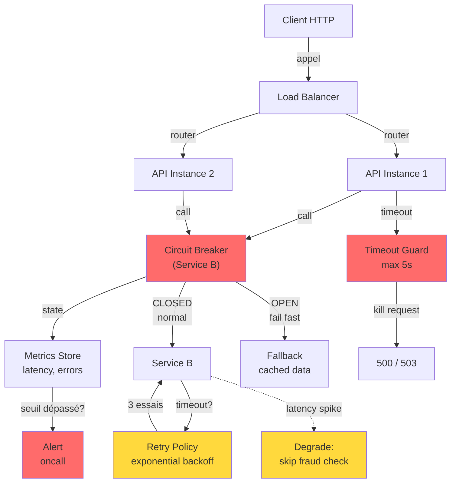
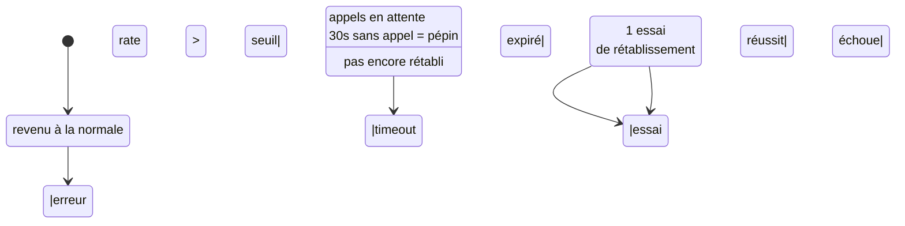

```yaml
---
layout: page
title: "Résilience & fiabilité des API"

course: "API REST"
chapter_title: "Résilience & fiabilité"

chapter: 5
section: 1

tags: resilience,reliability,architecture,production,fault-tolerance,observability
difficulty: advanced
duration: 240
mermaid: true

icon: "🛡️"
domain: "architecture"
domain_icon: "⚙️"
status: "published"
---

## Objectifs pédagogiques

À la fin de ce module, vous serez capable de :

1. **Concevoir** une architecture d'API capable de supporter des défaillances partielles sans arrêt total du service
2. **Implémenter** des mécanismes de résilience (retry, circuit breaker, timeout) appropriés à votre chaîne d'appels
3. **Diagnostiquer** les problèmes de fiabilité en production via des métriques d'observabilité pertinentes
4. **Décider** quand appliquer une stratégie de résilience plutôt qu'une autre selon le contexte métier
5. **Valider** la robustesse d'une API avant mise en production via des tests chaos et des simulations

---

## Mise en situation

Vous travaillez dans une équipe backend d'une fintech. Votre API de paiement est appelée par 50 services internes et 2 000 clients mobiles. Vous avez observé récemment que :

- Quand la base de données était lente, tous les services appelants restaient bloqués, causant une cascade de timeouts
- Un service tiers (provider de fraude) a connu une panne de 45 minutes → vos paiements se sont tous arrêtés
- Un client a retiré son argent deux fois parce que le premier appel avait échoué silencieusement, puis rejoué automatiquement
- Vous n'aviez aucune visibilité sur **quels appels** attendaient une réponse, ni **combien de temps** prenaient les dépendances externes

Ce que vous aviez essayé (et qui n'a pas suffi) :
- Augmenter les timeouts → juste repoussait le problème plus tard
- Mettre du cache partout → des données obsolètes causaient d'autres bugs
- Ajouter des serveurs → le problème était ailleurs : dans l'absence de limite et de récupération

Ce que vous réalisiez : **une API fiable n'est pas celle qui ne tombe jamais, c'est celle qui dégrades ses services de manière prévisible et se rétablit seule.**

---

## Contexte et problématique

### Pourquoi la fiabilité n'est pas une optimisation

En production, trois réalités inévitables :

1. **Les dépendances externes tombent en panne** — base de données, API tiers, cache, queue — pas une question de "si", mais de "quand"
2. **Les pics de trafic créent des cascades** — un appel lent paralyse tous les clients attendant une réponse
3. **Vous ne contrôlez pas tout** — un service tiers peut être lent, un réseau peut perdre des paquets, une réplication peut lag

Les approches naïves mènent à des **défaillances catastrophiques en cascade** :

```
Client A → API → Service B (lent)
              ↓
              bloque 30s
              ↓
          Resource leak
          (connexions DB/HTTP non relâchées)
              ↓
          Tous les clients suivants échouent
              ↓
          Système complet down
```

**Résilience** = capacité à absorber une défaillance et à continuer de fonctionner en mode dégradé.
**Fiabilité** = capacité à honorer le contrat API même sous stress (les clients savent quand c'est impossible et ce qu'ils doivent faire).

### Les trois piliers d'une API résiliente

| Pilier | Objectif | Exemple |
|--------|----------|---------|
| **Isolation des failles** | Empêcher qu'une panne locale ne paralyse tout le système | Circuit breaker sur l'appel à Service B → ne pas faire 10 000 appels à quelque chose de mort |
| **Adaptation au stress** | Renoncer à certaines opérations plutôt que de tout perdre | Abandon du calcul du score de fraude si Service C est lent → l'argent passe quand même |
| **Observabilité** | Voir ce qui casse avant que ça ne devienne grave | Alertes quand 5% des appels à Service B timeout → vous corrigez avant que ce ne soit 100% |

La résilience n'est pas "rendre l'API invulnérable". C'est **anticiper l'inévitable et y répondre intelligemment**.

---

## Architecture et composants de résilience

Une API résiliente s'appuie sur plusieurs mécanismes travaillant ensemble. Voici comment ils s'assemblent :



### Composants clés et responsabilités

| Composant | Rôle | Implémentation |
|-----------|------|-----------------|
| **Circuit Breaker** | Détecte une défaillance et refuse les appels pendant une période (fast fail) | État : CLOSED (normal) → OPEN (en panne) → HALF_OPEN (test de récupération) |
| **Retry & Backoff** | Rejoue automatiquement les appels échoués, avec délai croissant (évite de tuer une cible déjà saturée) | 3 essais max, délai 100ms → 200ms → 400ms, jitter aléatoire |
| **Timeout** | Interrompt un appel qui traîne au-delà d'un seuil (libère les ressources) | 5s par défaut, ajustable par endpoint |
| **Bulkhead / Pool isolation** | Chaque dépendance obtient son propre pool de connexions (une lenteur locale ne vide pas la piscine globale) | Pool de 10 connexions par Service, 50 globalement |
| **Fallback / Graceful degradation** | Quand tout échoue, retourner une réponse partielle ou en cache (plutôt que d'erreur) | Omettre la vérification fraude, retourner les données de la semaine dernière |
| **Rate limiting / Backpressure** | Refuser les nouvelles requêtes quand vous êtes saturé (prévient les cascades) | Max 1 000 req/s, 503 Service Unavailable au-delà |
| **Observabilité** | Mesurer latence, taux d'erreur, pourcentage d'appels échoués (détecter les problèmes en cours) | Métriques Prometheus, traces distribuées (OpenTelemetry) |

---

## Fonctionnement interne : circuit breaker

Le **circuit breaker** est le composant le plus critique. Comprendre son état interne est essentiel pour diagnostiquer les pannes.

### États et transitions

Un circuit breaker n'a que 3 états :



**CLOSED** (✅ normal)
- Les appels passent normalement
- Le circuit breaker compte les erreurs et latences
- Si erreur rate dépasse 50% sur 100 appels → OPEN

**OPEN** (❌ panne détectée)
- **Les appels sont immédiatement rejetés** sans même essayer (fail fast)
- Les clients reçoivent une erreur 503 Service Unavailable ou une réponse fallback
- Durée : 30 secondes (timeout configurable), puis passage à HALF_OPEN
- **C'est là qu'on économise des ressources** — on ne gâche pas de CPU/network à parler à quelque chose de mort

**HALF_OPEN** (🟡 test)
- Une seule requête est autorisée à passer ("test de santé")
- Si elle réussit → revenir à CLOSED, réautoriser les appels
- Si elle échoue → rester OPEN, réessayer dans 30s

### Exemple : circuit breaker en action

```
t=0s : CLOSED
       → 50 appels réussis
       
t=10s : 40 réussis, 10 échouent (20% erreur)
       → OK, circuit reste CLOSED
       
t=15s : brusquement 45 appels, 30 échouent (66% erreur)
       → Seuil 50% dépassé ! PASSAGE À OPEN
       
t=16s : clients appellent
       → "Circuit ouvert, essayez plus tard" (instantané, 1ms)
       → Pas de ressource gâchée
       
t=46s : 30s écoulées, passage à HALF_OPEN
       
t=47s : 1 appel test envoyé
       → "Timeout" (service toujours mort)
       → Retour à OPEN, revenir dans 30s
       
t=77s : 2e test
       → Réponse 200 OK
       → PASSAGE À CLOSED, services rétablis
```

💡 **Astuce clé** : Le circuit breaker n'empêche pas les appels (pour ça il y a les limites de taux), il **minimise les appels inutiles** quand la cible est morte.

---

## Retry & backoff exponentiel

Tous les appels échouent ne veut pas dire "jamais". Certains échecs sont transitoires (spike réseau, GC pause du service B).

### La stratégie simple qui ne marche pas

```python
# ❌ MAUVAIS : 3 essais rapides
for i in range(3):
    try:
        return call_service_b()
    except Exception:
        pass  # retry immédiatement
return None
```

Problème : si Service B est surchargé et s'effondre sous 1 000 appels/s, **vous en envoyez 3 000** en rejoignant — vous la tuez.

### Backoff exponentiel avec jitter

```python
# ✅ BON
import random
import time

def call_with_retry(max_retries=3):
    for attempt in range(max_retries):
        try:
            return call_service_b()
        except Exception as e:
            if attempt == max_retries - 1:
                raise  # dernier essai, échouer pour de bon
            
            # Attendre avant de rejouer
            wait_time = (2 ** attempt) * 100  # ms
            jitter = random.uniform(0, wait_time * 0.1)
            time.sleep((wait_time + jitter) / 1000)
```

Délais :
- Attempt 1 : 100ms + jitter
- Attempt 2 : 200ms + jitter
- Attempt 3 : 400ms + jitter

**Pourquoi le jitter** : si 1 000 clients reçoivent une erreur au même moment et se resignent tous après 100ms, vous avez une vague synchronized de 1 000 appels. Le jitter les étale (±10%) → les appels arrivent avec un aléa, la charge s'adoucit.

⚠️ **Erreur fréquente** : confondre retry et circuit breaker.
- **Retry** = rejeu local après un délai (améliore les cas transitoires)
- **Circuit breaker** = refus global pendant une période (protège en cas de panne durable)

Ensemble, ils forment la défense : retry pour les pics, circuit breaker pour les vraies pannes.

---

## Timeout : la protection ultime contre les blocages

Un timeout dit "j'attends maximum X secondes, après je renonce". C'est la **seule vraie protection** contre les requêtes qui traînent indéfiniment.

### Où appliquer les timeouts

```
Client request
    ↓
  API (timeout #1: 30s au total)
    ↓
  Service B (timeout #2: 5s, + 500ms overhead)
    ↓
  Database (timeout #3: 3s, + overhead)
```

Chaque couche a son timeout :
- **API → Client** : 30s (budget global de la requête)
- **API → Service B** : 5s (laisse 4 autres essais/services)
- **Service B → DB** : 3s (laisse 2s pour traiter et répondre)

**Les timeouts se font en cascade** : si API timeout = 30s et Service B timeout = 20s, Service B ne peut faire que 1 appel long à sa DB.

### Implémentation

```python
import requests
from requests.adapters import HTTPAdapter
from urllib3.util.retry import Retry

# Configuration par défaut : 5s pour tout
session = requests.Session()
session.timeout = 5.0

# Ou plus fin :
try:
    response = requests.post(
        "https://service-b/pay",
        json={"amount": 100},
        timeout=5.0  # 5 secondes max
    )
except requests.Timeout:
    # Trop lent → rejeu ou fallback
    return fallback_response()
```

💡 **Astuce** : utilisez des timeouts différents selon le type d'appel.
- Lecture simple (GET) → 2s
- Écriture complexe (POST paiement) → 10s
- Batch asynchrone → 60s

---

## Dégradation gracieuse (graceful degradation)

Quand l'idéal n'est pas possible, l'acceptable suffit.

**Scénario** : votre API de paiement a 4 étapes :
1. Vérifier le compte (obligatoire)
2. Vérifier la fraude (tiers, peut être lent)
3. Déduire l'argent (critique)
4. Envoyer une notification (peut échouer)

Si Service Fraude timeout après 2 essais, vous avez 3 options :

| Option | Comportement | Quand l'utiliser |
|--------|------------|-----------------|
| **Fail tout** | Retourner 503, pas de paiement | Jamais, trop de perte d'argent |
| **Fail partiel** | Paiement SANS vérification fraude | Rare, quand fraude = "nice to have" |
| **Dégradation** | Paiement AVEC vérification fraude en async (en arrière-plan, post-paiement) | **Idéal** → paiement passe, fraude vérifiée après |

Implémentation typique :

```python
@app.post("/pay")
def pay(request):
    # Étape 1 : vérification obligatoire
    account = verify_account(request.account_id)
    
    # Étape 2 : vérification fraude (best-effort)
    fraud_check_id = None
    try:
        fraud_check_id = check_fraud(request, timeout=2.0)
    except (TimeoutError, ServiceUnavailable):
        # Service fraude lent/down → lancer async, continuer
        schedule_fraud_check_async.delay(request.id)
        logger.warning(f"Fraud check delayed for request {request.id}")
    
    # Étape 3 : déduction (critique, ne pas dégrades)
    deduct_money(account, request.amount)
    
    # Étape 4 : notification (best-effort)
    try:
        send_notification(account, timeout=1.0)
    except Exception:
        schedule_notification_async.delay(account.id)
    
    return {"status": "success"}
```

Résultat : **paiement réussit même si fraude ou notification échouent**, et vous les traitez après.

⚠️ **Erreur fréquente** : dégradation sans limites. Si vous acceptez tous les paiements "pour plus tard vérifier", vous créez des dettes et risques. **Chaque dégradation a un coût métier — décidez explicitement si vous l'acceptez.**

---

## Observabilité : voir les problèmes avant qu'ils ne deviennent critiques

Vous pouvez avoir tous les circuits breakers et retries du monde — **si vous ne voyez pas qu'il y a un problème, vous ne pouvez rien corriger.**

### Les 4 signaux clés

| Signal | Mesure | Alerte typique |
|--------|--------|----------------|
| **Latency (p99)** | Combien de temps prend un appel ? | Si p99 > 5s sur 5 min → investigate |
| **Error rate** | Quel % d'appels échouent ? | Si > 1% d'erreurs 5xx sur 1 min → page oncall |
| **Saturation** | Avez-vous de la capacité restante ? | Si file d'attente > 100 requêtes → refuser nouvelles |
| **Trace distribuée** | Où le temps s'écoule-t-il ? | Appel A → B → C : lequel traîne ? |

### Implémentation minimale

```python
from prometheus_client import Counter, Histogram, Gauge
import time

# Compteurs
requests_total = Counter(
    'api_requests_total',
    'Total requests',
    ['method', 'endpoint', 'status']
)
errors_total = Counter(
    'api_errors_total',
    'Total errors',
    ['endpoint', 'error_type']
)

# Histogramme pour la latence
request_duration = Histogram(
    'api_request_duration_seconds',
    'Request latency',
    ['endpoint'],
    buckets=[0.1, 0.5, 1.0, 2.0, 5.0]
)

# Jauge pour la saturation
queue_size = Gauge(
    'api_queue_size',
    'Current queue size'
)

@app.post("/pay")
def pay(request):
    start = time.time()
    
    try:
        result = process_payment(request)
        requests_total.labels(
            method='POST',
            endpoint='/pay',
            status=200
        ).inc()
        return result
    except Exception as e:
        errors_total.labels(
            endpoint='/pay',
            error_type=type(e).__name__
        ).inc()
        requests_total.labels(
            method='POST',
            endpoint='/pay',
            status=500
        ).inc()
        raise
    finally:
        duration = time.time() - start
        request_duration.labels(endpoint='/pay').observe(duration)
```

Cet exemple expose :
- Nombre total de requêtes par endpoint et code de statut
- Types d'erreurs et fréquence
- Distribution des latences (p50, p95, p99)

Vous branchezça sur **Prometheus** (collecte) + **Grafana** (affichage) + **Alertmanager** (notifications).

### Traces distribuées

Quand une requête traverse 5 services, où s'écoule le temps ?

```
Request ID: abc123

[API Gateway]  0ms    ← entrée
  ↓ span: auth-check
[Auth Service]  +50ms  ← rapide
  ↓ span: get-account
[Account Service]  +300ms  ← lent !
  ↓ span: check-fraud
[Fraud Service]  timeout après 2s
  ↓ retried
[Fraud Service]  +1500ms  ← ici le temps s'écoule
  ↓ span: process-payment
[DB]  +100ms
  ↓
[API Gateway]  2100ms total  → p99 exceeded
```

Avec une trace distribuée (OpenTelemetry + Jaeger), vous **voyez exactement** que Fraud Service prenait 1.5s, pas le reste.

---

## Construction progressive : de "ça marche" à "ça tient en prod"

### Version 1 : API naïve (pas résiliente)

```python
@app.post("/pay")
def pay(request):
    # Direct, sans protection
    account = db.get_account(request.account_id)
    fraud_risk = fraud_service.check(request)
    
    if fraud_risk > 0.8:
        return {"error": "Denied"}, 403
    
    db.deduct(account, request.amount)
    return {"status": "success"}
```

**Problèmes** :
- Si DB est lente (GC pause) → client attend 30s + timeout
- Si Fraud Service down → tout s'arrête
- Zéro visibilité sur ce qui casse

---

### Version 2 : Ajout timeouts + retry + circuit breaker

```python
from pybreaker import CircuitBreaker

fraud_breaker = CircuitBreaker(
    fail_max=5,       # Ouvrir après 5 erreurs
    reset_timeout=30  # Rester ouvert 30s
)

@app.post("/pay")
def pay(request):
    # Timeout sur DB
    try:
        account = db.get_account(request.account_id, timeout=3)
    except TimeoutError:
        return {"error": "DB timeout"}, 503
    
    # Retry + circuit breaker sur Fraud
    fraud_risk = 0.0
    try:
        for attempt in range(3):
            try:
                fraud_risk = fraud_breaker.call(
                    fraud_service.check,
                    request,
                    timeout=2
                )
                break
            except Exception:
                if attempt == 2:
                    raise
                time.sleep((2 ** attempt) * 0.1)
    except CircuitBreakerListener:
        # Circuit ouvert, on passe sans vérification
        logger.warning(f"Fraud check skipped, circuit open")
        fraud_risk = 0.5  # Valeur par défaut prudente
    
    if fraud_risk > 0.8:
        return {"error": "Denied"}, 403
    
    db.deduct(account, request.amount)
    return {"status": "success"}
```

**Améliorations** :
- Timeouts protègent contre les blocages indéfinis
- Retry + backoff augmente le taux de succès sans tuer la cible
- Circuit breaker évite les appels en vain
- Si Fraud Service est lente, on retourne une réponse raisonnable

---

### Version 3 : Dégradation gracieuse + observabilité

```python
from prometheus_client import Counter, Histogram
import logging

fraud_breaker = CircuitBreaker(
    fail_max=5,
    reset_timeout=30
)

request_duration = Histogram(
    'api_pay_duration_seconds',
    'Pay request latency',
    buckets=[0.1, 0.5, 1.0, 2.0, 5.0]
)

fraud_check_skipped = Counter(
    'fraud_check_skipped_total',
    'Fraud checks skipped'
)

logger = logging.getLogger(__name__)

@app.post("/pay")
def pay(request):
    start = time.time()
    
    try:
        # Obtenir le compte
        try:
            account = db.get_account(request.account_id, timeout=3)
        except TimeoutError:
            logger.error(f"DB timeout for account {request.account_id}")
            return {"error": "Service temporarily unavailable"}, 503
        
        # Vérifier fraude (dégradation : peut échouer)
        fraud_risk = 0.0
        try:
            for attempt in range(3):
                try:
                    fraud_risk = fraud_breaker.call(
                        fraud_service.check,
                        request,
                        timeout=2
                    )
                    break
                except Exception:
                    if attempt == 2:
                        raise
                    time.sleep((2 ** attempt) * 0.1)
        except (CircuitBreakerListener, TimeoutError, Exception) as e:
            logger.warning(
                f"Fraud check failed: {e}. "
                f"Scheduling async check for request {request.id}"
            )
            fraud_check_skipped.inc()
            
            # Dégradation : vérifier async, pas de blocage
            schedule_fraud_check_async.delay(request.id)
            fraud_risk = 0.3  # Assumer un risque moyen
        
        # Seuil élevé (car on n'a peut-être pas la vraie valeur)
        if fraud_risk > 0.95:
            return {"error": "Denied"}, 403
        
        # Déduit l'argent (critique)
        db.deduct(account, request.amount)
        
        # Notification (best-effort)
        try:
            send_notification(account, timeout=1)
        except Exception as e:
            logger.warning(f"Notification failed: {e}, queueing async")
            schedule_notification_async.delay(account.id)
        
        return {"status": "success"}
    
    finally:
        duration = time.time() - start
        request_duration.observe(duration)
        if duration > 5:
            logger.warning(f"Slow request: {request.id} took {duration:.2f}s")
```

**Résultats** :
- Paiements passent même si Fraude ou Notification échouent
- Async queues (Celery) récupèrent les tâches échouées
- Métriques Prometheus tracent le taux de dégradation
- Logs structurés permettent de debugger les problèmes exacts

---

## Prise de décision : quand utiliser quelle stratégie ?

Vous avez 5 outils. Lequel choisir pour chaque cas ?

### Décider par type de dépendance

| Dépendance | Timeout | Retry | Circuit Breaker | Dégradation | Exemple |
|-----------|---------|-------|-----------------|------------|---------|
| **Base de données** | ✅ Oui (3-5s) | ⚠️ Rarement | ❌ Non | ❌ Non | Crash driver = panique, pas de retry |
| **API tiers rapide** | ✅ Oui (2s) | ✅ Oui (3x) | ✅ Oui | ⚠️ Peut-être | Service de notation client |
| **API tiers lente** | ✅ Oui (5s) | ⚠️ Moins | ✅ Oui | ✅ Oui | Vérification fraude, scoring |
| **Cache** | ✅ Oui (100ms) | ❌ Non | ✅ Oui | ✅ Oui (données stale) | Redis pour sessions |
| **Queue asynchrone** | ✅ Oui (1s put) | ✅ Oui | ✅ Oui | ✅ Oui (dead-letter queue) | Envoi email async |

### Arbre de décision

```
Dois-je appeler cette dépendance ?
│
├─ Est-ce OBLIGATOIRE pour le contrat API ?
│  │
│  ├─ OUI (ex: vérifier le compte, débiter l'argent)
│  │  └─ Timeout UNIQUEMENT, pas de dégradation
│  │     (Si elle échoue → erreur client, pas de contournement)
│  │
│  └─ NON (ex: vérifier fraude, envoyer email)
│     └─ Timeout + Circuit Breaker + Dégradation
│        (Si elle échoue → continuer, mais tracker en async)
│
├─ Cette dépendance est-elle volatile (parfois lente, parfois OK) ?
│  │
│  ├─ OUI (API tiers, réseau)
│  │  └─ + Retry avec backoff exponentiel
│  │
│  └─ NON (DB locale)
│     └─ Pas de retry (pas utile)
│
└─ Quel est le coût d'une dégradation ?
   │
   ├─ TRÈS ÉLEVÉ (paiement, transfert argent)
   │  └─ Pas de dégradation, error au client plutôt que mauvaise donnée
   │
   └─ FAIBLE (notification, email)
      └─ Dégradation encouragée + async

RÉSULTAT :
Obligation + Volatile + Coût faible
→ Timeout (5s) + Retry (3x) + Circuit Breaker + Dégradation async
```

### Exemples concrets

**Cas 1 : Récupérer le solde du compte**
```
- Obligatoire ? OUI
- Volatile ? Non (DB locale)
- Dégradation ? NON
→ Timeout 3s, pas de retry, pas de dégradation
```

**Cas 2 : Vérifier la fraude chez