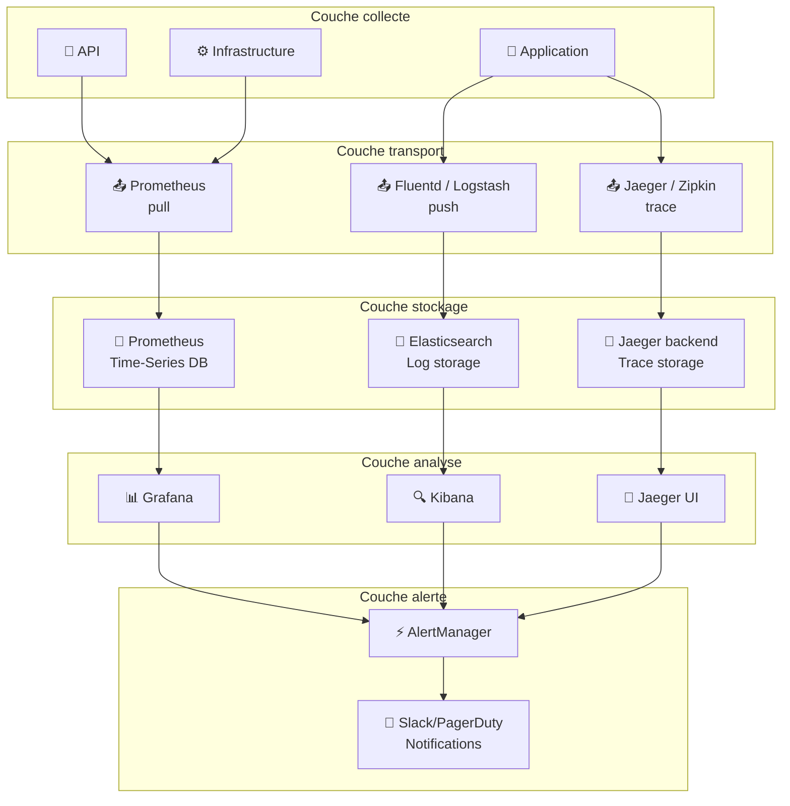

```yaml
---
layout: page
title: "Monitoring & Alerting — Concevoir une stratégie d'observabilité en production"

course: "API REST"
chapter_title: "Monitoring & Alerting"

chapter: 8
section: 1

tags: monitoring,alerting,observabilité,métriques,logs,incidents,production
difficulty: advanced
duration: 240
mermaid: true

icon: "📊"
domain: "DevOps & Production"
domain_icon: "⚙️"
status: "published"
---

# Monitoring & Alerting — Concevoir une stratégie d'observabilité en production

## Objectifs pédagogiques

À la fin de ce module, vous serez capable de :

1. **Concevoir une stratégie d'observabilité complète** pour une API en production (métriques, logs, traces)
2. **Implémenter un système d'alerting intelligent** qui détecte les problèmes réels sans noyer les équipes en faux positifs
3. **Diagnostiquer les incidents** en exploitant efficacement les données collectées
4. **Arbitrer entre outils et approches** selon votre infrastructure et la maturité de votre équipe
5. **Documenter et automatiser** le runbook des incidents critiques

---

## Mise en situation

Vous avez une API REST en production. Elle fonctionne depuis 6 mois, utilisée par 500 clients. Les retours sont sporadiques : "l'API est lente", "mon intégration s'est arrêtée hier pendant 2h sans prévenir personne". 

Votre équipe de 3 développeurs reçoit des alertes Slack toutes les 10 minutes. Aucune ne mérite vraiment une intervention. Pendant ce temps, une vraie panne SQL hier soir est passée inaperçue pendant 45 minutes.

Le problème : vous avez de la **visibilité zéro**. Vous ne savez pas d'où vient la lenteur (base de données ? cache ? appels externes ?), vous alertez sur tout et n'écoutez plus rien, et quand il y a un vrai problème, vous brainstormez à l'aveugle.

C'est normal à ce stade. La solution naïve — "ajouter plus d'alertes" — ne marche pas. Ce qu'il faut, c'est un **système de monitoring pensé comme un diagnostic médical** :

- Collecter les signaux pertinents (pas tout)
- Les interpréter correctement (comprendre ce qu'ils disent vraiment)
- Alerter seulement sur les symptômes qui demandent une action immédiate
- Avoir les données pour investiguer rapidement quand ça casse

---

## Contexte et problématique

### Pourquoi le monitoring traditionnel échoue en production

Un serveur qui "répond" peut être en train de mourir :

- **Latence élevée** : 5xx formels ? Non. Timeout client ? Oui. Les utilisateurs paient pour du temps d'attente, pas pour les codes HTTP.
- **Erreurs silencieuses** : une dépendance externe (Stripe, SendGrid) qui échoue 10% du temps → détectable seulement en analysant les taux de succès par endpoint.
- **Dégradation progressive** : le CPU passe de 20% à 80% en 30 minutes. Pas un incident critique à 100%, mais un **problème croissant** à intercepter avant le point de rupture.
- **Alertes parasites** : un pic normal d'utilisation (Black Friday, campagne marketing) déclenche tous les seuils → les équipes désactivent les alertes ou les ignorent.

### Les trois piliers de l'observabilité

Une **stratégie complète** repose sur trois données distinctes :

| Pilier | Quoi ? | Granularité | Cas d'usage |
|--------|--------|-------------|-----------|
| **Métriques** | nombres agrégés dans le temps (CPU, requêtes/s, latence p95) | Une valeur toutes les 10-60s | "L'API ralentit progressivement ?" |
| **Logs** | événements détaillés (requête entrante, erreur SQL, timeout) | Un événement = une ligne | "Pourquoi cette requête a échoué exactement ?" |
| **Traces distribuées** | chemin d'une requête à travers plusieurs services (API → cache → DB) | Une trace = une arborescence d'appels | "Laquelle de ces 5 dépendances ralentit ?" |

**Erreur fréquente** : se dire "on va monitorer tout". Résultat : 10 To de logs par jour, impossible de chercher dedans, alertes saturées.

**Approche correcte** : commencer par les métriques (légères, synthétiques), logs structurés sur ce qui compte (erreurs, transitions d'état), traces sur les chemins critiques.

---

## Architecture — Les composants d'une stratégie observabilité



### Composants clés et rôles

| Composant | Rôle | Pourquoi ? |
|-----------|------|-----------|
| **Prometheus** | Scrape les métriques (pull) depuis vos services | Schéma temps-série très efficace, queryable, intégré dans l'écosystème K8s |
| **Fluentd / Logstash** | Collecte les logs struturés (push) et les envoie en stockage | Permet du filtrage, enrichissement, avant stockage |
| **Elasticsearch** | Stockage et indexation des logs | Recherche full-text rapide sur des milliards de lignes |
| **Grafana** | Dashboard : visualisation des métriques Prometheus | UI flexible, support alertes, templating pour multi-tenant |
| **Jaeger / Zipkin** | Traçage distribué : qui appelle qui, latences par étape | Indispensable pour microservices : "pourquoi c'est lent ?" |
| **AlertManager** | Agrège les alertes, déduplique, route vers Slack/PagerDuty | Évite l'explosion de notifications (ex: 100 instances du même problème = 1 alerte) |

---

## Construction progressive — De zéro à observabilité mature

### Phase 1 : Monitoring élémentaire (Semaine 1)

**Objectif** : avoir **la visibilité minimale** sur les problèmes qui tuent déjà vos utilisateurs.

**Que monitorer ?**

- **Taux d'erreur HTTP** : % de 5xx par endpoint
- **Latence** : p50, p95, p99 des temps de réponse
- **Uptime** : détection de panne complète (ping ou /health)
- **Saturation infrastructure** : CPU, RAM, disque root

**Installation minimaliste** :

```bash
# 1. Prometheus + node_exporter sur votre serveur
docker run -d --name prometheus \
  -p 9090:9090 \
  -v $(pwd)/prometheus.yml:/etc/prometheus/prometheus.yml \
  prom/prometheus

# 2. Exposer les métriques de votre API
# → Voir snippet "exposer metrics Prometheus en Python"

# 3. Un dashboard Grafana basique
docker run -d --name grafana \
  -p 3000:3000 \
  -e GF_SECURITY_ADMIN_PASSWORD=admin \
  grafana/grafana
```

**Config Prometheus minimale** (`prometheus.yml`) :

```yaml
global:
  scrape_interval: 15s  # Collecter toutes les 15 sec
  evaluation_interval: 15s

scrape_configs:
  - job_name: 'api'
    static_configs:
      - targets: ['localhost:8000']  # Votre API exposée sur /metrics
  - job_name: 'node'
    static_configs:
      - targets: ['localhost:9100']  # node_exporter pour CPU/RAM/disque
```

**Alerte : détection simple de panne** (règles Prometheus) :

```yaml
groups:
  - name: api_alerts
    rules:
      - alert: APIDOWNAlert
        expr: up{job="api"} == 0
        for: 1m
        annotations:
          summary: "API est DOWN depuis 1 minute"
```

💡 **Astuce** : même sans AlertManager, Prometheus peut envoyer directement à Slack. C'est basique mais utile en phase 1.

---

### Phase 2 : Ajout des logs et traçage (Semaine 3–4)

Une fois le monitoring brut en place, vous voyez "l'API ralentit". Mais **pourquoi** ?

**Ajouter des logs structurés** :

```python
# Avant (inutile en production)
print("Request reçue")
print("DB query took: 500ms")

# Après (exploitable)
import json

logger.info(json.dumps({
    "event": "request_received",
    "method": "GET",
    "path": "/users/123",
    "client_ip": "192.168.1.1",
    "timestamp": datetime.utcnow().isoformat()
}))

logger.info(json.dumps({
    "event": "db_query_completed",
    "table": "users",
    "duration_ms": 500,
    "rows_affected": 1,
    "query_hash": "a7f2e8c1"  # Masquer la requête en prod
}))
```

**Envoyer vers Elasticsearch via Fluentd** :

```yaml
# fluentd config
<source>
  @type tail
  path /var/log/app/app.log
  pos_file /var/log/app.log.pos
  tag app.log
  <parse>
    @type json
  </parse>
</source>

<match app.**>
  @type elasticsearch
  host elasticsearch
  port 9200
  logstash_format true
  include_timestamp true
</match>
```

**Ajouter du traçage** pour les appels externes :

```python
from opentelemetry import trace
from opentelemetry.exporter.jaeger.thrift import JaegerExporter
from opentelemetry.sdk.trace import TracerProvider
from opentelemetry.sdk.trace.export import BatchSpanProcessor

# Initialiser
jaeger_exporter = JaegerExporter(agent_host_name="localhost", agent_port=6831)
trace.set_tracer_provider(TracerProvider())
trace.get_tracer_provider().add_span_processor(BatchSpanProcessor(jaeger_exporter))

# Utiliser
tracer = trace.get_tracer(__name__)

@app.get("/users/{user_id}")
async def get_user(user_id: int):
    with tracer.start_as_current_span("get_user") as span:
        span.set_attribute("user_id", user_id)
        
        # Appel DB
        with tracer.start_as_current_span("db_query"):
            user = await db.query(f"SELECT * FROM users WHERE id = {user_id}")
        
        # Appel cache (optionnel)
        with tracer.start_as_current_span("cache_set"):
            cache.set(f"user:{user_id}", user, ttl=3600)
        
        return user
```

Résultat : dans Jaeger UI, vous voyez **exactement** où le temps s'écoule.

---

### Phase 3 : Alerting intelligent (Semaine 5–6)

Maintenant que vous avez les données, créer des **alertes qui valent le coup**.

**Règle d'or** : une alerte = une action. Si vous ne ferez rien avec l'alerte, elle ne doit pas exister.

**Alertes pertinentes** :

```yaml
groups:
  - name: api_production
    rules:
      # Erreurs anormales
      - alert: HighErrorRate
        expr: rate(http_requests_total{status=~"5.."}[5m]) > 0.01  # >1% 5xx
        for: 2m
        annotations:
          summary: "Taux d'erreur > 1% sur les 5 dernières min"
          action: "Vérifier les logs récents, restart si DB est down"

      # Latence insupportable pour l'utilisateur
      - alert: P95LatencyHigh
        expr: histogram_quantile(0.95, rate(http_request_duration_seconds_bucket[5m])) > 2
        for: 5m
        annotations:
          summary: "95% des requêtes prennent >2s (timeout utilisateur à 30s)"
          action: "Profile l'API, check cache hit rate, DB slow queries"

      # Perte de dépendance externe
      - alert: ExternalServiceDown
        expr: up{job="stripe"} == 0 or up{job="sendgrid"} == 0
        for: 1m
        annotations:
          summary: "Dépendance externe indisponible"
          action: "Activer le fallback (queue asynchrone), notifier clients"

      # Infra saturée (problème croissant)
      - alert: DiskFillingSoon
        expr: (node_filesystem_avail_bytes / node_filesystem_size_bytes) < 0.15
        for: 10m
        annotations:
          summary: "Disque < 15% libre, sera full dans ~3 jours"
          action: "Archiver les vieux logs, nettoyer temp files"
```

⚠️ **Erreur fréquente** : créer des alertes sur des seuils imaginaires.

- ❌ "CPU > 50%" → une requête coûteuse vaut peut-être 80% de CPU pendant 30s, c'est normal
- ✅ "Latence p95 > 2s" → mesurable en utilisateur, actionnable

**Router les alertes intelligemment** :

```yaml
# alertmanager.yml
route:
  receiver: 'team-slack'
  group_by: ['alertname']
  group_wait: 10s        # Attendre 10s avant alerte (dédupliquer les chocs)
  group_interval: 5m     # Regrouper alertes similaires pendant 5min
  repeat_interval: 4h    # Rappeler qu'on est toujours en alerte après 4h

receivers:
  - name: 'team-slack'
    slack_configs:
      - api_url: 'https://hooks.slack.com/services/T00000000/B00000000/...'
        channel: '#alerts'
        title: '{{ .GroupLabels.alertname }}'
        # Exclure les faux positifs de la veille passée
        filters:
          - severity: "critical"     # Slack seulement pour critique
```

---

## Fonctionnement interne — Comment ça marche réellement

### Métriques : le modèle Prometheus

Prometheus utilise un modèle **push régulier** depuis votre application :

```
http_requests_total{method="GET", endpoint="/users", status="200"} 1523
http_request_duration_seconds_bucket{le="0.1"} 100
http_request_duration_seconds_bucket{le="0.5"} 980
http_request_duration_seconds_bucket{le="1.0"} 1450
```

Chaque métrique = **nom + labels + valeur**.

⚠️ **Piège** : créer une métrique par **valeur concrète** (ex: par user_id) → explosion du nombre de séries temporelles, Prometheus qui explose en RAM.

✅ **Solution** : les labels doivent être **dimensionnels** (endpoint, method, status), pas des IDs uniques.

### Logs : l'importance de la structure

Un log textuel :

```
2024-01-15 14:23:45 ERROR Processing user 12345: Database connection timeout after 30s trying to update profile
```

Pas exploitable en masse. Impossible de chercher "tous les timeouts DB", impossible de compter combien d'erreurs par heure.

Un log structuré :

```json
{
  "timestamp": "2024-01-15T14:23:45Z",
  "level": "ERROR",
  "service": "user-service",
  "event": "db_timeout",
  "user_id": 12345,
  "operation": "update_profile",
  "duration_ms": 30000,
  "db_host": "postgres-prod-1"
}
```

Maintenant exploitable : requête Elasticsearch → `level:ERROR AND event:db_timeout AND duration_ms:[10000 TO *]` → "Tous les timeouts DB depuis 1h".

**Format standard** : JSON. Rien d'autre. Ajouter ces champs systématiquement :

```python
log_entry = {
    "timestamp": datetime.utcnow().isoformat() + "Z",
    "level": "INFO|WARN|ERROR|CRITICAL",
    "service": "api-service",
    "event": "descriptif_court_sans_espaces",  # db_connection_refused, auth_failed
    "trace_id": request.headers.get("X-Trace-ID"),  # Lier logs et traces
    "duration_ms": elapsed,
    "status": status_code,
    # Puis vos champs métier...
}
```

### Traces : suivre une requête dans les mécanismes

Quand vous appelez `/users/123`, ce qui se passe vraiment :

```
GET /users/123 (client)
  ├─ API reçoit la requête (10ms)
  ├─ Cache.get("user:123") → MISS (5ms)
  ├─ DB query (350ms)
  │   └─ Attendre la connexion (20ms)
  │   └─ Exécuter SELECT (280ms)
  │   └─ Parser résultat (50ms)
  ├─ Cache.set(...) (30ms)
  ├─ Serialize JSON (15ms)
  └─ Réponse au client = 410ms total
```

Sans traçage : "c'est lent". Avec : "la DB prend 350ms, dont 280ms d'exécution réelle, le reste c'est connexion + parsing".

Jaeger / Zipkin collecte ça automatiquement si vous les branchez.

---

## Diagnostic et Alerting intelligent

### Matrice : symptôme → investigations

| Symptôme | Questions | Où regarder |
|----------|-----------|-------------|
| **API lente globalement** | Cache down ? DB overloadée ? Dépendance externe lente ? | Traces (Jaeger), Métriques (Grafana p95), Logs erreurs |
| **Pics d'erreurs isolés** | Rollout mauvais ? Saturation DB ? Bug dans telle version ? | Logs structurés (Kibana), version des instances (Prometheus), rates d'erreur par endpoint |
| **Mémoire qui explose** | Memory leak ? Gros payload ? Cache full ? | CPU/Mem (Prometheus), traces (grosse réponse ?), logs GC |
| **Timeout client massif** | Dépendance externe indisponible ? Bottleneck interne ? | Traces (quel step ralentit ?), logs de la dépendance, latence réseau |

### Runbook — exemple concret

Quand l'alerte "HighErrorRate" se déclenche :

```
1. CONFIRMER le problème
   - Grafana → vérifier que c'est vraiment >1% sur les 5 dernières min
   - Pas un pic d'une seconde ?
   
2. LOCALISER le problème
   - Kibana → logs erreur, les 5xx concernent quel endpoint ?
   - Prometheus → rate par endpoint, status, méthode
   
3. CHERCHER LA CAUSE
   - Logs de cet endpoint → quel dépendance échoue ?
   - Jaeger → chemin d'appel, où ça casse ?
   - `SELECT * FROM slow_queries.log WHERE date > NOW() - 5min`
   
4. AGIR
   - Si DB : restart la connexion, scale les workers
   - Si dépendance : basculer sur fallback, alerter le fournisseur
   - Si code : rollback la dernière version, investiguer post-mortem
   
5. VALIDER
   - Error rate redescend en-dessous de 1%
   - Latence revient à la normale
   - Notifier les clients de la résolution
```

---

## Cas réel en entreprise

### Scénario : SaaS avec 5000 clients

**Contexte** : API REST (FastAPI), DB PostgreSQL (RDS), cache Redis, jobs asynchrones avec Celery.

**Équipe** : 2 backend + 1 DevOps.

**Problème initial** : "On ne sait pas ce qui se passe en production. Quand un client signale un souci, on restarte tout et ça passe."

**Étapes d'implémentation** :

**Semaine 1** : Prometheus + alertes brutes
```bash
# Chaque API expose /metrics via prometheus-client
# Prometheus scrape toutes les 15s
# AlertManager envoie à un channel #alerts-prod
# Résultat : on voit les pannes complètes, mais pas assez de contexte
```

**Semaine 2** : Logs structurés
```python
# Remplacer tous les print/logging.error par logs JSON
# ELK stack déployée : Elasticsearch + Logstash + Kibana
# Index par jour pour gérer la rétention (30j prod, 7j staging)
# Résultat : quand erreur, on peut investiguer la chaîne d'appels
```

**Semaine 3** : Traçage Jaeger
```yaml
# Jaeger agent sur le serveur
# OpenTelemetry intégré dans FastAPI + httpx (pour appels externes)
# Résultat : voir exactement où s'écoule le temps
```

**Résultat final** :

Alerte "HighErrorRate" se déclenche.

```
1. Slack → lien vers Grafana (taux d'erreur sur les 5 dernières min)
2. Clic sur "Error logs" → Kibana (dernières 100 erreurs)
3. Voir qu'elles sont toutes "db_connection_refused"
4. Clic sur un log → trace Jaeger associée (via trace_id)
5. Voir que les 3 SQL queries timeout
6. RDS CloudWatch → CPU à 98%, lock contention massif
7. Kill les queries long-running → CPU revient à 30%
8. Alerte se ferme automatiquement

Temps total : 4 minutes. Avant : 40 minutes de "c'est quoi le problème déjà ?".
```

---

## Prise de décision — Quand cette solution atteint ses limites

### Prometheus + Logs ne suffisent plus quand...

| Situation | Symptôme | Solution |
|-----------|----------|----------|
| **Très forte volumétrie** | Prometheus consomme 50GB RAM, Elasticsearch coûte cher | Utiliser un agent optimisé (Datadog, New Relic) ou sharding |
| **Infra très distribuée** | Traces traversent 10+ services, lent à analyser | Sampling stratégique + jaeger collector distribué |
| **Alerting très complexe** | "Alerte seulement si ERROR + latence élevée + pas pendant maintenance" | ML-based anomaly detection (ex : Datadog Anomaly Detection) |
| **Multi-région / multi-cloud** | Un seul Prometheus devient SPOF | Prometheus fédéré + stockage à long terme (Thanos) |

### Alternatives grand public

| Outil | Quand l'utiliser ? | Avantage clé |
|------|-------------------|--------------|
| **Datadog** | PME/Startup avec budget | UI complète, support excellent, peu de maintenance |
| **New Relic** | Qui veut du APM (Application Performance Monitoring) | Dashboards intelligentes, dépendances auto-détectées |
| **Elastic Stack** | Qui a une infra importante et des devops en-house | Full control, logs massifs, coûts prévisibles |
| **Prometheus+Grafana** (DIY) | Qui veut maîtriser la stack et construire progressivement | Léger, open-source, éducatif |
| **CloudWatch / GCP Monitoring** | Qui est full AWS / Google Cloud | Intégration native, moins de branchement |

---

## Bonnes pratiques

### 1. **Métriques : oublier les labels uniques**

```python
# ❌ MAUVAIS : une série temporelle par user_id
request_count{user_id="12345", status="200"} 500
request_count{user_id="12346", status="200"} 120
request_count{user_id="12347", status="200"} 45
# → Prometheus explose (high cardinality)

# ✅ BON : aggreger par dimension
request_count{endpoint="/users/{id}", status="200"} 665
```

### 2. **Alertes : utiliser "for" pour éviter les pics**

```yaml
# ❌ Alerte toute de suite = faux positifs
- alert: HighCPU
  expr: cpu > 80

# ✅ Alerte seulement si persistant pendant 5 min
- alert: HighCPU
  expr: cpu > 80
  for: 5m  # Éviter les pics normaux
```

### 3. **Logs : inclure le trace_id dans chaque ligne**

```python
# Dans la requête FastAPI
async def app_middleware(request: Request, call_next):
    trace_id = request.headers.get("X-Trace-ID", uuid4().hex)
    request.state.trace_id = trace_id
    response = await call_next(request)
    response.headers["X-Trace-ID"] = trace_id
    return response

# Dans chaque log
logger.info(..., extra={"trace_id": request.state.trace_id})
```

Résultat : chercher un trace_id dans Kibana → retrouve tous les logs de la requête, partout où elle est allée.

### 4. **Traces : sampler intelligemment en prod**

Enregistrer chaque trace = trop volumineux. Sampler 1% seulement = pas assez pour les erreurs rares.

```python
from opentelemetry.sdk.trace.export import TraceIdRatioBased
from opentelemetry.sdk.trace.export import BatchSpanProcessor

# 5% pour les requêtes normales
# 100% pour les erreurs
def sampler(trace_id, parent_span_id, operation_name, attributes):
    if attributes.get("error") == True:
        return TraceIdRatioBased(1.0)  # Tout tracer
    return TraceIdRatioBased(0.05)     # 5% seulement
```

### 5. **Alerting : documenter chaque alerte**

```yaml
- alert: HighErrorRate
  expr: rate(http_requests_total{status=~"5.."}[5m]) > 0.01
  annotations:
    summary: "Taux d'erreur > 1% sur 5 min"
    description: |
      **Qu'est-ce que ça veut dire ?**
      - > 1% des requêtes reviennent en 5xx pendant au moins 2 minutes
      
      **Actions immédiates :**
      1. Vérifier Kibana → dernières erreurs (filtre: level:ERROR)
      2. Jaeger → chercher une trace en erreur (click sur un log)
      3. Si c'est un timeout DB → voir slow_queries.log
      4. Si c'est un 503 → check dépendances (Stripe, etc)
      
      **Escalade :**
      - Si pas résolu en 5 min → appeler le on-call
      - Si c'est la 2e fois aujourd'hui → ouvrir un incident post-mortem
```

### 6. **Monitoring des dépendances externes**

```python
# Prometheus : exposer des métriques pour chaque dépendance
external_request_duration_seconds.labels(
    service="stripe",
    endpoint="/v1/charges",
    status="success"
).observe(elapsed)

# Alerte : l'une d'elles est down
- alert: ExternalServiceDown
  expr: up{job=~"stripe|sendgrid|twilio"} == 0
  for: 1m
```

### 7. **Rétention et coûts**

```yaml
# Prometheus : garder 30j de données brutes
retention: 30d

# Elasticsearch : archiver après 30j
index.lifecycle.name: logs
index.lifecycle.rollover_alias: logs
phases:
  hot:
    min_age: 0d
    actions:
      rollover:
        max_primary_store_size: 50gb
  warm:
    min_age: 7d
    actions:
      set_priority:
        priority: 50
  cold:
    min_age: 30d
    actions:
      searchable_snapshot:
        snapshot_repository: archive_s3
  delete:
    min_age: 60d
    actions:
      delete: {}
```

---

## Résumé

L'observabilité en production c'est **trois couches complémentaires** : métriques (synthèse), logs (détail), traces (chemin). Pas l'une ou l'autre, les trois.
