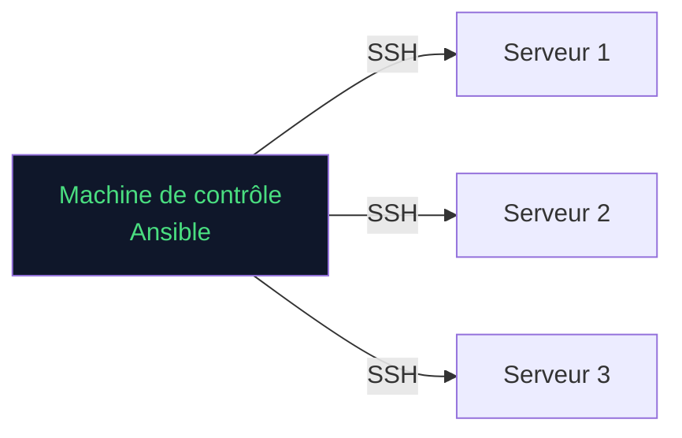

# Ansible — Introduction

> **Cours thématique** · Orchestration · Chapitre 1 / Section 1

---

## Pourquoi Ansible ?

Ansible permet d'automatiser la configuration de serveurs, le déploiement d'applications et l'orchestration de tâches complexes — sans agent à installer sur les machines cibles.

## Concepts clés

| Concept | Rôle |
|---|---|
| **Inventory** | Liste des machines cibles |
| **Playbook** | Fichier YAML décrivant les tâches |
| **Task** | Action unitaire (install, copy, service…) |
| **Module** | Brique fonctionnelle d'Ansible |
| **Role** | Structure réutilisable de tâches |

---

## Prochaine section

- [Ansible — Premier playbook](ansible-premier-playbook)
