# Cartographie AWS — Catégories, services et combinaisons

> Vue **systémique** de l'écosystème AWS : où chaque service se positionne dans son domaine, comment ils se combinent, quand choisir l'un plutôt que l'autre.
>
> Ce document complète deux autres références :
> - **[Glossaire des services AWS](/courses/cloud-aws/aws_glossaire_services.html)** — dictionnaire concis service par service
> - **[Guide pratique](/courses/cloud-aws/aws_guide_pratique.html)** — 10 architectures de référence appliquées à des scénarios métier
>
> Les services marqués *hors scope SAA-C03* sont inclus uniquement quand ils sont nécessaires pour comprendre le paysage. Ils ne tombent pas à l'examen mais existent dans la vraie vie — autant savoir où ils se rangent.

---

## Sommaire

- [1. Carte panoramique](#panorama) — vue mindmap des 12 catégories
- [2. Cartes par catégorie](#categories) — comment les services s'articulent au sein d'une même catégorie
- [3. Arbres de décision](#decision) — *« lequel choisir ? »* en flowchart oui/non
- [4. Matrices de combinaisons](#combinaisons) — *« A + B = pourquoi »*
- [5. Anti-patterns courants](#anti-patterns) — les erreurs à ne pas faire
- [6. Comment naviguer entre les documents](#navigation) — quand utiliser quel document

---

## 1. Carte panoramique
{: #panorama}

L'écosystème AWS au programme SAA-C03 se découpe en 12 grandes catégories. Chaque catégorie répond à une question fondamentale : *« où exécuter mon code ? »*, *« où stocker mes données ? »*, *« comment connecter mes ressources ? »*, etc.

### Vue visuelle — Atlas en grille

Les 12 catégories en grille 4 × 3, chacune avec sa propre couleur. Le titre en gras sépare clairement le nom de la catégorie de la liste des services.

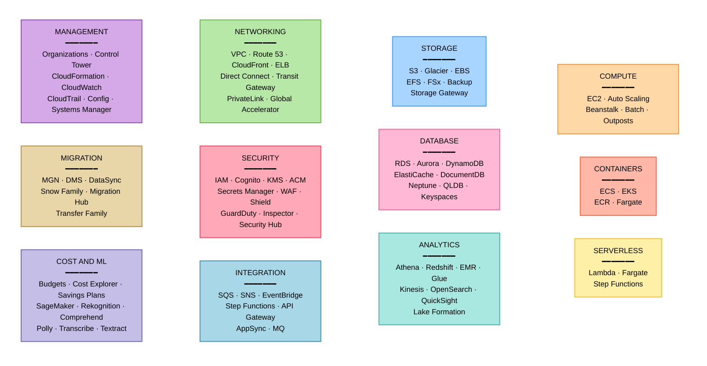

---

### Vue détaillée — Tableau structuré

Pour chaque catégorie, la **question fondamentale** à laquelle elle répond et les services principaux. Plus dense en information utile, scannable d'un coup au clavier.

| Catégorie | Question fondamentale | Services principaux |
|-----------|----------------------|---------------------|
| **Compute** | Où exécuter le code ? | EC2, Auto Scaling, Beanstalk, Batch, Outposts |
| **Containers** | Comment orchestrer mes conteneurs ? | ECS, EKS, ECR, Fargate |
| **Serverless** | Comment ne pas gérer d'infra ? | Lambda, Fargate, Step Functions |
| **Storage** | Où stocker mes fichiers et objets ? | S3, Glacier, EBS, EFS, FSx, Backup, Storage Gateway |
| **Database** | Où stocker mes données structurées ? | RDS, Aurora, DynamoDB, ElastiCache, DocumentDB, Neptune, QLDB, Keyspaces |
| **Analytics** | Comment analyser mes données ? | Athena, Redshift, EMR, Glue, Kinesis, MSK, OpenSearch, QuickSight, Lake Formation |
| **Networking** | Comment connecter mes ressources ? | VPC, Route 53, CloudFront, ELB, Direct Connect, VPN, Transit Gateway, PrivateLink, Global Accelerator |
| **Security** | Comment protéger et tracer ? | IAM, Cognito, KMS, Secrets Manager, ACM, WAF, Shield, GuardDuty, Inspector, Macie, Security Hub |
| **Integration** | Comment découpler mes composants ? | SQS, SNS, EventBridge, Step Functions, API Gateway, AppSync, MQ |
| **Management** | Comment piloter et auditer ? | Organizations, Control Tower, CloudFormation, CloudWatch, CloudTrail, Config, Systems Manager, Trusted Advisor |
| **Migration** | Comment passer de on-prem à AWS ? | MGN, DMS, DataSync, Snow Family, Migration Hub, Transfer Family |
| **Cost** | Comment maîtriser la facture ? | Budgets, Cost Explorer, CUR, Compute Optimizer, Savings Plans |
| **ML** | Comment ajouter de l'IA ? | SageMaker, Rekognition, Comprehend, Polly, Transcribe, Translate, Lex, Textract |

---

**Comment lire cette carte** : chaque catégorie répond à une question business (un besoin), et les services listés sont les briques qui y répondent. Plusieurs services apparaissent dans deux catégories (Fargate = Containers et Serverless, Step Functions = Serverless et Integration) — c'est normal, AWS découpe son catalogue par usage et un service peut servir plusieurs usages.

---

## 2. Cartes par catégorie
{: #categories}

Chaque catégorie a sa propre logique interne. Ces cartes montrent comment les services d'une même catégorie **se positionnent les uns par rapport aux autres** : qui fait quoi, qui complète qui, et quel est le « continuum » du plus brut au plus managé.

### 2.1 Compute — du brut au serverless
{: #compute-map}

Le compute AWS forme un **continuum** : plus on monte, plus AWS prend en charge l'infrastructure et moins on a de contrôle bas niveau (mais aussi moins de tâches opérationnelles). L'idée : choisir le **niveau d'abstraction** qui correspond à vos contraintes.

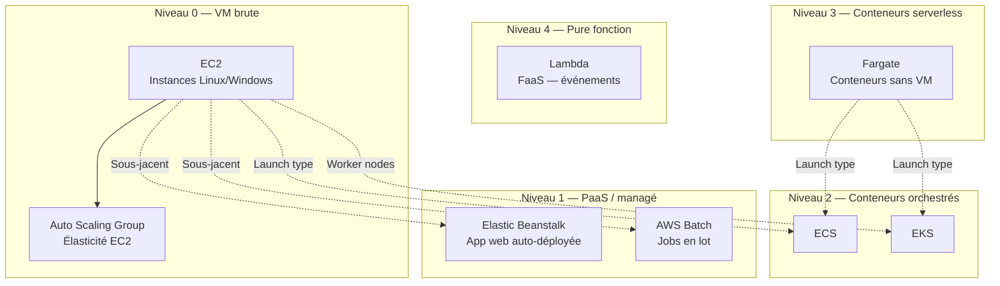

**Lecture** :
- **Niveau 0 (EC2)** = vous gérez tout : OS, patchs, scaling, déploiement. Maximum de contrôle.
- **Niveau 1 (Beanstalk, Batch)** = AWS gère le scaffolding (load balancer, ASG, déploiement) ; vous fournissez le code/les jobs.
- **Niveau 2 (ECS, EKS)** = vous fournissez des images Docker, AWS gère l'orchestration. Avec EC2 launch type, vous gérez encore les VM ; avec Fargate, non.
- **Niveau 3 (Fargate)** = pas de VM à gérer, facturation à la seconde par tâche. Frontière container/serverless.
- **Niveau 4 (Lambda)** = pas même de conteneur à packager dans la plupart des cas, exécution événementielle, facturation à la milliseconde.

**Cas particuliers** :
- **Outposts** = AWS dans votre datacenter (mêmes APIs, hardware AWS). Pour des contraintes de latence ou de souveraineté.
- **Wavelength** = AWS dans les réseaux 5G des opérateurs.
- **Lightsail** *(hors scope SAA-C03)* = VPS forfaitaire, alternative simple à EC2 pour les petits projets.

→ [Module 03 — EC2](/courses/cloud-aws/aws_module_03_ec2.html) · [Module 18 — Serverless](/courses/cloud-aws/aws_module_18_serverless.html) · [Module 25 — Containers](/courses/cloud-aws/aws_module_25_containers.html)

### 2.2 Containers — orchestration et registry
{: #containers-map}

Trois pièces autour des conteneurs : le **registre** (où sont stockées les images), l'**orchestrateur** (ECS ou EKS), et le **launch type** (EC2 ou Fargate).

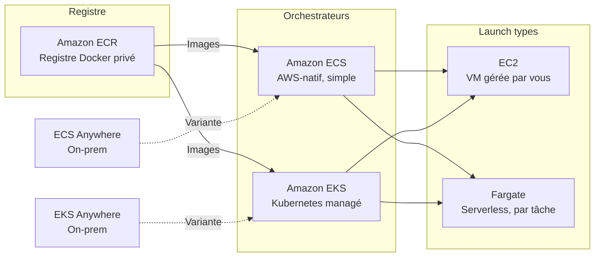

**Quand ECS plutôt qu'EKS ?** — ECS est plus simple, AWS-natif, intégration plus directe avec IAM, ALB, CloudWatch. EKS apporte la portabilité Kubernetes (multi-cloud, écosystème CNCF, Helm charts) au prix d'une complexité de configuration plus élevée et d'un coût de control plane (~73 $/mois par cluster).

**Quand Fargate plutôt qu'EC2 launch type ?** — Fargate quand vous ne voulez pas gérer de VM, que la charge est variable et que les tâches sont stateless. EC2 launch type quand vous avez besoin de GPU, de daemonsets, d'optimiser le coût sur des charges stables, ou quand vous voulez densifier plusieurs petits conteneurs sur de grosses instances.

→ [Module 25 — Containers](/courses/cloud-aws/aws_module_25_containers.html)

### 2.3 Storage — choisir le bon type pour le bon usage
{: #storage-map}

AWS propose 4 grandes familles de stockage selon **comment vous accédez aux données** : objet (HTTP), bloc (un disque pour une VM), fichier partagé (NFS/SMB), ou archive.

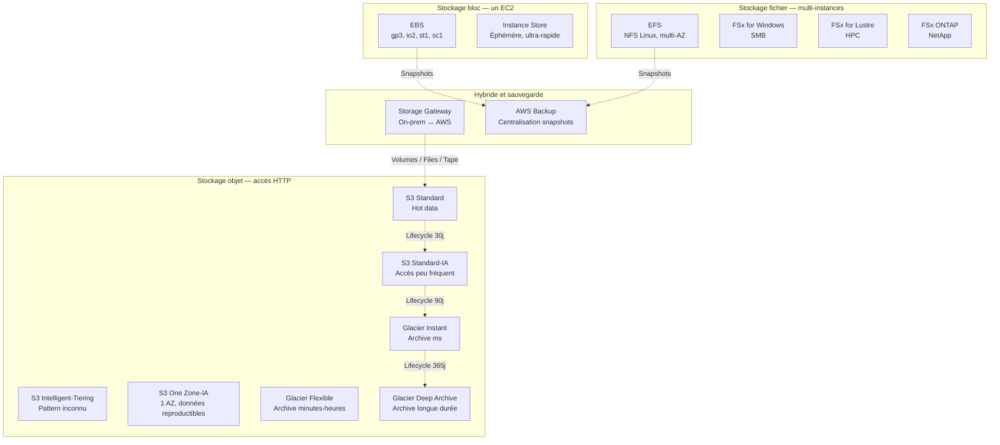

**Règles de décision rapides** :
- Une seule instance EC2 a besoin d'un disque ? → **EBS**.
- Plusieurs EC2 Linux doivent partager les mêmes fichiers ? → **EFS**.
- Plusieurs EC2 Windows partagent ? → **FSx for Windows**.
- HPC (calcul scientifique, financier) ? → **FSx for Lustre**.
- Données accessibles par HTTP, app web, data lake, backups ? → **S3**.
- Archive rare, jours/heures de récupération acceptables ? → **Glacier Deep Archive**.
- Migration progressive depuis on-prem ? → **Storage Gateway**.

→ [Module 04 — Stockage](/courses/cloud-aws/aws_module_04_storage.html) · [Module 26 — S3 avancé](/courses/cloud-aws/aws_module_26_s3_advanced.html)

### 2.4 Database — six familles, six raisons
{: #database-map}

Le choix d'une BDD se fait d'abord sur le **modèle de données** (relationnel, document, clé-valeur, graphe…), puis sur les contraintes de scale et de coût.

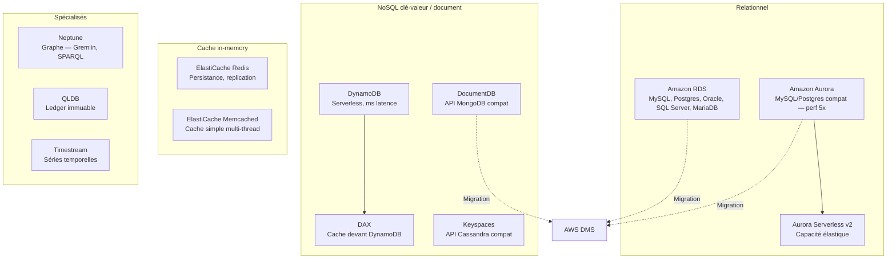

**Heuristique** :
- Existant SQL à migrer sans refonte ? → **RDS** (même moteur) ou **Aurora** (MySQL/Postgres compat avec perf supérieure).
- Charge dev/test variable, peut s'arrêter la nuit ? → **Aurora Serverless v2**.
- Application cloud-native nouvelle, scaling horizontal massif ? → **DynamoDB**.
- Latence sub-milliseconde sur des accès répétitifs ? → **ElastiCache Redis** (cache devant RDS) ou **DAX** (devant DynamoDB).
- Relations complexes (graphe social, fraude, recommandations) ? → **Neptune**.
- Auditabilité cryptographique d'une chaîne de transactions (sans avoir besoin de blockchain décentralisée) ? → **QLDB**.

→ [Module 10 — Databases](/courses/cloud-aws/aws_module_10_databases.html)

### 2.5 Networking & CDN — du datacenter virtuel à la diffusion globale
{: #networking-map}

Le réseau AWS s'organise en couches concentriques : du **VPC** (réseau privé) vers la **connectivité hybride** (datacenter on-prem) puis vers la **distribution globale** (utilisateurs finaux).

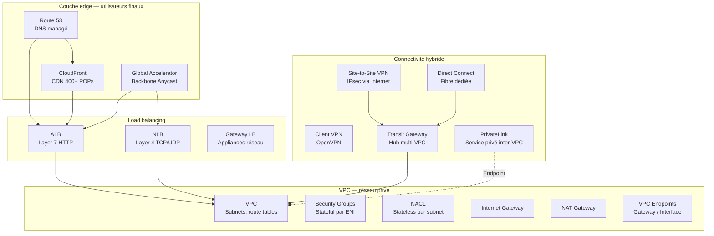

**Repères** :
- **VPC** est le réseau de base. Tout le reste y est ancré.
- **Security Groups** = pare-feu **stateful** par instance/ENI. **NACL** = règles **stateless** par subnet.
- **Internet Gateway** = sortie publique bidirectionnelle. **NAT Gateway** = sortie publique sortante uniquement (pour subnets privés).
- **VPC Endpoints** = accès privé aux services AWS sans passer par Internet (Gateway pour S3/DynamoDB, Interface via PrivateLink pour les autres).
- **CloudFront** met en cache statique et dynamique en edge ; **Global Accelerator** route via le backbone privé AWS (utilise les mêmes POPs mais ne cache pas).
- **Transit Gateway** remplace le VPC Peering dès qu'on a 5+ VPC : routage transitif, hub central.

→ [Module 05 — VPC](/courses/cloud-aws/aws_module_05_vpc.html) · [Module 11 — DNS & CDN](/courses/cloud-aws/aws_module_11_dns_cdn.html) · [Module 27 — VPC avancé](/courses/cloud-aws/aws_module_27_vpc_advanced.html)

### 2.6 Security, Identity & Compliance — la défense en profondeur
{: #security-map}

La sécurité AWS s'organise en **5 couches** : qui (identité), comment chiffrer, comment protéger le réseau, comment détecter, et comment auditer.

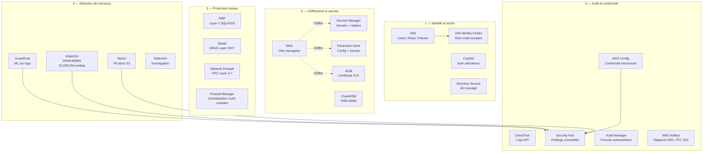

**Principe de défense en profondeur** : pas de couche unique infranchissable, mais des couches qui se complètent. Une attaque qui passe le WAF est repérée par GuardDuty, dont le finding est consolidé dans Security Hub, qui déclenche une remédiation automatique via EventBridge → Lambda.

**Distinctions importantes** :
- **IAM** gère les identités **AWS** (utilisateurs internes). **Cognito** gère les identités **applicatives** (utilisateurs finaux d'une app web/mobile).
- **WAF** protège la couche applicative (HTTP). **Shield** protège la couche réseau (DDoS volumétrique). **Network Firewall** fait du deep packet inspection au niveau VPC.
- **CloudTrail** = qui a fait quoi (audit). **Config** = état des ressources dans le temps (conformité). Les deux sont complémentaires.
- **GuardDuty** = détection à partir de logs (post-mortem). **Inspector** = scan de vulnérabilités (préventif).

→ [Module 08 — Sécurité](/courses/cloud-aws/aws_module_08_security.html) · [Module 12 — Sécurité avancée](/courses/cloud-aws/aws_module_12_security_advanced.html) · [Module 20 — Zero Trust](/courses/cloud-aws/aws_module_20_security_zero_trust.html)

### 2.7 Application Integration — découpler les composants
{: #integration-map}

L'intégration applicative résout un seul problème : **comment des composants distribués communiquent sans se connaître directement**. Cinq mécaniques, chacune avec son cas d'usage.

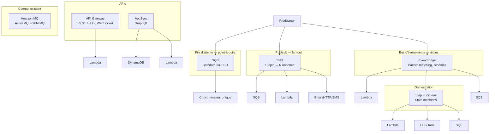

**Tableau de positionnement** :

| Service | Topologie | Garantie | Cas d'usage typique |
|---------|-----------|----------|---------------------|
| **SQS Standard** | 1→1 file | Au moins une fois, ordre best-effort | Découpler producteur/consommateur, retries automatiques |
| **SQS FIFO** | 1→1 file | Exactly-once, ordre garanti | Transactions financières, ordering critique |
| **SNS** | 1→N | Au moins une fois | Fan-out d'une notification vers SQS, Lambda, email, SMS |
| **EventBridge** | N→M avec règles | Au moins une fois | Routage par pattern (provenance, contenu) ; intégrations SaaS |
| **Step Functions** | Orchestration séquentielle | Avec retries et state | Workflows multi-étapes (commande → paiement → expédition) |
| **MQ** | Selon protocole (AMQP, MQTT, STOMP) | Selon broker | Migrer une app existante qui parle déjà ActiveMQ/RabbitMQ |

**Règle simple** : SQS pour découpler, SNS pour fan-out, EventBridge quand on a besoin de routage intelligent ou d'intégrations SaaS, Step Functions quand on doit garder de l'état entre les étapes.

→ [Module 22 — Distribué](/courses/cloud-aws/aws_module_22_distributed.html) · [Module 29 — Lambda avancé](/courses/cloud-aws/aws_module_29_lambda_advanced.html)

### 2.8 Analytics — le pipeline de données
{: #analytics-map}

L'analytique AWS suit toujours le même schéma : **ingérer → transformer → stocker → interroger → visualiser**. Chaque étape a ses services dédiés.

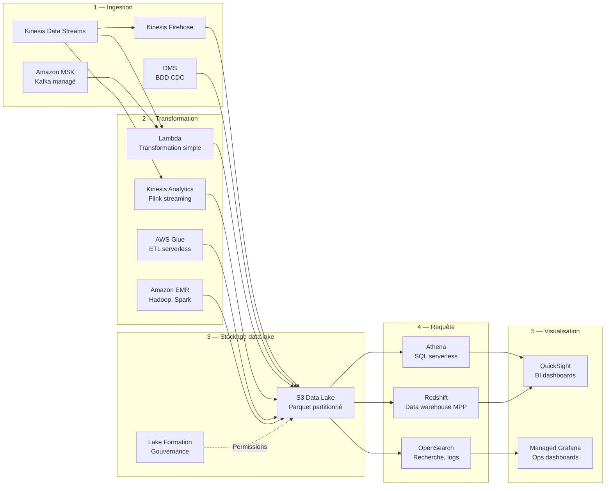

**Choix critiques** :
- **Kinesis Data Streams vs Firehose** : Streams si vous écrivez vos consommateurs et voulez du replay. Firehose si vous voulez juste livrer dans S3/Redshift sans coder.
- **Athena vs Redshift** : Athena pour des requêtes ad-hoc sur des données brutes (peu cher, lent). Redshift pour un data warehouse avec des dashboards à charge constante (cher, rapide).
- **Glue vs EMR** : Glue est serverless, idéal pour des jobs ETL ponctuels et simples. EMR offre plus de contrôle (clusters Spark, Hive, Presto) pour des charges complexes ou récurrentes lourdes.
- **Lake Formation** = couche de gouvernance par-dessus S3 + Glue Data Catalog. Permet le contrôle d'accès au niveau colonne et ligne.

→ [Module 30 — Data Services](/courses/cloud-aws/aws_module_30_data_services.html)

### 2.9 Management & Governance — voir, contrôler, auditer
{: #management-map}

Les services de management se répartissent en **4 sous-domaines** : organiser les comptes, provisionner les ressources, monitorer, auditer.

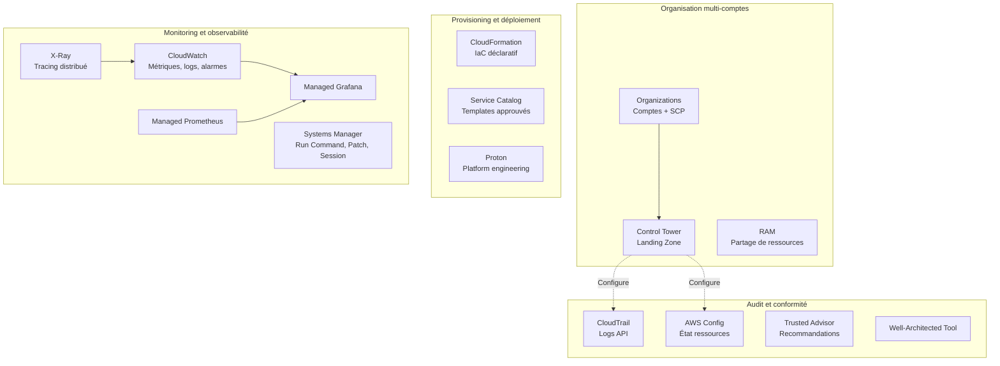

**Repères** :
- **Organizations** est le socle multi-comptes (consolidation de facturation + SCPs). **Control Tower** automatise sa mise en place avec des guardrails préventifs et détectifs.
- **CloudFormation** est l'IaC natif AWS (alternative : Terraform — non-AWS, multi-cloud).
- **Systems Manager** est une suite : Parameter Store (config), Session Manager (SSH sans bastion), Patch Manager, Run Command, Automation. À ne pas confondre avec un seul service.
- **X-Ray** = tracing distribué pour comprendre les latences entre services. Complémentaire à CloudWatch (métriques) et CloudTrail (audit).

→ [Module 13 — IaC](/courses/cloud-aws/aws_module_13_iac.html) · [Module 15 — Observabilité](/courses/cloud-aws/aws_module_15_observability.html) · [Module 24 — Gouvernance](/courses/cloud-aws/aws_module_24_governance.html)

### 2.10 Migration & Transfer — du datacenter vers AWS
{: #migration-map}

La migration suit toujours **3 phases** : découvrir, déplacer, optimiser. Chaque phase a ses outils.

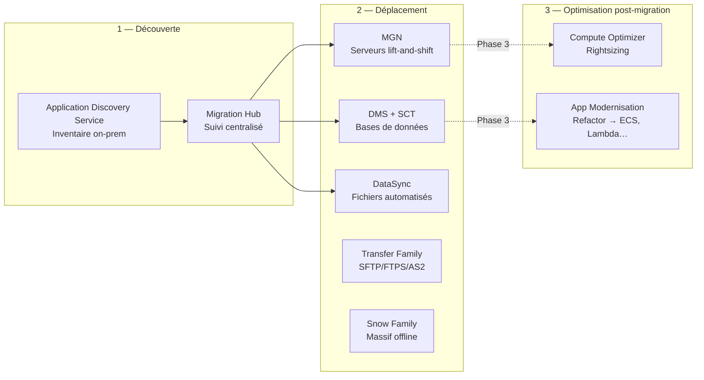

**Choisir le bon outil** :
- **Serveur entier (Linux/Windows)** → **MGN** (Application Migration Service) : agent, réplication continue des disques, cutover en quelques minutes.
- **Base de données** → **DMS** (replication CDC) + **SCT** (Schema Conversion Tool) si on change de moteur (Oracle → Postgres).
- **Fichiers récurrents on-prem ↔ AWS** → **DataSync** : transfert automatisé NFS/SMB/HDFS vers S3/EFS/FSx.
- **Volume massif > bande passante disponible** → **Snow Family** : Snowcone (jusqu'à 14 To), Snowball Edge (jusqu'à 80 To), Snowmobile (jusqu'à 100 Po). Le calcul : si > 10 jours par Internet, partir sur Snow.
- **Échanges réguliers SFTP avec partenaires** → **Transfer Family**.

→ [Module 32 — Migration](/courses/cloud-aws/aws_module_32_migration.html)

### 2.11 Cost Management — voir, prédire, économiser
{: #cost-map}

Trois leviers, dans cet ordre : **visibilité** d'abord (sinon on optimise à l'aveugle), puis **contrôle** (alertes), puis **engagement** (Savings Plans, RI, Spot).

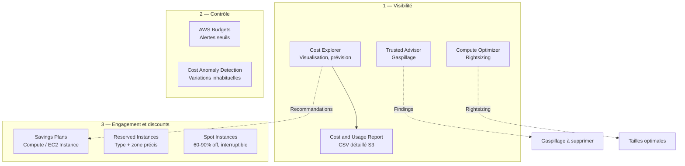

**Hiérarchie d'optimisation** :
1. **Supprimer le gaspillage** (EBS non-attachés, Elastic IPs orphelines, snapshots vieillis) — Trusted Advisor liste ça.
2. **Rightsizer** ce qui reste — Compute Optimizer recommande.
3. **Engager** sur la charge stable — Savings Plans (flexibles) ou RI (rigides mais discount max).
4. **Spot** pour les charges interruptibles (CI/CD, batch ML).

→ [Module 21 — FinOps](/courses/cloud-aws/aws_module_21_finops.html)

### 2.12 Machine Learning — APIs prêtes ou modèle custom
{: #ml-map}

Deux niveaux d'abstraction : des **APIs spécialisées** (un service = une tâche, sans coder de ML), et **SageMaker** pour entraîner ses propres modèles.

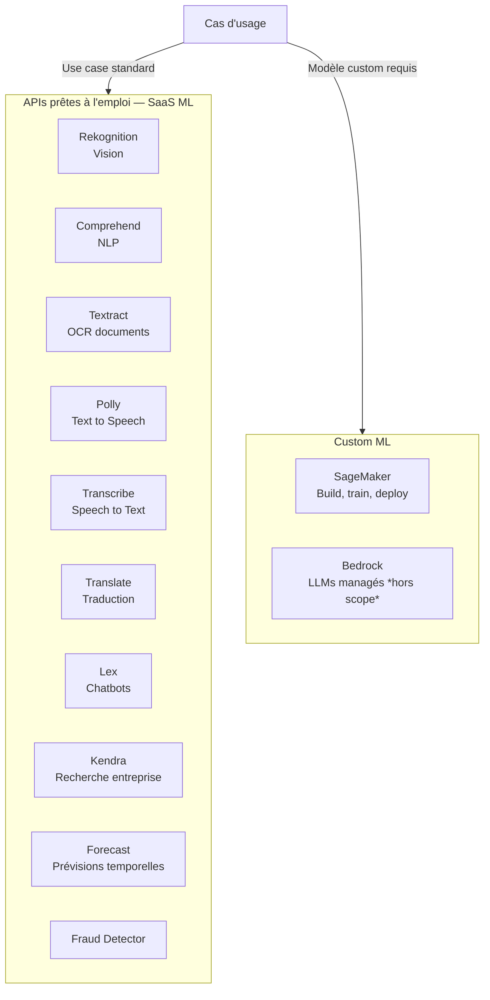

**Règle** : si votre besoin tombe dans l'un des cas standards (analyse d'image, OCR, traduction…), passer par l'API spécialisée. Plus simple, moins cher, pas de modèle à entraîner. SageMaker uniquement si le cas est trop spécifique (médical, industriel, scoring custom).

→ [Module 33 — ML Overview](/courses/cloud-aws/aws_module_33_ml_overview.html)

---

## 3. Arbres de décision
{: #decision}

Pour chaque grande question d'architecture, un arbre oui/non qui mène au bon service. À utiliser à l'examen comme dans la vraie vie.

### 3.1 Quel compute choisir ?
{: #decision-compute}

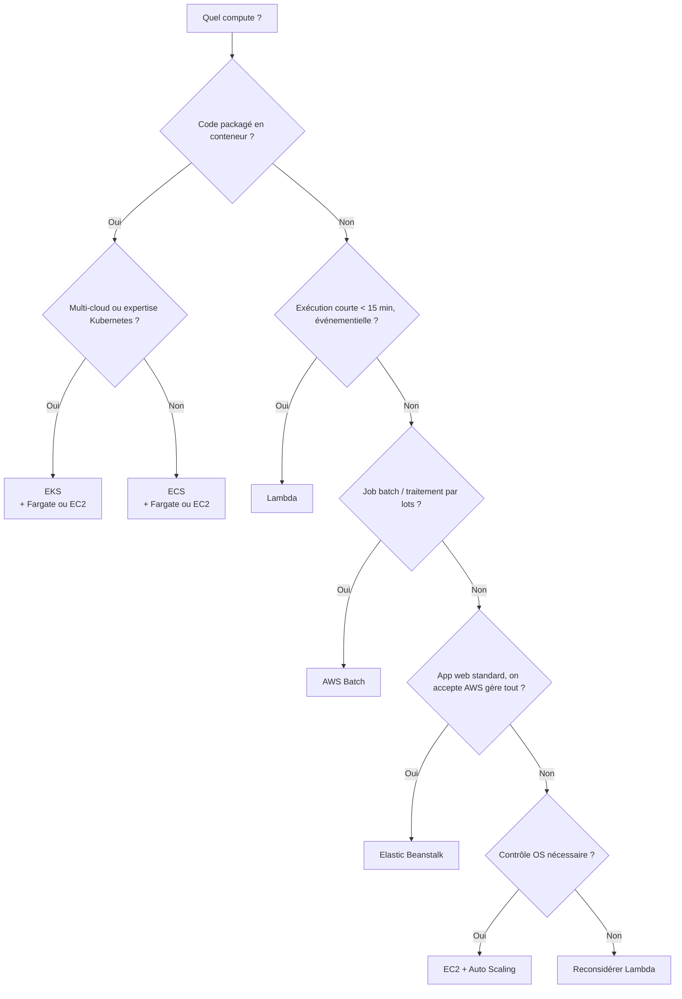

### 3.2 ECS ou EKS — et quel launch type ?
{: #decision-containers}

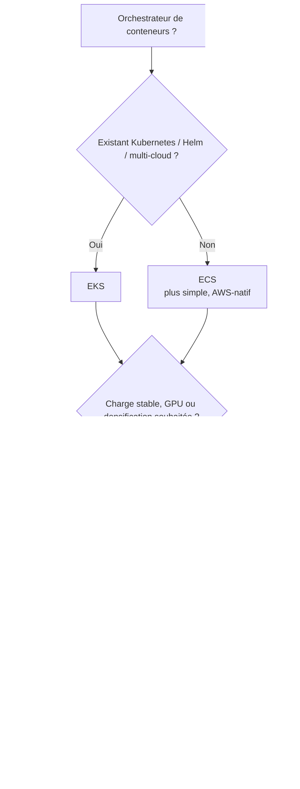

### 3.3 Quelle base de données relationnelle ?
{: #decision-relational}

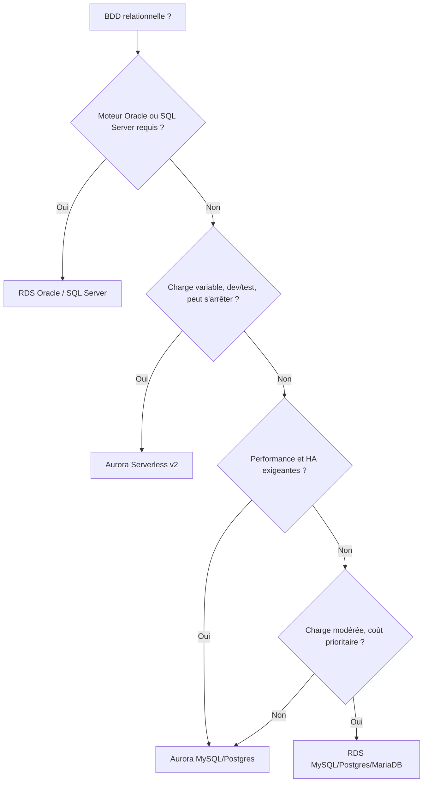

### 3.4 Quelle base NoSQL ?
{: #decision-nosql}

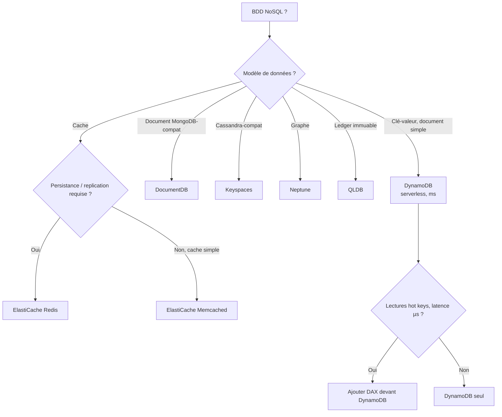

### 3.5 Quel stockage ?
{: #decision-storage}

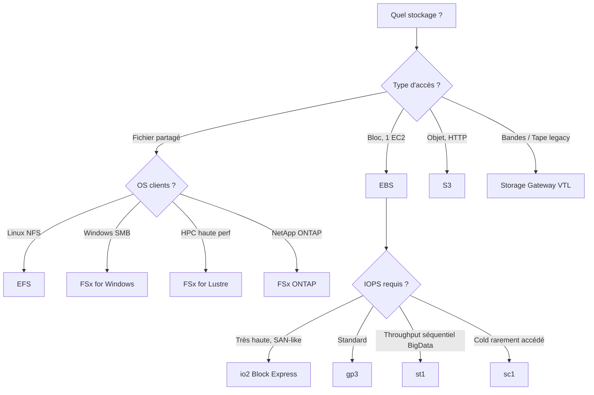

### 3.6 Quelle classe S3 ?
{: #decision-s3-class}

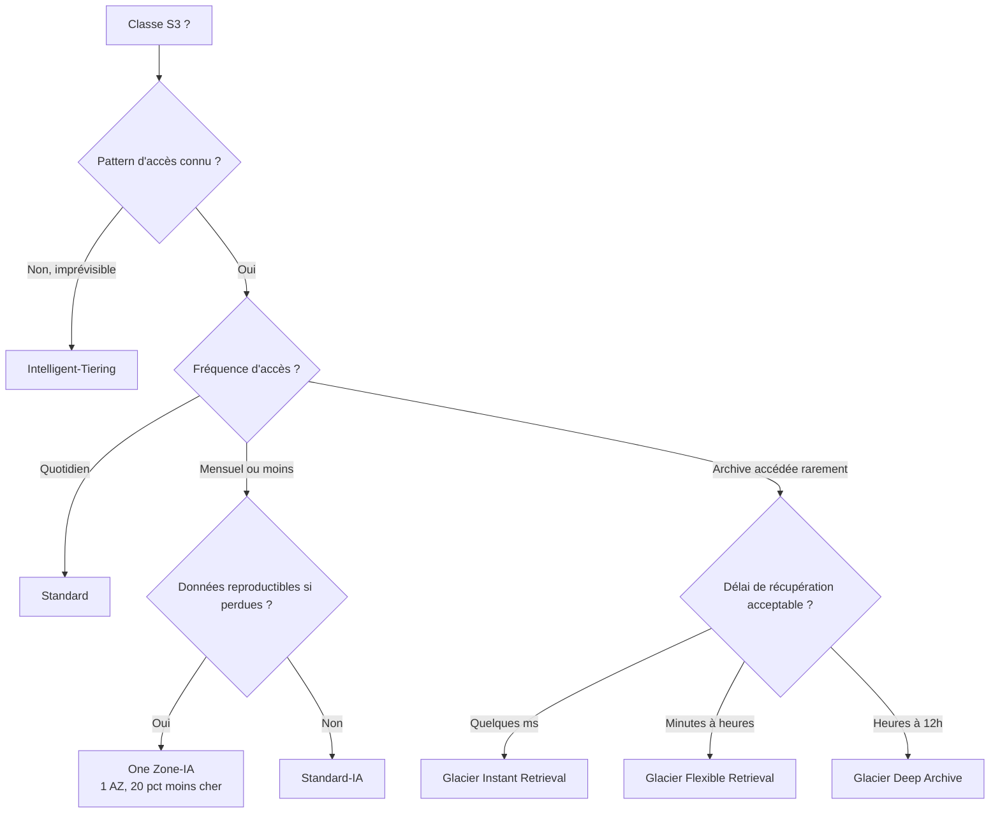

### 3.7 Quel load balancer ?
{: #decision-lb}

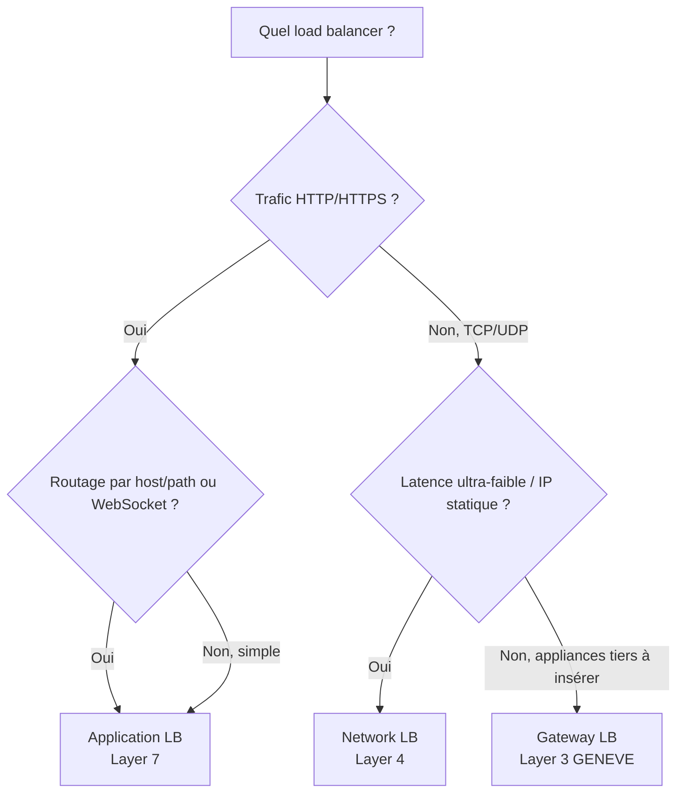

### 3.8 Quelle connectivité hybride ?
{: #decision-hybrid}

```mermaid
flowchart TD
    Start[Connecter on-prem à AWS ?] --> Q1{Volume et latence critiques ?}
    Q1 -->|Oui, perf prévisible 1-100 Gbps| DX[Direct Connect<br/>+ VPN backup recommandé]
    Q1 -->|Non, mise en place rapide ok| VPN[Site-to-Site VPN<br/>IPsec sur Internet]
    DX --> Q2{Plusieurs VPC à connecter ?}
    VPN --> Q2
    Q2 -->|Oui, 2 ou plus| TGW[Transit Gateway<br/>hub central]
    Q2 -->|Non, 1 seul| Direct[Connexion directe au VPC]
    Start --> Q3{Utilisateurs nomades à connecter ?}
    Q3 -->|Oui| CVPN[Client VPN]
    Start --> Q4{Exposer un service spécifique inter-comptes ?}
    Q4 -->|Oui, sans peering| PL[PrivateLink]
```

### 3.9 Quel modèle d'achat EC2 ?
{: #decision-pricing}

```mermaid
flowchart TD
    Start[Modèle d'achat EC2 ?] --> Q1{Charge interruptible ou tolérante aux pannes ?}
    Q1 -->|Oui, batch / CI/CD / ML training| Spot[Spot<br/>60-90 pct off]
    Q1 -->|Non, app prod| Q2{Charge stable 1+ années ?}
    Q2 -->|Oui| Q3{Flexibilité instance/region requise ?}
    Q2 -->|Non, variable / temporaire| OD[On-Demand]
    Q3 -->|Oui| SPC[Compute Savings Plans<br/>flexible 1 ou 3 ans]
    Q3 -->|Non, type fixé| Q4{Discount maximum souhaité ?}
    Q4 -->|Oui| RI[Reserved Instances<br/>3 ans no upfront]
    Q4 -->|Non, RI 1 an suffit| RI1[RI 1 an ou EC2 Instance SP]
```

### 3.10 Quel service de messagerie ?
{: #decision-messaging}

```mermaid
flowchart TD
    Start[Quelle messagerie ?] --> Q1{État entre les étapes / orchestration multi-step ?}
    Q1 -->|Oui| SF[Step Functions]
    Q1 -->|Non| Q2{Fan-out vers N abonnés ?}
    Q2 -->|Oui| SNS[SNS]
    Q2 -->|Non| Q3{Routage par patterns / intégrations SaaS ?}
    Q3 -->|Oui| EB[EventBridge]
    Q3 -->|Non| Q4{File simple producteur → consommateur ?}
    Q4 -->|Oui, ordre garanti| FIFO[SQS FIFO]
    Q4 -->|Oui, ordre best-effort| Std[SQS Standard]
    Q4 -->|Non, streaming haut débit avec replay| KDS[Kinesis Data Streams]
    Start --> Q5{App existante AMQP/MQTT/STOMP ?}
    Q5 -->|Oui| MQ[Amazon MQ]
```

---

## 4. Matrices de combinaisons typiques
{: #combinaisons}

Les services AWS sont rarement utilisés seuls. Voici les **combinaisons les plus fréquentes**, le « pourquoi » derrière, et les modules où elles sont détaillées.

### 4.1 Frontend et diffusion

| Combinaison | Pourquoi |
|-------------|----------|
| **CloudFront + S3** | Site statique avec CDN cache, HTTPS gratuit (ACM), Lambda@Edge pour personnalisation. Origin Access Control empêche l'accès direct au bucket. |
| **CloudFront + ALB** | App dynamique accélérée globalement. Cache des assets statiques au edge, dynamic content au origin. WAF attaché à CloudFront pour filtrer plus tôt. |
| **Route 53 + CloudFront + ALB** | Stack web standard : DNS routé vers le CDN, qui route vers le LB régional. Health checks Route 53 pour failover multi-region. |
| **Global Accelerator + NLB** | Latence ultra-faible globale + IP statique pour des clients qui ne supportent pas le DNS dynamique (jeu, IoT). |
| **API Gateway + CloudFront** *(implicite)* | API Gateway utilise CloudFront en backend pour les edge endpoints — caching sur les réponses GET. |

### 4.2 Application et auth

| Combinaison | Pourquoi |
|-------------|----------|
| **ALB + Cognito** | Auth OIDC/SAML géré par l'ALB sans toucher l'app. L'app reçoit des claims JWT en headers — zéro code auth côté backend. |
| **API Gateway + Lambda + Cognito** | API REST sécurisée par JWT validés par API Gateway avant invocation Lambda. |
| **API Gateway + Lambda + DynamoDB** | Backend serverless complet — scaling automatique, facturation à l'usage. Pour 80 % des micro-services. |
| **AppSync + DynamoDB + Lambda** | API GraphQL avec resolvers natifs DynamoDB (pas de code) et Lambda pour la logique custom. |

### 4.3 Découplage et asynchrone

| Combinaison | Pourquoi |
|-------------|----------|
| **Lambda + SQS** | Traitement asynchrone résilient. Lambda lit la queue par batch, retries automatiques, DLQ pour les échecs. |
| **SNS + SQS (fan-out)** | Une notification produit N traitements indépendants. Chaque consommateur a sa propre queue — un consommateur lent n'impacte pas les autres. |
| **EventBridge + Step Functions** | Événement métier déclenche un workflow multi-étapes avec gestion d'erreurs et retries natifs. |
| **S3 Event Notification + Lambda** | Traiter chaque upload (resize image, scan antivirus, extraction métadonnées) sans polling. |
| **DynamoDB Streams + Lambda** | Réagir à chaque mutation : invalidation cache, update index OpenSearch, notification, audit trail. |

### 4.4 Performance et scaling

| Combinaison | Pourquoi |
|-------------|----------|
| **Aurora + ElastiCache** | Cache devant la BDD pour les requêtes répétitives (sessions, profils utilisateurs, hot pages). Réduit massivement la charge BDD. |
| **DynamoDB + DAX** | Cache in-memory natif DynamoDB, latence µs sur les hot keys. À considérer dès qu'on a un read-heavy workload. |
| **RDS + Read Replicas** | Scale les lectures (jusqu'à 15 replicas Aurora, 5 RDS). Ne scale pas les écritures. |
| **RDS Proxy + Lambda + RDS** | Lambda + RDS sans RDS Proxy = saturation de connexions à grande échelle. RDS Proxy pool les connexions. **Quasi obligatoire** pour Lambda + RDS. |
| **Auto Scaling Group + ALB** | L'ALB enregistre/désenregistre les instances automatiquement. Health checks intégrés. Base d'une archi web élastique. |

### 4.5 Data pipeline

| Combinaison | Pourquoi |
|-------------|----------|
| **Kinesis + Firehose + S3** | Pipeline streaming archivage zéro-code : ingestion temps réel → buffer/compression → S3 en Parquet, prêt pour Athena. |
| **Kinesis + Lambda + DynamoDB** | Transformation simple temps réel, écriture à faible latence pour dashboards. |
| **S3 + Glue + Athena** | Data lake interrogé en SQL serverless. Glue catalogue les schémas, Athena requête. |
| **DMS + S3 + Glue + Athena** | Extraire en continu une BDD source vers un data lake interrogeable, sans toucher la production. |

### 4.6 Sécurité multicouche

| Combinaison | Pourquoi |
|-------------|----------|
| **WAF + CloudFront + ALB** | WAF côté CloudFront filtre globalement au edge avant que la requête n'atteigne la région. Plus rapide et moins cher que WAF sur ALB seul. |
| **Shield Advanced + Route 53 + CloudFront + ALB** | Protection DDoS multi-couches, SLA financier, équipe DRT 24/7. Pour les apps critiques exposées. |
| **KMS + Secrets Manager** | Secrets chiffrés au repos avec KMS, rotation automatique gérée par Secrets Manager. |
| **GuardDuty + Security Hub + EventBridge + Lambda** | Détection → consolidation → trigger → remédiation automatique. Base d'un SOC AWS-natif. |
| **Config + Security Hub** | Conformité continue (Config) + scoring CIS/PCI/AWS Foundational (Security Hub). |
| **CloudTrail + S3 + Athena** | Audit consolidé interrogeable en SQL. Pour les enquêtes post-incident. |

### 4.7 Multi-comptes et gouvernance

| Combinaison | Pourquoi |
|-------------|----------|
| **Organizations + SCP + IAM Identity Center** | Gouvernance complète : isolation par compte, garde-fous SCP, SSO unique. |
| **Organizations + Control Tower** | Landing Zone clé en main : OUs, comptes Audit/Log Archive/Network, guardrails préventifs et détectifs pré-câblés. |
| **CloudTrail + S3 + Object Lock + cross-account** | Logs immuables dans un compte dédié. Personne ne peut les altérer, même les admins du compte source. |
| **Organizations + RAM + Transit Gateway** | TGW partagé via RAM avec tous les comptes de l'org. Un seul TGW au lieu d'un par compte. |

### 4.8 Hybride et migration

| Combinaison | Pourquoi |
|-------------|----------|
| **Direct Connect + VPN backup + Transit Gateway** | Architecture hybride résiliente standard. BGP bascule automatiquement sur VPN si DX tombe. |
| **MGN + DMS + Migration Hub** | Migrer serveurs (MGN) et BDD (DMS) en parallèle, suivre l'avancement consolidé dans Migration Hub. |
| **Storage Gateway + S3** | Étendre un NAS on-prem vers le cloud avec cache local. Pour les workloads qui ne peuvent pas être migrés mais dont les archives partent en S3. |

---

## 5. Anti-patterns courants
{: #anti-patterns}

Erreurs fréquentes qu'on retrouve dans les comptes AWS — et qui tombent souvent à l'examen comme **mauvaise réponse pour bonne raison**.

### 5.1 Lambda derrière RDS sans RDS Proxy

**Le problème** — Lambda peut atteindre des milliers d'invocations concurrentes. RDS PostgreSQL/MySQL accepte quelques centaines de connexions max. Sous pic de charge, les Lambda saturent la BDD et timeout.

**La solution** — Mettre **RDS Proxy** entre Lambda et RDS : pool de connexions managé, multiplexage. Ou switcher sur DynamoDB si les patterns de requête le permettent.

### 5.2 EFS pour stocker une base de données

**Le problème** — EFS est un NFS partagé multi-AZ. La latence est de quelques ms, le locking de fichiers est best-effort. Une BDD veut < 1 ms et des locks fiables.

**La solution** — **EBS** pour une BDD sur EC2 (single-AZ), **Aurora** pour du multi-AZ avec stockage distribué optimisé. EFS reste pour des fichiers partagés (uploads, configs, code source en dev).

### 5.3 NAT Gateway pour du trafic vers S3 ou DynamoDB

**Le problème** — Chaque Go traversant un NAT Gateway coûte 0,045 $. Sur un workload data-intensive (back up logs S3, lecture data lake), la facture explose vite.

**La solution** — **Gateway VPC Endpoint** pour S3 et DynamoDB (gratuit) ou **Interface Endpoint** (PrivateLink, ~7 $/mois par AZ + frais de données). Le trafic reste dans le réseau AWS sans passer par NAT.

### 5.4 VPC Peering avec 5+ VPC

**Le problème** — VPC Peering n'est **pas transitif** : pour N VPC interconnectés, il faut N×(N-1)/2 peerings. À 5 VPC c'est déjà 10 peerings, à 10 VPC c'est 45.

**La solution** — **Transit Gateway** : un seul hub central, ajouter un VPC = un seul attachment. Routage transitif natif.

### 5.5 On-Demand pour une charge prévisible 24/7

**Le problème** — Payer le tarif plein pour une charge stable est un gaspillage de 30 à 60 % par rapport à un Savings Plan ou une Reserved Instance.

**La solution** — Analyser avec **Cost Explorer / Compute Optimizer**, puis souscrire des **Compute Savings Plans** (souples) sur la baseline. Garder On-Demand uniquement pour les pics.

### 5.6 Multi-AZ RDS pour scaler les lectures

**Le problème** — Multi-AZ est une feature de **HA** (failover synchrone). Le standby ne sert **pas** de trafic en lecture. Beaucoup de débutants pensent qu'il scale les lectures et sont déçus.

**La solution** — **Read Replicas** RDS (jusqu'à 5, asynchrones) pour scaler les lectures. Multi-AZ et Read Replicas sont **complémentaires**, pas alternatifs. Aurora combine les deux nativement (replicas synchrones).

### 5.7 Auto Scaling sur CPU pour une app mémoire-bound

**Le problème** — L'ASG par défaut scale sur le CPU. Si l'application sature la RAM avant le CPU (apps Java avec heap saturé, cache in-process), l'ASG ne déclenche pas et les instances rament.

**La solution** — Métriques **custom CloudWatch** (mémoire via agent CloudWatch), ou métriques métier (longueur de queue, latence p95). Target tracking sur la métrique pertinente.

### 5.8 Lambda dans un VPC quand pas nécessaire

**Le problème** — Attacher Lambda à un VPC ajoute un overhead de cold start (création d'ENI, ~1 s historiquement, beaucoup mieux aujourd'hui mais non nul) et de la complexité réseau (NAT pour appels Internet, endpoints pour appeler les services AWS).

**La solution** — Attacher Lambda à un VPC **uniquement** si on doit accéder à des ressources privées (RDS, ElastiCache, app on-prem via DX). Pour appeler S3, DynamoDB, SQS, SNS — pas besoin de VPC, Lambda les atteint via le réseau public AWS.

### 5.9 Direct Connect sans VPN backup

**Le problème** — Une seule connexion Direct Connect = un SPOF physique. Travaux du télco, panne du POP, fibre coupée = downtime hybride.

**La solution** — Toujours configurer un **Site-to-Site VPN** comme backup. BGP bascule automatiquement sur le VPN si DX tombe. Pour les charges critiques, **deuxième Direct Connect** dans un autre POP (LAG ou redondance régionale).

### 5.10 Clés d'accès IAM longue durée sur EC2

**Le problème** — Mettre des `AWS_ACCESS_KEY_ID` dans un fichier `~/.aws/credentials` ou en variable d'environnement = risque de fuite (logs, dump mémoire), rotation manuelle.

**La solution** — **Rôle IAM** attaché via **Instance Profile**. EC2 récupère des credentials temporaires depuis le metadata service (IMDSv2), rotation automatique, zéro secret stocké.

### 5.11 Mot de passe BDD codé en dur

**Le problème** — Credentials dans le code (commit Git accidentel, logs), dans les variables d'environnement (visibles via console ou dump), pas de rotation.

**La solution** — **Secrets Manager** (rotation automatique des credentials RDS) ou **Parameter Store SecureString** (KMS-chiffré, gratuit pour standard tier). L'app récupère le secret au démarrage avec son rôle IAM.

### 5.12 Security Group ouvert en 0.0.0.0/0 sur SSH/RDP

**Le problème** — Tout l'Internet peut tenter du brute force. Bots scannent en permanence les ports 22 et 3389.

**La solution** — **SSM Session Manager** (zéro port ouvert, audit CloudTrail, IAM authentification) ou **bastion host** dans un subnet public avec SG limité aux IPs entreprise. Et de toute façon, jamais de SSH ouvert en 0.0.0.0/0.

### 5.13 CloudWatch Logs en rétention illimitée

**Le problème** — Par défaut, CloudWatch Logs garde les logs **infiniment**. La facture s'accumule silencieusement (0,03 $/Go/mois × croissance permanente).

**La solution** — Définir une **rétention** par log group (7, 30, 90 jours selon criticité). Exporter vers **S3** pour archivage long-terme (30x moins cher en Glacier). Filtrer ce qu'on logge (pas de payload complets en prod).

### 5.14 DynamoDB Provisioned sur charge imprévisible

**Le problème** — Provisioned Capacity exige un capacity planning. Sur une charge en pic + creux, soit on sur-provisionne (gaspillage), soit on sous-provisionne (throttling 4xx).

**La solution** — Mode **On-Demand** (paie à la requête, scaling automatique) pour les charges imprévisibles ou en croissance. **Provisioned + Auto Scaling** uniquement si la charge est très stable et qu'on cherche à minimiser le coût unitaire.

### 5.15 Snapshots EBS jamais purgés

**Le problème** — Les snapshots s'accumulent (sauvegardes auto, anciens AMI), facture EBS gonfle, personne ne sait lesquels sont utilisés.

**La solution** — **Data Lifecycle Manager (DLM)** automatise la création et la rétention. Ou **AWS Backup** avec policies (rétention 30j daily, 12 monthly, etc.). Auditer une fois avec Trusted Advisor pour purger les orphelins.

---

> **Dernière mise à jour** : Mai 2026 — Aligné sur le programme SAA-C03 et les 33 modules du cours Coursite Cloud & AWS.
