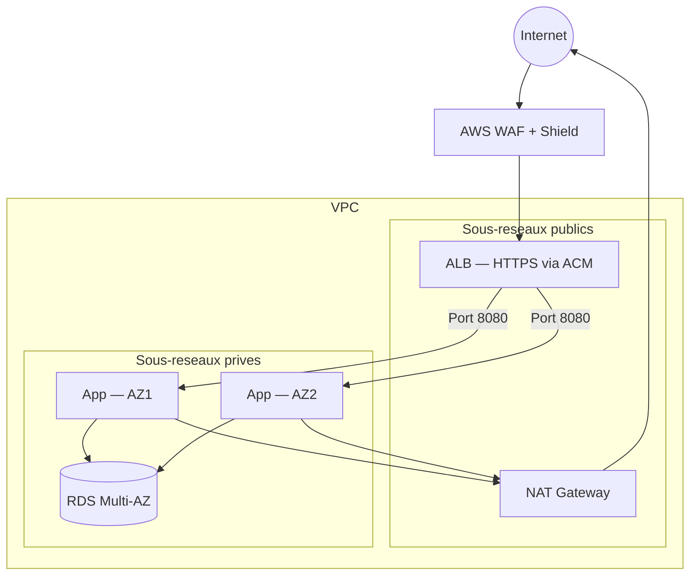
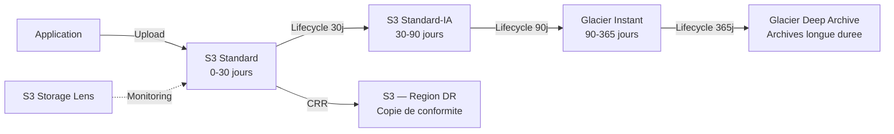
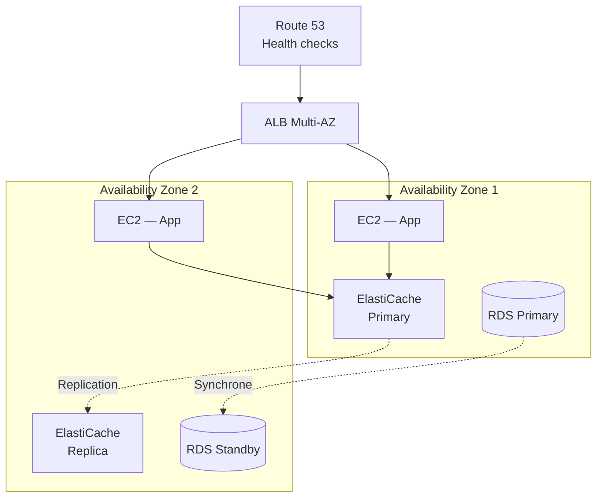
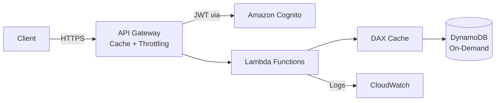
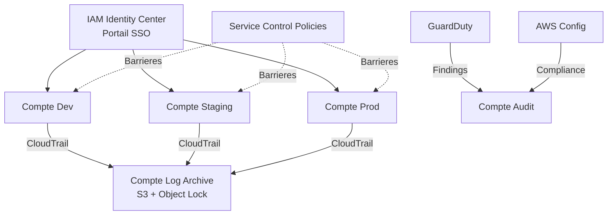
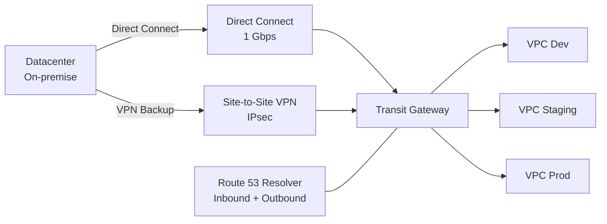
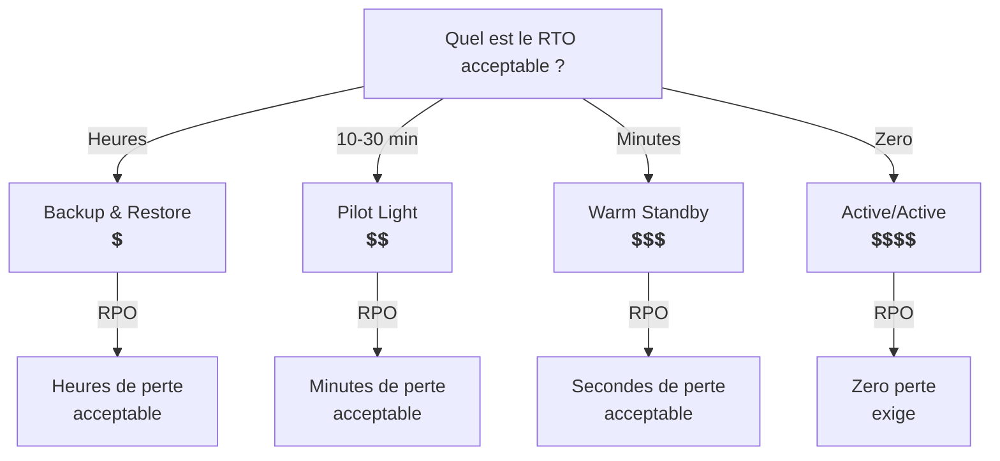
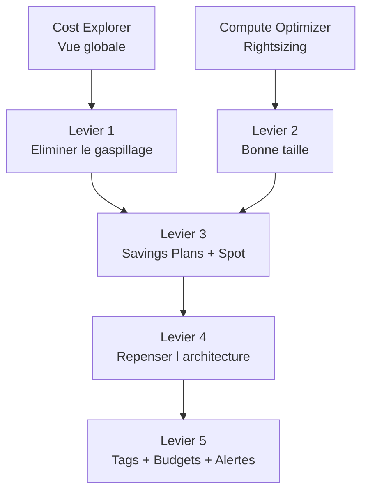
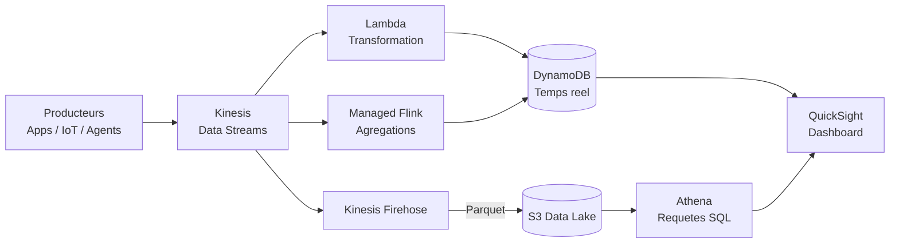
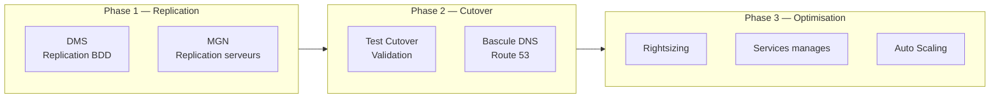

# Guide pratique — Concevoir une architecture AWS de A a Z

> 10 guides de conception qui partent d'un objectif concret et construisent l'architecture brique par brique.
> Chaque guide couvre naturellement plusieurs domaines : securite, resilience, performance et couts.
> Les renvois `→ Module XX` pointent vers le cours detaille correspondant.

---

## Guide 1 — Deployer une application web publique securisee

**Objectif** : exposer une application web sur Internet avec HTTPS, proteger l'infrastructure des attaques courantes, et isoler les composants sensibles du trafic public.

### Les contraintes

- L'application doit etre accessible depuis n'importe quel navigateur via HTTPS
- La base de donnees ne doit jamais etre joignable depuis Internet
- L'equipe doit pouvoir se connecter en SSH pour le debug, mais uniquement depuis le reseau de l'entreprise
- Le site doit resister aux attaques DDoS basiques et aux injections SQL

### Conception pas a pas

**Etape 1 — Le reseau (VPC)**

On cree un VPC dedie avec deux types de sous-reseaux :
- **Sous-reseaux publics** (2 AZ minimum) — hebergent l'ALB et la NAT Gateway
- **Sous-reseaux prives** (2 AZ minimum) — hebergent les instances applicatives et la base de donnees

Les sous-reseaux publics ont une route vers l'Internet Gateway. Les sous-reseaux prives n'ont qu'une route vers la NAT Gateway — les instances peuvent sortir (mises a jour, appels API) mais personne ne peut entrer depuis Internet.

→ [Module 05 — VPC](/courses/cloud-aws/aws_module_05_vpc.html)

**Etape 2 — Les couches de securite reseau**

Trois niveaux de filtrage, du plus large au plus fin :

| Couche | Outil | Portee |
|--------|-------|--------|
| Perimetre | AWS WAF + Shield | Filtre les requetes HTTP malveillantes (SQLi, XSS) avant qu'elles atteignent l'ALB |
| Sous-reseau | Network ACL | Regles stateless sur le sous-reseau (bloquer des plages IP, limiter les ports) |
| Instance | Security Groups | Regles stateful par instance (seul l'ALB peut parler au port 8080 de l'app) |

→ [Module 08 — Securite](/courses/cloud-aws/aws_module_08_security.html) · [Module 12 — Securite avancee](/courses/cloud-aws/aws_module_12_security_advanced.html)

**Etape 3 — Le chiffrement**

- **En transit** : certificat TLS via ACM (AWS Certificate Manager) attache a l'ALB — le navigateur parle HTTPS a l'ALB, l'ALB parle HTTP a l'instance dans le reseau prive (TLS termination)
- **Au repos** : chiffrement SSE-S3 ou SSE-KMS pour les objets S3, chiffrement AES-256 sur les volumes EBS, chiffrement natif RDS avec une cle KMS

→ [Module 12 — KMS, ACM](/courses/cloud-aws/aws_module_12_security_advanced.html)

**Etape 4 — L'acces aux ressources**

- Les instances EC2 n'ont **pas de cles d'acces codees en dur** — elles utilisent un **role IAM** attache via un instance profile
- Le role donne uniquement les permissions necessaires (principe du moindre privilege) : lire un bucket S3 specifique, ecrire dans CloudWatch Logs
- Les secrets (mot de passe BDD, cles API tierces) sont stockes dans **Secrets Manager**, pas dans des variables d'environnement ou du code

→ [Module 02 — IAM](/courses/cloud-aws/aws_module_02_iam.html) · [Module 28 — IAM avance](/courses/cloud-aws/aws_module_28_iam_advanced.html)

### L'architecture finale



### Les decisions cles

| Decision | Justification |
|----------|--------------|
| ALB en sous-reseau public, app en sous-reseau prive | L'ALB est le seul point d'entree — surface d'attaque minimale |
| WAF devant l'ALB | Filtre SQLi/XSS au niveau 7 avant d'atteindre l'application |
| TLS termination sur l'ALB | Simplifie la gestion des certificats, le trafic interne reste dans le VPC |
| Roles IAM au lieu de cles d'acces | Pas de secret a rotation manuelle, impossible de fuiter dans le code |
| Secrets Manager pour les credentials | Rotation automatique, audit via CloudTrail, pas de secret en clair |

---

## Guide 2 — Concevoir un stockage evolutif et economique

**Objectif** : stocker des volumes croissants de donnees (logs, medias, archives) en minimisant les couts sans sacrifier l'acces quand on en a besoin.

### Les contraintes

- Les donnees recentes (< 30 jours) sont accedees frequemment
- Les donnees de 30 a 90 jours sont rarement consultees mais doivent etre disponibles en quelques secondes
- Les donnees de plus de 90 jours sont conservees pour conformite, consultees exceptionnellement (delai acceptable : quelques heures)
- Le volume total croit de 500 Go par mois

### Conception pas a pas

**Etape 1 — Choisir le bon type de stockage**

| Type de donnee | Service | Raison |
|----------------|---------|--------|
| Fichiers applicatifs (medias, uploads) | Amazon S3 | Stockage objet illimite, durabilite 99,999999999% |
| Donnees de base de donnees | EBS (gp3) | Stockage bloc attache aux instances, performances previsibles |
| Fichiers partages entre instances | Amazon EFS | Systeme de fichiers NFS monte sur plusieurs EC2 |

→ [Module 04 — Stockage](/courses/cloud-aws/aws_module_04_storage.html) · [Module 26 — S3 avance](/courses/cloud-aws/aws_module_26_s3_advanced.html)

**Etape 2 — Configurer le cycle de vie S3**

La cle de l'optimisation des couts sur S3 est la politique de cycle de vie (Lifecycle Policy) :

| Age du fichier | Classe de stockage | Cout relatif |
|---------------|--------------------|-------------|
| 0 — 30 jours | S3 Standard | 1x (reference) |
| 30 — 90 jours | S3 Standard-IA | ~0,45x |
| 90 — 365 jours | S3 Glacier Instant Retrieval | ~0,17x |
| > 365 jours | S3 Glacier Deep Archive | ~0,04x |

La transition est **automatique** : une seule regle de lifecycle et S3 deplace les objets entre les classes sans intervention.

**Etape 3 — Proteger les donnees**

- **Versioning** active sur les buckets critiques — chaque modification cree une nouvelle version, les suppressions accidentelles sont recuperables
- **Replication Cross-Region (CRR)** pour les donnees de conformite — une copie automatique dans une region distante
- **S3 Object Lock** en mode compliance si les donnees doivent etre immuables (exigence reglementaire)
- **Chiffrement SSE-KMS** pour le controle fin sur qui peut dechiffrer

**Etape 4 — Surveiller les couts**

- Activer **S3 Storage Lens** pour visualiser l'utilisation par bucket, classe de stockage et pattern d'acces
- Configurer **S3 Intelligent-Tiering** sur les buckets dont le pattern d'acces est imprevisible — AWS deplace automatiquement les objets vers la classe optimale
- Creer un **budget AWS Budgets** avec alerte quand les couts S3 depassent le seuil mensuel

→ [Module 21 — FinOps](/courses/cloud-aws/aws_module_21_finops.html)

### L'architecture finale



### Les decisions cles

| Decision | Justification |
|----------|--------------|
| Lifecycle automatique plutot que deplacement manuel | Zero effort operationnel, economies garanties dans le temps |
| Glacier Instant Retrieval plutot que Glacier Flexible | Acces en millisecondes pour les donnees de 90 jours — pas d'attente de 3-5h |
| Intelligent-Tiering sur les buckets imprevisibles | Pas besoin de deviner le pattern d'acces — AWS optimise automatiquement |
| CRR en mode compliance | Separation physique entre donnee principale et copie de conformite |

---

## Guide 3 — Rendre une architecture hautement disponible

**Objectif** : transformer une architecture mono-AZ en architecture resiliente capable de survivre a la panne d'une zone de disponibilite entiere sans interruption de service.

### Les contraintes

- SLO cible : 99,95% de disponibilite (downtime max ~4h/an)
- Le basculement doit etre automatique — aucune intervention humaine
- Les donnees ne doivent jamais etre perdues (RPO ~ 0)
- Le budget n'autorise pas une architecture multi-region active/active

### Conception pas a pas

**Etape 1 — Distribuer le compute sur plusieurs AZ**

Un Auto Scaling Group configure en Multi-AZ lance des instances dans au moins 2 zones de disponibilite. Si une AZ tombe, l'ASG detecte les instances malsaines et en lance de nouvelles dans les AZ restantes. Le `min_size` doit etre suffisant pour absorber le trafic avec une AZ en moins.

**Etape 2 — Le load balancer comme point d'entree unique**

L'Application Load Balancer est deploye sur toutes les AZ du ASG. Il effectue des health checks reguliers et retire automatiquement les instances qui ne repondent plus. Les clients ne voient qu'un seul endpoint DNS — la repartition et le failover sont transparents.

**Etape 3 — La base de donnees Multi-AZ**

RDS Multi-AZ maintient un replica synchrone dans une AZ differente. En cas de panne de l'AZ principale, RDS bascule automatiquement sur le replica (failover en 1-2 minutes). Le endpoint DNS RDS ne change pas — l'application ne sait meme pas qu'un failover a eu lieu.

Pour DynamoDB, la resilience est native : les donnees sont repliquees sur 3 AZ automatiquement.

→ [Module 10 — Databases](/courses/cloud-aws/aws_module_10_databases.html) · [Module 17 — HA](/courses/cloud-aws/aws_module_17_ha.html)

**Etape 4 — Le cache et les sessions**

ElastiCache Redis en mode cluster Multi-AZ maintient un replica de lecture dans une autre AZ. Si le noeud principal tombe, Redis bascule sur le replica en quelques secondes. Les sessions utilisateur et le cache applicatif survivent au failover.

**Etape 5 — Le DNS et le health checking**

Route 53 avec des health checks surveille l'ALB. Si l'ensemble de la stack dans une region devient indisponible, Route 53 peut router vers un endpoint de secours (page statique S3, stack DR dans une autre region).

→ [Module 11 — Route 53](/courses/cloud-aws/aws_module_11_dns_cdn.html)

### L'architecture finale



### Les decisions cles

| Decision | Justification |
|----------|--------------|
| Multi-AZ et pas multi-region | Repond au SLO 99,95% sans le cout d'une architecture multi-region |
| RDS Multi-AZ synchrone | RPO = 0 — aucune transaction perdue lors du failover |
| ASG min_size = N+1 | Capacite suffisante pour absorber le trafic si une AZ tombe |
| ElastiCache Multi-AZ | Les sessions survivent au failover — pas de deconnexion utilisateur |

---

## Guide 4 — Construire une API serverless a forte charge

**Objectif** : deployer une API REST capable de gerer des pics de trafic imprevisibles (de 10 a 10 000 requetes par seconde) sans gerer d'infrastructure et en ne payant que l'utilisation reelle.

### Les contraintes

- Le trafic est tres variable : pics lors d'evenements marketing, quasi-nul la nuit
- Temps de reponse cible : < 200 ms au 95e percentile
- L'equipe est petite — zero administration de serveurs
- Le budget est proportionnel au trafic (pas de couts fixes eleves)

### Conception pas a pas

**Etape 1 — API Gateway comme facade**

Amazon API Gateway expose les endpoints REST, gere l'authentification, la validation des requetes et le throttling. Il scale automatiquement sans configuration.

- **Throttling** : limiter a 1 000 req/s par defaut pour proteger le backend et controler les couts
- **API Keys + Usage Plans** : limiter le debit par client si l'API est exposee a des partenaires
- **Caching integre** : activer le cache API Gateway (0,5 Go — 237 Go) pour les reponses qui ne changent pas souvent — reduit les invocations Lambda et la latence

→ [Module 18 — Serverless](/courses/cloud-aws/aws_module_18_serverless.html)

**Etape 2 — Lambda pour le compute**

Chaque endpoint est sauvegarde par une fonction Lambda. Lambda scale automatiquement : une invocation = un conteneur. A 10 000 req/s, il y a 10 000 conteneurs concurrents (sous reserve des limites du compte).

Points d'attention :
- **Cold starts** : les premieres invocations apres une periode d'inactivite prennent 100-500 ms de plus. Mitigation : Provisioned Concurrency sur les fonctions critiques (coute un forfait fixe)
- **Taille memoire** : plus de memoire = plus de CPU = execution plus rapide. Trouver le sweet spot cout/performance avec AWS Lambda Power Tuning
- **Timeout** : configurer un timeout raisonnable (ex. 10 s) pour ne pas payer des executions infinies en cas de bug

→ [Module 29 — Lambda avance](/courses/cloud-aws/aws_module_29_lambda_advanced.html)

**Etape 3 — DynamoDB comme base de donnees**

DynamoDB est le choix naturel pour une stack serverless : pas de serveur a gerer, latence < 10 ms, scaling automatique.

- **Mode On-Demand** pour le trafic imprevisible — pas besoin de pre-provisionner des capacites
- **DAX (DynamoDB Accelerator)** devant DynamoDB pour les lectures repetitives — cache en memoire avec latence en microsecondes
- **Global Tables** si l'API doit etre deployee dans plusieurs regions

→ [Module 10 — Databases](/courses/cloud-aws/aws_module_10_databases.html)

**Etape 4 — Authentification et securite**

- **Amazon Cognito** pour l'authentification utilisateur (inscription, login, tokens JWT)
- API Gateway valide le token JWT avant d'invoquer Lambda — les requetes non authentifiees sont rejetees immediatement
- Les fonctions Lambda utilisent un **role IAM** avec le minimum de permissions (lecture DynamoDB, ecriture CloudWatch Logs)

→ [Module 29 — Cognito](/courses/cloud-aws/aws_module_29_lambda_advanced.html)

### L'architecture finale



### Les decisions cles

| Decision | Justification |
|----------|--------------|
| Serverless complet | Zero administration, cout proportionnel au trafic, scaling automatique |
| DynamoDB On-Demand | Pas de capacity planning — le mode s'adapte aux pics sans pre-provisioning |
| DAX devant DynamoDB | Absorbe les lectures repetitives — reduit les couts DynamoDB et la latence |
| Cognito plutot qu'un auth custom | Service manage, integration native avec API Gateway, zero code JWT |
| Cache API Gateway | Les reponses identiques ne declenchent pas Lambda — economies et latence reduite |

---

## Guide 5 — Securiser un environnement multi-compte

**Objectif** : organiser une entreprise sur AWS avec plusieurs comptes (dev, staging, prod, securite, logs) en garantissant que chaque equipe a exactement les permissions dont elle a besoin, sans plus.

### Les contraintes

- 4 equipes : dev, ops, securite, data
- Isolation stricte entre les environnements (un bug en dev ne doit pas impacter prod)
- Politique de securite centralisee (certaines actions interdites dans tous les comptes)
- Audit complet de toutes les actions sur tous les comptes
- Un seul point d'entree pour l'authentification (SSO)

### Conception pas a pas

**Etape 1 — AWS Organizations et structure des comptes**

On cree une organisation avec des OU (Organizational Units) qui refletent les environnements :

```
Root
├── Security OU
│   ├── Compte Audit (CloudTrail, Config, GuardDuty delegue)
│   └── Compte Log Archive (centralisation des logs)
├── Infrastructure OU
│   └── Compte Network (Transit Gateway, DNS, Direct Connect)
├── Workloads OU
│   ├── Compte Dev
│   ├── Compte Staging
│   └── Compte Prod
└── Sandbox OU
    └── Compte Sandbox (experimentation libre avec budget cap)
```

→ [Module 24 — Gouvernance](/courses/cloud-aws/aws_module_24_governance.html)

**Etape 2 — Les Service Control Policies (SCP)**

Les SCP sont des barrieres de securite au niveau de l'organisation. Elles s'appliquent a tous les comptes d'une OU, meme aux administrateurs de ces comptes :

| SCP | OU cible | Effet |
|-----|----------|-------|
| Interdire la suppression de CloudTrail | Root (toute l'org) | Personne ne peut desactiver l'audit |
| Interdire les regions non-autorisees | Root | Empeche de deployer hors eu-west-1 et eu-central-1 |
| Interdire la creation d'utilisateurs IAM | Workloads OU | Force l'utilisation de roles et SSO |
| Budget max 200 $/mois | Sandbox OU | Limite les degats d'experimentation |

→ [Module 28 — IAM avance](/courses/cloud-aws/aws_module_28_iam_advanced.html)

**Etape 3 — IAM Identity Center (SSO)**

Un seul endroit pour gerer tous les acces :
- Les developpeurs se connectent via le portail SSO avec leur identifiant d'entreprise
- Chaque utilisateur a des **Permission Sets** qui definissent ce qu'il peut faire dans chaque compte
- L'equipe dev a un acces admin sur le compte Dev mais en lecture seule sur Staging et aucun acces sur Prod
- L'equipe ops a un acces admin sur Staging et Prod

Avantage majeur : **aucune cle d'acces longue duree**. Les credentials sont temporaires (STS) et expirent automatiquement.

**Etape 4 — Audit et detection**

- **CloudTrail** active sur tous les comptes, logs centralises dans le compte Log Archive (bucket S3 avec Object Lock)
- **AWS Config** surveille la conformite des ressources (ex: tout bucket S3 doit etre chiffre, tout security group ne doit pas autoriser 0.0.0.0/0 en SSH)
- **GuardDuty** analyse les logs pour detecter les comportements suspects (acces depuis un pays inhabituel, appels API anormaux)

→ [Module 20 — Zero Trust](/courses/cloud-aws/aws_module_20_security_zero_trust.html)

### L'architecture finale



### Les decisions cles

| Decision | Justification |
|----------|--------------|
| Un compte par environnement | Isolation totale — un incident en dev ne touche pas les ressources prod |
| SCP au niveau OU | S'appliquent meme aux admins du compte — barriere infranchissable |
| SSO au lieu d'utilisateurs IAM | Credentials temporaires, un seul annuaire, revocation instantanee |
| Logs dans un compte dedie | Le compte Log Archive est en lecture seule — personne ne peut alterer les preuves |

---

## Guide 6 — Deployer un reseau hybride entreprise-cloud

**Objectif** : connecter un datacenter on-premise au VPC AWS de maniere securisee, performante et redondante pour permettre la migration progressive des charges de travail.

### Les contraintes

- Connexion privee (pas de transit par Internet public)
- Bande passante minimale de 1 Gbps avec latence < 10 ms
- La connexion doit survivre a une panne d'un seul lien
- Plusieurs VPC (dev, staging, prod) doivent acceder au datacenter
- La resolution DNS doit fonctionner dans les deux sens (on-prem ↔ AWS)

### Conception pas a pas

**Etape 1 — AWS Direct Connect pour le lien principal**

Direct Connect etablit une connexion physique dediee entre le datacenter et AWS. Le trafic ne passe jamais par Internet — latence stable, bande passante garantie.

- Commander une connexion 1 Gbps (ou 10 Gbps) dans un point de presence Direct Connect
- Configurer une **Private VIF** (Virtual Interface) pour acceder aux VPC
- Configurer une **Transit VIF** si on utilise un Transit Gateway

→ [Module 27 — VPC avance](/courses/cloud-aws/aws_module_27_vpc_advanced.html)

**Etape 2 — VPN comme lien de secours**

Direct Connect est fiable mais pas infaillible (travaux, panne du partenaire telco). On configure un **Site-to-Site VPN** comme backup :

- Le VPN passe par Internet mais est chiffre (IPsec)
- Latence plus elevee que Direct Connect mais disponible en quelques minutes
- En fonctionnement normal, tout le trafic passe par Direct Connect. Si Direct Connect tombe, le routage BGP bascule automatiquement vers le VPN

**Etape 3 — Transit Gateway comme hub central**

Plutot que de connecter le datacenter a chaque VPC individuellement (complexite N×N), on place un **Transit Gateway** au centre :

- Le datacenter se connecte au Transit Gateway (via Direct Connect + VPN)
- Chaque VPC (dev, staging, prod) s'attache au Transit Gateway
- Le routage est centralise — ajouter un nouveau VPC = une seule attachment

**Etape 4 — Resolution DNS hybride**

- **Route 53 Resolver Inbound Endpoint** : le DNS on-premise peut resoudre les noms des zones privees AWS
- **Route 53 Resolver Outbound Endpoint** : les ressources AWS peuvent resoudre les noms du DNS interne de l'entreprise

→ [Module 11 — Route 53](/courses/cloud-aws/aws_module_11_dns_cdn.html)

### L'architecture finale



### Les decisions cles

| Decision | Justification |
|----------|--------------|
| Direct Connect + VPN backup | Haute performance en normal, resilience si le lien physique tombe |
| Transit Gateway plutot que VPC Peering | Un seul point de connexion pour tous les VPC — scalable quand on ajoute des comptes |
| BGP pour le routage | Basculement automatique Direct Connect → VPN sans intervention |
| Route 53 Resolver bidirectionnel | Les deux mondes resolvent les noms de l'autre — transparent pour les applications |

---

## Guide 7 — Mettre en place une strategie de reprise apres sinistre

**Objectif** : definir et implementer un plan DR adapte a la criticite de l'application, avec un RTO (temps de reprise) et un RPO (perte de donnees) clairs.

### Choisir la bonne strategie

Toutes les applications ne meritent pas la meme strategie DR. Le choix depend du budget et de la tolerance aux pertes :

| Strategie | RTO | RPO | Cout relatif | Quand l'utiliser |
|-----------|-----|-----|-------------|-----------------|
| **Backup & Restore** | Heures | Heures | $ | Applications internes non-critiques |
| **Pilot Light** | 10-30 min | Minutes | $$ | Applications metier avec tolerance moderee |
| **Warm Standby** | Minutes | Secondes | $$$ | Applications client-facing, e-commerce |
| **Active/Active** | ~0 | ~0 | $$$$ | Applications financieres, temps reel |

→ [Module 17 — HA & DR](/courses/cloud-aws/aws_module_17_ha.html)

### Strategie 1 — Backup & Restore

**Mise en place** :
- Snapshots EBS automatiques via **AWS Backup** (planifies toutes les 12h)
- Exports automatiques RDS vers S3 (ou snapshots cross-region)
- AMI copiees dans la region DR
- Code d'infrastructure en **CloudFormation** ou **Terraform** pret a deployer

**En cas de sinistre** : on lance le template IaC dans la region DR, on restaure les snapshots, on met a jour Route 53 pour pointer vers la nouvelle stack.

**Limites** : le temps de restauration inclut le lancement de toute l'infrastructure + la restauration des donnees. Compte 2-4 heures minimum.

→ [Module 13 — IaC](/courses/cloud-aws/aws_module_13_iac.html) · [Module 32 — Migration & Backup](/courses/cloud-aws/aws_module_32_migration.html)

### Strategie 2 — Pilot Light

**Mise en place** :
- La base de donnees est repliquee en continu dans la region DR (RDS Read Replica cross-region ou Aurora Global Database)
- Le compute n'est **pas** en cours d'execution dans la region DR — mais les AMI et la config sont pretes

**En cas de sinistre** : on promeut le read replica en base principale, on lance les instances EC2 / conteneurs dans la region DR via l'ASG, on bascule Route 53.

**Avantage** : RPO quasi nul (replication continue), RTO de 10-30 minutes. On ne paie que la base de donnees replica en temps normal — pas de compute inutile.

### Strategie 3 — Warm Standby

**Mise en place** :
- Version reduite de la stack complete qui tourne deja dans la region DR (ex: 1 instance au lieu de 10)
- Base de donnees repliquee en continu (comme Pilot Light)
- L'ASG est configure pour scaler rapidement si on bascule

**En cas de sinistre** : on augmente la capacite dans la region DR (scale up/out), on bascule Route 53. Le service est disponible immediatement (meme en version degradee) et atteint la pleine capacite en quelques minutes.

### Strategie 4 — Active/Active multi-region

**Mise en place** :
- Stack complete dans deux regions (ou plus), chacune sert du trafic en permanence
- **DynamoDB Global Tables** ou **Aurora Global Database** pour la replication bidirectionnelle
- **Route 53 Latency-based routing** envoie les utilisateurs vers la region la plus proche
- **CloudFront** avec des origines dans les deux regions

**En cas de sinistre** : Route 53 detecte la panne via health checks et arrete de router vers la region defaillante. Les utilisateurs sont automatiquement rediriges — sans interruption perceptible.

**Cout** : double infrastructure. Reserve pour les applications ou chaque seconde de downtime coute tres cher.

### L'arbre de decision



---

## Guide 8 — Optimiser les couts d'une infrastructure existante

**Objectif** : reduire la facture AWS de 30-50% sans degrader les performances ni la disponibilite, en appliquant les leviers d'optimisation dans le bon ordre.

### La methode en 5 leviers

L'erreur classique est de commencer par negocier des Reserved Instances. L'ordre optimal est : d'abord eliminer le gaspillage, puis optimiser la taille, puis engager.

→ [Module 21 — FinOps](/courses/cloud-aws/aws_module_21_finops.html)

**Levier 1 — Eliminer les ressources inutilisees**

Les plus gros gaspillages sur un compte AWS typique :

| Ressource | Comment detecter | Action |
|-----------|-----------------|--------|
| EBS volumes non-attaches | AWS Cost Explorer / Trusted Advisor | Snapshot + supprimer |
| Elastic IP non-associees | `aws ec2 describe-addresses` | Liberer (elles coutent 3,65 $/mois chacune) |
| Instances EC2 eteintes mais non-terminees | Tag "Stopped" depuis > 7 jours | Creer AMI + terminer |
| Load Balancers sans cible | Trusted Advisor | Supprimer |
| Snapshots EBS orphelins | `aws ec2 describe-snapshots --owner-ids self` | Evaluer et purger |
| NAT Gateways inactifs | CloudWatch BytesProcessed = 0 | Supprimer |

→ [Module 06 — CLI](/courses/cloud-aws/aws_module_06_cli.html)

**Levier 2 — Rightsizing (bonne taille d'instance)**

- Analyser l'utilisation CPU/memoire via **CloudWatch** et **AWS Compute Optimizer**
- Si le CPU moyen est < 20%, l'instance est surdimensionnee → passer a la taille inferieure
- Si le CPU pic est < 40%, envisager un passage a la famille T (burstable) qui coute moins cher pour des charges variables

→ [Module 03 — EC2](/courses/cloud-aws/aws_module_03_ec2.html)

**Levier 3 — Modeles d'achat**

| Modele | Economie | Engagement | Ideal pour |
|--------|----------|------------|-----------|
| On-Demand | 0% | Aucun | Charges temporaires, tests |
| Savings Plans (Compute) | 30-50% | 1 ou 3 ans | Charge de base stable, flexible sur le type d'instance |
| Reserved Instances | 40-60% | 1 ou 3 ans, instance specifique | Charge tres previsible et stable |
| Spot Instances | 60-90% | Aucun (interruption possible) | Batch, CI/CD, training ML, charges tolerantes |

Strategie recommandee : **Savings Plans** pour la charge de base + **Spot** pour les pics et les jobs batch + **On-Demand** pour le reste.

**Levier 4 — Architecture**

Parfois, le meilleur moyen de reduire les couts n'est pas de negocier le prix mais de changer l'architecture :

| Avant | Apres | Economie typique |
|-------|-------|-----------------|
| EC2 + cron pour un job qui tourne 5 min/heure | Lambda | 80-95% |
| RDS provisionne 24/7 pour un environnement de dev | Aurora Serverless v2 | 60-80% (scale a zero la nuit) |
| NAT Gateway pour du trafic S3 | Gateway VPC Endpoint (gratuit) | 100% du cout NAT sur ce trafic |
| CloudWatch Logs standard | Log filtering + export vers S3 | 50-70% |

→ [Module 18 — Serverless](/courses/cloud-aws/aws_module_18_serverless.html)

**Levier 5 — Gouvernance et alertes**

- **AWS Budgets** : alertes a 80% et 100% du budget mensuel par equipe/projet
- **Tags de repartition des couts** : chaque ressource doit avoir un tag `team` et `project` — impossible d'optimiser ce qu'on ne peut pas attribuer
- **Cost anomaly detection** : AWS detecte les variations de couts inhabituelles et alerte automatiquement

→ [Module 24 — Gouvernance & Tagging](/courses/cloud-aws/aws_module_24_governance.html)

### Le tableau de bord FinOps



---

## Guide 9 — Concevoir un pipeline de donnees en temps reel

**Objectif** : ingerer, transformer et analyser des flux de donnees en continu (logs applicatifs, evenements IoT, clics utilisateurs) avec une latence de quelques secondes.

### Les contraintes

- Volume : 50 000 evenements par seconde en pic
- Latence maximale entre l'ingestion et la disponibilite pour requete : 30 secondes
- Les donnees brutes doivent etre conservees dans un data lake pour analyse retrospective
- Un dashboard temps reel doit afficher les metriques cles

### Conception pas a pas

**Etape 1 — Ingestion avec Kinesis Data Streams**

Kinesis Data Streams recoit les evenements en temps reel. Les producteurs (applications, agents de collecte) envoient les enregistrements dans le stream.

- Dimensionner le nombre de **shards** en fonction du debit : chaque shard supporte 1 000 enregistrements/s en ecriture et 2 Mo/s en lecture
- Pour 50 000 evt/s → environ 50 shards (ou activer le mode **On-Demand** qui s'adapte automatiquement)

→ [Module 30 — Data Services](/courses/cloud-aws/aws_module_30_data_services.html)

**Etape 2 — Transformation avec Lambda ou Kinesis Data Analytics**

Deux options selon la complexite du traitement :

| Option | Cas d'usage |
|--------|------------|
| **Lambda** (consommateur Kinesis) | Transformations simples : enrichissement, filtrage, reformatage |
| **Kinesis Data Analytics (Managed Flink)** | Agregations temporelles : moyenne glissante, comptage par fenetre de 5 min |

Lambda est plus simple a mettre en oeuvre. Flink est necessaire quand on doit maintenir un etat entre les evenements (ex: "nombre de clics par utilisateur dans les 5 dernieres minutes").

**Etape 3 — Stockage dual : temps reel + data lake**

Les evenements transformes sont ecrits simultanement dans deux destinations :

- **DynamoDB** (ou OpenSearch) pour les requetes temps reel — le dashboard lit ici
- **S3** (via Kinesis Data Firehose) pour le data lake — les donnees brutes sont archivees en Parquet pour les analyses retrospectives avec Athena

Kinesis Data Firehose s'occupe du buffering, de la compression et de la conversion de format. Il ecrit dans S3 par lots toutes les 60 secondes ou tous les 64 Mo (configurable).

**Etape 4 — Analyse et visualisation**

- **Amazon Athena** pour les requetes SQL ad hoc sur le data lake S3 (pas de serveur, facture au volume scanne)
- **Amazon QuickSight** pour les dashboards interactifs connectes a Athena ou DynamoDB
- **CloudWatch** pour les metriques operationnelles du pipeline lui-meme (age des enregistrements dans Kinesis, erreurs Lambda)

### L'architecture finale



### Les decisions cles

| Decision | Justification |
|----------|--------------|
| Kinesis Data Streams plutot que SQS | Streaming temps reel avec replay — SQS est fait pour le decouplage, pas l'analytique |
| Stockage dual (DynamoDB + S3) | Temps reel pour le dashboard, data lake pour l'analytique longue duree |
| Firehose pour l'ecriture S3 | Zero code — buffering, compression et conversion de format automatiques |
| Parquet sur S3 | Columnar = requetes Athena 10x plus rapides et 90% moins cheres que CSV |

---

## Guide 10 — Migrer une application on-premise vers AWS

**Objectif** : migrer une application 3-tiers (frontend, backend, base de donnees) hebergee dans un datacenter vers AWS avec un minimum de downtime.

### Les contraintes

- L'application ne peut pas etre indisponible plus de 2 heures pendant la migration
- La base de donnees fait 500 Go (Oracle)
- L'equipe ne maitrise pas encore les services manages AWS
- Le budget impose une migration progressive, pas un redesign complet

### Conception pas a pas

**Etape 1 — Evaluer et planifier**

Avant de migrer quoi que ce soit, on cartographie l'existant :

- **AWS Application Discovery Service** inventorie les serveurs, leurs dependances et leur utilisation
- **AWS Migration Hub** centralise le suivi de la migration

Les 7 strategies de migration (les "7 R") — choisir la bonne pour chaque composant :

| Strategie | Description | Quand |
|-----------|------------|-------|
| **Rehost** (Lift & Shift) | Deplacer tel quel sur EC2 | Migration rapide, equipe pas encore formee |
| **Replatform** (Lift & Reshape) | Petits ajustements (ex: Oracle → RDS PostgreSQL) | Gain rapide sans refonte |
| **Refactor** | Reecrire pour le cloud natif | Application strategique, equipe formee |
| **Repurchase** | Remplacer par un SaaS | Outil standard (CRM, email) |
| **Retire** | Eteindre | Application obsolete |
| **Retain** | Garder on-premise | Pas prioritaire ou contrainte reglementaire |
| **Relocate** | VMware Cloud on AWS | Parc VMware existant |

Pour notre cas : **Rehost** pour le frontend et backend (EC2), **Replatform** pour la base de donnees (Oracle → RDS PostgreSQL).

→ [Module 32 — Migration](/courses/cloud-aws/aws_module_32_migration.html)

**Etape 2 — Migrer la base de donnees avec AWS DMS**

AWS Database Migration Service (DMS) replique la base de donnees source vers RDS en continu :

1. **Full load** : copie initiale des 500 Go (quelques heures selon la bande passante)
2. **CDC (Change Data Capture)** : DMS capture et replique les changements en temps reel pendant que l'application continue de tourner on-premise
3. **Cutover** : quand la replication est a jour (lag < 1s), on bascule l'application vers RDS

Le Schema Conversion Tool (SCT) convertit le schema Oracle en PostgreSQL et signale les incompatibilites a corriger manuellement.

**Etape 3 — Migrer les serveurs avec AWS MGN**

AWS Application Migration Service (MGN) replique les disques des serveurs on-premise vers AWS en continu :

1. Installer l'agent MGN sur les serveurs source
2. La replication initiale copie les volumes (en arriere-plan, sans impact sur la production)
3. Lancer un **test cutover** pour verifier que les instances EC2 demarrent correctement
4. Le jour J : lancer le **cutover final**, mettre a jour le DNS, valider, eteindre les serveurs on-premise

**Etape 4 — Securiser et optimiser post-migration**

Immediatement apres la migration :
- Mettre les instances dans des **sous-reseaux prives** avec un ALB en facade
- Activer le **chiffrement EBS** et le chiffrement RDS
- Configurer **CloudWatch** pour le monitoring
- Planifier la phase 2 : rightsizing, passage a des services manages (ECS, Aurora), Auto Scaling

### Le plan de migration



### Les decisions cles

| Decision | Justification |
|----------|--------------|
| Rehost + Replatform plutot que Refactor | Migration rapide avec downtime minimal — le refactoring viendra en phase 2 |
| DMS avec CDC pour la base | Replication continue = quasi zero downtime lors du cutover |
| MGN plutot que export/import d'images | Replication continue des disques — le cutover est un simple clic |
| Oracle → PostgreSQL | Eliminer les couts de licence Oracle — PostgreSQL est open source et supporte par RDS |

---

## Recapitulatif — Quel guide pour quelle situation

| Situation | Guide | Domaines couverts |
|-----------|-------|-------------------|
| Exposer une application sur Internet | [Guide 1](#guide-1--deployer-une-application-web-publique-securisee) | Securite, Resilience |
| Gerer des volumes de donnees croissants | [Guide 2](#guide-2--concevoir-un-stockage-evolutif-et-economique) | Couts, Performance |
| Garantir la disponibilite | [Guide 3](#guide-3--rendre-une-architecture-hautement-disponible) | Resilience, Performance |
| Lancer une API sans gerer de serveurs | [Guide 4](#guide-4--construire-une-api-serverless-a-forte-charge) | Performance, Couts |
| Organiser plusieurs comptes AWS | [Guide 5](#guide-5--securiser-un-environnement-multi-compte) | Securite |
| Connecter un datacenter a AWS | [Guide 6](#guide-6--deployer-un-reseau-hybride-entreprise-cloud) | Resilience, Performance |
| Planifier la reprise apres sinistre | [Guide 7](#guide-7--mettre-en-place-une-strategie-de-reprise-apres-sinistre) | Resilience, Couts |
| Reduire la facture AWS | [Guide 8](#guide-8--optimiser-les-couts-dune-infrastructure-existante) | Couts |
| Traiter des flux de donnees en continu | [Guide 9](#guide-9--concevoir-un-pipeline-de-donnees-en-temps-reel) | Performance |
| Migrer depuis un datacenter | [Guide 10](#guide-10--migrer-une-application-on-premise-vers-aws) | Resilience, Couts |
