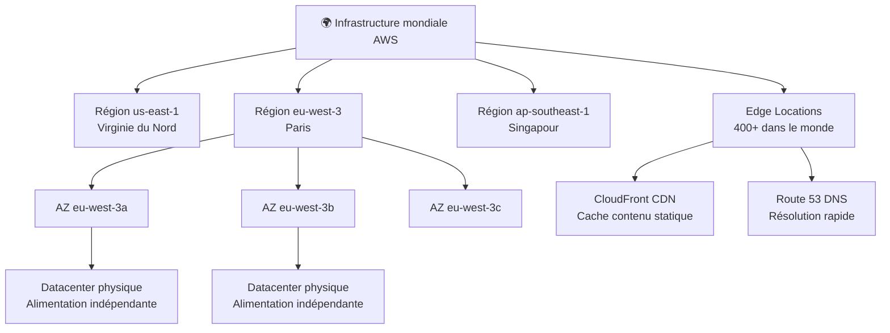
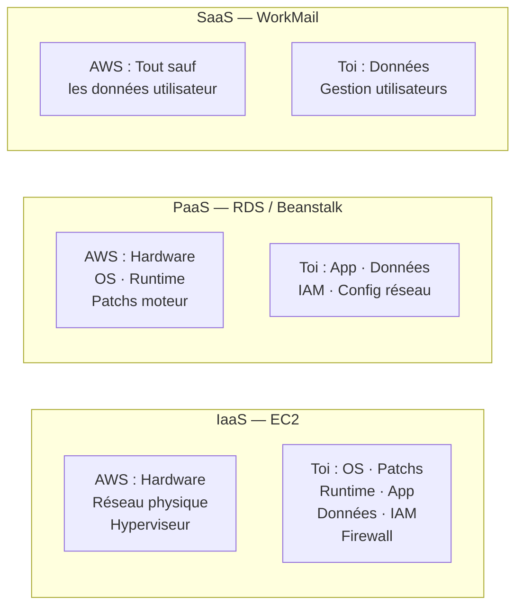

# Concepts Cloud & Modèles AWS

## Objectifs pédagogiques

À l'issue de ce module, tu seras capable de :

- Distinguer les trois modèles de service cloud (IaaS, PaaS, SaaS) et identifier quel service AWS correspond à chacun
- Décrire la hiérarchie géographique AWS : régions, zones de disponibilité et edge locations
- Expliquer le modèle de responsabilité partagée et ce que cela implique concrètement pour toi en tant qu'utilisateur
- Choisir le bon modèle de service selon les contraintes d'un projet (contrôle, coût, maintenance)
- Relier les concepts de scalabilité et de haute disponibilité à des mécanismes AWS concrets

---

## Pourquoi le cloud a changé les règles du jeu

Pendant longtemps, déployer une application web signifiait acheter des serveurs physiques, les installer dans un datacenter, configurer le réseau, gérer les pannes matérielles — et attendre plusieurs semaines avant que tout soit opérationnel. Si ton application connaissait un pic de trafic inattendu, tu ne pouvais rien faire en temps réel.

AWS, lancé commercialement en 2006, a inversé cette logique : au lieu de posséder l'infrastructure, tu la loues à la demande, tu la provisionnes en quelques minutes via une API, et tu ne paies que ce que tu consommes.

Ce changement n'est pas juste technique — il est économique et organisationnel. Une startup peut aujourd'hui démarrer avec le même niveau d'infrastructure qu'une grande entreprise, sans investissement initial.

---

## Les trois modèles de service : IaaS, PaaS, SaaS

Le cloud ne se présente pas en un seul bloc. Il existe trois niveaux d'abstraction, chacun définissant jusqu'où AWS gère les choses à ta place — et donc ce qui reste sous ta responsabilité.

La meilleure façon de comprendre la différence : pense à la location d'un logement.

- **IaaS**, c'est louer un appartement vide. Tu as les murs, l'électricité, la plomberie — le reste, tu l'installes toi-même.
- **PaaS**, c'est un appartement meublé. Tu apportes tes affaires personnelles, mais la cuisine est équipée et Internet est branché.
- **SaaS**, c'est un hôtel. Tu arrives avec ta valise, tout le reste est géré.

### Tableau comparatif : qui gère quoi ?

| Couche | On-premise | IaaS (EC2) | PaaS (Elastic Beanstalk) | SaaS (WorkMail) |
|---|---|---|---|---|
| Application | ✅ Toi | ✅ Toi | ✅ Toi | ☁️ AWS |
| Données | ✅ Toi | ✅ Toi | ✅ Toi | ☁️ AWS |
| Runtime / Framework | ✅ Toi | ✅ Toi | ☁️ AWS | ☁️ AWS |
| Système d'exploitation | ✅ Toi | ✅ Toi | ☁️ AWS | ☁️ AWS |
| Patchs & sécurité OS | ✅ Toi | ✅ Toi | ☁️ AWS | ☁️ AWS |
| Virtualisation | ✅ Toi | ☁️ AWS | ☁️ AWS | ☁️ AWS |
| Réseau physique | ✅ Toi | ☁️ AWS | ☁️ AWS | ☁️ AWS |
| Datacenter / Hardware | ✅ Toi | ☁️ AWS | ☁️ AWS | ☁️ AWS |

### Exemples AWS concrets

**IaaS — EC2** : tu lances une instance (machine virtuelle), tu choisis l'OS (Amazon Linux, Ubuntu…), tu installes tes paquets, tu gères les mises à jour de sécurité. AWS te fournit le serveur et la connectivité réseau, rien de plus.

**PaaS — Elastic Beanstalk** : tu pousses ton code (une app Node.js, Python, Java…), et AWS déploie automatiquement l'environnement, configure le serveur web, gère la scalabilité. Tu ne touches pas à l'OS.

**SaaS — Amazon WorkMail** : tu crées des boîtes mail pour tes utilisateurs. L'infrastructure, la redondance, les sauvegardes — tout est opéré par AWS. Tu utilises le service, tu n'administres rien.

### Quand choisir quoi ?

Le choix n'est pas une question de préférence, c'est une question de contraintes :

- Tu as besoin d'un contrôle total sur l'OS ou d'une configuration réseau spécifique → **IaaS**
- Tu veux te concentrer sur ton code sans gérer de serveurs, et ton stack est standard → **PaaS**
- Tu as besoin d'un outil métier standard (email, collaboration) sans développement → **SaaS**

💡 Le piège classique : choisir IaaS par réflexe alors qu'une approche PaaS économiserait 80% du travail d'exploitation.

<!-- snippet
id: aws_concepts_iaas_vs_paas_choice
type: tip
tech: aws
level: beginner
importance: high
format: knowledge
tags: iaas,paas,saas,decision,architecture
title: Choisir entre IaaS, PaaS et SaaS — critères de décision
content: |
  - IaaS (EC2) : contrôle total, responsabilité OS et patchs
  - PaaS (Beanstalk) : focus code uniquement, AWS gère le runtime et le scaling
  - SaaS (WorkMail) : outil clé-en-main, zéro administration
description: Critères de choix entre les modèles cloud : contrôle vs simplicité, coût de maintenance vs flexibilité.
-->

<!-- snippet
id: aws_concepts_service_models_examples
type: concept
tech: aws
level: beginner
importance: high
format: knowledge
tags: iaas,paas,saas,ec2,beanstalk,workmail
title: Exemples AWS par modèle de service
content: |
  - IaaS → EC2, EBS, VPC
  - PaaS → Elastic Beanstalk, RDS
  - SaaS → WorkMail, Chime, Amazon Connect
description: La frontière PaaS/SaaS est parfois floue selon le niveau de configuration disponible.
-->

---

## L'infrastructure mondiale AWS : régions, AZ, edge locations

AWS n'est pas un datacenter unique quelque part aux États-Unis. C'est un réseau mondial organisé en trois niveaux imbriqués — et comprendre cette hiérarchie est indispensable dès que tu prends ta première décision d'architecture.

### Les régions

Une **région AWS** est un ensemble de datacenters physiquement localisés dans une même zone géographique. Chaque région est complètement indépendante des autres : son propre réseau, ses propres services, et ses données ne sortent jamais de cette région sans ton autorisation explicite.

Exemples : `us-east-1` (Virginie du Nord), `eu-west-3` (Paris), `ap-southeast-1` (Singapour).

La région que tu choisis détermine trois choses concrètes : la latence pour tes utilisateurs, le cadre légal applicable à tes données (RGPD (Règlement Général sur la Protection des Données) en Europe), et la disponibilité de certains services AWS qui ne sont pas déployés partout au même moment.

### Les zones de disponibilité (AZ)

Chaque région contient entre 2 et 6 **zones de disponibilité**. Une AZ, c'est un ou plusieurs datacenters physiquement séparés, avec leur propre alimentation électrique, réseau et système de refroidissement.

L'idée clé : si un incendie ou une inondation touche une AZ, les autres AZ de la même région continuent de fonctionner. C'est sur ce principe que repose la **haute disponibilité** — déployer tes ressources sur plusieurs AZ te protège contre les pannes locales.

En pratique, les AZ s'appellent `us-east-1a`, `us-east-1b`, `us-east-1c`, etc.

### Les edge locations

Les **edge locations** ne sont pas des AZ. Ce sont des points de présence déployés dans des centaines de villes dans le monde, utilisés principalement par **CloudFront** (le CDN d'AWS) et Route 53 (DNS). Leur rôle : mettre en cache du contenu au plus près de tes utilisateurs finaux pour réduire la latence.

Un utilisateur à Lyon qui accède à ton application hébergée en `us-east-1` peut recevoir les fichiers statiques depuis une edge location à Paris — en quelques millisecondes au lieu de centaines.

### Hiérarchie géographique AWS

<!-- snippet
id: aws_concepts_region_az_concept
type: concept
tech: aws
level: beginner
importance: high
format: knowledge
tags: region,az,edge-location,geodistribution
title: Régions, AZ et edge locations — hiérarchie AWS
content: Région = zone géographique indépendante (ex: eu-west-3). AZ = datacenter isolé dans une région (ex: eu-west-3a). Edge location = point de présence CDN/DNS, pas un datacenter de calcul. Haute disponibilité = déploiement multi-AZ au sein d'une même région.
description: Les trois niveaux d'infrastructure géographique AWS et leur rôle respectif.
-->

<!-- snippet
id: aws_concepts_describe_regions
type: command
tech: aws-cli
level: beginner
importance: high
format: knowledge
tags: regions,cli,infrastructure
title: Lister les régions AWS disponibles
command: aws ec2 describe-regions --output table
example: aws ec2 describe-regions --output table
description: Affiche toutes les régions AWS disponibles pour ton compte, avec leur endpoint et statut d'activation.
-->

<!-- snippet
id: aws_concepts_describe_azs
type: command
tech: aws-cli
level: beginner
importance: high
format: knowledge
tags: az,availability-zones,cli,infrastructure
title: Lister les zones de disponibilité d'une région
command: aws ec2 describe-availability-zones --region <REGION> --output table
example: aws ec2 describe-availability-zones --region eu-west-3 --output table
description: Liste les AZ disponibles dans une région donnée, avec leur nom, état et zone ID physique.
-->

---

## Le modèle de responsabilité partagée

C'est l'un des concepts les plus importants à comprendre avant de toucher à quoi que ce soit sur AWS — et souvent celui qui est le moins bien assimilé.

Le principe tient en une phrase :

> AWS est responsable de la sécurité **du** cloud.  
> Tu es responsable de la sécurité **dans** le cloud.

### Ce qu'AWS garantit

AWS gère et sécurise l'infrastructure physique : les datacenters (accès physique, caméras, badges), les hyperviseurs, le réseau physique entre ses installations, le matériel de calcul, de stockage et de réseau. Tu n'as aucun accès à cette couche — et c'est voulu.

### Ce qui reste sous ta responsabilité

Dès que tu lances une ressource, la responsabilité se déplace vers toi. Et le périmètre varie selon le modèle de service :

- **Sur EC2 (IaaS)** : l'OS et ses mises à jour, la configuration du pare-feu (Security Groups), les accès SSH, les données sur le volume EBS, et les politiques IAM des utilisateurs qui accèdent à l'instance.
- **Sur RDS (PaaS)** : AWS gère l'OS et le moteur de base de données, mais tu restes responsable des permissions d'accès à la base, du chiffrement des données, et des sauvegardes selon tes exigences métier.
- **Sur S3** : AWS gère le stockage physique, mais c'est toi qui configures les politiques d'accès — un bucket S3 mal configuré est l'une des causes les plus fréquentes de fuites de données sur AWS.

⚠️ L'erreur la plus courante : croire qu'AWS "sécurise tout" parce qu'il s'agit d'un service managé. AWS ne saura jamais que tu as créé un utilisateur IAM avec les droits `AdministratorAccess` et un mot de passe trivial. Ça reste ta responsabilité.

<!-- snippet
id: aws_concepts_shared_responsibility
type: concept
tech: aws
level: beginner
importance: high
format: knowledge
tags: securite,responsabilite-partagee,iam,compliance
title: Modèle de responsabilité partagée AWS
content: AWS gère la sécurité DE l'infrastructure (hardware, réseau physique, hyperviseur). Le client gère la sécurité DANS le cloud : OS, IAM, données, configuration réseau, patchs applicatifs. Le périmètre varie selon le modèle : IaaS = plus de responsabilités client, SaaS = moins.
description: Délimitation claire entre ce qu'AWS sécurise et ce que le client doit sécuriser lui-même.
-->

<!-- snippet
id: aws_concepts_shared_responsibility_warning
type: warning
tech: aws
level: beginner
importance: high
format: knowledge
tags: securite,s3,iam,configuration
title: Responsabilité partagée — erreurs fréquentes côté client
content: |
  - Buckets S3 publics par mauvaise configuration
  - Utilisateurs IAM sans MFA
  - Security Groups trop permissifs (0.0.0.0/0 sur le port 22)
  - Clés d'accès AWS dans le code source
description: Ces erreurs sont toutes côté client — AWS ne les détecte pas automatiquement par défaut.
-->

---

## Scalabilité et haute disponibilité : ce que ça veut vraiment dire

Ces deux termes apparaissent partout dans la documentation AWS, souvent utilisés comme synonymes. Ils ne le sont pas.

**La scalabilité**, c'est la capacité de ton architecture à absorber une variation de charge. Il y a deux formes :

- **Scalabilité verticale** (*scale up*) : augmenter la taille d'une instance existante (passer de `t3.micro` à `t3.large`). Simple, mais limité — une machine ne peut pas grossir indéfiniment, et le redémarrage interrompt le service.
- **Scalabilité horizontale** (*scale out*) : ajouter des instances supplémentaires en parallèle. AWS favorise massivement cette approche via les Auto Scaling Groups et les Load Balancers.

**La haute disponibilité**, c'est la capacité de ton service à continuer de fonctionner même en cas de panne partielle. Elle repose sur la redondance : plusieurs instances sur plusieurs AZ, avec un mécanisme de bascule automatique si l'une tombe.

🧠 Une architecture haute disponibilité n'est pas forcément scalable, et vice versa. Une app déployée sur deux instances fixes (multi-AZ) est hautement disponible, mais ne scale pas automatiquement. En production, tu combines les deux.

<!-- snippet
id: aws_concepts_scalability_ha
type: concept
tech: aws
level: beginner
importance: medium
format: knowledge
tags: scalabilite,haute-disponibilite,multi-az,auto-scaling
title: Scalabilité vs Haute Disponibilité — distinction clé
content: Scalabilité = capacité à absorber la charge (scale up = instance plus grosse, scale out = plus d'instances). Haute disponibilité = résilience aux pannes via redondance multi-AZ. Les deux sont complémentaires mais indépendants. Une app multi-AZ sur deux instances fixes est HA mais pas scalable automatiquement.
description: Distinction entre scalabilité (gestion de la charge) et haute disponibilité (résilience aux pannes), avec mécanismes AWS associés.
-->

<!-- snippet
id: aws_concepts_scale_up_vs_out
type: tip
tech: aws
level: beginner
importance: medium
format: knowledge
tags: scalabilite,scale-up,scale-out,ec2,architecture
title: Scale up vs scale out — quand choisir quoi
content: Scale up (vertical) = instance plus grosse, simple à mettre en place mais crée un single point of failure et nécessite un redémarrage. Scale out (horizontal) = plusieurs instances derrière un load balancer, résilient et préféré par AWS. En pratique : scale up pour les bases de données legacy, scale out pour tout ce qui est stateless.
description: Comparaison entre scalabilité verticale et horizontale, avec les cas d'usage appropriés sur AWS.
-->

---

## Cas réel : migration d'un hébergeur dédié vers AWS

**Contexte** : une startup e-commerce (12 personnes, 80 000 visiteurs/mois) héberge son application PHP sur un serveur dédié OVH. Le serveur coûte 200€/mois, tourne à 15% de capacité en temps normal — mais plante systématiquement lors des ventes flash car il ne peut pas absorber les pics de trafic.

**Problème** : impossible de scaler verticalement sans coupure, et louer un second serveur en permanence doublerait les coûts pour un usage épisodique.

**Choix AWS** : après analyse, l'équipe opte pour EC2 (IaaS) plutôt qu'Elastic Beanstalk (PaaS) — leur stack PHP/Laravel utilise des extensions personnalisées qui nécessitent un contrôle fin sur l'OS. Ils déploient sur la région `eu-west-3` (Paris) pour la latence et la conformité RGPD.

**Architecture mise en place** :
- 2 instances EC2 `t3.medium` en Auto Scaling Group réparties sur 2 AZ (`eu-west-3a` et `eu-west-3b`)
- Scale out automatique si CPU > 70% pendant 3 minutes (jusqu'à 6 instances)
- Données statiques (images produits) migrées sur S3 + CloudFront pour la distribution depuis les edge locations

**Résultats après 3 mois** :
- Coût mensuel moyen : 180€ (vs 200€ avant) avec une infrastructure bien plus robuste
- Pics de trafic absorbés sans interruption — la dernière vente flash a généré 8× le trafic habituel
- Temps de provisionnement d'une nouvelle instance : 90 secondes (vs 3 semaines pour commander un serveur physique)

La distinction IaaS/PaaS a ici une conséquence directe : le choix d'EC2 plutôt que Beanstalk était justifié par le besoin de contrôle sur l'OS, pas par habitude ou confort.

---

## Bonnes pratiques fondamentales

**1. Toujours choisir la région avant de créer quoi que ce soit**  
La région détermine la localisation légale de tes données, la latence pour tes utilisateurs, et la disponibilité des services. Un service AWS lancé dans la mauvaise région est difficile à migrer après coup.

**2. Déployer sur au moins deux AZ en production**  
Une infrastructure mono-AZ n'est pas tolérable en production. Si l'AZ tombe (ça arrive), ton service est down. Le surcoût est marginal, la protection est réelle.

**3. Ne jamais confondre "service managé" et "sans responsabilité"**  
RDS managé ne signifie pas que tes accès à la base de données sont sécurisés par défaut. Contrôle tes Security Groups, tes IAM policies et tes configurations de chiffrement — même sur les services PaaS.

**4. Préférer le scale out au scale up**  
AWS est conçu pour la scalabilité horizontale. Les instances qui grossissent verticalement créent des single points of failure et nécessitent des redémarrages. Plusieurs petites instances sont plus résilientes qu'une grosse.

**5. Activer les alertes de coûts dès la création du compte**  
Le modèle pay-as-you-go est un avantage, mais aussi un piège si tu ne surveilles pas ta consommation. Configure les billing alerts et les budgets AWS avant de lancer la moindre ressource.

**6. Tagger toutes les ressources dès le départ**  
Chaque instance EC2, bucket S3, base RDS doit avoir des tags (`Environment`, `Project`, `Owner`). Sans ça, impossible d'analyser les coûts ou d'identifier qui a lancé quoi dans un compte partagé.

**7. Assimiler le modèle de responsabilité avant de configurer la sécurité**  
Avant de toucher aux Security Groups ou aux politiques IAM, avoir en tête ce qu'AWS gère et ce que tu dois gérer toi-même. La majorité des incidents de sécurité sur AWS sont dus à des mauvaises configurations côté client, pas à des failles AWS.

---

## Résumé

Le cloud AWS repose sur trois niveaux d'abstraction (IaaS, PaaS, SaaS) qui définissent concrètement jusqu'où tu délègues la gestion à AWS — et donc ce qui reste sous ta responsabilité. L'infrastructure physique AWS est organisée en régions indépendantes, découpées en zones de disponibilité isolées, prolongées par des edge locations pour la distribution de contenu.

Le modèle de responsabilité partagée est la règle d'or : AWS sécurise l'infrastructure, toi tu sécurises ce que tu construis dessus. Cette frontière se déplace selon que tu utilises EC2 (IaaS) ou RDS (PaaS).

La suite du cours s'appuie directement sur ces fondations : IAM formalise la gestion des identités et des permissions, EC2 est ton premier contact concret avec l'IaaS, et le VPC te donnera le contrôle sur le réseau dans lequel tout ça s'exécute.
