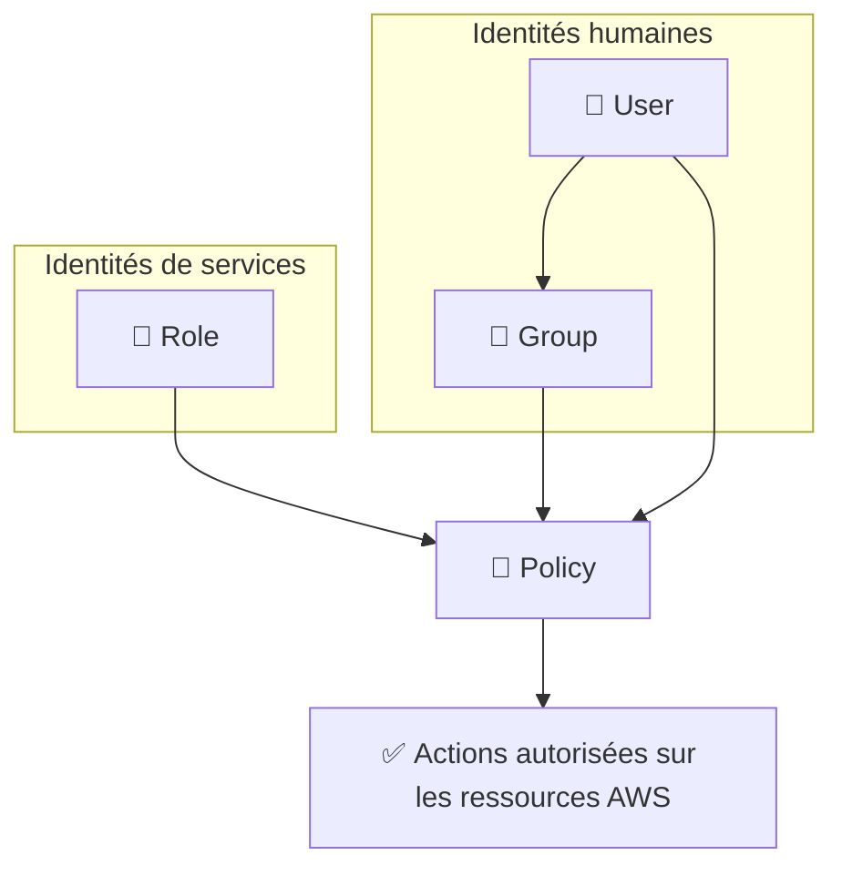

# IAM — Gestion des identités AWS

## Objectifs pédagogiques

À l'issue de ce module, tu seras capable de :

1. **Expliquer** le rôle d'IAM dans la chaîne de sécurité AWS et pourquoi il s'applique à chaque appel API
2. **Distinguer** user, group, role et policy selon leur usage réel et choisir le bon composant selon le contexte
3. **Lire et interpréter** une policy JSON pour en comprendre les effets réels sur les permissions
4. **Appliquer** le principe du moindre privilège lors de la création ou de la révision de permissions
5. **Diagnostiquer** une erreur `AccessDenied` et identifier sa cause dans la chaîne d'évaluation IAM

---

## Pourquoi IAM existe

Imagine une infrastructure AWS sans contrôle d'accès : chaque développeur, chaque script, chaque service peut lire, modifier ou supprimer n'importe quelle ressource. Un token qui fuite, une clé API exposée dans un dépôt GitHub public — et c'est l'ensemble du compte qui est compromis.

IAM (Identity and Access Management) répond à une question fondamentale : **qui a le droit de faire quoi, sur quelle ressource ?**

Chaque appel vers l'API AWS — qu'il vienne d'un humain connecté à la console, d'un script CLI (Command Line Interface) ou d'une Lambda — est intercepté par IAM avant d'être exécuté. IAM vérifie l'identité de l'appelant, consulte ses permissions, et répond par `Allow` ou `Deny`. C'est transparent pour l'utilisateur, mais systématique et sans exception.

C'est pour ça qu'IAM est souvent décrit comme le **socle de sécurité AWS** : tous les autres services s'appuient dessus.

<!-- snippet
id: aws_iam_definition
type: concept
tech: aws
level: beginner
importance: high
format: knowledge
tags: aws,iam,security
title: IAM — couche d'identité et d'autorisation AWS
content: IAM est la couche d'identité d'AWS : chaque appel API est signé par une entité (user, role, service) et IAM décide si l'action est autorisée avant qu'AWS l'exécute. Aucun appel ne contourne cette vérification.
description: Sans IAM correctement configuré, n'importe quelle ressource AWS est potentiellement accessible depuis le compte.
-->

---

## Les quatre composants d'IAM

IAM s'articule autour de quatre concepts. Les confondre est l'erreur la plus courante — prenons-les dans l'ordre logique.

| Composant | Ce que c'est | Usage typique |
|-----------|-------------|---------------|
| **User** | Identité permanente pour un humain | Admin, développeur, compte de service legacy |
| **Group** | Conteneur de users partageant des permissions | Équipe DevOps, équipe Data |
| **Role** | Identité temporaire assumée par un service ou un user | EC2 qui accède à S3, Lambda, accès cross-account |
| **Policy** | Document JSON qui définit les permissions | S3 read-only, accès RDS restreint par IP |

La logique d'assemblage est simple : les **policies** s'attachent aux **users**, **groups** ou **roles**. Un user rejoint un group et hérite de ses policies. Un service assume un role et obtient des credentials temporaires le temps de son exécution.



> **Un Role n'est pas un User.** Un rôle n'a pas de mot de passe, pas de clé API permanente. Il émet des credentials temporaires à chaque fois qu'il est assumé, avec une durée de vie de 15 minutes à 12 heures. C'est exactement ce qui le rend plus sûr qu'un utilisateur classique pour les services automatisés.

---

## Lire une policy IAM

Une policy, c'est du JSON avec une structure précise. Avant de savoir en écrire, il faut savoir en lire — parce que mal interpréter une policy en production, c'est soit trop de permissions accordées, soit un service cassé.

```json
{
  "Version": "2012-10-17",
  "Statement": [
    {
      "Effect": "Allow",
      "Action": [
        "s3:GetObject",
        "s3:ListBucket"
      ],
      "Resource": [
        "arn:aws:s3:::mon-bucket",
        "arn:aws:s3:::mon-bucket/*"
      ]
    }
  ]
}
```

Décortiquons les champs clés :

- **`Effect`** : `Allow` ou `Deny`. En cas de conflit, `Deny` l'emporte toujours, sans exception.
- **`Action`** : les opérations autorisées. `s3:GetObject` = lire un objet. `s3:*` = tout faire sur S3. Préférer toujours le premier format.
- **`Resource`** : sur quoi s'applique la règle. L'ARN (Amazon Resource Name) identifie la ressource de façon unique dans tout AWS.

💡 Remarque qu'il y a deux ARN dans `Resource` : `arn:aws:s3:::mon-bucket` pour autoriser `ListBucket` sur le bucket lui-même, et `arn:aws:s3:::mon-bucket/*` pour autoriser `GetObject` sur les objets qu'il contient. Oublier l'un des deux est une source classique d'erreur.

<!-- snippet
id: aws_iam_policy_structure
type: concept
tech: aws
level: beginner
importance: high
format: knowledge
tags: aws,iam,policy,json
title: Structure d'une policy IAM — Effect, Action, Resource
content: Une policy IAM contient des Statement avec trois champs clés : Effect (Allow/Deny), Action (liste des opérations API) et Resource (ARN des ressources ciblées). S3 nécessite deux ARN distincts : un pour le bucket, un pour ses objets (/*).
description: Lire une policy correctement implique de vérifier l'ARN Resource autant que les actions — une permission sur le mauvais périmètre est aussi problématique qu'une permission absente.
-->

<!-- snippet
id: aws_iam_policy_deny_priority
type: tip
tech: aws
level: beginner
importance: high
format: knowledge
tags: aws,iam,policy,security
title: Deny explicite — priorité absolue sur tous les Allow
content: En IAM, un Deny explicite dans n'importe quelle policy attachée à l'entité annule tous les Allow, quelle qu'en soit l'origine. Une SCP Organizations avec Deny peut bloquer même un AdministratorAccess.
description: Par défaut, toute action non explicitement autorisée est refusée (implicit deny). Un Deny explicite est encore plus fort et ne peut être contourné.
-->

---

## Commandes essentielles

La gestion IAM au quotidien passe beaucoup par la CLI. Voici les commandes que tu utiliseras réellement, dans l'ordre où tu en auras besoin.

**Inspecter les utilisateurs et leurs permissions**

```bash
# Lister tous les utilisateurs du compte
aws iam list-users

# Lister les rôles existants
aws iam list-roles

# Voir les policies attachées à un utilisateur spécifique
aws iam list-attached-user-policies --user-name <NOM_UTILISATEUR>
```

<!-- snippet
id: aws_iam_cli_list_users
type: command
tech: aws
level: beginner
importance: medium
format: knowledge
tags: aws,iam,cli
title: Lister les utilisateurs IAM du compte
command: aws iam list-users
description: Affiche tous les utilisateurs IAM du compte avec leur date de création et ARN. Point de départ pour tout audit d'accès.
-->

<!-- snippet
id: aws_iam_cli_list_policies
type: command
tech: aws
level: beginner
importance: medium
format: knowledge
tags: aws,iam,cli
title: Lister les policies attachées à un utilisateur
command: aws iam list-attached-user-policies --user-name <NOM_UTILISATEUR>
example: aws iam list-attached-user-policies --user-name alice
description: Affiche les policies managées attachées directement à l'utilisateur spécifié. Utiliser aussi list-user-policies pour les policies inline.
-->

**Simuler des permissions avant de les déployer**

```bash
aws iam simulate-principal-policy \
  --policy-source-arn <ARN_UTILISATEUR_OU_ROLE> \
  --action-names <ACTION_AWS>
```

Cette commande est la plus sous-utilisée de la liste, et pourtant c'est l'une des plus précieuses. Elle permet de savoir si une entité a le droit d'exécuter une action **sans rien exécuter réellement** — parfait pour valider une policy avant de la pousser en production, ou pour comprendre pourquoi un service retourne `AccessDenied`.

<!-- snippet
id: aws_iam_simulate_policy
type: command
tech: aws
level: beginner
importance: high
format: knowledge
tags: aws,iam,cli,security
title: Simuler l'effet d'une policy IAM sans l'exécuter
command: aws iam simulate-principal-policy --policy-source-arn <ARN_ENTITE> --action-names <ACTION_AWS>
example: aws iam simulate-principal-policy --policy-source-arn arn:aws:iam::123456789012:user/alice --action-names s3:GetObject
description: Teste si une entité IAM est autorisée à effectuer une action sans déclencher l'appel réel. Retourne allowed, implicitDeny ou explicitDeny.
-->

**Attacher une policy à un rôle**

```bash
aws iam attach-role-policy \
  --role-name <NOM_ROLE> \
  --policy-arn <ARN_POLICY>
```

<!-- snippet
id: aws_iam_attach_role_policy
type: command
tech: aws
level: beginner
importance: medium
format: knowledge
tags: aws,iam,role,cli
title: Attacher une policy managée à un rôle IAM
command: aws iam attach-role-policy --role-name <NOM_ROLE> --policy-arn <ARN_POLICY>
example: aws iam attach-role-policy --role-name ec2-app-role --policy-arn arn:aws:iam::aws:policy/AmazonS3ReadOnlyAccess
description: Associe une policy managée à un rôle IAM existant. La policy prend effet immédiatement pour toutes les entités qui assument ce rôle.
-->

---

## Comment IAM évalue une requête

Quand un appel API arrive, IAM suit une séquence déterministe — toujours dans le même ordre, sans exception :

1. **Deny explicite** → si une policy contient un `Deny` qui correspond à l'action demandée, c'est terminé : refusé, irrévocablement.
2. **Allow explicite** → si au moins une policy autorise l'action sur la ressource ciblée, elle est acceptée.
3. **Implicit deny** → si aucune policy n'autorise l'action, elle est refusée par défaut.

🧠 Ce que ça implique concrètement : une nouvelle entité IAM sans policy attachée ne peut **strictement rien faire**, pas même lire ses propres informations. Chaque permission doit être accordée explicitement. C'est l'inverse de nombreux systèmes où le compte admin peut tout faire sauf restriction explicite.

⚠️ **Piège classique** : avoir un `Allow` sur `s3:GetObject` mais oublier `s3:ListBucket`. L'utilisateur peut théoriquement lire un fichier s'il connaît son chemin exact, mais la console S3 affichera une erreur parce qu'elle tente de lister le bucket en premier. Ce n'est pas une erreur de droit de lecture — c'est une permission de listage manquante.

<!-- snippet
id: aws_iam_implicit_deny
type: concept
tech: aws
level: beginner
importance: high
format: knowledge
tags: aws,iam,policy,security
title: Implicit deny — tout ce qui n'est pas autorisé est refusé
content: IAM refuse par défaut toute action non explicitement autorisée. L'ordre d'évaluation est fixe : Deny explicite > Allow explicite > Implicit deny. Une nouvelle entité sans policy ne peut rien faire, même lire ses propres informations.
description: Connaître cet ordre d'évaluation permet de diagnostiquer la plupart des erreurs AccessDenied sans tâtonner.
-->

---

## Rôles vs credentials statiques

Les credentials statiques — access key ID + secret access key — sont générés une fois et valables jusqu'à révocation manuelle. C'est pratique. C'est aussi là que les incidents de sécurité commencent.

Ces clés finissent inévitablement quelque part où elles ne devraient pas être : dans un fichier `.env` commité par accident, dans des logs d'application, dans une image Docker publiée sur un registry public. Une recherche GitHub sur `aws_secret_access_key` retourne encore aujourd'hui des milliers de résultats actifs.

Un rôle IAM fonctionne différemment : les credentials sont générés dynamiquement à chaque fois que le rôle est assumé, ont une durée de vie configurée entre 15 minutes et 12 heures, et sont renouvelés automatiquement par le service. Si un token fuite, il expire de lui-même. L'impact est contenu dans le temps.

Pour une EC2, une Lambda ou un conteneur ECS, la règle est simple : **aucun credential dans le code, toujours un rôle**.

<!-- snippet
id: aws_iam_role_vs_static_credentials
type: concept
tech: aws
level: beginner
importance: high
format: knowledge
tags: aws,iam,role,security
title: Rôles IAM vs credentials statiques — pourquoi les rôles gagnent
content: Les credentials statiques (access key + secret) n'expirent jamais sauf révocation manuelle, et fuient dans les logs, le code ou les images Docker. Un rôle IAM génère des credentials temporaires (15min–12h) renouvelés automatiquement par le service qui l'assume. Un token volé expire seul.
description: Sur EC2, Lambda ou ECS, assigner un rôle au service élimine tout credential à gérer manuellement et réduit drastiquement la surface d'attaque.
-->

<!-- snippet
id: aws_iam_admin_warning
type: warning
tech: aws
level: beginner
importance: high
format: knowledge
tags: aws,iam,security
title: AdministratorAccess — ne jamais l'accorder par défaut
content: AdministratorAccess donne un accès total à tous les services AWS du compte, y compris la facturation, la suppression de ressources et la modification des policies IAM elles-mêmes. Un token volé avec ces droits compromet l'intégralité du compte. En entreprise, même les admins travaillent avec des droits limités et élèvent leurs privilèges ponctuellement via AssumeRole avec MFA obligatoire.
description: Partir du principe que personne n'a besoin de droits admin pour travailler au quotidien. L'élévation ponctuelle via AssumeRole est plus sûre et traçable.
-->

---

## Cas réel : sécurisation d'une chaîne de déploiement

**Contexte** : une startup SaaS de 15 personnes. Les développeurs déploient des APIs sur EC2 et partagent une paire de clés AWS dans un fichier `.env` d'équipe. Le secret access key est dans le repo Git depuis 8 mois — avec des droits `AdministratorAccess`.

**Ce que ça signifie concrètement** : si cette clé a fuité (elle a probablement déjà fuité), un attaquant peut créer des instances de minage, exfiltrer toute la base de données, générer des milliers d'euros de facture en quelques heures, et modifier les policies IAM pour maintenir son accès même après un changement de mot de passe.

**Ce qui a été mis en place en 48 heures** :

1. Révocation immédiate des clés existantes et audit des accès des 90 derniers jours via CloudTrail — pour savoir si quelqu'un avait déjà utilisé ces clés en dehors de l'équipe
2. Création d'un rôle `ec2-app-role` avec uniquement `s3:GetObject` sur le bucket de config et `ssm:GetParameter` pour les secrets applicatifs
3. Assignation du rôle directement aux instances EC2 — zéro credential dans le code, zéro fichier `.env` à gérer
4. Création de groupes IAM par équipe (`dev-readonly`, `devops-deploy`) avec permissions minimales par rôle métier
5. MFA obligatoire pour tous les comptes humains, enforced via une condition IAM dans une SCP Organizations

**Résultats mesurables trois semaines plus tard** :
- Un développeur a poussé un fichier `.env` sur GitHub par accident — le fichier ne contenait aucun credential, incident sans conséquence
- Chaque action est maintenant tracée par entité dans CloudTrail : fini le compte partagé impossible à auditer
- Surface d'attaque réduite : une instance EC2 compromise ne peut lire que sa propre configuration, pas se propager à tout le compte

---

## Bonnes pratiques

**Verrouiller le compte root dès la création du compte.** Le root est réservé aux opérations exceptionnelles : récupération de compte, modification de la facturation, suppression du compte. Crée un compte IAM admin le premier jour et ne retouche plus les credentials root.

**MFA sur tous les comptes humains, sans exception.** Un mot de passe seul ne suffit pas — les credential stuffing attacks sont automatisées et permanentes. Active le MFA sur le root, sur tous les comptes IAM avec accès console, et rends-le obligatoire via une condition `aws:MultiFactorAuthPresent` dans les policies critiques.

**Partir de zéro permission et ajouter uniquement ce qui manque.** `AmazonS3FullAccess` est rarement ce dont un service a besoin. `s3:GetObject` et `s3:ListBucket` sur un bucket précis couvrent 90 % des cas. La politique du moindre privilège n'est pas une contrainte — c'est ce qui limite les dégâts quand quelque chose est compromis.

<!-- snippet
id: aws_iam_least_privilege
type: concept
tech: aws
level: beginner
importance: high
format: knowledge
tags: aws,iam,security
title: Principe du moindre privilège — partir de zéro, ajouter le nécessaire
content: Une policy trop large reste silencieuse jusqu'au jour où un token est volé. Partir de zéro permission et ajouter uniquement ce qui est nécessaire — jamais l'inverse. AWS recommande de commencer par des actions spécifiques sur des ressources précises et d'élargir selon les besoins réels démontrés.
description: Le moindre privilège n'est pas une contrainte opérationnelle : c'est ce qui transforme une compromission en incident limité plutôt qu'en désastre.
-->

**Utiliser des rôles pour tous les services, sans exception.** Une Lambda, une EC2, un conteneur ECS n'ont pas besoin d'un utilisateur IAM avec des clés statiques. Un rôle est conçu exactement pour ça, est plus sûr, et simplifie la rotation des credentials.

**Auditer régulièrement les accès dormants.** IAM génère un rapport de credentials qui indique la dernière utilisation de chaque clé et chaque connexion. Une clé inactive depuis 90 jours est à révoquer — elle ne sera pas regrettée par son propriétaire, et elle réduit la surface d'attaque.

<!-- snippet
id: aws_iam_credential_report
type: command
tech: aws
level: beginner
importance: medium
format: knowledge
tags: aws,iam,security,audit
title: Générer et lire le rapport de credentials IAM
command: aws iam generate-credential-report && aws iam get-credential-report --query Content --output text | base64 -d
description: Génère puis décode le rapport CSV listant tous les utilisateurs, leurs clés d'accès et leur dernière date d'utilisation. Essentiel pour identifier et révoquer les accès dormants.
-->

**Versionner les policies custom avec Terraform ou CloudFormation.** Une policy JSON sans contexte dans un bucket quelconque est un risque opérationnel. Stocker les policies en IaC permet de tracer les changements, de les faire relire, et de les réappliquer en cas d'incident. Le module IaC du cours couvrira cela en détail.

---

## Résumé

IAM est le point de contrôle central de toute infrastructure AWS : aucun appel API ne passe sans lui. Les quatre composants — user, group, role, policy — couvrent la totalité des cas d'usage, des humains aux services automatisés. Le principe directeur est simple : refus par défaut, autorisation explicite et minimale. En pratique, ça se traduit par des rôles plutôt que des clés statiques, du MFA sur tous les comptes humains, et des policies JSON aussi précises que possible. La prochaine étape, c'est EC2 — et la première chose que tu configureras sur une instance, c'est précisément un rôle IAM.
