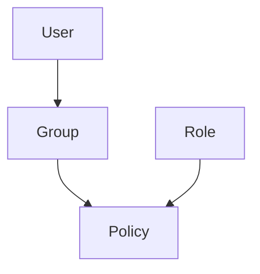

# IAM — Gestion des identités AWS

## Objectifs pédagogiques

- Comprendre le rôle de IAM dans AWS
- Distinguer user, group, role et policy
- Lire et comprendre une policy JSON
- Appliquer le principe du least privilege
- Diagnostiquer un problème de permissions

## Contexte et problématique

IAM existe pour répondre à un problème critique :

👉 Qui peut faire quoi dans ton infrastructure ?

Sans IAM :
- Accès total partout (catastrophique)
- Impossible de tracer les actions
- Failles de sécurité majeures

IAM est le socle de sécurité AWS.

## Architecture

| Composant | Rôle | Exemple |
|-----------|------|--------|
| User | Identité humaine | Admin, Dev |
| Group | Regroupe des users | DevOps team |
| Role | Identité temporaire | EC2 role |
| Policy | Règles d’accès | S3 read-only |



## Commandes essentielles

```bash
aws iam list-users
```
Liste les utilisateurs IAM.

```bash
aws iam list-roles
```
Liste les rôles IAM.

```bash
aws iam simulate-principal-policy --policy-source-arn <ARN>
```
Permet de tester une policy.

## Fonctionnement interne

IAM repose sur :

1. Authentification (qui es-tu)
2. Autorisation (que peux-tu faire)

🧠 Concept clé  
→ Une action AWS = vérification IAM systématique

💡 Astuce  
→ Toujours tester une policy avant prod

⚠️ Erreur fréquente  
→ Donner accès admin → risque sécurité énorme

## Cas réel en entreprise

Contexte :

Une équipe DevOps déploie des apps.

Solution :

- Créer un rôle EC2
- Attacher policy S3 read-only
- Supprimer accès root

Résultat :

- Sécurité renforcée
- Moins de risques

## Bonnes pratiques

- Activer MFA
- Ne jamais utiliser root
- Appliquer least privilege
- Utiliser des rôles plutôt que des users
- Auditer régulièrement les accès
- Versionner les policies

## Résumé

IAM contrôle l’accès à AWS.  
Users, roles et policies définissent les permissions.  
La sécurité repose sur une bonne gestion des identités.

---

## SNIPPETS DE RÉVISION

<!-- snippet
id: aws_iam_definition
type: concept
tech: aws
level: beginner
importance: high
format: knowledge
tags: aws,iam,security
title: IAM rôle principal
content: IAM est la couche d'identité d'AWS : chaque appel API est signé par une entité (user, role, service) et IAM décide si l'action est autorisée avant qu'AWS l'exécute.
description: Sans IAM correctement configuré, n'importe quelle ressource AWS est potentiellement accessible depuis le compte.
-->

<!-- snippet
id: aws_iam_least_privilege
type: concept
tech: aws
level: beginner
importance: high
format: knowledge
tags: aws,security,iam
title: Principe du least privilege
content: Une politique IAM trop large reste silencieuse jusqu'au jour où un token est volé. Partir de zéro permission et ajouter uniquement ce qui est nécessaire — jamais l'inverse.
description: AWS recommande de commencer avec AmazonReadOnlyAccess puis d'ajouter les droits d'écriture un à un selon les besoins réels.
-->

<!-- snippet
id: aws_iam_admin_warning
type: warning
tech: aws
level: beginner
importance: high
format: knowledge
tags: aws,security,error
title: Donner admin access
content: Donner des droits admin augmente le risque de compromission, utiliser des permissions minimales
description: Erreur critique en entreprise
-->

<!-- snippet
id: aws_iam_cli_list_users
type: command
tech: aws
level: beginner
importance: medium
format: knowledge
tags: aws,iam,cli
title: Lister les users IAM
command: aws iam list-users
description: Permet de voir tous les utilisateurs IAM configurés
-->

<!-- snippet
id: aws_iam_role_usage
type: concept
tech: aws
level: beginner
importance: medium
format: knowledge
tags: aws,iam,role
title: Utiliser les roles IAM
content: Les credentials statiques (access key + secret) ne expirent jamais et fuient dans les logs, le code ou les images Docker. Un role IAM génère des credentials temporaires (15min–1h) renouvelés automatiquement.
description: Sur EC2, Lambda ou ECS, assigner un role au service élimine tout credential à gérer manuellement.
-->
