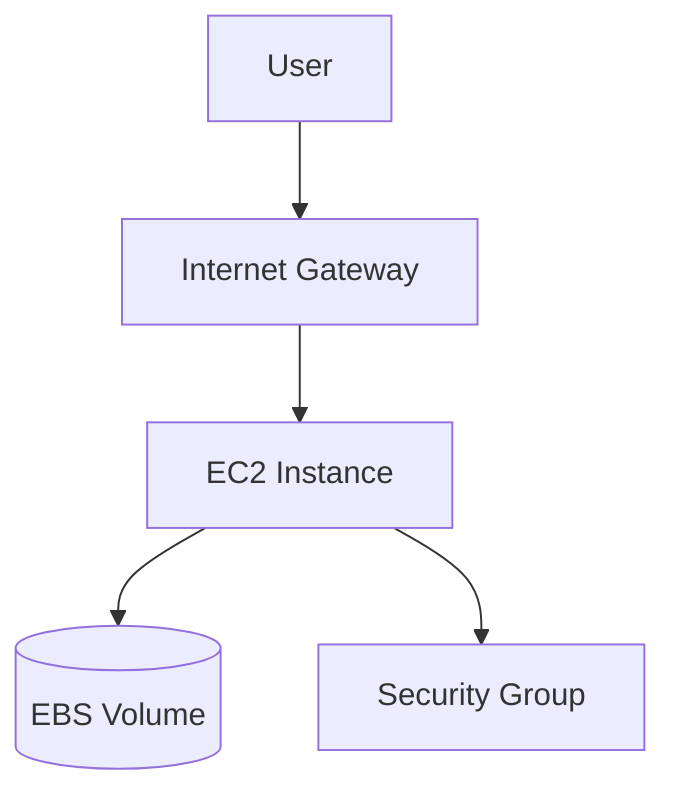

# EC2 — Compute AWS (instances, réseau, bootstrap)

## Objectifs pédagogiques

- Lancer et configurer une instance EC2 correctement
- Comprendre AMI, type d’instance, storage et réseau
- Sécuriser une instance avec Security Groups
- Utiliser User Data pour automatiser le bootstrap
- Diagnostiquer des problèmes d’accès (SSH/HTTP)

## Contexte et problématique

EC2 fournit des machines virtuelles à la demande.  
Problème résolu : exécuter des applications sans gérer du matériel physique, avec élasticité et facturation à l’usage.

Alternatives :
- PaaS (Elastic Beanstalk)
- Containers (ECS/EKS)
- Serverless (Lambda)

EC2 reste essentiel pour :
- workloads legacy
- contrôle fin OS/réseau
- customisation avancée

## Architecture

| Composant | Rôle | Exemple |
|-----------|------|---------|
| AMI | Image de base | Amazon Linux 2023 |
| Instance Type | CPU/RAM | t3.micro |
| EBS | Disque persistant | 20 GiB gp3 |
| Security Group | Firewall stateful | TCP 22, 80 |
| Key Pair | Auth SSH | rsa key |
| ENI | Interface réseau | eth0 |



## Commandes essentielles

```bash
aws ec2 describe-instances
```
Liste les instances EC2 et leurs états.

```bash
aws ec2 run-instances --image-id <AMI_ID> --instance-type <TYPE> --key-name <KEY>
```
Lance une instance avec AMI et type spécifiés.

```bash
aws ec2 terminate-instances --instance-ids <ID>
```
Supprime une instance (attention à la perte de données locales).

```bash
ssh -i <KEY>.pem ec2-user@<IP>
```
Connexion SSH (Amazon Linux).

## Fonctionnement interne

1. Choix AMI → image système
2. Allocation compute (CPU/RAM)
3. Attachement stockage (EBS)
4. Configuration réseau (subnet + IP)
5. Application règles SG

🧠 Concept clé  
→ EC2 = machine virtuelle isolée avec réseau virtuel

💡 Astuce  
→ Utiliser User Data pour automatiser :
```bash
#!/bin/bash
yum install -y nginx
systemctl start nginx
```

⚠️ Erreur fréquente  
→ Oublier d’ouvrir port 22 ou 80 → accès impossible  
Correction : vérifier Security Group

## Cas réel en entreprise

Contexte :

Déployer une API backend.

Étapes :

- EC2 dans subnet public
- SG autorise 80/443
- User Data installe Docker
- Déploiement app

Résultat :

- Mise en prod en minutes
- Base scalable

## Bonnes pratiques

- Ne jamais exposer SSH à 0.0.0.0/0
- Utiliser des rôles IAM au lieu de clés
- Séparer subnet public/privé
- Activer logs (CloudWatch)
- Sauvegarder via snapshots EBS
- Utiliser Auto Scaling en prod
- Monitorer CPU et réseau

## Résumé

EC2 permet de lancer des VM flexibles dans AWS.  
Le choix AMI/type/réseau est critique.  
La sécurité repose sur SG et IAM.  
User Data permet l’automatisation.  
C’est la base de nombreuses architectures AWS.

---

## SNIPPETS DE RÉVISION

<!-- snippet
id: aws_ec2_definition
type: concept
tech: aws
level: beginner
importance: high
format: knowledge
tags: aws,ec2,compute
title: EC2 définition
content: EC2 est un service AWS permettant de lancer des machines virtuelles à la demande
description: Base du compute AWS
-->

<!-- snippet
id: aws_ec2_security_group
type: concept
tech: aws
level: beginner
importance: high
format: knowledge
tags: aws,security,network
title: Security Group rôle
content: Un Security Group agit comme un firewall stateful contrôlant le trafic entrant et sortant d'une instance EC2
description: Élément critique de sécurité
-->

<!-- snippet
id: aws_ec2_open_port_warning
type: warning
tech: aws
level: beginner
importance: high
format: knowledge
tags: aws,security,error
title: Port ouvert 0.0.0.0
content: Ouvrir un port à 0.0.0.0/0 expose ton instance à Internet, restreindre aux IP nécessaires
description: Risque majeur de sécurité
-->

<!-- snippet
id: aws_ec2_launch_command
type: command
tech: aws
level: beginner
importance: medium
format: knowledge
tags: aws,ec2,cli
title: Lancer instance EC2
command: aws ec2 run-instances --image-id <AMI_ID> --instance-type <TYPE>
description: Permet de créer une instance EC2 via CLI
-->

<!-- snippet
id: aws_ec2_user_data_tip
type: tip
tech: aws
level: beginner
importance: medium
format: knowledge
tags: aws,automation,ec2
title: Utiliser user data
content: User Data permet d'exécuter automatiquement des scripts au démarrage de l'instance
description: Automatisation clé en DevOps
-->

<!-- snippet
id: aws_ec2_ssh_error
type: warning
tech: aws
level: beginner
importance: high
format: knowledge
tags: aws,ssh,debug
title: Impossible de se connecter en SSH
content: Symptôme connexion refusée, cause port 22 fermé ou clé incorrecte, correction vérifier SG et key pair
description: Problème fréquent EC2
-->
