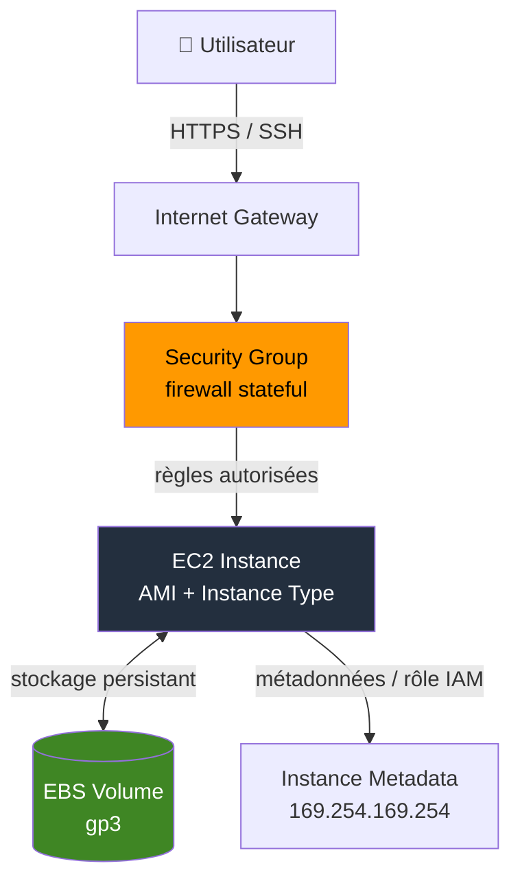

# EC2 — Compute AWS (instances, réseau, bootstrap)

## Objectifs pédagogiques

À la fin de ce module, tu seras capable de :

- Lancer et configurer une instance EC2 en choisissant la bonne AMI (Amazon Machine Image), le bon type et les bonnes options réseau
- Expliquer le rôle de chaque composant EC2 (AMI, EBS, Security Group, Key Pair, ENI)
- Sécuriser l'accès à une instance via les Security Groups et les rôles IAM
- Automatiser la configuration au démarrage avec User Data
- Diagnostiquer les problèmes d'accès SSH et HTTP les plus courants

---

## Pourquoi EC2 existe

Avant le cloud, déployer un serveur prenait des semaines : commande de matériel, installation, câblage, configuration réseau. Avec EC2, tu lances une machine virtuelle en moins de deux minutes, tu ne paies que ce que tu consommes, et tu la supprimes quand tu n'en as plus besoin.

C'est le service de compute fondamental d'AWS. Il ne résout pas tout — pour des applications simples, Elastic Beanstalk ou Lambda sont plus appropriés, et les containers (ECS (Elastic Container Service) / EKS (Elastic Kubernetes Service)) gèrent mieux les architectures microservices — mais EC2 reste incontournable dès que tu as besoin d'un contrôle fin sur le système d'exploitation, le réseau, ou les dépendances logicielles.

En résumé : EC2, c'est "loue une machine, configure-la comme tu veux, utilise-la aussi longtemps que tu veux."

---

## Anatomie d'une instance EC2

Une instance EC2 n'est pas un objet isolé — c'est l'assemblage de plusieurs composants qui travaillent ensemble. Comprendre le rôle de chacun évite la majorité des erreurs de débutant.

| Composant | Rôle | Exemple concret |
|-----------|------|-----------------|
| **AMI** | Image système de base (OS + logiciels pré-installés) | Amazon Linux 2023, Ubuntu 22.04 |
| **Instance Type** | Dimensionnement CPU / RAM / réseau | `t3.micro` (2 vCPU, 1 GiB) |
| **EBS** | Volume de stockage persistant attaché | 20 GiB gp3 (survit au redémarrage) |
| **Security Group** | Firewall stateful — règles entrée/sortie | Autoriser TCP 22 et 80 |
| **Key Pair** | Authentification SSH par clé publique/privée | `ma-cle.pem` |
| **ENI** | Interface réseau virtuelle (adresse IP) | `eth0`, IP privée + IP publique optionnelle |

Le schéma ci-dessous montre comment ces composants s'articulent : l'utilisateur arrive par Internet, passe par l'Internet Gateway du VPC, traverse le Security Group avant d'atteindre l'instance, laquelle accède à son volume EBS (Elastic Block Store) séparément.



💡 L'adresse `169.254.169.254` est le service de métadonnées interne à EC2. C'est par là que l'instance récupère son rôle IAM, son IP, son hostname — sans passer par Internet.

> **SAA-C03** — Options d'achat EC2 :
> - "stable workload" → **Reserved** (~72 %). "interruptible / fault-tolerant" → **Spot** (~90 %). "mission-critical" → **jamais Spot**.
> - "HPC / tightly-coupled" → **Cluster Placement Group** (1 AZ). "Hadoop / Kafka" → **Partition**. "isolated critical instances" → **Spread** (max 7/AZ).
> - Hibernation = RAM sauvée sur EBS → doit être activé **à la création**. Stop/start = Instance Store **perdu**, EBS **conservé**, EIP **reste** (VPC).

---

## Lancer une instance : les commandes essentielles

Voici le flux logique pour créer, accéder et gérer une instance via la CLI. L'ordre compte : on crée d'abord, on vérifie, on se connecte, on nettoie.

**Lister les instances existantes et leurs états :**

```bash
aws ec2 describe-instances \
  --query "Reservations[*].Instances[*].{ID:InstanceId,State:State.Name,IP:PublicIpAddress}" \
  --output table
```

**Lancer une nouvelle instance :**

```bash
aws ec2 run-instances \
  --image-id <AMI_ID> \
  --instance-type <INSTANCE_TYPE> \
  --key-name <KEY_PAIR_NAME> \
  --security-group-ids <SG_ID> \
  --subnet-id <SUBNET_ID> \
  --tag-specifications 'ResourceType=instance,Tags=[{Key=Name,Value=<NOM>}]'
```

Exemple réel :

```bash
aws ec2 run-instances \
  --image-id ami-0c02fb55956c7d316 \
  --instance-type t3.micro \
  --key-name ma-cle-prod \
  --security-group-ids sg-0123456789abcdef0 \
  --subnet-id subnet-0abc123def456789 \
  --tag-specifications 'ResourceType=instance,Tags=[{Key=Name,Value=api-backend}]'
```

**Se connecter en SSH (Secure Shell) :**

```bash
chmod 400 <KEY_FILE>.pem
ssh -i <KEY_FILE>.pem ec2-user@<PUBLIC_IP>
```

⚠️ Le `chmod 400` est obligatoire. SSH refuse les clés avec des permissions trop ouvertes (`UNPROTECTED PRIVATE KEY FILE`). L'utilisateur par défaut dépend de l'AMI : `ec2-user` sur Amazon Linux, `ubuntu` sur Ubuntu, `admin` sur Debian.

**Arrêter vs supprimer :**

```bash
# Arrêt (facturation compute stoppée, EBS conservé)
aws ec2 stop-instances --instance-ids <INSTANCE_ID>

# Suppression définitive (données locales perdues)
aws ec2 terminate-instances --instance-ids <INSTANCE_ID>
```

🧠 `stop` ≠ `terminate`. Une instance stoppée peut redémarrer, son EBS est conservé. Une instance terminée est détruite — et son volume EBS root l'est aussi par défaut, sauf si tu as désactivé `DeleteOnTermination`.

---

## Ce qui se passe réellement au lancement

Quand tu exécutes `run-instances`, AWS orchestre six étapes dans cet ordre :

**1. Clonage de l'AMI** — AWS copie l'image système sur un hyperviseur de la région. Pense à booter un OS depuis une snapshot figée : l'instance hérite exactement de l'état capturé dans l'AMI.

**2. Allocation du compute** — Le type d'instance détermine les ressources allouées sur l'hôte physique. `t3.micro` = 2 vCPU burstables + 1 GiB RAM sur un serveur mutualisé avec d'autres clients AWS, complètement isolés au niveau hyperviseur.

**3. Attachement EBS** — Le volume de stockage est créé et monté via le réseau interne AWS. Pas de câble SATA — c'est du réseau hautes performances déguisé en disque local. C'est pourquoi EBS survit à la suppression de l'instance si `DeleteOnTermination=false`.

**4. Configuration réseau** — L'instance reçoit une ENI avec une IP privée dans ton subnet. Si le subnet est public et que tu actives l'IP publique, une IP publique est assignée dynamiquement via l'Internet Gateway.

**5. Application du Security Group** — Les règles du SG sont appliquées au niveau de l'hyperviseur, avant même que le trafic n'atteigne l'instance. Ce n'est pas un firewall logiciel dans l'OS — c'est une couche externe, indépendante d'`iptables` ou `firewalld`.

**6. Exécution de User Data** — Si tu as fourni un script, il s'exécute en root lors du premier démarrage, avant que l'instance soit accessible en SSH.

### User Data : le bootstrap automatique

C'est le mécanisme le plus utile d'EC2 pour éviter de se connecter manuellement juste après le lancement. Exemple concret — installer Docker et démarrer un conteneur applicatif :

```bash
#!/bin/bash
set -e

# Mise à jour et installation Docker
yum update -y
yum install -y docker
systemctl enable docker
systemctl start docker

# Ajout de l'utilisateur au groupe docker
usermod -aG docker ec2-user

# Lancement d'un conteneur applicatif
docker run -d -p 80:8080 --name api mon-registre/api:latest
```

⚠️ User Data s'exécute **une seule fois**, au premier démarrage. Si tu veux le rejouer, tu dois l'activer manuellement via les options d'instance. Pour déboguer un script qui ne s'est pas exécuté comme prévu, le fichier de référence est `/var/log/cloud-init-output.log` — il capture stdout et stderr de l'exécution complète.

---

## Cas réel : une API en production en 10 minutes

**Contexte :** Une startup veut mettre en production une API Node.js. Pas de Kubernetes, pas encore de pipeline CI/CD. Objectif : avoir quelque chose de fonctionnel et accessible aujourd'hui.

Une instance `t3.small` est lancée dans un subnet public avec un Security Group n'autorisant que le port 443 (HTTPS) et le port 22 depuis une IP de bastion spécifique — pas depuis `0.0.0.0/0`. User Data prend en charge l'intégralité de la configuration :

```bash
#!/bin/bash
set -e

yum update -y
curl -fsSL https://rpm.nodesource.com/setup_18.x | bash -
yum install -y nodejs git

# PM2 pour maintenir le processus actif après redémarrage
npm install -g pm2

# Clonage et démarrage
cd /home/ec2-user
git clone https://git-codecommit.eu-west-1.amazonaws.com/v1/repos/api-prod app
cd app
npm install --production
pm2 start src/index.js --name api
pm2 startup systemd -u ec2-user
pm2 save
```

Un rôle IAM est attaché à l'instance pour lui permettre de lire les secrets dans Secrets Manager — aucune clé AWS codée en dur, aucun fichier `.env` avec des credentials.

**Résultat :** API accessible en HTTPS en moins de 10 minutes depuis le premier `run-instances`. Zéro connexion SSH pour le déploiement initial. En cas d'incident, les logs sont consultables depuis CloudWatch Logs grâce à l'agent installé par ce même User Data — sans avoir à se connecter à la machine.

Ce scénario illustre concrètement pourquoi User Data et les rôles IAM sont les deux piliers de l'automatisation EC2 : l'un configure la machine, l'autre lui donne les droits nécessaires — sans jamais manipuler de secret manuellement.

---

## EC2 Hibernate — Conserver l'état mémoire entre les arrêts

Quand tu fais un `stop` classique sur une instance EC2, le contenu de la RAM est perdu. Au redémarrage, l'OS reboot de zéro, les processus doivent se relancer, les caches se reconstruire. Pour certaines applications, ce cold start peut prendre plusieurs minutes — voire plus si l'initialisation implique le chargement de gros modèles en mémoire ou la reconstruction d'index.

**Hibernate** résout ce problème : au lieu de simplement couper le compute, AWS dumpe l'intégralité de la RAM sur le volume EBS root, puis stoppe l'instance. Au redémarrage, le contenu de la RAM est restauré depuis le disque, les processus reprennent exactement là où ils en étaient — PID identiques, connexions réseau à reconstruire, mais état applicatif intact.

🧠 Concrètement, l'hibernation fonctionne comme la mise en veille prolongée d'un laptop : le système écrit la mémoire sur disque, s'éteint, puis restaure tout au réveil. La différence avec un simple `stop` est fondamentale — `stop` perd la RAM, `hibernate` la préserve.

Le flux technique est le suivant :

1. Tu déclenches l'hibernation (`aws ec2 stop-instances --hibernate`)
2. L'OS reçoit le signal et dumpe la RAM sur le volume EBS root
3. Le volume EBS root **doit être chiffré** — c'est une obligation, car la RAM peut contenir des secrets, des tokens, des données sensibles en clair
4. L'instance passe en état `stopped` (facturation compute suspendue, EBS toujours facturé)
5. Au `start`, AWS restaure la RAM depuis le disque, les processus reprennent leur exécution

⚠️ L'hibernation a des contraintes strictes à connaître :

- Le volume EBS root **doit être chiffré** — pas de négociation possible, l'hibernation échoue sinon
- La RAM de l'instance doit être **inférieure à 150 Go**
- Tous les types d'instances ne sont pas compatibles (vérifie la documentation AWS pour ta famille d'instances)
- La durée maximale d'hibernation est de **60 jours** — au-delà, AWS ne garantit plus la restauration
- L'hibernation doit être activée **au lancement** de l'instance, tu ne peux pas l'activer après coup

**Cas d'usage typiques :**

- **Applications avec un bootstrap lourd** — un serveur Java qui met 5 minutes à charger ses dépendances et réchauffer ses caches. Avec hibernate, tu éteins le soir, tu rallumes le matin, et l'application est opérationnelle en quelques secondes au lieu de 5 minutes.
- **Environnements de développement** — tu travailles sur un projet avec un état complexe en mémoire (modèle ML chargé, environnement configuré). Tu hibernes en fin de journée et tu retrouves tout intact le lendemain.
- **Économie de coûts avec préservation d'état** — tu ne paies pas le compute pendant l'hibernation, mais tu ne perds pas le temps d'initialisation au redémarrage.

---

## Bonnes pratiques

**Ne jamais ouvrir SSH à `0.0.0.0/0`**
C'est la règle numéro un. SSH exposé à Internet, c'est des milliers de tentatives de brute force par jour dès les premières minutes. Autorise uniquement ton IP de bastion, ton CIDR VPN, ou utilise AWS Systems Manager Session Manager pour te passer de SSH complètement.

**Rôles IAM plutôt que clés d'accès**
Une instance EC2 peut avoir un rôle IAM attaché. Ce rôle lui donne des permissions AWS sans jamais stocker de clé `AWS_ACCESS_KEY_ID` sur le disque. Les credentials sont récupérés dynamiquement via `169.254.169.254` et renouvelés automatiquement. Plus sûr, plus simple à révoquer qu'une clé statique.

**Séparer subnet public et subnet privé**
Les instances qui n'ont pas besoin d'être directement accessibles depuis Internet — bases de données, workers, backends — doivent être dans des subnets privés. Seuls les load balancers ou bastions vont en subnet public. Ce point sera approfondi dans le module VPC.

**Toujours nommer et tagger ses ressources**
`aws ec2 describe-instances` devient illisible sans tags dès que l'infrastructure dépasse cinq instances. Minimum requis : `Name`, `Environment` (dev/staging/prod), `Owner`. Les tags servent aussi au suivi des coûts dans AWS Cost Explorer.

**Activer CloudWatch Logs dès le départ**
User Data est le bon moment pour installer l'agent CloudWatch. Sans ça, accéder aux logs en production signifie se connecter en SSH à chaque incident — c'est du temps perdu et un vecteur de risque supplémentaire.

**Snapshots EBS pour les données critiques**
EBS est persistant mais pas sauvegardé automatiquement. Configure AWS Backup ou des snapshots réguliers pour tout volume qui contient des données irremplaçables. Un volume EBS sans snapshot, c'est une donnée sans filet.

**Utiliser les types d'instances récents**
`t3` plutôt que `t2`, `m6i` plutôt que `m5`. Les générations récentes offrent de meilleures performances au même prix, voire moins cher. Vérifie la [page de tarification EC2](https://aws.amazon.com/ec2/pricing/) avant de choisir.

---

## Résumé

EC2 est le service de machines virtuelles d'AWS : tu choisis une image (AMI), un dimensionnement (instance type), tu attaches un disque (EBS), tu définis tes règles réseau (Security Group) et tu démarres. Le Security Group agit au niveau de l'hyperviseur — c'est le premier mur de défense, indépendant de tout firewall OS. User Data automatise entièrement la configuration au premier boot. Les erreurs les plus courantes se résument à deux choses : un port fermé dans le Security Group, ou une clé SSH mal configurée. Le module suivant couvre le stockage AWS — S3, EBS et EFS — et tu verras comment EBS s'intègre dans des architectures de données plus complexes.

---

<!-- snippet
id: aws_ec2_definition
type: concept
tech: aws
level: beginner
importance: high
format: knowledge
tags: aws,ec2,compute
title: EC2 — machine virtuelle à la demande
content: EC2 (Elastic Compute Cloud) permet de lancer des machines virtuelles configurables sur AWS. Tu choisis l'OS (AMI), les ressources (instance type), le réseau (subnet, SG) et tu paies à l'usage. L'instance est isolée au niveau hyperviseur et peut être démarrée, stoppée ou détruite à tout moment.
description: Service de compute fondamental d'AWS — base de la majorité des architectures cloud
-->

<!-- snippet
id: aws_ec2_run_instances
type: command
tech: aws
level: beginner
importance: high
format: knowledge
tags: aws,ec2,cli
title: Lancer une instance EC2 via CLI
context: Nécessite un AMI ID valide pour la région cible, un Security Group et un subnet existants
command: aws ec2 run-instances --image-id <AMI_ID> --instance-type <INSTANCE_TYPE> --key-name <KEY_PAIR_NAME> --security-group-ids <SG_ID> --subnet-id <SUBNET_ID>
example: aws ec2 run-instances --image-id ami-0c02fb55956c7d316 --instance-type t3.micro --key-name ma-cle --security-group-ids sg-0123456789abcdef0 --subnet-id subnet-0abc123def456789
description: Crée et démarre une instance EC2 avec les paramètres réseau et sécurité spécifiés
-->

<!-- snippet
id: aws_ec2_describe_instances
type: command
tech: aws
level: beginner
importance: medium
format: knowledge
tags: aws,ec2,cli
title: Lister les instances EC2 et leurs états
context: Utile pour récupérer l'IP publique ou vérifier l'état d'une instance après lancement
command: aws ec2 describe-instances --query "Reservations[*].Instances[*].{ID:InstanceId,State:State.Name,IP:PublicIpAddress}" --output table
example: aws ec2 describe-instances --query "Reservations[*].Instances[*].{ID:InstanceId,State:State.Name,IP:PublicIpAddress}" --output table
description: Affiche l'ID, l'état et l'IP publique de toutes les instances EC2 du compte dans la région courante
-->

<!-- snippet
id: aws_ec2_ssh_connect
type: command
tech: aws
level: beginner
importance: high
format: knowledge
tags: aws,ec2,ssh
title: Connexion SSH à une instance EC2
context: La clé .pem doit avoir les permissions 400, le port 22 doit être ouvert dans le Security Group
command: ssh -i <KEY_FILE>.pem ec2-user@<PUBLIC_IP>
example: ssh -i ma-cle.pem ec2-user@54.123.45.67
description: Connexion SSH standard pour Amazon Linux — utiliser ubuntu@ pour Ubuntu, admin@ pour Debian
-->

<!-- snippet
id: aws_ec2_security_group_stateful
type: concept
tech: aws
level: beginner
importance: high
format: knowledge
tags: aws,security,network,ec2
title: Security Group — firewall stateful externe à l'instance
content: Un Security Group est appliqué au niveau de l'hyperviseur AWS, avant que le trafic n'atteigne l'OS. "Stateful" signifie que si une connexion entrante est autorisée, la réponse sortante l'est automatiquement — pas besoin de règle de retour explicite. Par défaut : tout le trafic entrant est bloqué, tout le trafic sortant est autorisé.
description: Premier mur de défense d'une instance EC2 — indépendant du firewall OS (iptables/firewalld)
-->

<!-- snippet
id: aws_ec2_user_data_bootstrap
type: tip
tech: aws
level: beginner
importance: high
format: knowledge
tags: aws,ec2,automation,bootstrap
title: User Data — automatiser la configuration au premier boot
content: User Data est un script shell exécuté en root lors du premier démarrage de l'instance, avant qu'elle soit accessible. Idéal pour installer des packages, configurer des services, cloner un repo. S'exécute une seule fois. Taille max : 16 Ko. Pour déboguer : consulter /var/log/cloud-init-output.log sur l'instance.
description: Évite toute connexion SSH manuelle post-lancement — la meilleure pratique pour l'automatisation EC2
-->

<!-- snippet
id: aws_ec2_ssh_port_closed_warning
type: warning
tech: aws
level: beginner
importance: high
format: knowledge
tags: aws,ec2,ssh,debug,security-group
title: SSH impossible — causes fréquentes à vérifier en priorité
content: Si la connexion SSH timeout ou est refusée, vérifier dans cet ordre : (1) règle entrante TCP 22 absente du Security Group — vérifier avec aws ec2 describe-security-groups --group-ids <SG_ID> ; (2) permissions de la clé .pem trop ouvertes — corriger avec chmod 400 <KEY_FILE>.pem ; (3) mauvais utilisateur SSH selon l'AMI (ec2-user, ubuntu, admin).
description: Causes les plus fréquentes d'échec SSH sur EC2 — SG, permissions de clé et utilisateur AMI
-->

<!-- snippet
id: aws_ec2_ssh_open_internet_warning
type: warning
tech: aws
level: beginner
importance: high
format: knowledge
tags: aws,ec2,security,ssh,best-practice
title: Ne jamais ouvrir SSH à 0.0.0.0/0
content: Autoriser le port 22 depuis toutes les adresses IP (0.0.0.0/0) expose l'instance à des milliers de tentatives de brute force dès les premières minutes. Restreindre à l'IP du bastion, au CIDR du VPN, ou désactiver SSH complètement au profit d'AWS Systems Manager Session Manager qui ne nécessite aucune règle entrante.
description: Risque de sécurité critique — l'une des erreurs de configuration EC2 les plus répandues
-->

<!-- snippet
id: aws_ec2_iam_role_vs_keys
type: tip
tech: aws
level: beginner
importance: high
format: knowledge
tags: aws,ec2,iam,security,best-practice
title: Rôle IAM sur l'instance plutôt que clés d'accès
content: Attacher un rôle IAM à une instance EC2 lui permet d'appeler des services AWS (S3, Secrets Manager, CloudWatch...) sans stocker de clé AWS_ACCESS_KEY_ID sur le disque. Les credentials sont récupérés dynamiquement via le service de métadonnées (169.254.169.254) et renouvelés automatiquement. C'est plus sûr et plus simple à révoquer qu'une clé statique.
description: Bonne pratique fondamentale — ne jamais hardcoder de clés AWS dans une instance EC2
-->

<!-- snippet
id: aws_ec2_stop_vs_terminate
type: concept
tech: aws
level: beginner
importance: medium
format: knowledge
tags: aws,ec2,lifecycle
title: Stop vs Terminate — différence critique
content: Stop arrête l'instance (facturation compute suspendue) mais conserve le volume EBS — l'instance peut redémarrer. Terminate détruit l'instance définitivement. Par défaut, le volume EBS root est aussi supprimé (option DeleteOnTermination=true). Les données stockées uniquement en mémoire ou sur un volume Instance Store sont perdues dans les deux cas.
description: Erreur fréquente — confondre stop et terminate peut entraîner une perte de données irréversible
-->

<!-- snippet
id: aws_ec2_tagging_best_practice
type: tip
tech: aws
level: beginner
importance: medium
format: knowledge
tags: aws,ec2,tagging,governance
title: Toujours tagger ses instances EC2
content: Sans tags, aws ec2 describe-instances renvoie une liste illisible dès que l'infrastructure grandit. Tags recommandés au minimum : Name (identifiant humain), Environment (dev/staging/prod), Owner (équipe ou personne responsable). Les tags sont aussi utilisés pour la facturation AWS Cost Explorer et les politiques IAM basées sur les ressources.
description: Bonne pratique de gouvernance — indispensable pour la lisibilité et le suivi des coûts
-->

<!-- snippet
id: aws_ec2_hibernate
type: concept
tech: aws
level: beginner
importance: medium
format: knowledge
tags: aws,ec2,hibernate,lifecycle
title: EC2 Hibernate — sauvegarder la RAM entre les arrêts
content: Hibernate dumpe le contenu de la RAM sur le volume EBS root chiffré, puis stoppe l'instance. Au redémarrage, la RAM est restaurée et les processus reprennent là où ils en étaient. Contraintes : EBS root chiffré obligatoire, RAM < 150 Go, durée max 60 jours, doit être activé au lancement. Différence clé avec Stop : stop perd la RAM, hibernate la préserve.
description: Permet d'éviter les cold starts longs en conservant l'état mémoire — utile pour les applications avec un bootstrap lourd
-->
