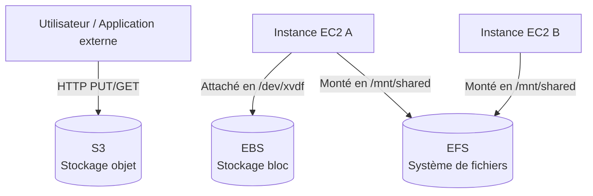

# Stockage AWS — S3 / EBS / EFS

## Objectifs pédagogiques

À l'issue de ce module, tu seras capable de :

- Distinguer S3, EBS et EFS et choisir le bon service selon le cas d'usage
- Créer et sécuriser un bucket S3 via la CLI
- Configurer des lifecycle rules pour réduire les coûts de stockage
- Attacher et gérer un volume EBS sur une instance EC2
- Identifier et corriger les erreurs d'accès et de configuration les plus fréquentes

---

## Pourquoi le stockage est-il si difficile à bien choisir ?

Sur un serveur classique, la question du stockage ne se pose presque pas : il y a un disque, les fichiers vont dessus. Sur AWS, cette simplicité disparaît — et c'est voulu. Les besoins sont trop hétérogènes pour qu'une seule solution soit optimale partout.

Considère ces trois situations :

- Un service backend génère 50 000 images par jour et doit les servir à des utilisateurs dans le monde entier
- Une base de données PostgreSQL a besoin d'un disque rapide avec des lectures/écritures à faible latence
- Dix instances EC2 doivent accéder au même répertoire de configuration en temps réel

Ce ne sont pas trois variantes du même problème — ce sont trois problèmes fondamentalement différents. AWS y répond avec trois services distincts : **S3** (Simple Storage Service), **EBS** et **EFS**.

Le mauvais choix coûte cher : en performance d'abord, en argent ensuite. Ce module t'explique comment trancher.

---

## Les trois paradigmes de stockage AWS

| Service | Paradigme | Cas d'usage typique | Mode d'accès |
|---------|-----------|---------------------|--------------|
| **S3** | Stockage objet | Fichiers, backups, assets statiques, data lake | API HTTP/HTTPS |
| **EBS** | Stockage bloc | Disque système EC2, base de données | Attaché à une instance |
| **EFS** | Système de fichiers réseau | Répertoire partagé entre plusieurs instances | NFS (Network File System) |

La distinction clé à retenir : **S3 n'est pas un disque**. On n'y monte pas un répertoire, on y envoie et récupère des objets via une API. EBS se comporte exactement comme un disque SSD vu de l'OS. EFS se situe entre les deux — il ressemble à un répertoire local mais est accessible depuis n'importe quelle instance dans le même VPC.



> EBS est exclusif à une instance à la fois (mode standard). EFS peut être monté simultanément sur des dizaines d'instances. S3 ne se monte pas — il se requête via API.

> **SAA-C03** — Si la question mentionne…
> - "shared storage / stockage partagé" + "Linux" + "NFS" + "multiple instances" → **EFS**
> - "shared storage / stockage partagé" + "Windows" + "SMB" + "Active Directory" → **FSx for Windows File Server**
> - "block storage / stockage bloc" + "single instance / une seule instance" → **EBS**
> - "block storage" + "Windows" + "Multi-AZ" + "iSCSI" → **FSx for NetApp ONTAP**
> - "object storage / stockage objet" + "durability / durabilité" + "unlimited / illimité" → **S3**
> - "analyze data in S3 with SQL / analyser des données dans S3 avec SQL" → **Athena** (pas RDS ni Redshift)
> - ⛔ EBS ne peut **jamais** être partagé entre instances (sauf io1/io2 Multi-Attach sur Nitro, cas rare)
> - ⛔ EFS ne supporte **jamais** Windows — si la question mentionne Windows → FSx
> - ⛔ S3 n'est **pas** un système de fichiers — si la question mentionne "mount / monter" + "file system" → EFS ou FSx

---

## S3 — Stockage objet en détail

### Ce que c'est vraiment

Un **bucket** est le conteneur racine. Chaque objet (fichier) est identifié par une **clé** — son chemin logique — et stocké avec ses métadonnées. Il n'existe pas de hiérarchie de répertoires au sens strict : `/images/2024/photo.jpg` est une clé, pas un chemin dans un arbre de fichiers.

La durabilité annoncée par AWS est de **99,999999999% (11 neuf)**. Concrètement : AWS réplique chaque objet sur au minimum trois zones de disponibilité. Perdre un objet sur S3 est un événement quasi-impossible dans des conditions normales.

### Créer et interagir avec un bucket

Les opérations quotidiennes sur S3 se font presque toutes via la CLI. Dans l'ordre logique d'utilisation :

```bash
# Créer un bucket dans une région
aws s3 mb s3://<BUCKET_NAME> --region <REGION>
```

```bash
# Lister les buckets du compte
aws s3 ls
```

```bash
# Envoyer un fichier
aws s3 cp <LOCAL_FILE> s3://<BUCKET_NAME>/<PREFIX>/
```

```bash
# Synchroniser un répertoire local (ne transfère que les modifications)
aws s3 sync <LOCAL_DIR> s3://<BUCKET_NAME>/<PREFIX>/
```

```bash
# Supprimer un objet
aws s3 rm s3://<BUCKET_NAME>/<OBJECT_KEY>
```

La commande `sync` est particulièrement utile en production : elle ne transfère que les fichiers modifiés ou absents dans la destination, ce qui évite de ré-uploader tout un répertoire à chaque déploiement.

### Classes de stockage et impact coût

C'est ici que beaucoup d'équipes laissent de l'argent sur la table. Par défaut, tout objet uploadé atterrit en classe **S3 Standard** — la plus coûteuse. Sans lifecycle rule configurée, les logs d'il y a six mois coûtent autant que les données actives du jour.

| Classe | Usage | Coût relatif |
|--------|-------|-------------|
| S3 Standard | Données fréquemment accédées | ████████ |
| S3 Standard-IA | Accès rare, récupération rapide requise | ████░░░░ |
| S3 Glacier Instant Retrieval | Archives, accès quelques fois par an | ██░░░░░░ |
| S3 Glacier Deep Archive | Archives longue durée, récupération en heures | █░░░░░░░ |

Une **lifecycle rule** automatise les transitions entre classes. Exemple concret pour un bucket de logs :

```json
{
  "Rules": [
    {
      "ID": "archiver-logs",
      "Status": "Enabled",
      "Filter": { "Prefix": "logs/" },
      "Transitions": [
        { "Days": 30, "StorageClass": "STANDARD_IA" },
        { "Days": 90, "StorageClass": "GLACIER" }
      ],
      "Expiration": { "Days": 365 }
    }
  ]
}
```

Ce fichier dit : après 30 jours, passer en Standard-IA. Après 90 jours, Glacier. Après 1 an, supprimer automatiquement. Le gain sur un bucket de logs actif est typiquement de **60 à 75% sur la facture stockage** — pour cinq minutes de configuration.

> **SAA-C03** — Si la question mentionne…
> - "frequently accessed / fréquemment accédé" → **S3 Standard**
> - "infrequently accessed / rarement accédé" + "rapid retrieval / récupération rapide" → **S3 Standard-IA**
> - "unpredictable access patterns / accès imprévisibles" → **S3 Intelligent-Tiering**
> - "archive" + "retrieval in milliseconds / récupération en millisecondes" → **S3 Glacier Instant Retrieval**
> - "archive" + "retrieval in minutes to hours / récupération en minutes ou heures" → **S3 Glacier Flexible Retrieval**
> - "long-term archive / archivage long terme" + "retrieval in hours / récupération en heures (12-48h)" → **S3 Glacier Deep Archive**
> - "automatically move between tiers / transition automatique" + "cost optimization / optimisation des coûts" → **S3 Intelligent-Tiering** ou **Lifecycle Policy**
> - ⛔ "high availability / haute disponibilité" ou "durability / durabilité" → **jamais** S3 One Zone-IA (une seule AZ)
> - ⛔ "rapidly changing data / données changeant rapidement" → **jamais** S3 (pas de file locking) → préférer **EFS** ou **EBS**

<!-- snippet
id: aws_s3_definition
type: concept
tech: aws
level: beginner
importance: high
format: knowledge
tags: aws,s3,storage
title: S3 — stockage objet distribué
content: S3 stocke des objets (fichiers + métadonnées) dans des buckets, accessibles via API HTTP. Il ne s'agit pas d'un disque : pas de montage, pas de système de fichiers. Durabilité de 11 neuf, réplication multi-AZ automatique.
description: S3 est le service de stockage objet AWS, accessible par API, avec une durabilité de 99,999999999%.
-->

<!-- snippet
id: aws_s3_create_bucket
type: command
tech: aws
level: beginner
importance: high
format: knowledge
tags: aws,s3,cli
title: Créer un bucket S3
command: aws s3 mb s3://<BUCKET_NAME> --region <REGION>
example: aws s3 mb s3://mon-app-prod-assets --region eu-west-1
description: Crée un bucket S3 dans la région spécifiée. Le nom doit être globalement unique sur tout AWS.
-->

<!-- snippet
id: aws_s3_sync_command
type: command
tech: aws
level: beginner
importance: high
format: knowledge
tags: aws,s3,cli,deploy
title: Synchroniser un répertoire local vers S3
context: Utile pour les déploiements d'assets statiques — ne transfère que les fichiers nouveaux ou modifiés
command: aws s3 sync <LOCAL_DIR> s3://<BUCKET_NAME>/<PREFIX>/
example: aws s3 sync ./dist s3://mon-app-prod-assets/static/
description: Transfère uniquement les fichiers modifiés ou absents. Plus efficace que cp pour les répertoires.
-->

<!-- snippet
id: aws_s3_lifecycle_tip
type: tip
tech: aws
level: beginner
importance: high
format: knowledge
tags: aws,s3,cost,lifecycle
title: Lifecycle rules — première optimisation coût S3
content: Sans lifecycle rule, tout objet reste en S3 Standard indéfiniment. Pour des logs ou backups : transition vers S3-IA à 30j, Glacier à 90j, expiration à 365j. Résultat typique : -60 à 75% sur la facture stockage.
description: Les lifecycle rules automatisent la transition entre classes de stockage et réduisent drastiquement les coûts des données froides.
-->

---

## EBS — Le disque de tes instances EC2

### Comment ça fonctionne

Un volume EBS est un **disque réseau** attaché à une instance EC2. Du point de vue de l'OS, il apparaît comme un disque physique classique (`/dev/xvdf`, par exemple) — il se monte, se formate et s'utilise exactement comme tel.

Trois points importants à retenir :

- Un volume EBS vit dans **une zone de disponibilité spécifique** (ex: `eu-west-1a`). Il ne peut être attaché qu'à une instance dans la même AZ.
- Les données **persistent** après arrêt de l'instance — contrairement au stockage éphémère Instance Store, qui disparaît à l'arrêt.
- Un snapshot EBS peut être copié dans une autre région pour alimenter une stratégie de reprise sur incident.

### Choisir le bon type de volume

| Type | Technologie | Usage recommandé |
|------|-------------|-----------------|
| gp3 | SSD généraliste | Usage général, instances web, environnements dev |
| io2 Block Express | SSD haute performance | Bases de données critiques, latence < 1ms |
| st1 | HDD séquentiel | Big data, logs, data warehouse |
| sc1 | HDD froid | Archives rarement accédées |

🧠 **gp3 est le choix par défaut dans la quasi-totalité des cas.** Il est plus performant et moins cher que son prédécesseur gp2 : 3 000 IOPS (Input/Output Operations Per Second) de base garanties, contre des IOPS variables et imprévisibles avec gp2.

> **SAA-C03** — Si la question mentionne…
> - "general purpose / usage général" ou pas de contrainte IOPS → **gp3** (défaut)
> - "high IOPS / IOPS élevées" + "database / base de données" + "sub-millisecond latency / latence < 1ms" → **io2 Block Express**
> - "throughput-intensive / débit intensif" + "big data" + "sequential I/O / I/O séquentiel" → **st1** (HDD)
> - "cold storage / stockage froid" + "infrequently accessed / rarement accédé" → **sc1** (HDD)
> - ⛔ EBS vit dans **une seule AZ** — si "cross-AZ" ou "multi-AZ" est requis → utiliser des **snapshots** pour copier ou **EFS** pour du partage
> - ⛔ "instance store" = **éphémère** — données perdues au stop/terminaison. Si "persistent / persistant" → toujours **EBS**

### Opérations courantes

```bash
# Lister les volumes disponibles (non attachés)
aws ec2 describe-volumes --filters Name=status,Values=available
```

```bash
# Attacher un volume à une instance
aws ec2 attach-volume \
  --volume-id <VOLUME_ID> \
  --instance-id <INSTANCE_ID> \
  --device /dev/xvdf
```

```bash
# Créer un snapshot avant une opération risquée
aws ec2 create-snapshot \
  --volume-id <VOLUME_ID> \
  --description "<DESCRIPTION>"
```

⚠️ **Ne jamais oublier le snapshot avant toute opération risquée** : redimensionnement, migration, mise à jour majeure de base de données. Les snapshots sont incrémentaux — seules les modifications depuis le dernier sont stockées — et leur coût est négligeable au regard d'une restauration d'urgence.

<!-- snippet
id: aws_ebs_definition
type: concept
tech: aws
level: beginner
importance: high
format: knowledge
tags: aws,ebs,storage
title: EBS — disque réseau persistant pour EC2
content: EBS fournit un disque bloc attachable à une instance EC2. Il persiste après arrêt de l'instance, reste dans la même AZ, et se comporte comme un disque SSD classique vu de l'OS. Contrairement à l'Instance Store, les données survivent à un redémarrage.
description: EBS est le stockage bloc d'EC2 — persistant, attaché à une AZ, géré comme un disque physique.
-->

<!-- snippet
id: aws_ebs_snapshot
type: command
tech: aws
level: beginner
importance: medium
format: knowledge
tags: aws,ebs,backup,cli
title: Créer un snapshot EBS
command: aws ec2 create-snapshot --volume-id <VOLUME_ID> --description "<DESCRIPTION>"
example: aws ec2 create-snapshot --volume-id vol-0abc1234 --description "avant-migration-bdd"
description: Crée un snapshot incrémental du volume. Utilisable pour backup, restauration ou duplication dans une autre AZ/région.
-->

<!-- snippet
id: aws_ebs_gp3_tip
type: tip
tech: aws
level: beginner
importance: medium
format: knowledge
tags: aws,ebs,cost,performance
title: Préférer gp3 à gp2 pour tous les nouveaux volumes
content: gp3 offre 3 000 IOPS de base garanties et un débit de 125 MB/s, à un coût inférieur à gp2. La migration de gp2 vers gp3 se fait sans interruption via modification de volume dans la console ou la CLI.
description: gp3 est plus performant et moins cher que gp2. C'est le type de volume par défaut à utiliser pour tout nouveau déploiement.
-->

---

## EFS — Quand plusieurs instances partagent les mêmes fichiers

EFS (Elastic File System) répond à un besoin que ni S3 ni EBS ne couvrent : **un système de fichiers standard, accessible simultanément depuis plusieurs instances EC2**.

Cas typiques : répertoire de configuration partagé, assets générés dynamiquement accessibles par plusieurs serveurs web, données de session dans une architecture horizontalement scalée.

EFS se monte via NFS sur chaque instance :

```bash
sudo mount -t nfs4 <EFS_DNS>:/ /mnt/efs
```

💡 **Avantage souvent sous-estimé** : EFS scale automatiquement. Pas de pré-provisionnement de capacité, pas de risque de saturation — tu paies strictement ce que tu stockes, à l'octet près.

⚠️ **Point d'attention sur le coût** : EFS est environ **3x plus cher que EBS gp3** au Go. À réserver aux cas où le partage multi-instance est réellement nécessaire — pas comme solution de stockage généraliste.

> **SAA-C03** — Si la question mentionne…
> - "thousands of instances / milliers d'instances" + "NFS" + "Linux" → **EFS**
> - "HPC / high-performance computing" + "parallel / parallèle" + "Linux" → **FSx for Lustre** (pas EFS)
> - "Provisioned Throughput" → EFS quand le ratio débit/stockage est élevé (peu de données, beaucoup de throughput)
> - "Max I/O performance mode" → EFS quand des centaines de clients accèdent en parallèle
> - ⛔ "Windows" + "file share / partage de fichiers" → **jamais** EFS → **FSx for Windows**
> - ⛔ "cost-effective / économique" + single instance → **jamais** EFS → **EBS** (3× moins cher)

<!-- snippet
id: aws_efs_definition
type: concept
tech: aws
level: beginner
importance: medium
format: knowledge
tags: aws,efs,storage,nfs
title: EFS — système de fichiers partagé multi-instances
content: EFS expose un système de fichiers NFS monté simultanément sur plusieurs instances EC2 dans le même VPC. Pas de provisionnement de capacité — il scale automatiquement. Coût ~3x supérieur à EBS gp3 : à utiliser uniquement quand le partage multi-instance est nécessaire.
description: EFS permet à plusieurs instances EC2 de partager le même répertoire en temps réel via NFS.
-->

<!-- snippet
id: aws_efs_mount_command
type: command
tech: aws
level: beginner
importance: medium
format: knowledge
tags: aws,efs,nfs,cli
title: Monter un volume EFS sur une instance EC2
context: À exécuter sur l'instance EC2 après installation du client NFS (nfs-utils ou nfs-common)
command: sudo mount -t nfs4 <EFS_DNS>:/ /mnt/efs
example: sudo mount -t nfs4 fs-0abc1234.efs.eu-west-1.amazonaws.com:/ /mnt/efs
description: Monte le système de fichiers EFS via NFS4 sur le point de montage spécifié. Accessible depuis toutes les instances autorisées dans le VPC.
-->

---

## Sécurité du stockage — ce qu'on ne peut pas ignorer

### Le piège du bucket S3 public

C'est l'une des erreurs les plus documentées dans les incidents cloud : un développeur crée un bucket, désactive les protections pour "tester", et oublie de les réactiver. Des téraoctets de données clients se retrouvent accessibles à quiconque connaît l'URL.

AWS a introduit le **Block Public Access** au niveau compte précisément pour éviter ça. La bonne pratique : l'activer au niveau compte, et ne l'assouplir que bucket par bucket avec une justification documentée.

```bash
aws s3api put-public-access-block \
  --bucket <BUCKET_NAME> \
  --public-access-block-configuration \
  "BlockPublicAcls=true,IgnorePublicAcls=true,BlockPublicPolicy=true,RestrictPublicBuckets=true"
```

### Chiffrement au repos

S3 chiffre tous les objets au repos par défaut depuis 2023 (SSE-S3, clés gérées par AWS). Pour des besoins de conformité ou d'audit granulaire, **SSE-KMS** permet d'utiliser tes propres clés et de tracer chaque accès dans CloudTrail. EBS supporte également le chiffrement AES-256, activable à la création du volume — sans impact mesurable sur les performances.

*SSE-S3 : Server-Side Encryption with S3-managed keys. SSE-KMS : Server-Side Encryption with KMS-managed keys.

<!-- snippet
id: aws_s3_public_warning
type: warning
tech: aws
level: beginner
importance: high
format: knowledge
tags: aws,s3,security
title: Ne jamais rendre un bucket S3 public sans contrôle explicite
content: Un bucket S3 public est accessible à l'internet entier sans authentification. Données clients, clés API ou backups exposés ainsi sont une des causes les plus fréquentes d'incidents cloud majeurs. Activer Block Public Access au niveau compte comme filet de sécurité permanent, indépendamment des paramètres par bucket.
description: Risque critique — un bucket public expose toutes ses données à internet. Activer Block Public Access systématiquement.
-->

<!-- snippet
id: aws_s3_block_public_access
type: command
tech: aws
level: beginner
importance: high
format: knowledge
tags: aws,s3,security,cli
title: Bloquer l'accès public sur un bucket S3
command: aws s3api put-public-access-block --bucket <BUCKET_NAME> --public-access-block-configuration "BlockPublicAcls=true,IgnorePublicAcls=true,BlockPublicPolicy=true,RestrictPublicBuckets=true"
example: aws s3api put-public-access-block --bucket mon-bucket-prod --public-access-block-configuration "BlockPublicAcls=true,IgnorePublicAcls=true,BlockPublicPolicy=true,RestrictPublicBuckets=true"
description: Applique les quatre protections d'accès public sur un bucket. À exécuter à la création ou via une pipeline d'automation.
-->

---

## Cas réel — Refonte du stockage d'une plateforme e-commerce

**Contexte** : une plateforme de vente en ligne stockait l'ensemble de ses assets (images produits, factures PDF, exports CSV) sur des volumes EBS attachés aux instances applicatives. Résultat : disques saturés toutes les semaines, pas de partage possible entre instances, sauvegardes manuelles chronophages qui monopolisaient un demi-temps ingénieur.

**Diagnostic** : mauvaise attribution des types de stockage. Les assets statiques n'ont aucun besoin d'un disque bloc — ils ont besoin d'être accessibles via HTTP, stockés durablement et à faible coût. Utiliser EBS pour ça revenait à brancher un disque dur à un service de messagerie parce que "ça stocke".

**Solution mise en place en trois étapes** :

1. Migration des images produits et factures vers S3, avec lifecycle rules (Standard → Standard-IA à 60 jours pour les factures anciennes)
2. Exposition des images via **URLs pré-signées S3** — accès temporaire sécurisé sans rendre le bucket public
3. Conservation d'EBS gp3 uniquement pour les volumes système et les bases de données, avec activation des snapshots automatiques quotidiens via AWS Backup

**Résultats mesurés trois mois après la migration** :
- Coût stockage mensuel : **−58%** (de 1 200€ à 510€/mois)
- Incidents de saturation disque : **zéro** depuis la migration
- Temps de sauvegarde : de 45 minutes manuelles à **automatique en 3 minutes**

La leçon : le bon service de stockage n'est pas celui qui "peut stocker" les données — c'est celui qui correspond au mode d'accès réel.

---

## Bonnes pratiques

**1. Décider S3 / EBS / EFS à la conception, pas après**
Migrer un stockage en production est toujours coûteux en temps et en risque. La question "comment ces données seront-elles accédées ?" doit être posée avant le premier `terraform apply`.

**2. Activer Block Public Access au niveau compte AWS**
Un bucket public créé par erreur est un incident de sécurité, pas une configuration. La protection au niveau compte est un filet de sécurité qui s'applique même si quelqu'un oublie de sécuriser un bucket individuel.

**3. Toujours définir des lifecycle rules sur les buckets de logs et backups**
Sans règle, les objets s'accumulent en Standard indéfiniment. Une lifecycle rule basique (Standard-IA à 30j, Glacier à 90j) se configure en cinq minutes et s'amortit en moins d'un mois sur n'importe quel bucket actif.

**4. Activer le versioning S3 sur les buckets critiques**
Le versioning protège contre la suppression accidentelle et les écrasements. Il génère un coût (chaque version est facturée) — à combiner avec une lifecycle rule sur les versions non courantes pour éviter l'accumulation.

**5. Snapshot EBS avant toute opération risquée**
Redimensionnement, migration, mise à jour majeure de base de données : toujours snapshot d'abord. Le coût est négligeable, le temps de restauration peut éviter plusieurs heures d'incident.

**6. Préférer gp3 à gp2 pour tous les nouveaux volumes EBS**
gp3 est moins cher et plus performant. La migration depuis gp2 se fait sans interruption via modification de volume. Il n'y a aucune raison de créer un volume gp2 aujourd'hui.

**7. Réserver EFS aux vrais besoins de partage multi-instance**
EFS est puissant mais coûteux (~3x EBS). Si une seule instance accède au stockage, EBS suffit. Si les fichiers sont statiques et servis via HTTP, S3 est la bonne réponse. EFS n'est pertinent que pour le partage de fichiers dynamiques entre plusieurs instances simultanément.

---

## Résumé

S3, EBS et EFS ne sont pas interchangeables — chacun répond à un paradigme différent. S3 stocke des objets accessibles via API HTTP, EBS est un disque attaché à une instance dans une AZ, EFS est un répertoire partagé entre instances via NFS. Le bon choix dépend du mode d'accès, des performances requises et du coût acceptable — et cette décision se prend à la conception.

Sur S3, les deux leviers les plus impactants sont la sécurité (Block Public Access activé dès la création) et le coût (lifecycle rules sur toutes les données froides). Sur EBS, l'essentiel est de choisir gp3 par défaut et d'automatiser les snapshots avant toute opération sensible.

La suite aborde le réseau AWS — VPC, subnets et routing — qui détermine comment tes instances et ton stockage communiquent entre eux.
