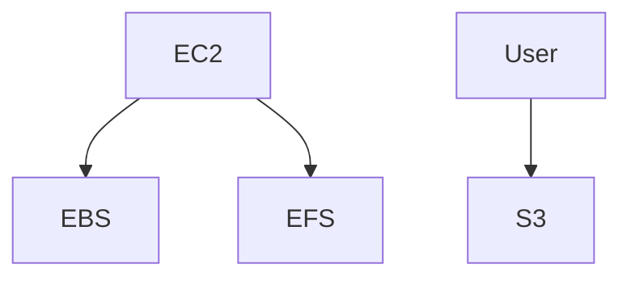

# Stockage AWS — S3 / EBS / EFS

## Objectifs pédagogiques

- Comprendre les différences entre S3, EBS et EFS
- Choisir le bon type de stockage selon le cas d’usage
- Configurer un bucket S3 sécurisé
- Comprendre les classes de stockage et leur impact coût
- Diagnostiquer des problèmes de stockage

## Contexte et problématique

Le stockage est critique :

- Où stocker les données ?
- Comment les rendre disponibles ?
- Comment optimiser les coûts ?

AWS propose plusieurs solutions adaptées à différents besoins.

## Architecture

| Service | Type | Usage |
|--------|------|------|
| S3 | Object storage | fichiers, backups |
| EBS | Block storage | disque EC2 |
| EFS | File system | partage réseau |



## Commandes essentielles

```bash
aws s3 ls
```
Liste les buckets S3.

```bash
aws s3 cp file.txt s3://<BUCKET>/
```
Upload un fichier.

```bash
aws ec2 describe-volumes
```
Liste les volumes EBS.

## Fonctionnement interne

### S3
- stockage objet
- haute durabilité (11 9)
- accessible via HTTP

### EBS
- disque attaché à EC2
- performance élevée
- persistant

### EFS
- système de fichiers partagé
- multi-instance
- scalable

🧠 Concept clé  
→ S3 ≠ disque, c’est du stockage objet

💡 Astuce  
→ utiliser lifecycle pour réduire coûts

⚠️ Erreur fréquente  
→ rendre un bucket public  
Correction : bloquer accès public

## Cas réel en entreprise

Contexte :

Application web avec images.

Solution :

- S3 pour stockage images
- CloudFront pour distribution

Résultat :

- performance améliorée
- coût réduit

## Bonnes pratiques

- Activer versioning S3
- Bloquer accès public
- Utiliser lifecycle policies
- Chiffrer données
- Sauvegarder EBS
- Monitorer stockage
- Choisir bonne classe S3

## Résumé

S3, EBS et EFS répondent à des besoins différents.  
Le choix du stockage impacte coût, performance et architecture.  
S3 est le plus utilisé mais souvent mal compris.

---

## SNIPPETS DE RÉVISION

<!-- snippet
id: aws_s3_definition
type: concept
tech: aws
level: beginner
importance: high
format: knowledge
tags: aws,s3,storage
title: S3 stockage objet
content: S3 est un service de stockage objet accessible via HTTP avec une très haute durabilité
description: Base du stockage AWS
-->

<!-- snippet
id: aws_ebs_definition
type: concept
tech: aws
level: beginner
importance: high
format: knowledge
tags: aws,ebs,storage
title: EBS disque EC2
content: EBS fournit un disque persistant attaché à une instance EC2
description: Stockage bloc AWS
-->

<!-- snippet
id: aws_s3_public_warning
type: warning
tech: aws
level: beginner
importance: high
format: knowledge
tags: aws,s3,security
title: Bucket public dangereux
content: Rendre un bucket public expose les données, toujours restreindre avec des policies
description: Risque critique sécurité
-->

<!-- snippet
id: aws_s3_upload_command
type: command
tech: aws
level: beginner
importance: medium
format: knowledge
tags: aws,s3,cli
title: Upload fichier S3
command: aws s3 cp <FILE> s3://<BUCKET>/
example: aws s3 cp rapport.pdf s3://mon-bucket-prod/
description: Permet d’envoyer un fichier vers S3
-->

<!-- snippet
id: aws_s3_lifecycle_tip
type: tip
tech: aws
level: beginner
importance: medium
format: knowledge
tags: aws,s3,cost
title: Lifecycle S3
content: Utiliser les lifecycle policies permet de réduire automatiquement les coûts de stockage
description: Optimisation essentielle AWS
-->
