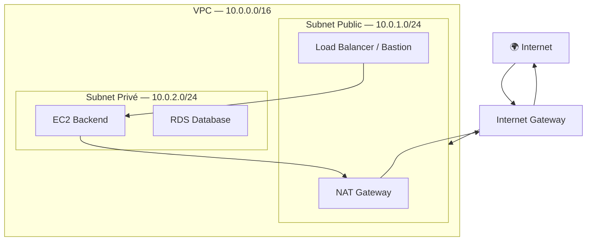
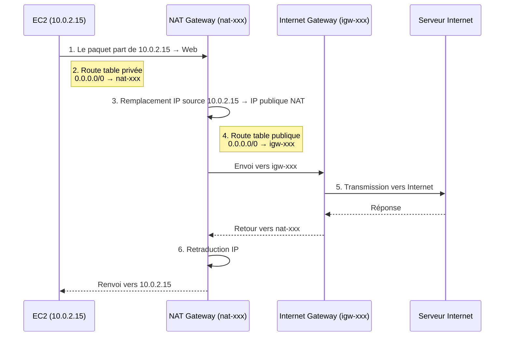

# Réseau AWS — VPC, Subnets, Routing

## Objectifs pédagogiques

À la fin de ce module, tu seras capable de :

1. **Expliquer** le rôle d'un VPC et pourquoi il constitue le fondement de toute architecture AWS
2. **Distinguer** un subnet public d'un subnet privé en lisant sa route table
3. **Décrire** le rôle complémentaire de l'Internet Gateway et de la NAT Gateway dans le flux réseau
4. **Lire** une route table pour diagnostiquer un problème de connectivité
5. **Construire** mentalement une architecture réseau à deux couches (public/privé) multi-AZ

---

## Pourquoi le réseau est le fondement de tout

Imagine que tu lances une instance EC2 sans réfléchir au réseau. Elle démarre. Mais tu ne peux pas t'y connecter. Ton application ne peut pas appeler une API externe. Ta base de données est exposée à Internet. Les ressources ne se parlent pas entre elles.

C'est exactement ce qui arrive quand on déploie sans architecture réseau claire.

AWS résout ça avec le **VPC — Virtual Private Cloud** : un réseau privé que tu contrôles entièrement, isolé des autres comptes AWS, dans lequel tu places toutes tes ressources. Le VPC te donne la main sur trois choses fondamentales :

- **Qui peut accéder à quoi** — flux entrants et sortants
- **Comment les ressources communiquent entre elles** — routage interne
- **Ce qui est exposé à Internet et ce qui ne l'est pas** — segmentation public/privé

Sans VPC structuré, tu ne fais pas "du cloud" — tu fais de l'hébergement non maîtrisé.

---

## Les composants du réseau AWS

Avant de regarder les commandes, il faut comprendre comment ces pièces s'articulent. Chacune a un rôle précis et non interchangeable.

| Composant | Rôle | Exemple concret |
|-----------|------|-----------------|
| **VPC** | Enveloppe réseau isolée pour ton compte | `10.0.0.0/16` — 65 536 adresses disponibles |
| **Subnet** | Segment du VPC, ancré dans une AZ spécifique | `10.0.1.0/24` — 256 adresses dans `eu-west-1a` |
| **Internet Gateway (IGW)** | Point d'entrée/sortie bidirectionnel vers Internet | S'attache au VPC, pas au subnet |
| **NAT Gateway** (Network Address Translation) | Sortie Internet pour les ressources privées, sans exposition entrante | Se place dans un subnet **public** |
| **Route Table** | Décide où envoyer le trafic selon sa destination | `0.0.0.0/0 → igw-xxx` = sortie Internet |
| **Security Group** | Pare-feu au niveau instance | Couvert en détail dans le module Sécurité |

Le point qui crée le plus de confusion chez les débutants mérite d'être dit clairement dès maintenant : **un subnet n'est pas "public" parce qu'il s'appelle `public-subnet`. Il est public parce que sa route table contient une entrée `0.0.0.0/0` pointant vers un IGW.** Le nom ne change rien — c'est la route qui qualifie.

> **SAA-C03** — Accès privé à S3/DynamoDB → **Gateway VPC Endpoint** (gratuit). Autres services → **Interface Endpoint** (payant).
> SG = stateful, Allow only, niveau instance. NACL = stateless, Allow + Deny, **first-match par numéro de règle** (un Allow #100 avant un Deny #101 = autorisé).

### Vue d'ensemble de l'architecture



Le flux est asymétrique par design. Le trafic entrant arrive via l'IGW sur les ressources publiques. Le trafic sortant des instances privées passe par la NAT Gateway — placée dans le subnet public — qui masque leur IP privée derrière son IP publique. Une instance dans le subnet privé n'est jamais directement visible depuis Internet.

---

## Explorer son réseau avec la CLI

Ces commandes te permettent d'auditer une architecture existante ou de vérifier tes propres déploiements. L'ordre suit une logique de zoom : on part du conteneur (VPC) vers les détails (routes).

**Lister les VPC disponibles dans la région courante :**

```bash
aws ec2 describe-vpcs
```

**Lister les subnets avec leur CIDR*, leur AZ et leurs adresses disponibles :**

*CIDR (Classless Inter-Domain Routing) : notation qui définit une plage d'adresses IP et la taille du réseau (ex : `10.0.0.0/16` = 65 536 adresses).

```bash
aws ec2 describe-subnets
```

**Filtrer les subnets d'un VPC précis :**

```bash
aws ec2 describe-subnets \
  --filters "Name=vpc-id,Values=<VPC_ID>"
```

Exemple :

```bash
aws ec2 describe-subnets \
  --filters "Name=vpc-id,Values=vpc-0a1b2c3d4e5f67890"
```

**Afficher les route tables — c'est ici que tout se joue :**

```bash
aws ec2 describe-route-tables \
  --filters "Name=vpc-id,Values=<VPC_ID>"
```

Exemple :

```bash
aws ec2 describe-route-tables \
  --filters "Name=vpc-id,Values=vpc-0a1b2c3d4e5f67890"
```

Dans la sortie JSON, cherche la section `Routes`. Si tu vois `"DestinationCidrBlock": "0.0.0.0/0"` avec un `GatewayId` commençant par `igw-` → subnet public. Si le target commence par `nat-` → subnet privé avec sortie Internet. Pas de route `0.0.0.0/0` du tout → subnet complètement isolé.

**Vérifier qu'un IGW est bien attaché à ton VPC :**

```bash
aws ec2 describe-internet-gateways \
  --filters "Name=attachment.vpc-id,Values=<VPC_ID>"
```

Exemple :

```bash
aws ec2 describe-internet-gateways \
  --filters "Name=attachment.vpc-id,Values=vpc-0a1b2c3d4e5f67890"
```

L'état attendu dans la réponse est `"State": "available"` sous `Attachments`. Une IGW qui existe mais n'est pas attachée ne sert à rien — erreur classique lors d'une migration de VPC.

---

## Comment ça fonctionne vraiment

### Le chemin d'un paquet réseau

Quand une instance privée veut télécharger une mise à jour depuis Internet, voici ce qui se passe concrètement, étape par étape :

1. Le paquet part de l'instance `10.0.2.15` dans le subnet privé
2. La route table du subnet privé indique : `0.0.0.0/0 → nat-xxx`
3. La NAT Gateway reçoit le paquet et remplace l'IP source `10.0.2.15` par sa propre IP publique
4. La route table du subnet public (où réside la NAT) indique : `0.0.0.0/0 → igw-xxx`
5. L'IGW transmet le paquet sur Internet avec l'IP publique de la NAT
6. La réponse revient à la NAT Gateway, qui retraduit et renvoie à `10.0.2.15`



L'instance privée n'a jamais eu d'IP publique. Elle n'est jamais directement visible depuis Internet. C'est exactement le comportement voulu.

🧠 **La route table est la seule vérité**
Un subnet est public ou privé selon sa route table — pas selon son nom, pas selon l'IP de ses instances. C'est la route `0.0.0.0/0` et sa cible (IGW ou NAT) qui définit tout. Quand quelqu'un dit "mon subnet public", demande-lui toujours : "tu as vérifié la route table ?"

💡 **Séparer public et privé dès le premier déploiement**
Même pour un projet de test, prendre l'habitude de créer au moins deux subnets. Reconstruire l'isolation réseau après coup, avec des instances déjà déployées et des applications en cours d'exécution, est nettement plus risqué que d'avoir pensé la structure dès le départ.

⚠️ **Timeout SSH ou HTTP — ordre de diagnostic**
Ne pas commencer par le Security Group. Vérifier dans cet ordre :
1. La route table du subnet contient-elle `0.0.0.0/0 → igw-xxx` ?
2. L'IGW est-elle bien attachée au VPC (état `available`) ?
3. Le Security Group autorise-t-il le port concerné depuis la bonne source ?
4. L'instance a-t-elle une IP publique ou une Elastic IP assignée ?

La route table couvre environ 80% des cas. C'est toujours le premier endroit à regarder.

---

## Cas réel : reconstruction réseau d'une application SaaS en production

**Contexte — startup B2B, 12 développeurs, premier audit sécurité**

L'équipe avait démarré vite : tout dans un seul subnet sans règle de routage explicite. L'application fonctionnait. Mais lors d'un audit de sécurité préalable à un contrat enterprise, un scan automatisé a détecté que la base de données PostgreSQL était accessible depuis Internet — port 5432 ouvert sur `0.0.0.0/0`. Le client a suspendu la signature.

**Architecture reconstruite en 4 heures :**

- VPC `10.0.0.0/16` en `eu-west-1`
- 2 subnets publics dans `eu-west-1a` et `eu-west-1b` → Application Load Balancer + NAT Gateways
- 2 subnets privés dans `eu-west-1a` et `eu-west-1b` → instances EC2 backend + RDS PostgreSQL
- Route table publique : `0.0.0.0/0 → igw-xxx`
- Route table privée : `0.0.0.0/0 → nat-xxx`
- RDS dans les subnets privés, Security Group n'acceptant le port 5432 que depuis le CIDR des subnets privés

**Résultats mesurés :**

- Port 5432 plus accessible depuis Internet — validé par re-scan immédiat
- Les instances backend peuvent toujours appeler des APIs externes via la NAT — zéro régression applicative
- Temps de migration effective : 4 heures dont 2h de tests de non-régression
- Coût mensuel ajouté : ~32 USD pour les deux NAT Gateways — coût acceptable face au risque commercial
- Contrat signé la semaine suivante

Ce qui frappe rétrospectivement : la segmentation réseau n'a pas complexifié l'architecture. Elle l'a rendue lisible. Chaque subnet a un rôle clair, chaque flux est explicitement déclaré, l'audit futur sera trivial.

---

## Bonnes pratiques

**Dimensionner le CIDR VPC avec de la marge dès la création**
Un `/16` laisse 65 536 adresses et de la place pour grandir. Un `/24` peut bloquer des expansions à 6 mois. Le CIDR VPC ne se modifie pas après création — c'est une décision définitive. Par défaut, choisir `/16`.

**Créer les subnets par paires multi-AZ dès le départ**
Un subnet existe dans une seule Availability Zone. Pour toute résilience, il faut au minimum un subnet public et un subnet privé dans deux AZ différentes. Ajouter une AZ plus tard demande de reconfigurer les route tables, les NAT Gateways et parfois les services managés — autant le faire immédiatement.

**Garder les bases de données dans des subnets privés, sans exception**
Même avec un Security Group restrictif, une base de données dans un subnet public augmente inutilement la surface d'attaque. Une base de données n'a jamais besoin d'une IP publique. L'audit SaaS ci-dessus en est l'illustration directe.

**Une NAT Gateway par AZ en production**
Une NAT Gateway est zonale. Si son AZ tombe, toutes les instances privées des autres AZ qui routent vers elle perdent leur accès Internet. En production, une NAT par AZ utilisée, chaque route table privée pointant vers la NAT de sa propre AZ. En dev ou staging, une seule suffit.

**Appliquer une convention de nommage dès le premier subnet**
`vpc-prod-eu-west-1`, `subnet-prod-public-1a`, `rtb-prod-private-1a`. Sans convention, auditer un réseau avec 15 subnets et 8 route tables devient rapidement un exercice d'archéologie. Le nommage coûte rien à la création et économise beaucoup lors de chaque incident.

**Documenter l'architecture réseau comme du code**
Un diagramme versionné ou un Terraform commenté qui montre les CIDR, les AZ, les flux autorisés. Ce document évite de redécouvrir l'architecture à chaque incident réseau, et est indispensable lors des rotations d'équipe.

**Toujours commencer le diagnostic par la route table**
Avant de toucher aux Security Groups, aux configurations d'instance ou aux paramètres applicatifs — lire les routes. Cette habitude seule évite des heures de débogage inutile.

---

## Résumé

Le VPC est le réseau privé isolé dans lequel vivent toutes tes ressources AWS. Sa structure interne repose sur les subnets (segments ancrés dans une AZ), les route tables (qui décident où va chaque paquet) et les gateways (IGW pour le trafic bidirectionnel vers Internet, NAT pour la sortie unilatérale des ressources privées). La distinction public/privé est entièrement portée par la route table — pas par le nom, pas par l'IP. Diagnostiquer un problème réseau commence systématiquement par lire les routes. Ces fondations réseau sont un prérequis direct pour tout ce qui suit : déploiements automatisés, Load Balancers, bases de données managées — tous s'appuient sur une topologie VPC correctement pensée.

---

<!-- snippet
id: aws_vpc_concept
type: concept
tech: aws
level: beginner
importance: high
format: knowledge
tags: aws,vpc,network,isolation
title: VPC — réseau virtuel isolé dans AWS
content: Un VPC (Virtual Private Cloud) est un réseau privé dédié à ton compte AWS dans une région. Il est isolé des autres comptes par défaut. Toutes les ressources AWS (EC2, RDS, Lambda en VPC...) doivent être placées dans un VPC. Le CIDR block du VPC (ex: 10.0.0.0/16) définit le pool d'adresses IP disponibles et ne peut pas être modifié après création.
description: Enveloppe réseau isolée dans laquelle vivent toutes tes ressources AWS — fondation obligatoire de toute architecture
-->

<!-- snippet
id: aws_subnet_public_vs_private
type: concept
tech: aws
level: beginner
importance: high
format: knowledge
tags: aws,subnet,route-table,igw
title: Ce qui rend un subnet public ou privé
content: Un subnet est "public" uniquement si sa route table contient une entrée 0.0.0.0/0 pointant vers un Internet Gateway (igw-xxx). Sans cette route, une instance avec une IP publique reste inaccessible depuis Internet. Un subnet "privé" a soit aucune route vers Internet, soit une route 0.0.0.0/0 vers une NAT Gateway — ce qui permet la sortie Internet sans exposition entrante. Le nom du subnet ne change rien.
description: C'est la route table qui qualifie un subnet, pas son nom ni l'IP de ses instances — piège classique des débutants AWS
-->

<!-- snippet
id: aws_igw_vs_nat
type: concept
tech: aws
level: beginner
importance: high
format: knowledge
tags: aws,igw,nat,gateway,network
title: IGW vs NAT Gateway — différence fondamentale
content: L'Internet Gateway (IGW) est bidirectionnelle : elle permet le trafic entrant ET sortant pour les ressources publiques. La NAT Gateway est unidirectionnelle : elle permet uniquement au trafic sortant des instances privées d'atteindre Internet, sans jamais permettre de connexions entrantes. La NAT Gateway se place toujours dans un subnet PUBLIC et dépend elle-même de l'IGW pour fonctionner.
description: IGW = trafic bidirectionnel pour les ressources publiques. NAT = sortie Internet seulement pour les privés, sans exposition entrante
-->

<!-- snippet
id: aws_vpc_describe_vpcs
type: command
tech: aws
level: beginner
importance: medium
format: knowledge
tags: aws,vpc,cli
title: Lister les VPC disponibles dans la région courante
context: Point de départ pour auditer une architecture réseau existante
command: aws ec2 describe-vpcs
description: Retourne tous les VPC du compte dans la région configurée, avec leur CIDR et leur état
-->

<!-- snippet
id: aws_vpc_describe_subnets
type: command
tech: aws
level: beginner
importance: medium
format: knowledge
tags: aws,vpc,cli,subnet
title: Lister les subnets d'un VPC spécifique
context: Utile pour vérifier les CIDR assignés, les AZ et le nombre d'adresses disponibles par subnet
command: aws ec2 describe-subnets --filters "Name=vpc-id,Values=<VPC_ID>"
example: aws ec2 describe-subnets --filters "Name=vpc-id,Values=vpc-0a1b2c3d4e5f67890"
description: Retourne les subnets du VPC avec leur CIDR, leur AZ et leur disponibilité en adresses IP
-->

<!-- snippet
id: aws_vpc_describe_route_tables
type: command
tech: aws
level: beginner
importance: high
format: knowledge
tags: aws,vpc,cli,routing,debug
title: Lire les route tables d'un VPC
context: Premier réflexe en cas de problème de connectivité — la route table contient la vérité sur le routage
command: aws ec2 describe-route-tables --filters "Name=vpc-id,Values=<VPC_ID>"
example: aws ec2 describe-route-tables --filters "Name=vpc-id,Values=vpc-0a1b2c3d4e5f67890"
description: Affiche toutes les routes du VPC — chercher 0.0.0.0/0 → igw-xxx (public) ou nat-xxx (privé avec sortie)
-->

<!-- snippet
id: aws_vpc_describe_igw
type: command
tech: aws
level: beginner
importance: medium
format: knowledge
tags: aws,vpc,cli,igw
title: Vérifier l'Internet Gateway attachée à un VPC
context: Une IGW non attachée au VPC rend tous les subnets publics injoignables même avec la bonne route table
command: aws ec2 describe-internet-gateways --filters "Name=attachment.vpc-id,Values=<VPC_ID>"
example: aws ec2 describe-internet-gateways --filters "Name=attachment.vpc-id,Values=vpc-0a1b2c3d4e5f67890"
description: Confirme que l'IGW existe et est bien attachée au VPC — état attendu "available" dans Attachments
-->

<!-- snippet
id: aws_network_debug_connectivity
type: warning
tech: aws
level: beginner
importance: high
format: knowledge
tags: aws,network,debug,troubleshooting,igw
title: Instance EC2 inaccessible — ordre de diagnostic réseau
content: Vérifier dans cet ordre : 1) La route table du subnet contient-elle 0.0.0.0/0 → igw-xxx ? 2) L'IGW est-elle attachée au VPC (état "available") ? 3) Le Security Group autorise-t-il le port concerné depuis la bonne source ? 4) L'instance a-t-elle une IP publique ou une Elastic IP assignée ? La route table couvre 80% des cas — toujours commencer là.
description: Timeout SSH ou HTTP = commencer par la route table avant de toucher aux Security Groups ou à la configuration instance
-->

<!-- snippet
id: aws_vpc_cidr_sizing
type: tip
tech: aws
level: beginner
importance: medium
format: knowledge
tags: aws,vpc,cidr,planning
title: Choisir le bon CIDR pour son VPC
content: Le CIDR VPC ne peut pas être modifié après création. Préférer un /16 (65 536 adresses) plutôt qu'un /24 (256 adresses) même pour un petit projet. Les services AWS managés (RDS, ELB, ECS) consomment des adresses, et l'extension multi-AZ en demande davantage. Plages RFC 1918 recommandées : 10.0.0.0/8, 172.16.0.0/12, 192.168.0.0/16.
description: Un CIDR trop petit bloque l'évolution de l'architecture — choisir /16 par défaut, impossible à changer ensuite
-->

<!-- snippet
id: aws_nat_gateway_ha
type: tip
tech: aws
level: beginner
importance: medium
format: knowledge
tags: aws,nat,availability,cost
title: NAT Gateway et haute disponibilité — une par AZ
content: Une NAT Gateway est zonale : elle existe dans une seule AZ. Si cette AZ devient indisponible, les instances privées des autres AZ perdent leur accès Internet si elles routent vers cette NAT. En production, créer une NAT Gateway par AZ et configurer chaque route table privée vers la NAT de sa propre AZ. En dev ou staging, une seule NAT Gateway suffit pour économiser (~32 USD/mois par NAT).
description: En production, une NAT Gateway par AZ — sinon une panne AZ coupe l'accès Internet de toutes les instances privées
-->
