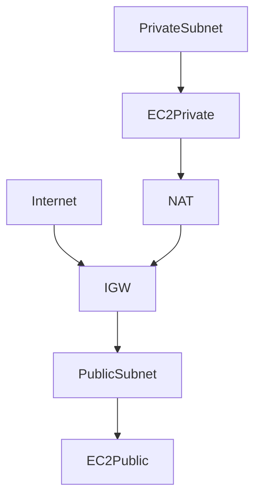

# Réseau AWS — VPC, Subnets, Routing

## Objectifs pédagogiques

- Comprendre l’architecture réseau AWS (VPC)
- Créer et structurer des subnets publics et privés
- Comprendre le routage (route tables)
- Configurer Internet Gateway et NAT Gateway
- Diagnostiquer un problème réseau AWS

## Contexte et problématique

Sans réseau structuré :

- Impossible de sécuriser les ressources
- Communication instable
- Architecture non scalable

Le VPC permet :

- Isolation réseau
- Contrôle des flux
- Sécurité fine

## Architecture

| Composant | Rôle | Exemple |
|-----------|------|---------|
| VPC | Réseau isolé | 10.0.0.0/16 |
| Subnet | Segment réseau | 10.0.1.0/24 |
| IGW | Accès Internet | public access |
| NAT Gateway | Sortie Internet privée | updates |
| Route Table | Routage trafic | 0.0.0.0/0 |



## Commandes essentielles

```bash
aws ec2 describe-vpcs
```
Liste les VPC.

```bash
aws ec2 describe-subnets
```
Liste les subnets.

```bash
aws ec2 describe-route-tables
```
Liste les routes.

## Fonctionnement interne

1. Création VPC (CIDR)
2. Création subnets
3. Association route table
4. Ajout IGW ou NAT

🧠 Concept clé  
→ Subnet public = route vers IGW

💡 Astuce  
→ Toujours séparer public et privé

⚠️ Erreur fréquente  
→ Instance inaccessible → problème route ou SG  
Correction : vérifier route table + IGW

## Cas réel en entreprise

Contexte :

Architecture web sécurisée.

Solution :

- Subnet public → load balancer
- Subnet privé → EC2 backend
- NAT → accès Internet sortant

Résultat :

- Sécurité renforcée
- Architecture scalable

## Bonnes pratiques

- Séparer public / privé
- Ne jamais exposer DB en public
- Limiter accès SSH
- Utiliser NAT pour sorties
- Utiliser CIDR clair
- Monitorer trafic
- Documenter architecture réseau

## Résumé

Le VPC est le cœur réseau AWS.  
Les subnets segmentent le réseau.  
Le routage contrôle les flux.  
Une mauvaise config réseau bloque tout.

---

## SNIPPETS DE RÉVISION

<!-- snippet
id: aws_vpc_definition
type: concept
tech: aws
level: beginner
importance: high
format: knowledge
tags: aws,vpc,network
title: VPC définition
content: Un VPC est un réseau virtuel isolé dans AWS permettant de contrôler le trafic réseau
description: Base du réseau AWS
-->

<!-- snippet
id: aws_subnet_public_definition
type: concept
tech: aws
level: beginner
importance: high
format: knowledge
tags: aws,subnet,network
title: Subnet public définition
content: Un subnet public possède une route vers une Internet Gateway permettant l'accès Internet
description: Différence clé public vs privé
-->

<!-- snippet
id: aws_nat_gateway_usage
type: concept
tech: aws
level: beginner
importance: high
format: knowledge
tags: aws,nat,network
title: NAT Gateway rôle
content: Une NAT Gateway permet aux instances privées d'accéder à Internet sans être exposées
description: Élément critique sécurité
-->

<!-- snippet
id: aws_route_table_command
type: command
tech: aws
level: beginner
importance: medium
format: knowledge
tags: aws,vpc,cli
title: Voir routes VPC
command: aws ec2 describe-route-tables
description: Permet de vérifier les routes réseau
-->

<!-- snippet
id: aws_network_debug_error
type: warning
tech: aws
level: beginner
importance: high
format: knowledge
tags: aws,network,debug
title: Instance inaccessible
content: Symptôme instance inaccessible, cause route ou security group mal configuré, correction vérifier IGW et rules
description: Problème fréquent AWS
-->
