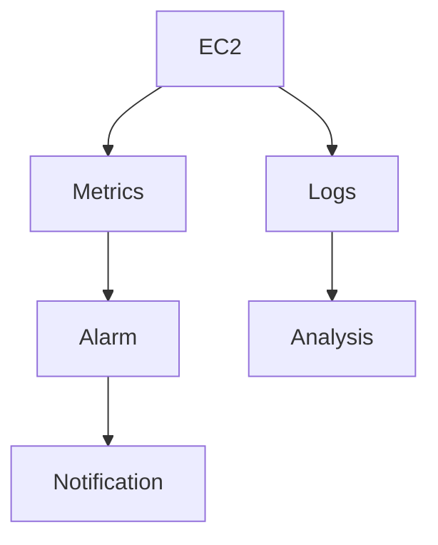

# Monitoring AWS — CloudWatch (metrics, logs, alerting)

## Objectifs pédagogiques

- Comprendre le rôle de CloudWatch dans AWS
- Exploiter les métriques et logs
- Créer des alarmes pertinentes
- Diagnostiquer un incident via monitoring
- Structurer une observabilité utile en production

## Contexte et problématique

Sans monitoring :

- Impossible de détecter une panne
- Pas de visibilité sur les performances
- Réaction tardive aux incidents

CloudWatch permet :

- Collecte de métriques
- Centralisation des logs
- Alerting automatisé

## Architecture

| Composant | Rôle | Exemple |
|-----------|------|---------|
| Metrics | Données de performance | CPU EC2 |
| Logs | Logs applicatifs | nginx logs |
| Alarms | Alertes | CPU > 80% |
| Dashboards | Visualisation | Grafana-like |



## Commandes essentielles

```bash
aws cloudwatch list-metrics
```
Liste les métriques disponibles.

```bash
aws logs describe-log-groups
```
Liste les groupes de logs.

```bash
aws cloudwatch put-metric-alarm --alarm-name <NAME>
```
Crée une alarme.

## Fonctionnement interne

1. AWS collecte métriques automatiquement
2. Logs envoyés via agents ou services
3. Alarmes analysent seuils
4. Notifications envoyées (SNS)

🧠 Concept clé  
→ Monitoring ≠ logs uniquement

💡 Astuce  
→ Toujours monitorer :
- CPU
- mémoire
- latence
- erreurs

⚠️ Erreur fréquente  
→ Trop de logs inutiles  
Correction : logs exploitables uniquement

## Cas réel en entreprise

Contexte :

API lente en production.

Solution :

- Analyse métriques CPU
- Analyse logs erreurs
- Création alarme latence

Résultat :

- Détection rapide
- Correction efficace

## Bonnes pratiques

- Monitorer métriques critiques
- Centraliser logs
- Créer alertes utiles (pas trop)
- Utiliser dashboards
- Corréler logs + métriques
- Garder logs lisibles
- Automatiser alerting

## Résumé

CloudWatch est le système d’observabilité AWS.  
Il permet de surveiller, alerter et diagnostiquer.  
Sans monitoring, aucune infra n’est viable.

---

## SNIPPETS DE RÉVISION

<!-- snippet
id: aws_cloudwatch_definition
type: concept
tech: aws
level: beginner
importance: high
format: knowledge
tags: aws,monitoring,cloudwatch
title: CloudWatch définition
content: CloudWatch permet de collecter métriques, logs et créer des alertes sur AWS
description: Base observabilité AWS
-->

<!-- snippet
id: aws_cloudwatch_metrics
type: concept
tech: aws
level: beginner
importance: high
format: knowledge
tags: aws,metrics,monitoring
title: Metrics AWS
content: Les metrics représentent des données chiffrées comme CPU, latence ou requêtes
description: Indicateurs clés infra
-->

<!-- snippet
id: aws_cloudwatch_alarm_warning
type: warning
tech: aws
level: beginner
importance: high
format: knowledge
tags: aws,monitoring,error
title: Trop d'alarmes
content: Trop d'alarmes rend le monitoring inutile, définir uniquement des alertes pertinentes
description: Piège fréquent monitoring
-->

<!-- snippet
id: aws_cloudwatch_command
type: command
tech: aws
level: beginner
importance: medium
format: knowledge
tags: aws,cli,monitoring
title: Lister métriques CloudWatch
command: aws cloudwatch list-metrics
description: Permet de voir les métriques disponibles
-->

<!-- snippet
id: aws_logs_tip
type: tip
tech: aws
level: beginner
importance: medium
format: knowledge
tags: aws,logs,debug
title: Logs exploitables
content: Des logs clairs et structurés permettent un debug rapide et efficace
description: Bonne pratique production
-->

<!-- snippet
id: aws_monitoring_error
type: warning
tech: aws
level: beginner
importance: high
format: knowledge
tags: aws,monitoring,incident
title: Pas de monitoring
content: Symptôme panne non détectée, cause absence monitoring, correction mettre en place CloudWatch
description: Erreur critique en production
-->
