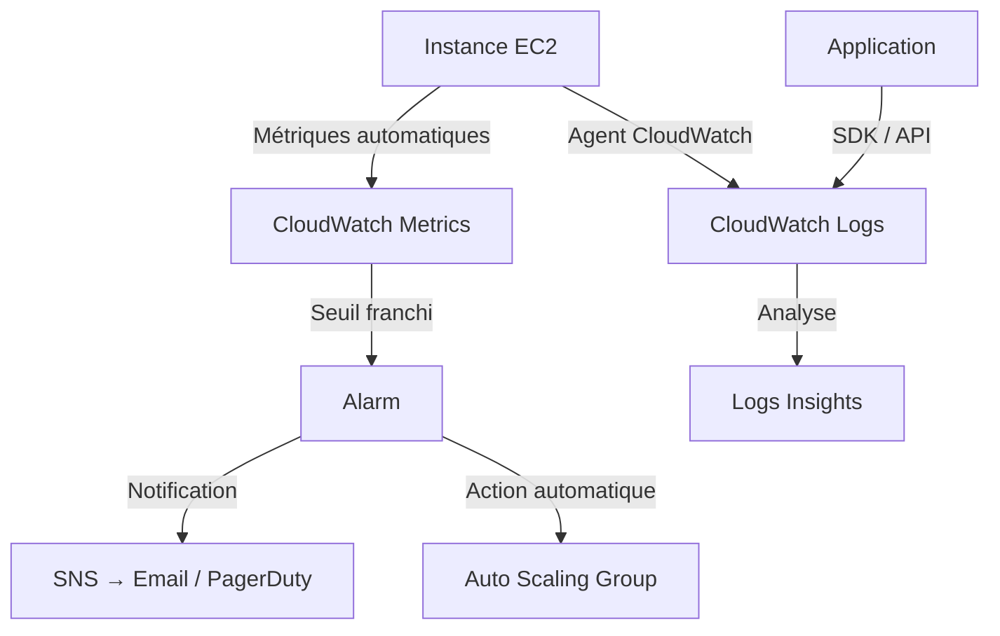

# Monitoring AWS — CloudWatch

Sans visibilité sur ce qui se passe dans une infrastructure, la réactivité face aux incidents devient nulle. On découvre les pannes par les utilisateurs, les dégradations de performance trop tard, et les causes racines après des heures de fouille manuelle. CloudWatch est la réponse AWS à ce problème : un système d'observabilité intégré qui couvre les métriques, les logs et l'alerting depuis une seule interface.

## Objectifs pédagogiques

À l'issue de ce module, vous serez capable de :

1. Distinguer les composants CloudWatch (metrics, logs, alarms, dashboards) et leur rôle respectif
2. Interroger les métriques et groupes de logs via l'AWS CLI
3. Créer une alarme CloudWatch déclenchant une notification SNS (Simple Notification Service)
4. Diagnostiquer un incident de performance en croisant métriques et logs
5. Structurer une stratégie de monitoring adaptée à un environnement de production

---

## Pourquoi CloudWatch existe

Imaginez une application en production sans aucun instrument de mesure : vous ne savez pas si votre instance EC2 sature son CPU, si votre API répond en 200 ms ou en 8 secondes, ni si des erreurs 500 s'accumulent en silence depuis ce matin.

Le monitoring n'est pas une option. C'est la condition pour passer d'une posture **réactive** — on répare après la panne — à une posture **proactive** — on détecte et corrige avant l'impact utilisateur.

CloudWatch résout trois problèmes distincts :

- **La collecte de données de performance** : AWS publie automatiquement des métriques sur ses services (CPU EC2, latence ALB (Application Load Balancer), requêtes S3…)
- **La centralisation des logs applicatifs** : chaque service peut envoyer ses logs vers CloudWatch Logs, où ils sont indexés et requêtables
- **L'alerting automatisé** : des alarmes surveillent les seuils et déclenchent des actions — notification, auto-scaling, invocation Lambda

Ce n'est pas un simple logger. C'est un système qui peut **réagir**.

<!-- snippet
id: aws_cloudwatch_definition
type: concept
tech: aws
level: beginner
importance: high
format: knowledge
tags: aws,monitoring,cloudwatch
title: CloudWatch — système d'observabilité AWS
content: CloudWatch est le cerveau d'observabilité d'AWS : il ingère des métriques (chiffres), des logs (textes) et des traces, puis permet de déclencher des alarmes ou des actions automatiques (scaling, Lambda) quand un seuil est franchi.
description: Contrairement à un simple logger, CloudWatch peut réagir : une alarme CPU > 80% peut déclencher un scale-out automatique.
-->

---

## Architecture de CloudWatch

CloudWatch n'est pas un service monolithique. C'est un ensemble de briques complémentaires qui travaillent ensemble.

| Composant | Rôle | Exemple concret |
|---|---|---|
| **Metrics** | Données chiffrées horodatées | CPU EC2, latence ALB, requêtes/sec |
| **Logs** | Données textuelles ou JSON | Logs Nginx, erreurs applicatives |
| **Alarms** | Surveillance d'un seuil métrique | CPU > 80% pendant 5 minutes |
| **Dashboards** | Visualisation consolidée | Vue temps réel de l'infra |
| **Logs Insights** | Requêtes analytiques sur les logs | Compter les erreurs 500 par endpoint |
| **Events / EventBridge** | Déclenchement d'actions sur événements | Lancer une Lambda à chaque alarme |

Le flux de données suit une logique simple : les services AWS publient des métriques, les applications envoient leurs logs, et les alarmes surveillent l'ensemble pour déclencher des actions si nécessaire.



<!-- snippet
id: aws_cloudwatch_metrics_concept
type: concept
tech: aws
level: beginner
importance: high
format: knowledge
tags: aws,metrics,monitoring,ec2
title: Métriques CloudWatch — incluses ou non par défaut
content: Une métrique CloudWatch est un point de données horodaté (valeur + timestamp + namespace). AWS publie des métriques standard toutes les 5 min gratuitement (CPU, réseau, disque) ; le monitoring détaillé descend à 1 min mais est facturé. La RAM n'est pas incluse dans les métriques EC2 de base — il faut installer l'agent CloudWatch pour la surveiller.
description: Les métriques EC2 de base n'incluent PAS la RAM — il faut installer l'agent CloudWatch pour la surveiller.
-->

> **SAA-C03** — RAM, swap, disk space = **custom metric** (CloudWatch Agent requis). CPU, network, disk I/O = default. "RDS CPU/memory per process" → **Enhanced Monitoring** (pas CloudWatch standard). "Detailed monitoring" = même métriques mais **1 min au lieu de 5**.

---

## Commandes essentielles

Les commandes AWS CLI CloudWatch s'articulent autour de trois actions principales : explorer les métriques disponibles, consulter les groupes de logs, et gérer les alarmes.

### Explorer les métriques

```bash
aws cloudwatch list-metrics --namespace <NAMESPACE>
```

Le paramètre `--namespace` filtre par service. Pour EC2 : `AWS/EC2`. Pour ALB : `AWS/ApplicationELB`. Sans ce paramètre, la commande renvoie toutes les métriques du compte — ce qui peut être volumineux.

<!-- snippet
id: aws_cloudwatch_list_metrics
type: command
tech: aws
level: beginner
importance: medium
format: knowledge
tags: aws,cli,metrics,cloudwatch
title: Lister les métriques disponibles par namespace
context: Utilisé pour explorer les métriques publiées par un service AWS avant de créer une alarme
command: aws cloudwatch list-metrics --namespace <NAMESPACE>
example: aws cloudwatch list-metrics --namespace AWS/EC2
description: Liste toutes les métriques disponibles dans un namespace donné. Sans --namespace, renvoie toutes les métriques de votre compte.
-->

Pour récupérer les valeurs d'une métrique sur une période donnée :

```bash
aws cloudwatch get-metric-statistics \
  --namespace AWS/EC2 \
  --metric-name CPUUtilization \
  --dimensions Name=InstanceId,Value=<INSTANCE_ID> \
  --start-time <START_TIME> \
  --end-time <END_TIME> \
  --period <PERIOD_SECONDS> \
  --statistics Average
```

Le paramètre `--period` est en secondes : 300 correspond à des points toutes les 5 minutes. `--start-time` et `--end-time` attendent un timestamp ISO 8601 (`2024-01-15T08:00:00Z`).

<!-- snippet
id: aws_cloudwatch_get_metrics
type: command
tech: aws
level: beginner
importance: medium
format: knowledge
tags: aws,cli,metrics,ec2
title: Récupérer les statistiques CPU d'une instance EC2
context: Permet d'analyser l'évolution du CPU sur une plage temporelle définie
command: aws cloudwatch get-metric-statistics --namespace AWS/EC2 --metric-name CPUUtilization --dimensions Name=InstanceId,Value=<INSTANCE_ID> --start-time <START_TIME> --end-time <END_TIME> --period <PERIOD_SECONDS> --statistics Average
example: aws cloudwatch get-metric-statistics --namespace AWS/EC2 --metric-name CPUUtilization --dimensions Name=InstanceId,Value=i-0123456789abcdef0 --start-time 2024-01-15T08:00:00Z --end-time 2024-01-15T10:00:00Z --period 300 --statistics Average
description: Retourne les statistiques d'une métrique EC2 pour une instance et une fenêtre temporelle données. --period est en secondes (300 = 5 min).
-->

### Gérer les groupes de logs

```bash
aws logs describe-log-groups
```

Chaque application ou service crée un **log group**. À l'intérieur, des **log streams** correspondent à des sources individuelles — une instance, un conteneur, une fonction Lambda. C'est cette hiérarchie qui permet de filtrer rapidement lors d'un incident.

<!-- snippet
id: aws_logs_describe_groups
type: command
tech: aws
level: beginner
importance: medium
format: knowledge
tags: aws,cli,logs,cloudwatch
title: Lister les groupes de logs CloudWatch
command: aws logs describe-log-groups
description: Liste tous les groupes de logs CloudWatch du compte dans la région active. Ajouter --log-group-name-prefix <PREFIX> pour filtrer par nom.
-->

Pour lire les derniers événements d'un log stream précis :

```bash
aws logs get-log-events \
  --log-group-name <LOG_GROUP_NAME> \
  --log-stream-name <LOG_STREAM_NAME>
```

<!-- snippet
id: aws_logs_get_events
type: command
tech: aws
level: beginner
importance: medium
format: knowledge
tags: aws,cli,logs,debug
title: Lire les événements d'un log stream
command: aws logs get-log-events --log-group-name <LOG_GROUP_NAME> --log-stream-name <LOG_STREAM_NAME>
example: aws logs get-log-events --log-group-name /aws/lambda/my-function --log-stream-name "2024/01/15/[$LATEST]abc123"
description: Récupère les entrées de log d'un stream spécifique. Par défaut retourne les 10 000 derniers événements. Ajouter --start-from-head pour lire dans l'ordre chronologique.
-->

### Créer une alarme

Une alarme repose sur quatre paramètres clés : la métrique à surveiller, le seuil à ne pas dépasser, le nombre de périodes consécutives avant déclenchement, et l'action à exécuter.

```bash
aws cloudwatch put-metric-alarm \
  --alarm-name <ALARM_NAME> \
  --metric-name <METRIC_NAME> \
  --namespace <NAMESPACE> \
  --statistic <STATISTIC> \
  --period <PERIOD_SECONDS> \
  --threshold <THRESHOLD> \
  --comparison-operator <OPERATOR> \
  --evaluation-periods <EVALUATION_PERIODS> \
  --alarm-actions <SNS_TOPIC_ARN>
```

<!-- snippet
id: aws_cloudwatch_put_alarm
type: command
tech: aws
level: beginner
importance: high
format: knowledge
tags: aws,cli,alarm,cloudwatch,sns
title: Créer une alarme CloudWatch avec action SNS
context: À exécuter après avoir identifié la métrique à surveiller et créé un topic SNS pour les notifications
command: aws cloudwatch put-metric-alarm --alarm-name <ALARM_NAME> --metric-name <METRIC_NAME> --namespace <NAMESPACE> --statistic <STATISTIC> --period <PERIOD_SECONDS> --threshold <THRESHOLD> --comparison-operator <OPERATOR> --evaluation-periods <EVALUATION_PERIODS> --alarm-actions <SNS_TOPIC_ARN>
example: aws cloudwatch put-metric-alarm --alarm-name cpu-high-prod --metric-name CPUUtilization --namespace AWS/EC2 --statistic Average --period 300 --threshold 80 --comparison-operator GreaterThanThreshold --evaluation-periods 2 --alarm-actions arn:aws:sns:eu-west-1:123456789012:ops-alerts
description: Crée une alarme qui passe en état ALARM si la condition est vérifiée pendant N périodes consécutives (evaluation-periods). L'action pointe vers un ARN SNS.
-->

---

## Fonctionnement interne

### Le cycle de vie d'une métrique

AWS publie automatiquement des métriques toutes les 5 minutes pour la plupart de ses services. Ce monitoring "standard" est gratuit. La granularité à 1 minute (monitoring détaillé) est disponible mais facturée — utile pour les ressources critiques où un pic de 3 minutes peut provoquer une panne avant d'être détecté.

🧠 **Pourquoi la RAM est absente par défaut** : AWS ne peut pas mesurer la mémoire consommée de l'extérieur d'une instance — c'est une donnée interne à l'OS. Pour surveiller la mémoire, il faut installer l'**agent CloudWatch** sur l'instance, qui lit les statistiques système et les pousse comme métriques custom dans le namespace `CWAgent`.

### Les trois états d'une alarme

Une alarme CloudWatch est toujours dans l'un de ces états :

- **OK** — la métrique est sous le seuil défini
- **ALARM** — le seuil est dépassé sur N périodes consécutives
- **INSUFFICIENT_DATA** — pas assez de données pour évaluer (fréquent au démarrage ou si l'instance est arrêtée)

💡 **Le paramètre `evaluation-periods` change tout** : avec `evaluation-periods: 1` et `period: 60`, l'alarme se déclenche dès la première minute au-dessus du seuil. Avec `evaluation-periods: 3`, il faut 3 minutes consécutives. Ce réglage permet d'absorber les pics courts sans générer de faux positifs — un CPU qui monte à 85% pendant 30 secondes au démarrage d'une JVM ne mérite pas de réveiller quelqu'un à 3h du matin.

### Logs : structurer pour pouvoir requêter

Un log en texte libre peut se lire, mais il résiste au filtrage. La différence est visible immédiatement :

```
# Texte libre — difficile à filtrer
2024-01-15 09:32:11 ERROR Request abc-123 failed after 8420ms for user 456

# JSON structuré — requêtable avec Logs Insights
{"timestamp": "2024-01-15T09:32:11Z", "level": "ERROR", "request_id": "abc-123", "duration_ms": 8420, "user_id": 456}
```

Avec des logs JSON, CloudWatch Logs Insights devient un vrai outil d'investigation :

```
fields @timestamp, request_id, duration_ms
| filter level = "ERROR"
| sort duration_ms desc
| limit 20
```

Cette requête identifie les 20 requêtes les plus lentes ayant échoué — ce qui aurait pris 20 minutes de grep manuel se fait en quelques secondes sur des millions de lignes.

⚠️ **Volume de logs = coût et bruit** : ingérer tous les logs de debug en production coûte cher et noie les informations importantes. La stratégie recommandée est `ERROR` + `WARN` en production, avec `DEBUG` activable ponctuellement via une variable d'environnement.

<!-- snippet
id: aws_logs_json_tip
type: tip
tech: aws
level: beginner
importance: medium
format: knowledge
tags: aws,logs,debug,cloudwatch
title: Structurer les logs en JSON pour Logs Insights
content: Un log en texte libre se lit mais ne se filtre pas. En JSON, CloudWatch Logs Insights peut requêter "fields @message | filter level='ERROR'" en secondes sur des millions de lignes. Ajouter systématiquement request_id, user_id et duration_ms dans chaque log JSON pour pouvoir corréler les événements entre eux lors d'un incident.
description: Les logs JSON permettent des requêtes analytiques avec Logs Insights. Inclure request_id, user_id et duration_ms dans chaque entrée.
-->

<!-- snippet
id: aws_cloudwatch_alarm_fatigue_warning
type: warning
tech: aws
level: beginner
importance: high
format: knowledge
tags: aws,monitoring,alerting,alarmes
title: Trop d'alarmes tue l'alerting
content: Quand une équipe reçoit des dizaines d'alertes par jour, elle finit par toutes les ignorer — c'est l'alarm fatigue. Une alarme doit correspondre à une action précise : quelqu'un doit savoir quoi faire quand elle se déclenche. Si personne ne sait quoi faire, l'alarme n'a pas sa place en production.
description: Définir uniquement des alarmes actionnables. Chaque alarme doit avoir un runbook ou une procédure de réponse associée.
-->

---

## Cas réel en entreprise

**Contexte** : une équipe SRE gère une API e-commerce en production sur AWS (EC2 + ALB). Un lundi matin, le support signale des lenteurs sur le checkout. Le temps de réponse habituel est de 180 ms en moyenne.

**Étape 1 — Métriques ALB** : l'équipe consulte le dashboard CloudWatch et constate que la métrique `TargetResponseTime` est passée à 3,2 secondes en moyenne depuis 6h00, avec des pics à 12 secondes. La métrique `HTTPCode_Target_5XX_Count` comptabilise 847 erreurs en 2 heures.

**Étape 2 — CPU des instances** : le CPU des instances EC2 derrière l'ALB tourne à 94% en moyenne. Les instances sont en train de saturer.

**Étape 3 — Logs Insights** : une requête sur le log group de l'application isole les erreurs par endpoint :

```
fields @timestamp, request_id, endpoint, duration_ms
| filter level = "ERROR"
| stats count(*) as error_count by endpoint
| sort error_count desc
```

Résultat : 89% des erreurs viennent d'un seul endpoint `/api/v1/pricing`, qui appelle un service tiers de calcul de prix devenu lent.

**Résolution** : l'équipe ajoute un timeout de 500 ms sur l'appel externe et active un cache Redis pour les réponses de pricing. En 15 minutes, le CPU redescend à 42% et la latence revient à 195 ms.

**Ce que CloudWatch a apporté** : sans les métriques ALB et Logs Insights, l'investigation aurait nécessité des heures de connexion SSH et de grep manuel sur chaque instance. La cause racine a été identifiée en 12 minutes.

---

## Bonnes pratiques

**1. Monitorer ce que ressent l'utilisateur, pas seulement la machine**
CPU et RAM sont des indicateurs système. La latence, le taux d'erreur et le throughput sont des indicateurs utilisateur. Un CPU à 30% ne vous dit rien si vos requêtes mettent 8 secondes. Privilégiez toujours les métriques orientées expérience.

**2. Activer le monitoring détaillé sur les ressources critiques**
Le monitoring à 5 minutes peut masquer un pic de CPU de 3 minutes qui a causé une panne. Sur les instances de production, le monitoring à 1 minute vaut le coût supplémentaire.

**3. Installer l'agent CloudWatch pour la RAM et les métriques disque**
Les métriques EC2 de base n'incluent ni la mémoire ni l'espace disque par partition. Sans agent, vous êtes aveugles sur deux ressources qui causent régulièrement des incidents silencieux.

**4. Structurer les logs en JSON dès le départ**
Réécrire un format de log en production est douloureux et risqué. Décider dès le développement d'un format JSON avec des champs standards (`level`, `request_id`, `duration_ms`, `user_id`) évite de le regretter lors du premier incident sérieux.

**5. Calibrer les seuils d'alarme sur des données réelles**
Une alarme CPU > 80% avec un seuil arbitraire génère des faux positifs. Observez votre baseline pendant 1 à 2 semaines, puis définissez les seuils à partir de l'écart-type au-dessus de la moyenne observée.

**6. Associer chaque alarme à un runbook**
Si l'alarme `api-latency-high` se déclenche à 3h du matin, la personne d'astreinte doit savoir exactement quoi faire. Sans procédure documentée, l'alarme génère du stress sans résoudre le problème.

**7. Définir une politique de rétention explicite**
Par défaut, CloudWatch conserve les logs indéfiniment — ce qui devient coûteux. Une bonne règle de base : 30 jours pour les logs courants, 90 jours pour les logs de sécurité, archivage vers S3 pour la conformité long terme.

**8. Corréler métriques et logs dans les dashboards**
Un dashboard qui affiche la courbe de latence et les logs d'erreur sur la même fenêtre temporelle réduit de moitié le temps de diagnostic lors d'un incident — plus besoin de jongler entre deux onglets.

<!-- snippet
id: aws_monitoring_absent_warning
type: warning
tech: aws
level: beginner
importance: high
format: knowledge
tags: aws,monitoring,incident,production
title: Absence de monitoring en production
content: Une infrastructure sans monitoring se découvre en panne via les utilisateurs ou le support. Le délai moyen de détection sans alerting actif dépasse 30 minutes. CloudWatch permet de détecter la dégradation avant qu'elle devienne une panne visible, à condition d'avoir configuré des alarmes sur les métriques critiques avant l'incident.
description: Sans monitoring actif, la détection des pannes repose sur les utilisateurs. Mettre en place les alarmes CloudWatch avant la mise en production.
-->

<!-- snippet
id: aws_cloudwatch_retention_tip
type: tip
tech: aws
level: beginner
importance: medium
format: knowledge
tags: aws,logs,cloudwatch,costs
title: Configurer la rétention des logs pour maîtriser les coûts
content: Par défaut, CloudWatch conserve les logs indéfiniment. Sur un compte actif, cela peut représenter plusieurs centaines de dollars par mois sans que personne ne consulte les logs anciens. Définir une rétention explicite sur chaque log group dès sa création est une habitude qui évite les mauvaises surprises sur la facture.
description: Sans politique de rétention, les logs s'accumulent indéfiniment. Configurer 30 jours pour les logs courants, 90 jours pour la sécurité.
-->

---

## Résumé

CloudWatch est le système d'observabilité natif d'AWS, organisé autour de trois piliers : les métriques (données chiffrées publiées automatiquement par les services AWS), les logs (centralisés et requêtables via Logs Insights), et les alarmes (qui surveillent des seuils et déclenchent des actions). La RAM et l'espace disque nécessitent l'installation de l'agent CloudWatch pour être mesurés. En production, l'efficacité du monitoring repose moins sur la quantité de données collectées que sur la qualité des logs structurés, la pertinence des seuils d'alarme calibrés sur la baseline réelle, et la capacité à corréler métriques et logs lors des investigations. Le paramètre `evaluation-periods` est le levier principal pour éviter les faux positifs.

Le module suivant aborde la sécurité AWS — IAM avancé, MFA et chiffrement — une couche qui s'appuie directement sur CloudWatch pour l'audit et la détection d'activités suspectes.
