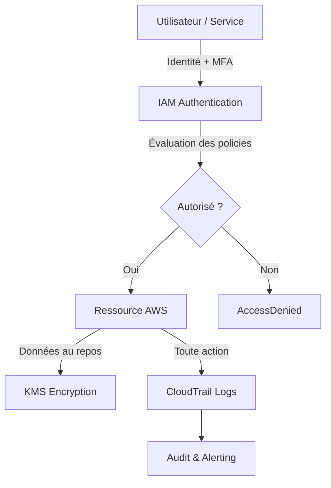

# Sécurité AWS — IAM, MFA, Encryption

## Objectifs pédagogiques

À la fin de ce module, vous serez capable de :

- Expliquer le modèle de responsabilité partagée AWS et identifier ce qui relève du client
- Activer et vérifier le MFA sur un compte root et sur des utilisateurs IAM
- Décrire le rôle de KMS dans la chaîne de chiffrement AWS et ses implications en cas de suppression de clé
- Appliquer le principe du moindre privilège dans une politique IAM et simuler les permissions effectives
- Auditer l'activité d'un compte via CloudTrail et protéger les logs contre la falsification

---

## Ce que "sécurité AWS" veut dire concrètement

> **SAA-C03** — Si la question mentionne…
> - "who is responsible / qui est responsable" + "patching OS" + "security groups configuration" → **Client** (shared responsibility = le client gère tout ce qui est "dans" le cloud)
> - "who is responsible" + "physical security / sécurité physique" + "hypervisor / hardware" → **AWS** (AWS gère l'infrastructure "du" cloud)
> - "encrypt at rest / chiffrement au repos" + "S3" + "AES-256" + "least overhead / minimum de gestion" → **SSE-S3** (clés gérées par AWS, rotation automatique intégrée)
> - "encrypt at rest" + "S3" + "customer-managed key / clé gérée par le client" + "audit via CloudTrail" → **SSE-KMS** (CMK dans KMS)
> - "encrypt at rest" + "S3" + "client provides key / le client fournit la clé" → **SSE-C** (le client gère tout)
> - "encrypt at rest" + "EBS / RDS / EFS" → chiffrement via **KMS** (activé à la création, pas modifiable après pour EBS/RDS)
> - "encrypt in transit / chiffrement en transit" → **TLS/SSL** (HTTPS, VPN)
> - "bucket policy" + "deny unencrypted uploads / refuser les uploads non chiffrés" → exiger le header `s3:x-amz-server-side-encryption`
> - "header value AES256" → **SSE-S3**. "header value aws:kms" → **SSE-KMS**. Ne pas confondre.
> - ⛔ "S3 objects are public by default / les objets S3 sont publics par défaut" → **FAUX** — tout est **privé par défaut**
> - ⛔ SSE-S3 rotation = **automatique** (gérée par AWS). SSE-KMS rotation = à **activer manuellement** sur la CMK (puis automatique chaque année)

La question qui revient systématiquement quand on débute sur AWS : *qui est responsable de quoi ?* La réponse est structurée par le **modèle de responsabilité partagée**. AWS sécurise l'infrastructure physique — les datacenters, les hyperviseurs, le réseau mondial. Tout ce qui tourne *dessus* — la configuration IAM, les Security Groups, le chiffrement des données, les sauvegardes — c'est votre responsabilité.

Ce découpage a des conséquences concrètes. Un bucket S3 public exposant des données clients n'est pas un bug AWS, c'est une mauvaise configuration côté client. La quasi-totalité des incidents de sécurité cloud documentés ont la même origine : non pas une faille dans l'infrastructure AWS, mais une erreur humaine dans la configuration.

Quatre couches forment le socle de la sécurité AWS :

| Couche | Outil principal | Ce qu'elle protège |
|--------|----------------|-------------------|
| Authentification | IAM + MFA | Qui peut accéder au compte |
| Autorisation | IAM Policies | Ce que chaque identité peut faire |
| Confidentialité des données | KMS + chiffrement | Ce que les données révèlent si elles sont exposées |
| Traçabilité | CloudTrail | Ce qui s'est passé, quand, par qui |

Ces couches ne se substituent pas l'une à l'autre. MFA sans chiffrement ne protège pas vos données si un bucket est mal configuré. Le chiffrement sans audit ne vous dit pas qui a accédé à quoi. Elles fonctionnent ensemble, et c'est leur combinaison qui constitue une posture de sécurité réelle.

<!-- snippet
id: aws_security_shared_responsibility
type: concept
tech: aws
level: beginner
importance: high
format: knowledge
tags: aws,security,cloud,iam
title: Modèle de responsabilité partagée AWS
content: AWS sécurise le datacenter, l'hyperviseur et le réseau physique. La configuration des accès IAM, des Security Groups, du chiffrement et des sauvegardes reste entièrement à la charge du client. Un bucket S3 public ou une instance EC2 compromise est toujours de la responsabilité du client, pas d'AWS.
description: AWS protège l'infrastructure, vous protégez tout ce qui tourne dessus. Cette ligne de partage est non négociable.
-->

---

## Flux de sécurité : de l'authentification à l'audit

Avant d'entrer dans chaque outil, voici comment les couches s'enchaînent dans la réalité. Chaque action AWS — lancer une instance, lire un fichier S3, modifier une policy — passe par ce chemin :



Comprendre ce flux, c'est comprendre où placer les contrôles — et pourquoi une faille à n'importe quel niveau compromet l'ensemble.

---

## IAM — Quand l'accès devient un vecteur de risque

IAM est couvert en détail dans le module 2. Ici, l'angle est différent : comment IAM devient un vecteur de risque quand il est mal configuré, et comment l'utiliser pour réduire la surface d'attaque.

**Le principe fondamental : moindre privilège.** Chaque utilisateur, chaque rôle, chaque service doit avoir uniquement les permissions dont il a besoin — pas plus. En pratique, cela signifie éviter `"Action": "*"` ou `"Resource": "*"` dans vos policies sauf cas exceptionnel explicitement documenté. La commodité de donner `AdministratorAccess` à tout le monde est exactement ce qui transforme une clé volée en catastrophe.

```bash
# Lister les utilisateurs IAM du compte
aws iam list-users

# Lister les policies attachées à un utilisateur
aws iam list-attached-user-policies --user-name <NOM_UTILISATEUR>

# Simuler les permissions effectives d'un utilisateur
aws iam simulate-principal-policy \
  --policy-source-arn arn:aws:iam::<ACCOUNT_ID>:user/<NOM_UTILISATEUR> \
  --action-names <ACTION_AWS>
```

La commande `simulate-principal-policy` est systématiquement sous-utilisée. Elle permet de tester *avant* déploiement si un utilisateur a ou n'a pas un accès donné — sans avoir à provoquer une vraie erreur en production, et sans interpréter manuellement des dizaines de règles imbriquées.

<!-- snippet
id: aws_iam_simulate_policy
type: command
tech: aws
level: beginner
importance: high
format: knowledge
tags: aws,iam,security,policy
title: Simuler les permissions effectives d'un utilisateur IAM
context: Tester les accès effectifs d'un utilisateur avant de déployer, sans risquer une vraie erreur en production
command: aws iam simulate-principal-policy --policy-source-arn arn:aws:iam::<ACCOUNT_ID>:user/<NOM_UTILISATEUR> --action-names <ACTION_AWS>
example: aws iam simulate-principal-policy --policy-source-arn arn:aws:iam::123456789012:user/alice --action-names s3:GetObject
description: Retourne allowed ou implicitDeny pour chaque action testée, selon les policies en vigueur sur cet utilisateur.
-->

<!-- snippet
id: aws_iam_least_privilege
type: tip
tech: aws
level: beginner
importance: high
format: knowledge
tags: aws,iam,security,policy
title: Appliquer le moindre privilège dans IAM
content: Partir de zéro permission et ajouter uniquement ce qui est nécessaire. Éviter "Action: *" et "Resource: *" sauf documentation explicite. Utiliser aws iam simulate-principal-policy pour valider les accès avant déploiement. Les policies gérées AWS (ex : AmazonS3ReadOnlyAccess) sont un bon point de départ à affiner.
description: La plupart des incidents IAM viennent de permissions trop larges accordées par commodité, pas par nécessité.
-->

---

## MFA — Ce qu'un mot de passe seul ne peut pas faire

Un mot de passe peut être volé — phishing, fuite de base de données, credential stuffing. MFA (Multi-Factor Authentication) ajoute une deuxième preuve d'identité, généralement un code OTP (One-Time Password) généré par une application comme Google Authenticator ou Authy. Même en possession du mot de passe, un attaquant ne peut pas se connecter sans ce second facteur physique.

**Le compte root est la priorité absolue.** Le root AWS dispose de droits illimités sur l'ensemble du compte et ne peut pas être restreint par des policies IAM — aucune règle ne peut lui être imposée de l'extérieur. Il doit être protégé par MFA dès la création du compte, et utilisé uniquement pour les opérations qui l'exigent explicitement (changer le plan de support, fermer le compte).

```bash
# Lister tous les dispositifs MFA virtuels du compte
aws iam list-virtual-mfa-devices

# Vérifier le statut MFA d'un utilisateur spécifique
aws iam list-mfa-devices --user-name <NOM_UTILISATEUR>
```

⚠️ Si `list-mfa-devices` retourne une liste vide pour un utilisateur, ce compte n'est protégé que par un mot de passe. En cas de fuite de ce mot de passe — et les fuites arrivent — l'accès est immédiatement compromis sans aucune barrière supplémentaire.

<!-- snippet
id: aws_mfa_root_warning
type: warning
tech: aws
level: beginner
importance: high
format: knowledge
tags: aws,mfa,security,root
title: Compte root sans MFA — risque critique
content: Le compte root AWS a des droits absolus et ne peut pas être restreint par IAM. Sans MFA, un mot de passe volé suffit à compromettre l'intégralité du compte. Activer le MFA sur root est le premier geste de sécurité, avant toute autre configuration.
description: Un compte root sans MFA est une porte ouverte. Aucune autre mesure de sécurité ne compense cette absence.
-->

<!-- snippet
id: aws_mfa_check
type: command
tech: aws
level: beginner
importance: high
format: knowledge
tags: aws,mfa,iam,security
title: Vérifier les dispositifs MFA actifs sur un utilisateur IAM
command: aws iam list-mfa-devices --user-name <NOM_UTILISATEUR>
example: aws iam list-mfa-devices --user-name alice
description: Retourne les MFA configurés pour l'utilisateur. Liste vide = compte protégé par mot de passe uniquement.
-->

---

## KMS — Ce que "chiffrement" signifie vraiment côté AWS

KMS (Key Management Service) est souvent résumé à "le service de chiffrement AWS", ce qui est trompeur. KMS ne stocke pas vos données chiffrées — il stocke et gère les **clés** (CMK, Customer Master Keys) et exécute les opérations cryptographiques. La distinction est importante.

Voici ce qui se passe concrètement quand vous activez le chiffrement sur un bucket S3 ou un volume EBS :

1. Une CMK est créée dans KMS (par vous ou par AWS selon le mode choisi)
2. Quand une donnée est écrite, le service appelle KMS pour obtenir une clé de données dérivée
3. KMS génère cette clé de données, la chiffre avec votre CMK, et la renvoie
4. La clé de données chiffrée et les données sont stockées ensemble — mais la CMK ne quitte jamais KMS
5. À la lecture, le service rappelle KMS pour déchiffrer la clé de données, puis déchiffre les données localement

🧠 L'implication directe : si vous désactivez ou supprimez une CMK, les données chiffrées avec cette clé deviennent **immédiatement inaccessibles**, même si les fichiers existent physiquement sur S3 ou EBS. C'est à la fois la force du système — révocation instantanée sans toucher aux données — et son risque — une suppression accidentelle équivaut à une perte de données définitive.

```bash
# Lister les CMK du compte
aws kms list-keys

# Décrire une clé KMS — état, usage, date de création
aws kms describe-key --key-id <KEY_ID>

# Vérifier si la rotation automatique est activée sur une clé
aws kms get-key-rotation-status --key-id <KEY_ID>
```

<!-- snippet
id: aws_kms_cmk_concept
type: concept
tech: aws
level: beginner
importance: high
format: knowledge
tags: aws,kms,encryption,security
title: Comment KMS chiffre vos données en pratique
content: KMS stocke les clés (CMK), pas les données. Les services AWS appellent KMS à chaque opération de lecture/écriture pour obtenir ou révoquer l'accès aux clés de données. Désactiver une CMK rend les données inaccessibles immédiatement, même si les fichiers chiffrés existent toujours sur le disque ou dans S3.
description: La révocation d'accès aux données passe par la désactivation de la CMK — pas par la suppression des fichiers.
-->

<!-- snippet
id: aws_kms_describe_key
type: command
tech: aws
level: beginner
importance: medium
format: knowledge
tags: aws,kms,encryption
title: Inspecter l'état d'une clé KMS
command: aws kms describe-key --key-id <KEY_ID>
example: aws kms describe-key --key-id 1234abcd-12ab-34cd-56ef-1234567890ab
description: Retourne l'état de la clé (Enabled/Disabled), son usage et sa date de création. Utile pour vérifier qu'une clé critique est bien active avant de constater une erreur de déchiffrement.
-->

---

## CloudTrail — Chaque action laisse une trace

CloudTrail enregistre chaque appel d'API effectué sur votre compte AWS : qui a lancé quelle instance, qui a modifié quelle policy, qui a supprimé quel bucket. Sans CloudTrail actif, vous n'avez aucune visibilité sur ce qui s'est passé en cas d'incident — et en pratique, vous ne saurez même pas qu'un incident a eu lieu.

```bash
# Lister les trails configurés
aws cloudtrail describe-trails

# Vérifier si un trail est actif
aws cloudtrail get-trail-status --name <NOM_DU_TRAIL>

# Rechercher des événements récents filtrés par service
aws cloudtrail lookup-events \
  --lookup-attributes AttributeKey=EventSource,AttributeValue=<SOURCE_SERVICE> \
  --max-results <NOMBRE>
```

💡 Par défaut, CloudTrail conserve 90 jours d'historique dans la console. Pour un audit long terme ou une conformité réglementaire, il faut configurer un trail persistant vers un bucket S3 — avec versioning activé pour empêcher la suppression des preuves.

Un détail que beaucoup ignorent : CloudTrail s'active par région. Un attaquant qui sait que vous surveillez `eu-west-1` peut opérer dans `us-east-1` sans être vu. L'option "Apply to all regions" dans la configuration du trail ferme ce vecteur en un seul paramètre.

<!-- snippet
id: aws_cloudtrail_lookup
type: command
tech: aws
level: beginner
importance: medium
format: knowledge
tags: aws,cloudtrail,audit,security
title: Rechercher des événements récents dans CloudTrail
context: Utile après un incident pour retrouver qui a fait quoi, ou pour vérifier une activité suspecte sur IAM ou S3
command: aws cloudtrail lookup-events --lookup-attributes AttributeKey=EventSource,AttributeValue=<SOURCE_SERVICE> --max-results <NOMBRE>
example: aws cloudtrail lookup-events --lookup-attributes AttributeKey=EventSource,AttributeValue=iam.amazonaws.com --max-results 20
description: Retourne les événements les plus récents filtrés par source de service. Historique limité à 90 jours sans trail S3 configuré.
-->

<!-- snippet
id: aws_cloudtrail_integrity
type: tip
tech: aws
level: beginner
importance: medium
format: knowledge
tags: aws,cloudtrail,security,audit
title: Activer la validation d'intégrité des logs CloudTrail
content: Avec --enable-log-file-validation, CloudTrail génère un fichier de digest signé toutes les heures. Si un log est modifié ou supprimé, la validation échoue. Combiner avec le versioning S3 sur le bucket de destination pour rendre la suppression des preuves impossible.
description: Un attaquant qui compromet un compte cherche à effacer les logs. La validation d'intégrité rend cette tentative détectable.
-->

---

## Cas réel : une clé commitée, 40 000 € de facture en 18 heures

**Contexte.** Une startup SaaS déploie son application sur AWS. Un développeur commite accidentellement ses clés d'accès (`AWS_ACCESS_KEY_ID` + `AWS_SECRET_ACCESS_KEY`) dans un dépôt GitHub public. En moins de 4 minutes, des bots automatisés détectent les clés et provisionnent des centaines d'instances EC2 pour du minage de cryptomonnaie. La facture grimpe à 40 000 € en 18 heures.

Ce n'est pas un scénario hypothétique — c'est un type d'incident documenté et récurrent. La rapidité des bots (moins de 5 minutes entre la publication et l'exploitation) rend toute réaction manuelle insuffisante.

**Ce qui a rendu l'attaque possible :**
- Aucun MFA sur l'utilisateur concerné → les clés seules suffisaient
- Droits `AdministratorAccess` sur ces clés → liberté totale une fois à l'intérieur
- Aucune alerte sur les pics de coût ou de création de ressources → détection uniquement à la réception de la facture
- CloudTrail non configuré → aucune visibilité sur l'étendue de la compromission

**Remédiation, dans l'ordre d'urgence :**

1. Désactivation immédiate des clés compromises
2. Rotation forcée de toutes les clés d'accès du compte
3. Activation du MFA sur tous les utilisateurs humains
4. Réécriture des policies IAM avec moindre privilège — exit `AdministratorAccess` pour les développeurs
5. Configuration d'un budget AWS avec alerte à déclenchement précoce
6. Activation de CloudTrail persistant vers S3 avec versioning

**Résultats :** AWS a partiellement remboursé la facture (le cas était documenté et reconnu). L'équipe a réduit sa surface d'attaque de manière significative en révoquant les permissions inutiles, et le délai de détection d'une activité anormale est passé de "à la prochaine facture" à moins de 5 minutes grâce aux alertes CloudWatch.

<!-- snippet
id: aws_credentials_leak_warning
type: warning
tech: aws
level: beginner
importance: high
format: knowledge
tags: aws,security,iam,incident
title: Clés AWS dans le code source — vecteur d'attaque n°1
content: Des bots scannent GitHub en continu à la recherche de clés AWS. Une clé commitée dans un dépôt public est exploitée en moins de 5 minutes. Ne jamais écrire de clés dans le code. Utiliser des variables d'environnement, des secrets managers ou des rôles IAM attachés aux services. Si des clés sont exposées : désactiver immédiatement via aws iam delete-access-key, puis auditer CloudTrail pour mesurer l'impact.
description: Un dépôt public avec des clés AWS est compromis avant que vous n'ayez le temps de réagir manuellement.
-->

---

## Bonnes pratiques

**MFA obligatoire sur tout compte humain, root en priorité absolue.**
Le root ne doit servir qu'aux opérations qui l'exigent explicitement. Pour tout le reste, des utilisateurs IAM ou des rôles suffisent — et peuvent être contraints par des policies.

**Appliquer le moindre privilège systématiquement.**
Commencer par zéro permission et ajouter ce qui est nécessaire, plutôt que de partir d'`AdministratorAccess` et de restreindre après coup. Les policies gérées AWS (`AmazonS3ReadOnlyAccess`, etc.) sont un bon point de départ à affiner avec des policies inline selon le besoin réel.

**Ne jamais créer de clés d'accès pour le compte root.**
Les clés root ont des droits illimités et ne peuvent pas être restreintes. Si elles existent dans votre compte, les supprimer immédiatement — leur existence seule est un risque.

**Activer la rotation automatique des clés KMS.**
KMS permet de configurer une rotation annuelle automatique des CMK. Cela réduit la fenêtre d'exposition en cas de compromission d'une clé sans nécessiter d'intervention manuelle.

**Configurer CloudTrail sur toutes les régions, pas seulement la région principale.**
L'option "Apply to all regions" dans CloudTrail ferme le vecteur qui consiste à opérer dans une région non surveillée. Un seul paramètre, un impact significatif.

**Activer AWS Config pour détecter les dérives de configuration.**
AWS Config surveille en continu l'état de vos ressources et alerte quand une configuration dévie d'une règle définie — bucket S3 public, Security Group avec port 22 ouvert sur `0.0.0.0/0`, utilisateur sans MFA. C'est de la détection continue, pas ponctuelle.

**Protéger les logs CloudTrail contre la modification.**
Activer la validation d'intégrité des logs et le versioning sur le bucket S3 de destination. Un attaquant qui pénètre un compte cherchera à effacer ses traces. Rendre cela impossible — ou au moins détectable — fait partie de la stratégie de défense.

---

## Résumé

La sécurité AWS repose sur quatre couches complémentaires : IAM contrôle qui peut faire quoi, MFA garantit qu'un mot de passe volé ne suffit pas à compromettre un compte, KMS protège les données même si le stockage est accessible, et CloudTrail assure que chaque action laisse une trace exploitable. Ces couches se renforcent mutuellement — en enlever une affaiblit les autres.

Deux actions concentrent le plus d'impact immédiat : activer le MFA sur le compte root, et appliquer le moindre privilège dans toutes les policies IAM. La majorité des incidents documentés sur AWS auraient pu être évités avec ces deux mesures seules.

Le module suivant aborde le Load Balancing et l'Auto Scaling — des mécanismes qui s'appuient sur des rôles IAM et des Security Groups correctement configurés pour fonctionner de manière sécurisée à grande échelle.
