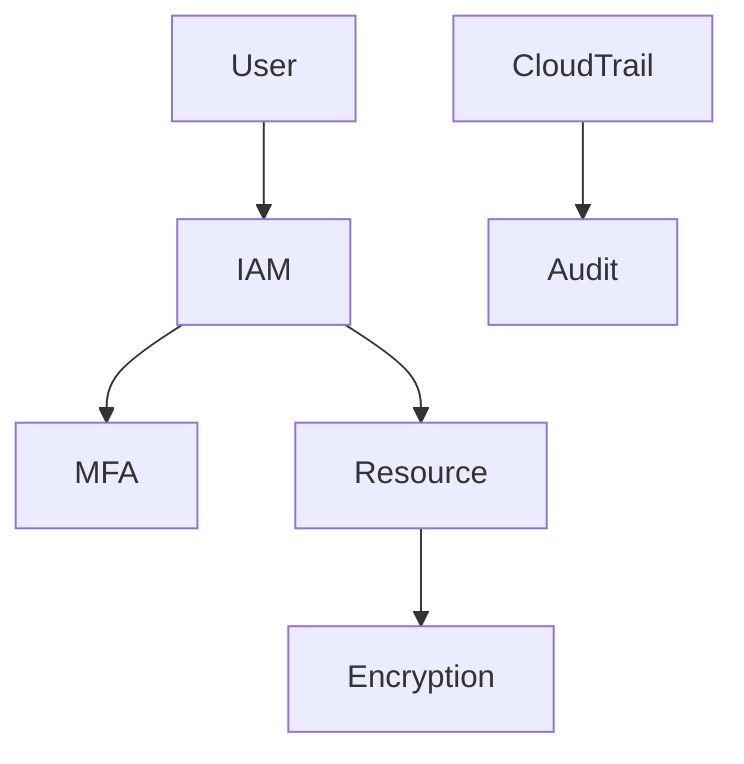

# Sécurité AWS — IAM, MFA, Encryption

## Objectifs pédagogiques

- Comprendre les fondamentaux de la sécurité AWS
- Mettre en place MFA et sécuriser les comptes
- Comprendre les mécanismes de chiffrement
- Appliquer les bonnes pratiques de sécurité
- Identifier les risques critiques en production

## Contexte et problématique

Le cloud introduit de nouveaux risques :

- Accès à distance
- Mauvaise configuration
- Fuites de données

AWS fournit des outils puissants, mais mal utilisés → catastrophe.

## Architecture

| Composant | Rôle | Exemple |
|-----------|------|---------|
| IAM | Gestion accès | policies |
| MFA | Auth forte | OTP |
| KMS | Gestion clés | encryption |
| SG | Firewall | ports |
| CloudTrail | Audit | logs |



## Commandes essentielles

```bash
aws iam list-users
```

```bash
aws kms list-keys
```

```bash
aws cloudtrail describe-trails
```

## Fonctionnement interne

1. Authentification (IAM + MFA)
2. Autorisation (policies)
3. Chiffrement (KMS)
4. Audit (CloudTrail)

🧠 Concept clé  
→ Sécurité AWS = configuration utilisateur

💡 Astuce  
→ Activer MFA sur tous les comptes

⚠️ Erreur fréquente  
→ Laisser root actif sans MFA  
Correction : sécuriser root immédiatement

## Cas réel en entreprise

Contexte :

Fuite de credentials.

Solution :

- Rotation des clés
- MFA obligatoire
- Restriction IAM

Résultat :

- Réduction risques
- Meilleure traçabilité

## Bonnes pratiques

- Activer MFA partout
- Ne jamais utiliser root
- Chiffrer toutes les données
- Utiliser KMS
- Restreindre accès IAM
- Auditer régulièrement
- Monitorer via CloudTrail

## Résumé

La sécurité AWS repose sur IAM, MFA et encryption.  
Les erreurs humaines sont la principale cause d’incident.  
Une bonne configuration est essentielle.

---

## SNIPPETS DE RÉVISION

<!-- snippet
id: aws_security_definition
type: concept
tech: aws
level: beginner
importance: high
format: knowledge
tags: aws,security,cloud
title: Sécurité AWS principe
content: AWS applique le modèle de responsabilité partagée : AWS sécurise le datacenter et l'hyperviseur, mais la configuration des accès IAM, des Security Groups, du chiffrement et des sauvegardes reste entièrement à la charge du client.
description: Une instance EC2 compromise ou un bucket S3 public ouvert est toujours de la responsabilité du client, pas d'AWS.
-->

<!-- snippet
id: aws_mfa_importance
type: concept
tech: aws
level: beginner
importance: high
format: knowledge
tags: aws,mfa,security
title: MFA importance
content: Le MFA ajoute une couche de sécurité essentielle en plus du mot de passe
description: Protection critique
-->

<!-- snippet
id: aws_root_warning
type: warning
tech: aws
level: beginner
importance: high
format: knowledge
tags: aws,security,error
title: Utiliser root
content: Utiliser le compte root expose à des risques majeurs, utiliser IAM à la place
description: Erreur critique AWS
-->

<!-- snippet
id: aws_kms_definition
type: concept
tech: aws
level: beginner
importance: medium
format: knowledge
tags: aws,kms,encryption
title: KMS rôle
content: KMS ne stocke pas les données chiffrées — il stocke les clés (CMK) et exécute les opérations de chiffrement/déchiffrement. Les services AWS (S3, RDS, EBS) appellent KMS à chaque accès, ce qui permet de révoquer l'accès aux données en désactivant la clé.
description: Désactiver une CMK KMS rend les données inaccessibles immédiatement, même si les fichiers chiffrés existent toujours.
-->

<!-- snippet
id: aws_security_tip
type: tip
tech: aws
level: beginner
importance: medium
format: knowledge
tags: aws,security,bestpractice
title: Sécuriser AWS
content: IAM contrôle qui peut faire quoi, MFA empêche l'accès même si le mot de passe fuite, et le chiffrement KMS garantit que les données restent illisibles même en cas d'accès physique au stockage. Aucune des trois couches ne remplace les deux autres.
description: Activer MFA sur le compte root et sur tous les utilisateurs humains est le minimum absolu avant tout déploiement.
-->

<!-- snippet
id: aws_security_error
type: warning
tech: aws
level: beginner
importance: high
format: knowledge
tags: aws,security,incident
title: Mauvaise config sécurité
content: Symptôme accès non autorisé, cause mauvaise policy IAM, correction appliquer least privilege
description: Incident fréquent
-->
