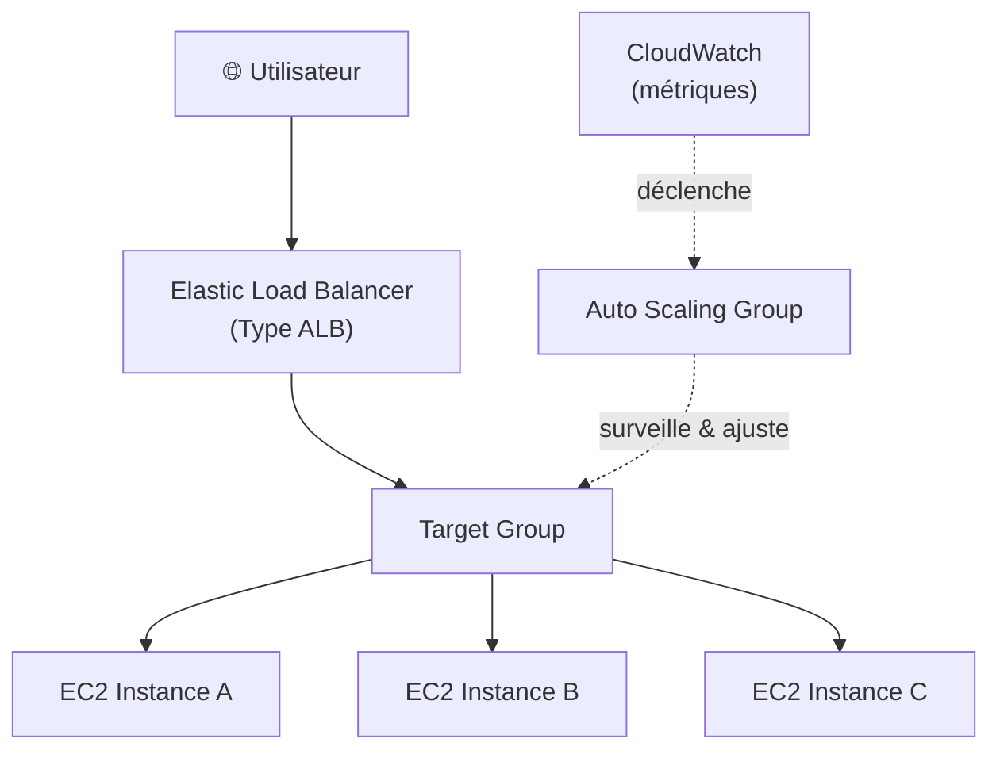

# Load Balancer & Auto Scaling — Scalabilité AWS

## Objectifs pédagogiques

À la fin de ce module, tu seras capable de :

- Expliquer pourquoi une architecture mono-instance est inacceptable en production
- Différencier ALB et NLB et choisir le bon type selon le protocole et les contraintes de latence
- Configurer un Auto Scaling Group avec des politiques de scaling basées sur des métriques CloudWatch
- Mettre en place des health checks qui reflètent l'état réel de l'application, pas juste un HTTP 200 statique
- Concevoir une architecture scalable et résiliente en combinant ELB et ASG sur plusieurs AZ

---

## Le problème que ça résout

Imagine une instance EC2 unique qui héberge ton application. Un lundi matin, une campagne marketing fait ×10 le trafic habituel. Résultat prévisible : CPU à 100 %, latence qui explose, erreurs 502 en cascade, puis arrêt complet.

C'est le SPOF — *Single Point of Failure* — dans sa forme la plus brutale. Une seule machine, une seule chose à rater.

AWS répond à ce problème avec deux mécanismes complémentaires :

- **Elastic Load Balancing (ELB)** distribue le trafic entrant sur plusieurs instances et supprime le point unique de défaillance
- **Auto Scaling Groups (ASG)** ajustent dynamiquement le nombre d'instances selon la charge réelle — plus d'instances quand le trafic monte, moins quand il redescend

L'un sans l'autre reste incomplet : un load balancer sans scaling ne résout pas les pics de charge, un ASG sans load balancer ne distribue pas le trafic entre les instances. C'est leur combinaison qui rend une architecture réellement élastique.

---

## Architecture : ce qui se passe entre l'utilisateur et ton app



Le flux est simple : le trafic arrive sur le Load Balancer, qui le route vers un **Target Group** — un ensemble d'instances enregistrées et considérées comme saines. L'ASG surveille en parallèle les métriques CloudWatch et décide d'ajouter ou de retirer des instances dans ce groupe.

### Quel type de Load Balancer choisir ?

Le service AWS de load balancing (ELB) propose plusieurs types de Load Balancers, chacun adapté à des cas d’usage différents.

| Type | Protocole | Cas d'usage typique | Niveau OSI (Open Systems Interconnection) |
|------|-----------|---------------------|------------|
| **ALB** — Application Load Balancer | HTTP / HTTPS / WebSocket | Applications web, APIs REST, microservices | 7 (applicatif) |
| **NLB** — Network Load Balancer | TCP / UDP / TLS | Latence ultra-faible, flux non-HTTP, VoIP, jeux | 4 (transport) |
| **CLB** — Classic Load Balancer | HTTP / TCP | Legacy uniquement — ne pas utiliser pour de nouveaux projets | 4 et 7 |

Pour la grande majorité des applications web modernes, **ALB est le bon choix**. Parce qu'il opère au niveau applicatif, il comprend le contenu des requêtes HTTP — ce qui ouvre des possibilités de routage avancé : envoyer `/api/*` vers un groupe d'instances dédié au backend, `/static/*` vers un autre optimisé pour le contenu statique.

Le NLB s'impose dans deux cas précis : tu as besoin de latences sub-milliseconde, ou tu travailles avec des protocoles non-HTTP (TCP brut, UDP, flux temps réel).

> **SAA-C03** — Si la question mentionne…
> - "HTTP / HTTPS" + "path-based routing / routing par chemin" + "microservices" → **ALB** (Layer 7)
> - "ultra-low latency / latence ultra-faible" + "TCP / UDP" + "static IP / IP statique" → **NLB** (Layer 4)
> - "network appliances / appliances réseau" + "firewall / IDS" → **GLB** (Gateway Load Balancer, Layer 3)
> - "distribute evenly across AZs / distribuer uniformément entre les AZ" → activer **cross-zone load balancing**
> - "traffic always goes to same instance / trafic toujours vers la même instance" + "stateless" → désactiver **sticky sessions**
> - "session affinity / affinité de session" + "stateful application" → activer **sticky sessions** (mais préférer externaliser les sessions vers ElastiCache/DynamoDB)
> - ⛔ "Classic Load Balancer / CLB" → **ne jamais** proposer pour de nouvelles architectures (legacy uniquement)
> - ⛔ Un ELB fonctionne dans **une seule région** — si "multi-region / multi-région" → utiliser **Route 53** devant les ELB

<!-- snippet
id: aws_alb_vs_nlb_choice
type: concept
tech: aws
level: intermediate
importance: high
format: knowledge
tags: aws,alb,nlb,loadbalancer
title: Choisir entre ALB et NLB
content: ALB opère au niveau applicatif (HTTP/HTTPS) et permet le routage par path, host header ou query string. NLB opère au niveau transport (TCP/UDP), offre des latences sub-milliseconde et expose une IP statique. Pour une application web classique ou une API REST, ALB est systématiquement le bon choix. NLB s'impose uniquement pour les protocoles non-HTTP ou les contraintes de latence extrêmes.
description: ALB pour HTTP/HTTPS avec routage intelligent, NLB pour TCP/UDP ultra-basse latence ou IP statique requise.
-->

---

## Commandes essentielles

### Inspecter les Load Balancers existants

```bash
# Lister tous les Load Balancers du compte
aws elbv2 describe-load-balancers
```

```bash
# Filtrer sur un LB précis par nom
aws elbv2 describe-load-balancers --names <NOM_DU_LB>
```

<!-- snippet
id: aws_elb_describe
type: command
tech: aws
level: intermediate
importance: medium
format: knowledge
tags: aws,cli,elb,elbv2
title: Lister les Load Balancers
command: aws elbv2 describe-load-balancers --names <NOM_DU_LB>
example: aws elbv2 describe-load-balancers --names mon-alb-production
description: Affiche la configuration complète d'un ou plusieurs Load Balancers : ARN, DNS name, état, subnets associés, scheme (internet-facing ou internal).
-->

### Inspecter les Auto Scaling Groups

```bash
# Lister tous les ASG du compte
aws autoscaling describe-auto-scaling-groups
```

```bash
# Cibler un ASG précis par nom
aws autoscaling describe-auto-scaling-groups \
  --auto-scaling-group-names <NOM_ASG>
```

<!-- snippet
id: aws_asg_describe
type: command
tech: aws
level: intermediate
importance: medium
format: knowledge
tags: aws,cli,autoscaling,asg
title: Inspecter un Auto Scaling Group
command: aws autoscaling describe-auto-scaling-groups --auto-scaling-group-names <NOM_ASG>
example: aws autoscaling describe-auto-scaling-groups --auto-scaling-group-names asg-web-production
description: Retourne la configuration complète de l'ASG : min/max/desired, liste des instances actives, politiques de scaling attachées, configuration des health checks.
-->

### Ajuster manuellement la capacité désirée

```bash
aws autoscaling set-desired-capacity \
  --auto-scaling-group-name <NOM_ASG> \
  --desired-capacity <NOMBRE>
```

<!-- snippet
id: aws_asg_set_desired
type: command
tech: aws
level: intermediate
importance: high
format: knowledge
tags: aws,cli,autoscaling,scaling
title: Forcer la capacité désirée d'un ASG
command: aws autoscaling set-desired-capacity --auto-scaling-group-name <NOM_ASG> --desired-capacity <NOMBRE>
example: aws autoscaling set-desired-capacity --auto-scaling-group-name asg-web-production --desired-capacity 5
description: Force le nombre d'instances souhaitées. Utile pour un scale-out manuel avant un événement prévisible. La valeur doit rester dans les bornes min et max de l'ASG.
-->

### Créer une politique de scaling par suivi de cible

La config de la politique est passée dans un fichier JSON séparé. Exemple pour maintenir le CPU autour de 60 % :

```json
{
  "TargetValue": 60.0,
  "PredefinedMetricSpecification": {
    "PredefinedMetricType": "ASGAverageCPUUtilization"
  }
}
```

```bash
aws autoscaling put-scaling-policy \
  --auto-scaling-group-name <NOM_ASG> \
  --policy-name <NOM_POLITIQUE> \
  --policy-type TargetTrackingScaling \
  --target-tracking-configuration file://<FICHIER_CONFIG.json>
```

<!-- snippet
id: aws_asg_scaling_policy
type: command
tech: aws
level: intermediate
importance: high
format: knowledge
tags: aws,cli,autoscaling,policy,cloudwatch
title: Créer une politique de scaling Target Tracking
command: aws autoscaling put-scaling-policy --auto-scaling-group-name <NOM_ASG> --policy-name <NOM_POLITIQUE> --policy-type TargetTrackingScaling --target-tracking-configuration file://<FICHIER_CONFIG.json>
example: aws autoscaling put-scaling-policy --auto-scaling-group-name asg-web-prod --policy-name cpu-tracking --policy-type TargetTrackingScaling --target-tracking-configuration file://cpu-policy.json
description: Crée une politique Target Tracking. AWS calcule seul combien d'instances lancer ou terminer pour maintenir la métrique cible (ex : CPU moyen à 60%).
-->

### Surveiller les métriques d'un ASG en temps réel

```bash
aws cloudwatch get-metric-statistics \
  --namespace AWS/AutoScaling \
  --metric-name GroupInServiceInstances \
  --dimensions Name=AutoScalingGroupName,Value=<NOM_ASG> \
  --start-time <DEBUT_ISO8601> \
  --end-time <FIN_ISO8601> \
  --period 60 \
  --statistics Average
```

<!-- snippet
id: aws_asg_cloudwatch_metrics
type: command
tech: aws
level: intermediate
importance: medium
format: knowledge
tags: aws,cli,cloudwatch,autoscaling,monitoring
title: Récupérer les métriques d'instances en service d'un ASG
command: aws cloudwatch get-metric-statistics --namespace AWS/AutoScaling --metric-name GroupInServiceInstances --dimensions Name=AutoScalingGroupName,Value=<NOM_ASG> --start-time <DEBUT_ISO8601> --end-time <FIN_ISO8601> --period 60 --statistics Average
example: aws cloudwatch get-metric-statistics --namespace AWS/AutoScaling --metric-name GroupInServiceInstances --dimensions Name=AutoScalingGroupName,Value=asg-web-prod --start-time 2024-01-15T08:00:00Z --end-time 2024-01-15T09:00:00Z --period 60 --statistics Average
description: Retourne le nombre d'instances en service sur la période. Utile pour vérifier qu'un scaling-out s'est bien déclenché ou détecter une chute anormale.
-->

---

## Fonctionnement interne

### Le cycle de vie d'une requête

Quand un utilisateur envoie une requête HTTPS, voilà ce qui se passe réellement :

1. Le DNS résout le nom du Load Balancer vers l'une de ses IPs publiques
2. L'ALB reçoit la requête, inspecte les headers HTTP et applique ses règles de routage
3. Il sélectionne une instance saine dans le Target Group (round-robin par défaut)
4. La requête est transmise à cette instance, la réponse remonte par le même chemin

💡 Le DNS du Load Balancer pointe vers plusieurs IPs qui changent régulièrement. Ne jamais hardcoder une IP d'ALB — toujours utiliser le nom DNS fourni par AWS (`xxx.elb.amazonaws.com`). C'est vrai aussi côté application quand une instance doit appeler le LB en interne.

### Les health checks : le mécanisme critique

Le Load Balancer sonde régulièrement chaque instance sur un endpoint défini (par exemple `GET /health HTTP/1.1`). Si une instance ne répond pas avec un code 2xx dans le délai imparti, elle est marquée *unhealthy* et sort de la rotation — plus aucune requête ne lui est envoyée jusqu'à ce qu'elle redevienne saine.

⚠️ Un health check mal configuré est l'une des causes les plus fréquentes d'incidents silencieux en production. Deux scénarios désastreux :
- **Trop permissif** : ton endpoint `/health` retourne 200 même quand la base de données est inaccessible. Le LB continue à envoyer du trafic vers des instances qui échouent sur chaque requête réelle.
- **Trop strict** : timeout trop court ou threshold trop bas. Des instances temporairement lentes mais fonctionnelles sont retirées de la rotation, aggravant la charge sur les instances restantes — effet cascade garanti.

<!-- snippet
id: aws_health_check_warning
type: warning
tech: aws
level: intermediate
importance: high
format: knowledge
tags: aws,elb,healthcheck,incident
title: Health check mal configuré — deux façons de provoquer un incident
content: |
  - Trop permissif : /health retourne 200 même si RDS ou Redis est inaccessible — le LB envoie du trafic vers des instances qui échouent sur chaque requête
  - Trop strict : timeout trop court ou threshold trop bas — des instances saines mais lentes sont retirées, aggravant la charge sur les restantes
description: L'endpoint /health doit refléter l'état réel des dépendances critiques. Tester les deux scénarios : instance saine et instance dégradée.
-->

### Comment l'ASG prend ses décisions

Un Auto Scaling Group est défini par trois valeurs fondamentales :

- `min` : le plancher — l'ASG ne descendra jamais en dessous
- `max` : le plafond — l'ASG ne montera jamais au-delà
- `desired` : la cible courante — combien d'instances l'ASG essaie de maintenir actives

Les politiques de scaling définissent comment `desired` évolue dans le temps :

- **Target Tracking** : "Maintiens le CPU moyen autour de 60 %." AWS calcule seul combien d'instances lancer ou terminer. C'est le mode recommandé pour la plupart des cas — simple à configurer, efficace.
- **Step Scaling** : "Si CPU > 70 %, ajoute 2 instances. Si CPU > 90 %, ajoute 5 instances." Plus de contrôle, plus de configuration à maintenir.
- **Scheduled Scaling** : "Chaque lundi à 8h, passe à 10 instances." Complémentaire des deux précédents pour des pics prévisibles.

🧠 Le scaling-out (ajout d'instances) est rapide — de l'ordre de quelques minutes. Le scaling-in (suppression) inclut intentionnellement un délai appelé *cooldown*, typiquement 300 secondes. L'objectif : éviter le thrashing — lancer puis détruire des instances en boucle parce que la charge fluctue autour du seuil de déclenchement.

> **SAA-C03** — Si la question mentionne…
> - "maintain CPU at X% / maintenir le CPU à X%" → **Target Tracking** policy (la plus simple, recommandée)
> - "if CPU > 70% add 2, if > 90% add 5 / si CPU > 70% ajouter 2" → **Step Scaling** policy
> - "every Monday at 8 AM / chaque lundi à 8h" + "predictable peaks / pics prévisibles" → **Scheduled Scaling**
> - "scale-in policy" + "which instance terminated / quelle instance terminée" → default = **AZ la plus peuplée** → **plus ancien launch template**
> - "change AMI / changer d'AMI" dans un ASG → créer un **nouveau launch template** (immuable après création)
> - "fault tolerance / tolérance aux pannes" + "N instances minimum" → répartir sur >= 2 AZ avec `ceil(N / (nb_AZ - 1))` par AZ
> - ⛔ "min = 0" + "desired = 0" → l'ASG sera **vide** (aucune instance) — attention si la question exige "always running / toujours actif"

<!-- snippet
id: aws_autoscaling_group_concept
type: concept
tech: aws
level: intermediate
importance: high
format: knowledge
tags: aws,autoscaling,asg,scaling,cloudwatch
title: Fonctionnement d'un Auto Scaling Group
content: |
  Un ASG est défini par 3 valeurs : `min` (plancher), `max` (plafond), `desired` (cible courante modifiée par les politiques).
  - Target Tracking (recommandé) : AWS ajuste `desired` pour atteindre une métrique cible (ex : CPU à 60%)
  - Step Scaling : règles conditionnelles par seuils
  - Scheduled Scaling : ajustements planifiés pour des pics prévisibles
  Le cooldown (défaut 300s) évite les oscillations rapides entre scale-out et scale-in.
description: Ne pas confondre desired (cible courante, modifiable) et min/max (limites absolues). desired=0 avec min=0 = ASG vide.
-->

### Pourquoi les instances doivent être stateless

C'est la contrainte architecturale que beaucoup oublient avant de mettre en place un ASG. Si une instance conserve un état local — sessions PHP en mémoire, fichiers uploadés sur son disque — l'ASG ne peut pas la terminer librement sans perdre des données ou déconnecter des utilisateurs actifs.

Le test est simple : si une instance est terminée immédiatement et sans préavis, le service continue-t-il sans perte ? Si non, il reste de l'état local à externaliser.

<!-- snippet
id: aws_asg_stateless_tip
type: tip
tech: aws
level: intermediate
importance: high
format: knowledge
tags: aws,autoscaling,stateless,architecture,elasticache,s3
title: Stateless — prérequis indispensable au scaling élastique
content: Toute instance stockant un état local (sessions en mémoire, fichiers sur disque) ne peut pas être terminée sans perte — l'ASG ne peut pas scaler librement. Externaliser les sessions vers ElastiCache et les fichiers vers S3 avant d'activer le scaling. Test de validation : terminer une instance en cours d'utilisation et vérifier qu'aucun utilisateur ne perd sa session.
description: Externaliser sessions (ElastiCache) et fichiers (S3) avant d'activer l'ASG. C'est un prérequis, pas une optimisation.
-->

---

## Cas réel en entreprise

**Contexte** : une plateforme e-commerce B2C héberge son front web PHP sur une flotte EC2 derrière un ALB. En semaine ordinaire, 3 instances suffisent largement. Mais chaque vendredi soir et lors des événements promotionnels (Black Friday, soldes), le trafic multiplie par 8 en moins de 30 minutes.

**Avant l'architecture scalable** : une instance unique avec une Elastic IP. Chaque pic se soldait par des temps de réponse dépassant les 10 secondes, des pannes de 20 à 45 minutes, et des pertes de revenus directes estimées à 15 000 € par incident. L'équipe ops était en astreinte permanente les jours de campagne.

**Ce qui a été mis en place** :
- ALB avec deux subnets publics dans deux AZ différentes (résilience sur la couche réseau)
- Sessions PHP migrées vers ElastiCache Redis — l'étape préalable indispensable
- ASG configuré : `min=2`, `max=12`, `desired=3`
- Politique Target Tracking sur CPU moyen, cible à 60 %
- Health check sur `/health` vérifiant la connexion à RDS et au cache Redis
- Cooldown à 300 secondes pour absorber les fluctuations sans thrashing

**Résultats mesurés** :
- Temps de réponse maintenu sous 800 ms lors du Black Friday, pic à 24 instances atteint automatiquement en 18 minutes
- Zéro panne due à la surcharge depuis la mise en production
- Réduction des coûts de 34 % en dehors des pics (scaling-in automatique la nuit et le week-end)

L'ordre des opérations a été déterminant : migrer les sessions *avant* d'activer l'ASG. Les premières tentatives sans cette étape avaient provoqué des déconnexions en série à chaque scaling-in.

---

## Bonnes pratiques

**ALB plutôt que CLB pour tout nouveau projet.** Le Classic Load Balancer est maintenu pour la compatibilité ascendante, pas pour être utilisé. ALB supporte HTTP/2, WebSocket, le routage par path et host header, et s'intègre nativement avec WAF. Il n'y a aucune raison de choisir CLB aujourd'hui.

**Un endpoint `/health` qui vérifie vraiment quelque chose.** Un endpoint qui retourne 200 inconditionnellement n'est pas un health check, c'est un mensonge. Il doit vérifier que la base de données est accessible, que Redis répond, que les dépendances critiques sont opérationnelles. Et le tester en simulant une panne réelle.

**`min ≥ 2` en production, toujours.** Avec `min=0`, un bug dans le health check ou une politique trop agressive peut vider complètement l'ASG. Deux instances minimum garantissent la disponibilité et permettent les updates en rolling sans interruption.

**Subnets sur au moins deux AZ.** Le Load Balancer et l'ASG doivent couvrir plusieurs Availability Zones. Si une AZ devient indisponible — ça arrive — l'autre continue à servir le trafic. Une seule AZ annule l'essentiel du bénéfice de résilience.

**Target Tracking comme point de départ, Step Scaling en complément si nécessaire.** Target Tracking est plus simple à configurer et suffisant pour la majorité des workloads. Step Scaling est utile quand tu veux des comportements différenciés selon l'intensité de la charge. Scheduled Scaling vient en complément pour les pics prévisibles.

**Externaliser l'état avant d'activer le scaling — pas après.** Sessions dans ElastiCache, fichiers dans S3. C'est un prérequis architectural, pas une optimisation à faire plus tard.

**Surveiller `GroupInServiceInstances` dans CloudWatch.** Cette métrique indique combien d'instances sont actuellement actives dans l'ASG. Créer une alarme sur `GroupInServiceInstances < min` pour détecter immédiatement un problème de scaling — avant que les utilisateurs ne le signalent.

<!-- snippet
id: aws_asg_min_instances_warning
type: warning
tech: aws
level: intermediate
importance: high
format: knowledge
tags: aws,autoscaling,production,incident
title: min=0 dans un ASG de production — risque de panne totale silencieuse
content: Avec min=0, un bug dans le health check, une politique de scaling mal calibrée ou une erreur de configuration peut terminer toutes les instances du groupe sans aucune alerte. En production, min doit être au moins 2 (une instance par AZ) pour garantir la disponibilité en continu. Créer systématiquement une alarme CloudWatch sur GroupInServiceInstances < valeur_min pour détecter ce scénario avant que le service ne soit complètement hors ligne.
description: Ne jamais laisser min=0 en production. Coupler avec une alarme CloudWatch sur GroupInServiceInstances pour détecter une chute anormale.
-->

<!-- snippet
id: aws_alb_multi_az_tip
type: tip
tech: aws
level: intermediate
importance: high
format: knowledge
tags: aws,alb,autoscaling,availability-zones,resilience
title: Toujours distribuer ALB et ASG sur plusieurs AZ
content: Configurer le Load Balancer et l'ASG sur des subnets dans au moins deux Availability Zones différentes. Si une AZ devient indisponible, l'ALB redirige automatiquement le trafic vers les instances des AZ restantes. L'ASG lance également les nouvelles instances de remplacement dans les AZ encore disponibles. Sans cette configuration, une défaillance d'AZ — qui arrive — équivaut à une panne complète du service.
description: ALB et ASG sur minimum deux AZ : si une AZ tombe, le service continue. Une seule AZ annule la résilience.
-->

---

## Résumé

Le Load Balancer et l'Auto Scaling Group forment les deux piliers de toute architecture AWS capable d'absorber une charge variable sans intervention manuelle. L'ALB distribue le trafic sur plusieurs instances et supprime le SPOF ; l'ASG ajuste la flotte en temps réel selon les métriques CloudWatch. Les deux mécanismes sont interdépendants : le LB détecte les instances défaillantes via les health checks, l'ASG les remplace et adapte la capacité globale.

Trois prérequis conditionnent le bon fonctionnement de l'ensemble : des instances stateless (sessions et fichiers externalisés), un endpoint de health check qui reflète l'état réel des dépendances, et des bornes min/max explicitement définies avec `min ≥ 2` en production.

Le module suivant couvre RDS, Aurora et DynamoDB — les bases de données managées AWS qui constituent typiquement le backend de ces architectures scalables.
