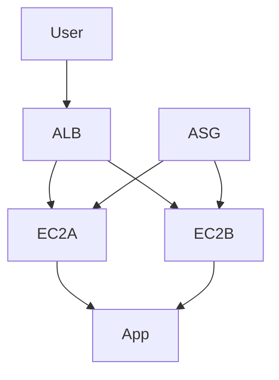

# Load Balancer & Auto Scaling — Scalabilité AWS

## Objectifs pédagogiques

- Comprendre le rôle des Load Balancers AWS
- Différencier ALB, NLB et CLB
- Mettre en place un Auto Scaling Group
- Configurer des health checks fiables
- Concevoir une architecture scalable et résiliente

## Contexte et problématique

Problème :

- Une seule instance = SPOF (Single Point of Failure)
- Impossible de gérer des pics de trafic
- Mauvaise expérience utilisateur

Solution AWS :

- Load Balancer pour distribuer le trafic
- Auto Scaling pour adapter la capacité

## Architecture

| Composant | Rôle | Exemple |
|-----------|------|---------|
| ALB | HTTP/HTTPS | Web app |
| NLB | TCP/UDP | low latency |
| Target Group | backend instances | EC2 |
| ASG | scaling automatique | EC2 group |



## Commandes essentielles

```bash
aws elbv2 describe-load-balancers
```

```bash
aws autoscaling describe-auto-scaling-groups
```

```bash
aws autoscaling set-desired-capacity --auto-scaling-group-name <NAME> --desired-capacity <N>
```

## Fonctionnement interne

1. Le Load Balancer reçoit le trafic
2. Il distribue vers les instances (target group)
3. Health check vérifie la santé
4. Auto Scaling ajuste le nombre d’instances

🧠 Concept clé  
→ Scalabilité horizontale = ajouter des instances

💡 Astuce  
→ Toujours utiliser ALB pour HTTP moderne

⚠️ Erreur fréquente  
→ Health check mal configuré  
→ Résultat : instances supprimées inutilement

## Cas réel en entreprise

Contexte :

Site e-commerce avec pics de trafic.

Solution :

- ALB en front
- ASG derrière
- Scaling basé sur CPU

Résultat :

- Support du trafic élevé
- Coût optimisé

## Bonnes pratiques

- Utiliser ALB pour apps web
- Configurer health check précis
- Définir min/max instances
- Utiliser scaling basé sur métriques
- Séparer instances stateless
- Monitorer via CloudWatch
- Tester le scaling

## Résumé

Le Load Balancer distribue le trafic.  
Auto Scaling adapte les ressources.  
Ensemble, ils permettent une architecture scalable et résiliente.

---

## SNIPPETS DE RÉVISION

<!-- snippet
id: aws_alb_definition
type: concept
tech: aws
level: intermediate
importance: high
format: knowledge
tags: aws,alb,network
title: ALB rôle
content: ALB distribue le trafic HTTP/HTTPS vers plusieurs instances backend
description: Base du load balancing AWS
-->

<!-- snippet
id: aws_autoscaling_definition
type: concept
tech: aws
level: intermediate
importance: high
format: knowledge
tags: aws,autoscaling,scaling
title: Auto Scaling rôle
content: Auto Scaling ajuste automatiquement le nombre d'instances selon la charge
description: Élément clé scalabilité
-->

<!-- snippet
id: aws_health_check_warning
type: warning
tech: aws
level: intermediate
importance: high
format: knowledge
tags: aws,elb,error
title: Mauvais health check
content: Un health check mal configuré supprime des instances saines, vérifier endpoint et délais
description: Piège critique en prod
-->

<!-- snippet
id: aws_elb_command
type: command
tech: aws
level: intermediate
importance: medium
format: knowledge
tags: aws,cli,elb
title: Lister load balancers
command: aws elbv2 describe-load-balancers
description: Permet de voir les load balancers AWS
-->

<!-- snippet
id: aws_scaling_tip
type: tip
tech: aws
level: intermediate
importance: medium
format: knowledge
tags: aws,scaling,architecture
title: Instances stateless
content: Utiliser des instances stateless permet un scaling efficace sans dépendance locale
description: Bonne pratique architecture
-->

<!-- snippet
id: aws_scaling_error
type: warning
tech: aws
level: intermediate
importance: high
format: knowledge
tags: aws,scaling,incident
title: Pas de scaling
content: Symptôme surcharge serveur, cause absence autoscaling, correction mettre ASG
description: Problème fréquent prod
-->
