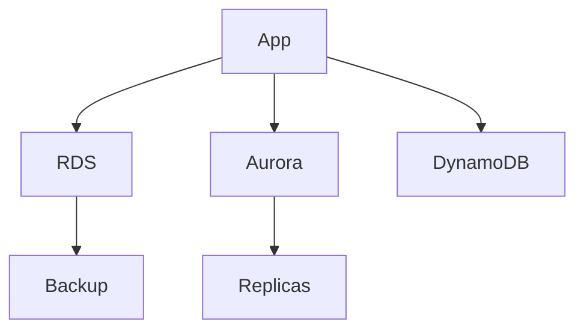

# Bases de données AWS — RDS, Aurora, DynamoDB

## Objectifs pédagogiques

- Comprendre les différences entre RDS, Aurora et DynamoDB
- Choisir la bonne base selon le besoin
- Configurer la haute disponibilité des bases
- Comprendre read replicas et Multi-AZ
- Diagnostiquer des problèmes de performance DB

## Contexte et problématique

Les bases de données sont critiques :

- Disponibilité
- Performance
- Cohérence

AWS propose plusieurs solutions selon les besoins :

- SQL classique → RDS / Aurora
- NoSQL → DynamoDB

## Architecture

| Service | Type | Usage |
|--------|------|------|
| RDS | SQL managé | MySQL, PostgreSQL |
| Aurora | SQL optimisé AWS | haute performance |
| DynamoDB | NoSQL | scalable massif |



## Commandes essentielles

```bash
aws rds describe-db-instances
```

```bash
aws dynamodb list-tables
```

```bash
aws rds create-db-instance --db-instance-identifier <NAME>
```

## Fonctionnement interne

### RDS
- DB managée
- backups automatiques
- Multi-AZ

### Aurora
- stockage distribué
- performance élevée
- failover rapide

### DynamoDB
- NoSQL
- partitionnement automatique
- ultra scalable

🧠 Concept clé  
→ SQL vs NoSQL = modèle de données

💡 Astuce  
→ Aurora = souvent meilleur choix RDS

⚠️ Erreur fréquente  
→ utiliser SQL pour tout  
Correction : choisir selon use case

## Cas réel en entreprise

Contexte :

Application web scalable.

Solution :

- Aurora pour backend SQL
- DynamoDB pour sessions

Résultat :

- performance optimisée
- scalabilité élevée

## Bonnes pratiques

- Activer Multi-AZ
- Utiliser read replicas
- Sauvegarder régulièrement
- Monitorer performance
- Choisir bon engine
- Sécuriser accès DB
- Optimiser requêtes

## Résumé

AWS propose plusieurs types de bases selon les besoins.  
RDS et Aurora pour SQL, DynamoDB pour NoSQL.  
Le choix impacte fortement performance et scalabilité.

---

## SNIPPETS DE RÉVISION

<!-- snippet
id: aws_rds_definition
type: concept
tech: aws
level: intermediate
importance: high
format: knowledge
tags: aws,rds,database
title: RDS définition
content: RDS est un service de base de données relationnelle managée par AWS
description: Base SQL AWS
-->

<!-- snippet
id: aws_aurora_advantage
type: concept
tech: aws
level: intermediate
importance: high
format: knowledge
tags: aws,aurora,database
title: Aurora avantage
content: Aurora offre de meilleures performances et une haute disponibilité native comparée à RDS classique
description: Optimisation AWS
-->

<!-- snippet
id: aws_dynamodb_definition
type: concept
tech: aws
level: intermediate
importance: high
format: knowledge
tags: aws,dynamodb,nosql
title: DynamoDB définition
content: DynamoDB est une base NoSQL entièrement managée et scalable automatiquement
description: Base NoSQL AWS
-->

<!-- snippet
id: aws_db_wrong_choice_warning
type: warning
tech: aws
level: intermediate
importance: high
format: knowledge
tags: aws,database,error
title: Mauvais choix DB
content: Utiliser une base SQL pour un besoin NoSQL limite la scalabilité, analyser le besoin avant
description: Erreur fréquente architecture
-->

<!-- snippet
id: aws_rds_command
type: command
tech: aws
level: intermediate
importance: medium
format: knowledge
tags: aws,rds,cli
title: Lister bases RDS
command: aws rds describe-db-instances
description: Permet de voir les instances RDS
-->

<!-- snippet
id: aws_db_scaling_tip
type: tip
tech: aws
level: intermediate
importance: medium
format: knowledge
tags: aws,database,scaling
title: Utiliser read replicas
content: Les read replicas permettent de répartir la charge de lecture et améliorer les performances
description: Bonne pratique DB
-->

<!-- snippet
id: aws_db_failure_error
type: error
tech: aws
level: intermediate
importance: high
format: knowledge
tags: aws,database,incident
title: DB indisponible
content: Symptôme DB inaccessible, cause absence Multi-AZ, correction activer haute disponibilité
description: Incident critique
-->
